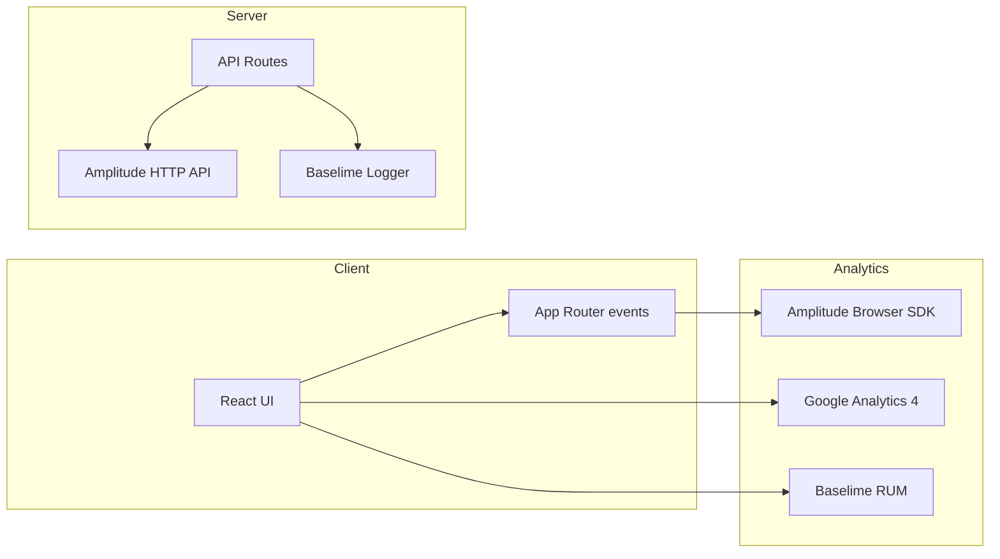

# Analytics & Monitoring System PRD

Target stack: **Amplitude** (custom events and funnels), **Google Analytics 4** (marketing/acquisition), **Baselime** (errors and logs; orthogonal to analytics). Remove PostHog and Sentry. No custom event storage in Supabase.

## 1. Context Analysis

- Codebase: Next.js (App Router) on Cloudflare Pages; no Amplitude/GA packages installed.
- Monitoring: Baselime is present (`BaselimeProvider`, `createLogger`, `withLogging`) but validation and broader usage are pending.
- Constraints: Workers runtime (prefer fetch-based SDKs/HTTP APIs), bundle size sensitivity, privacy/consent expectations, no PII leakage.

## 1.1 Goals

1. **General analytics:** GA4 for page views and acquisition/marketing metrics.
2. **Custom events & user flows:** Amplitude for product events (funnels, cohorts, feature usage).
3. **Error logging & reliability:** Baselime for client RUM and server logs/errors.

## 2. Problem Statement

We lack reliable product analytics and marketing attribution. Baselime covers errors/logs, but there is no product funnel tracking, no campaign attribution, and no unified analytics service. PostHog and Sentry plans are deprecated.

## 3. Proposed Solution

- **Amplitude** for product analytics (funnels, cohorts, feature usage); all custom events go to Amplitude by default (client SDK + optional HTTP API for server-confirmed events).
- **Google Analytics 4** for marketing traffic, acquisition, and SEO reporting (page views, general site metrics).
- **Baselime** for error monitoring and structured logging (client RUM + server logger); not redundant because it covers reliability/observability rather than product analytics.
- **No database storage of events**: rely on Amplitude + GA only; Supabase not used for analytics storage.

### Architecture



### Key Decisions

| Decision                            | Rationale                                                                                  |
| ----------------------------------- | ------------------------------------------------------------------------------------------ |
| **Amplitude over PostHog/Mixpanel** | Strong funnels/cohorts, reliable HTTP API, lightweight client, fits Cloudflare.            |
| **GA4 for marketing**               | Standard for acquisition and SEO reporting; free; complements Amplitude product analytics. |
| **Keep Baselime**                   | Covers errors/logs; complements analytics rather than duplicating it.                      |
| **Skip DB storage**                 | Reduce complexity and cost; rely on Amplitude/GA as sources of truth.                      |
| **Consent-aware loading**           | Respect privacy and avoid blocked script errors.                                           |

## 4. Implementation Spec

### A. Analytics Service (client + server)

- Add `src/lib/analytics/analyticsService.ts` with a single `trackEvent({ name, properties, userId, sessionId, source })` that submits to Amplitude.
- Client: wrap Amplitude Browser SDK; init only when consent is granted and a key exists.
- Server: fetch-based Amplitude HTTP API for critical events (payments, auth, credits) to ensure delivery even if client is blocked.
- Baselime logger (debug level) for analytics failures without spamming production logs; still used for errors/logs, not for product analytics.

### B. Client provider

- `AnalyticsProvider`:
  - Listen to App Router navigation for `page_view` events (Amplitude + GA).
  - Identify authenticated users (user id, email hash; avoid raw PII).
  - Honor opt-out/consent via localStorage flag; hard-disable SDKs when opted-out or keys missing.

### C. Google Analytics 4

- Add `gtag.js` snippet in `app/layout.tsx` gated by `NEXT_PUBLIC_GA_MEASUREMENT_ID`.
- Send virtual page views on route change to prevent double counts.
- Do not attach user PII; rely on GA defaults.

### D. Baselime usage

- Keep `BaselimeProvider` for client RUM; ensure it is enabled only when keys are present and not in local dev (current behavior).
- Wrap all API routes that handle payments/auth/uploads with `withLogging` to capture request/response context.
- Add a lightweight heartbeat/metrics log around analytics API calls for debugging ingestion issues.

### E. API endpoint for custom events

- `app/api/analytics/event/route.ts`:
  - Body `{ eventName, properties }`, validated by Zod.
  - Auth required for user-linked events; anonymous allowed for marketing funnel with session id.
  - Calls `trackEvent` (Amplitude HTTP). No database write.

### F. Environment variables

```bash
# Analytics
NEXT_PUBLIC_AMPLITUDE_API_KEY=your_amplitude_browser_key
AMPLITUDE_API_KEY=your_amplitude_http_api_key
NEXT_PUBLIC_GA_MEASUREMENT_ID=G-XXXXXXX

# Baselime (existing)
NEXT_PUBLIC_BASELIME_KEY=your_baselime_key
BASELIME_API_KEY=your_baselime_key
```

### F. Event taxonomy (initial)

- `page_view` (path, referrer, utm params)
- `signup_started`, `signup_completed`
- `subscription_created` (plan, amount_cents, billing_interval)
- `credit_pack_purchased` (pack, amount_cents)
- `image_upscaled` (input_size, output_size, model_version, duration_ms)
- `error_client` (message, component, stack_excerpt) → Baselime only
- `error_server` (route, status, request_id) → Baselime

## 5. Execution Plan

1. **Deprecate PostHog/Sentry**: remove references and avoid installing those SDKs.
2. **Amplitude + GA**: add env vars, client provider, router-based page views, server HTTP helper, and API relay route.
3. **Baselime validation**: ensure `withLogging` wraps critical API routes; verify RUM loads only when keys exist.
4. **Consent & QA**: implement opt-out toggle, validate events in Amplitude (live stream) and GA DebugView, confirm Baselime captures errors.

## 6. Testing Strategy

- Unit: mock Amplitude HTTP calls; ensure `trackEvent` fans out correctly; schema validation for `/api/analytics/event`.
- Integration: simulate page navigation and key events; verify receipt in Amplitude and GA DebugView.
- Baselime: trigger client error and API error; confirm appearance in Baselime console; ensure dev mode does not send without keys.
- Privacy: confirm no raw PII sent to GA/Amplitude; hashed identifiers only where needed.

## 7. Acceptance Criteria

- PostHog and Sentry removed from plan; Amplitude + GA are the only analytics tools.
- Amplitude receives page views and custom events (client) and server-critical events (HTTP API) to track user flows.
- GA records App Router page views without double counting for general/marketing analytics.
- Baselime captures client errors and server logs for analytics endpoints to satisfy error logging/observability.
- Consent/opt-out respected; SDKs disable when keys are missing or user opts out.

## 8. Rollback Plan

- Disable analytics by clearing `NEXT_PUBLIC_AMPLITUDE_API_KEY` and `NEXT_PUBLIC_GA_MEASUREMENT_ID`; keep Baselime for errors/logs.
- Remove analytics providers/snippets to fully stop client-side tracking; server calls stay gated by env keys.
