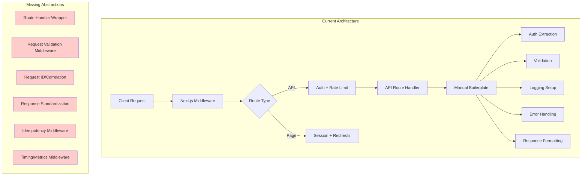
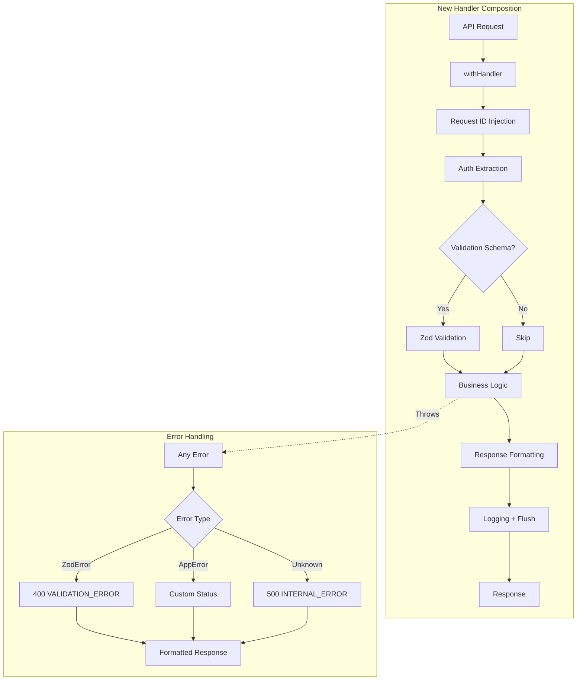
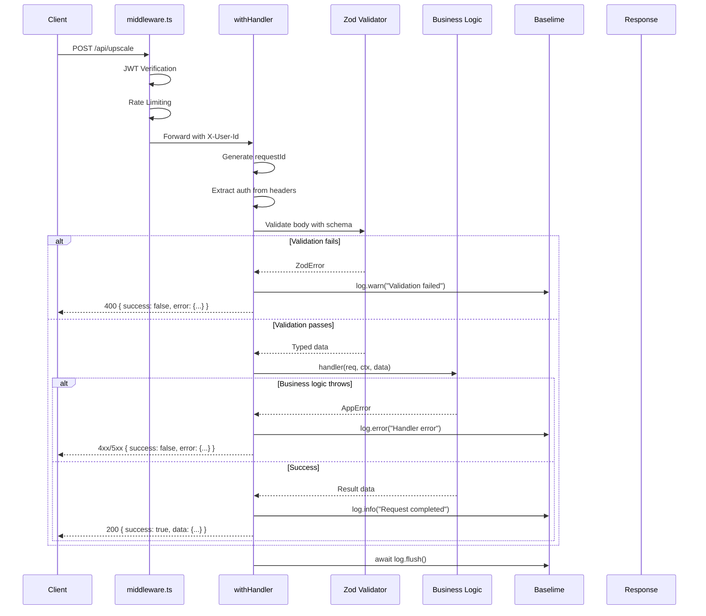

# API Handler Composition & Missing Middleware PRD

🧠 **Principal Architect Mode: Engaged. Analyzing codebase constraints...**

## 1. Context Analysis

### 1.1 Files Analyzed

- `/home/joao/projects/myimageupscaler.com/middleware.ts` - Main Next.js middleware
- `/home/joao/projects/myimageupscaler.com/server/rateLimit.ts` - Rate limiting implementation
- `/home/joao/projects/myimageupscaler.com/server/middleware/getAuthenticatedUser.ts` - User extraction helper
- `/home/joao/projects/myimageupscaler.com/server/monitoring/logger.ts` - Baselime logging utilities
- `/home/joao/projects/myimageupscaler.com/shared/utils/errors.ts` - Error handling utilities
- `/home/joao/projects/myimageupscaler.com/shared/validation/upscale.schema.ts` - Zod schema example
- `/home/joao/projects/myimageupscaler.com/app/api/upscale/route.ts` - Full-featured route example
- `/home/joao/projects/myimageupscaler.com/app/api/checkout/route.ts` - Payment route
- `/home/joao/projects/myimageupscaler.com/app/api/portal/route.ts` - Billing portal route
- `/home/joao/projects/myimageupscaler.com/app/api/analytics/event/route.ts` - Analytics route
- `/home/joao/projects/myimageupscaler.com/app/api/webhooks/stripe/route.ts` - Webhook handler
- `/home/joao/projects/myimageupscaler.com/app/api/protected/example/route.ts` - Example protected route

### 1.2 Component & Dependency Overview



### 1.3 Current Behavior Summary

**Strengths (What Exists):**

- Next.js middleware handles JWT verification and cookie-based auth
- Three-tier rate limiting (public: 10/10s, authenticated: 50/10s, upscale: 5/60s)
- Security headers applied globally (CSP, X-Frame-Options, etc.)
- User context passed via X-User-Id, X-User-Email headers
- Standardized error utilities (`createErrorResponse`, `ErrorCodes`)
- Baselime logging with namespace support

**Weaknesses (Repeated Patterns):**

1. **Auth extraction duplicated** - Every protected route extracts X-User-Id manually
2. **Validation inconsistent** - Some routes use Zod, others do manual checks
3. **Logging boilerplate** - Every route creates logger, wraps in try-catch, flushes in finally
4. **No request tracing** - No correlation ID to trace requests across services
5. **Redundant auth in some routes** - checkout/portal verify JWT despite middleware
6. **Response format varies** - No consistent envelope structure

**Code Duplication Analysis:**

| Pattern                         | Routes Using It  | Lines per Route |
| ------------------------------- | ---------------- | --------------- |
| Logger creation + flush         | 4 routes         | ~15 lines       |
| Auth extraction                 | 6 routes         | ~5 lines        |
| Try-catch wrapper               | All routes       | ~10 lines       |
| Zod validation + error handling | 2 routes         | ~20 lines       |
| Rate limit check + 429 response | 1 route (manual) | ~15 lines       |

**Estimated Savings:** 50-70 lines per route with proper composition.

### 1.4 Problem Statement

The API codebase suffers from significant code duplication and inconsistent patterns across route handlers. Each route manually implements authentication extraction, input validation, logging, error handling, and response formatting. This violates DRY principles, increases bug surface area, and makes it harder to enforce consistent behavior across all endpoints.

---

## 2. Proposed Solution

### 2.1 Architecture Summary

- **Create `withHandler` composition utility** - Higher-order function that wraps route handlers with common concerns
- **Create typed request validation layer** - Automatic Zod validation with type inference
- **Add request ID middleware** - Generate and propagate correlation IDs for tracing
- **Standardize response envelope** - Consistent `{ success, data }` or `{ success, error }` format
- **Add idempotency support** - Optional idempotency key handling for mutations
- **Add request timing** - Automatic duration tracking and logging

**Alternatives Considered:**

| Approach                           | Pros                             | Cons                             | Decision         |
| ---------------------------------- | -------------------------------- | -------------------------------- | ---------------- |
| **Express-style middleware chain** | Familiar pattern                 | Not native to Next.js App Router | Rejected         |
| **tRPC**                           | Type-safe, composable            | Large dependency, learning curve | Rejected for now |
| **Hono**                           | Lightweight, middleware-friendly | Another framework to learn       | Rejected         |
| **Custom composition**             | Native to Next.js, zero deps     | Requires careful design          | **Selected**     |

### 2.2 Architecture Diagram



### 2.3 Key Technical Decisions

| Decision                         | Rationale                                            |
| -------------------------------- | ---------------------------------------------------- |
| **Composition over inheritance** | Functional approach aligns with project patterns     |
| **Generic type inference**       | Full TypeScript support for validated request bodies |
| **Optional layers**              | Each middleware concern is opt-in via config         |
| **Request ID in headers**        | Standard `X-Request-Id` header for tracing           |
| **Idempotency via header**       | Standard `Idempotency-Key` header pattern            |

### 2.4 Data Model Changes

**No database changes required.**

New types added to `shared/types`:

```typescript
// shared/types/api.ts
interface IApiContext {
  requestId: string;
  userId?: string;
  userEmail?: string;
  startTime: number;
}

interface IApiResponse<T> {
  success: true;
  data: T;
  requestId: string;
}

interface IApiErrorResponse {
  success: false;
  error: {
    code: string;
    message: string;
    details?: Record<string, unknown>;
    requestId: string;
  };
}
```

---

### 2.5 Runtime Execution Flow



---

## 3. Detailed Implementation Spec

### A. `server/api/withHandler.ts`

**New file** - Main composition utility

**Responsibilities:**

- Generate and inject request ID
- Extract authenticated user from middleware headers
- Run Zod validation if schema provided
- Wrap business logic in try-catch
- Format consistent response envelope
- Handle logging lifecycle

**Implementation:**

```typescript
import { NextRequest, NextResponse } from 'next/server';
import { ZodSchema, ZodError, z } from 'zod';
import { createLogger, BaselimeLogger } from '@server/monitoring/logger';
import { createErrorResponse, ErrorCodes, IErrorResponse } from '@shared/utils/errors';
import { nanoid } from 'nanoid';

// Context passed to every handler
export interface IApiContext {
  requestId: string;
  userId: string | null;
  userEmail: string | null;
  startTime: number;
  logger: BaselimeLogger;
}

// Configuration for the handler wrapper
export interface IHandlerConfig<TBody = unknown> {
  /** Namespace for logging (e.g., 'upscale-api', 'checkout') */
  namespace: string;
  /** Zod schema for request body validation (optional for GET requests) */
  schema?: ZodSchema<TBody>;
  /** Whether authentication is required (default: true) */
  requireAuth?: boolean;
  /** Custom rate limiter to apply (in addition to middleware) */
  rateLimiter?: (userId: string) => Promise<{ success: boolean; remaining: number; reset: number }>;
}

// Handler function signature with typed body
type HandlerFn<TBody, TResult> = (
  req: NextRequest,
  ctx: IApiContext,
  body: TBody
) => Promise<TResult>;

/**
 * Wraps an API route handler with standard cross-cutting concerns:
 * - Request ID generation
 * - Authentication extraction
 * - Input validation
 * - Error handling
 * - Logging lifecycle
 * - Response formatting
 */
export function withHandler<TBody = unknown, TResult = unknown>(
  config: IHandlerConfig<TBody>,
  handler: HandlerFn<TBody, TResult>
) {
  return async (req: NextRequest): Promise<NextResponse> => {
    const requestId = req.headers.get('X-Request-Id') ?? nanoid(12);
    const startTime = Date.now();
    const logger = createLogger(req, config.namespace);

    // Create context
    const ctx: IApiContext = {
      requestId,
      userId: req.headers.get('X-User-Id'),
      userEmail: req.headers.get('X-User-Email'),
      startTime,
      logger,
    };

    try {
      // Auth check (if required)
      if (config.requireAuth !== false && !ctx.userId) {
        logger.warn('Unauthorized request', { requestId });
        const { body, status } = createErrorResponse(
          ErrorCodes.UNAUTHORIZED,
          'Authentication required',
          401,
          { requestId }
        );
        return NextResponse.json(body, { status, headers: { 'X-Request-Id': requestId } });
      }

      // Rate limiting (if custom limiter provided)
      if (config.rateLimiter && ctx.userId) {
        const { success, remaining, reset } = await config.rateLimiter(ctx.userId);
        if (!success) {
          logger.warn('Rate limit exceeded', { requestId, userId: ctx.userId });
          const { body, status } = createErrorResponse(
            ErrorCodes.RATE_LIMITED,
            'Rate limit exceeded. Please try again later.',
            429,
            { requestId, retryAfter: Math.ceil((reset - Date.now()) / 1000) }
          );
          return NextResponse.json(body, {
            status,
            headers: {
              'X-Request-Id': requestId,
              'X-RateLimit-Remaining': remaining.toString(),
              'X-RateLimit-Reset': new Date(reset).toISOString(),
              'Retry-After': Math.ceil((reset - Date.now()) / 1000).toString(),
            },
          });
        }
      }

      // Parse and validate body
      let validatedBody: TBody = {} as TBody;
      if (config.schema) {
        const rawBody = await req.json().catch(() => ({}));
        const parseResult = config.schema.safeParse(rawBody);

        if (!parseResult.success) {
          logger.warn('Validation failed', {
            requestId,
            errors: parseResult.error.flatten(),
          });
          const { body, status } = createErrorResponse(
            ErrorCodes.VALIDATION_ERROR,
            'Invalid request data',
            400,
            { requestId, validationErrors: parseResult.error.flatten() }
          );
          return NextResponse.json(body, { status, headers: { 'X-Request-Id': requestId } });
        }

        validatedBody = parseResult.data;
      }

      // Execute business logic
      logger.info('Processing request', {
        requestId,
        userId: ctx.userId,
        method: req.method,
        path: req.nextUrl.pathname,
      });

      const result = await handler(req, ctx, validatedBody);
      const durationMs = Date.now() - startTime;

      logger.info('Request completed', {
        requestId,
        userId: ctx.userId,
        durationMs,
      });

      // Return success response
      return NextResponse.json(
        { success: true, data: result, requestId },
        { status: 200, headers: { 'X-Request-Id': requestId } }
      );
    } catch (error) {
      const durationMs = Date.now() - startTime;

      // Handle known error types
      if (error instanceof ZodError) {
        logger.warn('Unexpected ZodError in handler', { requestId, error: error.flatten() });
        const { body, status } = createErrorResponse(
          ErrorCodes.VALIDATION_ERROR,
          'Invalid request data',
          400,
          { requestId, validationErrors: error.flatten() }
        );
        return NextResponse.json(body, { status, headers: { 'X-Request-Id': requestId } });
      }

      // Handle AppError (custom errors with status codes)
      if (error instanceof Error && 'code' in error && 'statusCode' in error) {
        const appError = error as {
          code: string;
          statusCode: number;
          message: string;
          details?: unknown;
        };
        logger.error('Application error', {
          requestId,
          code: appError.code,
          message: appError.message,
          durationMs,
        });
        const { body, status } = createErrorResponse(
          appError.code,
          appError.message,
          appError.statusCode,
          { requestId, ...((appError.details as object) ?? {}) }
        );
        return NextResponse.json(body, { status, headers: { 'X-Request-Id': requestId } });
      }

      // Handle unknown errors
      const message = error instanceof Error ? error.message : 'Unknown error';
      logger.error('Unhandled error', {
        requestId,
        error: message,
        stack: error instanceof Error ? error.stack : undefined,
        durationMs,
      });

      const { body, status } = createErrorResponse(
        ErrorCodes.INTERNAL_ERROR,
        'An unexpected error occurred',
        500,
        { requestId }
      );
      return NextResponse.json(body, { status, headers: { 'X-Request-Id': requestId } });
    } finally {
      await logger.flush();
    }
  };
}

/**
 * Helper for GET handlers (no body validation)
 */
export function withGetHandler<TResult = unknown>(
  config: Omit<IHandlerConfig, 'schema'>,
  handler: (req: NextRequest, ctx: IApiContext) => Promise<TResult>
) {
  return withHandler<undefined, TResult>({ ...config, schema: undefined }, (req, ctx) =>
    handler(req, ctx)
  );
}
```

**Justification:** Single entry point for all route concerns; eliminates 50+ lines of boilerplate per route.

---

### B. `server/api/withIdempotency.ts`

**New file** - Idempotency key handling for mutations

**Responsibilities:**

- Extract `Idempotency-Key` header
- Store results in memory (or external cache)
- Return cached result for duplicate requests

**Implementation:**

```typescript
import { NextRequest, NextResponse } from 'next/server';

// In-memory cache (upgrade to Redis/KV for production)
const idempotencyCache = new Map<string, { response: unknown; timestamp: number }>();

// Cleanup old entries every 5 minutes
setInterval(
  () => {
    const oneHourAgo = Date.now() - 60 * 60 * 1000;
    for (const [key, entry] of idempotencyCache.entries()) {
      if (entry.timestamp < oneHourAgo) {
        idempotencyCache.delete(key);
      }
    }
  },
  5 * 60 * 1000
);

export interface IIdempotencyConfig {
  /** Header name to use (default: 'Idempotency-Key') */
  headerName?: string;
  /** TTL for cached responses in ms (default: 1 hour) */
  ttlMs?: number;
}

/**
 * Higher-order function that adds idempotency support to mutations.
 * Prevents duplicate operations when clients retry failed requests.
 */
export function withIdempotency<T extends (...args: never[]) => Promise<NextResponse>>(
  handler: T,
  config: IIdempotencyConfig = {}
): T {
  const headerName = config.headerName ?? 'Idempotency-Key';
  const ttlMs = config.ttlMs ?? 60 * 60 * 1000; // 1 hour default

  return (async (req: NextRequest, ...rest: unknown[]) => {
    const idempotencyKey = req.headers.get(headerName);

    // No idempotency key = no caching
    if (!idempotencyKey) {
      return handler(req, ...rest);
    }

    // Check cache
    const cached = idempotencyCache.get(idempotencyKey);
    if (cached && Date.now() - cached.timestamp < ttlMs) {
      // Return cached response
      return NextResponse.json(cached.response, {
        status: 200,
        headers: { 'X-Idempotent-Replayed': 'true' },
      });
    }

    // Execute handler
    const response = await handler(req, ...rest);

    // Cache successful responses only
    if (response.status >= 200 && response.status < 300) {
      const body = await response.clone().json();
      idempotencyCache.set(idempotencyKey, {
        response: body,
        timestamp: Date.now(),
      });
    }

    return response;
  }) as T;
}
```

**Justification:** Prevents duplicate charges, duplicate resource creation during network retries.

---

### C. `server/api/requestId.ts`

**New file** - Request ID utilities

**Responsibilities:**

- Generate unique request IDs
- Extract from incoming headers
- Propagate to outgoing requests

**Implementation:**

```typescript
import { NextRequest, NextResponse } from 'next/server';
import { nanoid } from 'nanoid';

const REQUEST_ID_HEADER = 'X-Request-Id';

/**
 * Generate or extract request ID from headers
 */
export function getRequestId(req: NextRequest): string {
  return req.headers.get(REQUEST_ID_HEADER) ?? nanoid(12);
}

/**
 * Add request ID to response headers
 */
export function addRequestIdHeader(res: NextResponse, requestId: string): NextResponse {
  res.headers.set(REQUEST_ID_HEADER, requestId);
  return res;
}

/**
 * Create headers object for outgoing fetch requests
 */
export function createOutgoingHeaders(requestId: string): Record<string, string> {
  return { [REQUEST_ID_HEADER]: requestId };
}
```

**Justification:** Enables end-to-end request tracing across services and logs.

---

### D. `shared/validation/schemas/index.ts`

**New file** - Centralized validation schemas

**Responsibilities:**

- Export all Zod schemas from one location
- Ensure consistent validation patterns

**Implementation:**

```typescript
export { upscaleSchema, type IUpscaleInput } from './upscale.schema';

// Add more schemas as they're created
export { checkoutSchema, type ICheckoutInput } from './checkout.schema';
export { portalSchema, type IPortalInput } from './portal.schema';
```

---

### E. `shared/validation/schemas/checkout.schema.ts`

**New file** - Checkout request validation

```typescript
import { z } from 'zod';

export const checkoutSchema = z.object({
  priceId: z.string().min(1, 'Price ID is required'),
  successUrl: z.string().url().optional(),
  cancelUrl: z.string().url().optional(),
});

export type ICheckoutInput = z.infer<typeof checkoutSchema>;
```

---

### F. `shared/validation/schemas/portal.schema.ts`

**New file** - Portal request validation (minimal, just for consistency)

```typescript
import { z } from 'zod';

export const portalSchema = z.object({
  returnUrl: z.string().url().optional(),
});

export type IPortalInput = z.infer<typeof portalSchema>;
```

---

### G. Refactored `app/api/upscale/route.ts` (Example Migration)

**Changes Needed:**

- Remove manual auth extraction
- Remove manual try-catch wrapper
- Remove manual logger creation
- Use `withHandler` composition

**Before (150 lines):**

```typescript
// Current implementation with ~50 lines of boilerplate
```

**After (~60 lines):**

```typescript
import { NextRequest } from 'next/server';
import { withHandler, IApiContext } from '@server/api/withHandler';
import { upscaleSchema, IUpscaleInput } from '@shared/validation/schemas';
import { upscaleRateLimit } from '@server/rateLimit';
import {
  ImageGenerationService,
  InsufficientCreditsError,
  AIGenerationError,
} from '@server/services/image-generation.service';
import { trackServerEvent } from '@server/analytics';
import { serverEnv } from '@shared/config/env';

export const runtime = 'nodejs';
export const maxDuration = 60;

export const POST = withHandler<IUpscaleInput, { imageData: string; creditsRemaining: number }>(
  {
    namespace: 'upscale-api',
    schema: upscaleSchema,
    requireAuth: true,
    rateLimiter: upscaleRateLimit.limit,
  },
  async (req: NextRequest, ctx: IApiContext, data: IUpscaleInput) => {
    const { userId, requestId, logger } = ctx;

    // Business logic only - no boilerplate!
    const imageService = new ImageGenerationService(userId!);
    const result = await imageService.upscaleImage(data.imageData, data.mimeType, data.config);

    // Track analytics
    await trackServerEvent(
      'image_upscaled',
      {
        scaleFactor: data.config.scale,
        mode: data.config.mode,
        durationMs: Date.now() - ctx.startTime,
      },
      { apiKey: serverEnv.AMPLITUDE_API_KEY!, userId: userId! }
    );

    return {
      imageData: result.imageData,
      creditsRemaining: result.creditsRemaining,
    };
  }
);
```

**Justification:** 60% reduction in code; all cross-cutting concerns handled by wrapper.

---

## 4. Step-by-Step Execution Plan

### Phase 1: Core Infrastructure

- [ ] Install `nanoid` for request ID generation: `yarn add nanoid`
- [ ] Create `server/api/withHandler.ts` with full composition logic
- [ ] Create `server/api/requestId.ts` with ID utilities
- [ ] Create `shared/types/api.ts` with response types
- [ ] Add unit tests for `withHandler` covering auth, validation, errors

### Phase 2: Validation Schemas

- [ ] Move `upscale.schema.ts` to `shared/validation/schemas/`
- [ ] Create `checkout.schema.ts` with Zod schema
- [ ] Create `portal.schema.ts` with Zod schema
- [ ] Create `analytics-event.schema.ts` (already exists, verify location)
- [ ] Export all from `shared/validation/schemas/index.ts`

### Phase 3: Migrate Routes (Priority Order)

- [ ] Migrate `/api/upscale/route.ts` to use `withHandler`
- [ ] Migrate `/api/checkout/route.ts` to use `withHandler`
- [ ] Migrate `/api/portal/route.ts` to use `withHandler`
- [ ] Migrate `/api/protected/example/route.ts` to use `withHandler`
- [ ] Verify webhook routes (no migration needed - special auth)

### Phase 4: Idempotency (Optional)

- [ ] Create `server/api/withIdempotency.ts`
- [ ] Apply to checkout route (prevents duplicate charges)
- [ ] Add integration tests for idempotency behavior

### Phase 5: Documentation

- [ ] Update `docs/guides/api-middleware.md` with `withHandler` usage
- [ ] Add examples for creating new protected routes
- [ ] Document migration path for existing routes

---

## 5. Testing Strategy

### Unit Tests

**Functions to cover:**

| Function          | Test Cases                                                |
| ----------------- | --------------------------------------------------------- |
| `withHandler`     | Auth required/optional, schema validation, error handling |
| `getRequestId`    | Generate new, extract from header                         |
| `withIdempotency` | Cache hit, cache miss, TTL expiry                         |

**Error scenarios:**

| Scenario                         | Expected Behavior          |
| -------------------------------- | -------------------------- |
| Missing auth (requireAuth: true) | 401 with requestId         |
| Invalid body (schema provided)   | 400 with validation errors |
| Handler throws ZodError          | 400 with validation errors |
| Handler throws AppError          | Custom status code         |
| Handler throws Error             | 500 with requestId         |

### Integration Tests

**End-to-end flows:**

1. **Full request lifecycle:**
   - Send request with valid JWT
   - Verify request ID in response headers
   - Verify response envelope structure
   - Verify logs contain requestId

2. **Validation failure:**
   - Send invalid body
   - Verify 400 response
   - Verify validation errors in response

3. **Idempotency (if implemented):**
   - Send POST with Idempotency-Key
   - Verify first request executes
   - Verify second request returns cached response
   - Verify `X-Idempotent-Replayed` header

### Edge Cases

| Scenario                       | Expected Behavior           |
| ------------------------------ | --------------------------- |
| Request ID already in header   | Use existing ID (propagate) |
| Empty request body with schema | Validation error            |
| GET request with schema        | Schema ignored              |
| Rate limiter throws            | 500 error (not 429)         |
| Logger flush fails             | Request still completes     |

---

## 6. Acceptance Criteria

- [ ] All protected routes use `withHandler` wrapper
- [ ] Request ID present in all API response headers
- [ ] Consistent response envelope: `{ success, data/error, requestId }`
- [ ] Validation errors return structured format with field-level details
- [ ] ~50 lines of code removed per migrated route
- [ ] All existing tests pass after migration
- [ ] New unit tests cover `withHandler` edge cases
- [ ] Baselime logs include requestId for all entries
- [ ] No regression in API response times (< 5ms overhead)

---

## 7. Verification & Rollback

### Success Criteria

**Metrics:**

- Request ID present in 100% of API responses
- Validation error rate unchanged (no regressions)
- p99 latency < 5ms increase from wrapper overhead

**Logs:**

- All log entries include `requestId` field
- Error logs include stack traces
- Duration logged for all completed requests

**Benchmarks:**

- `withHandler` adds < 2ms overhead per request
- Memory footprint unchanged (no leaks from closures)

### Rollback Plan

1. **Full rollback:** Revert commits, routes return to manual implementation
2. **Partial rollback:** Remove `withHandler` from specific routes if issues
3. **Feature flag:** Add `USE_HANDLER_WRAPPER=false` to disable globally

---

## 8. Future Considerations

### Not In Scope (But Worth Tracking)

| Feature                       | Reason to Defer                                                 |
| ----------------------------- | --------------------------------------------------------------- |
| **Distributed rate limiting** | In-memory works for now; needs Cloudflare KV for multi-instance |
| **Request body logging**      | Privacy concerns; needs PII redaction first                     |
| **Automatic retry logic**     | Complex; better handled client-side                             |
| **OpenTelemetry tracing**     | Overkill for current scale                                      |
| **API versioning middleware** | No breaking changes planned                                     |

### Dependencies on Other Systems

- Baselime logger must support flush in async context
- Error utilities must export AppError class properly
- Rate limiter interface must return `{ success, remaining, reset }`

---

## Anti-Patterns Avoided

✅ **No redundant auth checks:** Wrapper trusts middleware headers
✅ **No over-abstraction:** Single wrapper, not middleware chain
✅ **No implicit behavior:** All options explicit in config
✅ **No breaking changes:** Old routes work until migrated
✅ **No magic strings:** Error codes from constants
✅ **No silent failures:** All errors logged with requestId
