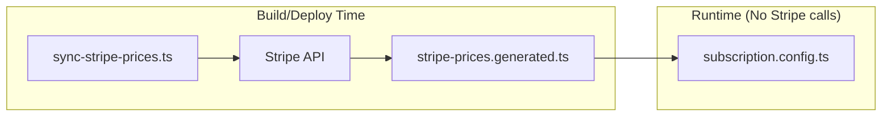

# PRD: Dynamic Stripe Price Resolution (Build-Time)

## Complexity: 4 → MEDIUM mode

## 1. Context

**Problem:** Stripe price IDs are hardcoded in `subscription.config.ts` and `env.ts`, requiring manual code updates whenever prices change in Stripe.

**Files Analyzed:**

- `shared/config/subscription.config.ts` - Hardcoded price IDs for 4 plans + 3 credit packs
- `shared/config/subscription.utils.ts` - Builds price index from config
- `shared/config/env.ts` - Duplicate hardcoded price IDs (lines 172-175)
- `server/stripe/config.ts` - Stripe client initialization
- `scripts/stripe-setup.sh` - Existing Stripe product creation script

**Current Behavior:**

- Price IDs hardcoded in `subscription.config.ts` (e.g., `price_1Sq14eALMLhQocpf5CXIwYSv`)
- Same price IDs duplicated in `env.ts` as defaults
- Any Stripe price change requires finding and updating hardcoded IDs
- Mismatch between Stripe and config causes "No such price" errors

---

## 2. Solution

**Approach:**

- Fetch prices from Stripe API at **build/deploy time**
- Generate a `stripe-prices.generated.ts` config file with resolved price IDs
- Match prices to plans using Stripe product metadata (`plan_key: starter`)
- Zero runtime Stripe API calls (ideal for Cloudflare Workers 10ms limit)
- Price changes require running sync script + redeploy

**Architecture Diagram:**



**Key Decisions:**

- [x] Build-time fetch - no runtime API calls, no cache management
- [x] Generated TypeScript file - type-safe, version controlled
- [x] Product metadata for matching: `plan_key`, `pack_key`
- [x] Script integrated into `yarn build` or run manually
- [x] Fallback to hardcoded IDs if generated file missing (dev safety)

**Data Changes:** None - Stripe products need metadata added (one-time setup)

---

## 3. Execution Phases

### Phase 1: Add Metadata to Stripe Products

**Files (1):**

- `scripts/stripe-add-metadata.ts` - One-time setup script

**Implementation:**

- [ ] Create script that uses Stripe API to update existing product metadata
- [ ] Add `plan_key` to subscription products: `starter`, `hobby`, `pro`, `business`
- [ ] Add `pack_key` to credit pack products: `small`, `medium`, `large`
- [ ] Script is idempotent (safe to run multiple times)
- [ ] Print summary of updated products

**Stripe Product Metadata Schema:**

```
Subscription Products:
  product.metadata.plan_key = 'starter' | 'hobby' | 'pro' | 'business'

Credit Pack Products:
  product.metadata.pack_key = 'small' | 'medium' | 'large'
```

**Tests Required:**
| Test File | Test Name | Assertion |
|-----------|-----------|-----------|
| N/A (one-time script) | Manual verification | Products have correct metadata in Stripe Dashboard |

**User Verification:**

- Action: Run `npx tsx scripts/stripe-add-metadata.ts`
- Expected: Output shows products updated with metadata

---

### Phase 2: Create Price Sync Script

**Files (2):**

- `scripts/sync-stripe-prices.ts` - Fetch prices and generate config
- `shared/config/stripe-prices.generated.ts` - Generated output (gitignored initially for safety)

**Implementation:**

- [ ] Fetch all active prices from Stripe with expanded product data
- [ ] Match prices to plan/pack keys via `product.metadata.plan_key` or `pack_key`
- [ ] Generate TypeScript file with price ID map:

```typescript
// AUTO-GENERATED - DO NOT EDIT
// Run `yarn sync:stripe` to regenerate
export const STRIPE_PRICE_IDS = {
  plans: {
    starter: 'price_xxx',
    hobby: 'price_xxx',
    pro: 'price_xxx',
    business: 'price_xxx',
  },
  packs: {
    small: 'price_xxx',
    medium: 'price_xxx',
    large: 'price_xxx',
  },
  generatedAt: '2024-01-15T12:00:00Z',
} as const;
```

- [ ] Validate all expected keys are found (error if missing)
- [ ] Add `yarn sync:stripe` script to package.json

**Tests Required:**
| Test File | Test Name | Assertion |
|-----------|-----------|-----------|
| `tests/unit/scripts/sync-stripe-prices.unit.spec.ts` | `should generate valid TypeScript file` | File parses without errors |
| `tests/unit/scripts/sync-stripe-prices.unit.spec.ts` | `should map all plan keys` | All 4 plans have price IDs |
| `tests/unit/scripts/sync-stripe-prices.unit.spec.ts` | `should error on missing plan metadata` | Throws if plan_key not found |

**User Verification:**

- Action: Run `yarn sync:stripe`
- Expected: `shared/config/stripe-prices.generated.ts` created with valid price IDs

---

### Phase 3: Integrate Generated Prices with Config

**Files (3):**

- `shared/config/subscription.config.ts` - Import from generated file
- `shared/config/stripe-prices.generated.ts` - Commit generated file
- `.gitignore` - Remove generated file from gitignore (it should be committed)

**Implementation:**

- [ ] Import `STRIPE_PRICE_IDS` from generated file
- [ ] Update plan configs to use `STRIPE_PRICE_IDS.plans[key]` instead of hardcoded
- [ ] Update credit pack configs to use `STRIPE_PRICE_IDS.packs[key]`
- [ ] Add fallback for missing generated file (dev environment safety):

```typescript
let STRIPE_PRICE_IDS: IStripePriceIds;
try {
  STRIPE_PRICE_IDS = require('./stripe-prices.generated').STRIPE_PRICE_IDS;
} catch {
  // Fallback for dev - will be overwritten by sync script
  STRIPE_PRICE_IDS = FALLBACK_PRICE_IDS;
}
```

- [ ] Commit generated file to repo (source of truth for deployments)

**Tests Required:**
| Test File | Test Name | Assertion |
|-----------|-----------|-----------|
| `tests/unit/subscription-config.unit.spec.ts` | `should load price IDs from generated file` | Price IDs match generated values |
| `tests/unit/subscription-config.unit.spec.ts` | `should have valid price IDs for all enabled plans` | No null/undefined price IDs |

**User Verification:**

- Action: Start dev server, navigate to `/pricing`
- Expected: Plans load correctly, checkout works

---

### Phase 4: Remove Duplicate Price IDs from env.ts

**Files (2):**

- `shared/config/env.ts` - Remove STRIPE\_\*\_PRICE_ID entries
- `shared/config/env.ts` - Remove from loadServerEnv() function

**Implementation:**

- [ ] Remove `STRIPE_STARTER_MONTHLYLY_PRICE_ID` from serverEnvSchema
- [ ] Remove `STRIPE_HOBBY_MONTHLYLY_PRICE_ID`
- [ ] Remove `STRIPE_PRO_MONTHLYLY_PRICE_ID`
- [ ] Remove `STRIPE_BUSINESS_MONTHLYLY_PRICE_ID`
- [ ] Remove corresponding entries from `loadServerEnv()` function (lines 261-268)
- [ ] Search codebase for any references to these env vars and update

**Tests Required:**
| Test File | Test Name | Assertion |
|-----------|-----------|-----------|
| N/A | `yarn verify` | Type checks pass, no references to removed env vars |

**User Verification:**

- Action: Run `yarn verify`
- Expected: All type checks and tests pass

---

### Phase 5: Add Sync to CI/CD (Optional)

**Files (1):**

- `package.json` - Add prebuild script or CI step

**Implementation:**

- [ ] Option A: Add to `prebuild` script in package.json
- [ ] Option B: Add as separate CI step before build
- [ ] Option C: Manual only (run before committing price changes)

**Recommended: Option C (Manual)** - Prices change rarely, keep it explicit:

```json
{
  "scripts": {
    "sync:stripe": "tsx scripts/sync-stripe-prices.ts"
  }
}
```

**Workflow:**

1. Change prices in Stripe Dashboard
2. Run `yarn sync:stripe`
3. Commit generated file
4. Deploy

**User Verification:**

- Action: Run `yarn sync:stripe && yarn verify`
- Expected: Generated file updated, all checks pass

---

## 4. Acceptance Criteria

- [ ] Stripe products have `plan_key` / `pack_key` metadata
- [ ] `yarn sync:stripe` fetches prices and generates TypeScript file
- [ ] `subscription.config.ts` uses generated price IDs
- [ ] No hardcoded price IDs in `env.ts`
- [ ] Zero runtime Stripe API calls for price resolution
- [ ] All tests pass
- [ ] `yarn verify` passes
- [ ] Pricing page works without "No such price" errors

---

## 5. Workflow After Implementation

```
Price Change Workflow:
1. Create/update price in Stripe Dashboard
2. Ensure product has correct metadata (plan_key or pack_key)
3. Run `yarn sync:stripe`
4. Verify generated file updated correctly
5. Commit changes
6. Deploy
```

---

## 6. Out of Scope

- Runtime Stripe API calls (not needed with build-time approach)
- Cache management (no cache needed)
- Webhook-based sync (manual sync is sufficient for rare price changes)
- Admin UI for price management (use Stripe Dashboard)
