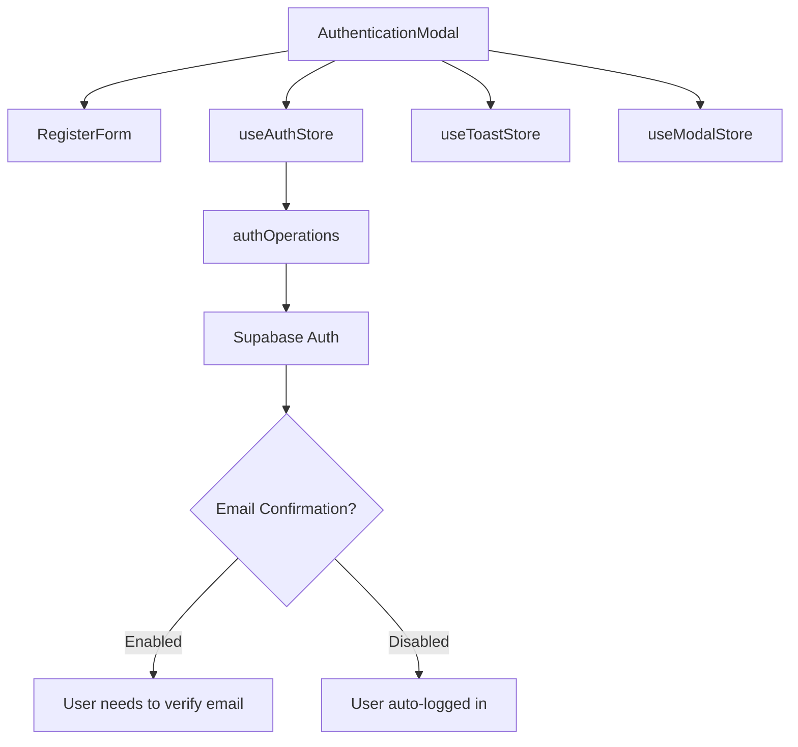
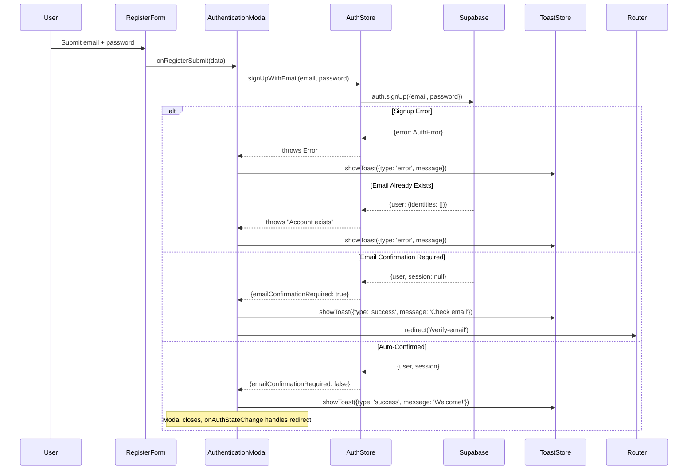

# Email Confirmation Flow Implementation Plan

## 1. Context Analysis

### 1.1 Files Analyzed

- `/home/joao/projects/myimageupscaler.com/client/store/auth/authOperations.ts`
- `/home/joao/projects/myimageupscaler.com/client/store/auth/authStateHandler.ts`
- `/home/joao/projects/myimageupscaler.com/client/store/modalStore.ts`
- `/home/joao/projects/myimageupscaler.com/client/store/toastStore.ts`
- `/home/joao/projects/myimageupscaler.com/client/components/modal/auth/AuthenticationModal.tsx`
- `/home/joao/projects/myimageupscaler.com/client/components/modal/auth/RegisterForm.tsx`

### 1.2 Component & Dependency Overview



### 1.3 Current Behavior Summary

- User submits registration form with email/password
- `signUpWithEmail()` calls `supabase.auth.signUp()`
- On success, modal closes with "Account created successfully!" toast
- **No differentiation** between email confirmation enabled/disabled scenarios
- User is not informed they need to check their email when confirmation is required
- No dedicated verification page exists

### 1.4 Problem Statement

The UI does not adapt to Supabase's "Confirm email" setting, leaving users confused when email confirmation is required but they're shown a generic success message and redirected nowhere useful.

---

## 2. Proposed Solution

### 2.1 Architecture Summary

- **Detect confirmation requirement** by checking if `session` is `null` after successful signup (Supabase returns `user` but no `session` when email confirmation is pending)
- **Return signup result** from `signUpWithEmail()` indicating whether email confirmation is needed
- **Create `/verify-email` page** with clear instructions for users
- **Conditional navigation** - redirect to `/verify-email` when confirmation needed, or dashboard when auto-confirmed
- **Toast notifications** for all error scenarios using existing `useToastStore`

**Alternative approaches rejected:**

1. ❌ Checking `email_confirmed_at` field - Less reliable than session check
2. ❌ Making API call to check Supabase settings - Unnecessary network call, response already tells us

### 2.2 Architecture Diagram

```mermaid
flowchart LR
    subgraph Registration Flow
        RF[RegisterForm] --> AM[AuthenticationModal]
        AM --> AO[authOperations.signUpWithEmail]
        AO --> SB[(Supabase)]
    end

    subgraph Response Handling
        SB --> CHK{session exists?}
        CHK -->|Yes| DASH[/dashboard]
        CHK -->|No| VE[/verify-email]
    end

    subgraph Error Display
        ERR[Errors] --> TS[ToastStore]
        TS --> TN[Toast Notification]
    end
```

### 2.3 Key Technical Decisions

| Decision          | Choice                                   | Rationale                                                 |
| ----------------- | ---------------------------------------- | --------------------------------------------------------- |
| Detection method  | Check `data.session` presence            | Supabase returns `null` session when confirmation pending |
| Return type       | `{ emailConfirmationRequired: boolean }` | Simple, explicit contract                                 |
| Verification page | Standalone `/verify-email` route         | Clean UX, can be bookmarked/shared                        |
| Error handling    | Toast notifications via existing store   | Consistent with app patterns                              |

### 2.4 Data Model Changes

**No Data Changes.** This is purely a UI/UX enhancement.

---

## 2.5 Runtime Execution Flow



---

## 3. Detailed Implementation Spec

### A. `client/store/auth/authOperations.ts`

**Changes Needed:**

- Modify `createSignUpWithEmail` to return signup result instead of `void`
- Detect email confirmation requirement from response

**New Return Type:**

```typescript
interface ISignUpResult {
  emailConfirmationRequired: boolean;
}
```

**Updated Function:**

```typescript
export function createSignUpWithEmail(
  supabase: SupabaseClient
): (email: string, password: string) => Promise<ISignUpResult> {
  return async (email: string, password: string) => {
    return await withLoading(async () => {
      const { data, error } = await supabase.auth.signUp({
        email,
        password,
        options: {
          emailRedirectTo: `${window.location.origin}/auth/confirm`,
        },
      });

      if (error) throw error;

      if (!data.user?.identities?.length) {
        throw new Error('An account with this email already exists');
      }

      // When email confirmation is required, Supabase returns user but no session
      const emailConfirmationRequired = data.user && !data.session;

      return { emailConfirmationRequired };
    });
  };
}
```

**Justification:** The `session` being `null` when `user` exists is Supabase's way of indicating email confirmation is pending. This is more reliable than checking user metadata.

---

### B. `client/store/auth/types.ts`

**New Type:**

```typescript
export interface ISignUpResult {
  emailConfirmationRequired: boolean;
}
```

---

### C. `client/store/authStore.ts` (or wherever the store interface is defined)

**Update store type:**

```typescript
signUpWithEmail: (email: string, password: string) => Promise<ISignUpResult>;
```

---

### D. `client/components/modal/auth/AuthenticationModal.tsx`

**Changes Needed:**

- Update `onRegisterSubmit` to handle the new return type
- Conditionally show different success messages
- Redirect to `/verify-email` when confirmation required

**Updated Handler:**

```typescript
const onRegisterSubmit = async (data: IRegisterForm) => {
  try {
    const result = await signUpWithEmail(data.email, data.password);

    if (result.emailConfirmationRequired) {
      showToast({
        message: 'Please check your email to verify your account',
        type: 'success',
      });
      close();
      window.location.href = '/verify-email';
    } else {
      showToast({ message: 'Account created successfully!', type: 'success' });
      close();
      // onAuthStateChange handles redirect to dashboard
    }
  } catch (error) {
    console.error('Registration error:', error);
    showToast({
      message: error instanceof Error ? error.message : 'Registration failed',
      type: 'error',
    });
  }
};
```

**Justification:** Direct handling instead of using `handleAuthAction` wrapper gives us access to the result object for conditional logic.

---

### E. `app/verify-email/page.tsx` (New File)

**Purpose:** Inform users to check their email and provide helpful guidance.

```typescript
import { Metadata } from 'next';
import Link from 'next/link';

export const metadata: Metadata = {
  title: 'Verify Your Email | myimageupscaler.com',
  description: 'Please check your email to verify your account',
};

export default function VerifyEmailPage() {
  return (
    <div className="min-h-screen flex items-center justify-center bg-background">
      <div className="max-w-md w-full mx-4">
        <div className="bg-card rounded-2xl shadow-xl p-8 text-center">
          {/* Email Icon */}
          <div className="w-16 h-16 mx-auto mb-6 rounded-full bg-gradient-to-r from-indigo-500 to-purple-500 flex items-center justify-center">
            <svg
              className="w-8 h-8 text-white"
              fill="none"
              stroke="currentColor"
              viewBox="0 0 24 24"
            >
              <path
                strokeLinecap="round"
                strokeLinejoin="round"
                strokeWidth={2}
                d="M3 8l7.89 5.26a2 2 0 002.22 0L21 8M5 19h14a2 2 0 002-2V7a2 2 0 00-2-2H5a2 2 0 00-2 2v10a2 2 0 002 2z"
              />
            </svg>
          </div>

          <h1 className="text-2xl font-bold text-foreground mb-2">
            Check Your Email
          </h1>

          <p className="text-muted-foreground mb-6">
            We&apos;ve sent a verification link to your email address.
            Please click the link to activate your account.
          </p>

          <div className="space-y-4">
            <div className="bg-muted/50 rounded-lg p-4 text-sm text-muted-foreground">
              <p className="font-medium text-foreground mb-1">Didn&apos;t receive the email?</p>
              <ul className="list-disc list-inside space-y-1 text-left">
                <li>Check your spam or junk folder</li>
                <li>Make sure you entered the correct email</li>
                <li>Wait a few minutes and try again</li>
              </ul>
            </div>

            <Link
              href="/"
              className="inline-block w-full px-4 py-3 bg-gradient-to-r from-indigo-600 via-violet-600 to-purple-600 hover:from-indigo-700 hover:via-violet-700 hover:to-purple-700 text-white font-semibold rounded-lg transition-all duration-200"
            >
              Back to Home
            </Link>
          </div>
        </div>
      </div>
    </div>
  );
}
```

**Justification:** Clean, focused page that clearly communicates next steps. Uses existing design tokens and gradient styles from the codebase.

---

### F. Error Handling Enhancement

All auth errors are already routed through the toast system. Ensure these specific error messages display properly:

| Error Scenario       | Toast Message                               | Type  |
| -------------------- | ------------------------------------------- | ----- |
| Email already exists | "An account with this email already exists" | error |
| Invalid email format | Zod validation message                      | error |
| Password too short   | Zod validation message                      | error |
| Network error        | "Registration failed"                       | error |
| Rate limited         | Supabase error message                      | error |

---

## 4. Step-by-Step Execution Plan

### Phase 1: Type Updates

- [ ] Add `ISignUpResult` interface to `client/store/auth/types.ts`
- [ ] Update `signUpWithEmail` type signature in auth store

### Phase 2: Auth Operations

- [ ] Modify `createSignUpWithEmail` in `authOperations.ts` to return `ISignUpResult`
- [ ] Update `emailRedirectTo` to point to `/auth/confirm`

### Phase 3: UI Components

- [ ] Update `AuthenticationModal.tsx` to handle new return type
- [ ] Add conditional redirect logic based on `emailConfirmationRequired`

### Phase 4: Verification Page

- [ ] Create `app/verify-email/page.tsx`
- [ ] Style consistently with existing auth pages

### Phase 5: Testing & Verification

- [ ] Test with email confirmation ENABLED in Supabase dashboard
- [ ] Test with email confirmation DISABLED in Supabase dashboard
- [ ] Verify toast notifications appear correctly
- [ ] Verify redirect flows work properly

---

## 5. Testing Strategy

### Unit Tests

- `authOperations.signUpWithEmail`:
  - Returns `{ emailConfirmationRequired: true }` when session is null
  - Returns `{ emailConfirmationRequired: false }` when session exists
  - Throws on duplicate email (empty identities array)
  - Throws on Supabase error

### Integration Tests

- Complete signup flow with email confirmation enabled
- Complete signup flow with email confirmation disabled
- Error state displays via toast

### Edge Cases

| Scenario                                 | Expected Behavior                                  |
| ---------------------------------------- | -------------------------------------------------- |
| User already exists                      | Toast: "An account with this email already exists" |
| Network failure during signup            | Toast: "Registration failed"                       |
| Supabase rate limit                      | Toast shows Supabase error message                 |
| User navigates directly to /verify-email | Page renders (no auth required)                    |

---

## 6. Acceptance Criteria

- [ ] When email confirmation is ENABLED: User sees "Check your email" toast and is redirected to `/verify-email`
- [ ] When email confirmation is DISABLED: User sees "Account created!" toast and modal closes (normal flow)
- [ ] All signup errors display as toast notifications (not console only)
- [ ] `/verify-email` page renders correctly with helpful instructions
- [ ] Existing login flow remains unchanged
- [ ] No regressions in OAuth/social login flows
- [ ] `yarn verify` passes

---

## 7. Verification & Rollback

### Success Criteria

- [ ] Both email confirmation scenarios work correctly
- [ ] Toast notifications appear for all error states
- [ ] No TypeScript errors
- [ ] E2E tests pass (if applicable)

### Rollback Plan

If issues arise:

1. Revert `authOperations.ts` changes (restore `void` return type)
2. Revert `AuthenticationModal.tsx` to use original `handleAuthAction`
3. Delete `/verify-email` page (optional, doesn't break anything)

All changes are additive and backward-compatible. The verification page can remain even if the conditional logic is reverted.
