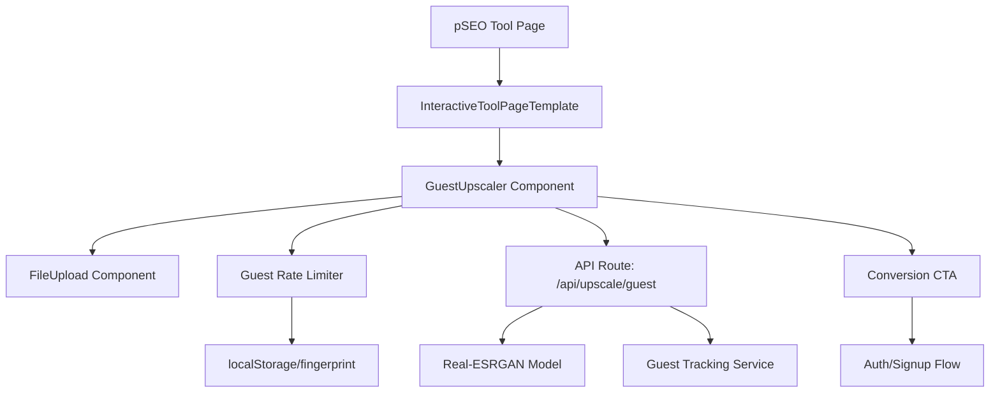
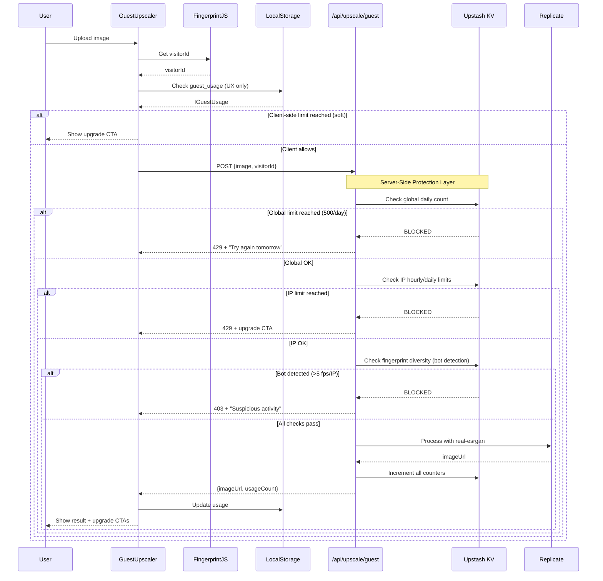

# PRD: Guest Upscaler for pSEO Pages

**Status**: Draft
**Author**: Claude (Principal Architect)
**Date**: January 6, 2026
**Version**: 1.1

---

## 1. Context Analysis

### 1.1 Files Analyzed

```
/home/joao/projects/pixelperfect/docs/seo/COMPETITOR_INTELLIGENCE_REPORT.md
/home/joao/projects/pixelperfect/.claude/agents/pseo-page-creator.md
/home/joao/projects/pixelperfect/server/services/model-registry.ts
/home/joao/projects/pixelperfect/app/(pseo)/_components/pseo/templates/InteractiveToolPageTemplate.tsx
/home/joao/projects/pixelperfect/app/(pseo)/tools/[slug]/page.tsx
/home/joao/projects/pixelperfect/app/seo/data/tools.json
/home/joao/projects/pixelperfect/app/(pseo)/_components/tools/BackgroundRemover.tsx
/home/joao/projects/pixelperfect/app/(pseo)/_components/ui/FileUpload.tsx
/home/joao/projects/pixelperfect/app/api/upscale/route.ts
/home/joao/projects/pixelperfect/shared/config/credits.config.ts
/home/joao/projects/pixelperfect/shared/config/model-costs.config.ts
/home/joao/projects/pixelperfect/shared/config/security.ts
```

### 1.2 Component & Dependency Overview



### 1.3 Current Behavior Summary

- pSEO tool pages use `InteractiveToolPageTemplate` with embedded tools (e.g., BackgroundRemover)
- Main upscale API requires authentication via `X-User-Id` header
- `real-esrgan` model costs $0.0017/run (fast, reliable, free-tier eligible)
- Rate limiting exists for authenticated users (5 req/min)
- No current mechanism for anonymous/guest image processing
- Competitors (upscale.media, pixelbin.io) offer free trials without signup

### 1.4 Problem Statement

Users cannot test the upscaling service before signing up, reducing conversion rates compared to competitors who offer no-signup trials.

---

## 2. Proposed Solution

### 2.1 Architecture Summary

- **Multi-layer abuse prevention** combining client-side fingerprinting with server-side hard limits
- **Global daily budget cap** to guarantee maximum spend regardless of abuse attempts
- **Dedicated guest API endpoint** (`/api/upscale/guest`) with IP + fingerprint rate limiting
- **Limited functionality**: Only `real-esrgan` at 2x scale, max 2MB input
- **Strategic friction**: Show results with prominent upgrade CTAs, limit to 3 uses/day per device
- **Conversion funnel**: After processing, show before/after with "Unlock 4x/8x" and "Remove limits" CTAs

**Alternatives Considered:**

| Approach                        | Rejected Because                                              |
| ------------------------------- | ------------------------------------------------------------- |
| Full client-side WASM upscaling | No quality ESRGAN WASM model exists; processing time too long |
| IP-only rate limiting           | VPNs bypass easily; shared networks unfairly blocked          |
| Fingerprint-only (client)       | Too easy to bypass; could burn all credits                    |
| Email-required trial            | Adds friction, reduces conversion (defeats purpose)           |
| Watermarked results             | Degrades trust; competitors don't watermark                   |

### 2.2 Architecture Diagram

```mermaid
flowchart LR
    subgraph Client
        A[FileUpload] --> B[GuestUpscaler]
        B --> C[FingerprintJS]
        B --> D[localStorage]
    end

    subgraph API
        E[/api/upscale/guest]
        F[GuestRateLimiter]
        G[ModelRegistry]
    end

    subgraph Server Protection
        K[Upstash KV]
        L[Global Daily Cap]
        M[IP Rate Limiter]
        N[Bot Detection]
    end

    subgraph Processing
        H[Real-ESRGAN]
        I[Replicate API]
    end

    B -->|visitorId + image| E
    E --> F
    F --> K
    K --> L
    K --> M
    K --> N
    F -->|All checks pass| G
    G --> H
    H --> I
    I -->|Result| E
    E -->|imageUrl| B

    B --> J[ConversionCTA]
```

### 2.3 Key Technical Decisions

| Decision             | Choice                          | Rationale                                                  |
| -------------------- | ------------------------------- | ---------------------------------------------------------- |
| **Server-side KV**   | Upstash Redis                   | Cloudflare Workers compatible, sub-ms latency, persistent  |
| **Global daily cap** | 500 upscales/day                | Hard ceiling: max $0.85/day spend regardless of abuse      |
| **IP rate limit**    | 10/hour, 20/day per IP          | Server-enforced backup; catches VPN rotators via cost      |
| **Bot detection**    | >5 fingerprints/IP/hour         | Detects automation without blocking shared networks        |
| Fingerprinting       | FingerprintJS (free tier)       | Industry standard, 99.5% accuracy, handles incognito       |
| Storage              | localStorage + fingerprint hash | Client-side UX optimization (not security-critical)        |
| Model                | `real-esrgan` only              | $0.0017/run, fast (2-5s), quality acceptable for demo      |
| Scale limit          | 2x only                         | Reduces cost, faster processing, creates upgrade incentive |
| File limit           | 2MB                             | Balances demo quality with cost control                    |
| Daily limit          | 3 images/device                 | Enough to evaluate; creates scarcity                       |
| Result expiry        | 1 hour                          | Matches existing system; forces re-engagement              |
| Data center blocking | Optional Cloudflare rule        | Block AWS/DO/GCP ASNs to prevent bot farms                 |

### 2.4 Data Model Changes

**New: Guest Usage Tracking (Client-Side)**

```typescript
interface IGuestUsage {
  fingerprint: string; // FingerprintJS visitorId
  dailyCount: number; // Images processed today
  lastResetDate: string; // YYYY-MM-DD for daily reset
  totalCount: number; // Lifetime count for analytics
  firstUsedAt: string; // ISO timestamp
}
```

**New: Server-Side Rate Limiting (Upstash KV)**

```typescript
// KV Keys (all with TTL auto-expiry)
`guest:global:${YYYY - MM - DD}` // Global daily counter (TTL: 24h)
`guest:ip:${hashedIP}:hourly` // Per-IP hourly counter (TTL: 1h)
`guest:ip:${hashedIP}:daily` // Per-IP daily counter (TTL: 24h)
`guest:ip:${hashedIP}:fingerprints`; // Set of fingerprints per IP (TTL: 1h)

// No persistent database storage - all KV entries auto-expire
```

**New: Guest Limits Configuration**

```typescript
// shared/config/guest-limits.config.ts
export const GUEST_LIMITS = {
  // Layer 1: Global circuit breaker (MOST IMPORTANT)
  GLOBAL_DAILY_LIMIT: 500, // Max 500 guest upscales/day total
  GLOBAL_DAILY_COST_CAP_USD: 0.85, // $0.85/day max (500 × $0.0017)

  // Layer 2: IP-based limits (server-enforced)
  IP_HOURLY_LIMIT: 10, // Per IP per hour
  IP_DAILY_LIMIT: 20, // Per IP per day

  // Layer 3: Bot detection
  FINGERPRINTS_PER_IP_LIMIT: 5, // Max unique fingerprints per IP per hour

  // Layer 4: Client-side (UX, not security)
  FINGERPRINT_DAILY_LIMIT: 3, // Shown to user, easily bypassed
} as const;
```

**No Database Changes Required** - Server-side tracking uses Upstash KV with auto-expiring keys.

---

## 2.5 Runtime Execution Flow



---

## 3. Detailed Implementation Spec

### Phase 1: Guest Rate Limiting Infrastructure

#### A. `client/utils/guest-fingerprint.ts`

**Purpose:** Client-side fingerprinting and usage tracking

```typescript
import FingerprintJS from '@fingerprintjs/fingerprintjs';

const STORAGE_KEY = 'miu_guest_usage';
const DAILY_LIMIT = 3;

interface IGuestUsage {
  fingerprint: string;
  dailyCount: number;
  lastResetDate: string;
  totalCount: number;
  firstUsedAt: string;
}

export async function getVisitorId(): Promise<string> {
  const fp = await FingerprintJS.load();
  const result = await fp.get();
  return result.visitorId;
}

export function getGuestUsage(): IGuestUsage | null {
  const stored = localStorage.getItem(STORAGE_KEY);
  if (!stored) return null;
  return JSON.parse(stored);
}

export function canProcessAsGuest(usage: IGuestUsage | null): boolean {
  if (!usage) return true; // First-time user

  const today = new Date().toISOString().split('T')[0];
  if (usage.lastResetDate !== today) return true; // New day

  return usage.dailyCount < DAILY_LIMIT;
}

export function incrementGuestUsage(visitorId: string): IGuestUsage {
  const today = new Date().toISOString().split('T')[0];
  const existing = getGuestUsage();

  const usage: IGuestUsage =
    existing && existing.fingerprint === visitorId
      ? {
          ...existing,
          dailyCount: existing.lastResetDate === today ? existing.dailyCount + 1 : 1,
          lastResetDate: today,
          totalCount: existing.totalCount + 1,
        }
      : {
          fingerprint: visitorId,
          dailyCount: 1,
          lastResetDate: today,
          totalCount: 1,
          firstUsedAt: new Date().toISOString(),
        };

  localStorage.setItem(STORAGE_KEY, JSON.stringify(usage));
  return usage;
}

export function getRemainingUses(usage: IGuestUsage | null): number {
  if (!usage) return DAILY_LIMIT;

  const today = new Date().toISOString().split('T')[0];
  if (usage.lastResetDate !== today) return DAILY_LIMIT;

  return Math.max(0, DAILY_LIMIT - usage.dailyCount);
}
```

**Justification:** Client-side tracking is sufficient for guest abuse prevention. Server-side enforcement is a backup, not primary.

---

#### B. `shared/config/guest-limits.config.ts`

**Purpose:** Centralized guest limit configuration

```typescript
export const GUEST_LIMITS = {
  // Layer 1: Global circuit breaker (CRITICAL - prevents runaway costs)
  GLOBAL_DAILY_LIMIT: 500,
  GLOBAL_DAILY_COST_CAP_USD: 0.85,

  // Layer 2: IP-based limits
  IP_HOURLY_LIMIT: 10,
  IP_DAILY_LIMIT: 20,

  // Layer 3: Bot detection
  FINGERPRINTS_PER_IP_LIMIT: 5,

  // Layer 4: Client-side (UX only)
  FINGERPRINT_DAILY_LIMIT: 3,

  // Processing limits
  MAX_FILE_SIZE_MB: 2,
  SCALE: 2,
  MODEL: 'real-esrgan' as const,
} as const;
```

---

#### C. `server/services/guest-rate-limiter.ts`

**Purpose:** Server-side rate limiting with Upstash KV

```typescript
import { Redis } from '@upstash/redis';
import { createHash } from 'crypto';
import { GUEST_LIMITS } from '@shared/config/guest-limits.config';

const redis = Redis.fromEnv();

function hashIp(ip: string): string {
  return createHash('sha256')
    .update(ip + process.env.IP_HASH_SALT)
    .digest('hex')
    .slice(0, 16);
}

function todayKey(): string {
  return new Date().toISOString().split('T')[0];
}

const KEYS = {
  globalDaily: () => `guest:global:${todayKey()}`,
  ipHourly: (ip: string) => `guest:ip:${hashIp(ip)}:hourly`,
  ipDaily: (ip: string) => `guest:ip:${hashIp(ip)}:daily`,
  ipFingerprints: (ip: string) => `guest:ip:${hashIp(ip)}:fps`,
};

export interface IGuestLimitCheck {
  allowed: boolean;
  reason?: string;
  errorCode?: 'GLOBAL_LIMIT' | 'IP_LIMIT' | 'BOT_DETECTED';
}

export async function checkGuestLimits(ip: string, fingerprint: string): Promise<IGuestLimitCheck> {
  // Layer 1: Global circuit breaker (MOST IMPORTANT)
  const globalCount = (await redis.get<number>(KEYS.globalDaily())) || 0;
  if (globalCount >= GUEST_LIMITS.GLOBAL_DAILY_LIMIT) {
    return {
      allowed: false,
      reason: 'Service at capacity. Try again tomorrow or create a free account.',
      errorCode: 'GLOBAL_LIMIT',
    };
  }

  // Layer 2: IP hourly limit
  const ipHourly = (await redis.get<number>(KEYS.ipHourly(ip))) || 0;
  if (ipHourly >= GUEST_LIMITS.IP_HOURLY_LIMIT) {
    return {
      allowed: false,
      reason: 'Hourly limit reached. Sign up for unlimited access.',
      errorCode: 'IP_LIMIT',
    };
  }

  // Layer 3: IP daily limit
  const ipDaily = (await redis.get<number>(KEYS.ipDaily(ip))) || 0;
  if (ipDaily >= GUEST_LIMITS.IP_DAILY_LIMIT) {
    return {
      allowed: false,
      reason: 'Daily limit reached from your network. Create a free account to continue.',
      errorCode: 'IP_LIMIT',
    };
  }

  // Layer 4: Bot detection (many fingerprints from same IP)
  const existingFingerprints = (await redis.smembers(KEYS.ipFingerprints(ip))) || [];
  if (
    existingFingerprints.length >= GUEST_LIMITS.FINGERPRINTS_PER_IP_LIMIT &&
    !existingFingerprints.includes(fingerprint)
  ) {
    return {
      allowed: false,
      reason: 'Suspicious activity detected.',
      errorCode: 'BOT_DETECTED',
    };
  }

  return { allowed: true };
}

export async function incrementGuestUsage(ip: string, fingerprint: string): Promise<void> {
  const pipeline = redis.pipeline();

  // Global counter
  pipeline.incr(KEYS.globalDaily());
  pipeline.expire(KEYS.globalDaily(), 86400);

  // IP hourly
  pipeline.incr(KEYS.ipHourly(ip));
  pipeline.expire(KEYS.ipHourly(ip), 3600);

  // IP daily
  pipeline.incr(KEYS.ipDaily(ip));
  pipeline.expire(KEYS.ipDaily(ip), 86400);

  // Fingerprint tracking for bot detection
  pipeline.sadd(KEYS.ipFingerprints(ip), fingerprint);
  pipeline.expire(KEYS.ipFingerprints(ip), 3600);

  await pipeline.exec();
}

export async function getGlobalUsage(): Promise<{ count: number; limit: number }> {
  const count = (await redis.get<number>(KEYS.globalDaily())) || 0;
  return { count, limit: GUEST_LIMITS.GLOBAL_DAILY_LIMIT };
}
```

---

#### D. `app/api/upscale/guest/route.ts`

**Purpose:** Dedicated guest upscaling endpoint with multi-layer protection

```typescript
import { NextRequest, NextResponse } from 'next/server';
import { createLogger } from '@server/monitoring/logger';
import { ImageProcessorFactory } from '@server/services/image-processor.factory';
import { checkGuestLimits, incrementGuestUsage } from '@server/services/guest-rate-limiter';
import { trackServerEvent } from '@server/analytics';
import { serverEnv } from '@shared/config/env';
import { GUEST_LIMITS } from '@shared/config/guest-limits.config';
import { ErrorCodes, createErrorResponse } from '@shared/utils/errors';
import { z } from 'zod';

const guestUpscaleSchema = z.object({
  imageData: z.string().min(100),
  mimeType: z.enum(['image/jpeg', 'image/png', 'image/webp']),
  visitorId: z.string().min(10).max(100),
});

function getClientIp(req: NextRequest): string {
  return (
    req.headers.get('cf-connecting-ip') ||
    req.headers.get('x-forwarded-for')?.split(',')[0]?.trim() ||
    'unknown'
  );
}

export async function POST(req: NextRequest): Promise<NextResponse> {
  const logger = createLogger(req, 'guest-upscale-api');
  const clientIp = getClientIp(req);

  try {
    const body = await req.json();
    const validated = guestUpscaleSchema.parse(body);

    // Validate file size
    const base64Data = validated.imageData.split(',')[1] || validated.imageData;
    const fileSizeBytes = (base64Data.length * 3) / 4;
    if (fileSizeBytes > GUEST_LIMITS.MAX_FILE_SIZE_MB * 1024 * 1024) {
      return NextResponse.json(
        createErrorResponse(
          ErrorCodes.VALIDATION_ERROR,
          `File too large. Guest limit is ${GUEST_LIMITS.MAX_FILE_SIZE_MB}MB. Sign up for 64MB.`,
          400,
          { upgradeUrl: '/?signup=1' }
        ).body,
        { status: 400 }
      );
    }

    // ========================================
    // MULTI-LAYER SERVER-SIDE RATE LIMITING
    // ========================================
    const limitCheck = await checkGuestLimits(clientIp, validated.visitorId);

    if (!limitCheck.allowed) {
      const statusCode = limitCheck.errorCode === 'BOT_DETECTED' ? 403 : 429;

      logger.warn('Guest rate limited', {
        ip: clientIp.slice(0, 8) + '***', // Partial IP for privacy
        fingerprint: validated.visitorId.slice(0, 8) + '***',
        reason: limitCheck.errorCode,
      });

      await trackServerEvent(
        'guest_limit_reached',
        {
          reason: limitCheck.errorCode,
          visitorId: validated.visitorId,
        },
        { apiKey: serverEnv.AMPLITUDE_API_KEY }
      );

      return NextResponse.json(
        createErrorResponse(
          statusCode === 403 ? ErrorCodes.FORBIDDEN : ErrorCodes.RATE_LIMITED,
          limitCheck.reason!,
          statusCode,
          { upgradeUrl: '/?signup=1' }
        ).body,
        { status: statusCode }
      );
    }

    logger.info('Processing guest upscale', {
      fingerprint: validated.visitorId.slice(0, 8) + '***',
    });

    // Process with real-esrgan only
    const processor = ImageProcessorFactory.createProcessorForModel(GUEST_LIMITS.MODEL);
    const startTime = Date.now();

    const result = await processor.processImageGuest({
      imageData: validated.imageData,
      mimeType: validated.mimeType,
      scale: GUEST_LIMITS.SCALE,
      modelId: GUEST_LIMITS.MODEL,
    });

    const processingTimeMs = Date.now() - startTime;

    // Increment counters AFTER successful processing
    await incrementGuestUsage(clientIp, validated.visitorId);

    // Track for funnel analysis
    await trackServerEvent(
      'guest_upscale_completed',
      {
        visitorId: validated.visitorId,
        fileSize: fileSizeBytes,
        processingTimeMs,
      },
      { apiKey: serverEnv.AMPLITUDE_API_KEY }
    );

    return NextResponse.json({
      success: true,
      imageUrl: result.imageUrl,
      expiresAt: result.expiresAt,
      mimeType: 'image/png',
      processing: {
        modelUsed: GUEST_LIMITS.MODEL,
        scale: GUEST_LIMITS.SCALE,
        processingTimeMs,
      },
      upgrade: {
        message: 'Want 4x or 8x upscaling? Sign up free!',
        ctaUrl: '/?signup=1',
        features: ['Up to 8x upscaling', '64MB file limit', 'Batch processing', 'No daily limits'],
      },
    });
  } catch (error) {
    if (error instanceof z.ZodError) {
      return NextResponse.json(
        createErrorResponse(ErrorCodes.VALIDATION_ERROR, 'Invalid request', 400).body,
        { status: 400 }
      );
    }

    logger.error('Guest upscale failed', { error });
    return NextResponse.json(
      createErrorResponse(ErrorCodes.PROCESSING_FAILED, 'Processing failed. Please try again.', 500)
        .body,
      { status: 500 }
    );
  } finally {
    await logger.flush();
  }
}
```

**Justification:** Multi-layer server-side protection ensures maximum daily spend is capped at $0.85 regardless of client-side bypass attempts. IP + fingerprint combination catches most abuse patterns while global cap provides absolute protection.

---

### Phase 2: GuestUpscaler Component

#### C. `app/(pseo)/_components/tools/GuestUpscaler.tsx`

**Purpose:** Interactive guest upscaler with conversion CTAs

```typescript
'use client';

import React, { useState, useCallback, useEffect } from 'react';
import { FileUpload } from '@/app/(pseo)/_components/ui/FileUpload';
import { Button } from '@/app/(pseo)/_components/ui/button';
import { Loader2, Sparkles, Lock, ArrowRight, Check, Zap } from 'lucide-react';
import Image from 'next/image';
import Link from 'next/link';
import {
  getVisitorId,
  getGuestUsage,
  canProcessAsGuest,
  incrementGuestUsage,
  getRemainingUses,
} from '@/client/utils/guest-fingerprint';

type ProcessingState = 'idle' | 'loading' | 'processing' | 'done' | 'limit-reached';

interface IGuestUpscalerProps {
  onConversion?: () => void;
}

export function GuestUpscaler({ onConversion }: IGuestUpscalerProps): React.ReactElement {
  const [state, setState] = useState<ProcessingState>('idle');
  const [previewUrl, setPreviewUrl] = useState<string | null>(null);
  const [resultUrl, setResultUrl] = useState<string | null>(null);
  const [error, setError] = useState<string | null>(null);
  const [remainingUses, setRemainingUses] = useState(3);
  const [visitorId, setVisitorId] = useState<string | null>(null);

  // Initialize fingerprint and check usage
  useEffect(() => {
    async function init() {
      try {
        const id = await getVisitorId();
        setVisitorId(id);
        const usage = getGuestUsage();
        setRemainingUses(getRemainingUses(usage));

        if (!canProcessAsGuest(usage)) {
          setState('limit-reached');
        }
      } catch (err) {
        console.error('Fingerprint init failed:', err);
        // Allow usage without fingerprint, server will enforce limits
        setVisitorId('anonymous-' + Date.now());
      }
    }
    init();
  }, []);

  const handleFileSelect = useCallback(async (file: File) => {
    // Validate file size (2MB limit for guests)
    if (file.size > 2 * 1024 * 1024) {
      setError('File too large. Guest limit is 2MB. Sign up for 64MB limit.');
      return;
    }

    // Check if can process
    const usage = getGuestUsage();
    if (!canProcessAsGuest(usage)) {
      setState('limit-reached');
      return;
    }

    setError(null);
    setState('processing');

    // Create preview
    const preview = URL.createObjectURL(file);
    setPreviewUrl(preview);

    try {
      // Convert to base64
      const reader = new FileReader();
      const base64 = await new Promise<string>((resolve, reject) => {
        reader.onload = () => resolve(reader.result as string);
        reader.onerror = reject;
        reader.readAsDataURL(file);
      });

      // Call guest API
      const response = await fetch('/api/upscale/guest', {
        method: 'POST',
        headers: { 'Content-Type': 'application/json' },
        body: JSON.stringify({
          imageData: base64,
          mimeType: file.type,
          visitorId,
        }),
      });

      const data = await response.json();

      if (!response.ok) {
        if (response.status === 429) {
          setState('limit-reached');
          return;
        }
        throw new Error(data.error?.message || 'Processing failed');
      }

      // Update usage
      incrementGuestUsage(visitorId!);
      setRemainingUses(prev => Math.max(0, prev - 1));

      setResultUrl(data.imageUrl);
      setState('done');
    } catch (err) {
      setError(err instanceof Error ? err.message : 'Processing failed');
      setState('idle');
    }
  }, [visitorId]);

  // Limit reached state - aggressive conversion CTA
  if (state === 'limit-reached') {
    return (
      <div className="bg-gradient-to-br from-surface to-surface-light rounded-xl p-8 border border-border text-center">
        <Lock className="w-12 h-12 mx-auto mb-4 text-accent" />
        <h3 className="text-2xl font-bold text-primary mb-2">
          Daily Limit Reached
        </h3>
        <p className="text-text-secondary mb-6">
          You've used all 3 free upscales today. Create a free account to continue.
        </p>

        <div className="bg-surface rounded-lg p-4 mb-6 text-left">
          <h4 className="font-semibold text-primary mb-3">Free account includes:</h4>
          <ul className="space-y-2">
            {['10 free credits every month', 'Up to 8x upscaling', '64MB file uploads', 'No watermarks'].map(feature => (
              <li key={feature} className="flex items-center gap-2 text-sm text-text-secondary">
                <Check className="w-4 h-4 text-success" />
                {feature}
              </li>
            ))}
          </ul>
        </div>

        <Link href="/?signup=1">
          <Button className="w-full bg-accent hover:bg-accent-hover text-white">
            Create Free Account
            <ArrowRight className="w-4 h-4 ml-2" />
          </Button>
        </Link>

        <p className="text-xs text-text-muted mt-4">
          Or come back tomorrow for 3 more free upscales
        </p>
      </div>
    );
  }

  return (
    <div className="space-y-6">
      {/* Usage indicator */}
      <div className="flex items-center justify-between bg-surface-light rounded-lg px-4 py-2 border border-border">
        <div className="flex items-center gap-2">
          <Zap className="w-4 h-4 text-accent" />
          <span className="text-sm text-text-secondary">
            <strong className="text-primary">{remainingUses}</strong> free upscales remaining today
          </span>
        </div>
        <Link href="/?signup=1" className="text-sm text-accent hover:underline">
          Get unlimited
        </Link>
      </div>

      {/* Upload area */}
      {state === 'idle' && (
        <FileUpload
          onFileSelect={handleFileSelect}
          acceptedFormats={['image/jpeg', 'image/png', 'image/webp']}
          maxFileSizeMB={2}
        />
      )}

      {/* Processing state */}
      {state === 'processing' && (
        <div className="bg-surface rounded-lg p-8 border border-border text-center">
          <Loader2 className="w-12 h-12 animate-spin mx-auto mb-4 text-accent" />
          <p className="text-lg font-medium text-primary">Upscaling your image...</p>
          <p className="text-sm text-text-secondary mt-2">This usually takes 5-10 seconds</p>
        </div>
      )}

      {/* Result state */}
      {state === 'done' && previewUrl && resultUrl && (
        <div className="space-y-6">
          {/* Before/After comparison */}
          <div className="grid md:grid-cols-2 gap-4">
            <div>
              <label className="text-sm font-medium text-text-secondary mb-2 block">Original</label>
              <div className="relative aspect-square bg-surface rounded-lg overflow-hidden border border-border">
                <Image src={previewUrl} alt="Original" fill className="object-contain" unoptimized />
              </div>
            </div>
            <div>
              <label className="text-sm font-medium text-text-secondary mb-2 block">
                Upscaled 2x <span className="text-accent">(with AI)</span>
              </label>
              <div className="relative aspect-square bg-surface rounded-lg overflow-hidden border border-accent">
                <Image src={resultUrl} alt="Upscaled" fill className="object-contain" unoptimized />
              </div>
            </div>
          </div>

          {/* Download + Upgrade CTAs */}
          <div className="flex flex-col sm:flex-row gap-4">
            <a
              href={resultUrl}
              download="upscaled-image.png"
              className="flex-1 inline-flex items-center justify-center px-6 py-3 bg-surface hover:bg-surface-light border border-border rounded-lg font-medium text-primary transition-colors"
            >
              Download 2x Result
            </a>
            <Link href="/?signup=1" className="flex-1">
              <Button className="w-full bg-accent hover:bg-accent-hover text-white">
                <Sparkles className="w-4 h-4 mr-2" />
                Unlock 4x & 8x Upscaling
              </Button>
            </Link>
          </div>

          {/* Upgrade benefits */}
          <div className="bg-gradient-to-r from-accent/10 to-transparent rounded-lg p-4 border border-accent/20">
            <p className="text-sm text-text-secondary">
              <strong className="text-primary">Want even better results?</strong> Sign up free to unlock 4x and 8x upscaling,
              larger file uploads, and AI-powered enhancement features.
            </p>
          </div>

          {/* Try another */}
          <Button
            variant="ghost"
            onClick={() => {
              setPreviewUrl(null);
              setResultUrl(null);
              setState('idle');
            }}
            className="w-full"
          >
            Try Another Image ({remainingUses} remaining)
          </Button>
        </div>
      )}

      {/* Error state */}
      {error && (
        <div className="bg-error/10 border border-error/20 rounded-lg p-4">
          <p className="text-sm text-error">{error}</p>
          {error.includes('Sign up') && (
            <Link href="/?signup=1" className="text-sm text-accent hover:underline mt-2 inline-block">
              Create free account
            </Link>
          )}
        </div>
      )}
    </div>
  );
}
```

**Justification:** Component handles full guest flow with strategic CTAs at every friction point (limit reached, after processing, on errors).

---

### Phase 3: pSEO Integration

#### D. Update `app/(pseo)/_components/tools/index.ts`

**Changes:** Export GuestUpscaler

```typescript
export { GuestUpscaler } from './GuestUpscaler';
```

---

#### E. Update `InteractiveToolPageTemplate.tsx`

**Changes:** Add GuestUpscaler to TOOL_COMPONENTS

```typescript
import { GuestUpscaler } from '@/app/(pseo)/_components/tools/GuestUpscaler';

const TOOL_COMPONENTS: Record<string, React.ComponentType<any>> = {
  ImageResizer,
  ImageCompressor,
  FormatConverter,
  BulkImageCompressor,
  BulkImageResizer,
  BackgroundRemover,
  GuestUpscaler, // New
};
```

---

#### F. Add pSEO Page Data to `tools.json`

**New Entry:**

```json
{
  "slug": "free-image-upscaler",
  "title": "Free Image Upscaler",
  "metaTitle": "Free Image Upscaler - Enlarge Images Online No Sign Up | MyImageUpscaler",
  "metaDescription": "Upscale images 2x free with AI. No account required. Try our image upscaler instantly - just upload and download. Quick, easy, no watermarks.",
  "h1": "Free Image Upscaler",
  "intro": "Upscale your images 2x with AI - no account required. Just upload an image to see the quality difference instantly.",
  "primaryKeyword": "free image upscaler",
  "secondaryKeywords": [
    "upscale image free",
    "image upscaler no sign up",
    "free photo enlarger",
    "enlarge image free online",
    "ai image upscaler free",
    "free image enlarger"
  ],
  "lastUpdated": "2026-01-06T00:00:00Z",
  "category": "tools",
  "isInteractive": true,
  "toolComponent": "GuestUpscaler",
  "maxFileSizeMB": 2,
  "acceptedFormats": ["image/jpeg", "image/png", "image/webp"],
  "toolName": "Free Image Upscaler",
  "description": "Experience AI-powered image upscaling without creating an account. Upload any image to instantly enlarge it 2x while preserving quality. See the difference AI makes, then unlock the full power with a free account.",
  "features": [
    {
      "title": "Instant 2x Upscaling",
      "description": "Upload any image and get it upscaled 2x in seconds. No signup, no email, no hassle."
    },
    {
      "title": "AI-Powered Quality",
      "description": "Uses the same Real-ESRGAN AI model as our full service. Real detail enhancement, not just pixel stretching."
    },
    {
      "title": "No Watermarks",
      "description": "Your upscaled images are completely clean. Download and use them anywhere."
    },
    {
      "title": "Privacy First",
      "description": "Images are processed and automatically deleted within 1 hour. We don't store or share your photos."
    }
  ],
  "useCases": [
    {
      "title": "Quick Product Photo Test",
      "description": "See if AI upscaling works for your product images before committing.",
      "example": "Test a supplier photo to see how it looks upscaled before listing on Amazon."
    },
    {
      "title": "Social Media Preview",
      "description": "Check how an old photo looks upscaled before posting.",
      "example": "Preview a throwback photo at higher resolution before Instagram."
    },
    {
      "title": "Quality Evaluation",
      "description": "Compare AI upscaling vs regular resize to see the difference.",
      "example": "See how text and edges are preserved compared to Photoshop resize."
    }
  ],
  "benefits": [
    {
      "title": "Zero Friction",
      "description": "No account creation, no email verification, no credit card. Just upload and go.",
      "metric": "3 free upscales per day"
    },
    {
      "title": "Same AI Quality",
      "description": "Uses Real-ESRGAN, the same model powering professional image restoration.",
      "metric": "Industry-standard neural network"
    },
    {
      "title": "Fast Results",
      "description": "Most images process in 5-10 seconds on our cloud infrastructure.",
      "metric": "GPU-accelerated processing"
    }
  ],
  "howItWorks": [
    {
      "step": 1,
      "title": "Upload Your Image",
      "description": "Drag and drop or click to browse. Supports JPEG, PNG, WebP up to 2MB."
    },
    {
      "step": 2,
      "title": "AI Processes",
      "description": "Our Real-ESRGAN model analyzes and upscales your image 2x with AI detail enhancement."
    },
    {
      "step": 3,
      "title": "Download Free",
      "description": "Preview the result and download. No watermarks, no signup required."
    }
  ],
  "faq": [
    {
      "question": "Is this really free with no catch?",
      "answer": "Yes! You get 3 free upscales per day at 2x. The only limits are file size (2MB) and scale factor. For 4x/8x upscaling and larger files, you can create a free account."
    },
    {
      "question": "What's the difference vs the full upscaler?",
      "answer": "The free guest version uses the same AI model but is limited to 2x scaling and 2MB files. Creating a free account unlocks 8x scaling, 64MB files, batch processing, and 10 credits monthly."
    },
    {
      "question": "Do you store my images?",
      "answer": "Images are processed on secure cloud servers and automatically deleted within 1 hour. We never use your images for training or share them."
    },
    {
      "question": "Why do I need to sign up for more?",
      "answer": "Running AI models costs real money (GPU compute). The free tier lets you evaluate the quality, while accounts let us provide sustainable service with fair usage limits."
    }
  ],
  "relatedTools": ["ai-image-upscaler", "ai-photo-enhancer"],
  "relatedGuides": [],
  "ctaText": "Try Free Upscaler",
  "ctaUrl": "/tools/free-image-upscaler"
}
```

---

## 4. Step-by-Step Execution Plan

### Phase 1: Server-Side Protection (CRITICAL - Do First)

- [ ] Set up Upstash Redis account and get credentials
- [ ] Add `UPSTASH_REDIS_REST_URL` and `UPSTASH_REDIS_REST_TOKEN` to `.env.api`
- [ ] Add `IP_HASH_SALT` secret to `.env.api`
- [ ] Create `shared/config/guest-limits.config.ts` - Centralized limits
- [ ] Create `server/services/guest-rate-limiter.ts` - KV-based rate limiting
- [ ] Add `@upstash/redis` dependency: `yarn add @upstash/redis`
- [ ] Create `app/api/upscale/guest/route.ts` - Guest API endpoint
- [ ] Add `processImageGuest` method to ImageProcessorFactory
- [ ] Add route to `PUBLIC_API_ROUTES` in `shared/config/security.ts`

### Phase 2: Client-Side (Can Parallel with Phase 1)

- [ ] Add FingerprintJS dependency: `yarn add @fingerprintjs/fingerprintjs`
- [ ] Create `client/utils/guest-fingerprint.ts` - Client-side tracking (UX only)
- [ ] Create `app/(pseo)/_components/tools/GuestUpscaler.tsx`
- [ ] Export from `app/(pseo)/_components/tools/index.ts`
- [ ] Register in `InteractiveToolPageTemplate.tsx` TOOL_COMPONENTS

### Phase 3: pSEO Page (Depends on Phase 2)

- [ ] Add entry to `app/seo/data/tools.json`
- [ ] Update `meta.totalPages` count
- [ ] Run `yarn verify` to validate

### Phase 4: Analytics & Monitoring

- [ ] Add `guest_upscale_started` event
- [ ] Add `guest_upscale_completed` event
- [ ] Add `guest_limit_reached` event (with reason: GLOBAL_LIMIT | IP_LIMIT | BOT_DETECTED)
- [ ] Add `guest_to_signup_click` conversion event
- [ ] Create Amplitude dashboard for guest funnel
- [ ] Create Baselime alert for global limit approaching (>400/day)

### Phase 5: Optional Hardening

- [ ] Add Cloudflare WAF rule to block data center ASNs (AWS, DO, GCP)
- [ ] Add `/api/admin/guest-usage` endpoint to monitor usage
- [ ] Add `GUEST_UPSCALE_ENABLED` env var kill switch

---

## 5. Testing Strategy

### Unit Tests

- `guest-fingerprint.ts`: canProcessAsGuest logic, daily reset, increment
- `guest/route.ts`: Rate limit enforcement, validation, error handling

### Integration Tests

```typescript
// tests/api/guest-upscale.api.spec.ts

describe('Guest Upscale API', () => {
  it('allows first-time guest to upscale', async () => {
    const response = await fetch('/api/upscale/guest', {
      method: 'POST',
      body: JSON.stringify({
        imageData: validBase64Image,
        mimeType: 'image/jpeg',
        visitorId: 'test-visitor-123',
      }),
    });
    expect(response.status).toBe(200);
    const data = await response.json();
    expect(data.imageUrl).toBeDefined();
    expect(data.upgrade).toBeDefined();
  });

  it('enforces 2MB file limit for guests', async () => {
    const response = await fetch('/api/upscale/guest', {
      method: 'POST',
      body: JSON.stringify({
        imageData: largeBase64Image, // > 2MB
        mimeType: 'image/jpeg',
        visitorId: 'test-visitor-123',
      }),
    });
    expect(response.status).toBe(400);
  });

  it('rate limits after 2 requests per minute', async () => {
    const visitorId = 'rate-limit-test-' + Date.now();

    // First two should succeed
    await fetch('/api/upscale/guest', {
      /* ... */
    });
    await fetch('/api/upscale/guest', {
      /* ... */
    });

    // Third should be rate limited
    const response = await fetch('/api/upscale/guest', {
      method: 'POST',
      body: JSON.stringify({
        imageData: validBase64Image,
        mimeType: 'image/jpeg',
        visitorId,
      }),
    });
    expect(response.status).toBe(429);
  });
});
```

### Edge Cases

| Scenario                                | Expected Behavior                                               |
| --------------------------------------- | --------------------------------------------------------------- |
| LocalStorage blocked (private browsing) | Falls back to fingerprint-only tracking; server enforces limits |
| FingerprintJS fails to load             | Uses timestamp-based fallback ID                                |
| User clears localStorage                | Resets daily count; server-side IP rate limit provides backup   |
| Same fingerprint, different device      | Treated as same user (intended behavior)                        |
| VPN user                                | Fingerprint still tracks; limits apply per browser instance     |
| Image processing fails                  | Show error with retry option; don't count against limit         |

---

## 6. Acceptance Criteria

### Functional

- [ ] Guest can upload and process image without any account
- [ ] Processing limited to real-esrgan model, 2x scale, 2MB max
- [ ] Before/after comparison displays correctly
- [ ] Download works without watermarks
- [ ] Clear upgrade CTAs shown: after limit reached, after successful processing, on file size errors

### Server-Side Protection (CRITICAL)

- [ ] Global daily cap of 500 enforced in Upstash KV
- [ ] IP hourly limit of 10 enforced
- [ ] IP daily limit of 20 enforced
- [ ] Bot detection blocks >5 fingerprints per IP per hour
- [ ] All limits return appropriate error codes (429/403)
- [ ] Counters increment only AFTER successful processing

### Client-Side (UX)

- [ ] Daily limit of 3 images per device shown in UI
- [ ] FingerprintJS loads and provides visitorId
- [ ] Graceful fallback if fingerprinting fails

### Quality & Performance

- [ ] pSEO page passes `yarn verify`
- [ ] Processing time < 15s for typical images
- [ ] No impact on authenticated user upscale performance
- [ ] Analytics events tracked for funnel analysis

---

## 7. Verification & Rollback

### Success Criteria

| Metric                                      | Target   | Measurement                                                |
| ------------------------------------------- | -------- | ---------------------------------------------------------- |
| Guest upscale success rate                  | > 95%    | Amplitude: guest_upscale_completed / guest_upscale_started |
| Guest to signup conversion                  | > 5%     | Amplitude: guest_to_signup_click / guest_upscale_completed |
| Page load time (LCP)                        | < 2.5s   | Core Web Vitals                                            |
| Processing cost per guest                   | < $0.002 | Replicate dashboard                                        |
| Abuse rate (> 10 uses/day same fingerprint) | < 1%     | Custom analytics query                                     |

### Monitoring

- Replicate API cost dashboard
- Amplitude guest funnel dashboard
- Error rate alerts in Baselime
- Daily guest usage report

### Rollback Plan

1. **Immediate**: Set `GUEST_UPSCALE_ENABLED=false` env var to disable endpoint
2. **Partial**: Reduce `DAILY_LIMIT` to 1 if abuse detected
3. **Full**: Remove tool from `tools.json` and redeploy (pSEO page becomes 404)

---

## 8. Cost Analysis

### Per-Guest Cost

| Item                               | Cost         |
| ---------------------------------- | ------------ |
| Real-ESRGAN run                    | $0.0017      |
| Replicate egress                   | ~$0.0001     |
| Upstash KV operations (~5/request) | ~$0.0000004  |
| **Total per upscale**              | **~$0.0018** |

### Cost Protection Guarantees

| Protection Layer     | Limit        | Max Daily Cost    |
| -------------------- | ------------ | ----------------- |
| **Global daily cap** | 500 upscales | **$0.85**         |
| IP daily limit       | 20/IP        | Reduces abuse     |
| IP hourly limit      | 10/IP        | Prevents bursts   |
| Bot detection        | 5 fps/IP     | Blocks automation |

**Absolute Maximum Daily Spend: $0.85** (regardless of traffic or abuse attempts)

### Monthly Projections (With Protection)

| Scenario          | Daily Usage       | Monthly Cost | Max Monthly Cost |
| ----------------- | ----------------- | ------------ | ---------------- |
| Normal (200/day)  | 6,000/mo          | $10.80       | -                |
| High (400/day)    | 12,000/mo         | $21.60       | -                |
| **Abuse attempt** | Capped at 500/day | -            | **$25.50**       |

### ROI Analysis

At $9/month Hobby tier with 20% conversion from free-to-paid:

- 750 signups × 20% paid = 150 paying users × $9 = **$1,350/month revenue**
- Maximum cost (under sustained attack): $25.50/month
- Normal cost: ~$15/month
- **Worst-case ROI: 53x**
- **Normal ROI: 90x**

---

## 9. Future Enhancements (Out of Scope)

1. **A/B test** CTA placements and copy
2. **Progressive limits**: Reward engagement (e.g., share = +1 upscale)
3. **Email capture**: Optional "email for 5 more upscales" before hard limit
4. **Quality tiers**: Show "HD Preview" watermarked, unlock with signup
5. **Retargeting pixel**: Fire conversion pixels for ad campaigns

---

**Document History**

| Version | Date       | Author | Changes                                                                                     |
| ------- | ---------- | ------ | ------------------------------------------------------------------------------------------- |
| 1.0     | 2026-01-06 | Claude | Initial PRD                                                                                 |
| 1.1     | 2026-01-06 | Claude | Added multi-layer server-side protection (Upstash KV, IP limits, global cap, bot detection) |
