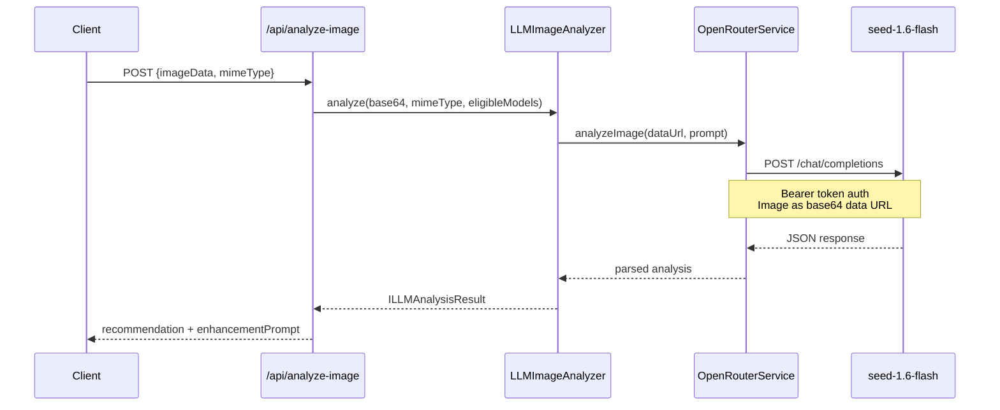

# PRD: Replace Qwen VL with OpenRouter Seed VL for Image Analysis

**Complexity: 5 → MEDIUM mode**

## 1. Context

**Problem:** Current Qwen VL 8B model on Replicate has severe cold start issues (15-30s) because nobody uses it, making the "Smart Edit" analysis feature unusable. Need to switch to a faster, always-warm VL provider.

**Files Analyzed:**

- `server/services/llm-image-analyzer.ts` - Current Qwen VL implementation via Replicate
- `server/services/llm-image-analyzer.types.ts` - Analysis result types
- `app/api/analyze-image/route.ts` - API endpoint using the analyzer
- `shared/config/env.ts` - Environment configuration
- `shared/types/provider-adapter.types.ts` - Provider adapter patterns
- `.env.api.example` - Environment variable documentation

**Current Behavior:**

- Uses Replicate to call `lucataco/qwen3-vl-8b-instruct` model
- Cold starts taking 15-30s due to low usage
- Analyzes images to recommend the best upscaling model
- Generates `enhancementPrompt` for the chosen model
- Available only to paid users

## 2. Solution

**Approach:**

1. Add OpenRouter as a new LLM provider for VL tasks (not image processing)
2. Use `bytedance-seed/seed-1.6-flash` via OpenRouter API (always warm, cheap: $0.075/M input tokens)
3. Create an OpenRouter service adapter following existing patterns
4. Update `LLMImageAnalyzer` to use OpenRouter instead of Replicate
5. **Remove "Auto" from default UI selection** - users must explicitly choose it

**Architecture Diagram:**

```mermaid
flowchart LR
    Client[Client] --> API[/api/analyze-image]
    API --> Analyzer[LLMImageAnalyzer]
    Analyzer --> OpenRouter[OpenRouterService]
    OpenRouter --> SeedVL[seed-1.6-flash]
    SeedVL --> Response[Model Recommendation]
```

**Key Decisions:**

- [x] Use OpenRouter's OpenAI-compatible API format (simpler integration)
- [x] Keep existing `ILLMAnalysisResult` interface unchanged (no breaking changes)
- [x] Add `openrouter` as new `AnalysisProvider` type
- [x] Configure via `OPENROUTER_API_KEY` and `OPENROUTER_VL_MODEL` env vars
- [x] Fallback to existing behavior (default model selection) if OpenRouter fails

**Data Changes:** None (no database changes required)

## 3. Sequence Flow



## 4. Integration Points Checklist

**How will this feature be reached?**

- [x] Entry point: `/api/analyze-image` route (already exists)
- [x] Caller file: `app/api/analyze-image/route.ts` (already exists)
- [x] Registration: Just swap implementation in `LLMImageAnalyzer`

**Is this user-facing?**

- [x] YES → UI change: Remove "Auto" from default quality tier selection

**Full user flow:**

1. User uploads image → clicks quality dropdown
2. "Auto" is NOT pre-selected (user must explicitly choose)
3. If user selects "Auto" → triggers `/api/analyze-image`
4. OpenRouter analyzes → returns recommended model
5. UI shows recommendation with reasoning

---

## 5. Execution Phases

### Phase 1: Add OpenRouter Service

**Files (4):**

- `shared/config/env.ts` - Add OPENROUTER_API_KEY and OPENROUTER_VL_MODEL
- `.env.api.example` - Document new env vars
- `server/services/openrouter.service.ts` - NEW: OpenRouter API client
- `server/services/llm-image-analyzer.types.ts` - Add 'openrouter' provider type

**Implementation:**

- [ ] Add `OPENROUTER_API_KEY` to serverEnvSchema (required for VL analysis)
- [ ] Add `OPENROUTER_VL_MODEL` with default `bytedance-seed/seed-1.6-flash`
- [ ] Create `OpenRouterService` class with:
  - `analyzeImage(imageDataUrl: string, prompt: string): Promise<string>` method
  - OpenAI-compatible chat completions format
  - Bearer token authentication
  - Image sent as `content[].image_url.url` with base64 data URL
- [ ] Add `'openrouter'` to `AnalysisProvider` type union

**Tests Required:**
| Test File | Test Name | Assertion |
|-----------|-----------|-----------|
| `tests/unit/openrouter.service.unit.spec.ts` | `should construct valid request payload` | Request body matches OpenAI format with image content |
| `tests/unit/openrouter.service.unit.spec.ts` | `should handle API errors gracefully` | Returns error, doesn't throw |

**User Verification:**

- Action: N/A (internal service, no UI yet)
- Expected: N/A

---

### Phase 2: Integrate OpenRouter into LLMImageAnalyzer

**Files (2):**

- `server/services/llm-image-analyzer.ts` - Replace Replicate with OpenRouter
- `server/services/openrouter.service.ts` - Minor adjustments if needed

**Implementation:**

- [ ] Import and instantiate `OpenRouterService` in `LLMImageAnalyzer`
- [ ] Replace `analyzeWithReplicate` method with `analyzeWithOpenRouter`
- [ ] Keep the same prompt format (buildAnalysisPrompt unchanged)
- [ ] Update provider field in result to `'openrouter'`
- [ ] Keep fallback to `getDefaultResult` on any error
- [ ] Remove Replicate VL dependencies (keep Replicate for image processing)

**Tests Required:**
| Test File | Test Name | Assertion |
|-----------|-----------|-----------|
| `tests/unit/llm-image-analyzer.unit.spec.ts` | `should use OpenRouter for analysis` | Calls OpenRouterService.analyzeImage |
| `tests/unit/llm-image-analyzer.unit.spec.ts` | `should fallback on OpenRouter error` | Returns default result with 'fallback' provider |
| `tests/unit/llm-image-analyzer.unit.spec.ts` | `should parse JSON from VL response` | Correctly extracts analysis from model output |

**User Verification:**

- Action: Call `/api/analyze-image` with a test image
- Expected: Response includes `provider: 'openrouter'` and valid recommendation

---

### Phase 3: Remove Auto from Default UI Selection

**Files (2):**

- `client/components/features/workspace/Workspace.tsx` - Change default qualityTier from 'auto' to 'quick'
- `client/components/features/workspace/BatchSidebar/QualityTierSelector.tsx` - Remove "Best Value" badge from Auto tier

**Implementation:**

- [ ] In `Workspace.tsx` line 57: Change `qualityTier: 'auto'` to `qualityTier: 'quick'`
- [ ] In `QualityTierSelector.tsx`: Remove the "Best Value" badge from Auto tier (lines 86-89)
- [ ] Ensure "Auto" remains available in dropdown but not pre-selected
- [ ] Verify the useEffect at line 40-44 doesn't force free users back to 'auto'

**Tests Required:**
| Test File | Test Name | Assertion |
|-----------|-----------|-----------|
| `tests/e2e/upscaler.e2e.spec.ts` | `should not default to Auto quality` | Default selection is not 'auto' |
| `tests/unit/quality-selector.unit.spec.ts` | `should show Auto as option` | Auto appears in dropdown options |

**User Verification:**

- Action: Go to upscaler page fresh
- Expected: Quality dropdown shows "Quick" as default, not "Auto"

---

### Phase 4: Cleanup and Documentation

**Files (3):**

- `server/services/llm-image-analyzer.ts` - Remove Replicate VL code
- `.env.api.example` - Mark QWEN_VL_MODEL_VERSION as deprecated
- `shared/config/env.ts` - Add deprecation comment to QWEN_VL_MODEL_VERSION

**Implementation:**

- [ ] Remove `analyzeWithReplicate` method entirely
- [ ] Remove Replicate import if only used for VL
- [ ] Add deprecation comment: `@deprecated Use OPENROUTER_VL_MODEL instead`
- [ ] Update .env.api.example with clear comments about the migration

**Tests Required:**
| Test File | Test Name | Assertion |
|-----------|-----------|-----------|
| N/A | Manual verification | Old Qwen VL env var not required |

**User Verification:**

- Action: Run app without QWEN_VL_MODEL_VERSION set
- Expected: App works, uses OpenRouter for analysis

---

## 6. Acceptance Criteria

- [ ] All phases complete
- [ ] All specified tests pass
- [ ] `yarn verify` passes
- [ ] All checkpoint reviews passed (automated)
- [ ] `/api/analyze-image` uses OpenRouter (not Replicate) for VL
- [ ] Response time < 5s (no cold start)
- [ ] UI does NOT default to "Auto" quality tier
- [ ] OPENROUTER_API_KEY documented in .env.api.example

---

## 7. OpenRouter API Reference

**Base URL:** `https://openrouter.ai/api/v1`

**Authentication:**

```
Authorization: Bearer {OPENROUTER_API_KEY}
Content-Type: application/json
```

**Request Format (Chat Completions):**

```json
{
  "model": "bytedance-seed/seed-1.6-flash",
  "messages": [
    {
      "role": "user",
      "content": [
        {
          "type": "text",
          "text": "Analyze this image..."
        },
        {
          "type": "image_url",
          "image_url": {
            "url": "data:image/jpeg;base64,..."
          }
        }
      ]
    }
  ],
  "max_tokens": 1024,
  "temperature": 0.2
}
```

**Model Pricing:**

- Input: $0.075/M tokens
- Output: $0.30/M tokens
- ~262K context window
- Supports images and video
