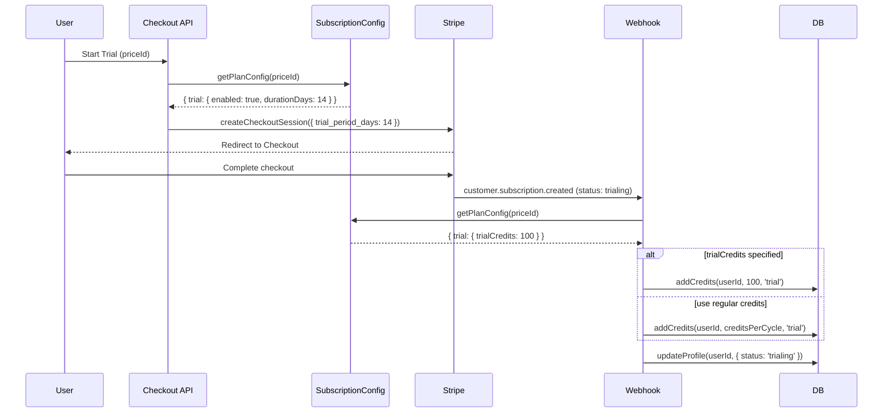
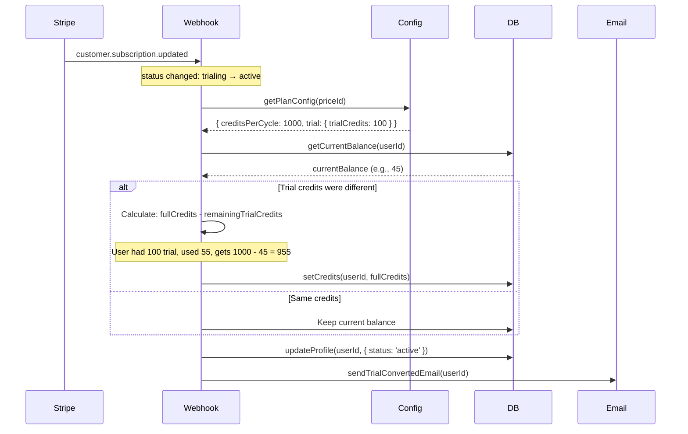

# Sub-PRD: Trial Period Support

**Parent PRD:** [subscription-config-system.md](../subscription-config-system.md)
**Version:** 1.0
**Status:** Draft
**Priority:** P1
**Estimated Effort:** 2-3 days

---

## Overview

Implement configurable trial periods for subscription plans. Trials allow users to experience premium features before committing to payment.

### Goals

1. Enable trial periods per plan via configuration
2. Support payment method requirement toggle
3. Allocate trial-specific credits if configured
4. Handle trial-to-paid conversion seamlessly
5. UI updates for trial status display

---

## Configuration Schema

```typescript
interface ITrialConfig {
  /** Trial enabled for this plan */
  enabled: boolean;

  /** Trial duration in days (e.g., 7, 14, 30) */
  durationDays: number;

  /** Credits during trial period (null = same as paid subscription) */
  trialCredits: number | null;

  /** Require payment method upfront */
  requirePaymentMethod: boolean;

  /** Allow multiple trials per user (false = one trial ever) */
  allowMultipleTrials: boolean;

  /** Convert to paid automatically or cancel */
  autoConvertToPaid: boolean;
}
```

### Example Configuration

```typescript
// Professional plan with 14-day trial
{
  key: 'pro',
  trial: {
    enabled: true,
    durationDays: 14,
    trialCredits: 100, // Limited credits during trial
    requirePaymentMethod: true,
    allowMultipleTrials: false,
    autoConvertToPaid: true,
  },
}

// Hobby plan - no trial
{
  key: 'hobby',
  trial: {
    enabled: false,
    durationDays: 0,
    trialCredits: null,
    requirePaymentMethod: true,
    allowMultipleTrials: false,
    autoConvertToPaid: true,
  },
}
```

---

## Context Analysis

### Current State

- Database schema supports `trialing` subscription status
- Webhook handler recognizes `trialing` status
- No configuration exists for trial settings
- No UI support for trial display
- Stripe Checkout supports `trial_period_days` parameter

### Files to Modify

```
app/api/checkout/route.ts             # Pass trial_period_days to Stripe
app/api/webhooks/stripe/route.ts      # Handle trial start/end events
client/components/stripe/PricingCard.tsx  # Show "Start Trial" button
client/components/stripe/SubscriptionStatus.tsx  # Show trial end date
app/dashboard/billing/page.tsx        # Trial information display
shared/config/subscription.config.ts  # Add trial config per plan
```

---

## Stripe Integration

### Checkout Session with Trial

```typescript
// app/api/checkout/route.ts
const planConfig = getSubscriptionConfig().plans.find(p => p.stripePriceId === priceId);

const checkoutParams: Stripe.Checkout.SessionCreateParams = {
  mode: 'subscription',
  line_items: [{ price: priceId, quantity: 1 }],
  success_url: `${baseUrl}/success?session_id={CHECKOUT_SESSION_ID}`,
  cancel_url: `${baseUrl}/pricing`,
  customer: stripeCustomerId,
  metadata: { user_id: userId },
};

// Add trial if configured
if (planConfig?.trial?.enabled) {
  checkoutParams.subscription_data = {
    trial_period_days: planConfig.trial.durationDays,
  };

  // Optionally skip payment method for trial
  if (!planConfig.trial.requirePaymentMethod) {
    checkoutParams.payment_method_collection = 'if_required';
  }
}
```

### Webhook Events to Handle

| Event                                                     | Action                                |
| --------------------------------------------------------- | ------------------------------------- |
| `customer.subscription.created` with `status: 'trialing'` | Allocate trial credits, set trial_end |
| `customer.subscription.updated`                           | Check for trial→active transition     |
| `customer.subscription.trial_will_end`                    | Send warning email (3 days before)    |

---

## Execution Flow

### Trial Start Sequence



### Trial End / Conversion Sequence



---

## Database Considerations

### Schema Changes

No schema changes required - existing fields support trial:

```sql
-- profiles.subscription_status already supports 'trialing'
-- subscriptions table stores trial_end from Stripe
```

### New Fields (Optional Enhancement)

```sql
-- Track trial history to enforce one-trial-per-user
ALTER TABLE profiles ADD COLUMN has_used_trial BOOLEAN DEFAULT FALSE;
ALTER TABLE profiles ADD COLUMN trial_started_at TIMESTAMPTZ;
ALTER TABLE profiles ADD COLUMN trial_ended_at TIMESTAMPTZ;
```

---

## UI Implementation

### PricingCard Changes

```typescript
// client/components/stripe/PricingCard.tsx

interface PricingCardProps {
  plan: IPlanConfig;
  isCurrentPlan: boolean;
  hasUsedTrial: boolean;
}

function PricingCard({ plan, isCurrentPlan, hasUsedTrial }: PricingCardProps) {
  const showTrialButton = plan.trial?.enabled && !hasUsedTrial && !isCurrentPlan;

  return (
    <Card>
      {plan.trial?.enabled && (
        <Badge variant="secondary">
          {plan.trial.durationDays}-day free trial
        </Badge>
      )}

      {/* ... pricing info ... */}

      {showTrialButton ? (
        <Button onClick={() => startTrial(plan.stripePriceId)}>
          Start {plan.trial.durationDays}-Day Trial
        </Button>
      ) : (
        <Button onClick={() => subscribe(plan.stripePriceId)}>
          Subscribe Now
        </Button>
      )}
    </Card>
  );
}
```

### SubscriptionStatus Changes

```typescript
// Show trial end date prominently
function SubscriptionStatus({ subscription }: Props) {
  if (subscription.status === 'trialing') {
    const trialEnd = new Date(subscription.trial_end);
    const daysLeft = differenceInDays(trialEnd, new Date());

    return (
      <Alert variant={daysLeft <= 3 ? 'warning' : 'info'}>
        <h4>Trial Active</h4>
        <p>{daysLeft} days remaining (ends {format(trialEnd, 'PPP')})</p>
        <p>Your card will be charged ${plan.priceInCents / 100}/month after trial.</p>
      </Alert>
    );
  }

  // ... existing status handling
}
```

---

## Implementation Steps

### Phase 1: Backend Foundation

- [ ] Add `ITrialConfig` to subscription types
- [ ] Add trial config to each plan in `subscription.config.ts`
- [ ] Create `getTrialConfig(priceId)` utility function
- [ ] Update checkout route to pass `trial_period_days`
- [ ] Add validation: trial days between 1-365

### Phase 2: Webhook Handling

- [ ] Update `handleSubscriptionUpdate()` for trial→active transition
- [ ] Handle trial credit allocation (different from regular)
- [ ] Add `customer.subscription.trial_will_end` handler
- [ ] Log trial events in credit_transactions

### Phase 3: UI Updates

- [ ] Update `PricingCard` with trial badge and button
- [ ] Update `SubscriptionStatus` with trial countdown
- [ ] Add trial info to billing page
- [ ] Create trial-specific success page variant

### Phase 4: Edge Cases

- [ ] Prevent multiple trials per user (if configured)
- [ ] Handle trial cancellation before conversion
- [ ] Handle failed payment at trial end
- [ ] Credit adjustment on trial-to-paid

---

## Testing Strategy

### Unit Tests

```typescript
describe('Trial Configuration', () => {
  test('getPlanConfig returns trial settings', () => {
    const config = getPlanConfig('price_pro');
    expect(config.trial.enabled).toBe(true);
    expect(config.trial.durationDays).toBe(14);
  });

  test('checkout includes trial_period_days when trial enabled', async () => {
    const session = await createCheckoutSession(userId, 'price_pro');
    expect(session.subscription_data.trial_period_days).toBe(14);
  });
});
```

### Integration Tests

| Scenario                     | Expected                                            |
| ---------------------------- | --------------------------------------------------- |
| Start trial on eligible plan | Subscription status = 'trialing', credits allocated |
| Trial converts to paid       | Status = 'active', credits adjusted                 |
| Cancel during trial          | Subscription canceled, no charge                    |
| Second trial attempt         | Rejected (if allowMultipleTrials: false)            |
| Trial with no payment method | Allowed (if requirePaymentMethod: false)            |

### Edge Cases

| Scenario                            | Expected Behavior               |
| ----------------------------------- | ------------------------------- |
| Trial enabled, durationDays = 0     | Validation error                |
| trialCredits > creditsPerCycle      | Warning log, allow              |
| Trial end on weekend                | Stripe handles, charge attempts |
| User cancels 1 day before trial end | No charge, subscription ends    |

---

## Acceptance Criteria

- [ ] Plans can have trial periods configured
- [ ] Stripe Checkout creates subscriptions with trial
- [ ] Trial status displays correctly in UI
- [ ] Credits allocated correctly during trial
- [ ] Trial converts to paid subscription seamlessly
- [ ] Trial warning email sent 3 days before end
- [ ] One-trial-per-user enforced (when configured)

---

## Rollback Plan

1. Set `trial.enabled: false` for all plans in config
2. Existing trialing subscriptions continue normally
3. New checkouts skip trial parameter
