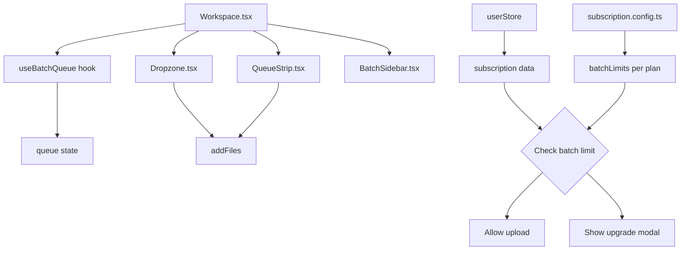
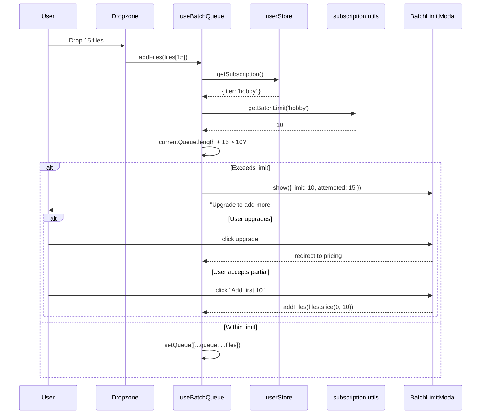
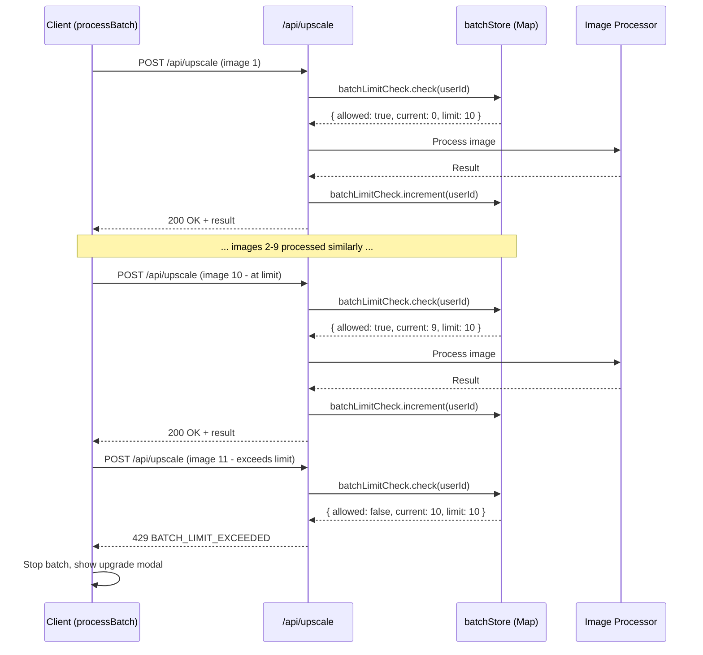

# PRD: Batch Upload as Paid-Only Feature

**Version:** 1.1
**Status:** Draft
**Date:** December 17, 2025
**Author:** Principal Architect

---

## Executive Summary

Restrict batch upload functionality to paid users only. Free users will be limited to single-image uploads, while paid tiers receive progressively higher batch limits. This aligns with the approved pricing strategy in `pricing-proposal-v2.md` and creates a strong conversion driver from free to paid.

**Enforcement Strategy:** Dual-layer enforcement with client-side for UX and server-side for security. Client provides immediate feedback; API prevents bypass attempts.

### Key Decisions

| Tier     | Batch Limit           | Price   |
| -------- | --------------------- | ------- |
| Free     | 1 (single image only) | $0      |
| Hobby    | 10 images             | $19/mo  |
| Pro      | 50 images             | $49/mo  |
| Business | 500 images            | $149/mo |

---

## 1. Context Analysis

### 1.1 Files Analyzed

```
/home/joao/projects/pixelperfect/shared/config/subscription.config.ts
/home/joao/projects/pixelperfect/shared/config/subscription.types.ts
/home/joao/projects/pixelperfect/shared/config/subscription.utils.ts
/home/joao/projects/pixelperfect/client/hooks/pixelperfect/useBatchQueue.ts
/home/joao/projects/pixelperfect/client/components/features/workspace/Workspace.tsx
/home/joao/projects/pixelperfect/client/components/features/workspace/BatchSidebar.tsx
/home/joao/projects/pixelperfect/client/components/features/workspace/QueueStrip.tsx
/home/joao/projects/pixelperfect/client/components/features/image-processing/Dropzone.tsx
/home/joao/projects/pixelperfect/client/store/userStore.ts
/home/joao/projects/pixelperfect/docs/business-model-canvas/economics/pricing-proposal-v2.md
```

### 1.2 Component & Dependency Overview



### 1.3 Current Behavior Summary

- **No batch limits exist** - users can upload unlimited images regardless of tier
- Files are added via `Dropzone.tsx` (initial upload) and `QueueStrip.tsx` (add more)
- `useBatchQueue.addFiles()` accepts an array of files with no validation
- Free user detection exists: `isFreeUser = !profile?.subscription_tier`
- Subscription config has no `batchLimit` field

### 1.4 Problem Statement

Batch upload is a high-value feature that should convert free users to paid tiers, but currently has no tier-based restrictions.

---

## 2. Proposed Solution

### 2.1 Architecture Summary

**Dual-Layer Enforcement:**

1. **Client-side (UX layer):** Enforce in `useBatchQueue.addFiles()` for immediate feedback
2. **Server-side (Security layer):** Enforce in `/api/upscale` using sliding window tracking

**Implementation:**

- Add `batchLimit` field to `IPlanConfig` interface and `SUBSCRIPTION_CONFIG`
- Add `getBatchLimit()` utility function to `subscription.utils.ts`
- Client: Enforce limits in `useBatchQueue.addFiles()` with upgrade modal
- Server: Track images processed per user in sliding window, reject when exceeded
- UI feedback showing current limit and usage

**Alternatives Considered:**

1. **Client-side enforcement only** - Rejected: Bypassable via DevTools or API calls
2. **Server-side enforcement only** - Rejected: Poor UX, user uploads then fails
3. **Separate batch feature flag** - Rejected: Overcomplicated, limits are sufficient
4. **No limit, just credit gating** - Rejected: Doesn't address research findings on batch as conversion driver

### 2.2 Architecture Diagram

```mermaid
flowchart TB
    subgraph Client["Client (UX Layer)"]
        A[Dropzone/QueueStrip] --> B[useBatchQueue.addFiles]
        B --> C{Check batch limit}
        C -->|Within limit| D[Add to queue]
        C -->|Exceeds limit| E[BatchLimitModal]
        E -->|Upgrade| F[Pricing page]
        E -->|Cancel| G[Trim to limit]
        D --> H[processBatch]
        H --> I[Sequential /api/upscale calls]
    end

    subgraph Server["Server (Security Layer)"]
        I --> J[/api/upscale]
        J --> K{Check sliding window}
        K -->|Within limit| L[Process image]
        K -->|Exceeds limit| M[429 BATCH_LIMIT_EXCEEDED]
        L --> N[Increment window counter]
        N --> O[Return result]
    end

    subgraph Storage["Tracking Storage"]
        P[In-memory Map] --> K
        N --> P
    end

    subgraph Config
        Q[subscription.config.ts] --> R[getBatchLimit]
        R --> C
        R --> K
    end
```

### 2.3 Key Technical Decisions

| Decision           | Choice                            | Rationale                                                       |
| ------------------ | --------------------------------- | --------------------------------------------------------------- |
| Client enforcement | `useBatchQueue.addFiles()`        | Single point of truth, catches all upload paths                 |
| Server enforcement | `/api/upscale` route              | Central processing endpoint, already has auth                   |
| Tracking storage   | In-memory (same as rate limiting) | Simple, no external deps, matches existing pattern              |
| Window duration    | 1 hour sliding window             | Balances security with legitimate batch re-tries                |
| Modal component    | New `BatchLimitModal`             | Consistent with existing `InsufficientCreditsModal`             |
| Config location    | `subscription.config.ts`          | Single source of truth for all subscription features            |
| Free tier limit    | 1                                 | Forces batch users to convert; matches `pricing-proposal-v2.md` |
| API error code     | `BATCH_LIMIT_EXCEEDED` (429)      | Distinct from rate limiting for client handling                 |

### 2.4 Data Model Changes

**Add to `subscription.types.ts`:**

```typescript
export interface IPlanConfig {
  // ... existing fields
  /** Maximum images in batch queue (null = unlimited) */
  batchLimit: number | null;
}
```

**Add to `subscription.config.ts`:**

```typescript
// In freeUser config
freeUser: {
  // ... existing
  batchLimit: 1, // Single image only
}

// In each plan
plans: [
  {
    key: 'hobby',
    // ... existing
    batchLimit: 10,
  },
  {
    key: 'pro',
    // ... existing
    batchLimit: 50,
  },
  {
    key: 'business',
    // ... existing
    batchLimit: 500,
  },
]
```

---

## 2.5 Runtime Execution Flow



---

## 3. Detailed Implementation Spec

### A. `shared/config/subscription.types.ts`

**Changes Needed:** Add `batchLimit` to `IPlanConfig` and `IFreeUserConfig`

```typescript
export interface IPlanConfig {
  // ... existing fields
  /** Maximum images allowed in batch queue (null = unlimited) */
  batchLimit: number | null;
}

export interface IFreeUserConfig {
  // ... existing fields
  /** Maximum images in batch queue for free users */
  batchLimit: number;
}
```

**Justification:** Type safety for new config field.

---

### B. `shared/config/subscription.config.ts`

**Changes Needed:** Add `batchLimit` values to all plans and freeUser config

```typescript
// In freeUser config
freeUser: {
  initialCredits: CREDIT_COSTS.DEFAULT_FREE_CREDITS,
  monthlyRefresh: false,
  monthlyCredits: CREDIT_COSTS.DEFAULT_TRIAL_CREDITS,
  maxBalance: CREDIT_COSTS.DEFAULT_FREE_CREDITS,
  batchLimit: 1, // NEW: Single image only for free users
},

// In plans array - add to each plan
{
  key: 'hobby',
  // ... existing fields
  batchLimit: 10, // NEW
},
{
  key: 'pro',
  // ... existing fields
  batchLimit: 50, // NEW
},
{
  key: 'business',
  // ... existing fields
  batchLimit: 500, // NEW
},
```

**Justification:** Centralized config per existing pattern.

---

### C. `shared/config/subscription.utils.ts`

**New Function:** `getBatchLimit()`

```typescript
/**
 * Get batch limit for a user based on their subscription tier
 * @param subscriptionTier - The user's subscription tier key (null = free user)
 * @returns Maximum images allowed in queue
 */
export function getBatchLimit(subscriptionTier: string | null): number {
  const config = getSubscriptionConfig();

  if (!subscriptionTier) {
    return config.freeUser.batchLimit;
  }

  const plan = config.plans.find(p => p.key === subscriptionTier);
  if (!plan) {
    // Unknown tier, default to free limit
    return config.freeUser.batchLimit;
  }

  return plan.batchLimit ?? Infinity;
}
```

**Justification:** Reusable utility following existing patterns in file.

---

### D. `client/hooks/pixelperfect/useBatchQueue.ts`

**Changes Needed:**

- Add batch limit check in `addFiles`
- Return `batchLimitExceeded` state for UI

```typescript
interface IUseBatchQueueReturn {
  // ... existing
  batchLimit: number;
  batchLimitExceeded: { attempted: number; limit: number } | null;
  clearBatchLimitError: () => void;
}

export const useBatchQueue = (): IUseBatchQueueReturn => {
  const { profile } = useUserData();
  const [batchLimitExceeded, setBatchLimitExceeded] = useState<{
    attempted: number;
    limit: number;
  } | null>(null);

  const batchLimit = getBatchLimit(profile?.subscription_tier ?? null);

  const addFiles = useCallback(
    (files: File[]) => {
      const currentCount = queue.length;
      const newCount = currentCount + files.length;

      if (newCount > batchLimit) {
        setBatchLimitExceeded({
          attempted: files.length,
          limit: batchLimit,
        });
        return; // Don't add any files
      }

      // ... existing addFiles logic
    },
    [queue.length, batchLimit]
  );

  const clearBatchLimitError = useCallback(() => {
    setBatchLimitExceeded(null);
  }, []);

  return {
    // ... existing
    batchLimit,
    batchLimitExceeded,
    clearBatchLimitError,
  };
};
```

**Justification:** Single enforcement point for all upload paths.

---

### E. `client/components/features/workspace/BatchLimitModal.tsx` (NEW)

**New File:** Modal shown when batch limit exceeded

```typescript
interface IBatchLimitModalProps {
  isOpen: boolean;
  onClose: () => void;
  limit: number;
  attempted: number;
  currentCount: number;
  onAddPartial: (count: number) => void;
}

export const BatchLimitModal: React.FC<IBatchLimitModalProps> = ({
  isOpen,
  onClose,
  limit,
  attempted,
  currentCount,
  onAddPartial,
}) => {
  const router = useRouter();
  const availableSlots = Math.max(0, limit - currentCount);

  return (
    <Modal isOpen={isOpen} onClose={onClose}>
      <div className="p-6">
        <div className="flex items-center gap-3 mb-4">
          <div className="p-2 bg-amber-100 rounded-full">
            <AlertTriangle className="w-6 h-6 text-amber-600" />
          </div>
          <h2 className="text-lg font-semibold">Batch Limit Reached</h2>
        </div>

        <p className="text-slate-600 mb-4">
          You tried to add {attempted} images, but your plan allows
          a maximum of {limit} images in the queue.
        </p>

        {limit === 1 && (
          <p className="text-sm text-slate-500 mb-4">
            Free users can only process one image at a time.
            Upgrade to unlock batch processing.
          </p>
        )}

        <div className="flex gap-3">
          <Button
            variant="primary"
            onClick={() => router.push('/pricing')}
          >
            Upgrade Plan
          </Button>

          {availableSlots > 0 && (
            <Button
              variant="outline"
              onClick={() => onAddPartial(availableSlots)}
            >
              Add {availableSlots} images
            </Button>
          )}

          <Button variant="ghost" onClick={onClose}>
            Cancel
          </Button>
        </div>
      </div>
    </Modal>
  );
};
```

**Justification:** Consistent with existing modal patterns (`InsufficientCreditsModal`).

---

### F. `client/components/features/workspace/Workspace.tsx`

**Changes Needed:** Integrate `BatchLimitModal`

```typescript
const Workspace: React.FC = () => {
  const {
    // ... existing destructuring
    batchLimit,
    batchLimitExceeded,
    clearBatchLimitError,
  } = useBatchQueue();

  // Handler for partial add from modal
  const handleAddPartial = (count: number) => {
    // Need to store pending files temporarily
    // This requires a small refactor to addFiles
  };

  return (
    <>
      {/* ... existing JSX */}

      <BatchLimitModal
        isOpen={!!batchLimitExceeded}
        onClose={clearBatchLimitError}
        limit={batchLimitExceeded?.limit ?? batchLimit}
        attempted={batchLimitExceeded?.attempted ?? 0}
        currentCount={queue.length}
        onAddPartial={handleAddPartial}
      />
    </>
  );
};
```

---

### G. UI Feedback: Batch Limit Indicator

**Add to `BatchSidebar.tsx` or `QueueStrip.tsx`:**

```typescript
// Show remaining slots in queue header
<p className="text-xs text-slate-500">
  {queue.length} / {batchLimit === Infinity ? '∞' : batchLimit} images
</p>

// Disable "Add More" button when at limit
<Dropzone
  disabled={isProcessing || queue.length >= batchLimit}
  // ...
/>
```

---

### H. API Enforcement: `/api/upscale/route.ts`

**Purpose:** Server-side enforcement prevents bypass via DevTools or direct API calls.

**Design Principles:**

1. **Non-blocking UX**: Client-side remains primary feedback mechanism
2. **Graceful degradation**: API errors handled smoothly in batch processing
3. **Clear error messaging**: Distinct error code for batch limits vs rate limits

**Changes Needed:**

```typescript
// New import
import { batchLimitCheck } from '@server/services/batch-limit.service';

// Add after rate limit check (line ~60), before processing
const batchCheck = batchLimitCheck.check(userId, profile?.subscription_tier ?? null);
if (!batchCheck.allowed) {
  logger.warn('Batch limit exceeded', {
    userId,
    tier: profile?.subscription_tier,
    current: batchCheck.current,
    limit: batchCheck.limit,
  });
  const { body, status } = createErrorResponse(
    ErrorCodes.BATCH_LIMIT_EXCEEDED,
    `Batch limit exceeded. Your plan allows ${batchCheck.limit} images per hour. ` +
      `You've processed ${batchCheck.current}. Upgrade for higher limits.`,
    429,
    {
      current: batchCheck.current,
      limit: batchCheck.limit,
      resetAt: batchCheck.resetAt,
      upgradeUrl: '/pricing',
    }
  );
  return NextResponse.json(body, {
    status,
    headers: {
      'X-Batch-Limit': batchCheck.limit.toString(),
      'X-Batch-Current': batchCheck.current.toString(),
      'X-Batch-Reset': batchCheck.resetAt.toISOString(),
    },
  });
}

// After successful processing (before return), increment counter
batchLimitCheck.increment(userId);
```

---

### I. Batch Limit Service: `server/services/batch-limit.service.ts` (NEW)

**New File:** Server-side batch limit tracking using sliding window (same pattern as `server/rateLimit.ts`)

```typescript
/**
 * Batch limit tracking using in-memory sliding window
 * Follows same pattern as server/rateLimit.ts
 *
 * Note: For multi-instance deployments at scale, consider:
 * - Supabase: Add batch_usage table with user_id, timestamp columns
 * - Cloudflare KV: Store JSON array of timestamps per user
 */

import { getBatchLimit } from '@shared/config/subscription.utils';

// Sliding window duration: 1 hour
const WINDOW_MS = 60 * 60 * 1000;

interface IBatchEntry {
  timestamps: number[];
}

// In-memory storage for batch tracking
const batchStore = new Map<string, IBatchEntry>();

// Cleanup old entries every 5 minutes (same as rateLimit.ts)
setInterval(
  () => {
    const windowStart = Date.now() - WINDOW_MS;

    for (const [key, entry] of batchStore.entries()) {
      entry.timestamps = entry.timestamps.filter(t => t > windowStart);
      if (entry.timestamps.length === 0) {
        batchStore.delete(key);
      }
    }
  },
  5 * 60 * 1000
);

interface IBatchLimitResult {
  allowed: boolean;
  current: number;
  limit: number;
  resetAt: Date;
}

export const batchLimitCheck = {
  /**
   * Check if user can process another image within their batch limit
   */
  check(userId: string, tier: string | null): IBatchLimitResult {
    const limit = getBatchLimit(tier);
    const now = Date.now();
    const windowStart = now - WINDOW_MS;

    let entry = batchStore.get(userId);
    if (!entry) {
      entry = { timestamps: [] };
      batchStore.set(userId, entry);
    }

    // Remove expired timestamps
    entry.timestamps = entry.timestamps.filter(t => t > windowStart);
    const current = entry.timestamps.length;

    // Calculate reset time (when oldest entry expires)
    const resetAt =
      entry.timestamps.length > 0
        ? new Date(entry.timestamps[0] + WINDOW_MS)
        : new Date(now + WINDOW_MS);

    return {
      allowed: current < limit,
      current,
      limit,
      resetAt,
    };
  },

  /**
   * Increment the batch counter after successful processing
   */
  increment(userId: string): void {
    let entry = batchStore.get(userId);
    if (!entry) {
      entry = { timestamps: [] };
      batchStore.set(userId, entry);
    }
    entry.timestamps.push(Date.now());
  },

  /**
   * Get current usage for a user (for potential API endpoint)
   */
  getUsage(
    userId: string,
    tier: string | null
  ): {
    current: number;
    limit: number;
    remaining: number;
  } {
    const limit = getBatchLimit(tier);
    const windowStart = Date.now() - WINDOW_MS;

    const entry = batchStore.get(userId);
    const timestamps = entry?.timestamps.filter(t => t > windowStart) ?? [];

    return {
      current: timestamps.length,
      limit,
      remaining: Math.max(0, limit - timestamps.length),
    };
  },
};
```

**Key Design Choices:**

| Choice                  | Rationale                                                         |
| ----------------------- | ----------------------------------------------------------------- |
| In-memory Map           | Matches existing `rateLimit.ts` pattern, no external deps         |
| Synchronous API         | No async overhead for simple Map operations                       |
| 1-hour window           | Long enough for legitimate retries, short enough to prevent abuse |
| Increment after success | Only count successfully processed images                          |
| 5-min cleanup interval  | Prevents memory leaks, matches rate limiter                       |

**Scaling Note:** For multi-instance deployments, migrate to:

- **Supabase**: `batch_usage` table with `user_id`, `processed_at` columns + RLS
- **Cloudflare KV**: JSON array of timestamps per user key

---

### J. Error Code Addition: `shared/utils/errors.ts`

**Add new error code:**

```typescript
export const ErrorCodes = {
  // ... existing codes
  BATCH_LIMIT_EXCEEDED: 'BATCH_LIMIT_EXCEEDED',
} as const;
```

---

### K. Client Error Handling: `client/utils/api-client.ts`

**Update `processImage` to handle batch limit errors gracefully:**

```typescript
// In processImage error handling
if (error.code === 'BATCH_LIMIT_EXCEEDED') {
  // Return structured error for UI handling
  throw new BatchLimitError({
    current: error.details?.current,
    limit: error.details?.limit,
    resetAt: error.details?.resetAt,
    message: error.message,
  });
}
```

---

### L. Batch Processing Error Handling: `useBatchQueue.ts`

**Handle server-side batch limit errors in `processSingleItem`:**

```typescript
import { BatchLimitError } from '@client/utils/api-client';

const processSingleItem = async (item: IBatchItem, config: IUpscaleConfig) => {
  // ... existing code

  try {
    const result = await processImage(item.file, config, onProgress);
    // ... success handling
  } catch (error: unknown) {
    // Handle batch limit exceeded from API
    if (error instanceof BatchLimitError) {
      // Stop batch processing, show upgrade modal
      setIsProcessingBatch(false);
      setBatchLimitExceeded({
        attempted: queue.filter(i => i.status === ProcessingStatus.IDLE).length,
        limit: error.limit,
        serverEnforced: true, // Flag to show different message
      });
      return;
    }

    // ... existing error handling
  }
};
```

---

## 3.1 API Enforcement Sequence Diagram



---

## 4. Step-by-Step Execution Plan

### Phase 1: Configuration (Shared)

- [ ] Add `batchLimit` to `IPlanConfig` interface in `subscription.types.ts`
- [ ] Add `batchLimit` to `IFreeUserConfig` interface in `subscription.types.ts`
- [ ] Add `batchLimit` values to all plans in `subscription.config.ts`
- [ ] Add `batchLimit: 1` to `freeUser` config
- [ ] Add `getBatchLimit()` utility to `subscription.utils.ts`
- [ ] Add `BATCH_LIMIT_EXCEEDED` to `ErrorCodes` in `shared/utils/errors.ts`

### Phase 2: API Enforcement (Server)

- [ ] Create `server/services/batch-limit.service.ts` with sliding window logic
- [ ] Add batch limit check to `/api/upscale/route.ts` (after rate limit, before processing)
- [ ] Add batch counter increment after successful processing
- [ ] Add response headers for batch limit info (`X-Batch-Limit`, `X-Batch-Current`, `X-Batch-Reset`)
- [ ] Write unit tests for `batch-limit.service.ts`

### Phase 3: Client Enforcement (Hook)

- [ ] Update `useBatchQueue` return type with batch limit fields
- [ ] Add batch limit check in `addFiles` callback
- [ ] Add `batchLimitExceeded` state and `clearBatchLimitError` action
- [ ] Import `getBatchLimit` and `useUserData` in hook
- [ ] Create `BatchLimitError` class in `client/utils/api-client.ts`
- [ ] Handle `BATCH_LIMIT_EXCEEDED` in `processImage` error handling
- [ ] Handle server-side batch errors in `processSingleItem`

### Phase 4: UI Components

- [ ] Create `BatchLimitModal.tsx` component
- [ ] Support `serverEnforced` flag for different messaging
- [ ] Integrate modal in `Workspace.tsx`
- [ ] Add limit indicator to `QueueStrip.tsx` header
- [ ] Disable "Add More" button when at limit

### Phase 5: Polish & UX

- [ ] Update Dropzone to show limit in empty state for free users
- [ ] Add limit info to pricing page feature comparison
- [ ] Update `subscription.config.ts` features array with batch limits
- [ ] Add analytics tracking for batch limit events

---

## 5. Testing Strategy

### Unit Tests

**`useBatchQueue.test.ts`:**

- Free user cannot add more than 1 file
- Hobby user cannot add more than 10 files
- Adding files at limit triggers `batchLimitExceeded`
- `clearBatchLimitError` clears the error state
- Handles `BatchLimitError` from API gracefully

**`getBatchLimit.test.ts`:**

- Returns 1 for null tier
- Returns correct limit for each plan key
- Returns free limit for unknown tier

**`batch-limit.service.test.ts`:** (NEW)

- `check()` returns `allowed: true` when under limit
- `check()` returns `allowed: false` when at limit
- `increment()` adds timestamp to user's entry
- Window cleanup removes entries older than 1 hour
- Returns correct limit based on subscription tier

### API Tests

**`batch-limit.api.spec.ts`:** (NEW)

- Returns 429 with `BATCH_LIMIT_EXCEEDED` when limit exceeded
- Includes `X-Batch-Limit`, `X-Batch-Current`, `X-Batch-Reset` headers
- Increments counter only on successful processing
- Does not increment on validation errors or insufficient credits
- Respects tier-specific limits (free=1, hobby=10, pro=50, business=500)

### Integration Tests

**`batch-limit.e2e.spec.ts`:**

- Free user sees modal after dropping 2+ files
- Paid user can add up to their limit
- Modal "Upgrade" button navigates to pricing
- Modal "Add partial" adds correct number
- Server-side rejection shows appropriate error message
- Batch stops when API returns `BATCH_LIMIT_EXCEEDED`

### Edge Cases

| Scenario                    | Expected Behavior                                     |
| --------------------------- | ----------------------------------------------------- |
| User downgrades mid-queue   | Existing queue preserved, can't add more              |
| User upgrades mid-queue     | New limit applied immediately                         |
| Drop 100 files as free user | Modal shows, no files added                           |
| At limit, try to add 1 more | Modal shows, suggest upgrade                          |
| Client-side bypassed        | API rejects with 429, client shows modal              |
| Server restart mid-batch    | In-memory resets, user can process again (acceptable) |
| Concurrent requests         | In-memory is single-threaded, no race conditions      |

---

## 6. Acceptance Criteria

### Client-Side

- [ ] Free users limited to 1 image in queue
- [ ] Hobby users limited to 10 images
- [ ] Pro users limited to 50 images
- [ ] Business users limited to 500 images
- [ ] Modal appears when limit exceeded
- [ ] "Add More" button disabled at limit
- [ ] Queue count shows `X / Y` format
- [ ] Upgrade button in modal links to pricing

### Server-Side (API)

- [ ] `/api/upscale` returns 429 when batch limit exceeded
- [ ] Response includes `X-Batch-*` headers with limit info
- [ ] `BATCH_LIMIT_EXCEEDED` error code in response body
- [ ] Counter only incremented after successful processing
- [ ] 1-hour sliding window correctly expires old entries

### Testing

- [ ] All unit tests pass (including new `batch-limit.service.test.ts`)
- [ ] API tests pass for limit enforcement
- [ ] E2E tests for both client and server enforcement pass

---

## 7. Verification & Rollback

### Success Criteria

- Conversion rate from free to paid increases (tracked via analytics)
- No user complaints about unexpected limit enforcement
- Batch feature mentioned in upgrade modal CTAs
- Zero successful bypass attempts via DevTools/direct API

### Rollback Plan

**Client-side (immediate):**

1. Set all `batchLimit` values to `null` (unlimited)
2. Remove modal trigger condition
3. Deploy within 5 minutes via config change

**Server-side (if issues):**

1. Comment out batch limit check in `/api/upscale/route.ts`
2. Deploy - API enforcement disabled, client-side still active

No database migrations required - fully in-memory enforcement.

---

## 8. Future Considerations

- **Persistent tracking**: Migrate to Supabase/Cloudflare KV for multi-instance deployments
- **Batch limit as add-on**: Consider selling additional batch capacity
- **Usage analytics**: Track batch sizes to inform future limit adjustments
- **API key support**: If public API added, enforce per-key batch limits
- **Grace period**: Allow small overage (e.g., 10%) before hard rejection

---

**Document End**

_Generated: December 17, 2025_
_Version 1.1: Added API enforcement layer (December 17, 2025)_
_Review Required: Product & Engineering_
