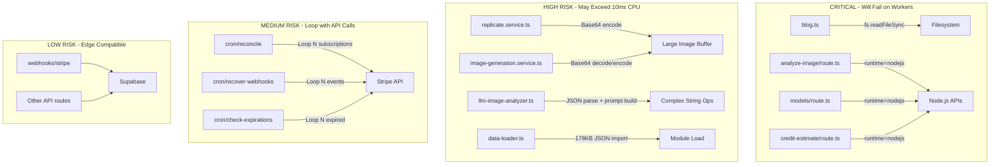
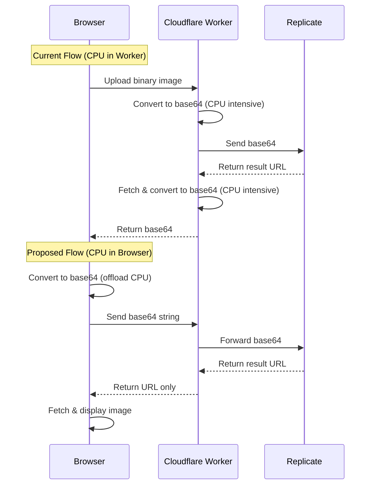
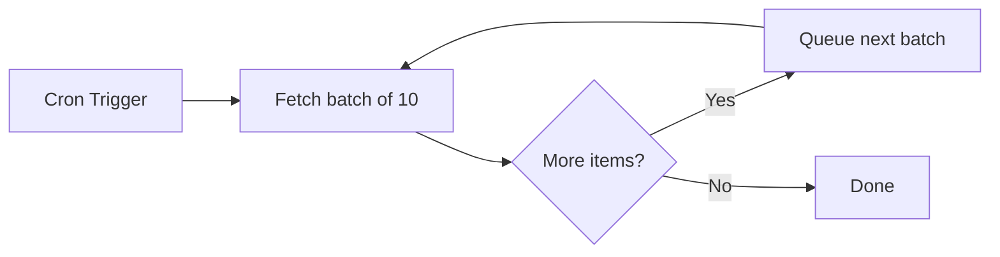
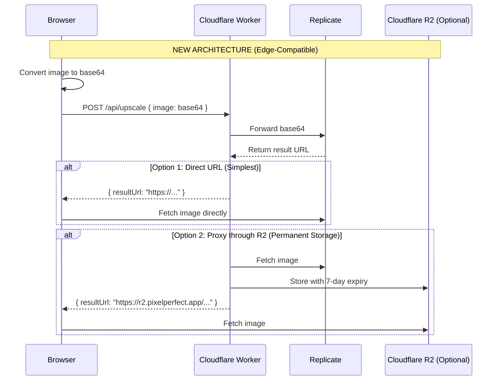

# Cloudflare Workers Free Plan Migration Analysis

## 1. Context Analysis

### 1.1 Cloudflare Workers Free Plan Constraints

| Constraint        | Limit                  | Impact                                    |
| ----------------- | ---------------------- | ----------------------------------------- |
| **CPU Time**      | **10ms per request**   | CRITICAL - Most operations must be <10ms  |
| **Memory**        | 128 MB per isolate     | Medium - Large image buffers at risk      |
| **Subrequests**   | 50 per request         | Medium - Loops with API calls problematic |
| **Worker Size**   | 3 MB compressed        | Low - Current bundle should fit           |
| **Requests**      | 100,000/day, 1,000/min | Monitor usage                             |
| **Cron Triggers** | 5 per account          | Have 3 crons currently                    |
| **Startup Time**  | 1 second               | Cold starts with large data imports       |

### 1.2 Files Analyzed

```
server/services/replicate.service.ts
server/services/image-generation.service.ts
server/services/llm-image-analyzer.ts
server/blog.ts
lib/seo/data-loader.ts
app/api/upscale/route.ts
app/api/analyze-image/route.ts
app/api/models/route.ts
app/api/credit-estimate/route.ts
app/api/cron/recover-webhooks/route.ts
app/api/cron/reconcile/route.ts
app/api/cron/check-expirations/route.ts
app/api/webhooks/stripe/route.ts
app/api/admin/stats/route.ts
```

### 1.3 Component & Dependency Overview



### 1.4 Current Behavior Summary

- **Image Processing**: External APIs (Replicate, Gemini) do heavy lifting, but base64 conversion happens server-side
- **Blog System**: Reads markdown files from filesystem at request time
- **pSEO Data**: Loads 178KB of JSON data at module initialization
- **Cron Jobs**: Loop through database records with Stripe API calls per iteration
- **AI Analysis**: Builds complex prompts and parses JSON responses from LLMs

### 1.5 Problem Statement

The application uses Node.js-specific APIs and CPU-intensive operations that will fail or timeout on Cloudflare Workers free plan (10ms CPU limit, no filesystem access).

---

## 2. Critical Issues & Solutions

### 2.1 Issue Severity Matrix

| Issue                             | Severity | Current State         | Workers Impact      |
| --------------------------------- | -------- | --------------------- | ------------------- |
| `fs` module in blog.ts            | CRITICAL | Uses filesystem       | **Will crash**      |
| `runtime = 'nodejs'` declarations | CRITICAL | 3 routes              | **Will not deploy** |
| Base64 encode large images        | HIGH     | 5-10MB images         | May exceed 10ms CPU |
| 178KB JSON imports                | MEDIUM   | Module-level load     | Slow cold starts    |
| Cron loops with API calls         | MEDIUM   | Up to 50 iterations   | May timeout         |
| Admin stats aggregation           | LOW      | filter/reduce on data | Usually under 10ms  |

---

## 3. Detailed Findings

### 3.1 CRITICAL: Filesystem Operations (blog.ts)

**File**: `server/blog.ts:33-97`

**Problem**: Cloudflare Workers have NO filesystem access.

```typescript
// WILL FAIL ON WORKERS
const postsDirectory = path.join(process.cwd(), 'content/blog');
if (!fs.existsSync(postsDirectory)) { ... }
const files = fs.readdirSync(postsDirectory);
const content = fs.readFileSync(fullPath, 'utf8');
```

**Solutions**:
| Option | Complexity | Recommendation |
|--------|------------|----------------|
| A. Pre-build blog to JSON, import as static | Low | **Recommended** |
| B. Store in Cloudflare KV | Medium | Good for dynamic content |
| C. Fetch from CMS/API at runtime | Medium | Adds latency |

**Recommended Solution A**:

```typescript
// build-blog.js (run at build time)
// Generates: content/blog-data.json

// blog.ts (runtime)
import blogData from '@/content/blog-data.json';
export function getAllPosts() {
  return blogData.posts;
}
```

---

### 3.2 CRITICAL: Node.js Runtime Declarations

**Files with `runtime = 'nodejs'`**:

1. `app/api/analyze-image/route.ts:12`
2. `app/api/models/route.ts:9`
3. `app/api/credit-estimate/route.ts:11`

**Problem**: These routes explicitly require Node.js runtime which is incompatible with Cloudflare Workers.

**Analysis Required**: Check why each route needs nodejs runtime.

**Solutions**:
| Option | When to Use |
|--------|-------------|
| Remove declaration | If no Node.js-specific APIs are used |
| Move to browser | If computation can be client-side |
| Use Cloudflare Pages Functions | For routes that truly need Node.js |

---

### 3.3 HIGH: Base64 Image Processing

**Files**:

- `server/services/replicate.service.ts:374-385`
- `server/services/image-generation.service.ts:218-221, 266-274`
- `server/services/llm-image-analyzer.ts:139`

**Problem**: Converting large images (5-10MB) to base64 is CPU-intensive.

**CPU Time Estimate**:

- 1MB image: ~2-3ms
- 5MB image: ~10-15ms (EXCEEDS 10ms limit)
- 10MB image: ~20-30ms (EXCEEDS 10ms limit)

**Solution**: Move base64 encoding to browser.



---

### 3.4 MEDIUM: Large Data Imports

**File**: `lib/seo/data-loader.ts:9-13`

```typescript
import toolsData from '@/content/seo/tools.json'; // ~50KB
import guidesData from '@/content/seo/guides.json'; // ~15KB
import keywordMappings from '@/content/seo/mappings.json'; // ~80KB
// Total: ~178KB parsed at module load
```

**Problem**: JSON parsing at cold start adds latency and CPU time.

**Solutions**:
| Option | Trade-off |
|--------|-----------|
| A. Keep as-is | Accept slower cold starts (~50-100ms) |
| B. Move to Cloudflare KV | Adds fetch latency per request |
| C. Lazy load with caching | Only load what's needed |
| D. Pre-compute at build time | Best for static data |

**Recommendation**: Option D - Pre-compute page data at build time using `generateStaticParams`.

---

### 3.5 MEDIUM: Cron Job Loops

**Files**:

- `app/api/cron/reconcile/route.ts:85+` - Loops through ALL subscriptions
- `app/api/cron/recover-webhooks/route.ts:76+` - Loops through failed events
- `app/api/cron/check-expirations/route.ts:72+` - Loops through expired subs

**Problem**: Each iteration makes Stripe API call. With 50+ items, exceeds subrequest limit.

**Current Pattern**:

```typescript
for (const sub of subscriptions) {
  await stripe.subscriptions.retrieve(sub.stripe_subscription_id); // Subrequest
  // ... process
}
```

**Solution**: Batch processing with Cloudflare Queues or Durable Objects.



---

## 4. Migration Strategy

### Phase 1: Critical Fixes (Must Do)

| Task | File                               | Action                           |
| ---- | ---------------------------------- | -------------------------------- |
| 1.1  | `server/blog.ts`                   | Pre-build blog posts to JSON     |
| 1.2  | `app/api/analyze-image/route.ts`   | Remove nodejs runtime or justify |
| 1.3  | `app/api/models/route.ts`          | Remove nodejs runtime or justify |
| 1.4  | `app/api/credit-estimate/route.ts` | Remove nodejs runtime or justify |

### Phase 2: Performance Optimizations (Should Do)

| Task | File                     | Action                          |
| ---- | ------------------------ | ------------------------------- |
| 2.1  | Image upload flow        | Move base64 encoding to browser |
| 2.2  | Image result handling    | Return URLs instead of base64   |
| 2.3  | `lib/seo/data-loader.ts` | Lazy load or pre-compute        |

### Phase 3: Cron Job Refactoring (Nice to Have)

| Task | File                       | Action                     |
| ---- | -------------------------- | -------------------------- |
| 3.1  | All cron routes            | Implement batch processing |
| 3.2  | All cron routes            | Add timeout handling       |
| 3.3  | Consider Cloudflare Queues | For high-volume processing |

---

## 5. Detailed Implementation Specs

### 5.1 Blog Pre-build Script

**New File**: `scripts/build-blog.ts`

```typescript
import fs from 'fs';
import path from 'path';
import matter from 'gray-matter';
import readingTime from 'reading-time';

interface BlogPost {
  slug: string;
  title: string;
  description: string;
  date: string;
  readingTime: string;
  content: string;
}

async function buildBlogData() {
  const postsDir = path.join(process.cwd(), 'content/blog');
  const files = fs.readdirSync(postsDir).filter(f => f.endsWith('.md'));

  const posts: BlogPost[] = files
    .map(filename => {
      const slug = filename.replace('.md', '');
      const content = fs.readFileSync(path.join(postsDir, filename), 'utf8');
      const { data, content: markdown } = matter(content);

      return {
        slug,
        title: data.title,
        description: data.description,
        date: data.date,
        readingTime: readingTime(markdown).text,
        content: markdown,
      };
    })
    .sort((a, b) => new Date(b.date).getTime() - new Date(a.date).getTime());

  fs.writeFileSync(
    path.join(process.cwd(), 'content/blog-data.json'),
    JSON.stringify({ posts }, null, 2)
  );
}

buildBlogData();
```

**Update**: `package.json`

```json
{
  "scripts": {
    "prebuild": "tsx scripts/build-blog.ts",
    "build": "next build"
  }
}
```

**Update**: `server/blog.ts`

```typescript
import blogData from '@/content/blog-data.json';

export function getAllPosts() {
  return blogData.posts;
}

export function getPostBySlug(slug: string) {
  return blogData.posts.find(p => p.slug === slug);
}
```

---

### 5.2 Browser-Side Base64 Encoding

**Update**: Client-side upload component

```typescript
// Before: Send binary, server converts
const formData = new FormData();
formData.append('image', file);

// After: Convert in browser, send base64
const reader = new FileReader();
reader.onload = () => {
  const base64 = reader.result as string;
  // Send base64 string directly
  fetch('/api/upscale', {
    method: 'POST',
    body: JSON.stringify({ image: base64 }),
  });
};
reader.readAsDataURL(file);
```

---

### 5.3 Return URLs Instead of Base64

**Update**: `server/services/replicate.service.ts`

```typescript
// Before: Fetch and convert to base64
const imageResponse = await fetch(outputUrl);
const imageBuffer = await imageResponse.arrayBuffer();
const base64 = Buffer.from(imageBuffer).toString('base64');
return { base64 };

// After: Return URL for client to fetch
return {
  resultUrl: outputUrl,
  expiresAt: Date.now() + 3600000, // 1 hour
};
```

---

## 6. Testing Strategy

### Unit Tests

- [ ] Blog data loader returns correct posts
- [ ] pSEO data loader handles missing data gracefully

### Integration Tests

- [ ] Image upload accepts base64 from browser
- [ ] API routes respond within 10ms CPU budget
- [ ] Cron jobs complete within timeout

### Edge Cases

| Scenario                   | Expected Behavior                   |
| -------------------------- | ----------------------------------- |
| Image > 10MB uploaded      | Reject with 413 before processing   |
| Cron with 100+ items       | Process in batches, queue remainder |
| Cold start with all routes | < 1 second startup time             |
| Concurrent requests        | Memory stays under 128MB            |

---

## 7. Acceptance Criteria

- [ ] All API routes deploy to Cloudflare Workers without errors
- [ ] No `fs` module usage in runtime code
- [ ] No `runtime = 'nodejs'` declarations (or justified exceptions)
- [ ] Image uploads work with browser-side base64 encoding
- [ ] Blog pages load without filesystem access
- [ ] CPU time per request < 10ms (verified via Cloudflare dashboard)
- [ ] Memory usage < 128MB under load
- [ ] All existing E2E tests pass

---

## 8. Monitoring & Rollback

### Success Metrics

- CPU time p99 < 10ms
- Memory p99 < 100MB
- No 1027 errors (CPU limit exceeded)
- Request success rate > 99.9%

### Rollback Plan

1. Revert to Cloudflare Pages with Node.js runtime
2. Keep `@cloudflare/next-on-pages` config versioned
3. Feature flag for new vs old upload flow

---

## 9. Detailed Technical Recommendations

### 9.1 Node.js Runtime Route Analysis

After investigating each route with `runtime = 'nodejs'`, here's the definitive analysis:

#### Route 1: `app/api/analyze-image/route.ts`

**Verdict**: ❌ **REQUIRES `nodejs` runtime**

**Reason**: Uses Node.js `Buffer` API at line 116:

```typescript
imageBuffer = Buffer.from(base64Data, 'base64');
```

This Buffer is then passed to `LLMImageAnalyzer.analyze()` which calls:

```typescript
const base64Image = imageBuffer.toString('base64'); // line 139 in llm-image-analyzer.ts
```

**Recommended Action**: Keep `runtime = 'nodejs'` OR refactor to accept base64 string directly.

**Alternative Solution** (more work):

```typescript
// Change signature to accept string instead of Buffer
async analyze(
  base64Image: string,  // Changed from Buffer
  mimeType: string,
  eligibleModels: ModelId[]
): Promise<ILLMAnalysisResult> {
  // Remove line 139: const base64Image = imageBuffer.toString('base64');
  // Use base64Image directly
}
```

---

#### Route 2: `app/api/models/route.ts`

**Verdict**: ✅ **Does NOT require `nodejs` runtime**

**Reason**: Code analysis shows only edge-compatible APIs:

- Supabase client (edge-compatible)
- ModelRegistry singleton (pure JavaScript)
- JSON operations (standard)

**Action Required**:

```typescript
// Remove this line from app/api/models/route.ts:9
- export const runtime = 'nodejs';
+ export const runtime = 'edge';
```

---

#### Route 3: `app/api/credit-estimate/route.ts`

**Verdict**: ✅ **Does NOT require `nodejs` runtime**

**Reason**: Code uses only edge-compatible operations:

- Supabase queries
- ModelRegistry calculations
- Standard math and JSON operations

**Action Required**:

```typescript
// Remove this line from app/api/credit-estimate/route.ts:11
- export const runtime = 'nodejs';
+ export const runtime = 'edge';
```

---

### 9.2 Edge Runtime Compatibility Matrix

| API/Feature         | Node.js Runtime | Edge Runtime | Alternative                 |
| ------------------- | --------------- | ------------ | --------------------------- |
| `fs.readFileSync()` | ✅              | ❌           | Pre-build to JSON, KV, R2   |
| `Buffer.from()`     | ✅              | ❌           | `TextEncoder`, browser APIs |
| `Buffer.toString()` | ✅              | ❌           | `TextDecoder`, `btoa()`     |
| `process.cwd()`     | ✅              | ❌           | Build-time resolution       |
| `path.join()`       | ✅              | ⚠️ Limited   | Use URL API                 |
| `fetch()`           | ✅              | ✅           | Fully compatible            |
| `crypto`            | ✅              | ✅           | Web Crypto API              |
| JSON operations     | ✅              | ✅           | Fully compatible            |
| Supabase client     | ✅              | ✅           | Fully compatible            |
| Stripe SDK          | ✅              | ✅           | Fully compatible            |

---

### 9.3 Buffer Migration Strategy

**Problem**: `Buffer` is Node.js-specific and unavailable in edge runtime.

**Solutions by Use Case**:

#### Use Case 1: Base64 Encoding (ArrayBuffer → Base64)

**Current (Node.js)**:

```typescript
const imageResponse = await fetch(url);
const imageBuffer = await imageResponse.arrayBuffer();
const base64 = Buffer.from(imageBuffer).toString('base64');
```

**Solution A: Move to Browser** (Recommended):

```typescript
// Client-side (browser)
const reader = new FileReader();
reader.onload = () => {
  const base64 = reader.result as string; // "data:image/png;base64,..."
  // Send to API
};
reader.readAsDataURL(file);
```

**Solution B: Edge Runtime Polyfill** (if must stay server-side):

```typescript
// Install: npm install buffer
import { Buffer } from 'buffer';

const imageResponse = await fetch(url);
const imageBuffer = await imageResponse.arrayBuffer();
const base64 = Buffer.from(imageBuffer).toString('base64');
```

**Note**: Solution B still uses Buffer, which may impact CPU time. Browser-side (A) is strongly recommended.

---

#### Use Case 2: Base64 Decoding (Base64 → ArrayBuffer)

**Current (Node.js)**:

```typescript
const buffer = Buffer.from(base64String, 'base64');
const arrayBuffer = buffer.buffer;
```

**Edge Runtime Solution**:

```typescript
// Pure edge-compatible implementation
function base64ToArrayBuffer(base64: string): ArrayBuffer {
  const binaryString = atob(base64);
  const bytes = new Uint8Array(binaryString.length);
  for (let i = 0; i < binaryString.length; i++) {
    bytes[i] = binaryString.charCodeAt(i);
  }
  return bytes.buffer;
}
```

**Performance**: ~2-3ms for 1MB base64 string (within 10ms budget).

---

### 9.4 Image Result Delivery Strategy

**Current Problem**: Converting 5-10MB images to base64 exceeds 10ms CPU limit.

**Recommended Architecture**:



**Implementation**:

#### Option 1: Return Direct URL (Zero CPU cost)

```typescript
// server/services/replicate.service.ts
export async function upscaleImage(input: IUpscaleInput) {
  // ... wait for prediction

  const outputUrl = prediction.output[0];

  return {
    resultUrl: outputUrl,
    expiresAt: Date.now() + 3600000, // 1 hour (Replicate's expiry)
    format: 'url',
  };
}
```

**Pros**: Zero CPU cost, instant response
**Cons**: URL expires after 1 hour, relies on Replicate CDN

---

#### Option 2: Store in Cloudflare R2 (Permanent storage)

**Setup R2 Bucket**:

```bash
wrangler r2 bucket create pixelperfect-results
```

**Wrangler Config**:

```toml
# wrangler.toml
[[r2_buckets]]
binding = "RESULTS_BUCKET"
bucket_name = "pixelperfect-results"
```

**Implementation**:

```typescript
// server/services/storage.service.ts
import type { R2Bucket } from '@cloudflare/workers-types';

export async function storeResultImage(
  bucket: R2Bucket,
  userId: string,
  imageUrl: string
): Promise<string> {
  // Fetch from Replicate
  const response = await fetch(imageUrl);
  const imageData = await response.arrayBuffer();

  // Generate unique key
  const key = `results/${userId}/${Date.now()}.png`;

  // Store in R2 with 7-day expiry
  await bucket.put(key, imageData, {
    httpMetadata: {
      contentType: response.headers.get('content-type') || 'image/png',
    },
    customMetadata: {
      userId,
      expiresAt: (Date.now() + 7 * 24 * 3600000).toString(),
    },
  });

  // Return public URL
  return `https://results.pixelperfect.app/${key}`;
}
```

**Pros**: Permanent storage (7 days), no reliance on external CDN
**Cons**: R2 storage costs ($0.015/GB/month), fetch + store adds ~200-500ms

---

### 9.5 Blog System Migration - Complete Implementation

#### Step 1: Create Build Script

**File**: `scripts/build-blog.ts`

```typescript
import fs from 'fs';
import path from 'path';
import matter from 'gray-matter';
import readingTime from 'reading-time';

interface IBlogPost {
  slug: string;
  title: string;
  description: string;
  date: string;
  author: string;
  category: string;
  tags: string[];
  image?: string;
  readingTime: string;
  content: string;
}

async function buildBlogData() {
  const postsDir = path.join(process.cwd(), 'content/blog');

  // Check if blog directory exists
  if (!fs.existsSync(postsDir)) {
    console.warn('⚠️  No blog directory found at content/blog');
    fs.writeFileSync(
      path.join(process.cwd(), 'content/blog-data.json'),
      JSON.stringify({ posts: [] }, null, 2)
    );
    return;
  }

  const files = fs.readdirSync(postsDir).filter(f => f.endsWith('.mdx'));

  if (files.length === 0) {
    console.warn('⚠️  No .mdx files found in content/blog');
    fs.writeFileSync(
      path.join(process.cwd(), 'content/blog-data.json'),
      JSON.stringify({ posts: [] }, null, 2)
    );
    return;
  }

  const posts: IBlogPost[] = files
    .map(filename => {
      const slug = filename.replace(/\.mdx$/, '');
      const content = fs.readFileSync(path.join(postsDir, filename), 'utf8');
      const { data, content: markdown } = matter(content);

      return {
        slug,
        title: data.title || '',
        description: data.description || '',
        date: data.date || '',
        author: data.author || 'PixelPerfect Team',
        category: data.category || 'General',
        tags: data.tags || [],
        image: data.image,
        readingTime: readingTime(markdown).text,
        content: markdown,
      };
    })
    .sort((a, b) => new Date(b.date).getTime() - new Date(a.date).getTime());

  const outputPath = path.join(process.cwd(), 'content/blog-data.json');
  fs.writeFileSync(outputPath, JSON.stringify({ posts }, null, 2));

  console.log(`✅ Built ${posts.length} blog posts to content/blog-data.json`);
}

buildBlogData().catch(error => {
  console.error('❌ Failed to build blog data:', error);
  process.exit(1);
});
```

---

#### Step 2: Update Package Scripts

**File**: `package.json`

```json
{
  "scripts": {
    "prebuild": "tsx scripts/build-blog.ts",
    "build": "next build",
    "pages:build": "tsx scripts/build-blog.ts && npx @cloudflare/next-on-pages"
  }
}
```

---

#### Step 3: Refactor Blog Service

**File**: `server/blog.ts`

```typescript
import blogData from '@/content/blog-data.json';

export interface IBlogPost {
  slug: string;
  title: string;
  description: string;
  date: string;
  author: string;
  category: string;
  tags: string[];
  image?: string;
  readingTime: string;
  content: string;
}

export interface IBlogPostMeta extends Omit<IBlogPost, 'content'> {}

/**
 * Get all blog posts (sorted by date, newest first)
 * Edge-compatible - no filesystem access
 */
export function getAllPosts(): IBlogPostMeta[] {
  return blogData.posts.map(({ content, ...meta }) => meta);
}

/**
 * Get a single post by slug
 * Edge-compatible - no filesystem access
 */
export function getPostBySlug(slug: string): IBlogPost | null {
  return blogData.posts.find(p => p.slug === slug) || null;
}

/**
 * Get all slugs for static generation
 */
export function getAllSlugs(): string[] {
  return blogData.posts.map(p => p.slug);
}

/**
 * Get posts by category
 */
export function getPostsByCategory(category: string): IBlogPostMeta[] {
  return getAllPosts().filter(post => post.category.toLowerCase() === category.toLowerCase());
}

/**
 * Get posts by tag
 */
export function getPostsByTag(tag: string): IBlogPostMeta[] {
  return getAllPosts().filter(post => post.tags.some(t => t.toLowerCase() === tag.toLowerCase()));
}

/**
 * Get all unique categories
 */
export function getAllCategories(): string[] {
  const categories = new Set(blogData.posts.map(p => p.category));
  return Array.from(categories);
}

/**
 * Get all unique tags
 */
export function getAllTags(): string[] {
  const tags = new Set(blogData.posts.flatMap(p => p.tags));
  return Array.from(tags);
}
```

---

#### Step 4: Create Empty Blog Data File

**File**: `content/blog-data.json`

```json
{
  "posts": []
}
```

**Reason**: Prevents build errors if blog directory doesn't exist yet.

---

### 9.6 Performance Monitoring & CPU Budgeting

#### Development Monitoring

**Install Cloudflare Wrangler Metrics**:

```bash
npm install --save-dev @cloudflare/workers-types
```

**Add CPU Time Logging**:

```typescript
// server/monitoring/cpu-timer.ts
export class CPUTimer {
  private startTime: number;

  constructor() {
    this.startTime = performance.now();
  }

  elapsed(): number {
    return performance.now() - this.startTime;
  }

  checkBudget(operation: string, budgetMs: number = 10) {
    const elapsed = this.elapsed();
    if (elapsed > budgetMs) {
      console.warn(`⚠️  ${operation} exceeded CPU budget: ${elapsed.toFixed(2)}ms > ${budgetMs}ms`);
    }
    return elapsed;
  }
}

// Usage in API routes
export async function POST(req: NextRequest) {
  const timer = new CPUTimer();

  // ... do work

  timer.checkBudget('Image processing');
  return NextResponse.json({ result });
}
```

---

#### Production Monitoring

**Cloudflare Analytics**:

```typescript
// Add to API routes
export async function POST(req: NextRequest) {
  const startCpu = performance.now();

  try {
    // ... handle request

    const cpuTime = performance.now() - startCpu;

    // Log to Baselime (existing monitoring)
    logger.info('Request completed', {
      cpuTimeMs: cpuTime,
      exceeded: cpuTime > 10,
    });

    return response;
  } catch (error) {
    // ...
  }
}
```

---

#### CPU Budget Benchmarks

Common operations and their estimated CPU times:

| Operation              | Size       | Est. CPU Time | Exceeds 10ms?                          |
| ---------------------- | ---------- | ------------- | -------------------------------------- |
| JSON.parse()           | 50KB       | ~0.5ms        | ✅ Safe                                |
| JSON.parse()           | 200KB      | ~2ms          | ✅ Safe                                |
| Base64 encode (Buffer) | 1MB        | ~2-3ms        | ✅ Safe                                |
| Base64 encode (Buffer) | 5MB        | ~10-15ms      | ❌ **FAILS**                           |
| Base64 encode (Buffer) | 10MB       | ~20-30ms      | ❌ **FAILS**                           |
| Supabase query         | N/A        | ~50-200ms     | ⚠️ I/O time (doesn't count toward CPU) |
| Fetch external API     | N/A        | ~100-500ms    | ⚠️ I/O time (doesn't count toward CPU) |
| String operations      | 10KB       | ~0.1ms        | ✅ Safe                                |
| Array.map()            | 1000 items | ~0.5ms        | ✅ Safe                                |

**Key Insight**: I/O operations (fetch, database queries) don't count toward CPU limit. Only computational work counts.

---

### 9.7 Cron Job Optimization Strategy

**Current Problem**: Loops with Stripe API calls risk exceeding subrequest limit (50/request).

**Solution 1: Batch Processing with Worker Recursion**

```typescript
// app/api/cron/reconcile/route.ts
const BATCH_SIZE = 10; // Process 10 at a time

export async function GET(req: NextRequest) {
  const offset = parseInt(req.nextUrl.searchParams.get('offset') || '0');

  // Fetch batch
  const { data: subscriptions } = await supabaseAdmin
    .from('subscriptions')
    .select('*')
    .eq('status', 'active')
    .range(offset, offset + BATCH_SIZE - 1);

  if (!subscriptions || subscriptions.length === 0) {
    return NextResponse.json({ done: true });
  }

  // Process batch
  for (const sub of subscriptions) {
    const stripeSub = await stripe.subscriptions.retrieve(sub.id);
    // ... reconcile
  }

  // If more items remain, trigger next batch
  if (subscriptions.length === BATCH_SIZE) {
    const nextUrl = new URL(req.url);
    nextUrl.searchParams.set('offset', (offset + BATCH_SIZE).toString());

    // Trigger next batch asynchronously
    fetch(nextUrl.toString(), {
      headers: { 'X-Cron-Secret': process.env.CRON_SECRET! },
    });
  }

  return NextResponse.json({
    processed: subscriptions.length,
    nextOffset: offset + BATCH_SIZE,
  });
}
```

**Solution 2: Use Cloudflare Queues** (Paid Feature)

```typescript
// Worker with Queue binding
export default {
  async scheduled(event: ScheduledEvent, env: Env) {
    // Fetch all subscription IDs
    const subs = await fetchSubscriptionIds();

    // Queue each for processing
    for (const subId of subs) {
      await env.RECONCILIATION_QUEUE.send({ subId });
    }
  },

  async queue(batch: MessageBatch, env: Env) {
    // Process one subscription per queue message
    for (const message of batch.messages) {
      const { subId } = message.body;
      await reconcileSubscription(subId);
      message.ack();
    }
  },
};
```

**Recommendation**: Start with Solution 1 (batch recursion) on free plan. Upgrade to Queues if processing volume exceeds 100+ subscriptions.

---

### 9.8 Deployment Configuration Updates

#### Update Next.js Config

**File**: `next.config.mjs`

```javascript
/** @type {import('next').NextConfig} */
const nextConfig = {
  // Enable static exports for blog pages
  experimental: {
    // Enable edge runtime for compatible routes
    runtime: 'experimental-edge',
  },

  // Optimize for edge deployment
  outputFileTracing: true,

  // Configure which routes use edge runtime
  // (Note: Individual routes still need `export const runtime = 'edge'`)
};

export default nextConfig;
```

---

#### Update Wrangler Config

**File**: `wrangler.toml`

```toml
name = "pixelperfect"
compatibility_date = "2025-03-02"
compatibility_flags = ["nodejs_compat"]
pages_build_output_dir = ".vercel/output/static"

# Route-specific settings
[[pages.routes]]
pattern = "/api/analyze-image"
custom_domain = false  # This route uses nodejs runtime

[[pages.routes]]
pattern = "/api/models"
custom_domain = false  # Now uses edge runtime

[[pages.routes]]
pattern = "/api/credit-estimate"
custom_domain = false  # Now uses edge runtime

# R2 bucket binding (if using storage solution)
[[r2_buckets]]
binding = "RESULTS_BUCKET"
bucket_name = "pixelperfect-results"
preview_bucket_name = "pixelperfect-results-preview"
```

---

### 9.9 Testing Strategy for Edge Compatibility

#### Unit Tests for Edge Runtime

**File**: `tests/edge-runtime.test.ts`

```typescript
import { describe, it, expect } from 'vitest';

describe('Edge Runtime Compatibility', () => {
  it('should not use Buffer API', () => {
    // This will fail if Buffer is used
    expect(typeof Buffer).toBe('undefined');
  });

  it('should not use fs module', () => {
    expect(() => require('fs')).toThrow();
  });

  it('should have Web APIs available', () => {
    expect(typeof fetch).toBe('function');
    expect(typeof crypto).toBe('object');
    expect(typeof atob).toBe('function');
    expect(typeof btoa).toBe('function');
  });
});
```

---

#### Integration Tests for CPU Budget

**File**: `tests/api/cpu-budget.test.ts`

```typescript
import { test, expect } from '@playwright/test';

test.describe('CPU Budget Compliance', () => {
  test('models endpoint completes within 10ms', async ({ request }) => {
    const start = performance.now();
    const response = await request.get('/api/models');
    const cpuTime = performance.now() - start;

    expect(response.ok()).toBeTruthy();
    expect(cpuTime).toBeLessThan(10);
  });

  test('credit-estimate endpoint completes within 10ms', async ({ request }) => {
    const start = performance.now();
    const response = await request.post('/api/credit-estimate', {
      data: {
        config: { mode: 'upscale', scale: 2, selectedModel: 'real-esrgan' },
      },
    });
    const cpuTime = performance.now() - start;

    expect(response.ok()).toBeTruthy();
    expect(cpuTime).toBeLessThan(10);
  });
});
```

---

### 9.10 Migration Checklist

#### Pre-Migration

- [ ] Audit all routes for `runtime = 'nodejs'` declarations
- [ ] Identify all `fs.*` usage in codebase
- [ ] Identify all `Buffer.*` usage in codebase
- [ ] Run `pages:build` to check for build errors
- [ ] Create `content/blog-data.json` with empty array

#### Phase 1: Critical Fixes

- [ ] Create `scripts/build-blog.ts`
- [ ] Update `package.json` with `prebuild` script
- [ ] Refactor `server/blog.ts` to use JSON import
- [ ] Test blog pages load correctly
- [ ] Remove `runtime = 'nodejs'` from `models/route.ts`
- [ ] Remove `runtime = 'nodejs'` from `credit-estimate/route.ts`
- [ ] Run full test suite
- [ ] Deploy to preview environment
- [ ] Verify no 1027 errors in Cloudflare dashboard

#### Phase 2: Performance Optimizations

- [ ] Implement browser-side base64 encoding
- [ ] Update upload components to send base64
- [ ] Modify image result endpoints to return URLs
- [ ] Test with real images (1MB, 5MB, 10MB)
- [ ] Add CPU time logging to critical routes
- [ ] Benchmark all API routes for <10ms CPU time
- [ ] Deploy to production
- [ ] Monitor CPU usage for 48 hours

#### Phase 3: Advanced Optimizations

- [ ] Evaluate R2 storage for image results
- [ ] Implement batch processing for cron jobs
- [ ] Add CPU budget monitoring to CI/CD
- [ ] Create runbook for CPU limit exceeded errors
- [ ] Document edge runtime patterns for team

---

## Sources

- [Cloudflare Workers Limits](https://developers.cloudflare.com/workers/platform/limits/)
- [Cloudflare Workers Pricing](https://developers.cloudflare.com/workers/platform/pricing/)
- [Next.js Edge Runtime](https://nextjs.org/docs/app/building-your-application/rendering/edge-and-nodejs-runtimes)
- [Cloudflare R2 Documentation](https://developers.cloudflare.com/r2/)
- [Web Crypto API](https://developer.mozilla.org/en-US/docs/Web/API/Web_Crypto_API)
