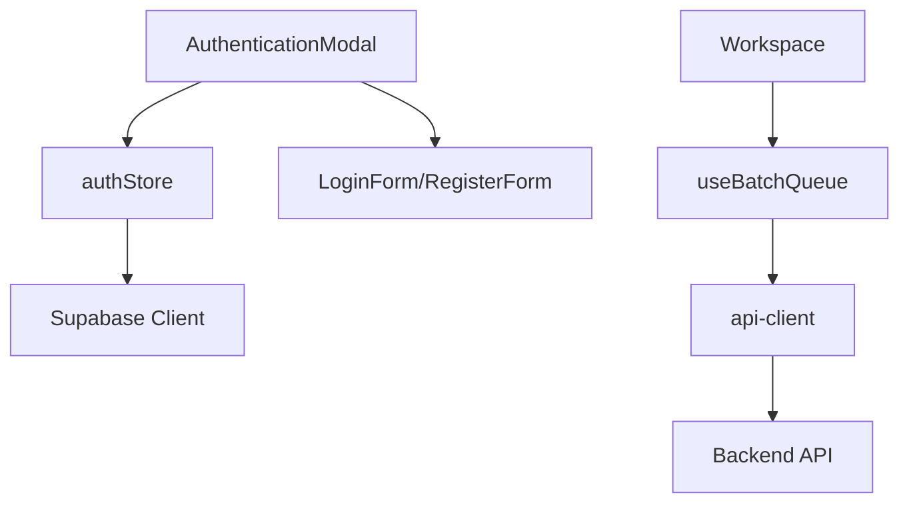
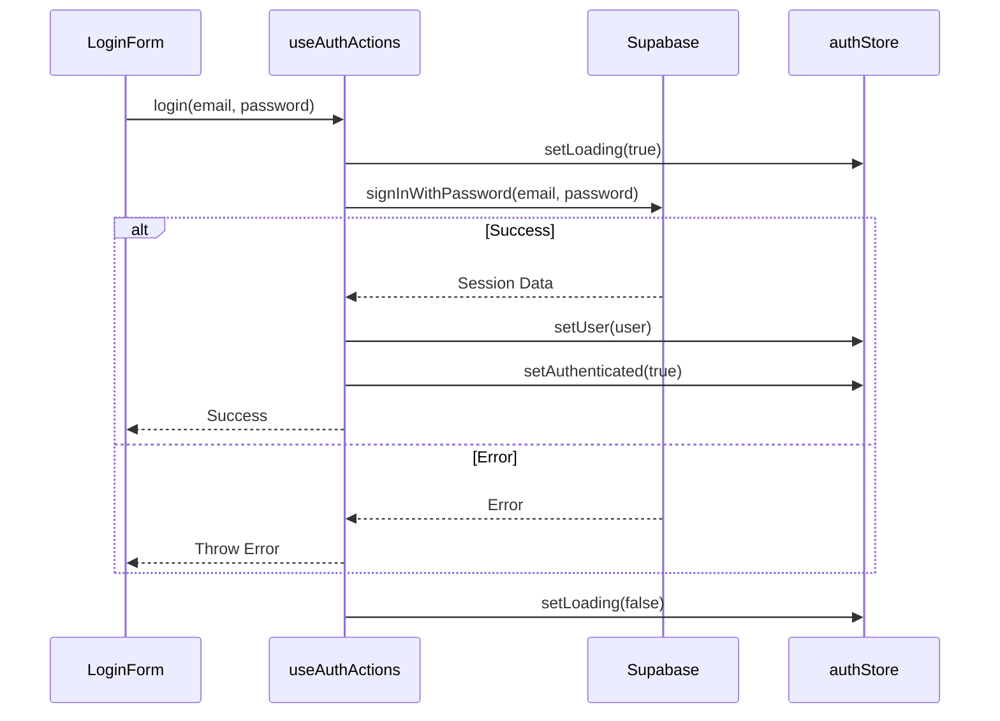

# Code Quality Audit & Refactoring Plan

## Role & Objectives

You are a **Principal Software Architect** optimizing for simplicity, correctness, performance, and maintainability.

Your mission:
Produce a `.md` **implementation plan so clear and explicit that a Junior Engineer can implement it without asking questions.**

### The John Carmack Standard

1. **Simplicity:** Prefer the simplest solution that satisfies the full requirements.
2. **Performance:** Consider complexity & bottlenecks. Call out Big-O concerns.
3. **Robustness:** Explicit error handling; no silent failures.
4. **Reasoning Transparency:** Every design choice must be justified.

---

## 1. Context Analysis

### 1.1 Files Analyzed

- `src/components/pixelperfect/Workspace/Workspace.tsx`
- `src/hooks/pixelperfect/useBatchQueue.ts`
- `src/store/authStore.ts`
- `src/components/modal/auth/AuthenticationModal.tsx`
- `src/components/modal/auth/LoginForm.tsx`
- `src/components/modal/auth/RegisterForm.tsx`
- `src/lib/pixelperfect/api-client.ts`

### 1.2 Component & Dependency Overview



### 1.3 Current Behavior Summary

- **Auth Store:** `authStore.ts` mixes state management (Zustand) with side effects (Supabase API calls, window redirects, toast notifications via `loadingStore`).
- **Auth Modal:** `AuthenticationModal.tsx` contains complex state logic for switching views and handles form submissions with repetitive try/catch blocks. It also contains a `useEffect` for auth state changes that could be abstracted.
- **Auth Forms:** `LoginForm` and `RegisterForm` share significant UI structure and styling but are separate components with duplicated code (DRY violation).
- **Batch Queue:** `useBatchQueue.ts` is generally well-structured but handles both state and API interaction logic.

### 1.4 Problem Statement

The codebase exhibits violations of SRP (Single Responsibility Principle) and DRY (Don't Repeat Yourself), particularly in the authentication layer. The `authStore` is doing too much (state + API + routing), and the `AuthenticationModal` is bloated with logic that belongs in custom hooks. This makes the code harder to test, maintain, and extend.

---

## 2. Proposed Solution

### 2.1 Architecture Summary

- **Decouple Store from Logic:** Refactor `authStore` to be a pure state manager. Move all Supabase API calls and side effects to a new hook `useAuthActions` or a service layer.
- **Encapsulate Modal Logic:** Create a `useAuthModal` hook to manage the view state (login/register/forgot-password) and the auth state listener.
- **Standardize Forms:** Create a generic `AuthFormWrapper` or shared UI components (`AuthButton`, `AuthInput`) to remove duplication in login/register forms.
- **Generic Error Handling:** Implement a unified error handling utility for auth actions to remove repetitive try/catch blocks in components.

### 2.2 Architecture Diagram (Mermaid)

```mermaid
flowchart LR
    subgraph UI Layer
        Modal[AuthenticationModal]
        Login[LoginForm]
        Register[RegisterForm]
    end

    subgraph Logic Layer
        Hook[useAuthActions Hook]
        ViewHook[useAuthModalView Hook]
    end

    subgraph State Layer
        Store[authStore (State Only)]
    end

    subgraph Service Layer
        Supabase[Supabase Client]
    end

    Modal --> ViewHook
    Modal --> Hook
    Login --> Hook
    Register --> Hook
    Hook --> Supabase
    Hook --> Store
```

### 2.3 Key Technical Decisions

- **Zustand for State Only:** We will restrict Zustand to holding the _result_ of actions (user, isAuthenticated, isLoading), not the actions themselves.
- **Custom Hooks for Actions:** `useAuthActions` will expose methods like `login`, `register`, `logout` that call Supabase and then update the store.
- **Composition for Forms:** Instead of inheritance or complex configuration, we'll use composition with shared UI components to clean up the forms.

### 2.4 Data Model Changes

- **No Data Changes.** The underlying data structures remain the same.

---

## 2.5 Runtime Execution Flow

**Login Flow (Refactored)**



---

## 3. Detailed Implementation Spec

### A. `src/store/authStore.ts`

- **Changes Needed:** Remove `signInWithEmail`, `signUpWithEmail`, `signOut`, etc. Keep only state setters (`setUser`, `setAuthenticated`, `setLoading`).
- **New Interface:**
  ```typescript
  interface IAuthState {
    isAuthenticated: boolean;
    isLoading: boolean;
    user: User | null;
    setUser: (user: User | null) => void;
    setAuthenticated: (value: boolean) => void;
    setLoading: (value: boolean) => void;
    reset: () => void;
  }
  ```

### B. `src/hooks/auth/useAuthActions.ts` (NEW)

- **Purpose:** Encapsulate all auth-related side effects.
- **Methods:** `login`, `register`, `logout`, `changePassword`, `resetPassword`.
- **Logic:**
  - Import `supabase` client.
  - Import `useAuthStore` to update state.
  - Handle `loadingStore` updates if we want to keep global loading, or just local loading.
  - Return async functions.

### C. `src/hooks/auth/useAuthModalView.ts` (NEW)

- **Purpose:** Manage the internal state of the `AuthenticationModal`.
- **State:** `currentView` (enum: 'LOGIN', 'REGISTER', 'FORGOT_PASSWORD', etc.).
- **Methods:** `switchToRegister`, `switchToLogin`, etc.

### D. `src/components/modal/auth/AuthenticationModal.tsx`

- **Changes:**
  - Replace local state variables (`isRegistering`, `isForgotPassword`, etc.) with `useAuthModalView`.
  - Replace direct store calls with `useAuthActions`.
  - Use a generic `handleSubmit` wrapper if possible.

### E. `src/components/modal/auth/LoginForm.tsx` & `RegisterForm.tsx`

- **Changes:**
  - Extract the submit button to `src/components/auth/AuthButton.tsx`.
  - Ensure consistent input styling.

---

## 4. Step-by-Step Execution Plan

#### Phase 1: Store & Hook Extraction

- [ ] Create `src/hooks/auth/useAuthActions.ts` and move logic from `authStore.ts`.
- [ ] Refactor `src/store/authStore.ts` to be state-only.
- [ ] Update `AuthenticationModal.tsx` to use the new hook.

#### Phase 2: Modal Logic Refactoring

- [ ] Create `src/hooks/auth/useAuthModalView.ts` to manage modal view state.
- [ ] Refactor `AuthenticationModal.tsx` to use this hook, simplifying the render logic.

#### Phase 3: UI Standardization

- [ ] Create `src/components/auth/AuthButton.tsx`.
- [ ] Apply `AuthButton` to `LoginForm`, `RegisterForm`, and other auth forms.
- [ ] Verify all styles match the original design.

---

## 5. Testing Strategy

#### Unit Tests

- **`useAuthActions`**: Mock Supabase and verify it calls the correct methods and updates the store.
- **`authStore`**: Verify setters work correctly.

#### Integration Tests

- **Login Flow**: Test that entering credentials and clicking login calls the hook and updates the UI.

#### Edge Cases

| Scenario                        | Expected Behavior                                             |
| :------------------------------ | :------------------------------------------------------------ |
| Network Error during Login      | Hook throws error, UI shows toast, loading state clears       |
| Invalid Credentials             | Hook throws specific error, UI shows validation message       |
| User closes modal while loading | Request continues but UI handles unmount gracefully (cleanup) |

---

## 6. Acceptance Criteria

- [ ] `authStore.ts` contains NO async logic or side effects.
- [ ] `AuthenticationModal.tsx` is under 150 lines of code (currently ~217).
- [ ] All auth features (Login, Register, Forgot Password, Change Password) function exactly as before.
- [ ] No regression in UI styling.
