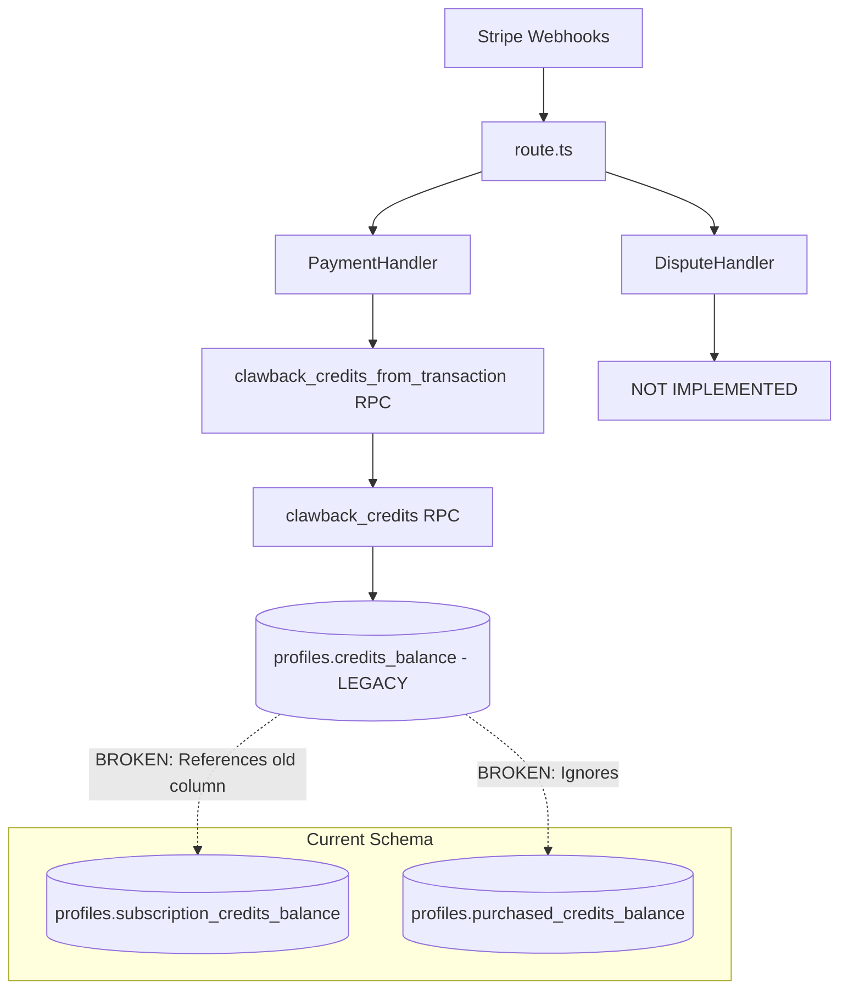
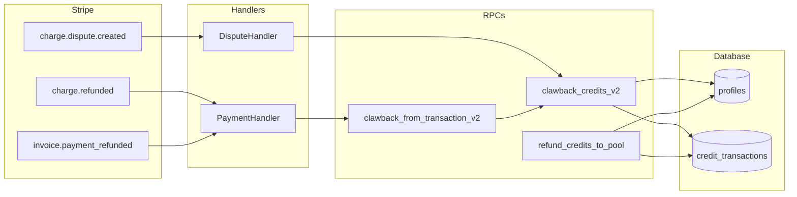
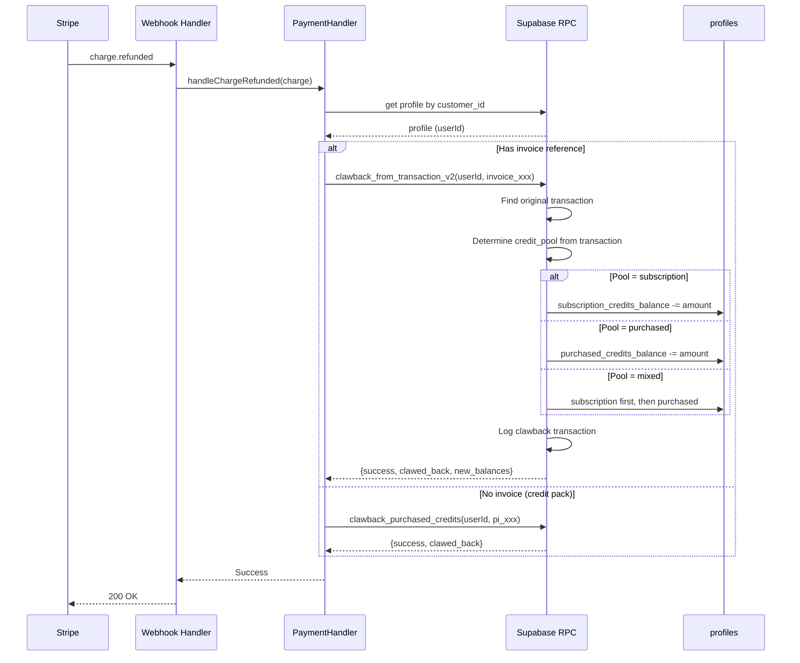
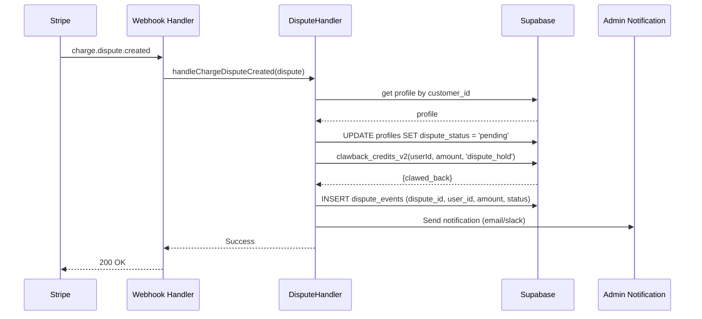

# PRD: Credit Refund System Overhaul

**Priority:** P0 - Critical
**Estimated Effort:** 2-3 days
**Author:** Engineering Team
**Date:** 2025-12-29

---

## 1. Context Analysis

### 1.1 Files Analyzed

- `supabase/migrations/20250202_add_credit_clawback_rpc.sql`
- `supabase/migrations/20251205_separate_credit_pools.sql`
- `supabase/migrations/20251205_update_credit_rpcs.sql`
- `supabase/migrations/20250221_secure_credits.sql`
- `app/api/webhooks/stripe/route.ts`
- `app/api/webhooks/stripe/handlers/payment.handler.ts`
- `app/api/webhooks/stripe/handlers/dispute.handler.ts`

### 1.2 Component & Dependency Overview



### 1.3 Current Behavior Summary

- **clawback_credits RPC:** References `credits_balance` column which was renamed to `subscription_credits_balance` in December 2025 migration
- **clawback_credits_from_transaction RPC:** Calls broken `clawback_credits` function
- **refund_credits RPC:** Routes to `increment_credits_with_log` which defaults to purchased pool (wrong for subscription refunds)
- **DisputeHandler:** Complete stub - logs TODO and does nothing
- **handleInvoicePaymentRefunded:** Empty stub with TODO comment
- **handleChargeRefunded:** Works but calls broken `clawback_credits_from_transaction`

### 1.4 Problem Statement

Users retain credits after chargebacks, refunds, and disputes because the credit clawback system references a legacy database schema and key handlers are unimplemented, causing direct financial loss.

---

## 2. Proposed Solution

### 2.1 Architecture Summary

1. **Update clawback RPCs** to use dual-pool schema (`subscription_credits_balance` + `purchased_credits_balance`)
2. **Track credit source** in transactions via `credit_pool` column to enable accurate refund routing
3. **Implement dispute handler** with credit hold, admin notification, and account flagging
4. **Implement invoice refund handler** mirroring the charge refund flow
5. **Add pool-aware refund_credits** function that restores to original pool

**Alternatives Considered:**

- Single pool approach: Rejected - would break purchased credits (never-expire) guarantee
- Full schema rewrite: Rejected - over-engineering, existing structure is sound

### 2.2 Architecture Diagram



### 2.3 Key Technical Decisions

| Decision                                 | Rationale                                                                                 |
| ---------------------------------------- | ----------------------------------------------------------------------------------------- |
| Add `credit_pool` column to transactions | Enables tracking which pool credits came from for accurate refund routing                 |
| Clawback from subscription pool first    | FIFO principle - subscription credits are consumed first, so clawback should reverse that |
| Use GREATEST(0, balance - amount)        | Prevent negative balances; clawback what's available                                      |
| Flag disputed accounts                   | Prevent further credit usage during dispute resolution                                    |

### 2.4 Data Model Changes

**New migration: `20251229_fix_credit_clawback.sql`**

```sql
-- Add credit_pool column to track source pool
ALTER TABLE credit_transactions
ADD COLUMN IF NOT EXISTS credit_pool TEXT
CHECK (credit_pool IN ('subscription', 'purchased', 'mixed'));

-- Backfill existing transactions
UPDATE credit_transactions
SET credit_pool = CASE
    WHEN type = 'subscription' THEN 'subscription'
    WHEN type = 'purchase' THEN 'purchased'
    ELSE 'mixed'
END
WHERE credit_pool IS NULL;

-- Add dispute_status to profiles for account flagging
ALTER TABLE profiles
ADD COLUMN IF NOT EXISTS dispute_status TEXT DEFAULT NULL
CHECK (dispute_status IN ('none', 'pending', 'resolved', 'lost'));
```

---

### 2.5 Runtime Execution Flow

#### Charge Refund Flow



#### Dispute Flow



---

## 3. Detailed Implementation Spec

### A. `supabase/migrations/20251229_fix_credit_clawback.sql`

**Changes Needed:**

- Add `credit_pool` column to `credit_transactions`
- Create `clawback_credits_v2` function with dual-pool support
- Create `clawback_from_transaction_v2` function
- Create `refund_credits_to_pool` function
- Create `dispute_events` table
- Add `dispute_status` to profiles

**Pseudo-code:**

```sql
-- clawback_credits_v2: Pool-aware clawback
CREATE OR REPLACE FUNCTION clawback_credits_v2(
    p_target_user_id UUID,
    p_amount INTEGER,
    p_reason TEXT DEFAULT 'Refund',
    p_ref_id TEXT DEFAULT NULL,
    p_pool TEXT DEFAULT 'subscription' -- 'subscription', 'purchased', or 'auto'
)
RETURNS TABLE (
    success BOOLEAN,
    subscription_clawed INTEGER,
    purchased_clawed INTEGER,
    new_subscription_balance INTEGER,
    new_purchased_balance INTEGER,
    error_message TEXT
) AS $$
DECLARE
    current_sub INTEGER;
    current_pur INTEGER;
    from_sub INTEGER := 0;
    from_pur INTEGER := 0;
BEGIN
    -- Lock and get balances
    SELECT subscription_credits_balance, purchased_credits_balance
    INTO current_sub, current_pur
    FROM profiles WHERE id = p_target_user_id FOR UPDATE;

    IF current_sub IS NULL THEN
        RETURN QUERY SELECT false, 0, 0, 0, 0, 'User not found'::TEXT;
        RETURN;
    END IF;

    -- Determine clawback split based on pool
    IF p_pool = 'subscription' THEN
        from_sub := LEAST(current_sub, p_amount);
        from_pur := LEAST(current_pur, p_amount - from_sub);
    ELSIF p_pool = 'purchased' THEN
        from_pur := LEAST(current_pur, p_amount);
        from_sub := LEAST(current_sub, p_amount - from_pur);
    ELSE -- 'auto': subscription first (reverse of consumption)
        from_sub := LEAST(current_sub, p_amount);
        from_pur := LEAST(current_pur, p_amount - from_sub);
    END IF;

    -- Update balances
    UPDATE profiles SET
        subscription_credits_balance = current_sub - from_sub,
        purchased_credits_balance = current_pur - from_pur,
        updated_at = NOW()
    WHERE id = p_target_user_id;

    -- Log transaction
    INSERT INTO credit_transactions (user_id, amount, type, reference_id, description, credit_pool)
    VALUES (p_target_user_id, -(from_sub + from_pur), 'clawback', p_ref_id, p_reason,
            CASE WHEN from_sub > 0 AND from_pur > 0 THEN 'mixed'
                 WHEN from_sub > 0 THEN 'subscription'
                 ELSE 'purchased' END);

    RETURN QUERY SELECT true, from_sub, from_pur,
                        current_sub - from_sub, current_pur - from_pur, NULL::TEXT;
END;
$$ LANGUAGE plpgsql SECURITY DEFINER;
```

**Justification:** Fixes the broken clawback by using current schema columns and tracking which pool credits came from.

---

### B. `app/api/webhooks/stripe/handlers/dispute.handler.ts`

**Changes Needed:**

- Implement `handleChargeDisputeCreated` with full dispute handling logic

**Pseudo-code:**

```typescript
export class DisputeHandler {
  static async handleChargeDisputeCreated(dispute: Stripe.Dispute): Promise<void> {
    const chargeId = typeof dispute.charge === 'string' ? dispute.charge : dispute.charge?.id;

    // 1. Get charge details to find customer
    const charge = await stripe.charges.retrieve(chargeId);
    const customerId = charge.customer as string;

    // 2. Get user profile
    const { data: profile } = await supabaseAdmin
      .from('profiles')
      .select('id, subscription_credits_balance, purchased_credits_balance')
      .eq('stripe_customer_id', customerId)
      .single();

    if (!profile) {
      console.error(`[DISPUTE] No profile for customer ${customerId}`);
      throw new Error('Profile not found for dispute');
    }

    // 3. Flag account as disputed
    await supabaseAdmin.from('profiles').update({ dispute_status: 'pending' }).eq('id', profile.id);

    // 4. Calculate credits to hold (dispute amount / average credit value)
    const disputeAmountCents = dispute.amount;
    const creditsToHold = Math.ceil(disputeAmountCents / 10); // $0.10 per credit estimate

    // 5. Clawback credits
    const { error } = await supabaseAdmin.rpc('clawback_credits_v2', {
      p_target_user_id: profile.id,
      p_amount: creditsToHold,
      p_reason: `Dispute hold: ${dispute.id}`,
      p_ref_id: `dispute_${dispute.id}`,
      p_pool: 'auto',
    });

    if (error) {
      console.error('[DISPUTE] Clawback failed:', error);
    }

    // 6. Log dispute event
    await supabaseAdmin.from('dispute_events').insert({
      dispute_id: dispute.id,
      user_id: profile.id,
      charge_id: chargeId,
      amount_cents: disputeAmountCents,
      credits_held: creditsToHold,
      status: 'created',
      reason: dispute.reason,
    });

    // 7. Send admin notification
    console.log(
      `[DISPUTE_ALERT] User ${profile.id} disputed charge ${chargeId} for ${disputeAmountCents} cents`
    );
    // TODO: Integrate with email/Slack notification service
  }
}
```

**Justification:** Implements the TODO stub with proper credit hold, account flagging, and audit trail.

---

### C. `app/api/webhooks/stripe/handlers/payment.handler.ts`

**Changes Needed:**

- Update `handleChargeRefunded` to use new `clawback_credits_v2`
- Implement `handleInvoicePaymentRefunded`
- Add credit pack refund support

**Key additions:**

```typescript
static async handleInvoicePaymentRefunded(invoice: Stripe.Invoice): Promise<void> {
  const customerId = invoice.customer as string;

  const { data: profile } = await supabaseAdmin
    .from('profiles')
    .select('id')
    .eq('stripe_customer_id', customerId)
    .maybeSingle();

  if (!profile) {
    console.error(`[INVOICE_REFUND] No profile for customer ${customerId}`);
    return;
  }

  // Clawback using invoice reference
  const { error } = await supabaseAdmin.rpc('clawback_from_transaction_v2', {
    p_target_user_id: profile.id,
    p_original_ref_id: `invoice_${invoice.id}`,
    p_reason: `Invoice refund: ${invoice.id}`
  });

  if (error) {
    console.error('[INVOICE_REFUND] Clawback failed:', error);
    throw error;
  }
}
```

---

## 4. Step-by-Step Execution Plan

### Phase 1: Database Layer (Can be done independently)

- [ ] Create migration `20251229_fix_credit_clawback.sql`
- [ ] Add `credit_pool` column to `credit_transactions`
- [ ] Backfill existing transactions with pool info
- [ ] Create `clawback_credits_v2` RPC
- [ ] Create `clawback_from_transaction_v2` RPC
- [ ] Create `refund_credits_to_pool` RPC
- [ ] Create `dispute_events` table
- [ ] Add `dispute_status` to profiles
- [ ] Write unit tests for new RPCs

### Phase 2: Webhook Handlers (Depends on Phase 1)

- [ ] Update `PaymentHandler.handleChargeRefunded` to use v2 RPC
- [ ] Implement `PaymentHandler.handleInvoicePaymentRefunded`
- [ ] Implement `DisputeHandler.handleChargeDisputeCreated`
- [ ] Add logging for all refund/dispute events

### Phase 3: Testing & Validation

- [ ] Test charge refund flow with subscription credits
- [ ] Test charge refund flow with purchased credits
- [ ] Test invoice refund flow
- [ ] Test dispute creation flow
- [ ] Verify backward compatibility with existing transactions

---

## 5. Testing Strategy

### Unit Tests

| Function                       | Test Cases                                                                     |
| ------------------------------ | ------------------------------------------------------------------------------ |
| `clawback_credits_v2`          | Subscription-only, purchased-only, mixed, insufficient balance, user not found |
| `clawback_from_transaction_v2` | Valid ref_id, invalid ref_id, partial clawback                                 |
| `refund_credits_to_pool`       | Correct pool routing                                                           |

### Integration Tests

- Webhook -> Handler -> RPC -> Database flow for each event type
- Verify `credit_transactions` audit trail accuracy
- Verify `dispute_events` creation

### Edge Cases

| Scenario                        | Expected Behavior                                 |
| ------------------------------- | ------------------------------------------------- |
| Refund > available credits      | Clawback available amount only, don't go negative |
| User has no profile             | Return error, don't crash webhook                 |
| Duplicate webhook delivery      | Idempotency service prevents double-clawback      |
| Dispute on already-used credits | Clawback what's available, flag account           |

---

## 6. Acceptance Criteria

- [ ] `clawback_credits_v2` correctly handles both credit pools
- [ ] Refunds route to correct pool based on original transaction
- [ ] Disputes flag user account and hold credits
- [ ] All clawback operations logged in `credit_transactions`
- [ ] Disputes logged in `dispute_events` table
- [ ] No negative credit balances possible
- [ ] Existing `handleChargeRefunded` continues working
- [ ] Webhook returns 200 for all implemented event types

---

## 7. Verification & Rollback

### Success Criteria

- All refund webhooks process without error
- Credit clawback amounts match original credit additions
- No customer complaints about incorrect balances
- Baselime logs show successful clawback operations

### Rollback Plan

1. **Database:** Migration includes reversible changes; can be rolled back with:

   ```sql
   DROP FUNCTION IF EXISTS clawback_credits_v2;
   DROP FUNCTION IF EXISTS clawback_from_transaction_v2;
   ALTER TABLE credit_transactions DROP COLUMN IF EXISTS credit_pool;
   ```

2. **Code:** Revert handler changes; old RPC calls will fail safely with "function not found"

3. **Feature Flag:** Not needed - webhook handlers already have error handling that returns 500 and triggers Stripe retry
