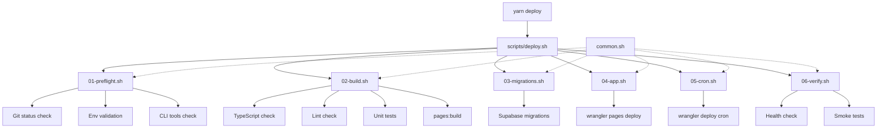
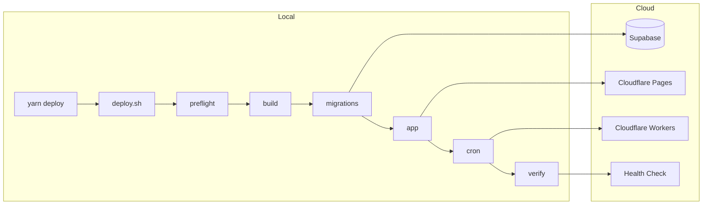
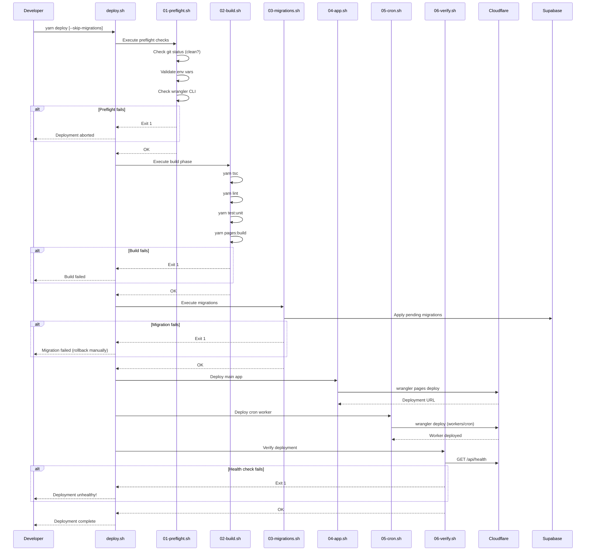

# Deploy System PRD

## 1. Context Analysis

### 1.1 Files Analyzed

```
scripts/setup.sh                    # Existing orchestrator pattern
scripts/setup/common.sh             # Shared utilities (colors, logging, prompts)
scripts/setup/01-dependencies.sh    # Dependency checking pattern
scripts/setup/05-migrations.sh      # Migration execution pattern
package.json                        # Current deploy: "pages:build && wrangler pages deploy"
.github/workflows/deploy.yml        # CI/CD workflow (reference only)
workers/cron/wrangler.toml          # Cron worker config
wrangler.toml                       # Main app config
```

### 1.2 Component & Dependency Overview



### 1.3 Current Behavior Summary

- `yarn deploy` runs `pages:build && wrangler pages deploy .vercel/output/static`
- No pre-deployment checks (lint, types, tests)
- No database migration deployment
- No cron worker deployment
- No post-deployment verification
- GitHub Actions handles full CI/CD but local `yarn deploy` is incomplete

### 1.4 Problem Statement

The current `yarn deploy` command only builds and deploys the main app, missing critical steps: quality checks, database migrations, cron worker deployment, and health verification.

---

## 2. Proposed Solution

### 2.1 Architecture Summary

- **Modular bash scripts** in `scripts/deploy/` mirroring `scripts/setup/` pattern
- **Orchestrator script** (`scripts/deploy.sh`) coordinates sequential phases
- **Shared utilities** extended in `scripts/deploy/common.sh` (reuses setup common)
- **Idempotent operations** - safe to re-run any step
- **Fail-fast behavior** - any step failure aborts deployment

**Alternative Considered - TypeScript via tsx:**

- Pros: Type safety, better error handling, consistent with codebase
- Cons: Extra dependency (tsx), slower startup, overkill for shell operations
- **Decision:** Bash chosen for consistency with existing `scripts/setup/` pattern and zero new dependencies

### 2.2 Architecture Diagram



### 2.3 Key Technical Decisions

| Decision       | Choice                           | Rationale                                      |
| -------------- | -------------------------------- | ---------------------------------------------- |
| Language       | Bash                             | Consistency with `scripts/setup/`, no new deps |
| Error handling | `set -euo pipefail`              | Fail-fast, catch undefined vars                |
| Migrations     | MCP tool or `supabase db push`   | Use available tooling                          |
| Verification   | curl health check + optional e2e | Fast feedback                                  |
| Rollback       | Manual via Cloudflare dashboard  | Automatic rollback complex, low ROI for MVP    |

### 2.4 Data Model Changes

**No Data Changes.** Deployment does not modify schema definitions.

---

### 2.5 Runtime Execution Flow



---

## 3. Detailed Implementation Spec

### A. `scripts/deploy/common.sh`

**Purpose:** Shared utilities for deploy scripts (extends setup/common.sh)

```bash
#!/bin/bash
# Source base common utilities
SCRIPT_DIR="$(cd "$(dirname "${BASH_SOURCE[0]}")" && pwd)"
source "$(dirname "$SCRIPT_DIR")/setup/common.sh"

# Deploy-specific colors
export DEPLOY_CYAN='\033[0;36m'

# Deployment timestamp for logging
export DEPLOY_TIMESTAMP=$(date +%Y%m%d_%H%M%S)

# Get deployment target (production URL)
get_deploy_url() {
    echo "${NEXT_PUBLIC_BASE_URL:-https://myimageupscaler.com.ai}"
}

# Check if we're on the correct branch
check_deploy_branch() {
    local current=$(git branch --show-current)
    local expected="${1:-master}"
    if [[ "$current" != "$expected" ]]; then
        log_warning "Not on $expected branch (currently on $current)"
        return 1
    fi
    return 0
}

# Check for uncommitted changes
check_clean_git() {
    if [[ -n $(git status --porcelain) ]]; then
        log_warning "Uncommitted changes detected"
        git status --short
        return 1
    fi
    return 0
}
```

**Justification:** Extends existing common.sh pattern, adds deploy-specific helpers.

---

### B. `scripts/deploy/01-preflight.sh`

**Purpose:** Validate environment before deployment

```bash
#!/bin/bash
set -euo pipefail

SCRIPT_DIR="$(cd "$(dirname "${BASH_SOURCE[0]}")" && pwd)"
source "$SCRIPT_DIR/common.sh"

preflight_check() {
    log_step "Running preflight checks..."

    local errors=0

    # 1. Check required CLI tools
    log_info "Checking CLI tools..."
    for cmd in wrangler node yarn git; do
        if ! command_exists "$cmd"; then
            log_error "Missing required command: $cmd"
            ((errors++))
        fi
    done

    # 2. Check environment files exist
    log_info "Checking environment configuration..."
    local project_root="$(dirname "$(dirname "$SCRIPT_DIR")")"

    if [[ ! -f "$project_root/.env.client" ]]; then
        log_error "Missing .env.client"
        ((errors++))
    fi

    if [[ ! -f "$project_root/.env.api" ]]; then
        log_error "Missing .env.api"
        ((errors++))
    fi

    # 3. Load and validate critical env vars
    load_env "$project_root"

    local required_vars=(
        "NEXT_PUBLIC_SUPABASE_URL"
        "NEXT_PUBLIC_SUPABASE_ANON_KEY"
        "NEXT_PUBLIC_BASE_URL"
        "STRIPE_SECRET_KEY"
    )

    for var in "${required_vars[@]}"; do
        if [[ -z "${!var:-}" ]]; then
            log_error "Missing required env var: $var"
            ((errors++))
        fi
    done

    # 4. Check git status (warning only)
    if ! check_clean_git; then
        log_warning "Consider committing changes before deploy"
    fi

    # 5. Check Cloudflare authentication
    log_info "Checking Cloudflare authentication..."
    if ! wrangler whoami &>/dev/null; then
        log_error "Not authenticated with Cloudflare. Run: wrangler login"
        ((errors++))
    fi

    if [[ $errors -gt 0 ]]; then
        log_error "Preflight check failed with $errors error(s)"
        return 1
    fi

    log_success "Preflight checks passed"
    return 0
}

# Allow sourcing or direct execution
if [[ "${BASH_SOURCE[0]}" == "${0}" ]]; then
    preflight_check
fi
```

---

### C. `scripts/deploy/02-build.sh`

**Purpose:** Run quality checks and build the application

```bash
#!/bin/bash
set -euo pipefail

SCRIPT_DIR="$(cd "$(dirname "${BASH_SOURCE[0]}")" && pwd)"
source "$SCRIPT_DIR/common.sh"

# Flags
SKIP_TESTS="${SKIP_TESTS:-false}"

build_app() {
    local project_root="$(dirname "$(dirname "$SCRIPT_DIR")")"
    cd "$project_root"

    log_step "Building application..."

    # 1. TypeScript check
    log_info "Running TypeScript check..."
    if ! yarn tsc; then
        log_error "TypeScript check failed"
        return 1
    fi
    log_success "TypeScript check passed"

    # 2. Linting
    log_info "Running linter..."
    if ! yarn lint; then
        log_error "Linting failed"
        return 1
    fi
    log_success "Linting passed"

    # 3. Unit tests (optional skip)
    if [[ "$SKIP_TESTS" != "true" ]]; then
        log_info "Running unit tests..."
        if ! yarn test:unit; then
            log_error "Unit tests failed"
            return 1
        fi
        log_success "Unit tests passed"
    else
        log_warning "Skipping unit tests (SKIP_TESTS=true)"
    fi

    # 4. Build for Cloudflare Pages
    log_info "Building for Cloudflare Pages..."
    if ! yarn pages:build; then
        log_error "Build failed"
        return 1
    fi

    # Verify build output exists
    if [[ ! -d ".vercel/output/static" ]]; then
        log_error "Build output directory not found"
        return 1
    fi

    log_success "Build complete"
    return 0
}

if [[ "${BASH_SOURCE[0]}" == "${0}" ]]; then
    build_app
fi
```

---

### D. `scripts/deploy/03-migrations.sh`

**Purpose:** Apply pending database migrations to Supabase

```bash
#!/bin/bash
set -euo pipefail

SCRIPT_DIR="$(cd "$(dirname "${BASH_SOURCE[0]}")" && pwd)"
source "$SCRIPT_DIR/common.sh"

deploy_migrations() {
    local project_root="$(dirname "$(dirname "$SCRIPT_DIR")")"
    load_env "$project_root"

    log_step "Deploying database migrations..."

    # Get project ref from URL
    local project_ref=$(get_supabase_project_ref)

    if [[ -z "$project_ref" ]]; then
        log_error "Could not determine Supabase project ref"
        return 1
    fi

    log_info "Target project: $project_ref"

    # Check if supabase CLI is available
    if command_exists supabase; then
        log_info "Using Supabase CLI for migrations..."

        cd "$project_root"

        # Link project if not already linked
        if [[ ! -f "supabase/.temp/project-ref" ]]; then
            log_info "Linking Supabase project..."
            supabase link --project-ref "$project_ref"
        fi

        # Push migrations
        if ! supabase db push; then
            log_error "Migration push failed"
            return 1
        fi

        log_success "Migrations applied via Supabase CLI"
    else
        # Fallback: Manual confirmation
        log_warning "Supabase CLI not installed"
        log_info "Migrations must be applied manually via Supabase Dashboard:"
        log_info "  https://supabase.com/dashboard/project/$project_ref/database/migrations"

        read -p "Have migrations been applied? [y/N] " -n 1 -r
        echo
        if [[ ! $REPLY =~ ^[Yy]$ ]]; then
            log_error "Deployment aborted - migrations not confirmed"
            return 1
        fi
    fi

    return 0
}

if [[ "${BASH_SOURCE[0]}" == "${0}" ]]; then
    deploy_migrations
fi
```

---

### E. `scripts/deploy/04-app.sh`

**Purpose:** Deploy main application to Cloudflare Pages

```bash
#!/bin/bash
set -euo pipefail

SCRIPT_DIR="$(cd "$(dirname "${BASH_SOURCE[0]}")" && pwd)"
source "$SCRIPT_DIR/common.sh"

PROJECT_NAME="${CF_PROJECT_NAME:-myimageupscaler.com}"

deploy_app() {
    local project_root="$(dirname "$(dirname "$SCRIPT_DIR")")"
    cd "$project_root"

    log_step "Deploying to Cloudflare Pages..."

    local build_dir=".vercel/output/static"

    if [[ ! -d "$build_dir" ]]; then
        log_error "Build directory not found: $build_dir"
        log_info "Run build step first: ./scripts/deploy/02-build.sh"
        return 1
    fi

    log_info "Project: $PROJECT_NAME"
    log_info "Build directory: $build_dir"

    # Deploy to Cloudflare Pages
    local deploy_output
    if ! deploy_output=$(wrangler pages deploy "$build_dir" --project-name="$PROJECT_NAME" 2>&1); then
        log_error "Deployment failed"
        echo "$deploy_output"
        return 1
    fi

    # Extract deployment URL from output
    local deploy_url=$(echo "$deploy_output" | grep -oE 'https://[a-z0-9-]+\.pages\.dev' | head -1)

    if [[ -n "$deploy_url" ]]; then
        log_success "Deployed to: $deploy_url"
        export DEPLOY_URL="$deploy_url"
    else
        log_success "Deployment complete"
    fi

    return 0
}

if [[ "${BASH_SOURCE[0]}" == "${0}" ]]; then
    deploy_app
fi
```

---

### F. `scripts/deploy/05-cron.sh`

**Purpose:** Deploy cron worker to Cloudflare Workers

```bash
#!/bin/bash
set -euo pipefail

SCRIPT_DIR="$(cd "$(dirname "${BASH_SOURCE[0]}")" && pwd)"
source "$SCRIPT_DIR/common.sh"

deploy_cron() {
    local project_root="$(dirname "$(dirname "$SCRIPT_DIR")")"
    local cron_dir="$project_root/workers/cron"

    log_step "Deploying cron worker..."

    if [[ ! -d "$cron_dir" ]]; then
        log_warning "Cron worker directory not found, skipping"
        return 0
    fi

    if [[ ! -f "$cron_dir/wrangler.toml" ]]; then
        log_warning "Cron worker config not found, skipping"
        return 0
    fi

    cd "$cron_dir"

    # Install cron worker dependencies if needed
    if [[ -f "package.json" && ! -d "node_modules" ]]; then
        log_info "Installing cron worker dependencies..."
        yarn install --frozen-lockfile
    fi

    log_info "Deploying cron worker..."
    if ! wrangler deploy; then
        log_error "Cron worker deployment failed"
        return 1
    fi

    log_success "Cron worker deployed"
    return 0
}

if [[ "${BASH_SOURCE[0]}" == "${0}" ]]; then
    deploy_cron
fi
```

---

### G. `scripts/deploy/06-verify.sh`

**Purpose:** Verify deployment health

```bash
#!/bin/bash
set -euo pipefail

SCRIPT_DIR="$(cd "$(dirname "${BASH_SOURCE[0]}")" && pwd)"
source "$SCRIPT_DIR/common.sh"

HEALTH_RETRIES="${HEALTH_RETRIES:-5}"
HEALTH_DELAY="${HEALTH_DELAY:-10}"

verify_deployment() {
    local project_root="$(dirname "$(dirname "$SCRIPT_DIR")")"
    load_env "$project_root"

    log_step "Verifying deployment..."

    local base_url="${DEPLOY_URL:-$(get_deploy_url)}"
    local health_url="$base_url/api/health"

    log_info "Target: $base_url"
    log_info "Health endpoint: $health_url"

    # Wait for deployment propagation
    log_info "Waiting 30s for deployment propagation..."
    sleep 30

    # Health check with retries
    local attempt=1
    while [[ $attempt -le $HEALTH_RETRIES ]]; do
        log_info "Health check attempt $attempt/$HEALTH_RETRIES..."

        local status_code=$(curl -s -o /dev/null -w "%{http_code}" "$health_url" 2>/dev/null || echo "000")

        if [[ "$status_code" == "200" ]]; then
            log_success "Health check passed (HTTP $status_code)"
            break
        fi

        log_warning "Health check returned HTTP $status_code"

        if [[ $attempt -eq $HEALTH_RETRIES ]]; then
            log_error "Health check failed after $HEALTH_RETRIES attempts"
            return 1
        fi

        log_info "Retrying in ${HEALTH_DELAY}s..."
        sleep "$HEALTH_DELAY"
        ((attempt++))
    done

    # Verify homepage loads
    log_info "Checking homepage..."
    local homepage_status=$(curl -s -o /dev/null -w "%{http_code}" "$base_url" 2>/dev/null || echo "000")

    if [[ "$homepage_status" != "200" ]]; then
        log_warning "Homepage returned HTTP $homepage_status"
    else
        log_success "Homepage loads correctly"
    fi

    log_success "Deployment verified"
    return 0
}

if [[ "${BASH_SOURCE[0]}" == "${0}" ]]; then
    verify_deployment
fi
```

---

### H. `scripts/deploy.sh`

**Purpose:** Main orchestrator script

```bash
#!/bin/bash
# ============================================================================
# myimageupscaler.com Deployment Orchestrator
# ============================================================================
# Orchestrates complete deployment: preflight → build → migrations → deploy → verify
#
# Usage:
#   yarn deploy                    # Full deployment
#   yarn deploy --skip-migrations  # Skip database migrations
#   yarn deploy --skip-cron        # Skip cron worker deployment
#   yarn deploy --skip-tests       # Skip unit tests during build
#   yarn deploy --help             # Show help
#
# Individual steps can be run directly:
#   ./scripts/deploy/01-preflight.sh
#   ./scripts/deploy/02-build.sh
#   ./scripts/deploy/03-migrations.sh
#   ./scripts/deploy/04-app.sh
#   ./scripts/deploy/05-cron.sh
#   ./scripts/deploy/06-verify.sh
# ============================================================================

set -euo pipefail

SCRIPT_DIR="$(cd "$(dirname "${BASH_SOURCE[0]}")" && pwd)"
DEPLOY_DIR="$SCRIPT_DIR/deploy"
PROJECT_ROOT="$(dirname "$SCRIPT_DIR")"

# Source common utilities
source "$DEPLOY_DIR/common.sh"

# Flags
SKIP_MIGRATIONS=false
SKIP_CRON=false
SKIP_TESTS=false
SKIP_VERIFY=false

# ============================================================================
# Help
# ============================================================================

show_help() {
    cat << EOF
${BOLD}myimageupscaler.com Deployment Orchestrator${NC}

Usage: ./scripts/deploy.sh [options]

Options:
  --skip-migrations   Skip database migration deployment
  --skip-cron         Skip cron worker deployment
  --skip-tests        Skip unit tests during build phase
  --skip-verify       Skip post-deployment verification
  --help, -h          Show this help message

Examples:
  ./scripts/deploy.sh                       # Full deployment
  ./scripts/deploy.sh --skip-migrations     # Deploy without migrations
  ./scripts/deploy.sh --skip-tests          # Fast deploy (no tests)
  yarn deploy                               # Via package.json

Deployment Phases:
  1. Preflight    - Validate environment and tools
  2. Build        - Type check, lint, test, and build
  3. Migrations   - Apply database migrations (Supabase)
  4. App Deploy   - Deploy to Cloudflare Pages
  5. Cron Deploy  - Deploy cron worker to Cloudflare Workers
  6. Verify       - Health check and smoke tests

Individual modules:
  ./scripts/deploy/01-preflight.sh   Environment validation
  ./scripts/deploy/02-build.sh       Build application
  ./scripts/deploy/03-migrations.sh  Database migrations
  ./scripts/deploy/04-app.sh         Deploy main app
  ./scripts/deploy/05-cron.sh        Deploy cron worker
  ./scripts/deploy/06-verify.sh      Verify deployment

EOF
    exit 0
}

# ============================================================================
# Parse Arguments
# ============================================================================

while [[ $# -gt 0 ]]; do
    case $1 in
        --skip-migrations) SKIP_MIGRATIONS=true; shift ;;
        --skip-cron) SKIP_CRON=true; shift ;;
        --skip-tests) SKIP_TESTS=true; export SKIP_TESTS=true; shift ;;
        --skip-verify) SKIP_VERIFY=true; shift ;;
        --help|-h) show_help ;;
        *) log_error "Unknown option: $1"; show_help ;;
    esac
done

# ============================================================================
# Banner
# ============================================================================

echo ""
echo -e "${CYAN}╔════════════════════════════════════════════════════════════╗${NC}"
echo -e "${CYAN}║${NC}            ${BOLD}myimageupscaler.com Deployment${NC}                         ${CYAN}║${NC}"
echo -e "${CYAN}║${NC}            $(date '+%Y-%m-%d %H:%M:%S')                           ${CYAN}║${NC}"
echo -e "${CYAN}╚════════════════════════════════════════════════════════════╝${NC}"
echo ""

# Make all deploy scripts executable
chmod +x "$DEPLOY_DIR"/*.sh 2>/dev/null || true

# Track timing
DEPLOY_START=$(date +%s)

# ============================================================================
# Phase 1: Preflight
# ============================================================================

source "$DEPLOY_DIR/01-preflight.sh"
preflight_check || exit 1

# ============================================================================
# Phase 2: Build
# ============================================================================

source "$DEPLOY_DIR/02-build.sh"
build_app || exit 1

# ============================================================================
# Phase 3: Migrations
# ============================================================================

if [[ "$SKIP_MIGRATIONS" != "true" ]]; then
    source "$DEPLOY_DIR/03-migrations.sh"
    deploy_migrations || exit 1
else
    log_info "Skipping migrations (--skip-migrations)"
fi

# ============================================================================
# Phase 4: Deploy App
# ============================================================================

source "$DEPLOY_DIR/04-app.sh"
deploy_app || exit 1

# ============================================================================
# Phase 5: Deploy Cron Worker
# ============================================================================

if [[ "$SKIP_CRON" != "true" ]]; then
    source "$DEPLOY_DIR/05-cron.sh"
    deploy_cron || exit 1
else
    log_info "Skipping cron worker (--skip-cron)"
fi

# ============================================================================
# Phase 6: Verify
# ============================================================================

if [[ "$SKIP_VERIFY" != "true" ]]; then
    source "$DEPLOY_DIR/06-verify.sh"
    verify_deployment || exit 1
else
    log_info "Skipping verification (--skip-verify)"
fi

# ============================================================================
# Summary
# ============================================================================

DEPLOY_END=$(date +%s)
DEPLOY_DURATION=$((DEPLOY_END - DEPLOY_START))

echo ""
echo -e "${CYAN}╔════════════════════════════════════════════════════════════╗${NC}"
echo -e "${CYAN}║${NC}              ${GREEN}${BOLD}Deployment Complete!${NC}                        ${CYAN}║${NC}"
echo -e "${CYAN}╚════════════════════════════════════════════════════════════╝${NC}"
echo ""

load_env "$PROJECT_ROOT"

echo -e "${BOLD}Deployment Summary:${NC}"
echo ""
echo "  Duration:    ${DEPLOY_DURATION}s"
echo "  App URL:     ${DEPLOY_URL:-$(get_deploy_url)}"
echo "  Health:      ${DEPLOY_URL:-$(get_deploy_url)}/api/health"
echo ""

echo -e "${BOLD}Quick Links:${NC}"
echo ""
echo "  Cloudflare:  https://dash.cloudflare.com/"
echo "  Supabase:    https://supabase.com/dashboard"
echo "  Stripe:      https://dashboard.stripe.com/"
echo ""
```

---

## 4. Step-by-Step Execution Plan

### Phase 1: Script Infrastructure

- [ ] Create `scripts/deploy/` directory
- [ ] Create `scripts/deploy/common.sh` with shared utilities
- [ ] Ensure `scripts/setup/common.sh` is reusable (no changes needed)

### Phase 2: Individual Deploy Scripts

- [ ] Create `scripts/deploy/01-preflight.sh`
- [ ] Create `scripts/deploy/02-build.sh`
- [ ] Create `scripts/deploy/03-migrations.sh`
- [ ] Create `scripts/deploy/04-app.sh`
- [ ] Create `scripts/deploy/05-cron.sh`
- [ ] Create `scripts/deploy/06-verify.sh`

### Phase 3: Orchestrator

- [ ] Create `scripts/deploy.sh` orchestrator
- [ ] Update `package.json` to use new deploy script

### Phase 4: Documentation

- [ ] Add inline script documentation
- [ ] Update `scripts/CLAUDE.md` with deploy scripts

---

## 5. Testing Strategy

### Manual Testing

| Step            | Command                            | Expected                        |
| --------------- | ---------------------------------- | ------------------------------- |
| Preflight only  | `./scripts/deploy/01-preflight.sh` | Passes with valid env           |
| Build only      | `./scripts/deploy/02-build.sh`     | Creates `.vercel/output/static` |
| Full deploy     | `yarn deploy`                      | Deploys all components          |
| Skip migrations | `yarn deploy --skip-migrations`    | Skips DB step                   |
| Skip tests      | `yarn deploy --skip-tests`         | Faster build                    |

### Edge Cases

| Scenario               | Expected Behavior                         |
| ---------------------- | ----------------------------------------- |
| Missing `.env.client`  | Preflight fails with clear message        |
| Wrangler not logged in | Preflight fails, prompts `wrangler login` |
| TypeScript errors      | Build phase fails, no deployment          |
| Migration failure      | Aborts before app deploy                  |
| Health check fails     | Warns but deployment already complete     |
| Uncommitted changes    | Warning only, continues                   |

---

## 6. Acceptance Criteria

- [ ] `yarn deploy` executes all 6 phases sequentially
- [ ] Each phase can run independently via direct script execution
- [ ] Failed phase prevents subsequent phases from running
- [ ] `--skip-*` flags work correctly
- [ ] Deployment time logged in summary
- [ ] Health check validates production endpoint
- [ ] Scripts follow existing `scripts/setup/` patterns
- [ ] No new npm dependencies required

---

## 7. Verification & Rollback

### Success Criteria

- Health endpoint returns 200
- Homepage loads without errors
- No console errors in browser
- Deployment URL accessible globally (CDN propagation ~30s)

### Rollback Plan

1. **Cloudflare Pages**: Dashboard → Deployments → "Rollback to this deployment"
2. **Database**: Migrations are additive; manual rollback via Supabase dashboard
3. **Cron Worker**: Redeploy previous version from git history

### Monitoring

- Check Baselime for errors post-deployment
- Verify Stripe webhooks still processing (Stripe dashboard)
- Monitor Supabase logs for auth/DB issues

---

## 8. Package.json Update

```json
{
  "scripts": {
    "deploy": "chmod +x ./scripts/deploy.sh ./scripts/deploy/*.sh && ./scripts/deploy.sh",
    "deploy:app": "./scripts/deploy/04-app.sh",
    "deploy:cron": "./scripts/deploy/05-cron.sh",
    "deploy:fast": "./scripts/deploy.sh --skip-tests --skip-migrations"
  }
}
```
