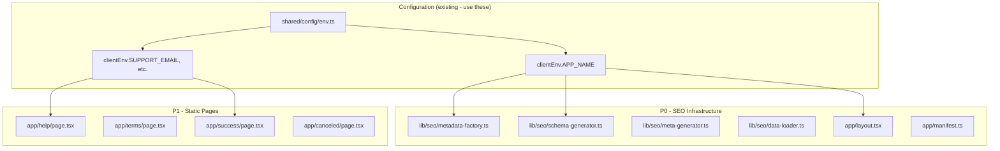
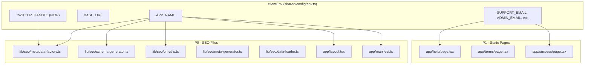

# Domain Configuration Centralization PRD

## 1. Context Analysis

### 1.1 Grep Results: 67 files contain hardcoded brand references

#### P3 - Internal Identifiers (Low Priority - Refactor Later):

| Type          | Change To                                                    | Files                                                         |
| ------------- | ------------------------------------------------------------ | ------------------------------------------------------------- |
| Cache keys    | `app_auth_cache`, `app_user_cache`                           | `client/store/auth/authCache.ts`, `client/store/userStore.ts` |
| Service names | Use env-based `${APP_ID}-api`, `${APP_ID}-cron`              | `server/monitoring/logger.ts`, `workers/cron/index.ts`        |
| Folder paths  | Rename `@shared/types/pixelperfect` → `@shared/types/models` | Requires folder rename + import updates                       |

**Note**: Internal identifiers don't affect users but should be genericized. The folder rename requires updating all imports - consider as separate task.

#### MUST CHANGE (user-facing brand text):

| Priority | Category           | Files                                                                                                                        | Issue                                             |
| -------- | ------------------ | ---------------------------------------------------------------------------------------------------------------------------- | ------------------------------------------------- |
| **P0**   | SEO/Metadata       | `lib/seo/metadata-factory.ts`, `schema-generator.ts`, `meta-generator.ts`, `data-loader.ts`, `url-utils.ts`                  | Hardcoded brand in titles, siteName, author       |
| **P0**   | Root Layout        | `app/layout.tsx`                                                                                                             | Hardcoded metadata throughout                     |
| **P0**   | Manifest           | `app/manifest.ts`                                                                                                            | Hardcoded app name                                |
| **P1**   | Static Pages       | `app/help/page.tsx`, `app/terms/page.tsx`, `app/features/page.tsx`, `app/how-it-works/page.tsx`, `app/verify-email/page.tsx` | Brand text + hardcoded emails                     |
| **P1**   | Payment Pages      | `app/success/page.tsx`, `app/canceled/page.tsx`, `app/pricing/page.tsx`                                                      | Hardcoded emails (need `SALES_EMAIL` env var too) |
| **P1**   | Landing Components | `client/components/features/landing/Pricing.tsx`, `CTASection.tsx`, `HomePageClient.tsx`                                     | Brand in UI text and schema                       |
| **P1**   | Dashboard          | `client/components/dashboard/DashboardSidebar.tsx`, `app/dashboard/support/page.tsx`                                         | Brand in sidebar/support                          |
| **P1**   | Footer             | `client/components/layout/Footer.tsx`                                                                                        | Brand name + hardcoded email                      |
| **P2**   | pSEO Pages         | `app/(pseo)/**/*.tsx`                                                                                                        | Brand references in templates                     |
| **P2**   | Blog               | `app/blog/page.tsx`, `app/blog/[slug]/page.tsx`                                                                              | Brand + "Try X Free" CTAs                         |
| **P3**   | Scripts            | `scripts/setup-stripe*.ts`, `scripts/build-blog.ts`                                                                          | Hardcoded in build/setup scripts                  |

### 1.2 Current Architecture



### 1.3 Current Behavior Summary

**Already Centralized (no changes needed):**

- `clientEnv.APP_NAME` - Application name (defaults to 'PixelPerfect')
- `clientEnv.BASE_URL` - Full URL with protocol (defaults to 'http://localhost:3000')
- `clientEnv.ADMIN_EMAIL`, `SUPPORT_EMAIL`, `LEGAL_EMAIL`, `PRIVACY_EMAIL` - Contact emails

**Remaining Hardcoded Issues:**

- SEO files have hardcoded brand strings instead of using `clientEnv.APP_NAME`
- Twitter handle hardcoded in metadata-factory.ts instead of using env var
- pSEO category descriptions contain hardcoded brand text

### 1.4 Problem Statement

**The existing `clientEnv.APP_NAME` is underutilized.** SEO infrastructure files (metadata-factory.ts, schema-generator.ts, url-utils.ts) hardcode brand strings instead of using the already-centralized environment variable.

---

## 2. Proposed Solution

### 2.1 Architecture Summary

**This is a MINIMAL refactor - no new modules required.**

- Replace hardcoded `'PixelPerfect'` strings with `clientEnv.APP_NAME`
- Add `NEXT_PUBLIC_TWITTER_HANDLE` env var for social handles
- Use existing `clientEnv` utilities - NO new domain.ts module needed

### 2.2 Architecture Diagram



### 2.3 Key Technical Decisions

| Decision                            | Rationale                                               |
| ----------------------------------- | ------------------------------------------------------- |
| NO new domain.ts module             | Existing `clientEnv` already provides everything needed |
| NO new DOMAIN env vars              | Domain extracted from BASE_URL if needed                |
| Use `clientEnv.APP_NAME` directly   | Already exists, just underutilized                      |
| Add optional TWITTER_HANDLE env var | Only config not already covered                         |

### 2.4 Data Model Changes

**No database changes required.** Only minor env.ts schema addition for TWITTER_HANDLE.

---

## 3. Detailed Implementation Spec

### A. `/shared/config/env.ts` (UPDATE)

**Add TWITTER_HANDLE and SALES_EMAIL to clientEnvSchema:**

```typescript
const clientEnvSchema = z.object({
  // ... existing fields ...

  // Contact (NEW)
  SALES_EMAIL: z.string().email().default('sales@example.com'),

  // Social (NEW)
  TWITTER_HANDLE: z.string().default(''),
});

function loadClientEnv(): IClientEnv {
  const env = {
    // ... existing fields ...
    SALES_EMAIL: process.env.NEXT_PUBLIC_SALES_EMAIL || 'sales@example.com',
    TWITTER_HANDLE: process.env.NEXT_PUBLIC_TWITTER_HANDLE || '',
  };
  return clientEnvSchema.parse(env);
}
```

---

### B. `/lib/seo/metadata-factory.ts` (UPDATE)

**Replace hardcoded strings:**

```typescript
import { clientEnv } from '@shared/config/env';

const BASE_URL = clientEnv.BASE_URL;
const APP_NAME = clientEnv.APP_NAME;
const TWITTER_HANDLE = clientEnv.TWITTER_HANDLE;

export function generateMetadata(page: PSEOPage, category: PSEOCategory): Metadata {
  return {
    // ... existing code ...

    openGraph: {
      // ...
      siteName: APP_NAME, // was: 'PixelPerfect'
    },

    twitter: {
      // ...
      creator: `@${TWITTER_HANDLE}`, // was: '@pixelperfect'
    },

    authors: [{ name: APP_NAME, url: BASE_URL }], // was: 'PixelPerfect'
    applicationName: APP_NAME, // was: 'PixelPerfect'
  };
}

export function generateCategoryMetadata(category: PSEOCategory): Metadata {
  // Same pattern - replace 'PixelPerfect' with APP_NAME
  // Replace '@pixelperfect' with `@${TWITTER_HANDLE}`
}
```

---

### C. `/lib/seo/url-utils.ts` (UPDATE)

**Replace hardcoded brand in descriptions:**

```typescript
import { clientEnv } from '@shared/config/env';

const APP_NAME = clientEnv.APP_NAME;

export function getCategoryDescription(category: PSEOCategory): string {
  const descriptions: Record<PSEOCategory, string> = {
    // ...
    compare: `Compare ${APP_NAME} with other image upscaling tools`, // was hardcoded
    // ...
  };
  return descriptions[category];
}
```

---

### D. `/lib/seo/schema-generator.ts` (UPDATE - if hardcoded)

**Verify and replace any hardcoded brand references with `clientEnv.APP_NAME`.**

---

## 4. Step-by-Step Execution Plan

### Phase 1: Add New Env Vars to env.ts

- [ ] Add `TWITTER_HANDLE` to `clientEnvSchema` in `/shared/config/env.ts`
- [ ] Add `SALES_EMAIL` to `clientEnvSchema`
- [ ] Add both to `loadClientEnv()` function
- [ ] Update `.env.client.example` with new variables

### Phase 2: Update SEO Infrastructure (P0)

- [ ] `/lib/seo/metadata-factory.ts`:
  - Replace all `'PixelPerfect'` → `APP_NAME`
  - Replace `'@pixelperfect'` → `` `@${TWITTER_HANDLE}` ``
- [ ] `/lib/seo/schema-generator.ts`:
  - Replace `name: 'PixelPerfect'` → `APP_NAME`
  - Replace `ORGANIZATION_SCHEMA.sameAs` array - either:
    - Use env vars: `TWITTER_URL`, `LINKEDIN_URL` (requires new env vars)
    - Derive from TWITTER_HANDLE: `` `https://twitter.com/${TWITTER_HANDLE}` ``
    - Or remove `sameAs` if not needed
- [ ] `/lib/seo/url-utils.ts`:
  - Replace `'Compare PixelPerfect with...'` → `` `Compare ${APP_NAME} with...` ``
- [ ] `/lib/seo/meta-generator.ts`:
  - Replace `'| PixelPerfect'` → `` `| ${APP_NAME}` ``
- [ ] `/lib/seo/data-loader.ts`:
  - Replace hardcoded brand in FAQ answers
- [ ] `/app/layout.tsx`:
  - Replace all hardcoded `'PixelPerfect AI'` strings
- [ ] `/app/manifest.ts`:
  - Replace hardcoded `name` and `short_name`

### Phase 3: Update Static Pages & Components (P1)

**Static Pages:**

- [ ] `/app/help/page.tsx` - Replace hardcoded emails → `clientEnv.SUPPORT_EMAIL`, brand text
- [ ] `/app/terms/page.tsx` - Replace brand references
- [ ] `/app/features/page.tsx`, `/app/how-it-works/page.tsx` - Replace metadata brand
- [ ] `/app/verify-email/page.tsx` - Replace metadata brand
- [ ] `/app/success/page.tsx`, `/app/canceled/page.tsx` - Replace emails
- [ ] `/app/pricing/page.tsx` - Replace `sales@` email (add `SALES_EMAIL` env var)

**Landing Components:**

- [ ] `/client/components/features/landing/Pricing.tsx` - Replace brand in schema
- [ ] `/client/components/features/landing/CTASection.tsx` - Replace brand text
- [ ] `/client/components/pages/HomePageClient.tsx` - Replace brand text

**Dashboard & Layout:**

- [ ] `/client/components/dashboard/DashboardSidebar.tsx` - Replace brand in sidebar
- [ ] `/app/dashboard/support/page.tsx` - Replace brand text
- [ ] `/client/components/layout/Footer.tsx` - Replace brand + email

### Phase 4: Update pSEO and Blog (P2)

- [ ] `/app/(pseo)/**/*.tsx` - Parameterize brand references in templates
- [ ] `/app/(pseo)/compare/page.tsx` - Replace "Compare X with..." text
- [ ] `/app/blog/page.tsx`, `/app/blog/[slug]/page.tsx` - Update metadata + CTAs

### Phase 5: Validation

- [ ] Run `yarn verify`
- [ ] Grep for remaining `pixelperfect` in user-facing strings
- [ ] Verify metadata renders correctly

---

## 5. Testing Strategy

### Verification Steps

1. Run `yarn verify` - all tests must pass
2. Run `yarn dev` and check browser dev tools for correct metadata
3. Verify OpenGraph tags show `APP_NAME` value, not hardcoded string
4. Verify Twitter card shows correct `@TWITTER_HANDLE`

### Edge Cases

| Scenario                       | Expected Behavior                             |
| ------------------------------ | --------------------------------------------- |
| Missing TWITTER_HANDLE env var | Default to 'pixelperfect'                     |
| APP_NAME not set               | Default to 'PixelPerfect' (existing behavior) |

---

## 6. Acceptance Criteria

### P0 (Must complete):

- [ ] No hardcoded brand strings in `/lib/seo/*.ts` files
- [ ] No hardcoded Twitter handle in metadata
- [ ] `app/layout.tsx` uses `clientEnv.APP_NAME`
- [ ] `app/manifest.ts` uses `clientEnv.APP_NAME`
- [ ] `yarn verify` passes

### P1 (Should complete):

- [ ] Static pages use `clientEnv.*_EMAIL` instead of hardcoded emails
- [ ] Landing components use `clientEnv.APP_NAME`
- [ ] Footer uses `clientEnv.APP_NAME` and `clientEnv.SUPPORT_EMAIL`
- [ ] Dashboard sidebar uses `clientEnv.APP_NAME`

### P2 (Nice to have):

- [ ] pSEO templates use env vars
- [ ] Blog pages use env vars

### Validation:

- [ ] `grep -rE "(PixelPerfect|pixelperfect\.(com|app))" --include="*.tsx" app/ lib/ client/` returns only:
  - Cache keys (e.g., `pixelperfect_auth_cache`)
  - Import paths (e.g., `@shared/types/pixelperfect`)
  - Env defaults in `env.ts`
- [ ] Metadata renders correctly in browser dev tools

---

## 7. Verification & Rollback

### Success Criteria

- `yarn verify` completes without errors
- `yarn dev` starts correctly
- Browser dev tools show correct metadata values

### Rollback Plan

1. `git checkout .` to revert all changes
2. Run `yarn verify` to confirm rollback

---

## Appendix: Environment Variable Reference

### New Variables

| Variable                     | Example             | Purpose                    |
| ---------------------------- | ------------------- | -------------------------- |
| `NEXT_PUBLIC_TWITTER_HANDLE` | `myapp`             | Twitter handle (without @) |
| `NEXT_PUBLIC_SALES_EMAIL`    | `sales@example.com` | Sales contact email        |

### Existing Variables (Already Centralized)

| Variable                    | Purpose                |
| --------------------------- | ---------------------- |
| `NEXT_PUBLIC_APP_NAME`      | Application/brand name |
| `NEXT_PUBLIC_BASE_URL`      | Full URL with protocol |
| `NEXT_PUBLIC_SUPPORT_EMAIL` | Support contact email  |
| `NEXT_PUBLIC_ADMIN_EMAIL`   | Admin contact email    |
| `NEXT_PUBLIC_LEGAL_EMAIL`   | Legal contact email    |
| `NEXT_PUBLIC_PRIVACY_EMAIL` | Privacy contact email  |
