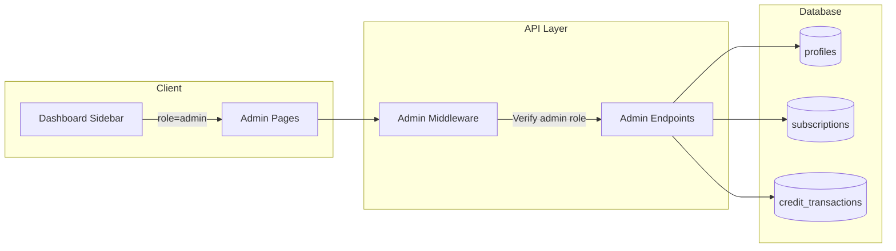
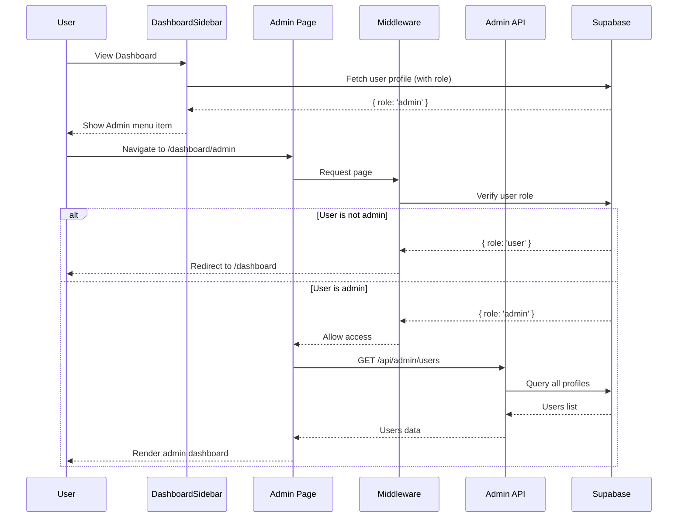
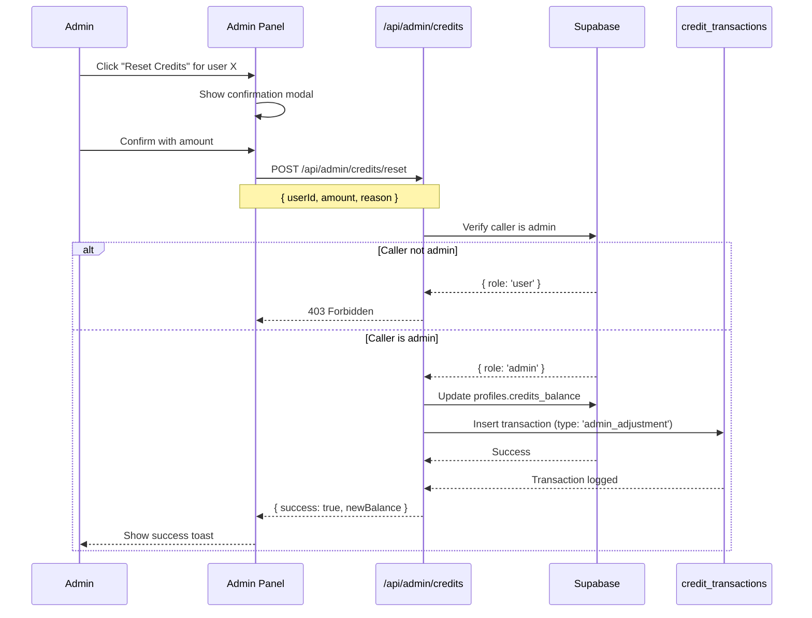

# Admin Panel System - Implementation Plan

**Date:** December 2, 2025
**Priority:** High (Critical for Operations)
**Status:** Planning Complete
**Estimated Effort:** 3-5 days

---

## 1. Context Analysis

### 1.1 Files Analyzed

| Path | Purpose |
|------|---------|
| `/app/dashboard/layout.tsx` | Dashboard layout with sidebar |
| `/client/components/dashboard/DashboardSidebar.tsx` | Sidebar navigation component |
| `/supabase/migrations/20250120_create_profiles_table.sql` | User profiles schema |
| `/supabase/migrations/20250120_create_subscriptions_table.sql` | Subscriptions schema |
| `/supabase/migrations/20250121_create_credit_transactions_table.sql` | Credit transactions |
| `/middleware.ts` | Route protection and auth |
| `/server/middleware/getAuthenticatedUser.ts` | User authentication helper |
| `/client/store/authStore.ts` | Auth state management |
| `/shared/types/stripe.ts` | User profile types |
| `/client/components/stripe/CreditHistory.tsx` | Table component pattern |

### 1.2 Component & Dependency Overview

```mermaid
graph TD
    subgraph Current System
        A[Dashboard Layout] --> B[DashboardSidebar]
        B --> C[Menu Items Array]
        A --> D[Dashboard Pages]
        D --> E[Billing Page]
        D --> F[Settings Page]
    end

    subgraph Auth Layer
        G[middleware.ts] --> H[getAuthenticatedUser]
        H --> I[(profiles table)]
    end

    subgraph New Admin System
        J[Admin Menu Item] --> K[/dashboard/admin/*]
        K --> L[Admin Layout]
        L --> M[Users Management]
        L --> N[Subscriptions Management]
        L --> O[Credits Management]
        L --> P[System Overview]
    end

    I -.->|Add role column| J
    B --> J
```

### 1.3 Current Behavior Summary

- Users authenticate via Supabase Auth (email, OAuth providers)
- Dashboard accessible to all authenticated users
- Sidebar contains: Dashboard, Billing, Settings, Help & Support
- **No admin role exists** in the current schema
- **No role-based access control** implemented
- User profile stored in `profiles` table with: `id`, `stripe_customer_id`, `credits_balance`, `subscription_status`, `subscription_tier`
- Authorization checks only verify authentication, not roles

### 1.4 Problem Statement

The system lacks administrative capabilities for managing users, subscriptions, and credits, requiring direct database access for operational tasks that should be handled through a secure admin interface.

---

## 2. Proposed Solution

### 2.1 Architecture Summary

- **Role System:** Add `role` column to `profiles` table with values: `user` (default), `admin`
- **Admin Routes:** Create `/dashboard/admin/*` routes protected by admin role check
- **Sidebar Integration:** Conditionally show "Admin" menu item based on user role
- **Admin Pages:** Users list, user detail, subscription management, credit operations, system overview
- **API Layer:** Admin-only API endpoints with role verification middleware

**Alternatives Considered:**

| Approach | Pros | Cons | Decision |
|----------|------|------|----------|
| **Role column in profiles (chosen)** | Simple, single table, fast queries | Limited to two roles | Chosen - sufficient for current needs |
| Separate roles table with permissions | Flexible, granular permissions | Over-engineered for 2 roles | Rejected |
| External auth provider roles | Centralized auth management | Adds dependency, complexity | Rejected |
| Supabase Auth metadata | No migration needed | Harder to query, sync issues | Rejected |

### 2.2 Architecture Diagram



### 2.3 Key Technical Decisions

| Decision | Rationale |
|----------|-----------|
| **Role stored in `profiles` table** | Aligns with existing user data pattern; avoids joins |
| **Admin check in middleware** | Centralized, consistent protection for all admin routes |
| **Conditional sidebar rendering** | Clean UX - non-admins don't see admin menu |
| **Reuse existing table patterns** | CreditHistory.tsx provides table component pattern |
| **Server-side role verification** | Never trust client-side role checks for security |

### 2.4 Data Model Changes

#### Migration: Add role column to profiles

```sql
-- Add role column with default 'user'
ALTER TABLE public.profiles
ADD COLUMN role TEXT NOT NULL DEFAULT 'user'
CHECK (role IN ('user', 'admin'));

-- Create index for role queries
CREATE INDEX idx_profiles_role ON public.profiles(role);

-- RLS policy for admin access
CREATE POLICY "Admins can view all profiles"
ON public.profiles FOR SELECT
TO authenticated
USING (
    auth.uid() = id
    OR EXISTS (
        SELECT 1 FROM public.profiles
        WHERE id = auth.uid() AND role = 'admin'
    )
);

CREATE POLICY "Admins can update all profiles"
ON public.profiles FOR UPDATE
TO authenticated
USING (
    auth.uid() = id
    OR EXISTS (
        SELECT 1 FROM public.profiles
        WHERE id = auth.uid() AND role = 'admin'
    )
);
```

---

## 2.5 Runtime Execution Flow

### Admin Page Load Flow



### Admin Credit Reset Flow



---

## 3. Detailed Implementation Spec

### A. Database Migration

**File:** `supabase/migrations/[timestamp]_add_admin_role.sql`

```sql
-- Add role column to profiles
ALTER TABLE public.profiles
ADD COLUMN IF NOT EXISTS role TEXT NOT NULL DEFAULT 'user'
CHECK (role IN ('user', 'admin'));

-- Index for role-based queries
CREATE INDEX IF NOT EXISTS idx_profiles_role ON public.profiles(role);

-- Drop existing restrictive policies
DROP POLICY IF EXISTS "Users can view own profile" ON public.profiles;
DROP POLICY IF EXISTS "Users can update own profile" ON public.profiles;

-- New policies allowing admin access
CREATE POLICY "Users can view own profile or admins can view all"
ON public.profiles FOR SELECT
TO authenticated
USING (
    auth.uid() = id
    OR EXISTS (
        SELECT 1 FROM public.profiles
        WHERE id = auth.uid() AND role = 'admin'
    )
);

CREATE POLICY "Users can update own profile or admins can update all"
ON public.profiles FOR UPDATE
TO authenticated
USING (
    auth.uid() = id
    OR EXISTS (
        SELECT 1 FROM public.profiles
        WHERE id = auth.uid() AND role = 'admin'
    )
);

-- Admin policy for subscriptions
CREATE POLICY "Admins can view all subscriptions"
ON public.subscriptions FOR SELECT
TO authenticated
USING (
    user_id = auth.uid()
    OR EXISTS (
        SELECT 1 FROM public.profiles
        WHERE id = auth.uid() AND role = 'admin'
    )
);

CREATE POLICY "Admins can update all subscriptions"
ON public.subscriptions FOR UPDATE
TO authenticated
USING (
    EXISTS (
        SELECT 1 FROM public.profiles
        WHERE id = auth.uid() AND role = 'admin'
    )
);

-- Admin policy for credit_transactions
CREATE POLICY "Admins can view all credit transactions"
ON public.credit_transactions FOR SELECT
TO authenticated
USING (
    user_id = auth.uid()
    OR EXISTS (
        SELECT 1 FROM public.profiles
        WHERE id = auth.uid() AND role = 'admin'
    )
);

CREATE POLICY "Admins can insert credit transactions"
ON public.credit_transactions FOR INSERT
TO authenticated
WITH CHECK (
    user_id = auth.uid()
    OR EXISTS (
        SELECT 1 FROM public.profiles
        WHERE id = auth.uid() AND role = 'admin'
    )
);

-- RPC function for admin credit adjustment
CREATE OR REPLACE FUNCTION admin_adjust_credits(
    target_user_id UUID,
    adjustment_amount INTEGER,
    adjustment_reason TEXT
)
RETURNS INTEGER
LANGUAGE plpgsql
SECURITY DEFINER
SET search_path = public
AS $$
DECLARE
    caller_role TEXT;
    new_balance INTEGER;
BEGIN
    -- Verify caller is admin
    SELECT role INTO caller_role FROM profiles WHERE id = auth.uid();
    IF caller_role != 'admin' THEN
        RAISE EXCEPTION 'Unauthorized: Admin role required';
    END IF;

    -- Update credits balance
    UPDATE profiles
    SET credits_balance = credits_balance + adjustment_amount,
        updated_at = NOW()
    WHERE id = target_user_id
    RETURNING credits_balance INTO new_balance;

    -- Log the transaction
    INSERT INTO credit_transactions (
        user_id,
        amount,
        type,
        reference_id,
        description
    ) VALUES (
        target_user_id,
        adjustment_amount,
        'bonus',
        'admin_' || auth.uid()::TEXT || '_' || NOW()::TEXT,
        adjustment_reason
    );

    RETURN new_balance;
END;
$$;
```

**Justification:** Using RLS policies with admin role check ensures security at the database level. The RPC function provides an auditable way to adjust credits with proper logging.

---

### B. Type Definitions

**File:** `shared/types/admin.ts`

```typescript
export type UserRole = 'user' | 'admin';

export interface IAdminUserProfile {
  id: string;
  email: string;
  role: UserRole;
  stripe_customer_id: string | null;
  credits_balance: number;
  subscription_status: string | null;
  subscription_tier: string | null;
  created_at: string;
  updated_at: string;
}

export interface IAdminUserListParams {
  page?: number;
  limit?: number;
  search?: string;
  role?: UserRole;
  subscription_status?: string;
}

export interface IAdminUserListResponse {
  users: IAdminUserProfile[];
  total: number;
  page: number;
  limit: number;
}

export interface ICreditAdjustmentRequest {
  userId: string;
  amount: number;
  reason: string;
}

export interface ICreditAdjustmentResponse {
  success: boolean;
  newBalance: number;
}

export interface IAdminStats {
  totalUsers: number;
  activeSubscriptions: number;
  totalCreditsIssued: number;
  totalCreditsUsed: number;
  revenueThisMonth: number;
}
```

**File:** `shared/types/stripe.ts` (Update)

```typescript
// Add role to existing IUserProfile
export interface IUserProfile {
  id: string;
  stripe_customer_id: string | null;
  credits_balance: number;
  subscription_status: SubscriptionStatus | null;
  subscription_tier: string | null;
  role: 'user' | 'admin'; // ADD THIS
  created_at: string;
  updated_at: string;
}
```

---

### C. Admin Middleware

**File:** `server/middleware/requireAdmin.ts`

```typescript
import { NextRequest, NextResponse } from 'next/server';
import { supabaseAdmin } from '@/server/supabase/supabaseAdmin';

export async function requireAdmin(req: NextRequest): Promise<{
  isAdmin: boolean;
  userId: string | null;
  error?: NextResponse;
}> {
  const userId = req.headers.get('X-User-Id');

  if (!userId) {
    return {
      isAdmin: false,
      userId: null,
      error: NextResponse.json(
        { error: 'Unauthorized', code: 'NO_USER' },
        { status: 401 }
      ),
    };
  }

  const { data: profile, error } = await supabaseAdmin
    .from('profiles')
    .select('role')
    .eq('id', userId)
    .single();

  if (error || !profile) {
    return {
      isAdmin: false,
      userId,
      error: NextResponse.json(
        { error: 'User not found', code: 'USER_NOT_FOUND' },
        { status: 404 }
      ),
    };
  }

  if (profile.role !== 'admin') {
    return {
      isAdmin: false,
      userId,
      error: NextResponse.json(
        { error: 'Forbidden: Admin access required', code: 'NOT_ADMIN' },
        { status: 403 }
      ),
    };
  }

  return { isAdmin: true, userId };
}
```

**Justification:** Centralized admin check that can be imported into any admin API route. Returns structured response for consistent error handling.

---

### D. Admin API Endpoints

**File:** `app/api/admin/users/route.ts`

```typescript
import { NextRequest, NextResponse } from 'next/server';
import { requireAdmin } from '@/server/middleware/requireAdmin';
import { supabaseAdmin } from '@/server/supabase/supabaseAdmin';

export async function GET(req: NextRequest) {
  const { isAdmin, error } = await requireAdmin(req);
  if (!isAdmin) return error;

  const { searchParams } = new URL(req.url);
  const page = parseInt(searchParams.get('page') || '1');
  const limit = parseInt(searchParams.get('limit') || '20');
  const search = searchParams.get('search') || '';
  const offset = (page - 1) * limit;

  let query = supabaseAdmin
    .from('profiles')
    .select('*, auth.users!inner(email)', { count: 'exact' });

  if (search) {
    query = query.ilike('auth.users.email', `%${search}%`);
  }

  const { data: users, count, error: dbError } = await query
    .range(offset, offset + limit - 1)
    .order('created_at', { ascending: false });

  if (dbError) {
    return NextResponse.json(
      { error: 'Failed to fetch users', details: dbError.message },
      { status: 500 }
    );
  }

  return NextResponse.json({
    success: true,
    data: {
      users,
      total: count || 0,
      page,
      limit,
    },
  });
}
```

**File:** `app/api/admin/users/[userId]/route.ts`

```typescript
import { NextRequest, NextResponse } from 'next/server';
import { requireAdmin } from '@/server/middleware/requireAdmin';
import { supabaseAdmin } from '@/server/supabase/supabaseAdmin';

export async function GET(
  req: NextRequest,
  { params }: { params: { userId: string } }
) {
  const { isAdmin, error } = await requireAdmin(req);
  if (!isAdmin) return error;

  const { userId } = params;

  // Fetch user profile with subscription and recent transactions
  const [profileResult, subscriptionResult, transactionsResult] = await Promise.all([
    supabaseAdmin.from('profiles').select('*').eq('id', userId).single(),
    supabaseAdmin.from('subscriptions').select('*').eq('user_id', userId).single(),
    supabaseAdmin
      .from('credit_transactions')
      .select('*')
      .eq('user_id', userId)
      .order('created_at', { ascending: false })
      .limit(20),
  ]);

  if (profileResult.error) {
    return NextResponse.json(
      { error: 'User not found' },
      { status: 404 }
    );
  }

  return NextResponse.json({
    success: true,
    data: {
      profile: profileResult.data,
      subscription: subscriptionResult.data,
      recentTransactions: transactionsResult.data || [],
    },
  });
}

export async function PATCH(
  req: NextRequest,
  { params }: { params: { userId: string } }
) {
  const { isAdmin, error } = await requireAdmin(req);
  if (!isAdmin) return error;

  const { userId } = params;
  const body = await req.json();
  const allowedFields = ['role', 'subscription_tier', 'subscription_status'];

  const updates: Record<string, unknown> = {};
  for (const field of allowedFields) {
    if (body[field] !== undefined) {
      updates[field] = body[field];
    }
  }

  if (Object.keys(updates).length === 0) {
    return NextResponse.json(
      { error: 'No valid fields to update' },
      { status: 400 }
    );
  }

  updates.updated_at = new Date().toISOString();

  const { data, error: dbError } = await supabaseAdmin
    .from('profiles')
    .update(updates)
    .eq('id', userId)
    .select()
    .single();

  if (dbError) {
    return NextResponse.json(
      { error: 'Failed to update user', details: dbError.message },
      { status: 500 }
    );
  }

  return NextResponse.json({ success: true, data });
}
```

**File:** `app/api/admin/credits/adjust/route.ts`

```typescript
import { NextRequest, NextResponse } from 'next/server';
import { requireAdmin } from '@/server/middleware/requireAdmin';
import { supabaseAdmin } from '@/server/supabase/supabaseAdmin';
import { z } from 'zod';

const adjustCreditsSchema = z.object({
  userId: z.string().uuid(),
  amount: z.number().int(),
  reason: z.string().min(1).max(500),
});

export async function POST(req: NextRequest) {
  const { isAdmin, userId: adminId, error } = await requireAdmin(req);
  if (!isAdmin) return error;

  const body = await req.json();
  const validation = adjustCreditsSchema.safeParse(body);

  if (!validation.success) {
    return NextResponse.json(
      { error: 'Invalid request', details: validation.error.errors },
      { status: 400 }
    );
  }

  const { userId, amount, reason } = validation.data;

  // Use RPC function for atomic operation with logging
  const { data, error: rpcError } = await supabaseAdmin.rpc('admin_adjust_credits', {
    target_user_id: userId,
    adjustment_amount: amount,
    adjustment_reason: `[Admin: ${adminId}] ${reason}`,
  });

  if (rpcError) {
    return NextResponse.json(
      { error: 'Failed to adjust credits', details: rpcError.message },
      { status: 500 }
    );
  }

  return NextResponse.json({
    success: true,
    data: { newBalance: data },
  });
}
```

**File:** `app/api/admin/stats/route.ts`

```typescript
import { NextRequest, NextResponse } from 'next/server';
import { requireAdmin } from '@/server/middleware/requireAdmin';
import { supabaseAdmin } from '@/server/supabase/supabaseAdmin';

export async function GET(req: NextRequest) {
  const { isAdmin, error } = await requireAdmin(req);
  if (!isAdmin) return error;

  const [usersResult, subscriptionsResult, creditsResult] = await Promise.all([
    supabaseAdmin.from('profiles').select('id', { count: 'exact', head: true }),
    supabaseAdmin
      .from('subscriptions')
      .select('id', { count: 'exact', head: true })
      .eq('status', 'active'),
    supabaseAdmin
      .from('credit_transactions')
      .select('amount, type')
  ]);

  const totalCreditsIssued = (creditsResult.data || [])
    .filter(t => t.amount > 0)
    .reduce((sum, t) => sum + t.amount, 0);

  const totalCreditsUsed = Math.abs(
    (creditsResult.data || [])
      .filter(t => t.type === 'usage')
      .reduce((sum, t) => sum + t.amount, 0)
  );

  return NextResponse.json({
    success: true,
    data: {
      totalUsers: usersResult.count || 0,
      activeSubscriptions: subscriptionsResult.count || 0,
      totalCreditsIssued,
      totalCreditsUsed,
    },
  });
}
```

---

### E. Auth Store Update

**File:** `client/store/authStore.ts` (Update)

```typescript
// Add role to user interface
interface User {
  email: string;
  name?: string;
  provider?: string;
  role: 'user' | 'admin'; // ADD THIS
}

// Update initializeAuth to fetch role
const initializeAuth = async () => {
  // ... existing code ...

  // When setting user, include role from profile
  const { data: profile } = await supabase
    .from('profiles')
    .select('role')
    .eq('id', session.user.id)
    .single();

  set({
    user: {
      email: session.user.email,
      name: session.user.user_metadata?.full_name,
      provider: session.user.app_metadata?.provider,
      role: profile?.role || 'user', // ADD THIS
    },
    isAuthenticated: true,
    isLoading: false,
  });
};

// Add isAdmin selector
export const useIsAdmin = () => useAuthStore((state) => state.user?.role === 'admin');
```

---

### F. Dashboard Sidebar Update

**File:** `client/components/dashboard/DashboardSidebar.tsx` (Update)

```typescript
import { useIsAdmin } from '@/client/store/authStore';
import { Shield } from 'lucide-react';

// Inside component:
const isAdmin = useIsAdmin();

const menuItems: ISidebarItem[] = [
  { label: 'Dashboard', href: '/dashboard', icon: LayoutDashboard },
  { label: 'Billing', href: '/dashboard/billing', icon: CreditCard },
  { label: 'Settings', href: '/dashboard/settings', icon: Settings },
];

// Conditionally add admin menu
if (isAdmin) {
  menuItems.push({ label: 'Admin', href: '/dashboard/admin', icon: Shield });
}
```

---

### G. Admin Pages

**File:** `app/dashboard/admin/layout.tsx`

```typescript
import { redirect } from 'next/navigation';
import { createServerClient } from '@/server/supabase/createServerClient';

export default async function AdminLayout({
  children,
}: {
  children: React.ReactNode;
}) {
  const supabase = createServerClient();
  const { data: { user } } = await supabase.auth.getUser();

  if (!user) {
    redirect('/auth/login');
  }

  const { data: profile } = await supabase
    .from('profiles')
    .select('role')
    .eq('id', user.id)
    .single();

  if (profile?.role !== 'admin') {
    redirect('/dashboard');
  }

  return (
    <div className="space-y-6">
      <div className="border-b border-slate-200 pb-4">
        <h1 className="text-2xl font-semibold text-slate-900">Admin Panel</h1>
        <p className="text-sm text-slate-500">Manage users, subscriptions, and credits</p>
      </div>
      {children}
    </div>
  );
}
```

**File:** `app/dashboard/admin/page.tsx`

```typescript
'use client';

import { useEffect, useState } from 'react';
import { Users, CreditCard, Coins, TrendingUp } from 'lucide-react';
import { StatsCard } from '@/client/components/common/StatsCard';

interface IAdminStats {
  totalUsers: number;
  activeSubscriptions: number;
  totalCreditsIssued: number;
  totalCreditsUsed: number;
}

export default function AdminDashboard() {
  const [stats, setStats] = useState<IAdminStats | null>(null);
  const [loading, setLoading] = useState(true);

  useEffect(() => {
    const fetchStats = async () => {
      try {
        const response = await fetch('/api/admin/stats');
        const data = await response.json();
        if (data.success) {
          setStats(data.data);
        }
      } catch (error) {
        console.error('Failed to fetch admin stats:', error);
      } finally {
        setLoading(false);
      }
    };

    fetchStats();
  }, []);

  if (loading) {
    return <div className="animate-pulse">Loading stats...</div>;
  }

  return (
    <div className="space-y-6">
      <div className="grid grid-cols-1 md:grid-cols-2 lg:grid-cols-4 gap-4">
        <StatsCard
          title="Total Users"
          value={stats?.totalUsers || 0}
          icon={Users}
        />
        <StatsCard
          title="Active Subscriptions"
          value={stats?.activeSubscriptions || 0}
          icon={CreditCard}
        />
        <StatsCard
          title="Credits Issued"
          value={stats?.totalCreditsIssued || 0}
          icon={Coins}
        />
        <StatsCard
          title="Credits Used"
          value={stats?.totalCreditsUsed || 0}
          icon={TrendingUp}
        />
      </div>

      <div className="grid grid-cols-1 lg:grid-cols-2 gap-6">
        <QuickActions />
        <RecentActivity />
      </div>
    </div>
  );
}

function QuickActions() {
  return (
    <div className="bg-white rounded-lg border border-slate-200 p-6">
      <h2 className="text-lg font-medium text-slate-900 mb-4">Quick Actions</h2>
      <div className="space-y-2">
        <a
          href="/dashboard/admin/users"
          className="block p-3 rounded-lg hover:bg-slate-50 transition-colors"
        >
          <div className="font-medium text-slate-900">Manage Users</div>
          <div className="text-sm text-slate-500">View and edit user accounts</div>
        </a>
        <a
          href="/dashboard/admin/subscriptions"
          className="block p-3 rounded-lg hover:bg-slate-50 transition-colors"
        >
          <div className="font-medium text-slate-900">Manage Subscriptions</div>
          <div className="text-sm text-slate-500">View and modify subscriptions</div>
        </a>
        <a
          href="/dashboard/admin/credits"
          className="block p-3 rounded-lg hover:bg-slate-50 transition-colors"
        >
          <div className="font-medium text-slate-900">Credit Operations</div>
          <div className="text-sm text-slate-500">Adjust user credits</div>
        </a>
      </div>
    </div>
  );
}

function RecentActivity() {
  return (
    <div className="bg-white rounded-lg border border-slate-200 p-6">
      <h2 className="text-lg font-medium text-slate-900 mb-4">Recent Activity</h2>
      <p className="text-sm text-slate-500">
        Activity feed will be implemented in a future iteration.
      </p>
    </div>
  );
}
```

**File:** `app/dashboard/admin/users/page.tsx`

```typescript
'use client';

import { useEffect, useState } from 'react';
import { Search, ChevronLeft, ChevronRight } from 'lucide-react';
import dayjs from 'dayjs';
import Link from 'next/link';

interface IUser {
  id: string;
  email: string;
  role: string;
  credits_balance: number;
  subscription_status: string | null;
  subscription_tier: string | null;
  created_at: string;
}

export default function AdminUsersPage() {
  const [users, setUsers] = useState<IUser[]>([]);
  const [loading, setLoading] = useState(true);
  const [search, setSearch] = useState('');
  const [page, setPage] = useState(1);
  const [total, setTotal] = useState(0);
  const limit = 20;

  useEffect(() => {
    const fetchUsers = async () => {
      setLoading(true);
      try {
        const params = new URLSearchParams({
          page: page.toString(),
          limit: limit.toString(),
          ...(search && { search }),
        });
        const response = await fetch(`/api/admin/users?${params}`);
        const data = await response.json();
        if (data.success) {
          setUsers(data.data.users);
          setTotal(data.data.total);
        }
      } catch (error) {
        console.error('Failed to fetch users:', error);
      } finally {
        setLoading(false);
      }
    };

    fetchUsers();
  }, [page, search]);

  const totalPages = Math.ceil(total / limit);

  return (
    <div className="space-y-4">
      <div className="flex items-center justify-between">
        <h2 className="text-lg font-medium text-slate-900">Users</h2>
        <div className="relative">
          <Search className="absolute left-3 top-1/2 -translate-y-1/2 h-4 w-4 text-slate-400" />
          <input
            type="text"
            placeholder="Search by email..."
            value={search}
            onChange={(e) => {
              setSearch(e.target.value);
              setPage(1);
            }}
            className="pl-10 pr-4 py-2 border border-slate-300 rounded-lg text-sm focus:outline-none focus:ring-2 focus:ring-indigo-500"
          />
        </div>
      </div>

      <div className="bg-white rounded-lg border border-slate-200 overflow-hidden">
        <table className="min-w-full divide-y divide-slate-200">
          <thead className="bg-slate-50">
            <tr>
              <th className="px-6 py-3 text-left text-xs font-medium text-slate-500 uppercase">
                Email
              </th>
              <th className="px-6 py-3 text-left text-xs font-medium text-slate-500 uppercase">
                Role
              </th>
              <th className="px-6 py-3 text-left text-xs font-medium text-slate-500 uppercase">
                Credits
              </th>
              <th className="px-6 py-3 text-left text-xs font-medium text-slate-500 uppercase">
                Subscription
              </th>
              <th className="px-6 py-3 text-left text-xs font-medium text-slate-500 uppercase">
                Joined
              </th>
              <th className="px-6 py-3 text-right text-xs font-medium text-slate-500 uppercase">
                Actions
              </th>
            </tr>
          </thead>
          <tbody className="divide-y divide-slate-200">
            {loading ? (
              <tr>
                <td colSpan={6} className="px-6 py-4 text-center text-slate-500">
                  Loading...
                </td>
              </tr>
            ) : users.length === 0 ? (
              <tr>
                <td colSpan={6} className="px-6 py-4 text-center text-slate-500">
                  No users found
                </td>
              </tr>
            ) : (
              users.map((user) => (
                <tr key={user.id} className="hover:bg-slate-50">
                  <td className="px-6 py-4 text-sm text-slate-900">{user.email}</td>
                  <td className="px-6 py-4">
                    <span
                      className={`inline-flex px-2 py-1 text-xs font-medium rounded-full ${
                        user.role === 'admin'
                          ? 'bg-purple-100 text-purple-800'
                          : 'bg-slate-100 text-slate-800'
                      }`}
                    >
                      {user.role}
                    </span>
                  </td>
                  <td className="px-6 py-4 text-sm text-slate-900">
                    {user.credits_balance}
                  </td>
                  <td className="px-6 py-4">
                    {user.subscription_tier ? (
                      <span className="inline-flex px-2 py-1 text-xs font-medium rounded-full bg-green-100 text-green-800">
                        {user.subscription_tier}
                      </span>
                    ) : (
                      <span className="text-sm text-slate-500">Free</span>
                    )}
                  </td>
                  <td className="px-6 py-4 text-sm text-slate-500">
                    {dayjs(user.created_at).format('MMM D, YYYY')}
                  </td>
                  <td className="px-6 py-4 text-right">
                    <Link
                      href={`/dashboard/admin/users/${user.id}`}
                      className="text-indigo-600 hover:text-indigo-900 text-sm font-medium"
                    >
                      View
                    </Link>
                  </td>
                </tr>
              ))
            )}
          </tbody>
        </table>

        {totalPages > 1 && (
          <div className="px-6 py-3 border-t border-slate-200 flex items-center justify-between">
            <div className="text-sm text-slate-500">
              Showing {(page - 1) * limit + 1} to {Math.min(page * limit, total)} of {total}
            </div>
            <div className="flex items-center space-x-2">
              <button
                onClick={() => setPage((p) => Math.max(1, p - 1))}
                disabled={page === 1}
                className="p-1 rounded hover:bg-slate-100 disabled:opacity-50"
              >
                <ChevronLeft className="h-5 w-5" />
              </button>
              <span className="text-sm text-slate-600">
                Page {page} of {totalPages}
              </span>
              <button
                onClick={() => setPage((p) => Math.min(totalPages, p + 1))}
                disabled={page === totalPages}
                className="p-1 rounded hover:bg-slate-100 disabled:opacity-50"
              >
                <ChevronRight className="h-5 w-5" />
              </button>
            </div>
          </div>
        )}
      </div>
    </div>
  );
}
```

**File:** `app/dashboard/admin/users/[userId]/page.tsx`

```typescript
'use client';

import { useEffect, useState } from 'react';
import { useParams, useRouter } from 'next/navigation';
import { ArrowLeft, Save, Coins } from 'lucide-react';
import dayjs from 'dayjs';
import Link from 'next/link';

interface IUserDetail {
  profile: {
    id: string;
    role: string;
    credits_balance: number;
    subscription_status: string | null;
    subscription_tier: string | null;
    stripe_customer_id: string | null;
    created_at: string;
    updated_at: string;
  };
  subscription: {
    id: string;
    status: string;
    price_id: string;
    current_period_end: string;
  } | null;
  recentTransactions: Array<{
    id: string;
    amount: number;
    type: string;
    description: string;
    created_at: string;
  }>;
}

export default function AdminUserDetailPage() {
  const params = useParams();
  const router = useRouter();
  const userId = params.userId as string;

  const [user, setUser] = useState<IUserDetail | null>(null);
  const [loading, setLoading] = useState(true);
  const [saving, setSaving] = useState(false);
  const [showCreditModal, setShowCreditModal] = useState(false);

  useEffect(() => {
    const fetchUser = async () => {
      try {
        const response = await fetch(`/api/admin/users/${userId}`);
        const data = await response.json();
        if (data.success) {
          setUser(data.data);
        }
      } catch (error) {
        console.error('Failed to fetch user:', error);
      } finally {
        setLoading(false);
      }
    };

    fetchUser();
  }, [userId]);

  const handleRoleChange = async (newRole: string) => {
    setSaving(true);
    try {
      const response = await fetch(`/api/admin/users/${userId}`, {
        method: 'PATCH',
        headers: { 'Content-Type': 'application/json' },
        body: JSON.stringify({ role: newRole }),
      });
      const data = await response.json();
      if (data.success) {
        setUser((prev) => prev ? {
          ...prev,
          profile: { ...prev.profile, role: newRole },
        } : null);
      }
    } catch (error) {
      console.error('Failed to update role:', error);
    } finally {
      setSaving(false);
    }
  };

  if (loading) {
    return <div className="animate-pulse">Loading user details...</div>;
  }

  if (!user) {
    return <div>User not found</div>;
  }

  return (
    <div className="space-y-6">
      <div className="flex items-center space-x-4">
        <Link
          href="/dashboard/admin/users"
          className="p-2 rounded-lg hover:bg-slate-100"
        >
          <ArrowLeft className="h-5 w-5" />
        </Link>
        <h2 className="text-lg font-medium text-slate-900">User Details</h2>
      </div>

      <div className="grid grid-cols-1 lg:grid-cols-2 gap-6">
        {/* Profile Card */}
        <div className="bg-white rounded-lg border border-slate-200 p-6">
          <h3 className="font-medium text-slate-900 mb-4">Profile</h3>
          <dl className="space-y-3">
            <div>
              <dt className="text-sm text-slate-500">User ID</dt>
              <dd className="text-sm font-mono text-slate-900">{user.profile.id}</dd>
            </div>
            <div>
              <dt className="text-sm text-slate-500">Stripe Customer ID</dt>
              <dd className="text-sm font-mono text-slate-900">
                {user.profile.stripe_customer_id || 'Not connected'}
              </dd>
            </div>
            <div>
              <dt className="text-sm text-slate-500">Role</dt>
              <dd>
                <select
                  value={user.profile.role}
                  onChange={(e) => handleRoleChange(e.target.value)}
                  disabled={saving}
                  className="mt-1 block w-full rounded-lg border-slate-300 text-sm"
                >
                  <option value="user">User</option>
                  <option value="admin">Admin</option>
                </select>
              </dd>
            </div>
            <div>
              <dt className="text-sm text-slate-500">Joined</dt>
              <dd className="text-sm text-slate-900">
                {dayjs(user.profile.created_at).format('MMMM D, YYYY')}
              </dd>
            </div>
          </dl>
        </div>

        {/* Credits Card */}
        <div className="bg-white rounded-lg border border-slate-200 p-6">
          <div className="flex items-center justify-between mb-4">
            <h3 className="font-medium text-slate-900">Credits</h3>
            <button
              onClick={() => setShowCreditModal(true)}
              className="inline-flex items-center px-3 py-1.5 text-sm font-medium text-white bg-indigo-600 rounded-lg hover:bg-indigo-700"
            >
              <Coins className="h-4 w-4 mr-1.5" />
              Adjust Credits
            </button>
          </div>
          <div className="text-3xl font-bold text-slate-900 mb-4">
            {user.profile.credits_balance}
          </div>
          <div>
            <h4 className="text-sm font-medium text-slate-700 mb-2">Recent Transactions</h4>
            <div className="space-y-2 max-h-48 overflow-y-auto">
              {user.recentTransactions.length === 0 ? (
                <p className="text-sm text-slate-500">No transactions</p>
              ) : (
                user.recentTransactions.map((tx) => (
                  <div
                    key={tx.id}
                    className="flex items-center justify-between text-sm"
                  >
                    <div>
                      <span className="text-slate-900">{tx.type}</span>
                      <span className="text-slate-500 ml-2">
                        {dayjs(tx.created_at).format('MMM D')}
                      </span>
                    </div>
                    <span
                      className={
                        tx.amount > 0 ? 'text-green-600' : 'text-red-600'
                      }
                    >
                      {tx.amount > 0 ? '+' : ''}
                      {tx.amount}
                    </span>
                  </div>
                ))
              )}
            </div>
          </div>
        </div>

        {/* Subscription Card */}
        <div className="bg-white rounded-lg border border-slate-200 p-6 lg:col-span-2">
          <h3 className="font-medium text-slate-900 mb-4">Subscription</h3>
          {user.subscription ? (
            <dl className="grid grid-cols-2 md:grid-cols-4 gap-4">
              <div>
                <dt className="text-sm text-slate-500">Status</dt>
                <dd>
                  <span
                    className={`inline-flex px-2 py-1 text-xs font-medium rounded-full ${
                      user.subscription.status === 'active'
                        ? 'bg-green-100 text-green-800'
                        : 'bg-yellow-100 text-yellow-800'
                    }`}
                  >
                    {user.subscription.status}
                  </span>
                </dd>
              </div>
              <div>
                <dt className="text-sm text-slate-500">Tier</dt>
                <dd className="text-sm font-medium text-slate-900">
                  {user.profile.subscription_tier || 'Unknown'}
                </dd>
              </div>
              <div>
                <dt className="text-sm text-slate-500">Period End</dt>
                <dd className="text-sm text-slate-900">
                  {dayjs(user.subscription.current_period_end).format('MMM D, YYYY')}
                </dd>
              </div>
              <div>
                <dt className="text-sm text-slate-500">Subscription ID</dt>
                <dd className="text-sm font-mono text-slate-900">
                  {user.subscription.id}
                </dd>
              </div>
            </dl>
          ) : (
            <p className="text-sm text-slate-500">No active subscription</p>
          )}
        </div>
      </div>

      {showCreditModal && (
        <CreditAdjustmentModal
          userId={userId}
          currentBalance={user.profile.credits_balance}
          onClose={() => setShowCreditModal(false)}
          onSuccess={(newBalance) => {
            setUser((prev) => prev ? {
              ...prev,
              profile: { ...prev.profile, credits_balance: newBalance },
            } : null);
            setShowCreditModal(false);
          }}
        />
      )}
    </div>
  );
}

function CreditAdjustmentModal({
  userId,
  currentBalance,
  onClose,
  onSuccess,
}: {
  userId: string;
  currentBalance: number;
  onClose: () => void;
  onSuccess: (newBalance: number) => void;
}) {
  const [amount, setAmount] = useState('');
  const [reason, setReason] = useState('');
  const [submitting, setSubmitting] = useState(false);
  const [error, setError] = useState('');

  const handleSubmit = async (e: React.FormEvent) => {
    e.preventDefault();
    setSubmitting(true);
    setError('');

    try {
      const response = await fetch('/api/admin/credits/adjust', {
        method: 'POST',
        headers: { 'Content-Type': 'application/json' },
        body: JSON.stringify({
          userId,
          amount: parseInt(amount),
          reason,
        }),
      });

      const data = await response.json();
      if (data.success) {
        onSuccess(data.data.newBalance);
      } else {
        setError(data.error || 'Failed to adjust credits');
      }
    } catch (err) {
      setError('An error occurred');
    } finally {
      setSubmitting(false);
    }
  };

  const previewBalance = amount ? currentBalance + parseInt(amount) : currentBalance;

  return (
    <div className="fixed inset-0 bg-black/50 flex items-center justify-center z-50">
      <div className="bg-white rounded-lg p-6 w-full max-w-md">
        <h3 className="text-lg font-medium text-slate-900 mb-4">Adjust Credits</h3>
        <form onSubmit={handleSubmit} className="space-y-4">
          <div>
            <label className="block text-sm font-medium text-slate-700">
              Amount (positive to add, negative to remove)
            </label>
            <input
              type="number"
              value={amount}
              onChange={(e) => setAmount(e.target.value)}
              className="mt-1 block w-full rounded-lg border-slate-300"
              placeholder="e.g., 50 or -20"
              required
            />
            <p className="mt-1 text-sm text-slate-500">
              Current: {currentBalance} → New: {previewBalance}
            </p>
          </div>
          <div>
            <label className="block text-sm font-medium text-slate-700">
              Reason
            </label>
            <input
              type="text"
              value={reason}
              onChange={(e) => setReason(e.target.value)}
              className="mt-1 block w-full rounded-lg border-slate-300"
              placeholder="e.g., Customer support compensation"
              required
            />
          </div>
          {error && (
            <p className="text-sm text-red-600">{error}</p>
          )}
          <div className="flex justify-end space-x-3">
            <button
              type="button"
              onClick={onClose}
              className="px-4 py-2 text-sm font-medium text-slate-700 hover:bg-slate-100 rounded-lg"
            >
              Cancel
            </button>
            <button
              type="submit"
              disabled={submitting}
              className="px-4 py-2 text-sm font-medium text-white bg-indigo-600 rounded-lg hover:bg-indigo-700 disabled:opacity-50"
            >
              {submitting ? 'Saving...' : 'Adjust Credits'}
            </button>
          </div>
        </form>
      </div>
    </div>
  );
}
```

---

## 4. Step-by-Step Execution Plan

### Phase 1: Database & Types (Backend Foundation)

- [ ] Create migration `[timestamp]_add_admin_role.sql` with role column, RLS policies, and RPC function
- [ ] Apply migration to development database
- [ ] Update `shared/types/stripe.ts` to add `role` field to `IUserProfile`
- [ ] Create `shared/types/admin.ts` with admin-specific types
- [ ] Manually set initial admin user(s) via SQL: `UPDATE profiles SET role = 'admin' WHERE id = 'your-user-id'`

### Phase 2: API Layer

- [ ] Create `server/middleware/requireAdmin.ts` middleware
- [ ] Create `app/api/admin/stats/route.ts` - overview statistics
- [ ] Create `app/api/admin/users/route.ts` - list users with pagination
- [ ] Create `app/api/admin/users/[userId]/route.ts` - user detail and update
- [ ] Create `app/api/admin/credits/adjust/route.ts` - credit adjustment

### Phase 3: Auth Store & Sidebar

- [ ] Update `client/store/authStore.ts` to include role and add `useIsAdmin` hook
- [ ] Update `client/components/dashboard/DashboardSidebar.tsx` to conditionally show Admin menu

### Phase 4: Admin UI Pages

- [ ] Create `app/dashboard/admin/layout.tsx` with server-side admin check
- [ ] Create `app/dashboard/admin/page.tsx` - admin dashboard overview
- [ ] Create `app/dashboard/admin/users/page.tsx` - users list with search/pagination
- [ ] Create `app/dashboard/admin/users/[userId]/page.tsx` - user detail with credit adjustment modal

### Phase 5: Testing & Verification

- [ ] Test admin role assignment via SQL
- [ ] Test non-admin cannot access admin routes (API returns 403)
- [ ] Test non-admin doesn't see Admin menu in sidebar
- [ ] Test admin can view users list
- [ ] Test admin can adjust user credits
- [ ] Test credit adjustment logs transaction correctly

---

## 5. Testing Strategy

### Unit Tests

| Function | Test Cases |
|----------|------------|
| `requireAdmin` | Returns error for unauthenticated, returns error for non-admin, allows admin |
| `admin_adjust_credits` RPC | Rejects non-admin caller, updates balance correctly, logs transaction |

### Integration Tests

| Flow | Expected Behavior |
|------|-------------------|
| Admin accesses `/dashboard/admin` | Page loads with stats |
| Non-admin accesses `/dashboard/admin` | Redirects to `/dashboard` |
| Admin adjusts credits | Balance updates, transaction logged |
| Admin searches users | Filtered results returned |

### Edge Cases

| Scenario | Expected Behavior |
|----------|-------------------|
| Admin demotes themselves | Should work (consider warning) |
| Negative credit adjustment below zero | Allow (can result in negative balance for debt tracking) |
| Search with special characters | Escaped properly, no SQL injection |
| Very large user list | Pagination works correctly |

---

## 6. Acceptance Criteria

- [ ] `role` column exists in `profiles` table with values `user`/`admin`
- [ ] Admin menu item only visible to users with `role = 'admin'`
- [ ] Non-admin users redirected when accessing `/dashboard/admin/*`
- [ ] API endpoints return 403 for non-admin callers
- [ ] Admin can view paginated list of all users
- [ ] Admin can search users by email
- [ ] Admin can view individual user details (profile, subscription, transactions)
- [ ] Admin can adjust user credits with reason (logged in `credit_transactions`)
- [ ] Admin can change user role
- [ ] Stats page shows total users, active subscriptions, credits issued/used
- [ ] All operations logged for audit trail

---

## 7. Verification & Rollback

### Success Criteria

- All admin API endpoints respond < 200ms
- RLS policies correctly restrict data access
- Audit trail visible in `credit_transactions` table
- No console errors in admin pages

### Rollback Plan

1. **Migration rollback:** Run reverse migration to drop `role` column and RLS policies
2. **Code rollback:** Revert PR containing admin routes and components
3. **Data consideration:** Credit adjustments made via admin panel will remain in `credit_transactions` as historical record

---

## 8. Future Enhancements (Out of Scope)

| Feature | Description | Priority |
|---------|-------------|----------|
| Activity audit log | Dedicated table for all admin actions | Medium |
| Bulk operations | Select multiple users for batch actions | Low |
| Export functionality | Export user list to CSV | Low |
| Email impersonation | Log in as user for support | Low |
| Subscription modification | Change user plan directly without Stripe portal | Medium |
| Dashboard analytics | Charts for user growth, revenue, etc. | Medium |
