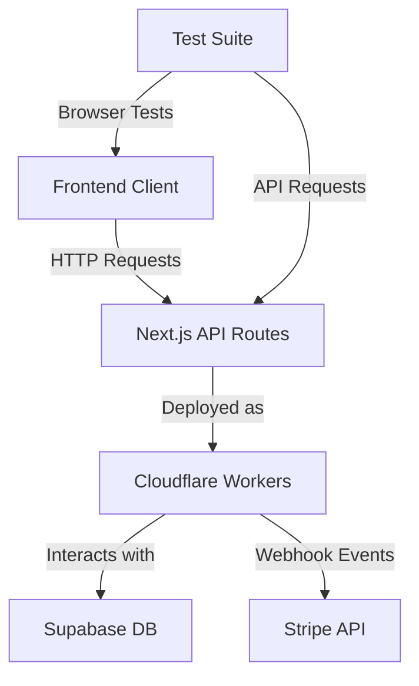
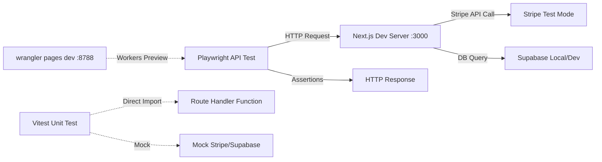
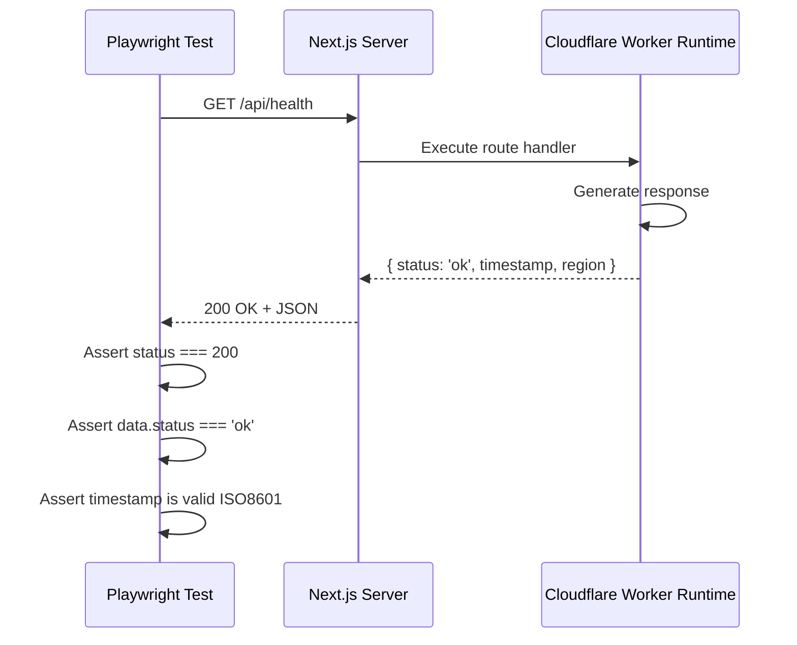
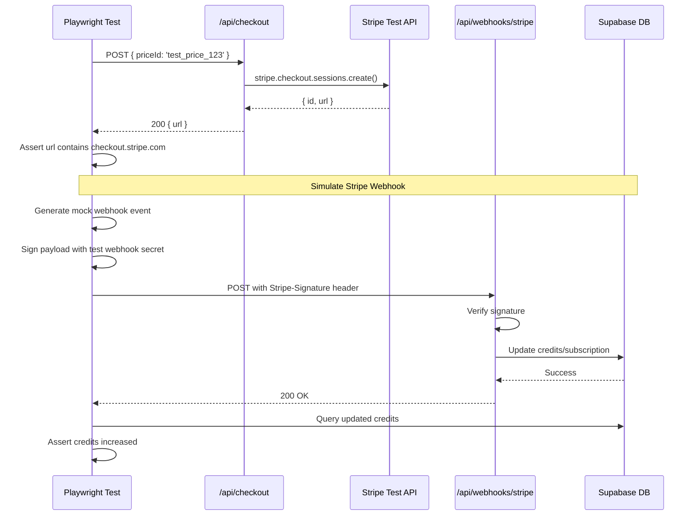

🧠 Principal Architect Mode: Engaged. Analyzing codebase constraints...

# PRD: API Testing Strategy for Cloudflare Workers Backend

## 1. Context Analysis

### 1.1 Files Analyzed

- `/home/joao/projects/myimageupscaler.com/playwright.config.ts`
- `/home/joao/projects/myimageupscaler.com/package.json`
- `/home/joao/projects/myimageupscaler.com/app/api/health/route.ts`
- `/home/joao/projects/myimageupscaler.com/app/api/checkout/route.ts`
- `/home/joao/projects/myimageupscaler.com/app/api/webhooks/stripe/route.ts`
- `/home/joao/projects/myimageupscaler.com/tests/e2e/auth.spec.ts`
- `/home/joao/projects/myimageupscaler.com/docs/PRDs/cloudflare-migration-prd.md`
- `/home/joao/projects/myimageupscaler.com/docs/PRDs/stripe-implementation-prd.md`

### 1.2 Component & Dependency Overview



### 1.3 Current Behavior Summary

- **Deployment Target**: Next.js application deploying to Cloudflare Pages/Workers via `@cloudflare/next-on-pages`.
- **Existing Testing**: Playwright is already installed and configured for E2E browser tests.
- **API Routes**: Currently has `/api/health`, `/api/checkout`, and `/api/webhooks/stripe` endpoints.
- **No API Tests**: Only browser-based E2E tests exist (`tests/e2e/auth.spec.ts`).
- **No Vitest**: Not currently installed or configured.

### 1.4 Problem Statement

The project needs a robust API testing strategy for Cloudflare Workers-based backend endpoints that ensures correctness, reliability, and integration with external services (Stripe, Supabase) without duplicating tooling.

---

## 2. Proposed Solution

### 2.1 Architecture Summary

**Recommended Approach: Playwright API Testing (Primary) + Vitest (Supplementary)**

- **Playwright API Tests**: Use the existing Playwright installation with `APIRequestContext` for true integration tests against running servers (local dev and preview).
- **Vitest (Optional Future Addition)**: Consider adding later for fast unit tests of route handlers in isolation with mocking.
- **Avoid Early Over-Engineering**: Start with Playwright API tests since tooling already exists; defer Vitest until unit-level mocking becomes a clear bottleneck.

**Why Playwright First?**

1. ✅ **Already Installed**: Zero additional dependencies needed.
2. ✅ **True Integration Testing**: Tests actual HTTP requests against the real Next.js server running on Cloudflare Workers runtime (via `wrangler pages dev`).
3. ✅ **Unified Test Suite**: Can combine API and browser tests in the same framework, share auth state, and test full user flows (e.g., create checkout session via API, verify Stripe redirect in browser).
4. ✅ **Runtime Compatibility**: Tests the actual edge runtime behavior, not just Node.js-based unit tests.
5. ✅ **Webhook Testing**: Can simulate Stripe webhook calls with proper signature verification.

**When to Add Vitest?**

- When you need blazing-fast feedback loops for business logic testing.
- When testing complex validation/transformation logic in isolation.
- When mocking external services becomes necessary for deterministic tests.

### 2.2 Architecture Diagram



### 2.3 Key Technical Decisions

| Decision                          | Rationale                                                                                      |
| --------------------------------- | ---------------------------------------------------------------------------------------------- |
| **Playwright API Testing**        | Leverages existing tooling, tests real HTTP layer, validates edge runtime compatibility        |
| **Test Against Local Dev Server** | Fast feedback, no deployment needed, validates local dev parity with production                |
| **Test Against Wrangler Preview** | Validates actual Cloudflare Workers behavior before deployment                                 |
| **Defer Vitest**                  | Avoid premature complexity; add only when clear value emerges (fast unit tests, mocking needs) |
| **Shared Test Fixtures**          | Create reusable auth helpers, test data factories, and Stripe test helpers                     |

### 2.4 Data Model Changes

**No Data Changes.**

---

## 2.5 Runtime Execution Flow

**Scenario: API Test for Health Check Endpoint**



**Scenario: API Test for Stripe Checkout with Webhook Verification**



---

## 3. Detailed Implementation Spec

### A. `playwright.config.ts`

**Changes Needed:**

- Update `baseURL` to `http://localhost:3000` (Next.js default, not Vite's 5173).
- Add a second project configuration for API tests.
- Configure `webServer` to match the Cloudflare migration PRD setup.

**Updated Config:**

```typescript
export default defineConfig({
  testDir: './tests',
  fullyParallel: true,
  forbidOnly: !!process.env.CI,
  retries: process.env.CI ? 2 : 0,
  workers: process.env.CI ? 1 : undefined,
  reporter: [['html'], ['list']],

  use: {
    baseURL: 'http://localhost:3000',
    trace: 'on',
    actionTimeout: 15000,
    navigationTimeout: 30000,
  },

  projects: [
    // Browser Tests
    {
      name: 'chromium',
      use: {
        ...devices['Desktop Chrome'],
      },
      testMatch: /.*\.e2e\.spec\.ts/,
    },

    // API Tests (no browser needed)
    {
      name: 'api',
      use: {
        baseURL: 'http://localhost:3000',
      },
      testMatch: /.*\.api\.spec\.ts/,
    },

    // Workers Preview Tests (validate Cloudflare behavior)
    {
      name: 'workers-preview',
      use: {
        baseURL: 'http://localhost:8788',
      },
      testMatch: /.*\.preview\.spec\.ts/,
    },
  ],

  webServer: {
    command: 'yarn dev',
    url: 'http://localhost:3000',
    reuseExistingServer: !process.env.CI,
    timeout: 120000,
    stdout: 'pipe',
    stderr: 'pipe',
  },
});
```

**Justification:** Separate projects allow running API tests independently (`npx playwright test --project=api`) and target different runtime environments.

---

### B. `tests/api/health.api.spec.ts` (New File)

**Purpose:** Basic health check endpoint validation.

**Pseudo-code:**

```typescript
import { test, expect } from '@playwright/test';

test.describe('API: Health Check', () => {
  test('should return 200 OK with status', async ({ request }) => {
    const response = await request.get('/api/health');

    expect(response.status()).toBe(200);
    expect(response.ok()).toBeTruthy();

    const data = await response.json();
    expect(data).toHaveProperty('status', 'ok');
    expect(data).toHaveProperty('timestamp');
    expect(data).toHaveProperty('region');

    // Validate ISO 8601 timestamp
    expect(new Date(data.timestamp).toISOString()).toBe(data.timestamp);
  });

  test('should return correct region header', async ({ request }) => {
    const response = await request.get('/api/health');
    const data = await response.json();

    // Local dev should return 'Local'
    expect(data.region).toBe('Local');
  });
});
```

---

### C. `tests/api/checkout.api.spec.ts` (New File)

**Purpose:** Test Stripe checkout session creation.

**Pseudo-code:**

```typescript
import { test, expect } from '@playwright/test';

test.describe('API: Stripe Checkout', () => {
  // Setup: Create authenticated request context
  test.use({
    extraHTTPHeaders: {
      // TODO: Add Supabase auth token from test user
    },
  });

  test('should create checkout session', async ({ request }) => {
    const response = await request.post('/api/checkout', {
      data: {
        priceId: process.env.STRIPE_TEST_PRICE_ID || 'price_test_123',
      },
    });

    expect(response.status()).toBe(200);

    const data = await response.json();
    expect(data).toHaveProperty('url');
    expect(data.url).toContain('checkout.stripe.com');
  });

  test('should reject unauthenticated requests', async ({ request }) => {
    const response = await request.post('/api/checkout', {
      data: { priceId: 'price_test_123' },
      headers: {
        // No auth header
      },
    });

    expect(response.status()).toBe(401);
  });

  test('should validate required fields', async ({ request }) => {
    const response = await request.post('/api/checkout', {
      data: {},
    });

    expect(response.status()).toBe(400);
    const data = await response.json();
    expect(data.error).toBeDefined();
  });
});
```

---

### D. `tests/api/webhooks.api.spec.ts` (New File)

**Purpose:** Test Stripe webhook signature verification and event processing.

**Pseudo-code:**

```typescript
import { test, expect } from '@playwright/test';
import Stripe from 'stripe';

test.describe('API: Stripe Webhooks', () => {
  const webhookSecret = process.env.STRIPE_WEBHOOK_SECRET!;

  test('should process valid webhook event', async ({ request }) => {
    // Create mock event
    const event = {
      id: 'evt_test_123',
      object: 'event',
      type: 'checkout.session.completed',
      data: {
        object: {
          id: 'cs_test_123',
          customer: 'cus_test_123',
          metadata: {
            userId: 'user_test_123',
            credits: '100',
          },
        },
      },
    };

    // Sign the payload
    const payload = JSON.stringify(event);
    const timestamp = Math.floor(Date.now() / 1000);
    const signature = generateStripeSignature(payload, timestamp, webhookSecret);

    const response = await request.post('/api/webhooks/stripe', {
      data: payload,
      headers: {
        'stripe-signature': `t=${timestamp},v1=${signature}`,
        'content-type': 'application/json',
      },
    });

    expect(response.status()).toBe(200);

    const data = await response.json();
    expect(data.received).toBe(true);
  });

  test('should reject invalid signature', async ({ request }) => {
    const response = await request.post('/api/webhooks/stripe', {
      data: { type: 'checkout.session.completed' },
      headers: {
        'stripe-signature': 'invalid_signature',
      },
    });

    expect(response.status()).toBe(400);
  });

  test('should handle idempotent event processing', async ({ request }) => {
    // Send same event twice
    // TODO: Implement test
  });
});

// Helper function
function generateStripeSignature(payload: string, timestamp: number, secret: string): string {
  const stripe = new Stripe(process.env.STRIPE_SECRET_KEY!);
  // Use Stripe's webhook signature generation
  // Implementation details...
}
```

---

### E. `tests/helpers/auth.ts` (New File)

**Purpose:** Reusable authentication helpers for API tests.

**Pseudo-code:**

```typescript
import { test as base } from '@playwright/test';
import { createClient } from '@supabase/supabase-js';

type AuthFixtures = {
  authenticatedRequest: typeof import('@playwright/test').request;
  testUser: { id: string; email: string; token: string };
};

export const test = base.extend<AuthFixtures>({
  testUser: async ({}, use) => {
    const supabase = createClient(
      process.env.NEXT_PUBLIC_SUPABASE_URL!,
      process.env.SUPABASE_SERVICE_ROLE_KEY!
    );

    // Create test user
    const { data, error } = await supabase.auth.signUp({
      email: `test-${Date.now()}@example.com`,
      password: 'test-password-123',
    });

    if (error) throw error;

    await use({
      id: data.user!.id,
      email: data.user!.email!,
      token: data.session!.access_token,
    });

    // Cleanup
    await supabase.auth.admin.deleteUser(data.user!.id);
  },

  authenticatedRequest: async ({ testUser, request }, use) => {
    // Create request context with auth header
    await use(request);
  },
});
```

---

### F. `package.json`

**Changes Needed:**

- Add API-specific test scripts.

**New Scripts:**

```json
{
  "scripts": {
    "test:e2e": "playwright test --project=chromium",
    "test:api": "playwright test --project=api",
    "test:api:dev": "playwright test --project=api --ui",
    "test:preview": "playwright test --project=workers-preview",
    "test:all": "playwright test",
    "test:e2e:ui": "playwright test --ui",
    "test:e2e:debug": "playwright test --debug",
    "test:e2e:report": "playwright show-report"
  }
}
```

---

## 4. Step-by-Step Execution Plan

### Phase 1: Configuration & Setup

- [ ] Update `playwright.config.ts` with multi-project setup.
- [ ] Update `package.json` scripts.
- [ ] Create `tests/api/` directory.
- [ ] Create `tests/helpers/` directory.

### Phase 2: Core API Tests

- [ ] Implement `tests/api/health.api.spec.ts`.
- [ ] Implement `tests/helpers/auth.ts`.
- [ ] Implement `tests/api/checkout.api.spec.ts`.
- [ ] Implement `tests/api/webhooks.api.spec.ts`.

### Phase 3: Advanced Scenarios

- [ ] Add test for webhook idempotency.
- [ ] Add test for concurrent credit updates.
- [ ] Add test for subscription lifecycle (create → update → cancel).
- [ ] Add combined API + browser test (checkout flow end-to-end).

### Phase 4: CI/CD Integration

- [ ] Configure GitHub Actions to run API tests.
- [ ] Set up environment variables for test secrets.
- [ ] Add test coverage reporting.

---

## 5. Testing Strategy

### Unit Tests (via Vitest - Future)

**Deferred until clear need arises:**

- Validation schema tests (Zod schemas).
- Business logic functions (credit calculations, subscription tier logic).
- Utility functions.

### Integration Tests (via Playwright API - Primary)

**Current Focus:**

| Test Category      | Scenarios                                                                                        | Priority |
| ------------------ | ------------------------------------------------------------------------------------------------ | -------- |
| **Health Check**   | - Basic connectivity<br>- Response format<br>- Header validation                                 | High     |
| **Authentication** | - Valid auth token<br>- Missing token<br>- Expired token<br>- Invalid token                      | High     |
| **Checkout**       | - Create session<br>- Invalid price ID<br>- Missing parameters<br>- Customer creation            | High     |
| **Webhooks**       | - Valid signature<br>- Invalid signature<br>- Event processing<br>- Idempotency                  | Critical |
| **Subscription**   | - Create subscription<br>- Update subscription<br>- Cancel subscription<br>- Trial handling      | Medium   |
| **Credits**        | - Purchase credits<br>- Consume credits<br>- Concurrent updates<br>- Negative balance prevention | Medium   |

### Edge Cases

| Scenario                      | Expected Behavior                       | Test Location          |
| ----------------------------- | --------------------------------------- | ---------------------- |
| **Stripe API Timeout**        | Return 504 after 10s, log error         | `checkout.api.spec.ts` |
| **Duplicate Webhook**         | Process once, return 200 for duplicates | `webhooks.api.spec.ts` |
| **Malformed Webhook**         | Return 400, log security event          | `webhooks.api.spec.ts` |
| **Concurrent Credit Updates** | Atomic DB operations, no lost updates   | `credits.api.spec.ts`  |
| **Zero/Negative Price**       | Reject with 400                         | `checkout.api.spec.ts` |
| **Missing Stripe Customer**   | Auto-create customer                    | `checkout.api.spec.ts` |
| **RLS Bypass Attempt**        | 403 Forbidden                           | `security.api.spec.ts` |

---

## 6. Acceptance Criteria

- [ ] All API routes have corresponding Playwright API tests.
- [ ] Tests can run against both `localhost:3000` (dev) and `localhost:8788` (workers preview).
- [ ] Tests validate HTTP status codes, response structure, and business logic.
- [ ] Webhook signature verification is thoroughly tested.
- [ ] Authentication/authorization is tested for all protected routes.
- [ ] CI pipeline runs API tests on every PR.
- [ ] Test coverage ≥ 80% for all API routes.
- [ ] Test execution time < 30s for full API suite.

---

## 7. Verification & Rollback

### Success Criteria

1. **Local Execution**: `yarn test:api` passes with all tests green.
2. **Workers Preview**: `yarn test:preview` validates Cloudflare-specific behavior.
3. **CI Pipeline**: GitHub Actions successfully runs tests on PR.
4. **Coverage**: API routes have comprehensive test coverage documented.

### Rollback Plan

- **Minimal Risk**: Tests are additive; no production code changes required.
- **Quick Revert**: Delete `tests/api/` directory if tests cause issues.
- **Config Rollback**: Restore `playwright.config.ts` to single-project setup.

---

## 8. Future Considerations

### When to Add Vitest

Add Vitest if/when:

1. **Development Velocity**: Need instant feedback for logic changes (< 100ms per test).
2. **Mocking Complexity**: Need to mock Stripe/Supabase extensively for deterministic tests.
3. **Unit Coverage**: Business logic becomes complex enough to warrant isolated testing.
4. **Team Preference**: Team prefers separate unit/integration test frameworks.

### Vitest Setup (If Needed)

```json
{
  "devDependencies": {
    "vitest": "^1.0.0",
    "@edge-runtime/vm": "^3.0.0"
  },
  "scripts": {
    "test:unit": "vitest",
    "test:unit:ui": "vitest --ui"
  }
}
```

**Example Unit Test (Vitest):**

```typescript
import { describe, test, expect, vi } from 'vitest';
import { createCheckoutSession } from '@/app/api/checkout/logic';

describe('createCheckoutSession', () => {
  test('should create session with correct parameters', async () => {
    const mockStripe = {
      checkout: {
        sessions: {
          create: vi.fn().mockResolvedValue({ url: 'https://checkout.stripe.com/test' }),
        },
      },
    };

    const result = await createCheckoutSession(mockStripe, 'price_123', 'cus_123');

    expect(result.url).toContain('checkout.stripe.com');
    expect(mockStripe.checkout.sessions.create).toHaveBeenCalledWith({
      mode: 'payment',
      price: 'price_123',
      customer: 'cus_123',
      // ...
    });
  });
});
```

---

## 9. Comparison Matrix: Playwright vs Vitest for API Testing

| Criteria                    | Playwright API                      | Vitest                         | Winner     |
| --------------------------- | ----------------------------------- | ------------------------------ | ---------- |
| **Already Installed**       | ✅ Yes                              | ❌ No                          | Playwright |
| **True HTTP Testing**       | ✅ Yes                              | ❌ Direct function imports     | Playwright |
| **Edge Runtime Validation** | ✅ Tests actual Cloudflare behavior | ⚠️ Requires `@edge-runtime/vm` | Playwright |
| **Speed**                   | ⚠️ Real HTTP (~50-200ms)            | ✅ In-memory (~5-20ms)         | Vitest     |
| **Mocking Complexity**      | ⚠️ Requires test mode APIs          | ✅ `vi.mock()` built-in        | Vitest     |
| **Setup Simplicity**        | ✅ Already configured               | ❌ Needs config file           | Playwright |
| **Browser + API Tests**     | ✅ Unified suite                    | ❌ Separate framework          | Playwright |
| **Webhook Testing**         | ✅ Real signature verification      | ⚠️ Mock-based                  | Playwright |
| **CI/CD Integration**       | ✅ Already in pipeline              | ❌ Needs new workflow          | Playwright |

**Recommendation:** Start with Playwright API testing. Add Vitest later if you need faster unit tests or extensive mocking.

---

## 10. Anti-Patterns to Avoid

❌ **Testing Implementation Details**: Don't test internal functions directly; test the HTTP contract.  
❌ **Brittle Fixtures**: Avoid hardcoded test data; use factories and cleanup.  
❌ **Missing Cleanup**: Always delete test users/data after tests.  
❌ **No Signature Verification**: Never skip webhook signature tests—this is critical security.  
❌ **Over-Mocking**: Don't mock everything; test real integrations where possible.  
❌ **Flaky Tests**: Avoid time-dependent assertions; use deterministic data.  
❌ **No CI/CD**: Tests without CI integration provide limited value.
