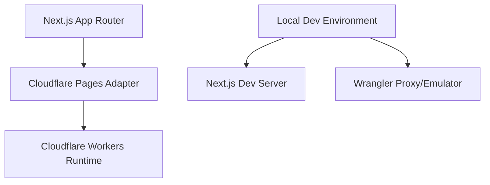
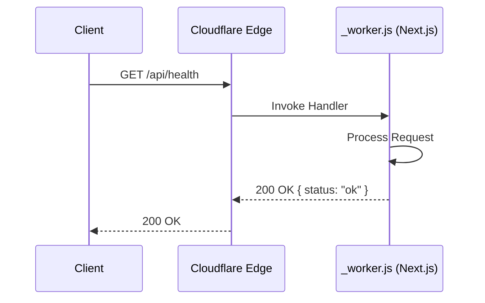

🧠 Principal Architect Mode: Engaged. Analyzing codebase constraints...

# PRD: Cloudflare Pages & Workers Migration

## 1. Context Analysis

### 1.1 Files Analyzed

- `package.json`: Identified Next.js scripts but Vite dependencies/config.
- `next.config.js`: Minimal Next.js config.
- `vite.config.ts`: Existing Vite config with aliases.
- `app/`: Next.js App Router structure (layout, page).
- `src/`: Vite source structure (main, App).

### 1.2 Component & Dependency Overview



### 1.3 Current Behavior Summary

- The project appears to be in a transition from Vite to Next.js or uses a hybrid structure.
- `package.json` scripts point to Next.js (`next dev`, `next build`).
- `app` directory exists, indicating Next.js App Router usage.
- No explicit Cloudflare configuration exists.

### 1.4 Problem Statement

The codebase needs to be deployed to Cloudflare Pages/Workers, requiring a compatible build adapter (`@cloudflare/next-on-pages`), a local development setup that mirrors the runtime, and a verification endpoint.

---

## 2. Proposed Solution

### 2.1 Architecture Summary

- **Adapter**: Use `@cloudflare/next-on-pages` to transform the Next.js build into a format compatible with Cloudflare Pages (Workers runtime).
- **Local Development**: Use `concurrently` to run `next dev` (for fast refresh) and `wrangler pages dev` (for runtime emulation/preview) if needed, though `next dev` is sufficient for most logic. We will configure a "preview" script for full emulation.
- **Verification**: Add a dedicated API route (`app/api/health/route.ts`) to verify the worker is running and responding correctly.
- **Configuration**: Add `wrangler.toml` for consistent configuration.

### 2.2 Architecture Diagram

```mermaid
flowchart LR
    Dev[Developer] -->|yarn dev| Local[Local Env]
    Local -->|concurrently| Next[Next.js Dev :3000]
    Local -->|optional| Wrangler[Wrangler Dev :8788]

    Deploy[Deployment] -->|Build| Adapter[@cloudflare/next-on-pages]
    Adapter -->|Output| Assets[.vercel/output/static]
    Adapter -->|Output| Worker[_worker.js]
    Assets & Worker -->|Upload| CFP[Cloudflare Pages]
```

### 2.3 Key Technical Decisions

- **`@cloudflare/next-on-pages`**: The official and most robust adapter for Next.js on Cloudflare.
- **`wrangler`**: Required for local emulation of Cloudflare-specific features (KV, D1, Headers) and deployment.
- **`concurrently`**: To manage multiple dev processes if we decide to run the full emulator alongside the dev server (optional but requested "if needed").
- **Node.js Compatibility**: Cloudflare Workers run in V8, not Node.js. We must ensure `nodejs_compat` flag is enabled if any Node.js APIs are used (Next.js often needs this).

### 2.4 Data Model Changes

- **No Data Changes.**

---

## 2.5 Runtime Execution Flow

**Request Flow (Production/Preview):**



---

## 3. Detailed Implementation Spec

### A. `package.json`

- **Changes Needed**:
  - Install `wrangler`, `@cloudflare/next-on-pages`, `concurrently`.
  - Update `scripts`:
    - `dev`: `concurrently "next dev" "wrangler pages dev --proxy 3000"` (This allows accessing via 8788 with CF bindings while keeping Next.js HMR on 3000).
    - `pages:build`: `npx @cloudflare/next-on-pages`
    - `pages:preview`: `npm run pages:build && wrangler pages dev .vercel/output/static`
    - `deploy`: `npm run pages:build && wrangler pages deploy .vercel/output/static`

### B. `wrangler.toml` (New File)

- **Content**:
  - `name`: pixelperfect
  - `compatibility_date`: "2024-01-01"
  - `compatibility_flags`: ["nodejs_compat"]
  - `pages_build_output_dir`: ".vercel/output/static"

### C. `app/api/health/route.ts` (New File)

- **Purpose**: Simple endpoint to verify deployment.
- **Pseudo-code**:

  ```typescript
  import { NextResponse } from 'next/server';

  export const runtime = 'edge'; // Force edge runtime

  export async function GET() {
    return NextResponse.json({
      status: 'ok',
      timestamp: new Date().toISOString(),
      region: process.env.CF_PAGES_URL ? 'Cloudflare' : 'Local',
    });
  }
  ```

### D. `next.config.js`

- **Changes**: Ensure `output: 'standalone'` is NOT used (Next-on-pages handles this). Ensure image optimization is compatible (Cloudflare Images or unoptimized).
- **Justification**: Standard Next.js output is required for the adapter.

---

## 4. Step-by-Step Execution Plan

### Phase 1: Dependencies & Configuration

- [ ] Install `wrangler`, `@cloudflare/next-on-pages`, `concurrently` (DevDeps).
- [ ] Create `wrangler.toml` with `nodejs_compat`.
- [ ] Update `package.json` scripts.

### Phase 2: Verification Endpoint

- [ ] Create `app/api/health/route.ts`.

### Phase 3: Verification

- [ ] Run `yarn dev` and verify access.
- [ ] Run `yarn pages:build` to verify build success.
- [ ] Run `yarn pages:preview` to verify local worker execution.

---

## 5. Testing Strategy

### Unit Tests

- N/A for config changes.

### Integration Tests

- **Manual Verification**:
  1.  Run `yarn dev`.
  2.  Access `http://localhost:3000/api/health` -> Should return JSON.
  3.  Access `http://localhost:8788/api/health` (Wrangler proxy) -> Should return JSON.

### Edge Cases

| Scenario      | Expected Behavior                       |
| :------------ | :-------------------------------------- |
| Build fails   | Check `@cloudflare/next-on-pages` logs. |
| Runtime error | Check `wrangler` logs.                  |

---

## 6. Acceptance Criteria

- [ ] `yarn dev` starts both Next.js and Wrangler (if configured) or at least Next.js.
- [ ] `yarn pages:build` produces `.vercel/output/static`.
- [ ] `/api/health` returns 200 OK on local and preview.
- [ ] Deployment command is ready (documented).

---

## 7. Verification & Rollback

- **Success Criteria**: Successful build and running endpoint.
- **Rollback Plan**: Revert `package.json` and delete `wrangler.toml`.
