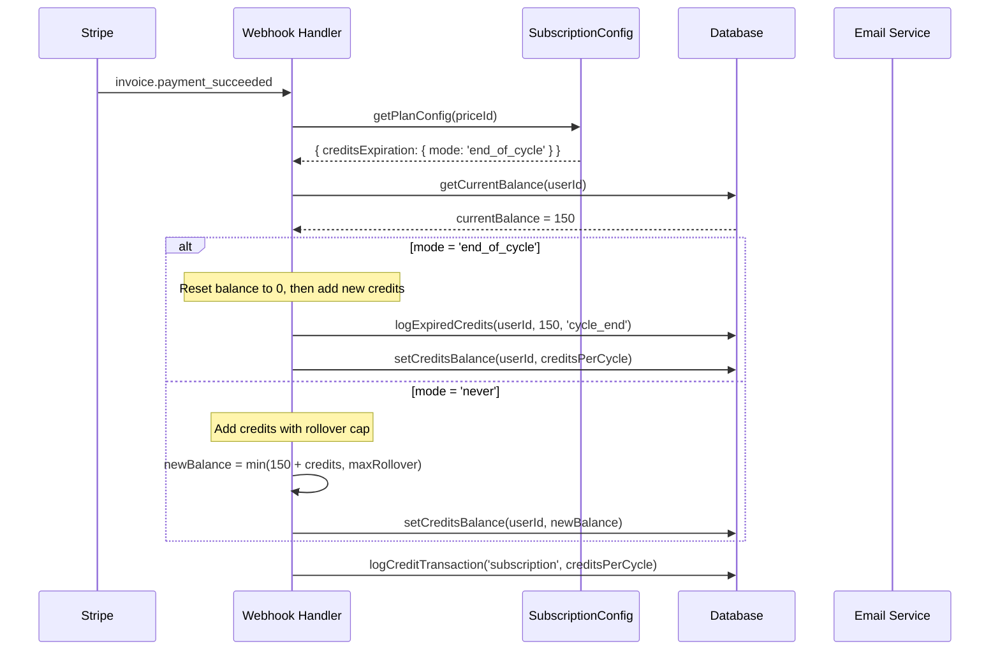
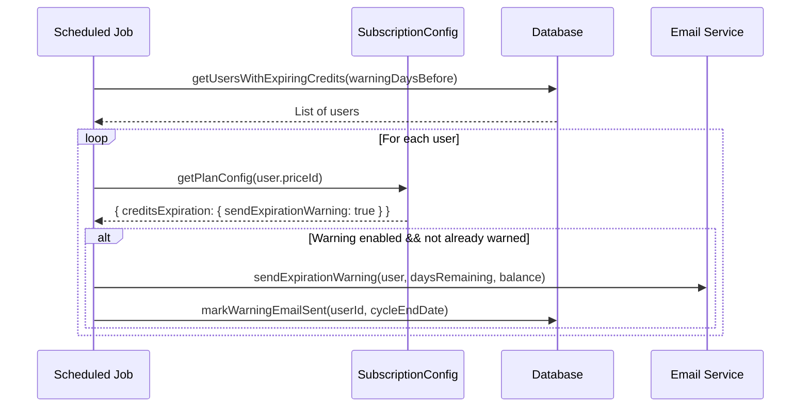

# Sub-PRD: Credits Expiration System

**Parent PRD:** [subscription-config-system.md](../subscription-config-system.md)
**Version:** 1.0
**Status:** Draft
**Priority:** P1
**Estimated Effort:** 2-3 days

---

## Overview

Implement configurable credits expiration policies. Currently, credits never expire (only capped by rollover). This feature adds support for expiring credits at the end of each billing cycle.

### Goals

1. Support multiple expiration modes via configuration
2. Reset credits to zero at cycle end (when enabled)
3. Maintain rollover behavior as default
4. Clear audit trail of expired credits
5. User notification before expiration

---

## Configuration Schema

```typescript
interface ICreditsExpirationConfig {
  /**
   * Expiration behavior:
   * - 'never': Credits persist indefinitely (capped by maxRollover)
   * - 'end_of_cycle': Credits reset to 0 at billing cycle end
   * - 'rolling_window': Credits expire N days after allocation
   */
  mode: 'never' | 'end_of_cycle' | 'rolling_window';

  /**
   * For rolling_window mode: days until credits expire
   * Not used for other modes
   */
  windowDays?: number;

  /**
   * Grace period after cycle ends before expiration (days)
   * Allows users time to use remaining credits
   */
  gracePeriodDays: number;

  /**
   * Whether to send expiration warning email
   */
  sendExpirationWarning: boolean;

  /**
   * Days before expiration to send warning
   */
  warningDaysBefore: number;
}
```

### Example Configurations

```typescript
// Mode 1: Never Expire (Current Default)
{
  key: 'hobby',
  creditsExpiration: {
    mode: 'never',
    gracePeriodDays: 0,
    sendExpirationWarning: false,
    warningDaysBefore: 0,
  },
  maxRollover: 1200, // Credits capped at 6× monthly
}

// Mode 2: Expire at Cycle End
{
  key: 'pro',
  creditsExpiration: {
    mode: 'end_of_cycle',
    gracePeriodDays: 3, // 3 extra days to use credits
    sendExpirationWarning: true,
    warningDaysBefore: 5,
  },
  maxRollover: null, // No rollover when expiring
}

// Mode 3: Rolling Window (Advanced)
{
  key: 'business',
  creditsExpiration: {
    mode: 'rolling_window',
    windowDays: 90, // Credits expire 90 days after allocation
    gracePeriodDays: 0,
    sendExpirationWarning: true,
    warningDaysBefore: 7,
  },
}
```

---

## Context Analysis

### Current Behavior

1. User subscribes → receives `creditsPerCycle` credits
2. Subscription renews → new credits added, capped at `maxRollover`
3. Credits **never** expire or reset
4. Rollover formula: `min(currentBalance + monthlyCredits, maxRollover)`

### Target Behavior (mode: 'end_of_cycle')

1. User subscribes → receives `creditsPerCycle` credits
2. Billing cycle ends → **credits reset to 0** (after grace period)
3. New cycle starts → fresh `creditsPerCycle` allocated
4. No rollover accumulation

### Files to Modify

```
app/api/webhooks/stripe/route.ts          # Handle renewal with expiration
server/services/subscription-sync.service.ts  # Expiration logic
shared/config/subscription.config.ts      # Add expiration config
supabase/migrations/xxx_credit_expiration.sql # Track expiration events
```

---

## Execution Flow

### Subscription Renewal with Expiration



### Expiration Warning Flow



---

## Database Changes

### New Credit Transaction Types

```sql
-- Add 'expired' type to credit_transactions
ALTER TABLE credit_transactions
DROP CONSTRAINT IF EXISTS credit_transactions_type_check;

ALTER TABLE credit_transactions
ADD CONSTRAINT credit_transactions_type_check
CHECK (type IN ('usage', 'subscription', 'purchase', 'refund', 'bonus', 'expired'));
```

### Optional: Expiration Tracking Table

```sql
-- Track expiration events for analytics
CREATE TABLE IF NOT EXISTS credit_expiration_events (
    id UUID PRIMARY KEY DEFAULT gen_random_uuid(),
    user_id UUID NOT NULL REFERENCES profiles(id) ON DELETE CASCADE,
    expired_amount INTEGER NOT NULL,
    expiration_reason TEXT NOT NULL, -- 'cycle_end', 'rolling_window', 'subscription_canceled'
    billing_cycle_end TIMESTAMPTZ,
    created_at TIMESTAMPTZ DEFAULT NOW()
);

CREATE INDEX idx_credit_expiration_user ON credit_expiration_events(user_id);
CREATE INDEX idx_credit_expiration_date ON credit_expiration_events(created_at DESC);
```

### RPC Function for Expiration

```sql
CREATE OR REPLACE FUNCTION expire_credits_at_cycle_end(
    target_user_id UUID,
    expiration_reason TEXT DEFAULT 'cycle_end'
)
RETURNS INTEGER
LANGUAGE plpgsql
SECURITY DEFINER
AS $$
DECLARE
    expired_amount INTEGER;
BEGIN
    -- Get current balance
    SELECT credits_balance INTO expired_amount
    FROM profiles
    WHERE id = target_user_id
    FOR UPDATE;

    IF expired_amount IS NULL OR expired_amount <= 0 THEN
        RETURN 0;
    END IF;

    -- Reset balance to 0
    UPDATE profiles
    SET credits_balance = 0,
        updated_at = NOW()
    WHERE id = target_user_id;

    -- Log expiration transaction
    INSERT INTO credit_transactions (
        user_id, amount, type, description, created_at
    ) VALUES (
        target_user_id,
        -expired_amount,
        'expired',
        'Credits expired at billing cycle end',
        NOW()
    );

    -- Log to expiration events table (if exists)
    INSERT INTO credit_expiration_events (
        user_id, expired_amount, expiration_reason
    ) VALUES (
        target_user_id, expired_amount, expiration_reason
    );

    RETURN expired_amount;
END;
$$;
```

---

## Webhook Handler Changes

### Updated handleInvoicePaymentSucceeded

```typescript
// app/api/webhooks/stripe/route.ts

async function handleInvoicePaymentSucceeded(invoice: Stripe.Invoice) {
  const subscriptionId = invoice.subscription as string;
  const customerId = invoice.customer as string;

  // Get user and plan config
  const userId = await getUserIdFromCustomerId(customerId);
  const subscription = await stripe.subscriptions.retrieve(subscriptionId);
  const priceId = subscription.items.data[0]?.price.id;
  const planConfig = getPlanConfig(priceId);

  if (!planConfig) {
    console.error('Unknown price ID:', priceId);
    return;
  }

  const { creditsPerCycle, maxRollover, creditsExpiration } = planConfig;

  // Skip initial invoice (handled by checkout.session.completed)
  if (invoice.billing_reason === 'subscription_create') {
    return;
  }

  // Get current balance
  const { data: profile } = await supabaseAdmin
    .from('profiles')
    .select('credits_balance')
    .eq('id', userId)
    .single();

  const currentBalance = profile?.credits_balance ?? 0;

  let newBalance: number;
  let expiredCredits = 0;

  switch (creditsExpiration.mode) {
    case 'end_of_cycle':
      // Expire all existing credits, then add new allocation
      expiredCredits = currentBalance;
      if (expiredCredits > 0) {
        await logExpiredCredits(userId, expiredCredits, 'cycle_end');
      }
      newBalance = creditsPerCycle;
      break;

    case 'rolling_window':
      // Complex: would need per-credit expiration tracking
      // Simplified: treat like end_of_cycle for now
      expiredCredits = currentBalance;
      if (expiredCredits > 0) {
        await logExpiredCredits(userId, expiredCredits, 'rolling_window');
      }
      newBalance = creditsPerCycle;
      break;

    case 'never':
    default:
      // Current behavior: rollover with cap
      const uncappedBalance = currentBalance + creditsPerCycle;
      newBalance = maxRollover ? Math.min(uncappedBalance, maxRollover) : uncappedBalance;

      const cappedAmount = uncappedBalance - newBalance;
      if (cappedAmount > 0) {
        console.log(`Rollover capped: ${cappedAmount} credits not added`);
      }
      break;
  }

  // Update balance
  await supabaseAdmin.from('profiles').update({ credits_balance: newBalance }).eq('id', userId);

  // Log new credits transaction
  await supabaseAdmin.rpc('increment_credits_with_log', {
    target_user_id: userId,
    amount: creditsPerCycle,
    transaction_type: 'subscription',
    ref_id: invoice.id,
    description: `Monthly subscription credits (${expiredCredits > 0 ? `${expiredCredits} expired` : 'rollover applied'})`,
  });
}

async function logExpiredCredits(userId: string, amount: number, reason: string): Promise<void> {
  await supabaseAdmin.rpc('decrement_credits_with_log', {
    target_user_id: userId,
    amount: amount,
    transaction_type: 'expired',
    ref_id: null,
    description: `Credits expired: ${reason}`,
  });
}
```

---

## UI Considerations

### Credits Display with Expiration

```typescript
// client/components/stripe/CreditsDisplay.tsx

function CreditsDisplay({ balance, subscription, planConfig }: Props) {
  const expiresAt = subscription?.current_period_end;
  const expirationMode = planConfig?.creditsExpiration?.mode;

  return (
    <div>
      <span className="credits-balance">{balance} credits</span>

      {expirationMode === 'end_of_cycle' && expiresAt && (
        <span className="expiration-warning">
          Expires {formatDistanceToNow(new Date(expiresAt * 1000))}
        </span>
      )}

      {expirationMode === 'never' && planConfig?.maxRollover && (
        <span className="rollover-info">
          Max balance: {planConfig.maxRollover}
        </span>
      )}
    </div>
  );
}
```

### Billing Page Warning

```typescript
// Show warning banner when credits will expire soon
function ExpirationWarningBanner({ subscription, balance, planConfig }: Props) {
  if (planConfig?.creditsExpiration?.mode !== 'end_of_cycle') {
    return null;
  }

  const daysUntilExpiration = differenceInDays(
    new Date(subscription.current_period_end * 1000),
    new Date()
  );

  if (daysUntilExpiration > 7 || balance === 0) {
    return null;
  }

  return (
    <Alert variant="warning">
      <AlertTitle>Credits Expiring Soon</AlertTitle>
      <AlertDescription>
        Your {balance} credits will expire in {daysUntilExpiration} days
        when your billing cycle renews. Use them or lose them!
      </AlertDescription>
    </Alert>
  );
}
```

---

## Implementation Steps

### Phase 1: Configuration

- [ ] Add `ICreditsExpirationConfig` to subscription types
- [ ] Add expiration config to each plan (default: `mode: 'never'`)
- [ ] Add validation: gracePeriodDays >= 0
- [ ] Create `getExpirationConfig(priceId)` utility

### Phase 2: Database

- [ ] Add 'expired' to credit_transactions type constraint
- [ ] Create `credit_expiration_events` table (optional)
- [ ] Create `expire_credits_at_cycle_end` RPC function
- [ ] Update `increment_credits_with_log` to support mode parameter

### Phase 3: Webhook Handler

- [ ] Update `handleInvoicePaymentSucceeded` with expiration logic
- [ ] Add expiration reason to transaction description
- [ ] Log expired credits as negative transaction
- [ ] Test with both modes

### Phase 4: UI Updates

- [ ] Update CreditsDisplay with expiration info
- [ ] Add ExpirationWarningBanner component
- [ ] Update credit transaction history to show "expired" type
- [ ] Add expiration info to billing page

### Phase 5: Notifications (Optional)

- [ ] Create scheduled job for expiration warnings
- [ ] Create expiration warning email template
- [ ] Track which users have been warned per cycle

---

## Testing Strategy

### Unit Tests

```typescript
describe('Credits Expiration', () => {
  test('end_of_cycle mode resets balance to 0', async () => {
    const config = { mode: 'end_of_cycle', gracePeriodDays: 0 };
    const result = calculateNewBalance(150, 200, config);
    expect(result.expired).toBe(150);
    expect(result.newBalance).toBe(200);
  });

  test('never mode applies rollover cap', async () => {
    const config = { mode: 'never', gracePeriodDays: 0 };
    const result = calculateNewBalance(1000, 200, config, 1200);
    expect(result.expired).toBe(0);
    expect(result.newBalance).toBe(1200); // Capped
  });
});
```

### Integration Tests

| Scenario                         | Expected                                |
| -------------------------------- | --------------------------------------- |
| Renewal with mode='never'        | Credits added with rollover cap         |
| Renewal with mode='end_of_cycle' | Old credits expire, fresh allocation    |
| Renewal with 0 balance           | No expiration logged, new credits added |
| Grace period active              | Credits not expired yet                 |

### Edge Cases

| Scenario                     | Expected Behavior                  |
| ---------------------------- | ---------------------------------- |
| Balance = 0 at cycle end     | No expiration logged, just add new |
| Mode change mid-subscription | Apply new mode at next renewal     |
| Downgrade with mode change   | Use new plan's expiration config   |
| Subscription canceled        | Credits remain until period end    |

---

## Acceptance Criteria

- [ ] Plans can configure expiration mode
- [ ] `end_of_cycle` mode resets credits at renewal
- [ ] `never` mode maintains rollover behavior
- [ ] Expired credits logged in transactions
- [ ] UI shows expiration info when relevant
- [ ] Transaction history shows "Expired" type
- [ ] No data loss - all expirations auditable

---

## Rollback Plan

1. Set all plans to `mode: 'never'` in config
2. Existing behavior restored immediately
3. Expired transaction logs remain for audit
4. No database schema rollback needed

---

## Future Enhancements

1. **Grace Period:** Allow N days after cycle end before expiration
2. **Rolling Window:** Track per-credit expiration dates
3. **Expiration Notifications:** Email N days before credits expire
4. **Admin Override:** Manual extension of credits for support cases
