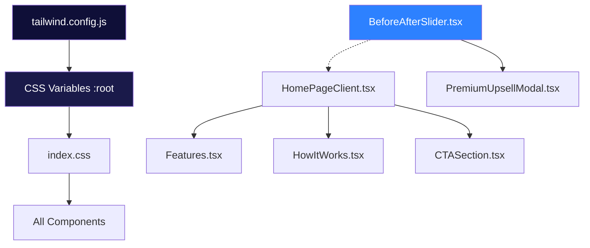
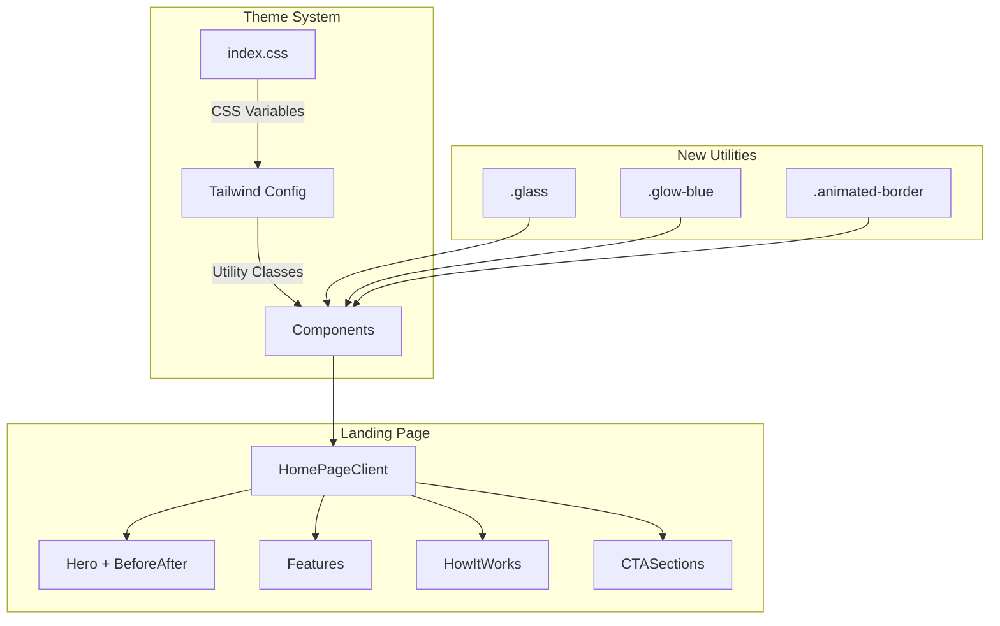
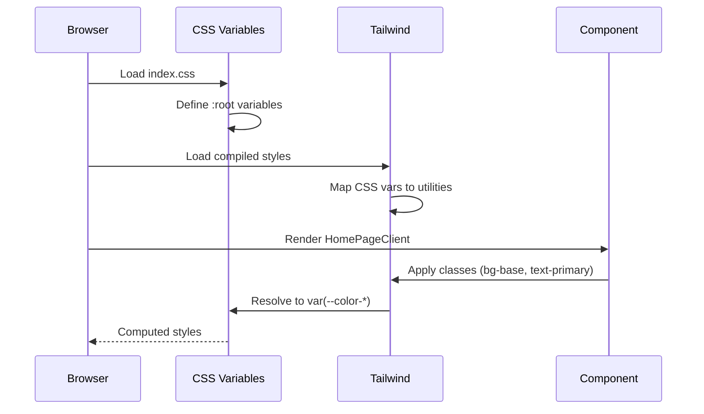

# PRD: Dark Premium Theme System Implementation

**Status**: Draft
**Priority**: High
**Author**: Principal Architect
**Date**: December 19, 2025

---

## 1. Context Analysis

### 1.1 Files Analyzed

```
/home/joao/projects/pixelperfect/styling-guide-report.md          # Design specifications
/home/joao/projects/pixelperfect/tailwind.config.js               # Current Tailwind config
/home/joao/projects/pixelperfect/client/styles/index.css          # Current CSS variables
/home/joao/projects/pixelperfect/app/page.tsx                     # Landing page entry
/home/joao/projects/pixelperfect/client/components/pages/HomePageClient.tsx
/home/joao/projects/pixelperfect/client/components/features/landing/Features.tsx
/home/joao/projects/pixelperfect/client/components/features/landing/HowItWorks.tsx
/home/joao/projects/pixelperfect/client/components/ui/BeforeAfterSlider.tsx
/home/joao/projects/pixelperfect/client/components/features/workspace/PremiumUpsellModal.tsx
```

### 1.2 Component & Dependency Overview



### 1.3 Current Behavior Summary

- **Theme**: Light mode only, forced via CSS (`color-scheme: light only`)
- **Colors**: Purple/indigo gradient theme (`indigo-600`, `violet-600`, `purple-600`)
- **CSS Variables**: Basic setup exists (`--color-primary`, `--color-background`, etc.)
- **BeforeAfterSlider**: Functional component with hardcoded `indigo-600` colors
- **Landing Page**: No before/after comparison showcase
- **Glass Morphism**: Partial implementation (some `backdrop-blur` usage)

### 1.4 Problem Statement

The current purple/indigo theme looks generic and doesn't convey the professional trustworthiness expected of an AI image upscaling tool. The styling-guide-report.md specifies a **dark premium aesthetic** inspired by Topaz Labs that needs to be implemented as a comprehensive theme system.

---

## 2. Proposed Solution

### 2.1 Architecture Summary

1. **CSS Variables Overhaul**: Replace current light theme variables with dark premium palette from styling-guide-report.md
2. **Tailwind Config Extension**: Add new color tokens, animations, and glass morphism utilities
3. **BeforeAfterSlider Enhancement**: Update theming + add to landing page hero section
4. **Component Migration**: Update all landing page components to use new theme system
5. **Animation System**: Add border flow, glow effects, and smooth transitions

**Alternatives Considered**:

- **CSS-in-JS (styled-components)**: Rejected - adds runtime overhead, project uses Tailwind
- **Multiple theme files**: Rejected - over-engineering for single dark theme
- **Shadcn/ui theming**: Rejected - not currently using shadcn, would require larger migration

### 2.2 Architecture Diagram



### 2.3 Key Technical Decisions

| Decision       | Choice                         | Rationale                                           |
| -------------- | ------------------------------ | --------------------------------------------------- |
| Color Format   | RGB values in CSS vars         | Allows Tailwind opacity modifiers (`bg-primary/50`) |
| Font Loading   | Google Fonts (Inter + DM Sans) | Match Topaz Labs, good performance                  |
| Glass Morphism | `backdrop-filter: blur()`      | Modern browser support 95%+, graceful fallback      |
| Animations     | CSS keyframes in index.css     | No JS overhead, hardware accelerated                |

### 2.4 Data Model Changes

**No Data Changes.** This is a frontend-only styling update.

---

### 2.5 Runtime Execution Flow



---

## 3. Detailed Implementation Spec

### A. `client/styles/index.css`

**Changes Needed**: Complete overhaul of `:root` variables

```css
@layer base {
  :root {
    /* Background Colors */
    --color-bg-base: 15 15 56; /* #0F0F38 */
    --color-bg-surface: 26 26 74; /* #1A1A4A */
    --color-bg-surface-light: 37 37 96; /* #252560 */

    /* Primary Colors */
    --color-accent: 45 129 255; /* #2D81FF */
    --color-accent-hover: 74 148 255; /* #4A94FF */
    --color-accent-light: 96 165 250; /* #60A5FA */

    /* Text Colors */
    --color-text-primary: 255 255 255; /* #FFFFFF */
    --color-text-secondary: 160 160 192; /* #A0A0C0 */
    --color-text-muted: 107 107 141; /* #6B6B8D */

    /* Semantic Colors */
    --color-success: 16 185 129; /* #10B981 */
    --color-warning: 245 158 11; /* #F59E0B */
    --color-error: 239 68 68; /* #EF4444 */

    /* Legacy mappings for existing components */
    --color-primary: var(--color-accent);
    --color-primary-hover: var(--color-accent-hover);
    --color-foreground: var(--color-text-primary);
    --color-muted-foreground: var(--color-text-secondary);
    --color-background: var(--color-bg-base);
    --color-card: var(--color-bg-surface);
    --color-border: 255 255 255 / 0.1;
  }
}
```

**New Utilities to Add**:

```css
@layer components {
  /* Glass Morphism */
  .glass {
    background: rgba(255, 255, 255, 0.05);
    backdrop-filter: blur(12px);
    -webkit-backdrop-filter: blur(12px);
    border: 1px solid rgba(255, 255, 255, 0.1);
  }

  .glass-card {
    @apply glass rounded-2xl p-6 transition-all duration-300;
  }

  .glass-card:hover {
    background: rgba(255, 255, 255, 0.08);
    border-color: rgba(255, 255, 255, 0.15);
    transform: translateY(-2px);
  }

  /* Glow Effects */
  .glow-blue {
    box-shadow: 0 0 20px rgba(45, 129, 255, 0.3);
  }

  .glow-blue-lg {
    box-shadow: 0 0 40px rgba(45, 129, 255, 0.4);
  }

  /* Hero Gradient */
  .hero-gradient {
    background:
      radial-gradient(ellipse at top, rgba(45, 129, 255, 0.15) 0%, transparent 50%),
      radial-gradient(ellipse at bottom right, rgba(6, 182, 212, 0.1) 0%, transparent 50%),
      rgb(var(--color-bg-base));
  }
}

@layer utilities {
  /* Animated Border */
  .animated-border {
    position: relative;
  }

  .animated-border::before {
    content: '';
    position: absolute;
    inset: -1px;
    border-radius: inherit;
    padding: 1px;
    background: linear-gradient(90deg, #2d81ff, #06b6d4, #2d81ff);
    background-size: 200% 100%;
    -webkit-mask:
      linear-gradient(#fff 0 0) content-box,
      linear-gradient(#fff 0 0);
    mask:
      linear-gradient(#fff 0 0) content-box,
      linear-gradient(#fff 0 0);
    -webkit-mask-composite: xor;
    mask-composite: exclude;
    opacity: 0;
    transition: opacity 0.3s ease;
    animation: borderFlow 3s linear infinite;
  }

  .animated-border:hover::before {
    opacity: 1;
  }

  @keyframes borderFlow {
    0% {
      background-position: 0% 50%;
    }
    100% {
      background-position: 200% 50%;
    }
  }
}
```

**Justification**: CSS variables with RGB values allow Tailwind's opacity modifiers. Component classes reduce duplication.

---

### B. `tailwind.config.js`

**Changes Needed**: Extend colors, add fonts, add animations

```javascript
export default {
  content: [
    /* existing */
  ],
  theme: {
    extend: {
      fontFamily: {
        sans: ['Inter', 'ui-sans-serif', 'system-ui', 'sans-serif'],
        display: ['DM Sans', 'Inter', 'ui-sans-serif', 'sans-serif'],
      },
      colors: {
        // New dark theme colors
        base: 'rgb(var(--color-bg-base) / <alpha-value>)',
        surface: 'rgb(var(--color-bg-surface) / <alpha-value>)',
        'surface-light': 'rgb(var(--color-bg-surface-light) / <alpha-value>)',
        accent: {
          DEFAULT: 'rgb(var(--color-accent) / <alpha-value>)',
          hover: 'rgb(var(--color-accent-hover) / <alpha-value>)',
          light: 'rgb(var(--color-accent-light) / <alpha-value>)',
        },
        // Legacy support
        primary: {
          DEFAULT: 'rgb(var(--color-primary) / <alpha-value>)',
          hover: 'rgb(var(--color-primary-hover) / <alpha-value>)',
        },
        foreground: 'rgb(var(--color-foreground) / <alpha-value>)',
        muted: {
          foreground: 'rgb(var(--color-muted-foreground) / <alpha-value>)',
        },
        // Keep existing semantic colors
      },
      keyframes: {
        // Existing keyframes...
        'glow-pulse': {
          '0%, 100%': { boxShadow: '0 0 20px rgba(45, 129, 255, 0.3)' },
          '50%': { boxShadow: '0 0 40px rgba(45, 129, 255, 0.5)' },
        },
      },
      animation: {
        // Existing animations...
        'glow-pulse': 'glow-pulse 2s ease-in-out infinite',
      },
    },
  },
  plugins: [],
};
```

**Justification**: Extends existing config, maintains backward compatibility.

---

### C. `client/components/ui/BeforeAfterSlider.tsx`

**Changes Needed**: Update colors to use theme variables

```tsx
// Update line 97-103 (slider handle)
<div
  className="absolute top-0 bottom-0 w-0.5 bg-white shadow-[0_0_10px_rgba(0,0,0,0.3)] cursor-col-resize flex items-center justify-center z-10 transform -translate-x-1/2"
  style={{ left: `${sliderPosition}%` }}
>
  <div className="w-10 h-10 bg-accent rounded-full shadow-lg glow-blue flex items-center justify-center">
    <ArrowLeftRight size={16} className="text-white" />
  </div>
</div>

// Update line 106-111 (labels)
<div className="absolute bottom-3 left-3 glass text-white text-xs px-3 py-1.5 rounded-lg pointer-events-none font-medium">
  {beforeLabel}
</div>
<div className="absolute bottom-3 right-3 bg-accent text-white text-xs px-3 py-1.5 rounded-lg pointer-events-none font-medium glow-blue">
  {afterLabel}
</div>
```

**Justification**: Uses new theme utilities, improves visual consistency.

---

### D. `client/components/pages/HomePageClient.tsx`

**Changes Needed**: Complete theme overhaul + add BeforeAfterSlider to hero

**Key Updates**:

1. **Main wrapper**: `bg-slate-50` → `bg-base`
2. **Hero section**: Replace purple gradients with `hero-gradient`
3. **Badge**: Update to glass style
4. **Headline gradient**: Purple → blue gradient
5. **CTAs**: Purple gradient → solid accent blue with glow
6. **Add BeforeAfterSlider**: Below hero headline

```tsx
// Line 56 - Main wrapper
<main className="flex-grow bg-base font-sans selection:bg-accent/20 selection:text-white">

// Line 58-63 - Hero background
<section className="relative pt-20 pb-16 lg:pt-32 lg:pb-24 overflow-hidden hero-gradient">

// Line 67-74 - Badge
<div className="inline-flex items-center gap-2 px-4 py-2 rounded-full glass text-xs font-semibold text-accent mb-8 animate-fade-in">

// Line 78-80 - Headline gradient
<span className="relative inline-block text-transparent bg-clip-text bg-gradient-to-r from-accent via-accent-light to-cyan-400">

// Line 118-125 - Primary CTA
<button className="group inline-flex items-center gap-2 px-8 py-4 bg-accent hover:bg-accent-hover text-white font-semibold rounded-xl transition-all duration-300 glow-blue hover:glow-blue-lg">

// NEW: Add BeforeAfterSlider section after hero text, before CTAs
<div className="mt-12 max-w-3xl mx-auto">
  <div className="glass-card p-2 animated-border rounded-2xl">
    <BeforeAfterSlider
      beforeUrl="/before-after/women-before.png"
      afterUrl="/before-after/women-after.png"
      beforeLabel="Original"
      afterLabel="Enhanced"
      className="aspect-[16/10] rounded-xl"
    />
  </div>
</div>
```

**Justification**: Implements styling guide, adds visual proof of product quality in hero.

---

### E. `client/components/features/landing/Features.tsx`

**Changes Needed**: Dark theme update

```tsx
// Line 49 - Section background
<section id="features" className="py-24 bg-surface relative overflow-hidden">

// Line 55 - Subheading
<h2 className="text-base font-bold uppercase tracking-wide text-accent">

// Line 58 - Main heading
<p className="mt-2 text-3xl font-extrabold tracking-tight text-white sm:text-4xl">

// Line 61 - Description
<p className="mt-6 text-lg text-muted-foreground leading-8">

// Line 70-72 - Feature cards
<div className="group relative p-8 glass-card animated-border">

// Line 79 - Feature title hover
<h3 className="text-lg font-bold text-white mb-3 group-hover:text-accent transition-colors">

// Line 83 - Feature description
<p className="text-muted-foreground text-sm leading-relaxed">
```

**Justification**: Consistent dark theme across landing sections.

---

## 4. Step-by-Step Execution Plan

### Phase 1: Foundation (No UI changes yet)

- [ ] Update `client/styles/index.css` with new CSS variables
- [ ] Update `tailwind.config.js` with new color tokens and fonts
- [ ] Add glass morphism and glow utility classes
- [ ] Add Google Fonts import (Inter + DM Sans) to `app/layout.tsx`
- [ ] Run `yarn verify` to ensure no build errors

### Phase 2: Core Components

- [ ] Update `BeforeAfterSlider.tsx` to use new theme classes
- [ ] Create `client/components/landing/HeroBeforeAfter.tsx` wrapper component
- [ ] Test BeforeAfterSlider in isolation

### Phase 3: Landing Page Migration

- [ ] Update `HomePageClient.tsx` - hero section
- [ ] Update `HomePageClient.tsx` - add BeforeAfterSlider to hero
- [ ] Update `Features.tsx` - dark theme
- [ ] Update `HowItWorks.tsx` - dark theme
- [ ] Update CTA sections - dark theme
- [ ] Update any remaining hardcoded colors

### Phase 4: Polish & Verification

- [ ] Test responsive breakpoints (mobile, tablet, desktop)
- [ ] Test glass morphism fallback in older browsers
- [ ] Verify WCAG contrast ratios
- [ ] Run full `yarn verify`
- [ ] Visual QA against styling-guide-report.md

---

## 5. Testing Strategy

### Unit Tests

- Verify BeforeAfterSlider renders with new theme classes
- Verify CSS variables resolve correctly

### Visual Regression

- Compare landing page screenshots before/after
- Test on Chrome, Firefox, Safari

### Edge Cases

| Scenario                          | Expected Behavior                           |
| --------------------------------- | ------------------------------------------- |
| Browser without `backdrop-filter` | Falls back to solid dark background         |
| Slow network (fonts)              | System fonts render first, swap when loaded |
| Mobile viewport                   | Glass effects simplified for performance    |
| High contrast mode                | Maintains WCAG AA compliance                |

---

## 6. Acceptance Criteria

- [ ] Landing page uses dark navy background (#0F0F38)
- [ ] All CTAs use accent blue (#2D81FF) with glow effect
- [ ] BeforeAfterSlider visible in hero section
- [ ] Glass morphism cards render correctly
- [ ] No purple/indigo colors remain on landing page
- [ ] Typography uses Inter (body) + DM Sans (headings)
- [ ] All text passes WCAG AA contrast (4.5:1 minimum)
- [ ] `yarn verify` passes
- [ ] Responsive on mobile/tablet/desktop

---

## 7. Verification & Rollback

### Success Criteria

- Visual match to styling-guide-report.md specifications
- No console errors related to CSS
- Lighthouse performance score maintained (>90)

### Rollback Plan

- Revert CSS variables to previous values
- Revert Tailwind config
- Changes are isolated to styling, no data impact

---

## Appendix: Color Reference

| Token                    | Hex     | RGB         | Usage            |
| ------------------------ | ------- | ----------- | ---------------- |
| `--color-bg-base`        | #0F0F38 | 15 15 56    | Page backgrounds |
| `--color-bg-surface`     | #1A1A4A | 26 26 74    | Cards, modals    |
| `--color-accent`         | #2D81FF | 45 129 255  | CTAs, links      |
| `--color-accent-hover`   | #4A94FF | 74 148 255  | Hover states     |
| `--color-text-primary`   | #FFFFFF | 255 255 255 | Headings         |
| `--color-text-secondary` | #A0A0C0 | 160 160 192 | Body text        |
| `--color-text-muted`     | #6B6B8D | 107 107 141 | Captions         |
