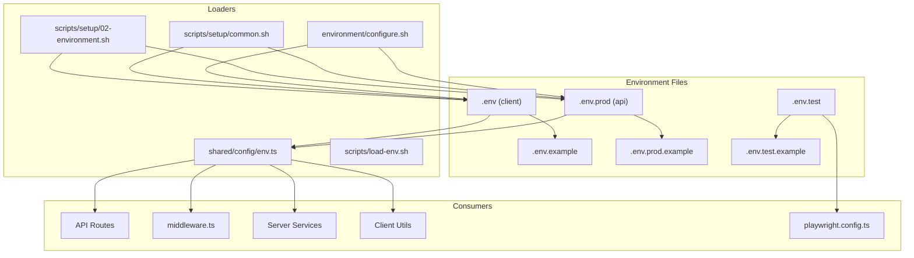
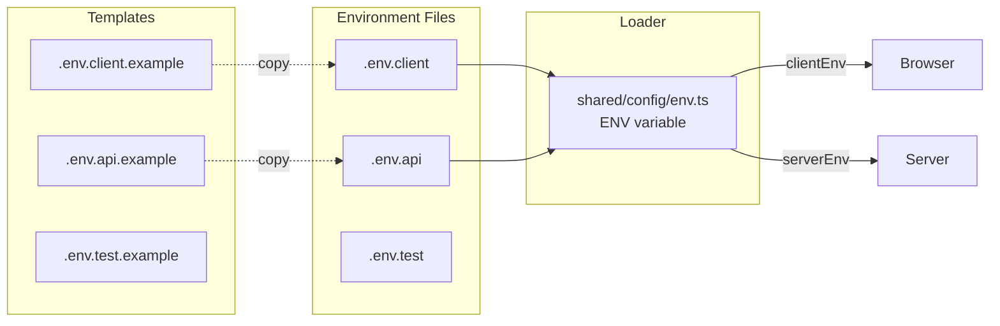
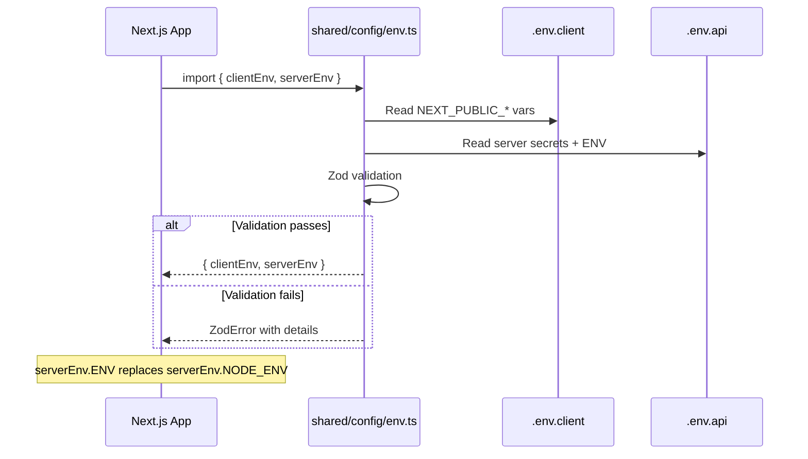

# Environment System Refactor PRD

## 1. Context Analysis

### 1.1 Files Analyzed

| Path | Purpose |
|------|---------|
| `/.env` | Current public variables file (gitignored) |
| `/.env.example` | Template for public variables |
| `/.env.prod` | Current server secrets file (gitignored) |
| `/.env.prod.example` | Template for server secrets |
| `/.env.test` | E2E testing credentials (unchanged) |
| `/.env.test.example` | Template for test credentials (unchanged) |
| `/shared/config/env.ts` | Centralized env loader with Zod validation |
| `/.gitignore` | Git exclusion patterns for env files |
| `/scripts/setup/02-environment.sh` | Interactive env setup script |
| `/scripts/setup/common.sh` | Shared utilities with `load_env()` function |
| `/scripts/load-env.sh` | Generic bash env loader |
| `/environment/configure.sh` | Quick environment configuration |
| `/playwright.config.ts` | E2E config (loads `.env.test`) |
| `/CLAUDE.md` | Project instructions referencing env structure |
| `/.github/workflows/deploy.yml` | CI/CD deployment workflow |
| `/app/api/checkout/route.ts` | Uses `NODE_ENV` for test detection |
| `/app/api/portal/route.ts` | Uses `NODE_ENV` for test detection |
| `/app/api/webhooks/stripe/route.ts` | Uses `serverEnv.NODE_ENV` |
| `/app/api/pseo/health/route.ts` | Uses `process.env.NODE_ENV` |
| `/middleware.ts` | Uses `serverEnv.NODE_ENV` |
| `/server/analytics/analyticsService.ts` | Uses `serverEnv.NODE_ENV` |
| `/client/utils/api-client.ts` | Uses `serverEnv.NODE_ENV` |

### 1.2 Component & Dependency Overview



### 1.3 Current Behavior Summary

- **Local Development:**
  - `.env` contains `NEXT_PUBLIC_*` variables for client-side use plus some dev-only server keys
  - `.env.prod` contains server-side secrets (no prefix) for local development
  - Both files are for **development only**, not production deployment
- **Production Deployment:**
  - Environment variables set via GitHub Actions (`${{ vars.* }}`, `${{ secrets.* }}`)
  - Cloudflare Pages environment variables (runtime secrets)
  - No `.env` files are used in production builds
- `.env.test` contains E2E testing credentials (remains unchanged)
- `shared/config/env.ts` exports `clientEnv` and `serverEnv` with Zod validation
- `NODE_ENV` is used in 16 files for environment detection (`'development' | 'production' | 'test'`)
- Setup scripts copy from `.example` files and configure credentials interactively

### 1.4 Problem Statement

**Local Development:** The current naming convention (`.env` and `.env.prod`) is ambiguous—both are for development but `.env.prod` implies production use. Rename to `.env.client` (public variables) and `.env.api` (server secrets) for clarity.

**Code Consistency:** Refactor `NODE_ENV` to `ENV` throughout the codebase for cleaner naming.

**Production:** No file changes needed - only update the variable name from `NODE_ENV` to `ENV` in CI/CD workflows and runtime detection.

---

## 2. Proposed Solution

### 2.1 Architecture Summary

**Local Development Files (renamed):**
- **Rename `.env` → `.env.client`**: Contains only `NEXT_PUBLIC_*` prefixed variables (dev only)
- **Rename `.env.prod` → `.env.api`**: Contains server-side secrets (dev only)
- **Rename `.env.example` → `.env.client.example`**: Template for client variables
- **Rename `.env.prod.example` → `.env.api.example`**: Template for server secrets
- **Keep `.env.test` unchanged**: Already clearly named for testing

**Code Changes (everywhere):**
- **Refactor `NODE_ENV` → `ENV`**: Update all references in code, shared/config/env.ts

**Production (variable name only):**
- No file renames in CI/CD - GitHub Actions and Cloudflare use environment variables directly
- Code changes to use `ENV` instead of `NODE_ENV` apply to production runtime as well

**Alternatives Considered:**
| Alternative | Rejected Because |
|-------------|------------------|
| Keep `.env` / `.env.prod` | Ambiguous naming confuses developers |
| Use `.env.public` / `.env.private` | "private" implies gitignored but doesn't clarify purpose |
| Use `.env.browser` / `.env.server` | Too technical, "client/api" is clearer |

### 2.2 Architecture Diagram (After Refactor)



### 2.3 Key Technical Decisions

| Decision | Rationale |
|----------|-----------|
| Use `ENV` instead of `NODE_ENV` | Cleaner naming, avoids confusion with Node.js internals |
| Keep `.env.test` unchanged | Already clear, used by Playwright |
| Update `.gitignore` patterns | Ensure new files are properly ignored |
| Backwards compatibility period: None | Clean cut, update all references atomically |

### 2.4 Data Model Changes

**No database changes required.**

---

### 2.5 Runtime Execution Flow



---

## 3. Detailed Implementation Spec

### A. `/.gitignore`

**Changes Needed:**
- Add `.env.client` and `.env.api` to ignored patterns
- Remove `.env` and `.env.prod` patterns (cleanup after migration)

**Current (lines 23-31):**
```gitignore
# Environment variables
.env
.env*.local
.env.local
.env.development.local
.env.test.local
.env.production.local
.env.prod
.env.test
```

**New:**
```gitignore
# Environment variables
.env.client
.env.api
.env.test
.env*.local
```

**Justification:** Simpler patterns, clearer naming.

---

### B. `/shared/config/env.ts`

**Changes Needed:**
- Rename `NODE_ENV` → `ENV` in schema and loader
- Update helper functions to use `serverEnv.ENV`
- Update type `IServerEnv`

**Pseudo-code:**
```typescript
const serverEnvSchema = z.object({
  ENV: z.enum(['development', 'production', 'test']).default('development'),
  // ... rest unchanged
});

function loadServerEnv(): IServerEnv {
  const env = {
    ENV: process.env.ENV || process.env.NODE_ENV || 'development',
    // ... rest unchanged
  };
  return serverEnvSchema.parse(env);
}

export function isProduction(): boolean {
  return serverEnv.ENV === 'production';
}

export function isDevelopment(): boolean {
  return serverEnv.ENV === 'development';
}

export function isTest(): boolean {
  return serverEnv.ENV === 'test';
}
```

**Justification:** Centralized change, all consumers use `serverEnv.ENV`.

---

### C. `/.env.client.example` (rename from `.env.example`)

**Changes Needed:**
- Rename file
- Update header comment to reference new naming

**New header:**
```bash
# Client environment variables (.env.client)
# These are NEXT_PUBLIC_* vars exposed to the browser
# Server-side secrets go in .env.api (see .env.api.example)
```

---

### D. `/.env.api.example` (rename from `.env.prod.example`)

**Changes Needed:**
- Rename file
- Add `ENV` variable
- Update header comment

**New content:**
```bash
# Server-side secrets (.env.api)
# NEVER COMMIT THIS FILE - contains API keys and secrets
# These variables have NO prefix and are NEVER exposed to the browser

# Environment mode
ENV=production

# Supabase
SUPABASE_SERVICE_ROLE_KEY=XXX

# Stripe
STRIPE_SECRET_KEY=sk_live_xxx
STRIPE_WEBHOOK_SECRET=whsec_xxx

# ... rest unchanged
```

---

### E. `/scripts/setup/02-environment.sh`

**Changes Needed:**
- Replace all `.env` references with `.env.client`
- Replace all `.env.prod` references with `.env.api`
- Update `.example` file references

**Key changes:**
```bash
# Line 22-36: Handle .env.client file
if [[ -f ".env.client" ]]; then
    # ... prompt logic
else
    cp .env.client.example .env.client
    log_success "Created .env.client from example"
fi

# Line 38-53: Handle .env.api file
if [[ -f ".env.api" ]]; then
    # ... prompt logic
else
    cp .env.api.example .env.api
    log_success "Created .env.api from example"
fi

# Line 69-88: Update grep/sed patterns
local current_url=$(grep "^NEXT_PUBLIC_SUPABASE_URL=" .env.client 2>/dev/null | cut -d'=' -f2 || echo "")
sed -i "s|^NEXT_PUBLIC_SUPABASE_URL=.*|NEXT_PUBLIC_SUPABASE_URL=$SUPABASE_URL|" .env.client
sed -i "s|^SUPABASE_SERVICE_ROLE_KEY=.*|SUPABASE_SERVICE_ROLE_KEY=$SUPABASE_SERVICE_KEY|" .env.api
```

---

### F. `/scripts/setup/common.sh`

**Changes Needed:**
- Update `load_env()` function to source new file names

**Pseudo-code:**
```bash
load_env() {
    local project_root="$1"

    if [[ -f "$project_root/.env.client" ]]; then
        set -a
        source "$project_root/.env.client"
        set +a
    fi

    if [[ -f "$project_root/.env.api" ]]; then
        set -a
        source "$project_root/.env.api"
        set +a
    fi
}
```

---

### G. `/environment/configure.sh`

**Changes Needed:**
- Update all file references

**Pseudo-code:**
```bash
if [ ! -f .env.client ]; then
    if [ -f .env.client.example ]; then
        cp .env.client.example .env.client
        echo "Created .env.client"
    fi
fi

if [ ! -f .env.api ]; then
    if [ -f .env.api.example ]; then
        cp .env.api.example .env.api
        echo "Created .env.api"
    fi
fi

echo "Next steps:"
echo "  1. Edit .env.client with your Supabase public credentials"
echo "  2. Edit .env.api with your secret keys"
```

---

### H. `/CLAUDE.md`

**Changes Needed:**
- Update environment variable documentation section

**New section:**
```markdown
## Environment Variables

This project uses a split environment variable structure:

### `.env.client` - Public variables only

- Contains only `NEXT_PUBLIC_*` prefixed variables
- Safe to commit (though `.env.client` itself is gitignored)
- Exposed to browser/client-side code
- Example: `NEXT_PUBLIC_SUPABASE_URL`, `NEXT_PUBLIC_BASELIME_KEY`

### `.env.api` - Server-side secrets only

- Contains sensitive keys with NO prefix
- NEVER commit this file
- Only accessible on server-side
- Contains `ENV` variable (replaces `NODE_ENV`)
- Example: `SUPABASE_SERVICE_ROLE_KEY`, `STRIPE_SECRET_KEY`, `BASELIME_API_KEY`

### When adding new environment variables:

1. **Public/client-side vars** (`NEXT_PUBLIC_*`) → Add to `.env.client` and `.env.client.example`
2. **Server-side secrets** (no prefix) → Add to `.env.api` and `.env.api.example`
```

---

### I. API Routes & Services (NODE_ENV → ENV)

**Files to update:**

| File | Change |
|------|--------|
| `app/api/webhooks/stripe/route.ts` | `serverEnv.NODE_ENV` → `serverEnv.ENV` |
| `app/api/checkout/route.ts` | `process.env.NODE_ENV` → `serverEnv.ENV` |
| `app/api/portal/route.ts` | `process.env.NODE_ENV` → `serverEnv.ENV` |
| `app/api/pseo/health/route.ts` | `process.env.NODE_ENV` → `serverEnv.ENV` |
| `middleware.ts` | `serverEnv.NODE_ENV` → `serverEnv.ENV` |
| `server/analytics/analyticsService.ts` | `serverEnv.NODE_ENV` → `serverEnv.ENV` |
| `client/utils/api-client.ts` | `serverEnv.NODE_ENV` → `serverEnv.ENV` |

**Note:** Some files use `process.env.NODE_ENV` directly—these should be updated to use the centralized `serverEnv.ENV` for consistency.

---

### J. Test Files (NODE_ENV → ENV)

**Files to update:**

| File | Change |
|------|--------|
| `tests/unit/api/stripe-webhooks.unit.spec.ts` | Mock `ENV` instead of `NODE_ENV` |
| `tests/unit/bugfixes/billing-credit-renewal.unit.spec.ts` | Mock `ENV` instead of `NODE_ENV` |
| `tests/unit/middleware.unit.spec.ts` | Mock `ENV` instead of `NODE_ENV` |
| `tests/api/middleware-security.api.spec.ts` | Mock `ENV` instead of `NODE_ENV` |
| `tests/api/webhooks.api.spec.ts` | Mock `ENV` instead of `NODE_ENV` |

---

## 4. Step-by-Step Execution Plan

### Phase 1: File Renames & Templates

- [ ] Rename `.env.example` → `.env.client.example`
- [ ] Rename `.env.prod.example` → `.env.api.example`
- [ ] Update `.env.client.example` header comments
- [ ] Update `.env.api.example` header comments and add `ENV=production`
- [ ] Update `.gitignore` with new patterns

### Phase 2: Core Loader Update

- [ ] Update `shared/config/env.ts`:
  - [ ] Rename `NODE_ENV` → `ENV` in schema
  - [ ] Update `loadServerEnv()` to read `ENV` (with `NODE_ENV` fallback)
  - [ ] Update `isProduction()`, `isDevelopment()`, `isTest()` helpers
  - [ ] Update `IServerEnv` type

### Phase 3: Script Updates

- [ ] Update `scripts/setup/02-environment.sh` with new file names
- [ ] Update `scripts/setup/common.sh` `load_env()` function
- [ ] Update `environment/configure.sh` with new file names

### Phase 4: Code Updates (NODE_ENV → ENV)

- [ ] Update `app/api/webhooks/stripe/route.ts`
- [ ] Update `app/api/checkout/route.ts`
- [ ] Update `app/api/portal/route.ts`
- [ ] Update `app/api/pseo/health/route.ts`
- [ ] Update `middleware.ts`
- [ ] Update `server/analytics/analyticsService.ts`
- [ ] Update `client/utils/api-client.ts`

### Phase 5: Test Updates

- [ ] Update test mocks to use `ENV` instead of `NODE_ENV`
- [ ] Run `yarn test:unit` to verify all tests pass
- [ ] Run `yarn verify` to ensure build succeeds

### Phase 6: Documentation Updates

- [ ] Update `CLAUDE.md` with new environment variable structure
- [ ] Update `docs/technical/systems/analytics.md` if it references `NODE_ENV`
- [ ] Update `docs/guides/baselime-setup.md` if it references `NODE_ENV`

### Phase 7: Local Migration

- [ ] Create migration script to rename existing local files:
  - `mv .env .env.client` (if exists)
  - `mv .env.prod .env.api` (if exists)

---

## 5. Testing Strategy

### Unit Tests

- Verify `loadServerEnv()` correctly reads `ENV` variable
- Verify `isProduction()`, `isDevelopment()`, `isTest()` return correct values
- Verify fallback from `NODE_ENV` to `ENV` works during migration period

### Integration Tests

- Run full `yarn verify` after changes
- Verify API routes correctly detect test environment via `serverEnv.ENV`
- Verify Playwright tests still work with `.env.test`

### Edge Cases

| Scenario | Expected Behavior |
|----------|-------------------|
| Neither `ENV` nor `NODE_ENV` set | Default to `'development'` |
| Both `ENV` and `NODE_ENV` set | Prefer `ENV` |
| Invalid `ENV` value (e.g., `'staging'`) | Zod throws validation error |
| Missing `.env.client` file | Use default values from schema |
| Missing `.env.api` file | Use default values from schema |

---

## 6. Acceptance Criteria

- [ ] All references to `.env` / `.env.prod` are updated to `.env.client` / `.env.api`
- [ ] All references to `NODE_ENV` are updated to `ENV` (in code and config)
- [ ] `.gitignore` correctly ignores new file patterns
- [ ] Setup scripts work with new file names
- [ ] `yarn verify` passes (lint, type-check, tests, build)
- [ ] Documentation is updated to reflect new naming
- [ ] `.env.test` remains unchanged and Playwright tests pass

---

## 7. Verification & Rollback

### Success Criteria

- `yarn verify` completes without errors
- `yarn dev` starts correctly with new file names
- `yarn test:e2e` passes using `.env.test`
- No runtime errors related to missing environment variables

### Rollback Plan

1. Revert all code changes via `git checkout .`
2. Rename files back:
   - `mv .env.client .env`
   - `mv .env.api .env.prod`
   - `mv .env.client.example .env.example`
   - `mv .env.api.example .env.prod.example`
3. Re-run `yarn verify` to confirm rollback success
