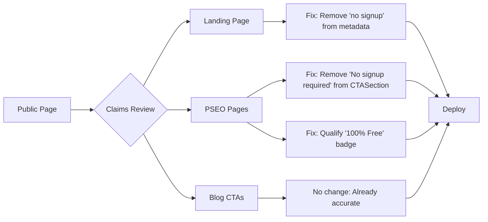
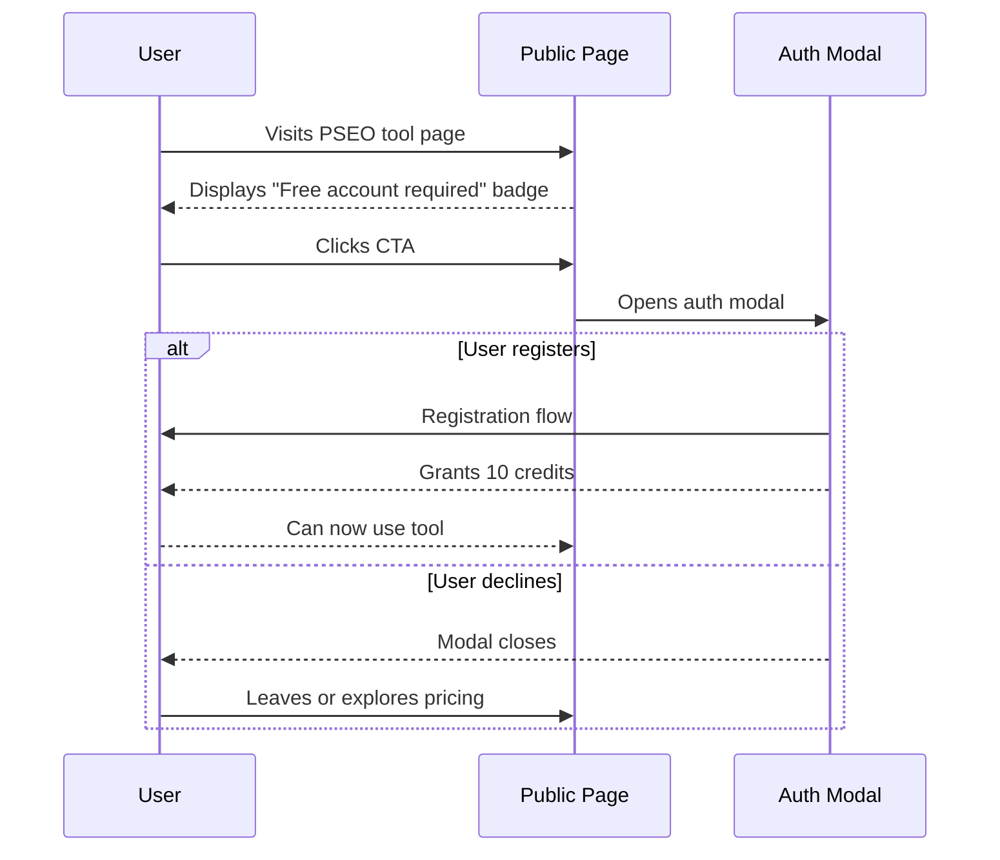

# False Claims Audit & Remediation PRD

## 1. Context Analysis

### 1.1 Files Analyzed

| File Path                                                     | Audit Status | Issue Severity |
| ------------------------------------------------------------- | ------------ | -------------- |
| `/app/(pseo)/_components/pseo/sections/CTASection.tsx`        | FALSE CLAIM  | CRITICAL       |
| `/app/page.tsx`                                               | FALSE CLAIM  | CRITICAL       |
| `/app/(pseo)/free/page.tsx`                                   | MISLEADING   | HIGH           |
| `/app/(pseo)/_components/pseo/templates/FreePageTemplate.tsx` | MISLEADING   | HIGH           |
| `/client/components/pages/HomePageClient.tsx`                 | ACCURATE     | N/A            |
| `/app/pricing/PricingPageClient.tsx`                          | ACCURATE     | N/A            |
| `/client/components/blog/BlogCTA.tsx`                         | ACCURATE     | N/A            |

### 1.2 Component & Dependency Overview

```mermaid
graph TD
    A[Public Pages] --> B[Landing: app/page.tsx]
    A --> C[PSEO Free Tools: app/(pseo)/free/]
    A --> D[Blog: app/blog/]
    A --> E[Pricing: app/pricing/]

    B --> F[HomePageClient]
    C --> G[CTASection]
    C --> H[FreePageTemplate]

    G --> I["Claim: 'No signup required'"]
    F --> J["Claim: '10 free credits, no signup'"]
    H --> K["Claim: '100% Free' badge"]

    I -.-> L[Auth Required]
    J -.-> L
    K -.-> L
```

### 1.3 Current Behavior Summary

- **Actual behavior**: Users MUST create an account to access any image processing features
- **Claimed behavior**: "No signup required" appears on PSEO CTAs; homepage metadata says "no signup"
- **Free tier reality**: 10 one-time credits after account creation; NOT unlimited free access
- **"100% Free" badge**: Displayed prominently on free tool pages without qualifying that account is required

### 1.4 Problem Statement

Public-facing pages contain verifiably false claims ("No signup required") and misleading messaging ("100% Free" without qualification) that misrepresent the actual requirement of account creation for service access.

**Actual Free Tier Constraints** (from `docs/CURRENT-FEATURES.md`):

- 10 credits **total** (no monthly refresh)
- Only Quick & Face Restore quality tiers
- 1 image per batch limit
- 5MB file size limit

**What Users See vs. Reality:**
| Claim | Reality |
|-------|----------|
| "No signup required" | Account creation is MANDATORY |
| "100% Free" badge | Only 10 credits total, then payment required |
| "Free to use" | Heavily limited features and quantity |

---

## 2. Proposed Solution

### 2.1 Architecture Summary

- **Replace false claims** with accurate language across all public pages
- **Add clear qualification** to "free" messaging indicating account requirement
- **Standardize trust indicators** across all components to ensure consistency
- **Maintain conversion intent** while being truthful about signup requirements

**Rejected alternatives:**

- Removing all "free" messaging → Would harm SEO and conversion rates unnecessarily
- Adding asterisks with fine print → Still misleading; users should know requirements upfront
- Changing auth flow to allow guest access → Major architectural change; out of scope

### 2.2 Architecture Diagram



### 2.3 Key Technical Decisions

| Decision                        | Rationale                                      |
| ------------------------------- | ---------------------------------------------- |
| String replacement in metadata  | Direct fix; no component changes needed        |
| Trust indicator rewording       | Maintains visual layout while correcting claim |
| "100% Free" badge qualification | Preserves SEO value while being truthful       |
| No new components               | DRY principle; reuse existing patterns         |

### 2.4 Data Model Changes

**No Data Changes.** This is a copy/text fix only.

---

## 2.5 Runtime Execution Flow



---

## 3. Detailed Implementation Spec

### A. `/app/(pseo)/_components/pseo/sections/CTASection.tsx`

**Changes Needed:**

- Replace "No signup required" with "Free account required"

**Pseudo-code:**

```tsx
// Line 108 - OLD:
<span>No signup required</span>

// Line 108 - NEW:
<span>Free account required</span>
```

**Justification:** This component is used across ALL PSEO pages. The current claim is verifiably false.

---

### B. `/app/page.tsx`

**Changes Needed:**

- Remove "no signup" from metadata description

**Pseudo-code:**

```tsx
// Line 10 - OLD:
description: 'Free AI image enhancer that upscales photos to 4K without blur. Enhance image quality online in seconds—keeps text sharp. 10 free credits, no signup.';

// Line 10 - NEW:
description: 'Free AI image enhancer that upscales photos to 4K without blur. Enhance image quality online in seconds—keeps text sharp. 10 free credits to start.';
```

**Justification:** Metadata affects SEO and social sharing. "No signup" is false and harms trust.

---

### C. `/app/(pseo)/free/page.tsx`

**Changes Needed:**

- Qualify the "no credit card required" claim with account requirement

**Pseudo-code:**

```tsx
// Line 13-15 - OLD:
<p className="text-xl text-text-secondary mb-12">
  Professional AI tools - Free to use, no credit card required
</p>

// Line 13-15 - NEW:
<p className="text-xl text-text-secondary mb-12">
  Professional AI tools - Free to try with 10 credits, no credit card required
</p>
```

**Justification:** Adds necessary qualification about the 10-credit limit.

---

### D. `/app/(pseo)/_components/pseo/templates/FreePageTemplate.tsx`

**Changes Needed:**

- Qualify the "100% Free" badge to indicate it's a free tier, not unlimited free access

**Pseudo-code:**

```tsx
// Lines 73-78 - OLD:
<span className="inline-flex items-center gap-1.5 px-3 py-1.5 bg-surface-light text-success text-sm font-semibold rounded-full">
  <Sparkles className="w-4 h-4" />
  100% Free
</span>

// Lines 73-78 - NEW:
<span className="inline-flex items-center gap-1.5 px-3 py-1.5 bg-surface-light text-success text-sm font-semibold rounded-full">
  <Sparkles className="w-4 h-4" />
  Free Plan Available
</span>
```

**Justification:** "100% Free" implies unlimited access. "Free Plan Available" is accurate while still attractive.

---

## 4. Step-by-Step Execution Plan

### Phase 1: Critical False Claims (Do First)

- [ ] Fix CTASection.tsx: Replace "No signup required" → "Free account required"
- [ ] Fix app/page.tsx metadata: Remove ", no signup" from description
- [ ] Build and verify changes compile

### Phase 2: Misleading Free Tool Messaging

- [ ] Fix free hub page: Qualify "Free to use" → "Free to try with 10 credits"
- [ ] Fix FreePageTemplate: Change "100% Free" → "Free Plan Available"
- [ ] Update trust indicators if needed

### Phase 3: Verification

- [ ] Run `yarn verify` to catch any issues
- [ ] Manual QA of all PSEO pages
- [ ] Check social share preview for homepage

---

## 5. Testing Strategy

### Unit Tests

Not applicable - these are text/string changes.

### Integration Tests

- [ ] Verify PSEO pages render without errors
- [ ] Verify homepage metadata is correctly set
- [ ] Verify auth modal still opens on CTA click

### Edge Cases

| Scenario                               | Expected Behavior                |
| -------------------------------------- | -------------------------------- |
| User visits PSEO page                  | Page renders with corrected text |
| User shares homepage on social media   | Correct description displayed    |
| User searches for "no signup required" | No results from this site        |
| SEO crawler accesses metadata          | Accurate description returned    |

---

## 6. Acceptance Criteria

- [ ] All instances of "No signup required" removed from codebase
- [ ] Homepage metadata no longer claims "no signup"
- [ ] "100% Free" badge replaced or qualified
- [ ] Free tool hub page qualifies the "free" claim
- [ ] Build succeeds with no errors
- [ ] `yarn verify` passes
- [ ] Manual QA confirms all public-facing claims are accurate

---

## 7. Verification & Rollback

### Success Criteria

- No false claims remain in production
- User perception: Honest about signup requirement
- SEO impact: Minimal (improved trust outweighs keyword change)

### Rollback Plan

- Git revert of specific commit(s)
- No database or infrastructure changes involved
- Safe to deploy and rollback if needed

---

## 8. Summary of Changes

| File                   | Change                                         | Lines |
| ---------------------- | ---------------------------------------------- | ----- |
| `CTASection.tsx`       | "No signup required" → "Free account required" | 108   |
| `app/page.tsx`         | Remove ", no signup" from metadata             | 10    |
| `free/page.tsx`        | Add "to try with 10 credits" qualification     | 14    |
| `FreePageTemplate.tsx` | "100% Free" → "Free Plan Available"            | 76    |

---

## Anti-Patterns Avoided

- ❌ Over-engineering with new components or abstractions
- ❌ Adding asterisks/fine print instead of fixing the claim
- ❌ Changing business logic or auth flow
- ❌ Rewriting entire sections when string replacement suffices

---

## Appendices

### A. Additional Files Checked (No Changes Needed)

- `/client/components/pages/HomePageClient.tsx` - Claims are accurate
- `/app/pricing/PricingPageClient.tsx` - Claims are accurate
- `/client/components/blog/BlogCTA.tsx` - Claims are accurate

### B. SEO Considerations

The term "no signup" may have some SEO value, but maintaining false claims is:

1. A legal liability (FTC guidelines on deceptive marketing)
2. Damaging to brand trust
3. Against our engineering principles (honesty/integrity)

**Recommendation:** Accept minor SEO impact for long-term trust and compliance.
