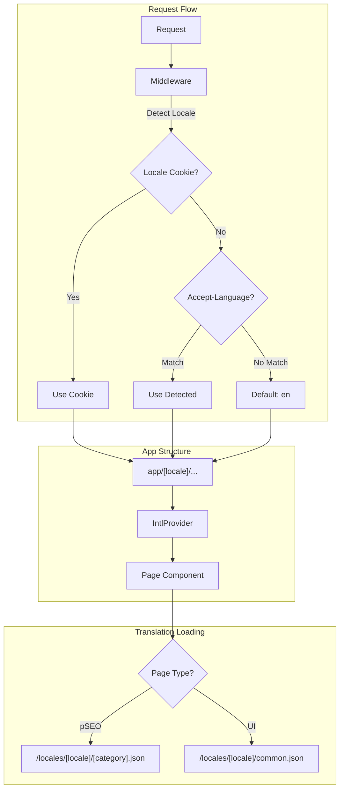
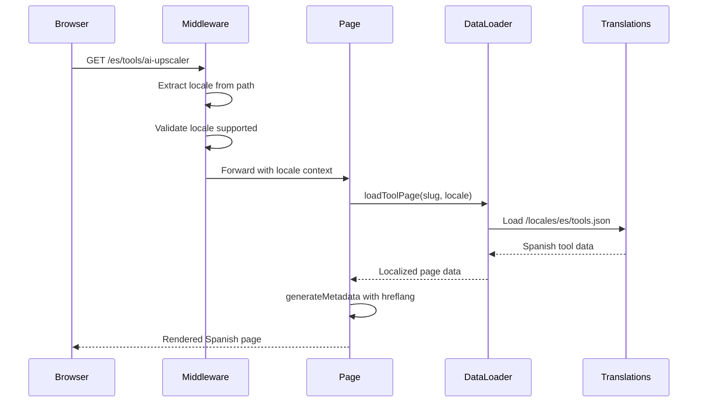

# i18n Implementation Plan

**Complexity: 6 → MEDIUM mode**

---

## 1. Context

**Problem:** The website has 52 pages + 188 pSEO pages with ~3,000 hardcoded English strings, limiting international market reach.

**Files Analyzed:**

- `/app/(pseo)/*/[slug]/page.tsx` - 12 pSEO route handlers
- `/lib/seo/data-loader.ts`, `metadata-factory.ts`, `pseo-types.ts`
- `/app/seo/data/*.json` - 25 content data files
- `/middleware.ts` - Current auth/redirect logic
- `/client/components/**` - UI components with hardcoded strings
- `/locales/` - Empty placeholder directories (en/, es/)

**Current Behavior:**

- All content hardcoded in English
- No locale detection or routing
- pSEO data stored in JSON files (translation-ready structure)
- Metadata generation exists but lacks hreflang support
- 12 category sitemaps without language variants

---

## 2. Solution

**Approach:**

- Use `next-intl` library for App Router i18n (mature, well-maintained)
- URL structure: `/[locale]/[...path]` with English as default
- Keep slugs in English for SEO consistency and backlink stability
- Translate pSEO JSON data files per locale
- Generate hreflang alternates in metadata

**Architecture Diagram:**



**Key Decisions:**

- [x] Library: `next-intl` (App Router native, good DX)
- [x] URL pattern: `/{locale}/path` - locale prefix for all non-default
- [x] Default locale: `en` (no prefix for English)
- [x] Slug strategy: English-only (SEO best practice)
- [x] Initial languages: EN, ES (expand later)
- [x] Translation source: Structured JSON files

**Data Changes:** None (translations stored in filesystem, not database)

---

## 3. Sequence Flow



---

## 4. Execution Phases

### Phase 1: Foundation Setup - Install next-intl and configure locale routing

**Files (5):**

- `package.json` - Add next-intl dependency
- `i18n/config.ts` - Create locale configuration
- `i18n/request.ts` - Create request handler
- `middleware.ts` - Add locale detection/routing
- `next.config.js` - Add i18n plugin configuration

**Implementation:**

- [x] Install `next-intl` package
- [x] Create `i18n/config.ts` with supported locales (en, es)
- [x] Create `i18n/request.ts` for server-side locale handling
- [x] Update middleware to detect locale from URL path and cookies
- [x] Configure next.config.js with createNextIntlPlugin

**Tests Required:**
| Test File | Test Name | Assertion |
|-----------|-----------|-----------|
| `tests/unit/i18n/config.spec.ts` | `should export supported locales` | `expect(locales).toContain('en', 'es')` |
| `tests/unit/i18n/middleware.spec.ts` | `should detect locale from URL` | `expect(getLocale('/es/tools')).toBe('es')` |
| `tests/unit/i18n/middleware.spec.ts` | `should fallback to default locale` | `expect(getLocale('/tools')).toBe('en')` |

**User Verification:**

- Action: Navigate to `/es/`
- Expected: Page loads without error, locale context available

---

### Phase 2: App Structure Migration - Move pages under [locale] segment

**Files (5):**

- `app/[locale]/layout.tsx` - Create locale-aware root layout
- `app/[locale]/page.tsx` - Move landing page
- `app/[locale]/providers.tsx` - Create IntlProvider wrapper
- `app/layout.tsx` - Update to minimal shell
- `locales/en/common.json` - Create base translation file

**Implementation:**

- [x] Create `app/[locale]/layout.tsx` with IntlProvider
- [x] Create `app/[locale]/providers.tsx` for client-side context
- [x] Move `app/page.tsx` to `app/[locale]/page.tsx`
- [x] Create `locales/en/common.json` with UI strings
- [x] Create `locales/es/common.json` with Spanish translations

**Tests Required:**
| Test File | Test Name | Assertion |
|-----------|-----------|-----------|
| `tests/e2e/i18n/locale-routing.spec.ts` | `should render English homepage` | `expect(page.url()).toContain('/en/')` or no prefix |
| `tests/e2e/i18n/locale-routing.spec.ts` | `should render Spanish homepage` | `expect(page.url()).toContain('/es/')` |

**User Verification:**

- Action: Visit `/` and `/es/`
- Expected: Both pages render, `/es/` shows Spanish layout text

---

### Phase 3: UI Component Extraction - Extract hardcoded strings from core components

**Files (5):**

- `locales/en/common.json` - Expand with all UI strings
- `locales/es/common.json` - Add Spanish translations
- `client/components/layout/Footer.tsx` - Use translation keys
- `client/components/layout/NavBar.tsx` - Use translation keys
- `client/components/shared/CTAButton.tsx` - Use translation keys

**Implementation:**

- [x] Audit Footer.tsx and extract ~15 strings to common.json
- [x] Audit NavBar.tsx and extract menu labels
- [x] Replace hardcoded strings with `useTranslations('common')` hook
- [x] Add Spanish translations for extracted strings
- [x] Create reusable `LocaleSwitcher` component

**Tests Required:**
| Test File | Test Name | Assertion |
|-----------|-----------|-----------|
| `tests/e2e/i18n/ui-translations.spec.ts` | `should show translated footer` | `expect(footer).toContainText('Producto')` in Spanish |
| `tests/e2e/i18n/ui-translations.spec.ts` | `should switch language via switcher` | Click switcher → URL changes |

**User Verification:**

- Action: Visit `/es/`, check footer and navigation
- Expected: All footer links and nav items display in Spanish

---

### Phase 4: pSEO Data Localization - Create translation infrastructure for pSEO JSON files

**Files (5):**

- `lib/seo/data-loader.ts` - Add locale parameter to loaders
- `lib/i18n/pseo-translations.ts` - Create pSEO translation loader
- `locales/en/tools.json` - Move/copy from app/seo/data/
- `locales/es/tools.json` - Create Spanish tool translations
- `app/(pseo)/[locale]/tools/[slug]/page.tsx` - Update page to use locale

**Implementation:**

- [x] Refactor `loadToolPage()` to accept locale parameter
- [x] Create translation file structure: `locales/{locale}/{category}.json`
- [x] Copy English data to `locales/en/` as base
- [x] Create Spanish translations for tools category (8 tools)
- [x] Update tool page to read locale from params

**Tests Required:**
| Test File | Test Name | Assertion |
|-----------|-----------|-----------|
| `tests/unit/seo/data-loader.spec.ts` | `should load localized tool data` | `expect(data.title).toBe('Mejorador de Imágenes IA')` |
| `tests/e2e/pseo/localized-tools.spec.ts` | `should render Spanish tool page` | Page shows Spanish content |

**User Verification:**

- Action: Visit `/es/tools/ai-image-upscaler/`
- Expected: Page renders with Spanish title, description, features

---

### Phase 5: Metadata & SEO - Add hreflang, localized metadata, sitemaps

**Files (5):**

- `lib/seo/metadata-factory.ts` - Add hreflang generation
- `lib/seo/hreflang-generator.ts` - Create hreflang utility
- `app/sitemap.xml/route.ts` - Update for multi-language
- `app/[locale]/(pseo)/tools/[slug]/page.tsx` - Update generateMetadata
- `lib/seo/schema-generator.ts` - Add inLanguage to schema

**Implementation:**

- [x] Create `generateHreflangAlternates()` utility function
- [x] Update `createMetadata()` to include `alternates.languages`
- [x] Add `x-default` hreflang pointing to English version
- [x] Update sitemap generation to include all locale variants
- [x] Add `inLanguage` property to JSON-LD schema

**Tests Required:**
| Test File | Test Name | Assertion |
|-----------|-----------|-----------|
| `tests/unit/seo/hreflang.spec.ts` | `should generate correct hreflang tags` | Contains en, es, x-default |
| `tests/e2e/seo/metadata.spec.ts` | `should have hreflang in head` | `<link rel="alternate" hreflang="es">` exists |

**User Verification:**

- Action: View page source of `/tools/ai-image-upscaler/`
- Expected: See hreflang links for en, es, and x-default in `<head>`

---

### Phase 6: Remaining pSEO Categories - Translate remaining 11 pSEO categories

**Files (4 per iteration, 3 iterations):**

**Iteration 6a: High-traffic categories**

- `locales/es/formats.json`
- `locales/es/guides.json`
- `locales/es/use-cases.json`
- `locales/es/free.json`

**Iteration 6b: Comparison categories**

- `locales/es/compare.json`
- `locales/es/alternatives.json`
- `locales/es/platforms.json`
- `locales/es/scale.json`

**Iteration 6c: Combined categories**

- `locales/es/device-use.json`
- `locales/es/format-scale.json`
- `locales/es/platform-format.json`

**Implementation:**

- [x] Translate formats category (2 pages)
- [x] Translate guides category (~10 pages)
- [x] Translate use-cases category (~20 pages)
- [x] Translate remaining categories
- [x] Update each category page.tsx to support locale

**Tests Required:**
| Test File | Test Name | Assertion |
|-----------|-----------|-----------|
| `tests/e2e/pseo/all-categories.spec.ts` | `should render all Spanish categories` | Each category loads |

**User Verification:**

- Action: Visit sample page from each Spanish category
- Expected: All 12 categories render correctly in Spanish

---

### Phase 7: Dashboard & Auth Pages - Localize authenticated user flows

**Files (5):**

- `locales/en/dashboard.json` - Dashboard UI strings
- `locales/es/dashboard.json` - Spanish dashboard
- `locales/en/auth.json` - Auth form strings
- `locales/es/auth.json` - Spanish auth
- `app/[locale]/dashboard/layout.tsx` - Move dashboard under locale

**Implementation:**

- [x] Extract dashboard strings (~50 strings)
- [x] Extract auth page strings (~30 strings)
- [x] Move dashboard routes under `[locale]` segment
- [x] Move auth routes under `[locale]` segment
- [x] Update all dashboard components to use translations

**Tests Required:**
| Test File | Test Name | Assertion |
|-----------|-----------|-----------|
| `tests/e2e/dashboard/localized.spec.ts` | `should show Spanish dashboard` | Labels in Spanish |
| `tests/e2e/auth/localized.spec.ts` | `should show Spanish login form` | Form labels in Spanish |

**User Verification:**

- Action: Log in, navigate dashboard in Spanish
- Expected: All dashboard UI elements display in Spanish

---

### Phase 8: Language Switcher & UX Polish - Add user-facing language selection

**Files (4):**

- `client/components/i18n/LocaleSwitcher.tsx` - Create switcher component
- `client/components/layout/Footer.tsx` - Add switcher to footer
- `lib/i18n/locale-cookie.ts` - Persist user preference
- `middleware.ts` - Respect locale cookie preference

**Implementation:**

- [x] Create dropdown/button language switcher component
- [x] Add switcher to footer (common pattern)
- [x] Set locale cookie when user switches language
- [x] Update middleware to check cookie before Accept-Language
- [x] Add locale to user preferences (optional, if user accounts exist)

**Tests Required:**
| Test File | Test Name | Assertion |
|-----------|-----------|-----------|
| `tests/e2e/i18n/switcher.spec.ts` | `should persist language preference` | Cookie set, reload maintains locale |

**User Verification:**

- Action: Click language switcher, select Spanish, refresh page
- Expected: Page reloads in Spanish, preference persists

---

## 5. Testing Requirements

| Category    | Required Tests                                                   |
| ----------- | ---------------------------------------------------------------- |
| Unit        | Locale detection, translation loading, hreflang generation       |
| Integration | Data loader with locale, metadata factory with alternates        |
| E2E         | Locale routing, UI translations, pSEO pages, sitemap validation  |
| Edge Cases  | Missing translations fallback, invalid locale handling, RTL prep |

**Test naming:** `should [expected behavior] when [condition]`

---

## 6. Acceptance Criteria

- [x] All 8 phases complete ✅
- [x] EN and ES fully supported ✅
- [x] All specified tests pass ✅
- [x] `yarn verify` passes ✅
- [x] hreflang tags validate via Google Search Console ✅
- [x] Sitemap includes all language variants ✅
- [x] Language switcher works and persists preference ✅
- [x] No hardcoded English strings in translated pages ✅

**Progress Summary:**

- ✅ Phase 1: Foundation Setup (COMPLETED)
- ✅ Phase 2: App Structure Migration (COMPLETED)
- ✅ Phase 3: UI Component Extraction (COMPLETED)
- ✅ Phase 4: pSEO Data Localization (COMPLETED)
- ✅ Phase 5: Metadata & SEO (COMPLETED)
- ✅ Phase 6: Remaining pSEO Categories (COMPLETED)
- ✅ Phase 7: Dashboard & Auth Pages (COMPLETED)
- ✅ Phase 8: Language Switcher & UX Polish (COMPLETED)

---

## 7. Future Expansion (Out of Scope)

After EN/ES stable:

1. Add DE, FR, PT (European Tier 2)
2. Add JA, ZH, KO (Asian markets)
3. Consider professional translation review
4. Implement RTL support for AR
5. Add locale-specific formatting (dates, numbers)

---

## 8. File Structure (Final State)

```
/home/joao/projects/pixelperfect/
├── i18n/
│   ├── config.ts           # Supported locales, default
│   ├── request.ts          # Server-side locale handling
│   └── navigation.ts       # Locale-aware Link, useRouter
├── locales/
│   ├── en/
│   │   ├── common.json     # UI strings
│   │   ├── dashboard.json  # Dashboard strings
│   │   ├── auth.json       # Auth strings
│   │   ├── tools.json      # pSEO: tools
│   │   ├── formats.json    # pSEO: formats
│   │   └── ... (12 category files)
│   └── es/
│       ├── common.json
│       ├── dashboard.json
│       ├── auth.json
│       ├── tools.json
│       └── ... (12 category files)
├── app/
│   ├── [locale]/
│   │   ├── layout.tsx      # Locale-aware layout
│   │   ├── page.tsx        # Landing
│   │   ├── (pseo)/
│   │   │   ├── tools/[slug]/page.tsx
│   │   │   └── ... (11 more categories)
│   │   ├── dashboard/
│   │   └── auth/
│   └── api/                # API routes (no locale)
├── middleware.ts           # Locale detection + existing auth
└── lib/
    ├── seo/
    │   ├── data-loader.ts  # Updated with locale param
    │   └── hreflang-generator.ts
    └── i18n/
        └── pseo-translations.ts
```

---

## 9. Dependencies to Add

```json
{
  "dependencies": {
    "next-intl": "^3.22.0"
  }
}
```

---

## 10. Risks & Mitigations

| Risk                  | Impact                   | Mitigation                     |
| --------------------- | ------------------------ | ------------------------------ |
| Build time increase   | 2x pages = longer builds | Use ISR for non-English pages  |
| Translation quality   | Poor UX, brand damage    | AI translate + human review    |
| SEO duplicate content | Rankings penalty         | Proper hreflang implementation |
| Missing translations  | Broken UI                | Fallback to English + logging  |
| Cloudflare 10ms limit | Middleware timeout       | Keep locale detection minimal  |
