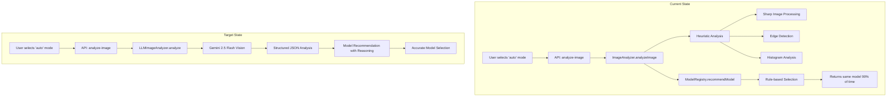
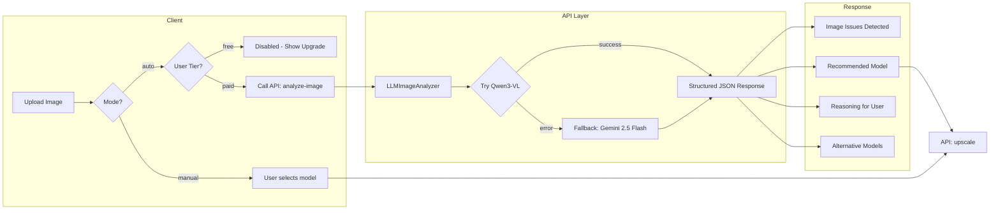
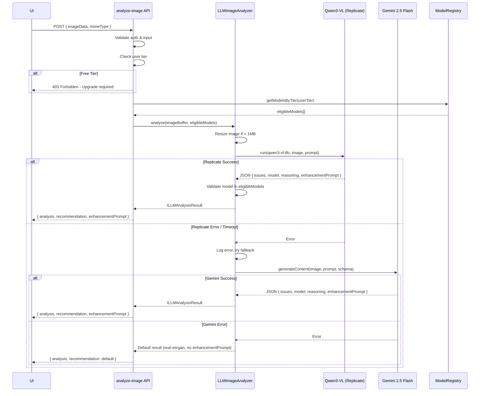
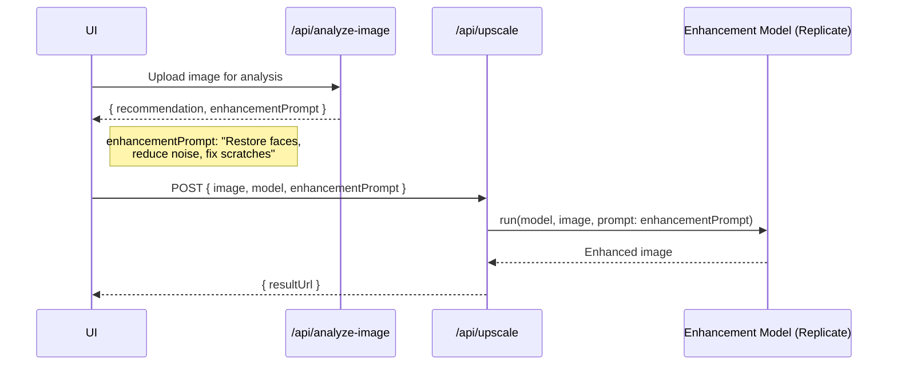

# PRD: LLM-Based Image Analysis for Auto Model Selection

**Version**: 1.0
**Last Updated**: December 2025
**Status**: Draft
**Author**: Engineering Team

---

## 1. Context Analysis

### 1.1 Files Analyzed

- `/server/services/image-analyzer.ts` (945 lines - to be replaced)
- `/server/services/image-analyzer.types.ts`
- `/server/services/model-registry.ts`
- `/server/services/model-registry.types.ts`
- `/server/services/image-generation.service.ts`
- `/app/api/analyze-image/route.ts`
- `/shared/config/env.ts`
- `/docs/PRDs/multi-model-architecture.md`

### 1.2 Component & Dependency Overview



### 1.3 Current Behavior Summary

- `ImageAnalyzer` class uses Sharp library for heuristic-based image analysis (blur, noise, compression artifacts)
- Analysis takes ~150-500ms using CPU-intensive convolutions and histogram calculations
- Rule-based model selection in `ModelRegistry.recommendModel()` applies simple thresholds:
  - `damageLevel > 0.7` -> nano-banana-pro
  - `faceCount > 0` -> gfpgan
  - `noiseLevel > 0.5` -> clarity-upscaler
  - Default -> real-esrgan
- Results are often inaccurate - the heuristics don't reliably detect image issues
- Most images get `real-esrgan` regardless of actual content

### 1.4 Problem Statement

The current heuristic-based image analyzer produces unreliable results, causing the "auto" model selection to default to `real-esrgan` in ~90% of cases, missing opportunities to recommend better-suited models for damaged photos, portraits, or text-heavy images.

---

## 2. Proposed Solution

### 2.1 Architecture Summary

- **Replace heuristic analysis with LLM vision**: Use Qwen3-VL-8B on Replicate (paid plans) with Gemini 2.5 Flash fallback
- **Tiered provider strategy**: Paid users get Replicate's Qwen3-VL for higher quality; Gemini serves as fallback on errors
- **Return actionable insights**: The LLM provides specific issues found (blur, damage, faces, text) with confidence scores
- **Model recommendation with reasoning**: LLM selects from available models based on detected issues and provides human-readable explanation
- **Free tier disabled**: Auto mode hidden/disabled for free users - they must manually select a model

**Alternatives Considered:**

| Approach                | Pros                          | Cons                        | Decision              |
| ----------------------- | ----------------------------- | --------------------------- | --------------------- |
| OpenAI GPT-4 Vision     | High quality                  | $0.01/image, no free tier   | Rejected - cost       |
| Claude Vision           | Good reasoning                | $0.01/image, no free tier   | Rejected - cost       |
| Gemini 2.5 Flash        | Free tier (500/day), fast     | Lower quality than Qwen3-VL | **Fallback only**     |
| Qwen3-VL-8B (Replicate) | Excellent quality, fast (~2s) | ~$0.0003/run                | **Primary for paid**  |
| Local ML Models         | No API cost                   | Complex setup, slower       | Rejected - complexity |

### 2.2 Architecture Diagram



### 2.3 Key Technical Decisions

| Decision                      | Choice                             | Rationale                                                           |
| ----------------------------- | ---------------------------------- | ------------------------------------------------------------------- |
| Primary LLM Provider          | Qwen3-VL-8B on Replicate           | Excellent vision quality, fast (~2s), cost-effective (~$0.0003/run) |
| Fallback Provider             | Gemini 2.5 Flash                   | Free tier (500 req/day), reliable fallback on Replicate errors      |
| Response Format               | Structured JSON                    | Type-safe parsing, predictable output                               |
| Fallback on LLM failure       | Default to `real-esrgan`           | Never block user processing                                         |
| Caching                       | None initially                     | Each image is unique; can add later if needed                       |
| Analysis Scope                | Single image per request           | Matches current API contract                                        |
| **Client-side preprocessing** | Resize to 1024px max before upload | Reduces bandwidth, saves server CPU                                 |
| **Tier restriction**          | Paid plans only (hobby+)           | Protects API costs, adds upgrade incentive                          |
| **Free tier**                 | Auto mode disabled/hidden          | No LLM analysis for free users                                      |

### 2.3.1 Tier Restrictions

**"Auto" mode is a paid feature.** Free users see the option as disabled/hidden.

| Tier     | Auto Mode                   | LLM Provider               | Available Models                          |
| -------- | --------------------------- | -------------------------- | ----------------------------------------- |
| Free     | **Disabled** (hidden in UI) | N/A                        | `real-esrgan` only (must select manually) |
| Hobby    | Yes                         | Qwen3-VL → Gemini fallback | `real-esrgan`, `gfpgan`                   |
| Pro      | Yes                         | Qwen3-VL → Gemini fallback | All models                                |
| Business | Yes                         | Qwen3-VL → Gemini fallback | All models                                |

**Implementation:**

- UI: Hide "Auto" option for free users entirely, show upgrade prompt on hover/tooltip
- API: Return 403 with upgrade message if free user calls `/api/analyze-image`
- Free users: Must manually select `real-esrgan` (no analysis available)

### 2.4 Client-Side Preprocessing (NEW)

**Goal:** Offload image resizing from server to browser, reducing worker CPU and bandwidth costs.

**What happens client-side:**

1. **Resize large images** - Max 1024px on longest edge (sufficient for LLM analysis)
2. **Compress to JPEG** - 80% quality, typically 50-200KB
3. **Extract metadata** - Original width, height, file size (sent alongside)

**What stays server-side:**

- Gemini API call (protects API key)
- Model recommendation logic
- Tier validation

```typescript
// client/utils/image-preprocessing.ts

interface IPreprocessedImage {
  /** Base64 image data (resized for analysis) */
  imageData: string;
  /** MIME type (always image/jpeg after preprocessing) */
  mimeType: 'image/jpeg';
  /** Original image metadata */
  original: {
    width: number;
    height: number;
    fileSize: number;
    mimeType: string;
  };
}

const MAX_ANALYSIS_DIMENSION = 1024;
const ANALYSIS_QUALITY = 0.8;

export async function preprocessForAnalysis(file: File): Promise<IPreprocessedImage> {
  return new Promise((resolve, reject) => {
    const img = new Image();
    const canvas = document.createElement('canvas');
    const ctx = canvas.getContext('2d');

    if (!ctx) {
      reject(new Error('Canvas not supported'));
      return;
    }

    img.onload = () => {
      // Calculate resize dimensions (max 1024px on longest edge)
      let { width, height } = img;
      if (width > MAX_ANALYSIS_DIMENSION || height > MAX_ANALYSIS_DIMENSION) {
        const scale = MAX_ANALYSIS_DIMENSION / Math.max(width, height);
        width = Math.round(width * scale);
        height = Math.round(height * scale);
      }

      canvas.width = width;
      canvas.height = height;
      ctx.drawImage(img, 0, 0, width, height);

      // Convert to JPEG for smaller size
      const imageData = canvas.toDataURL('image/jpeg', ANALYSIS_QUALITY);

      resolve({
        imageData,
        mimeType: 'image/jpeg',
        original: {
          width: img.width,
          height: img.height,
          fileSize: file.size,
          mimeType: file.type,
        },
      });
    };

    img.onerror = () => reject(new Error('Failed to load image'));
    img.src = URL.createObjectURL(file);
  });
}
```

**Benefits:**

| Metric                 | Before (server resize) | After (client resize) |
| ---------------------- | ---------------------- | --------------------- |
| Upload size (4K image) | ~8MB                   | ~100KB                |
| Server CPU per request | 200-500ms resize       | 0ms                   |
| Bandwidth cost         | High                   | Minimal               |
| User-perceived latency | Upload + resize + LLM  | Upload + LLM          |

**Security:** Safe because:

- Original metadata is informational only (not trusted for billing/auth)
- LLM analyzes the actual pixels received
- API key stays server-side
- No security decisions depend on client-reported dimensions

### 2.5 Data Model Changes

**No Database Changes Required**

The analysis is stateless and returned directly to the client. No new tables or migrations needed.

**New TypeScript Types:**

```typescript
// server/services/llm-image-analyzer.types.ts

interface ILLMAnalysisResult {
  /** Detected issues in the image */
  issues: IDetectedIssue[];

  /** Content classification */
  contentType: 'photo' | 'portrait' | 'document' | 'vintage' | 'product' | 'artwork';

  /** Recommended model ID */
  recommendedModel: ModelId;

  /** Human-readable explanation for the recommendation */
  reasoning: string;

  /** Confidence in recommendation (0-1) */
  confidence: number;

  /** Alternative models that could work */
  alternatives: ModelId[];

  /**
   * Enhancement prompt to pass to the image enhancement model.
   * Describes specific fixes to apply (e.g., "restore faces, reduce noise, fix scratches").
   * Generated by the VL model based on detected issues.
   */
  enhancementPrompt: string;

  /** Which provider was used for analysis */
  provider: 'replicate' | 'gemini' | 'fallback';

  /** Raw LLM response for debugging */
  _raw?: unknown;
}

interface IDetectedIssue {
  type: 'blur' | 'noise' | 'compression' | 'damage' | 'low_resolution' | 'faces' | 'text';
  severity: 'low' | 'medium' | 'high';
  description: string;
}

type ModelId = 'real-esrgan' | 'gfpgan' | 'nano-banana' | 'clarity-upscaler' | 'nano-banana-pro';
```

---

### 2.6 Runtime Execution Flow



### 2.7 Enhancement Prompt Flow

**Key Feature:** The VL model generates an `enhancementPrompt` describing what to fix. This prompt is passed to the enhancement model for better results.



---

## 3. Detailed Implementation Spec

### A. `server/services/llm-image-analyzer.ts` (NEW)

**Purpose:** Replace heuristic-based analyzer with LLM vision analysis using Replicate (primary) + Gemini (fallback).

```typescript
// server/services/llm-image-analyzer.ts

import Replicate from 'replicate';
import { GoogleGenAI, Type } from '@google/genai';
import { serverEnv } from '@shared/config/env';
import type { ILLMAnalysisResult, IDetectedIssue } from './llm-image-analyzer.types';
import type { ModelId } from '@shared/types/pixelperfect';

const QWEN_MODEL =
  'lucataco/qwen3-vl-8b-instruct:39e893666996acf464cff75688ad49ac95ef54e9f1c688fbc677330acc478e11';

const ANALYSIS_PROMPT = `You are an image quality analyst for a photo restoration service. Analyze this image and determine what improvements it needs.

Available restoration models:
- real-esrgan: Fast general upscaling. Best for clean images needing higher resolution.
- gfpgan: Face restoration specialist. Best for portraits, old family photos, images with faces.
- nano-banana: Text and logo preservation. Best for documents, screenshots, images with text.
- clarity-upscaler: High-quality upscaling with detail enhancement. Best for photos with moderate noise.
- nano-banana-pro: Premium heavy restoration. Best for severely damaged, very old, or heavily degraded images.

Analyze the image and respond with ONLY valid JSON (no markdown, no explanation):
{
  "issues": [{ "type": "blur|noise|compression|damage|low_resolution|faces|text", "severity": "low|medium|high", "description": "..." }],
  "contentType": "photo|portrait|document|vintage|product|artwork",
  "recommendedModel": "model-id",
  "reasoning": "Brief explanation",
  "confidence": 0.0-1.0,
  "alternatives": ["model-id", ...],
  "enhancementPrompt": "Specific instructions for the enhancement model, e.g., 'Restore facial details, reduce film grain, fix scratches on upper left'"
}

The enhancementPrompt should be a detailed instruction for the restoration model describing exactly what to fix.
Prioritize accuracy over complexity - if a simple upscale will suffice, recommend real-esrgan.`;

const GEMINI_RESPONSE_SCHEMA = {
  type: Type.OBJECT,
  properties: {
    issues: {
      type: Type.ARRAY,
      items: {
        type: Type.OBJECT,
        properties: {
          type: {
            type: Type.STRING,
            enum: ['blur', 'noise', 'compression', 'damage', 'low_resolution', 'faces', 'text'],
          },
          severity: { type: Type.STRING, enum: ['low', 'medium', 'high'] },
          description: { type: Type.STRING },
        },
        required: ['type', 'severity', 'description'],
      },
    },
    contentType: {
      type: Type.STRING,
      enum: ['photo', 'portrait', 'document', 'vintage', 'product', 'artwork'],
    },
    recommendedModel: {
      type: Type.STRING,
      enum: ['real-esrgan', 'gfpgan', 'nano-banana', 'clarity-upscaler', 'nano-banana-pro'],
    },
    reasoning: { type: Type.STRING },
    confidence: { type: Type.NUMBER },
    alternatives: {
      type: Type.ARRAY,
      items: {
        type: Type.STRING,
        enum: ['real-esrgan', 'gfpgan', 'nano-banana', 'clarity-upscaler', 'nano-banana-pro'],
      },
    },
    enhancementPrompt: { type: Type.STRING },
  },
  required: [
    'issues',
    'contentType',
    'recommendedModel',
    'reasoning',
    'confidence',
    'alternatives',
    'enhancementPrompt',
  ],
};

export class LLMImageAnalyzer {
  private replicate: Replicate;
  private genAI: GoogleGenAI;

  constructor() {
    this.replicate = new Replicate({ auth: serverEnv.REPLICATE_API_TOKEN });
    this.genAI = new GoogleGenAI({ apiKey: serverEnv.GEMINI_API_KEY });
  }

  async analyze(
    imageBuffer: Buffer,
    mimeType: string,
    eligibleModels: ModelId[]
  ): Promise<ILLMAnalysisResult> {
    const startTime = Date.now();
    const base64Image = imageBuffer.toString('base64');
    const dataUrl = `data:${mimeType};base64,${base64Image}`;

    // Try Replicate (Qwen3-VL) first
    try {
      const result = await this.analyzeWithReplicate(dataUrl, eligibleModels);
      return {
        ...result,
        provider: 'replicate',
        processingTimeMs: Date.now() - startTime,
      };
    } catch (replicateError) {
      console.warn('Replicate analysis failed, trying Gemini fallback:', replicateError);

      // Fallback to Gemini
      try {
        const result = await this.analyzeWithGemini(base64Image, mimeType, eligibleModels);
        return {
          ...result,
          provider: 'gemini',
          processingTimeMs: Date.now() - startTime,
        };
      } catch (geminiError) {
        console.error('Both LLM providers failed:', { replicateError, geminiError });
        return {
          ...this.getDefaultResult(eligibleModels),
          provider: 'fallback',
          processingTimeMs: Date.now() - startTime,
        };
      }
    }
  }

  private async analyzeWithReplicate(
    imageDataUrl: string,
    eligibleModels: ModelId[]
  ): Promise<Omit<ILLMAnalysisResult, 'provider' | 'processingTimeMs'>> {
    const output = await this.replicate.run(QWEN_MODEL, {
      input: {
        image: imageDataUrl,
        prompt: ANALYSIS_PROMPT,
        max_tokens: 1024,
        temperature: 0.2,
      },
    });

    // Qwen returns text, parse JSON from response
    const responseText = Array.isArray(output) ? output.join('') : String(output);
    const jsonMatch = responseText.match(/\{[\s\S]*\}/);
    if (!jsonMatch) {
      throw new Error('No JSON found in Replicate response');
    }

    const result = JSON.parse(jsonMatch[0]) as ILLMAnalysisResult;
    return this.validateAndAdjustResult(result, eligibleModels);
  }

  private async analyzeWithGemini(
    base64Image: string,
    mimeType: string,
    eligibleModels: ModelId[]
  ): Promise<Omit<ILLMAnalysisResult, 'provider' | 'processingTimeMs'>> {
    const response = await this.genAI.models.generateContent({
      model: 'gemini-2.5-flash',
      contents: [
        {
          parts: [{ inlineData: { mimeType, data: base64Image } }, { text: ANALYSIS_PROMPT }],
        },
      ],
      config: {
        temperature: 0.2,
        responseMimeType: 'application/json',
        responseSchema: GEMINI_RESPONSE_SCHEMA,
      },
    });

    const result = JSON.parse(response.text) as ILLMAnalysisResult;
    return this.validateAndAdjustResult(result, eligibleModels);
  }

  private validateAndAdjustResult(
    result: ILLMAnalysisResult,
    eligibleModels: ModelId[]
  ): Omit<ILLMAnalysisResult, 'provider' | 'processingTimeMs'> {
    // Validate recommended model is eligible for user's tier
    if (!eligibleModels.includes(result.recommendedModel)) {
      result.recommendedModel = this.findBestEligibleModel(result, eligibleModels);
      result.reasoning += ' (Adjusted for your subscription tier)';
    }

    // Ensure enhancementPrompt exists
    if (!result.enhancementPrompt) {
      result.enhancementPrompt = this.generateDefaultEnhancementPrompt(result);
    }

    return result;
  }

  private findBestEligibleModel(result: ILLMAnalysisResult, eligible: ModelId[]): ModelId {
    for (const alt of result.alternatives || []) {
      if (eligible.includes(alt)) return alt;
    }
    return eligible[0] || 'real-esrgan';
  }

  private generateDefaultEnhancementPrompt(result: ILLMAnalysisResult): string {
    const fixes = result.issues
      .filter(i => i.severity !== 'low')
      .map(i => {
        switch (i.type) {
          case 'blur':
            return 'sharpen and restore detail';
          case 'noise':
            return 'reduce noise while preserving detail';
          case 'damage':
            return 'repair damaged areas';
          case 'faces':
            return 'restore facial features';
          case 'compression':
            return 'remove compression artifacts';
          default:
            return i.description;
        }
      });

    return fixes.length > 0
      ? `Enhance image: ${fixes.join(', ')}`
      : 'Upscale and enhance image quality';
  }

  private getDefaultResult(
    eligible: ModelId[]
  ): Omit<ILLMAnalysisResult, 'provider' | 'processingTimeMs'> {
    return {
      issues: [],
      contentType: 'photo',
      recommendedModel: eligible[0] || 'real-esrgan',
      reasoning: 'Standard upscaling selected (analysis unavailable).',
      confidence: 0.5,
      alternatives: eligible.slice(1, 3),
      enhancementPrompt: 'Upscale and enhance image quality',
    };
  }
}
```

**Justification:**

- **Replicate (Qwen3-VL) as primary**: Higher quality vision analysis, fast (~2s), cost-effective
- **Gemini as fallback**: Free tier provides safety net when Replicate fails
- **Enhancement prompt**: VL model generates specific instructions passed to enhancement model for better results
- **Graceful degradation**: Falls back to default result if both providers fail
- **Tier validation**: Ensures users only get models they have access to

---

### B. `server/services/llm-image-analyzer.types.ts` (NEW)

**Purpose:** Type definitions for LLM analysis results.

```typescript
// server/services/llm-image-analyzer.types.ts

import type { ModelId } from '@shared/types/pixelperfect';

export type IssueType =
  | 'blur'
  | 'noise'
  | 'compression'
  | 'damage'
  | 'low_resolution'
  | 'faces'
  | 'text';
export type IssueSeverity = 'low' | 'medium' | 'high';
export type ContentType = 'photo' | 'portrait' | 'document' | 'vintage' | 'product' | 'artwork';
export type AnalysisProvider = 'replicate' | 'gemini' | 'fallback';

export interface IDetectedIssue {
  type: IssueType;
  severity: IssueSeverity;
  description: string;
}

export interface ILLMAnalysisResult {
  issues: IDetectedIssue[];
  contentType: ContentType;
  recommendedModel: ModelId;
  reasoning: string;
  confidence: number;
  alternatives: ModelId[];
  /** Prompt to pass to enhancement model describing what to fix */
  enhancementPrompt: string;
  /** Which provider was used */
  provider: AnalysisProvider;
  processingTimeMs?: number;
}

export interface ILLMAnalysisConfig {
  maxImageSizeBytes?: number; // Default: 4MB
  timeoutMs?: number; // Default: 10000
}
```

---

### C. `app/api/analyze-image/route.ts` (MODIFY)

**Changes Needed:**

- Replace `ImageAnalyzer` import with `LLMImageAnalyzer`
- Simplify route handler to use new analyzer
- Return `enhancementPrompt` for use by upscale endpoint
- Keep existing auth and validation logic

```typescript
// Key changes in route.ts

import { LLMImageAnalyzer } from '@server/services/llm-image-analyzer';

// In POST handler:
const analyzer = new LLMImageAnalyzer();
const eligibleModels = modelRegistry.getModelsByTier(userTier).map(m => m.id as ModelId);

const result = await analyzer.analyze(imageBuffer, validatedInput.mimeType, eligibleModels);

return NextResponse.json({
  analysis: {
    issues: result.issues,
    contentType: result.contentType,
  },
  recommendation: {
    model: result.recommendedModel,
    reason: result.reasoning,
    creditCost: modelRegistry.calculateCreditCostWithMode(result.recommendedModel, 2, 'upscale'),
    confidence: result.confidence,
    alternativeModel: result.alternatives[0] || null,
    alternativeCost: result.alternatives[0]
      ? modelRegistry.calculateCreditCostWithMode(result.alternatives[0], 2, 'upscale')
      : null,
  },
  // Enhancement prompt to pass to the upscale/enhance endpoint
  enhancementPrompt: result.enhancementPrompt,
  provider: result.provider,
  processingTimeMs: result.processingTimeMs,
});
```

### C.1 `app/api/upscale/route.ts` (MODIFY)

**Changes Needed:**

- Accept optional `enhancementPrompt` parameter
- Pass prompt to enhancement model when provided

```typescript
// Add to request body schema
const requestSchema = z.object({
  // ... existing fields
  enhancementPrompt: z.string().optional(),
});

// In the enhancement call
const enhancementResult = await replicateService.runModel(modelId, {
  image: imageUrl,
  prompt: validatedInput.enhancementPrompt, // Pass the VL-generated prompt
  scale: validatedInput.scale,
});
```

---

### D. Cleanup: Remove Old Analyzer & Sharp Dependencies (DELETE)

**Action:** Delete files and remove dependencies related to the old heuristic analyzer.

**Files to Remove:**

- `server/services/image-analyzer.ts` (~945 lines)
- `server/services/image-analyzer.types.ts` (keep types used elsewhere, move to shared if needed)

**Dependencies to Evaluate for Removal:**

| Package             | Current Use                                                   | Action                           |
| ------------------- | ------------------------------------------------------------- | -------------------------------- |
| `sharp`             | Heuristic image analysis (resize, edge detection, histograms) | **Remove if not used elsewhere** |
| Sharp-related types | Type definitions for Sharp operations                         | Remove with Sharp                |

**Before removing Sharp, verify:**

1. Check if Sharp is used in other parts of the codebase (image resize for thumbnails, etc.)
2. If Sharp is only used by the old analyzer, remove from `package.json`
3. If Sharp is used elsewhere, keep it but remove analyzer-specific code

```bash
# Find all Sharp usages
grep -r "from 'sharp'" --include="*.ts" server/
grep -r "import sharp" --include="*.ts" server/
```

**Justification:**

- The heuristic analysis was unreliable and complex
- LLM-based analysis is more accurate and maintainable
- Reduces codebase by ~1000 lines
- Removing Sharp (if unused) reduces bundle size and native dependencies

---

### E. `shared/config/env.ts` (MODIFY)

**Changes Needed:**

- `GEMINI_API_KEY` already exists
- Add `REPLICATE_API_TOKEN` if not present (likely already exists for image generation)

```typescript
// Verify these exist in serverEnv schema:
REPLICATE_API_TOKEN: z.string().min(1),
GEMINI_API_KEY: z.string().min(1),
```

---

## 4. Step-by-Step Execution Plan

### Phase 1: Create LLM Analyzer (Backend Core)

- [ ] Create `server/services/llm-image-analyzer.types.ts` with type definitions
- [ ] Create `server/services/llm-image-analyzer.ts` with Replicate (Qwen3-VL) + Gemini fallback
- [ ] Add unit tests for `LLMImageAnalyzer` class
- [ ] Test with sample images (portrait, document, damaged photo)
- [ ] Verify `REPLICATE_API_TOKEN` and `GEMINI_API_KEY` are in env schema

### Phase 2: API Integration

- [ ] Update `app/api/analyze-image/route.ts` to use `LLMImageAnalyzer`
- [ ] Add `enhancementPrompt` to API response
- [ ] Update `app/api/upscale/route.ts` to accept and pass `enhancementPrompt`
- [ ] Keep existing test mocking logic for test environment
- [ ] Add integration tests for analyze-image endpoint
- [ ] Verify response format matches existing API contract (+ new fields)

### Phase 3: UI Updates

- [ ] Hide/disable "Auto" mode option for free tier users
- [ ] Add upgrade prompt tooltip for free users hovering over Auto
- [ ] Store and pass `enhancementPrompt` from analysis to upscale request

### Phase 4: Cleanup (Sharp & Old Analyzer)

- [ ] Audit Sharp usage: `grep -r "from 'sharp'" --include="*.ts" server/`
- [ ] Delete `server/services/image-analyzer.ts` (~945 lines)
- [ ] Delete `server/services/image-analyzer.types.ts`
- [ ] Remove `sharp` from `package.json` if not used elsewhere
- [ ] Update any imports that referenced the old analyzer
- [ ] Run `yarn install` to update lockfile

### Phase 5: Testing & Validation

- [ ] Run full E2E test suite
- [ ] Manual testing with various image types
- [ ] Verify auto mode produces varied model recommendations
- [ ] Verify Replicate → Gemini fallback works correctly
- [ ] Verify enhancementPrompt is passed to enhancement models
- [ ] Confirm free users see disabled Auto option

---

## 5. Testing Strategy

### Unit Tests

```typescript
describe('LLMImageAnalyzer', () => {
  it('should return structured analysis for portrait image');
  it('should return structured analysis for damaged photo');
  it('should return structured analysis for document with text');
  it('should use Replicate (Qwen3-VL) as primary provider');
  it('should fall back to Gemini on Replicate API error');
  it('should fall back to default result when both providers fail');
  it('should adjust recommendation if model not in eligible list');
  it('should generate enhancementPrompt based on detected issues');
  it('should handle timeout gracefully');
  it('should report correct provider in result');
});
```

### Integration Tests

```typescript
describe('POST /api/analyze-image', () => {
  it('should return 403 for free tier users');
  it('should return analysis and recommendation for hobby+ users');
  it('should respect user tier for model recommendations');
  it('should return 401 for unauthenticated requests');
  it('should return 400 for invalid image data');
  it('should return enhancementPrompt in response');
  it('should return provider field indicating which LLM was used');
});

describe('POST /api/upscale', () => {
  it('should accept enhancementPrompt parameter');
  it('should pass enhancementPrompt to enhancement model');
  it('should work without enhancementPrompt (backwards compatible)');
});
```

### Edge Cases

| Scenario                             | Expected Behavior                                              |
| ------------------------------------ | -------------------------------------------------------------- |
| Empty image buffer                   | Return validation error                                        |
| Replicate API timeout (>10s)         | Fall back to Gemini                                            |
| Replicate API error                  | Fall back to Gemini                                            |
| Gemini API timeout (>10s)            | Return default result with `real-esrgan`                       |
| Both providers fail                  | Return default result with `real-esrgan`, no enhancementPrompt |
| LLM returns invalid model            | Adjust to best eligible alternative                            |
| **Free tier user calls API**         | Return 403 with upgrade prompt                                 |
| User on hobby tier                   | LLM analysis, recommend from eligible models                   |
| Very large image (>10MB)             | Client-side resize before upload                               |
| Non-image file                       | Return validation error                                        |
| LLM doesn't return enhancementPrompt | Generate default from detected issues                          |

---

## 6. Acceptance Criteria

- [ ] **Free tier users cannot access auto mode** (403 response, Auto option hidden/disabled in UI)
- [ ] Paid users (hobby+) can use auto mode with LLM analysis
- [ ] Auto mode produces varied model recommendations based on image content
- [ ] Portrait images are correctly identified and routed to `gfpgan`
- [ ] Damaged/vintage photos trigger `nano-banana-pro` recommendation (for eligible tiers)
- [ ] Text-heavy images recommend `nano-banana`
- [ ] Analysis completes in <3 seconds for typical images (Replicate ~2s)
- [ ] Replicate (Qwen3-VL) is used as primary provider
- [ ] Graceful fallback to Gemini when Replicate fails
- [ ] Graceful fallback to default (`real-esrgan`) when both providers fail
- [ ] `enhancementPrompt` is returned and passed to enhancement model
- [ ] Response format matches existing API contract (+ new fields, backwards compatible)
- [ ] All existing tests pass after migration
- [ ] Sharp removed from dependencies (if not used elsewhere)

---

## 7. Verification & Rollback

### Success Criteria

| Metric                                 | Target               | Measurement        |
| -------------------------------------- | -------------------- | ------------------ |
| Analysis latency                       | <3s p95              | Baselime APM       |
| Model recommendation diversity         | >4 distinct models   | Analytics tracking |
| LLM error rate                         | <1%                  | Error logs         |
| User satisfaction with recommendations | Qualitative feedback | User interviews    |

### Rollback Plan

1. **Feature Flag**: Add `ENABLE_LLM_ANALYZER=true` env var
2. **Revert Path**: Keep old `image-analyzer.ts` in a `deprecated/` folder for 30 days
3. **Quick Rollback**: Change env var to switch back to heuristic analyzer if issues arise

---

## 8. Cost Analysis

### Primary Provider: Replicate (Qwen3-VL-8B)

| Metric                     | Value                           |
| -------------------------- | ------------------------------- |
| Model                      | `lucataco/qwen3-vl-8b-instruct` |
| Cost per run               | ~$0.0003                        |
| Avg. latency               | ~2 seconds                      |
| Monthly cost (200 req/day) | ~$1.80/month                    |

### Fallback Provider: Gemini 2.5 Flash

| Tier          | Daily Limit  | Monthly Limit    | Cost             |
| ------------- | ------------ | ---------------- | ---------------- |
| Free          | 500 requests | ~15,000 requests | $0               |
| Pay-as-you-go | Unlimited    | Unlimited        | ~$0.0001/request |

**Cost Projection:**

| Scenario              | Monthly Requests | Replicate Cost | Gemini Cost (fallback) | Total   |
| --------------------- | ---------------- | -------------- | ---------------------- | ------- |
| Current (~200/day)    | 6,000            | ~$1.80         | $0 (free tier)         | ~$1.80  |
| Growth (500/day)      | 15,000           | ~$4.50         | $0 (free tier)         | ~$4.50  |
| High usage (1000/day) | 30,000           | ~$9.00         | ~$1.50 (overflow)      | ~$10.50 |

**Notes:**

- Replicate charges only for successful runs
- Gemini fallback is free up to 500/day (sufficient for error cases)
- Free tier users don't use LLM analysis (no cost)

### Code Maintenance

| Metric                | Before                            | After                                |
| --------------------- | --------------------------------- | ------------------------------------ |
| Lines of code         | 945 + 270 = 1,215                 | ~200                                 |
| Cyclomatic complexity | High (nested loops, conditionals) | Low                                  |
| External dependencies | Sharp (heavy native dep)          | Replicate SDK, Gemini SDK (existing) |
| Native binaries       | Sharp requires native builds      | None                                 |

---

## Appendix A: Prompt Engineering Notes

The analysis prompt was designed with these principles:

1. **Explicit Model Descriptions**: The LLM knows what each model is good at
2. **Conservative Recommendation**: Defaults to simpler models when appropriate
3. **Tier-Aware**: System validates LLM output against user's eligible models
4. **Structured Output**: JSON schema ensures parseable, type-safe responses
5. **Enhancement Instructions**: LLM generates specific prompt for the enhancement model

### Sample Prompt Output

```json
{
  "issues": [
    {
      "type": "damage",
      "severity": "high",
      "description": "Visible scratches and tears on photo surface"
    },
    {
      "type": "faces",
      "severity": "medium",
      "description": "Two faces detected, slightly degraded"
    },
    { "type": "noise", "severity": "low", "description": "Minor film grain present" }
  ],
  "contentType": "vintage",
  "recommendedModel": "gfpgan",
  "reasoning": "This appears to be a vintage family photograph with visible damage and faces. GFPGAN specializes in face restoration for old photos and will produce the best result.",
  "confidence": 0.85,
  "alternatives": ["nano-banana-pro", "real-esrgan"],
  "enhancementPrompt": "Restore facial details for the two people in the photograph. Repair visible scratches and tears, particularly in the upper-left corner and along the right edge. Preserve the vintage aesthetic while reducing film grain noise."
}
```

---

_Last Updated: December 2025_
