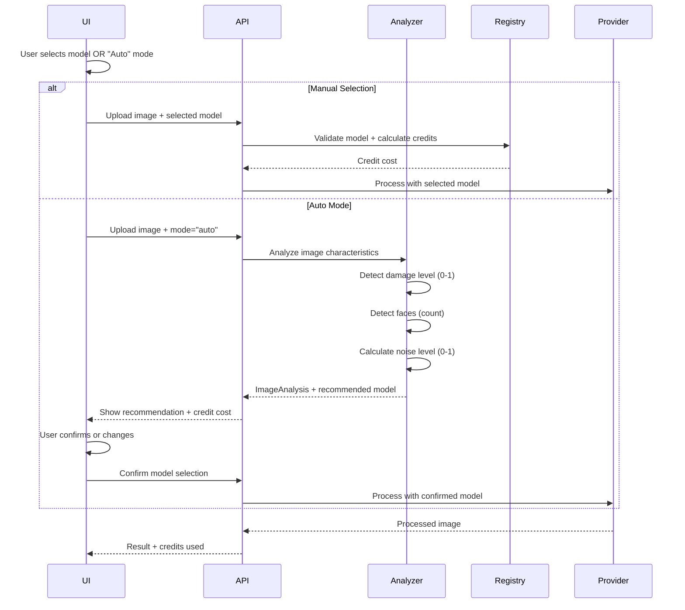
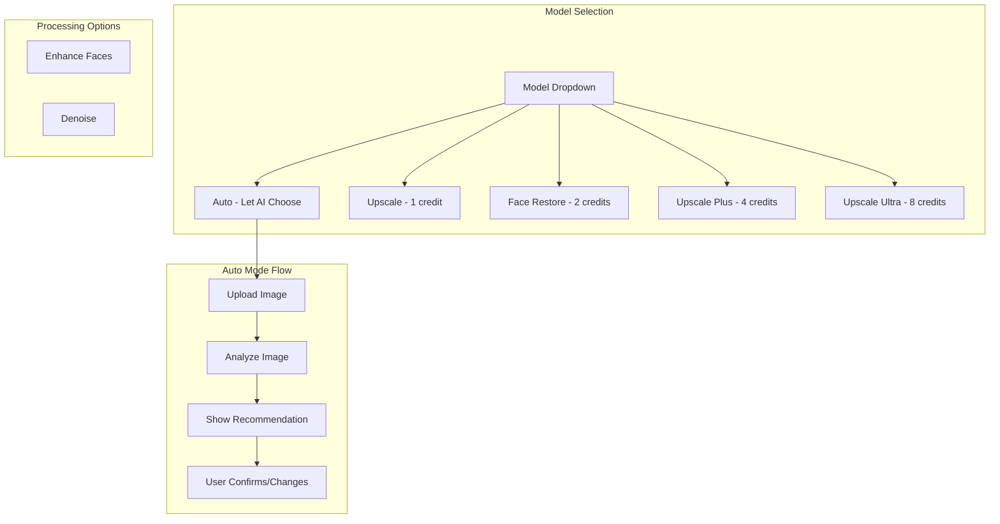

# PRD: Multi-Model Architecture for Adaptive Image Processing

**Version**: 1.1
**Last Updated**: December 2025
**Status**: Draft
**Author**: Engineering Team

---

## Executive Summary

This PRD defines the architecture for supporting multiple AI models in MyImageUpscaler's image processing pipeline. The system will:

1. **Support multiple models** configurable via environment variables
2. **Automatically select the best model** based on image analysis (damage level, content type)
3. **Allow users to customize features** via UI toggles that influence model selection
4. **Apply appropriate credit costs** based on the model's economics

### Business Impact

| Metric                    | Current                    | Target                      |
| ------------------------- | -------------------------- | --------------------------- |
| Processing Quality        | 8.5/10 (one-size-fits-all) | 9.5/10 (adaptive)           |
| Heavy Restoration Success | ~60%                       | 90%+                        |
| User Satisfaction         | Good                       | Excellent                   |
| Revenue per User          | Fixed                      | Variable (premium features) |

---

## 1. Problem Statement

### Current Limitations

1. **One Model Fits All**: Currently using Replicate Real-ESRGAN for upscaling and Gemini for enhancement, with no adaptive selection based on image characteristics

2. **Missed Optimization Opportunities**:
   - Damaged/old photos need specialized restoration
   - Simple upscales could use cheaper models
   - Face-focused images benefit from GFPGAN

3. **No User Control**: Users cannot influence model selection based on their quality preferences

4. **Fixed Credit Costs**: All operations cost the same regardless of computational intensity

### Target State

A dynamic model selection system that:

- Analyzes input images to determine optimal processing approach
- Allows users to enable/disable premium features via UI toggles
- Routes to the best model for each use case
- Charges credits proportionally to model costs

---

## 2. Model Registry & Economics

### 2.1 Supported Models

| Model ID           | Display Name  | Provider  | Replicate Model                                                                                | Cost/Run | Quality | Best For                         | Credits |
| ------------------ | ------------- | --------- | ---------------------------------------------------------------------------------------------- | -------- | ------- | -------------------------------- | ------- |
| `real-esrgan`      | Upscale       | Replicate | `nightmareai/real-esrgan` ⚠️                                                                   | $0.0017  | 8.5/10  | General upscaling                | 1       |
| `gfpgan`           | Face Restore  | Replicate | `tencentarc/gfpgan:0fbacf7afc6c144e5be9767cff80f25aff23e52b0708f17e20f9879b2f21516c`           | $0.0025  | 9.0/10  | Portrait & old photo restoration | 2       |
| `clarity-upscaler` | Upscale Plus  | Replicate | `philz1337x/clarity-upscaler:dfad41707589d68ecdccd1dfa600d55a208f9310748e44bfe35b4a6291453d5e` | $0.017   | 9.5/10  | High quality upscaling           | 4       |
| `nano-banana-pro`  | Upscale Ultra | Replicate | `google/nano-banana-pro` ⚠️                                                                    | $0.13    | 9.8/10  | Heavy damage, 4K output          | 8       |

> ⚠️ **Unpinned Models**: `real-esrgan` and `nano-banana-pro` do not support version pinning on Replicate. Monitor for silent model drift and consider periodic quality regression testing.

### 2.2 Model Categories

```
┌─────────────────────────────────────────────────────────────────┐
│                    Model Selection Guide                         │
├─────────────────────────────────────────────────────────────────┤
│                                                                  │
│  UPSCALE (Default)          → Real-ESRGAN (1 credit)            │
│  Fast, reliable, general-purpose upscaling                       │
│                                                                  │
│  FACE RESTORE               → GFPGAN (2 credits)                │
│  Old photos, portraits, face enhancement                         │
│                                                                  │
│  UPSCALE PLUS               → Clarity Upscaler (4 credits)      │
│  Higher quality, better detail preservation                      │
│                                                                  │
│  UPSCALE ULTRA              → Nano Banana Pro (8 credits)       │
│  Premium quality, heavy damage repair, 4K output                 │
│                                                                  │
└─────────────────────────────────────────────────────────────────┘
```

### 2.3 Credit Cost Formula

```
creditCost = baseCreditCost × scaleMultiplier

Where:
- baseCreditCost = model.credits (1, 2, 4, or 8)
- scaleMultiplier = 1.0 (2x) | 1.5 (4x) | 2.0 (8x)
```

### 2.4 Economic Rationale

| Model            | API Cost | Credits Charged | Revenue/Credit ($0.058) | Margin |
| ---------------- | -------- | --------------- | ----------------------- | ------ |
| Real-ESRGAN      | $0.0017  | 1               | $0.058                  | 97%    |
| GFPGAN           | $0.0025  | 2               | $0.116                  | 98%    |
| Clarity Upscaler | $0.017   | 4               | $0.232                  | 93%    |
| Nano Banana Pro  | $0.13    | 8               | $0.464                  | 72%    |

---

## 3. Architecture Design

### 3.1 Component Overview

```mermaid
graph TD
    subgraph UI Layer
        A[Upload Image] --> B[Model Selector]
        B --> C{Selection Mode}
        C -->|Manual| D[User Picks Model]
        C -->|Auto| E[Image Analyzer]
        E --> F[AI Recommends Model]
    end

    subgraph API Layer
        D --> G[/api/upscale]
        F --> G
        G --> H[Credit Calculator]
        H --> I[Process Image]
    end

    subgraph Service Layer
        I --> J[Model Registry]
        J --> K[Replicate Provider]
    end

    subgraph Data Layer
        O[(Model Config)]
        P[(Processing History)]
    end

    J --> O
    K --> P
```

### 3.2 Model Registry Schema

```typescript
interface IModelConfig {
  id: string; // Unique identifier
  displayName: string; // User-facing name
  provider: 'replicate';
  modelVersion: string; // Provider-specific model ID
  capabilities: ModelCapability[];
  costPerRun: number; // USD cost per API call
  creditCost: number; // Credits charged to user
  qualityScore: number; // 1-10 quality rating
  processingTimeMs: number; // Average processing time
  maxInputResolution: number; // Max input pixels
  maxOutputResolution: number; // Max output pixels
  supportedScales: number[]; // [2, 4, 8]
  isEnabled: boolean; // Model enabled/disabled
  tierRestriction?: SubscriptionTier; // Minimum tier required
}

type ModelCapability =
  | 'upscale'
  | 'face-restoration'
  | 'denoise'
  | 'damage-repair'
  | '4k-output'
  | '8k-output';
```

### 3.3 User-Driven Model Selection Flow



### 3.4 Auto Mode: Image Analysis Algorithm

**Note**: This algorithm is only triggered when user selects "Auto" mode. For manual selection, user picks the model directly.

```typescript
interface IImageAnalysis {
  damageLevel: number; // 0-1: 0=pristine, 1=heavily damaged
  faceCount: number; // Number of detected faces
  noiseLevel: number; // 0-1: Compression artifacts/noise
  contentType: ContentType; // photo|portrait|vintage|unknown
  resolution: {
    width: number;
    height: number;
    megapixels: number;
  };
}

type ContentType =
  | 'photo' // General photography
  | 'portrait' // Face-focused images
  | 'vintage' // Old/damaged photos
  | 'unknown';

function analyzeAndRecommendModel(
  analysis: IImageAnalysis,
  userTier: SubscriptionTier
): IModelRecommendation {
  const candidates = getEligibleModels(userTier);

  // Rule-based recommendation (simple, predictable)
  let recommended: string;
  let reasoning: string;

  if (analysis.damageLevel > 0.7) {
    recommended = 'nano-banana-pro';
    reasoning = 'Heavy damage detected. Premium restoration recommended.';
  } else if (
    analysis.faceCount > 0 ||
    analysis.contentType === 'portrait' ||
    analysis.contentType === 'vintage'
  ) {
    recommended = 'gfpgan';
    reasoning = 'Portrait or old photo detected. Face restoration model selected.';
  } else if (analysis.noiseLevel > 0.5) {
    recommended = 'clarity-upscaler';
    reasoning = 'Noise detected. Higher quality upscaler selected.';
  } else {
    recommended = 'real-esrgan';
    reasoning = 'Standard upscaling. Fast and efficient.';
  }

  // Check tier eligibility, downgrade if needed
  if (!candidates.includes(recommended)) {
    recommended = 'real-esrgan';
    reasoning += ' (Upgraded model requires higher tier)';
  }

  return {
    recommendedModel: recommended,
    reasoning,
    creditCost: calculateCreditCost(recommended),
    alternatives: candidates.filter(m => m !== recommended).slice(0, 2),
  };
}
```

---

## 4. Environment Configuration

### 4.1 Model Configuration via Environment Variables

```bash
# .env.api - Model Registry Configuration

# ==========================================
# MODEL REGISTRY - Enable/Disable Models
# ==========================================
MODELS_ENABLED=real-esrgan,gfpgan,clarity-upscaler,nano-banana-pro

# ==========================================
# REPLICATE MODELS
# ==========================================
REPLICATE_API_TOKEN=r8_xxxxx

# Real-ESRGAN (Default Upscale)
# WARNING: Unpinned model - no version hash available. Monitor for drift.
REPLICATE_MODEL_REAL_ESRGAN=nightmareai/real-esrgan
REPLICATE_MODEL_REAL_ESRGAN_COST=0.0017
REPLICATE_MODEL_REAL_ESRGAN_CREDITS=1

# GFPGAN (Face Restore / Old Photos)
REPLICATE_MODEL_GFPGAN=tencentarc/gfpgan:0fbacf7afc6c144e5be9767cff80f25aff23e52b0708f17e20f9879b2f21516c
REPLICATE_MODEL_GFPGAN_COST=0.0025
REPLICATE_MODEL_GFPGAN_CREDITS=2

# Clarity Upscaler (Upscale Plus)
REPLICATE_MODEL_CLARITY=philz1337x/clarity-upscaler:dfad41707589d68ecdccd1dfa600d55a208f9310748e44bfe35b4a6291453d5e
REPLICATE_MODEL_CLARITY_COST=0.017
REPLICATE_MODEL_CLARITY_CREDITS=4

# Nano Banana Pro (Upscale Ultra)
# WARNING: Unpinned model - no version hash available. Monitor for drift.
REPLICATE_MODEL_NANO_BANANA_PRO=google/nano-banana-pro
REPLICATE_MODEL_NANO_BANANA_PRO_COST=0.13
REPLICATE_MODEL_NANO_BANANA_PRO_CREDITS=8
REPLICATE_MODEL_NANO_BANANA_PRO_MIN_TIER=pro

# ==========================================
# MODEL SELECTION THRESHOLDS
# ==========================================
# Damage threshold for premium model (0-1)
MODEL_DAMAGE_THRESHOLD_PREMIUM=0.7

# Face count threshold for portrait model
MODEL_FACE_THRESHOLD=1

# Noise threshold for plus model (0-1)
MODEL_NOISE_THRESHOLD=0.5
```

### 4.2 Environment Schema Extension

```typescript
// shared/config/env.ts - Extension

const modelConfigSchema = z.object({
  // Enabled models (comma-separated)
  MODELS_ENABLED: z.string().transform(s => s.split(',')),

  // Replicate models
  REPLICATE_MODEL_REAL_ESRGAN: z.string(),
  REPLICATE_MODEL_REAL_ESRGAN_COST: z.coerce.number(),
  REPLICATE_MODEL_REAL_ESRGAN_CREDITS: z.coerce.number(),

  REPLICATE_MODEL_GFPGAN: z.string().optional(),
  REPLICATE_MODEL_GFPGAN_COST: z.coerce.number().optional(),
  REPLICATE_MODEL_GFPGAN_CREDITS: z.coerce.number().optional(),

  REPLICATE_MODEL_CLARITY: z.string().optional(),
  REPLICATE_MODEL_CLARITY_COST: z.coerce.number().optional(),
  REPLICATE_MODEL_CLARITY_CREDITS: z.coerce.number().optional(),

  REPLICATE_MODEL_NANO_BANANA_PRO: z.string().optional(),
  REPLICATE_MODEL_NANO_BANANA_PRO_COST: z.coerce.number().optional(),
  REPLICATE_MODEL_NANO_BANANA_PRO_CREDITS: z.coerce.number().optional(),
  REPLICATE_MODEL_NANO_BANANA_PRO_MIN_TIER: z.enum(['free', 'hobby', 'pro', 'business']).optional(),

  // Selection thresholds
  MODEL_DAMAGE_THRESHOLD_PREMIUM: z.coerce.number().min(0).max(1).default(0.7),
  MODEL_FACE_THRESHOLD: z.coerce.number().min(0).default(1),
  MODEL_NOISE_THRESHOLD: z.coerce.number().min(0).max(1).default(0.5),
});
```

---

## 5. User Interface

### 5.1 Model Selection UI (User-Driven)

Users choose their model directly, with "Auto" as an option for AI-assisted selection.



### 5.2 Processing Options Interface

```typescript
// components/upload/ProcessingOptions.tsx

interface IProcessingOptions {
  // Model selection (user-driven)
  selectedModel: 'auto' | ModelId; // 'auto' triggers image analysis

  // Scale factor
  scale: 2 | 4 | 8;

  // Processing options (affect model behavior)
  enhanceFaces: boolean; // Triggers GFPGAN
  denoise: boolean; // Enables noise reduction

  // Target resolution (Pro+ tiers)
  targetResolution?: '2k' | '4k' | '8k';
}

type ModelId = 'real-esrgan' | 'gfpgan' | 'clarity-upscaler' | 'nano-banana-pro';

// Models available by tier
const modelsByTier: Record<SubscriptionTier, ModelId[]> = {
  free: ['real-esrgan'],
  hobby: ['real-esrgan', 'gfpgan'],
  pro: ['real-esrgan', 'gfpgan', 'clarity-upscaler', 'nano-banana-pro'],
  business: ['real-esrgan', 'gfpgan', 'clarity-upscaler', 'nano-banana-pro'],
};
```

### 5.3 UI Component: Model Selector

```tsx
// Simplified component structure

interface ModelSelectorProps {
  userTier: SubscriptionTier;
  creditBalance: number;
  onModelChange: (model: string) => void;
  onOptionsChange: (options: IProcessingOptions) => void;
}

const ModelSelector: React.FC<ModelSelectorProps> = ({
  userTier,
  creditBalance,
  onModelChange,
  onOptionsChange,
}) => {
  const models = [
    {
      id: 'auto',
      name: 'Auto (Recommended)',
      description: 'AI analyzes your image and picks the best model',
      credits: 'Varies',
      available: true,
    },
    {
      id: 'real-esrgan',
      name: 'Upscale',
      description: 'Fast, reliable upscaling',
      credits: 1,
      available: true,
    },
    {
      id: 'gfpgan',
      name: 'Face Restore',
      description: 'Old photos & portrait enhancement',
      credits: 2,
      available: userTier !== 'free',
    },
    {
      id: 'clarity-upscaler',
      name: 'Upscale Plus',
      description: 'Higher quality upscaling with better details',
      credits: 4,
      badge: 'PRO',
      available: ['pro', 'business'].includes(userTier),
    },
    {
      id: 'nano-banana-pro',
      name: 'Upscale Ultra',
      description: 'Premium restoration for damaged photos, 4K output',
      credits: 8,
      badge: 'PRO',
      available: ['pro', 'business'].includes(userTier),
    },
  ];

  return (
    <div className="model-selector">
      <h3>Select Model</h3>
      <Select options={models} />

      <h3>Processing Options</h3>
      <Checkbox label="Enhance Faces" description="AI face restoration" />
      <Checkbox label="Reduce Noise" description="Remove compression artifacts" />

      <CreditEstimate modelCredits={selectedModel.credits} balance={creditBalance} />
    </div>
  );
};
```

### 5.4 Credit Cost Preview

Before processing, users see a clear breakdown:

```
┌─────────────────────────────────────────┐
│  Processing Cost Estimate               │
├─────────────────────────────────────────┤
│  Model: Upscale Plus          4 credits │
│  × Scale (4x)                 ×1.5      │
├─────────────────────────────────────────┤
│  Total Cost                   6 credits │
│  Your Balance                42 credits │
│  After Processing            36 credits │
└─────────────────────────────────────────┘
│         [ Process Image ]               │
└─────────────────────────────────────────┘
```

---

## 6. API Design

### 6.1 Enhanced Upscale Request Schema

```typescript
// shared/validation/upscale.schema.ts - Extension

const enhancedUpscaleSchema = z.object({
  imageData: z.string(),
  mimeType: z.string().default('image/jpeg'),
  config: z.object({
    // Model selection: 'auto' triggers image analysis, or specify a model ID
    selectedModel: z
      .enum(['auto', 'real-esrgan', 'gfpgan', 'clarity-upscaler', 'nano-banana-pro'])
      .default('auto'),
    scale: z.union([z.literal(2), z.literal(4), z.literal(8)]).default(2),

    // Processing options (affect model behavior)
    enhanceFaces: z.boolean().default(false),
    denoise: z.boolean().default(false),

    // Target resolution (Pro+ tiers)
    targetResolution: z.enum(['2k', '4k', '8k']).optional(),
  }),
});

// Response includes model info
const upscaleResponseSchema = z.object({
  success: z.boolean(),
  imageData: z.string(),
  mimeType: z.string(),
  processing: z.object({
    modelUsed: z.string(),
    modelDisplayName: z.string(),
    processingTimeMs: z.number(),
    creditsUsed: z.number(),
    creditsRemaining: z.number(),
  }),
  analysis: z
    .object({
      damageLevel: z.number().optional(),
      contentType: z.string().optional(),
      modelRecommendation: z.string().optional(),
    })
    .optional(),
});
```

### 6.2 API Endpoints

```typescript
// GET /api/models
// Returns available models for the user's tier
{
  models: [
    {
      id: 'real-esrgan',
      displayName: 'Upscale',
      description: 'Fast, reliable upscaling',
      creditCost: 1,
      capabilities: ['upscale'],
      qualityScore: 8.5,
      processingTime: '~2s',
      available: true,
    },
    {
      id: 'gfpgan',
      displayName: 'Face Restore',
      description: 'Old photos & portrait enhancement',
      creditCost: 2,
      capabilities: ['upscale', 'face-restoration'],
      qualityScore: 9.0,
      processingTime: '~5s',
      available: false,  // Only for hobby+ tiers
      requiresTier: 'hobby',
    },
    {
      id: 'clarity-upscaler',
      displayName: 'Upscale Plus',
      description: 'Higher quality upscaling',
      creditCost: 4,
      capabilities: ['upscale', 'denoise'],
      qualityScore: 9.5,
      processingTime: '~15s',
      available: false,
      requiresTier: 'pro',
    },
    {
      id: 'nano-banana-pro',
      displayName: 'Upscale Ultra',
      description: 'Premium quality for damaged photos',
      creditCost: 8,
      capabilities: ['upscale', 'damage-repair', '4k-output'],
      qualityScore: 9.8,
      processingTime: '~30s',
      available: false,
      requiresTier: 'pro',
    },
  ],
  defaultModel: 'real-esrgan',
}

// POST /api/analyze-image
// Analyzes image and recommends model (optional pre-processing step)
Request: { imageData: string, mimeType: string }
Response: {
  analysis: {
    damageLevel: 0.75,
    faceCount: 2,
    noiseLevel: 0.6,
    contentType: 'vintage',
    resolution: { width: 800, height: 600, megapixels: 0.48 },
  },
  recommendation: {
    model: 'gfpgan',
    reason: 'Old photo with faces detected. Face restoration model recommended.',
    creditCost: 2,
    alternativeModel: 'nano-banana-pro',
    alternativeCost: 8,
  },
}

// GET /api/credit-estimate
// Pre-calculates credit cost for a processing job
Request: {
  config: ProcessingConfig,
  analysisHint?: ImageAnalysis,
}
Response: {
  breakdown: {
    baseCredits: 4,
    scaleMultiplier: 1.5,
    totalCredits: 6,
  },
  modelToBe: 'clarity-upscaler',
  estimatedProcessingTime: '15-30s',
}
```

---

## 7. Implementation Plan

### Phase 1: Model Registry & Configuration

- [ ] Create `ModelRegistry` service with environment-based configuration
- [ ] Extend environment schema with model configuration variables
- [ ] Implement model capability matching logic
- [ ] Add tier restriction validation
- [ ] Update `image-processor.factory.ts` to use registry

**Files to Create/Modify:**

- `server/services/model-registry.ts` (new)
- `server/services/model-registry.types.ts` (new)
- `shared/config/env.ts` (extend)
- `server/services/image-processor.factory.ts` (modify)

### Phase 2: Image Analysis Engine

- [ ] Implement lightweight image analysis (client-side pre-analysis)
- [ ] Create damage detection heuristics (blur, noise, artifacts)
- [ ] Add face detection integration (existing GFPGAN check)
- [ ] Create content type classifier

**Files to Create:**

- `server/services/image-analyzer.ts` (new)
- `server/services/image-analyzer.types.ts` (new)
- `shared/utils/image-analysis.ts` (client-side helpers)

### Phase 3: Model Selection Algorithm

- [ ] Implement scoring algorithm for model selection
- [ ] Create model capability matching
- [ ] Add user preference integration
- [ ] Implement fallback chain logic
- [ ] Add credit cost calculation

**Files to Create/Modify:**

- `server/services/model-selector.ts` (new)
- `server/services/model-selector.types.ts` (new)
- `shared/config/subscription.config.ts` (extend credit costs)

### Phase 4: Credit System Update

- [ ] Update credit calculation to support variable costs
- [ ] Add model-based credit multipliers
- [ ] Update `consume_credits_v2` RPC if needed
- [ ] Implement credit estimate endpoint
- [ ] Add credit breakdown to processing response

**Files to Modify:**

- `shared/config/subscription.config.ts`
- `shared/config/subscription.utils.ts`
- `server/services/image-generation.service.ts`
- `server/services/replicate.service.ts`

### Phase 5: UI Implementation

- [ ] Create `ModelSelector` component
- [ ] Add processing options checkboxes
- [ ] Implement credit estimate preview
- [ ] Add model recommendation display
- [ ] Update upload flow with new options

**Files to Create/Modify:**

- `components/upload/ModelSelector.tsx` (new)
- `components/upload/ProcessingOptions.tsx` (new)
- `components/upload/CreditEstimate.tsx` (new)
- `components/upload/UploadZone.tsx` (modify)

### Phase 6: API Integration

- [ ] Update `/api/upscale` with new schema
- [ ] Create `/api/models` endpoint
- [ ] Create `/api/analyze-image` endpoint
- [ ] Create `/api/credit-estimate` endpoint
- [ ] Add model info to processing response

**Files to Create/Modify:**

- `app/api/upscale/route.ts` (modify)
- `app/api/models/route.ts` (new)
- `app/api/analyze-image/route.ts` (new)
- `app/api/credit-estimate/route.ts` (new)

### Phase 7: Testing & Monitoring

- [ ] Unit tests for model registry
- [ ] Unit tests for image analysis
- [ ] Unit tests for model selection
- [ ] Integration tests for full flow
- [ ] Add analytics for model usage
- [ ] Add monitoring for model performance

---

## 8. Testing Strategy

### 8.1 Unit Tests

```typescript
describe('ModelRegistry', () => {
  it('should load models from environment variables');
  it('should filter models by tier');
  it('should return only enabled models');
  it('should calculate correct credit costs');
});

describe('ImageAnalyzer', () => {
  it('should detect damage level correctly');
  it('should identify portraits with faces');
  it('should classify content types');
});

describe('ModelSelector', () => {
  it('should select premium model for heavily damaged images');
  it('should select GFPGAN for portrait/vintage images');
  it('should respect tier restrictions');
  it('should apply user preferences');
});
```

### 8.2 Edge Cases

| Scenario                                 | Expected Behavior           |
| ---------------------------------------- | --------------------------- |
| No models enabled                        | Use fallback Real-ESRGAN    |
| User lacks credits for recommended model | Suggest cheaper alternative |
| Premium model unavailable                | Fall back to next best      |
| Image analysis fails                     | Skip to default model       |
| User on free tier requests premium       | Show upgrade prompt         |

---

## 9. Success Metrics

### 9.1 Technical Metrics

| Metric                  | Target | Measurement               |
| ----------------------- | ------ | ------------------------- |
| Model selection latency | <100ms | p95 response time         |
| Image analysis latency  | <500ms | p95 response time         |
| Correct model selection | >90%   | User satisfaction surveys |
| Fallback rate           | <5%    | Primary model failures    |

### 9.2 Business Metrics

| Metric                  | Baseline | Target      |
| ----------------------- | -------- | ----------- |
| Premium model usage     | 0%       | 15% of jobs |
| Average credits/job     | 1.5      | 2.5         |
| User satisfaction (NPS) | +30      | +50         |

### 9.3 Quality Metrics

| Metric                        | Target |
| ----------------------------- | ------ |
| Old photo restoration success | 90%+   |
| Face enhancement quality      | 9.0/10 |
| User retry rate               | <10%   |

---

## 10. Rollout Strategy

### 10.1 Rollout Phases

| Phase       | Audience           | Success Criteria    |
| ----------- | ------------------ | ------------------- |
| 1. Internal | Team only          | No critical bugs    |
| 2. Staged   | Pro/Business users | Error rate <1%      |
| 3. GA       | All users          | Revenue targets met |

### 10.2 Rollback Plan

If issues arise:

1. Revert to single-model factory (Real-ESRGAN only)
2. Refund any overcharged credits
3. Communicate via in-app notification

---

## 11. Security Considerations

1. **Credit Manipulation**: Server-side credit calculation only; never trust client
2. **Model Injection**: Validate model IDs against registry whitelist
3. **Cost Abuse**: Rate limit premium model access
4. **Data Privacy**: Image analysis runs server-side; no external logging

---

## 12. Future Considerations

### 12.1 Potential Enhancements

- **User Model Training**: Custom models trained on user's image style
- **Batch Optimization**: Intelligent batching for similar images
- **Cost Prediction**: ML-based credit cost estimation
- **A/B Testing Framework**: Model comparison for quality improvements

### 12.2 Model Additions (Roadmap)

| Model           | Use Case                   |
| --------------- | -------------------------- |
| Video Upscaling | Video frame processing     |
| Custom LoRA     | Brand-specific enhancement |

---

## Appendix A: Model Comparison Matrix

| Model            | Upscale | Faces | Denoise | Damage | 4K  | Speed | Cost |
| ---------------- | ------- | ----- | ------- | ------ | --- | ----- | ---- |
| Real-ESRGAN      | Yes     | No    | Yes     | Fair   | Yes | Fast  | Low  |
| GFPGAN           | Yes     | Yes   | Yes     | Good   | Yes | Fast  | Low  |
| Clarity Upscaler | Yes     | Fair  | Yes     | Fair   | Yes | Med   | Med  |
| Nano Banana Pro  | Yes     | Yes   | Yes     | Best   | Yes | Med   | High |

---

## Appendix B: Credit Cost Examples

| Scenario             | Model           | Scale | Credits |
| -------------------- | --------------- | ----- | ------- |
| Quick upscale        | Real-ESRGAN     | 2x    | 1       |
| Portrait restoration | GFPGAN          | 2x    | 2       |
| High quality upscale | Clarity         | 4x    | 6       |
| Damaged family photo | Nano Banana Pro | 4x    | 12      |

---

_Last Updated: December 2025_
