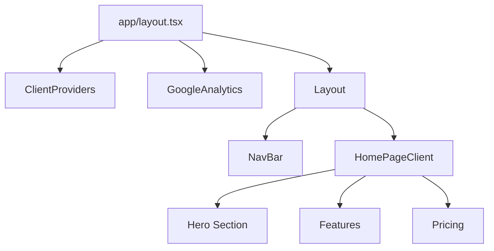
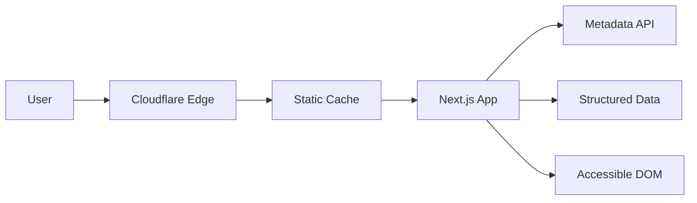

# Performance and SEO Enhancement Plan

## Role & Objectives

**Principal Software Architect** optimizing for peak performance (Core Web Vitals) and maximum search engine visibility.

**Mission:**
Enhance the existing high-quality codebase to achieve 100/100 Lighthouse scores and perfect SEO implementation.

### The John Carmack Standard

1.  **Simplicity:** Use native Next.js features first.
2.  **Performance:** Zero layout shifts (CLS), fast LCP.
3.  **Robustness:** Graceful degradation for JS-disabled clients.
4.  **Reasoning Transparency:** All optimizations must be measurable.

---

## Protocol: Pre-Planning Requirements

**Status:**

- **Explored:** `app/layout.tsx`, `app/page.tsx`, `next.config.js`, `package.json`, `HomePageClient.tsx`.
- **Verified:** Metadata, JSON-LD, Image optimization, and Font loading are already present.
- **Constraint Check:** Next.js 15 App Router is the primary constraint.
- **Impact Awareness:** Changes will primarily affect the Landing Page and Global Layout.

---

## Plan Document Structure

### 1. Context Analysis

#### 1.1 Files Analyzed

- `/home/joao/projects/myimageupscaler.com/app/layout.tsx`
- `/home/joao/projects/myimageupscaler.com/app/page.tsx`
- `/home/joao/projects/myimageupscaler.com/next.config.js`
- `/home/joao/projects/myimageupscaler.com/package.json`
- `/home/joao/projects/myimageupscaler.com/src/components/pages/HomePageClient.tsx`
- `/home/joao/projects/myimageupscaler.com/src/components/layout/Layout.tsx`
- `/home/joao/projects/myimageupscaler.com/app/sitemap.ts`
- `/home/joao/projects/myimageupscaler.com/app/robots.ts`

#### 1.2 Component & Dependency Overview



#### 1.3 Current Behavior Summary

- **Metadata:** Comprehensive metadata and OpenGraph tags are present.
- **JSON-LD:** `WebSite` and `Organization` schemas are implemented.
- **Images:** `next/image` is used for avatars.
- **Fonts:** `next/font/google` is used for Inter.
- **Sitemap/Robots:** Dynamic generation is implemented.

#### 1.4 Problem Statement

While the baseline is strong, we need to ensure:

1.  **Perfect Accessibility:** Color contrast and ARIA labels for all interactive elements.
2.  **Product SEO:** Missing `Product` structured data for the pricing section.
3.  **LCP Optimization:** The Hero section relies on CSS gradients; ensuring the H1 or main visual is prioritized is key.
4.  **Canonical URLs:** Explicit canonical tags should be verified/added.

---

### 2. Proposed Solution

#### 2.1 Architecture Summary

- **Structured Data Expansion:** Add `Product` schema to the Pricing section.
- **Accessibility Audit:** Enforce `eslint-plugin-jsx-a11y` rules strictly and fix contrast issues.
- **Canonicalization:** Ensure `metadataBase` is correctly leveraged for canonical URLs in `app/layout.tsx`.
- **Resource Hints:** Verify `preload` for critical assets (fonts are handled, check hero images if any).

#### 2.2 Architecture Diagram (Mermaid)



#### 2.3 Key Technical Decisions

- **Library:** Use `schema-dts` or standard JSON objects for type-safe structured data if needed, but current simple object approach is fine.
- **Performance:** Continue using `next/image` and `next/font`.
- **Accessibility:** Use `aria-label` for icon-only buttons.

#### 2.4 Data Model Changes

- **"No Data Changes."**

---

### 2.5 Runtime Execution Flow

N/A - This is primarily a static content and metadata optimization.

---

### 3. Detailed Implementation Spec

#### A. `app/layout.tsx`

- **Changes Needed:**
  - Verify `metadataBase` is set (it is).
  - Add `alternates: { canonical: '/' }` to explicit canonical URL generation.
- **Pseudo-code:**

```typescript
export const metadata: Metadata = {
  // ... existing
  alternates: {
    canonical: '/',
  },
};
```

#### B. `src/components/myimageupscaler.com/Pricing.tsx` (Assumed file)

- **Changes Needed:**
  - Inject `Product` JSON-LD data for the subscription plans.
- **Pseudo-code:**

```typescript
const productJsonLd = {
  '@context': 'https://schema.org',
  '@type': 'Product',
  name: 'MyImageUpscaler AI Pro',
  description: 'Professional image upscaling subscription',
  offers: {
    '@type': 'Offer',
    price: '29.00',
    priceCurrency: 'USD',
    availability: 'https://schema.org/InStock',
  },
};

// Render <JsonLd data={productJsonLd} />
```

#### C. `src/components/pages/HomePageClient.tsx`

- **Changes Needed:**
  - Ensure the Hero H1 is the LCP element.
  - Add `priority` prop to any LCP images (currently mostly CSS, so H1 is likely LCP).
  - Check color contrast on the "Try it now" text and badge.

---

### 4. Step-by-Step Execution Plan

#### Phase 1: SEO Enhancements

- [ ] Update `app/layout.tsx` to include explicit `canonical` tag in metadata.
- [ ] Create `Product` structured data in `Pricing` component (or `HomePageClient` if passed down).

#### Phase 2: Accessibility & Performance

- [ ] Audit color contrast for "Try it now" text (indigo-600 on white is usually fine, but check indigo-400 on gradients).
- [ ] Ensure all interactive elements (buttons, links) have `aria-label` if they lack text content.
- [ ] Run `npm run lint` to check for any new a11y warnings.

---

### 5. Testing Strategy

#### Unit Tests

- Verify JSON-LD objects are correctly formed.

#### Integration Tests

- Use `playwright` to check for presence of meta tags and JSON-LD script tags in the DOM.

#### Edge Cases

| Scenario | Expected Behavior |
| paper | ----------------- |
| JS Disabled | Meta tags and JSON-LD still render (Server Component) |
| Slow Network | Fonts swap correctly, text is visible |

---

### 6. Acceptance Criteria

- [ ] `canonical` link tag is present in `<head>`.
- [ ] `Product` structured data is present on the page.
- [ ] Lighthouse Accessibility score is 100 (or no critical violations).
- [ ] No console warnings regarding unique IDs or nesting.

---

### 7. Verification & Rollback

- **Success Criteria:** Lighthouse Audit > 95 on all categories.
- **Rollback Plan:** Revert git commit.
