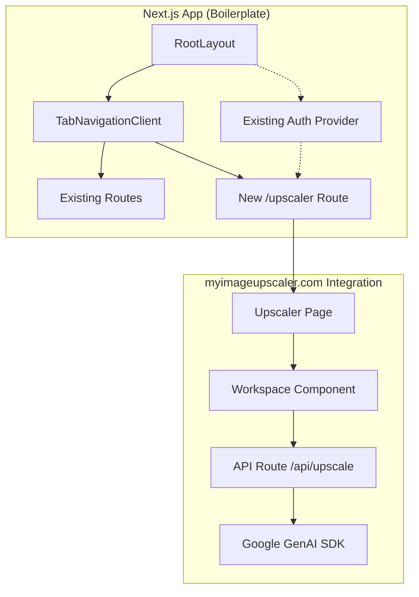
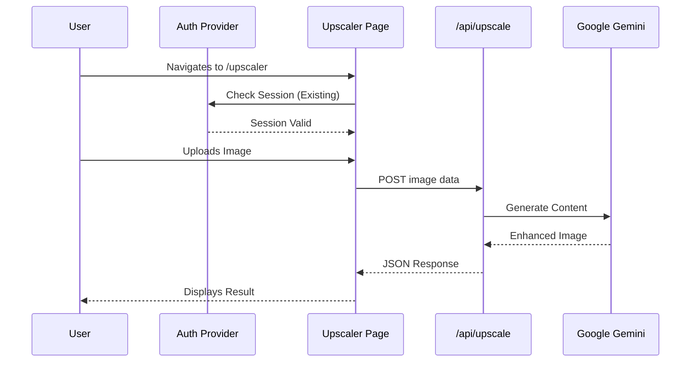

# MyImageUpscaler AI Integration PRD

## User Review Required

> [!IMPORTANT] > **Architecture Shift:** We are migrating the client-side React template to the Next.js App Router. The AI logic will be moved from the client (`aiService.ts`) to a server-side API route (`app/api/upscale`) to secure API keys and leverage Cloudflare Workers (via Next.js).

> [!NOTE] > **Styling:** The template uses Tailwind CSS. The boilerplate also uses Tailwind (via DaisyUI). We will integrate the components into `src/components/myimageupscaler.com` and ensure they render correctly within the existing layout.

> [!CAUTION] > **Cleanup:** The `template` directory will be **permanently deleted** after migration. All necessary code must be moved to `src`.

> [!CRITICAL] > **Auth Preservation:** The existing authentication system (Supabase Auth) **MUST NOT be touched or overridden**. The new "Upscaler" feature will simply inherit the existing session protection provided by `ClientProviders` and `Layout`. We are "absorbing" the new feature into the existing secure environment.

## Proposed Changes

### 1. Context Analysis

#### 1.1 Files Analyzed

- `template/App.tsx`
- `template/services/aiService.ts`
- `template/hooks/useBatchQueue.ts`
- `template/utils/download.ts`
- `app/page.tsx`
- `app/layout.tsx`
- `src/components/navigation/TabNavigationClient.tsx`
- `package.json`
- `next.config.js`

#### 1.2 Component & Dependency Overview



#### 1.3 Current Behavior Summary

- **Boilerplate:** Next.js App Router project with Cloudflare Pages configuration. Uses `src/components` for UI and `app` for routing. Authentication is handled by `ClientProviders` wrapping the app.
- **Template:** Client-side Vite app with direct API calls.

#### 1.4 Problem Statement

Integrate the image upscaling tool into the Next.js app as a new feature tab, ensuring secure API handling and consistent styling, then remove the template source. **Crucially, existing Auth must remain intact.**

---

### 2. Proposed Solution

#### 2.1 Architecture Summary

- **Frontend:** New route `app/upscaler/page.tsx` rendering the `Workspace` component.
- **Backend:** New API route `app/api/upscale/route.ts` handling Google GenAI interactions.
- **Components:** Migrate template components to `src/components/myimageupscaler.com`.
- **Utils/Hooks:** Migrate to `src/lib/myimageupscaler.com` and `src/hooks/myimageupscaler.com`.
- **Navigation:** Add "Upscaler" link to `TabNavigationClient`.
- **Auth Strategy:** The new route will be automatically protected by the existing `app/layout.tsx` and `ClientProviders`. No new auth logic will be implemented.

#### 2.2 Architecture Diagram



#### 2.3 Key Technical Decisions

- **API Route:** Use Next.js API Routes (Edge or Node runtime) to proxy requests to Google Gemini, keeping API keys server-side.
- **Component Location:** `src/components/myimageupscaler.com` to keep the source tree organized.
- **Routing:** Top-level `/upscaler` route.
- **Cleanup:** Complete removal of `template` directory post-verification.
- **Auth:** Zero changes to `src/components/auth` or `src/lib/supabase`.

#### 2.4 Data Model Changes

- No database changes.
- New API response types for the upscaler.

---

### 3. Detailed Implementation Spec

#### A. `package.json` (Root)

- **Changes Needed:** Add dependencies.
- **New Dependencies:**
  - `@google/genai`
  - `jszip`

#### B. `src/components/myimageupscaler.com/`

- **Action:** Copy `template/components/*` to this directory.
- **Refactor:**
  - Update imports to use relative paths or `@/components`.
  - Remove `Header` and `Pricing` components (not needed for the tool view).
  - Ensure `Workspace` accepts necessary props or handles its own state.

#### C. `src/hooks/myimageupscaler.com/` & `src/lib/myimageupscaler.com/`

- **Action:** Move `template/hooks/*` and `template/utils/*`.
- **Files:**
  - `template/hooks/useBatchQueue.ts` -> `src/hooks/myimageupscaler.com/useBatchQueue.ts`
  - `template/utils/download.ts` -> `src/lib/myimageupscaler.com/download.ts`

#### D. `app/api/upscale/route.ts`

- **Purpose:** Server-side handler for AI generation.
- **Logic:**
  - Receive `POST` request with image and config.
  - Initialize `GoogleGenAI` with server-side `process.env.API_KEY`.
  - Call Gemini model.
  - Return base64 image.

#### E. `app/upscaler/page.tsx`

- **Purpose:** The main page for the tool.
- **Content:**
  - Import `Workspace` from `src/components/myimageupscaler.com/Workspace/Workspace`.
  - Render within the main layout.
  - **Note:** This page sits inside `app/layout.tsx`, so it inherits the `ClientProviders` (Auth) automatically.

#### F. `src/components/navigation/TabNavigationClient.tsx`

- **Changes Needed:** Add a hardcoded `Link` to `/upscaler`.
- **Pseudo-code:**

```tsx
// ... existing tabs
<Link href="/upscaler">
  <Tab
    id="upscaler"
    label="Upscaler"
    icon="Wand2" // Import from lucide-react
    isActive={pathname === '/upscaler'}
    onClick={() => {}}
  />
</Link>
```

#### G. `src/lib/api.ts` (New/Update)

- **Purpose:** Client-side helper to call `/api/upscale`.
- **Refactor:** Adapt `template/services/aiService.ts` to call the internal API instead of Google directly.

---

### 4. Step-by-Step Execution Plan

#### Phase 1: Backend & Dependencies

- [ ] Install `@google/genai` and `jszip`.
- [ ] Create `app/api/upscale/route.ts`.
- [ ] Verify API route works with a simple test.

#### Phase 2: Code Migration

- [ ] Create `src/components/myimageupscaler.com`, `src/hooks/myimageupscaler.com`, `src/lib/myimageupscaler.com`.
- [ ] Copy and refactor components, hooks, and utils from `template`.
- [ ] Refactor `aiService.ts` into a client-side API caller (calling `/api/upscale`).

#### Phase 3: Frontend Integration

- [ ] Create `app/upscaler/page.tsx`.
- [ ] Update `TabNavigationClient.tsx`.
- [ ] Add "Upscaler" icon to `TabNavigationClient`.

#### Phase 4: Verification

- [ ] Run `npm run dev`.
- [ ] Test the full flow: Navigation -> Upload -> Process -> Result.
- [ ] Verify no imports reference `template/`.
- [ ] **Verify Auth:** Ensure user session persists when navigating to/from Upscaler.

#### Phase 5: Cleanup

- [ ] Delete `template` directory.
- [ ] Remove `template` from `tsconfig.json` or other config files if referenced.

---

### 5. Testing Strategy

#### Unit Tests

- Test API route error handling (missing key, bad request).

#### Integration Tests

- Manual verification of the upscaling flow.
- **Auth Regression Test:** Log out, try to access `/upscaler` (should redirect or show auth modal depending on existing logic), log in, access `/upscaler`.

#### Edge Cases

| Scenario | Expected Behavior |
| paper | ----------------- |
| Large Image Upload | API route handles limit or returns 413 |
| API Timeout | Client shows error message |
| Unauthenticated Access | Handled by existing `ClientProviders` |

---

### 6. Acceptance Criteria

- [ ] `/upscaler` route exists and loads.
- [ ] "Upscaler" tab is present in navigation.
- [ ] Image processing works end-to-end via the API route.
- [ ] `template` directory is deleted.
- [ ] App builds and runs without `template`.
- [ ] **Existing Auth is 100% preserved and functional.**

---

### 7. Verification & Rollback

- **Success Criteria:** Working upscaler in the Next.js app, clean source tree, auth intact.
- **Rollback Plan:** Revert git changes.
