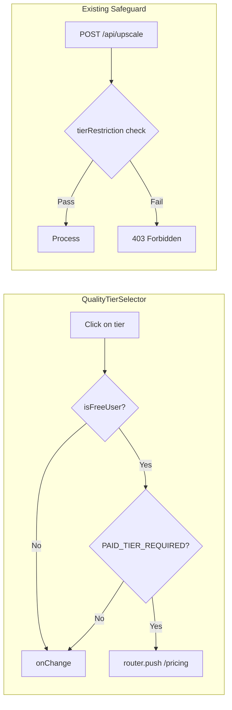
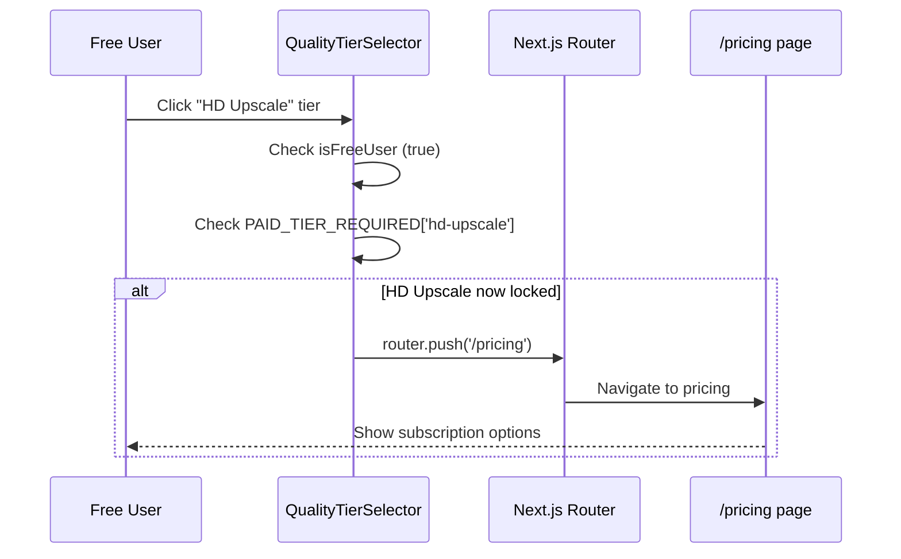

# PRD: Premium Model Restrictions for Free Users

**Version:** 1.0
**Status:** Draft
**Date:** December 18, 2025
**Author:** Principal Architect

---

## Executive Summary

Ensure expensive AI models (`flux-2-pro`, `nano-banana-pro`, `clarity-upscaler`) are fully restricted from free users with proper UI feedback and API safeguards. Free users attempting to access these models should see a clear upgrade path to the pricing page.

**Cost Impact:** These models represent our highest operational costs:
| Model | Cost/Run | Credit Multiplier | Quality Tier |
|-------|----------|-------------------|--------------|
| clarity-upscaler | $0.017 | 4x | HD Upscale |
| flux-2-pro | $0.05 | 6x | Face Pro |
| nano-banana-pro | $0.13 | 8x | Ultra |

### Key Changes Required

| Area            | Current State                     | Required State                   |
| --------------- | --------------------------------- | -------------------------------- |
| UI Lock         | Only `face-pro` + `ultra` locked  | Add `hd-upscale` to locked tiers |
| UI Click Action | Silent block (does nothing)       | Redirect to `/pricing` page      |
| API Safeguard   | Exists and works correctly        | No change needed                 |
| Config Lists    | Inconsistent with tierRestriction | Align for clarity                |

---

## 1. Context Analysis

### 1.1 Files Analyzed

```
/home/joao/projects/myimageupscaler.com/shared/config/model-costs.config.ts
/home/joao/projects/myimageupscaler.com/shared/types/myimageupscaler.com.ts
/home/joao/projects/myimageupscaler.com/client/components/features/workspace/BatchSidebar/QualityTierSelector.tsx
/home/joao/projects/myimageupscaler.com/app/api/upscale/route.ts
/home/joao/projects/myimageupscaler.com/server/services/model-registry.ts
/home/joao/projects/myimageupscaler.com/app/pricing/page.tsx
```

### 1.2 Component & Dependency Overview

```mermaid
graph TD
    A[QualityTierSelector.tsx] --> B{PAID_TIER_REQUIRED check}
    B -->|Free user + paid tier| C[Block selection]
    B -->|Allowed| D[onChange callback]

    E[/api/upscale] --> F{tierRestriction check}
    F -->|User level < required| G[403 Forbidden]
    F -->|Allowed| H[Process image]

    I[model-costs.config.ts] --> J[tierRestriction: null/hobby]
    J --> F

    K[QUALITY_TIER_CONFIG] --> L[Maps tier -> modelId]
    L --> A
```

### 1.3 Current Behavior Summary

**Model Configuration (`model-costs.config.ts`):**

- `real-esrgan`: `tierRestriction: null` (free)
- `gfpgan`: `tierRestriction: null` (free)
- `nano-banana`: `tierRestriction: null` (free)
- `clarity-upscaler`: `tierRestriction: 'hobby'` (paid only)
- `flux-2-pro`: `tierRestriction: 'hobby'` (paid only)
- `nano-banana-pro`: `tierRestriction: 'hobby'` (paid only)

**UI Locking (`QualityTierSelector.tsx`):**

```typescript
const PAID_TIER_REQUIRED: Partial<Record<QualityTier, boolean>> = {
  'face-pro': true, // flux-2-pro
  ultra: true, // nano-banana-pro
  // MISSING: 'hd-upscale' (clarity-upscaler)
};
```

**Current Click Behavior (lines 39-46):**

```typescript
if (isFreeUser && PAID_TIER_REQUIRED[selectedTier]) {
  return; // Silent block - no feedback, no redirect
}
```

**API Safeguard (`/api/upscale/route.ts` lines 378-402):**

- Correctly validates user tier against model's `tierRestriction`
- Returns 403 with clear error message if insufficient tier
- This layer is working correctly

### 1.4 Problem Statement

Free users can visually see premium tiers (`hd-upscale`) as available when they should be locked, and clicking locked tiers provides no actionable feedback (should redirect to pricing).

---

## 2. Proposed Solution

### 2.1 Architecture Summary

- **Minimal change approach**: Only fix the identified gaps
- Add `hd-upscale` to `PAID_TIER_REQUIRED` mapping
- Replace silent block with pricing page redirect
- Keep existing API safeguard unchanged (defense in depth)
- Align informational constants (`FREE_MODELS`, etc.) with actual restrictions

**Alternatives Considered:**

1. **Dynamic lock based on tierRestriction lookup** - Rejected: Over-engineering for 3 static mappings
2. **Modal before redirect** - Rejected: Adds friction, pricing page is self-explanatory
3. **Disable click entirely** - Current behavior - Rejected: Poor UX, no upgrade path

### 2.2 Architecture Diagram



### 2.3 Key Technical Decisions

| Decision         | Choice           | Rationale                            |
| ---------------- | ---------------- | ------------------------------------ |
| Redirect target  | `/pricing`       | Existing page with tier comparison   |
| Lock mechanism   | Static map       | Simple, matches existing pattern     |
| API enforcement  | Keep existing    | Already works, defense in depth      |
| Config alignment | Update constants | Developer clarity, no runtime impact |

### 2.4 Data Model Changes

**No Data Changes.** All changes are UI-only and configuration constants.

---

## 2.5 Runtime Execution Flow



---

## 3. Detailed Implementation Spec

### A. `client/components/features/workspace/BatchSidebar/QualityTierSelector.tsx`

**Changes Needed:**

1. Add `hd-upscale` to `PAID_TIER_REQUIRED` mapping
2. Add router import
3. Replace silent block with redirect

**Current (lines 7-11):**

```typescript
const PAID_TIER_REQUIRED: Partial<Record<QualityTier, boolean>> = {
  'face-pro': true,
  ultra: true,
};
```

**New:**

```typescript
const PAID_TIER_REQUIRED: Partial<Record<QualityTier, boolean>> = {
  'hd-upscale': true, // clarity-upscaler - $0.017/run
  'face-pro': true, // flux-2-pro - $0.05/run
  ultra: true, // nano-banana-pro - $0.13/run
};
```

**Add import:**

```typescript
import { useRouter } from 'next/navigation';
```

**Update component (add router initialization):**

```typescript
export const QualityTierSelector: React.FC<IQualityTierSelectorProps> = ({
  tier,
  onChange,
  disabled = false,
  isFreeUser = false,
}) => {
  const router = useRouter();
  // ... existing state
```

**Update `handleTierSelect` (lines 39-46):**

```typescript
const handleTierSelect = (selectedTier: QualityTier) => {
  // Redirect free users trying to select premium tiers to pricing
  if (isFreeUser && PAID_TIER_REQUIRED[selectedTier]) {
    router.push('/pricing');
    setIsOpen(false);
    return;
  }
  onChange(selectedTier);
  setIsOpen(false);
};
```

**Justification:** Provides clear upgrade path instead of silent failure. Single line change + redirect.

---

### B. `shared/config/model-costs.config.ts`

**Changes Needed:** Align informational constants with actual `tierRestriction` values for developer clarity.

**Current (lines 36-39):**

```typescript
FREE_MODELS: ['real-esrgan'],
HOBBY_MODELS: ['real-esrgan', 'gfpgan', 'nano-banana'],
PRO_MODELS: ['real-esrgan', 'gfpgan', 'nano-banana', 'clarity-upscaler'],
BUSINESS_MODELS: ['real-esrgan', 'gfpgan', 'nano-banana', 'clarity-upscaler', 'nano-banana-pro'],
```

**New (aligned with tierRestriction values):**

```typescript
// Models available by subscription tier (based on tierRestriction field in MODEL_CONFIG)
// Note: These are informational constants - actual enforcement is via tierRestriction
FREE_MODELS: ['real-esrgan', 'gfpgan', 'nano-banana'],
HOBBY_MODELS: ['real-esrgan', 'gfpgan', 'nano-banana', 'clarity-upscaler', 'flux-2-pro', 'nano-banana-pro'],
PRO_MODELS: ['real-esrgan', 'gfpgan', 'nano-banana', 'clarity-upscaler', 'flux-2-pro', 'nano-banana-pro'],
BUSINESS_MODELS: ['real-esrgan', 'gfpgan', 'nano-banana', 'clarity-upscaler', 'flux-2-pro', 'nano-banana-pro'],
```

**Justification:** The current lists are inconsistent with the actual `tierRestriction` values:

- `gfpgan` and `nano-banana` have `tierRestriction: null` so they're free
- All hobby+ models have same access once you're paid
- This aligns documentation with runtime behavior

---

## 4. Step-by-Step Execution Plan

### Phase 1: UI Changes

- [ ] Add `useRouter` import to `QualityTierSelector.tsx`
- [ ] Add `hd-upscale` to `PAID_TIER_REQUIRED` mapping
- [ ] Initialize router in component
- [ ] Update `handleTierSelect` to redirect instead of silent return

### Phase 2: Config Alignment

- [ ] Update `FREE_MODELS` to include `gfpgan`, `nano-banana`
- [ ] Update `HOBBY_MODELS` to include all paid models
- [ ] Add clarifying comment about informational vs enforcement

### Phase 3: Verification

- [ ] Run `yarn verify` to ensure no type errors
- [ ] Manual test: Free user clicking locked tiers redirects to /pricing
- [ ] Manual test: Paid user can select all tiers
- [ ] Verify API still returns 403 for direct API bypass attempts

---

## 5. Testing Strategy

### Unit Tests

**`QualityTierSelector.test.tsx`:**

- Free user clicking `hd-upscale` triggers router.push('/pricing')
- Free user clicking `face-pro` triggers router.push('/pricing')
- Free user clicking `ultra` triggers router.push('/pricing')
- Paid user can select any tier without redirect
- Free user can select `quick`, `face-restore`, `auto` normally

### Integration Tests

**Existing API tests should pass unchanged** - API enforcement is not modified.

### Edge Cases

| Scenario                                | Expected Behavior                     |
| --------------------------------------- | ------------------------------------- |
| Free user clicks HD Upscale             | Redirect to /pricing, dropdown closes |
| Free user clicks Face Pro               | Redirect to /pricing, dropdown closes |
| Free user clicks Ultra                  | Redirect to /pricing, dropdown closes |
| Free user clicks Quick                  | Normal selection (onChange called)    |
| Free user clicks Auto                   | Normal selection (onChange called)    |
| Paid user clicks any tier               | Normal selection (onChange called)    |
| API call with free user + premium model | 403 Forbidden (existing behavior)     |

---

## 6. Acceptance Criteria

### UI Behavior

- [ ] Free users see Lock icon on `hd-upscale`, `face-pro`, `ultra` tiers
- [ ] Clicking any locked tier redirects to `/pricing` page
- [ ] Dropdown closes after redirect
- [ ] Paid users can select all tiers without redirect
- [ ] Free users can select `auto`, `quick`, `face-restore` normally

### API Behavior (Unchanged)

- [ ] API returns 403 for free users requesting premium models
- [ ] Error message includes required tier and upgrade suggestion
- [ ] Paid users can process with all models

### Config Consistency

- [ ] `FREE_MODELS` matches models with `tierRestriction: null`
- [ ] Comment clarifies these are informational constants

---

## 7. Verification & Rollback

### Success Criteria

- Free users are clearly guided to upgrade when attempting premium models
- No silent failures or confusing UX
- API safeguard remains as defense in depth

### Rollback Plan

**Immediate (< 5 min):**

1. Remove `hd-upscale` from `PAID_TIER_REQUIRED`
2. Revert `handleTierSelect` to silent return
3. Deploy

No database or API changes - purely client-side UI rollback.

---

## 8. Security Considerations

**Defense in Depth is preserved:**

1. **Layer 1 (UI):** `PAID_TIER_REQUIRED` map + redirect
2. **Layer 2 (API):** `tierRestriction` check in `/api/upscale` route (unchanged)
3. **Layer 3 (Model Registry):** `getModelsByTier()` filters available models

Even if UI is bypassed via DevTools, API will reject with 403.

---

**Document End**

_Generated: December 18, 2025_
_Review Required: Engineering_
