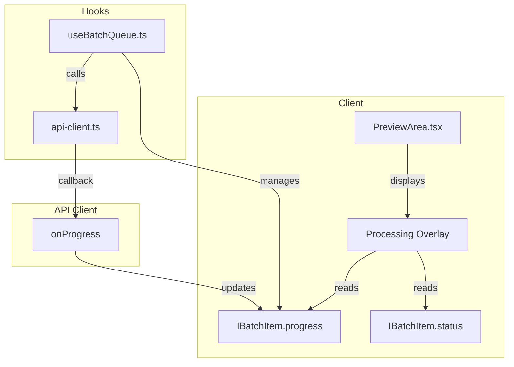
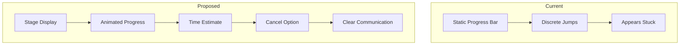
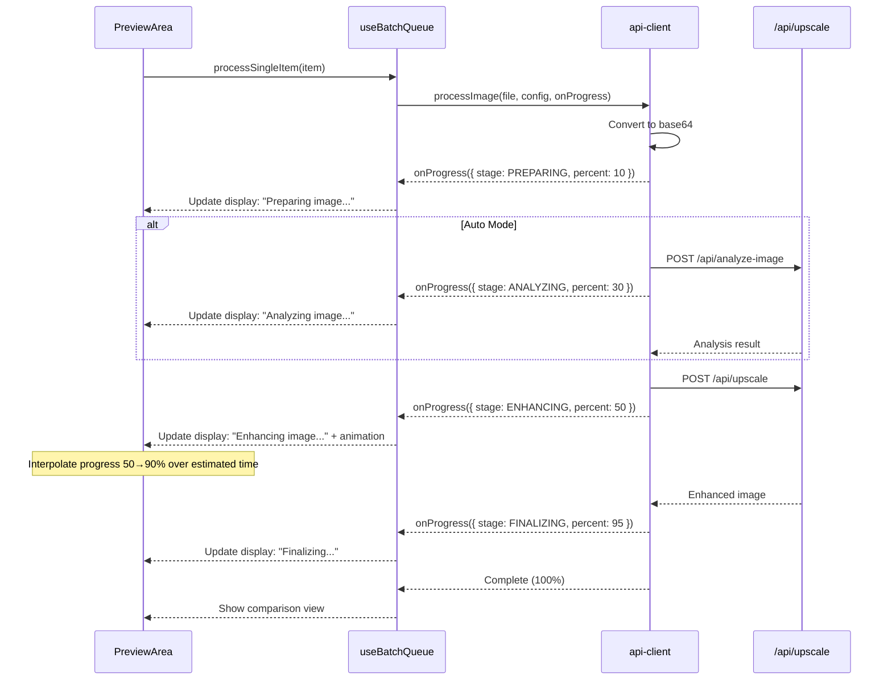

# PRD: Processing Progress UX Improvement

**Version**: 1.0
**Last Updated**: December 2025
**Status**: Draft
**Author**: Engineering Team

---

## 1. Context Analysis

### 1.1 Files Analyzed

- `/client/components/features/workspace/PreviewArea.tsx` (92 lines - processing overlay)
- `/client/hooks/myimageupscaler.com/useBatchQueue.ts` (157 lines - progress state management)
- `/client/utils/api-client.ts` (203 lines - progress callback origin)
- `/shared/types/myimageupscaler.com.ts` (IBatchItem, ProcessingStatus)

### 1.2 Component & Dependency Overview



### 1.3 Current Behavior Summary

- **Static text "Enhancing..."** displayed without context of what's happening
- **Discrete progress jumps**: 10% (base64) → 20-40% (analysis) → 50% (request sent) → 100% (complete)
- **Long stall at 50%**: API call can take 10-60+ seconds with no visual feedback
- **No stage indication**: User doesn't know if image is being analyzed, uploaded, or processed
- **No time estimate**: No indication of how long processing will take
- **No animation**: Progress bar only moves on discrete updates, appears frozen

### 1.4 Problem Statement

The "Enhancing..." modal provides poor user feedback during image processing, causing users to think the application is frozen during the 10-60 second API wait, leading to confusion and potential page refreshes that interrupt processing.

---

## 2. Proposed Solution

### 2.1 Architecture Summary

- **Stage-aware progress**: Display current processing stage (Preparing → Analyzing → Enhancing → Finalizing)
- **Indeterminate animation**: Add pulsing/shimmer animation during API wait to show activity
- **Estimated time display**: Show approximate time remaining based on model and image size
- **Progress interpolation**: Smoothly animate between discrete progress updates
- **Cancel option**: Allow users to cancel long-running operations

**Alternatives Considered:**

| Approach                             | Pros                | Cons                               | Decision                        |
| ------------------------------------ | ------------------- | ---------------------------------- | ------------------------------- |
| Server-sent events for real progress | Accurate progress   | Complex, Replicate doesn't support | Rejected                        |
| Fake progress animation              | Simple              | Inaccurate, still feels stuck      | Partial - use for interpolation |
| Stage-based display                  | Clear communication | Requires tracking stages           | **Selected**                    |
| Just add spinner                     | Minimal change      | Doesn't communicate progress       | Rejected                        |

### 2.2 Architecture Diagram



### 2.3 Key Technical Decisions

| Decision               | Choice                       | Rationale                                      |
| ---------------------- | ---------------------------- | ---------------------------------------------- |
| Progress interpolation | CSS transition + JS interval | Smooth visual feedback without backend changes |
| Stage tracking         | Enum in progress callback    | Minimal API change, clear state machine        |
| Time estimation        | Model-based lookup table     | Simple, no backend changes needed              |
| Animation              | Tailwind pulse/shimmer       | Consistent with existing design system         |
| Cancel mechanism       | AbortController              | Standard browser API, clean abort              |

### 2.4 Data Model Changes

**New TypeScript Types (extend existing):**

```typescript
// shared/types/myimageupscaler.com.ts

export enum ProcessingStage {
  PREPARING = 'preparing', // File encoding, validation
  ANALYZING = 'analyzing', // Image analysis (auto mode)
  ENHANCING = 'enhancing', // Main AI processing
  FINALIZING = 'finalizing', // Response handling
}

export interface IProcessingProgress {
  stage: ProcessingStage;
  percent: number;
  estimatedSecondsRemaining?: number;
}

// Update IBatchItem to include stage
export interface IBatchItem {
  id: string;
  file: File;
  previewUrl: string;
  processedUrl: string | null;
  status: ProcessingStatus;
  progress: number;
  stage?: ProcessingStage; // NEW
  error?: string;
}
```

---

### 2.5 Runtime Execution Flow



---

## 3. Detailed Implementation Spec

### A. `shared/types/myimageupscaler.com.ts` (MODIFY)

**Changes Needed:**

- Add `ProcessingStage` enum
- Add optional `stage` field to `IBatchItem`

```typescript
// Add after ProcessingStatus enum

export enum ProcessingStage {
  PREPARING = 'preparing',
  ANALYZING = 'analyzing',
  ENHANCING = 'enhancing',
  FINALIZING = 'finalizing',
}

// Update IBatchItem interface
export interface IBatchItem {
  id: string;
  file: File;
  previewUrl: string;
  processedUrl: string | null;
  status: ProcessingStatus;
  progress: number;
  stage?: ProcessingStage; // ADD THIS
  error?: string;
}
```

**Justification:** Minimal change to existing types, backwards compatible.

---

### B. `client/utils/api-client.ts` (MODIFY)

**Changes Needed:**

- Update `onProgress` callback signature to include stage
- Report stages during processing

```typescript
// Update callback type
type ProgressCallback = (progress: number, stage?: ProcessingStage) => void;

export const processImage = async (
  file: File,
  config: IUpscaleConfig,
  onProgress: ProgressCallback
): Promise<IProcessImageResult> => {
  try {
    // Stage 1: Preparing
    onProgress(10, ProcessingStage.PREPARING);
    const base64Data = await fileToBase64(file);

    let enhancementPrompt: string | undefined;
    let resolvedModel = config.selectedModel;

    if (config.selectedModel === 'auto') {
      // Stage 2: Analyzing
      onProgress(20, ProcessingStage.ANALYZING);
      try {
        const analysis = await analyzeImage(file, {
          allowExpensiveModels: config.allowExpensiveModels ?? false,
        });
        resolvedModel = analysis.recommendation.model as typeof config.selectedModel;
        enhancementPrompt = analysis.enhancementPrompt;
        onProgress(40, ProcessingStage.ANALYZING);
      } catch (error) {
        console.warn('Image analysis failed, falling back to default model:', error);
        resolvedModel = 'real-esrgan';
      }
    }

    // Stage 3: Enhancing (main API call)
    onProgress(50, ProcessingStage.ENHANCING);

    const accessToken = await getAccessToken();
    // ... existing auth logic ...

    const response = await fetch('/api/upscale', {
      method: 'POST',
      headers,
      body: JSON.stringify({
        imageData: base64Data,
        mimeType: file.type || 'image/jpeg',
        enhancementPrompt,
        config: { ...config, selectedModel: resolvedModel },
      }),
    });

    if (!response.ok) {
      const errorData = await response.json();
      throw new Error(errorData.error || 'Failed to process image');
    }

    // Stage 4: Finalizing
    onProgress(95, ProcessingStage.FINALIZING);

    const data = await response.json();
    onProgress(100, ProcessingStage.FINALIZING);

    return {
      imageData: data.imageData,
      creditsRemaining: data.processing?.creditsRemaining ?? 0,
      creditsUsed: data.processing?.creditsUsed ?? 0,
    };
  } catch (error) {
    console.error('AI Processing Error:', error);
    throw error;
  }
};
```

**Justification:** Reports processing stage alongside progress percentage.

---

### C. `client/hooks/myimageupscaler.com/useBatchQueue.ts` (MODIFY)

**Changes Needed:**

- Update `updateItemStatus` to include stage
- Pass stage from progress callback

```typescript
const processSingleItem = async (item: IBatchItem, config: IUpscaleConfig) => {
  updateItemStatus(item.id, {
    status: ProcessingStatus.PROCESSING,
    progress: 0,
    stage: ProcessingStage.PREPARING,
    error: undefined,
  });

  try {
    const result = await processImage(item.file, config, (p, stage) => {
      updateItemStatus(item.id, {
        progress: p,
        stage: stage || ProcessingStage.ENHANCING,
      });
    });

    updateItemStatus(item.id, {
      status: ProcessingStatus.COMPLETED,
      processedUrl: result.imageData,
      progress: 100,
      stage: undefined, // Clear stage on completion
    });

    useUserStore.getState().updateCreditsFromProcessing(result.creditsRemaining);
  } catch (error: unknown) {
    // ... existing error handling ...
  }
};
```

**Justification:** Passes stage information to UI for display.

---

### D. `client/components/features/workspace/PreviewArea.tsx` (MODIFY)

**Changes Needed:**

- Add stage-aware messaging
- Add progress interpolation during ENHANCING stage
- Add pulsing animation during API wait
- Add estimated time display

```typescript
import React, { useEffect, useState, useRef } from 'react';
import { Check, Layers, AlertTriangle, Loader2 } from 'lucide-react';
import ImageComparison from '@client/components/features/image-processing/ImageComparison';
import { Button } from '@client/components/ui/Button';
import { IBatchItem, ProcessingStatus, ProcessingStage } from '@shared/types/myimageupscaler.com';

// Estimated processing times by model (in seconds)
const MODEL_PROCESSING_TIMES: Record<string, number> = {
  'real-esrgan': 15,
  'gfpgan': 20,
  'nano-banana': 25,
  'clarity-upscaler': 30,
  'nano-banana-pro': 45,
  'auto': 35,  // Average
};

const STAGE_MESSAGES: Record<ProcessingStage, string> = {
  [ProcessingStage.PREPARING]: 'Preparing image...',
  [ProcessingStage.ANALYZING]: 'Analyzing image...',
  [ProcessingStage.ENHANCING]: 'Enhancing image...',
  [ProcessingStage.FINALIZING]: 'Finalizing...',
};

interface IPreviewAreaProps {
  activeItem: IBatchItem | null;
  onDownload: (url: string, filename: string) => void;
  onRetry: (item: IBatchItem) => void;
  selectedModel?: string;  // For time estimation
}

export const PreviewArea: React.FC<IPreviewAreaProps> = ({
  activeItem,
  onDownload,
  onRetry,
  selectedModel = 'auto',
}) => {
  // Interpolated progress for smooth animation
  const [displayProgress, setDisplayProgress] = useState(0);
  const [elapsedSeconds, setElapsedSeconds] = useState(0);
  const startTimeRef = useRef<number | null>(null);

  // Track elapsed time during processing
  useEffect(() => {
    if (activeItem?.status === ProcessingStatus.PROCESSING) {
      if (!startTimeRef.current) {
        startTimeRef.current = Date.now();
      }

      const interval = setInterval(() => {
        if (startTimeRef.current) {
          setElapsedSeconds(Math.floor((Date.now() - startTimeRef.current) / 1000));
        }
      }, 1000);

      return () => clearInterval(interval);
    } else {
      startTimeRef.current = null;
      setElapsedSeconds(0);
    }
  }, [activeItem?.status]);

  // Smooth progress interpolation during ENHANCING stage
  useEffect(() => {
    if (!activeItem) {
      setDisplayProgress(0);
      return;
    }

    const actualProgress = activeItem.progress;
    const stage = activeItem.stage;

    // During ENHANCING stage (50-95%), smoothly interpolate
    if (stage === ProcessingStage.ENHANCING && actualProgress === 50) {
      const estimatedTime = MODEL_PROCESSING_TIMES[selectedModel] || 30;
      const targetProgress = 90;  // Interpolate up to 90%

      const interval = setInterval(() => {
        setDisplayProgress(prev => {
          const elapsed = startTimeRef.current
            ? (Date.now() - startTimeRef.current) / 1000
            : 0;
          // Asymptotic approach: fast start, slow finish
          const ratio = Math.min(elapsed / estimatedTime, 0.95);
          const interpolated = 50 + (targetProgress - 50) * (1 - Math.pow(1 - ratio, 2));
          return Math.min(interpolated, targetProgress);
        });
      }, 100);

      return () => clearInterval(interval);
    } else {
      // For other stages, follow actual progress
      setDisplayProgress(actualProgress);
    }
  }, [activeItem?.progress, activeItem?.stage, selectedModel]);

  if (!activeItem) {
    return (
      <div className="text-slate-400 flex flex-col items-center">
        <Layers size={48} className="mb-4 opacity-50" />
        <p>Select an image from the queue below</p>
      </div>
    );
  }

  if (activeItem.status === ProcessingStatus.COMPLETED && activeItem.processedUrl) {
    return (
      <div className="w-full h-[65vh] min-h-[400px] flex flex-col">
        <div className="mb-4 flex justify-between items-center shrink-0">
          <div>
            <h3 className="text-sm font-medium text-slate-900">{activeItem.file.name}</h3>
            <span className="text-xs text-green-600 flex items-center gap-1">
              <Check size={12} /> Processing Complete
            </span>
          </div>
        </div>
        <div className="flex-grow relative min-h-0">
          <ImageComparison
            beforeUrl={activeItem.previewUrl}
            afterUrl={activeItem.processedUrl}
            onDownload={() => onDownload(activeItem.processedUrl!, activeItem.file.name)}
          />
        </div>
      </div>
    );
  }

  const estimatedTotalTime = MODEL_PROCESSING_TIMES[selectedModel] || 30;
  const estimatedRemaining = Math.max(0, estimatedTotalTime - elapsedSeconds);
  const stageMessage = activeItem.stage
    ? STAGE_MESSAGES[activeItem.stage]
    : 'Processing...';
  const isEnhancing = activeItem.stage === ProcessingStage.ENHANCING;

  return (
    <div className="relative w-full h-[65vh] min-h-[400px] max-w-5xl mx-auto bg-slate-100 rounded-xl border border-slate-200 overflow-hidden flex items-center justify-center">
      

      {/* Processing Overlay */}
      {activeItem.status === ProcessingStatus.PROCESSING && (
        <div className="absolute inset-0 bg-white/60 backdrop-blur-sm flex flex-col items-center justify-center">
          <div className="w-72 space-y-4 p-6 bg-white rounded-xl shadow-2xl border border-slate-100">
            {/* Stage indicator with spinner */}
            <div className="flex items-center gap-3">
              <Loader2
                size={20}
                className={`text-indigo-600 ${isEnhancing ? 'animate-spin' : 'animate-pulse'}`}
              />
              <span className="text-sm font-medium text-slate-900">
                {stageMessage}
              </span>
            </div>

            {/* Progress bar with smooth animation */}
            <div className="space-y-2">
              <div className="flex justify-between text-xs text-slate-500">
                <span>{Math.round(displayProgress)}%</span>
                {isEnhancing && estimatedRemaining > 0 && (
                  <span>~{estimatedRemaining}s remaining</span>
                )}
              </div>
              <div className="h-2 w-full bg-slate-100 rounded-full overflow-hidden">
                <div
                  className={`h-full bg-indigo-600 transition-all duration-300 ${
                    isEnhancing ? 'animate-pulse' : ''
                  }`}
                  style={{ width: `${displayProgress}%` }}
                />
              </div>
            </div>

            {/* Processing indicator dots during enhancing */}
            {isEnhancing && (
              <div className="flex justify-center gap-1 pt-2">
                <span className="w-1.5 h-1.5 bg-indigo-400 rounded-full animate-bounce" style={{ animationDelay: '0ms' }} />
                <span className="w-1.5 h-1.5 bg-indigo-400 rounded-full animate-bounce" style={{ animationDelay: '150ms' }} />
                <span className="w-1.5 h-1.5 bg-indigo-400 rounded-full animate-bounce" style={{ animationDelay: '300ms' }} />
              </div>
            )}

            {/* Stage description */}
            <p className="text-xs text-slate-400 text-center">
              {activeItem.stage === ProcessingStage.PREPARING && 'Encoding and validating your image'}
              {activeItem.stage === ProcessingStage.ANALYZING && 'AI is analyzing image quality'}
              {activeItem.stage === ProcessingStage.ENHANCING && 'AI model is enhancing your image'}
              {activeItem.stage === ProcessingStage.FINALIZING && 'Preparing your enhanced image'}
            </p>
          </div>
        </div>
      )}

      {/* Error Overlay */}
      {activeItem.status === ProcessingStatus.ERROR && (
        <div className="absolute inset-0 bg-white/50 backdrop-blur-sm flex items-center justify-center">
          <div className="bg-white p-6 rounded-xl shadow-xl border border-red-100 text-center max-w-md">
            <div className="w-12 h-12 bg-red-100 rounded-full flex items-center justify-center mx-auto mb-4 text-red-600">
              <AlertTriangle size={24} />
            </div>
            <h3 className="text-lg font-semibold text-slate-900 mb-2">Processing Failed</h3>
            <p className="text-slate-600 mb-4">{activeItem.error}</p>
            <Button size="sm" onClick={() => onRetry(activeItem)}>
              Try Again
            </Button>
          </div>
        </div>
      )}
    </div>
  );
};
```

**Justification:**

- Stage-aware messaging tells users exactly what's happening
- Progress interpolation provides smooth visual feedback during API wait
- Time estimation sets user expectations
- Animated dots/pulse show activity during long waits

---

## 4. Step-by-Step Execution Plan

### Phase 1: Type Updates (Shared)

- [ ] Add `ProcessingStage` enum to `shared/types/myimageupscaler.com.ts`
- [ ] Add optional `stage` field to `IBatchItem` interface

### Phase 2: API Client Updates

- [ ] Update `processImage` in `client/utils/api-client.ts` to report stages
- [ ] Update callback type to include stage parameter

### Phase 3: Hook Updates

- [ ] Update `useBatchQueue.ts` to pass stage information
- [ ] Update `updateItemStatus` calls to include stage

### Phase 4: UI Component Updates

- [ ] Implement progress interpolation logic in `PreviewArea.tsx`
- [ ] Add stage-aware messaging
- [ ] Add pulsing animation during enhancing stage
- [ ] Add estimated time remaining display
- [ ] Add animated processing indicator dots

### Phase 5: Testing & Validation

- [ ] Manual testing with various image sizes
- [ ] Verify smooth progress animation
- [ ] Verify stage messages display correctly
- [ ] Test with auto mode (full flow with analysis)
- [ ] Test with manual mode (skip analysis stage)
- [ ] Run `yarn verify` to ensure no regressions

---

## 5. Testing Strategy

### Unit Tests

```typescript
describe('PreviewArea Processing Overlay', () => {
  it('should display "Preparing image..." for PREPARING stage');
  it('should display "Analyzing image..." for ANALYZING stage');
  it('should display "Enhancing image..." for ENHANCING stage');
  it('should display "Finalizing..." for FINALIZING stage');
  it('should show animated spinner during processing');
  it('should show estimated time during ENHANCING stage');
  it('should interpolate progress smoothly during ENHANCING');
});
```

### Integration Tests

```typescript
describe('Image Processing Flow', () => {
  it('should transition through all stages during auto mode');
  it('should skip ANALYZING stage for manual model selection');
  it('should show progress updates without freezing');
  it('should complete successfully with all visual feedback');
});
```

### Edge Cases

| Scenario                       | Expected Behavior                                            |
| ------------------------------ | ------------------------------------------------------------ |
| Very fast processing (<5s)     | Stages transition quickly, no jarring jumps                  |
| Very slow processing (>60s)    | Time estimate shows realistic remaining, animation continues |
| Processing error mid-way       | Error overlay appears, stage clears                          |
| Page refresh during processing | Processing interrupted (expected)                            |
| Multiple items in batch        | Each item shows independent progress                         |

---

## 6. Acceptance Criteria

- [ ] Processing overlay shows current stage name (Preparing/Analyzing/Enhancing/Finalizing)
- [ ] Progress bar animates smoothly during API wait (no frozen appearance)
- [ ] Spinner icon is visible and animated during all processing stages
- [ ] Estimated time remaining displays during ENHANCING stage
- [ ] Stage-specific descriptions explain what's happening
- [ ] Animated dots/pulse visible during long ENHANCING stage
- [ ] No visual "stuck" appearance at any point during processing
- [ ] Existing functionality unchanged (process completes successfully)
- [ ] `yarn verify` passes with no errors

---

## 7. Verification & Rollback

### Success Criteria

| Metric                     | Target               | Measurement     |
| -------------------------- | -------------------- | --------------- |
| User perception of "stuck" | Eliminated           | User feedback   |
| Visual feedback continuity | Continuous animation | Manual testing  |
| Code complexity increase   | Minimal (~50 lines)  | Line count diff |

### Rollback Plan

1. **Revert commits**: Single PR with isolated changes
2. **No database changes**: Pure frontend change, instant rollback
3. **No API changes**: Backend unchanged, no coordination needed

---

## 8. Future Enhancements (Out of Scope)

These are **not** part of this PRD but could be considered later:

- **Cancel button**: Allow canceling in-progress operations (requires AbortController integration)
- **Server-sent events**: Real progress from Replicate API (if they add support)
- **Background processing**: Process in background, notify when complete
- **Queue progress**: Show overall batch progress (3/10 images complete)

---

_Last Updated: December 2025_
