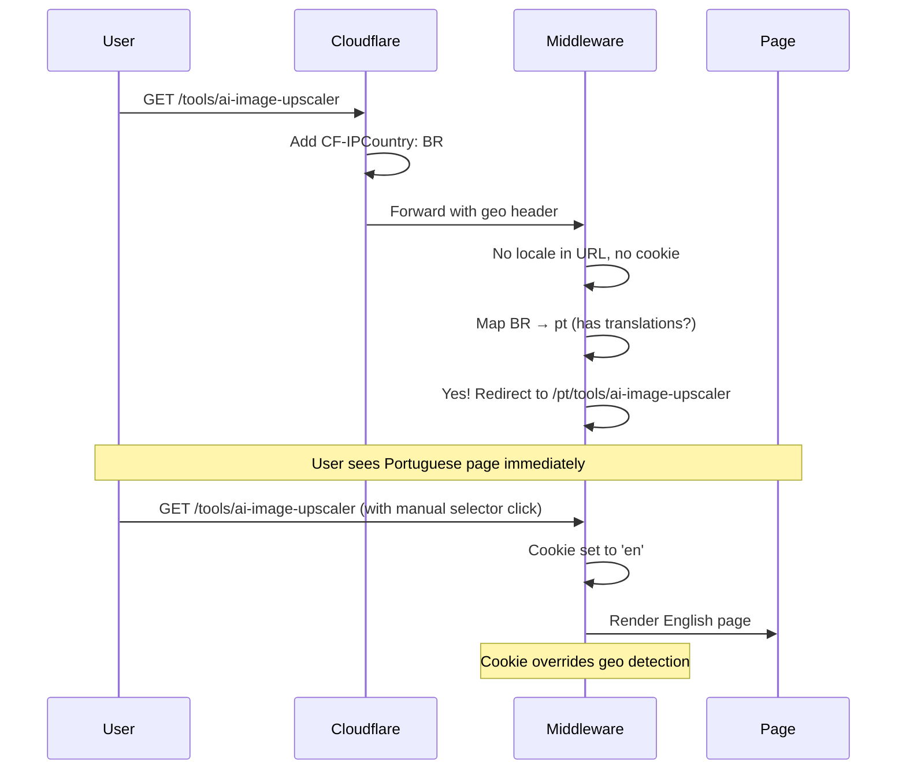
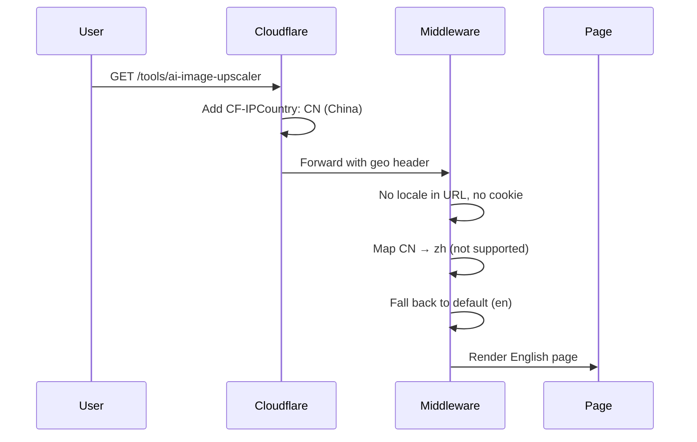
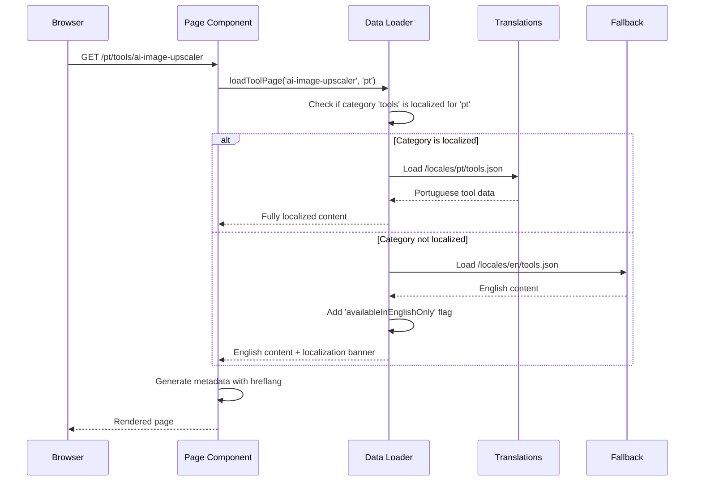

# pSEO + i18n Integration PRD

`Complexity: 3 → KISS mode (Auto-redirect only)`

---

| Field            | Value                                |
| ---------------- | ------------------------------------ |
| **Document ID**  | PRD-PSEO-I18N-001                    |
| **Version**      | 1.1                                  |
| **Status**       | Draft                                |
| **Created**      | 2026-01-07                           |
| **Author**       | Development Team                     |
| **Stakeholders** | Product, Engineering, Marketing, SEO |
| **Priority**     | P0 - International Growth            |

---

## 1. Context

**Problem:** The pSEO system generates 188+ English pages but lacks multi-language support, missing 65%+ of the global image upscaling market where competitors like upscale.media dominate with 22 languages.

**Files Analyzed:**

- `/i18n/config.ts` - Current locale configuration (en, es only)
- `/lib/seo/data-loader.ts` - pSEO data loading functions
- `/lib/seo/metadata-factory.ts` - Metadata generation with hreflang
- `/lib/i18n/pseo-translations.ts` - Existing pSEO translation loader
- `/app/seo/data/*.json` - 14 pSEO data files
- `/app/sitemap-*.xml/route.ts` - Category sitemaps
- `/middleware.ts` - Locale detection and routing (352 lines)
- `/locales/{en,es}/*.json` - Translation files

**Current Behavior:**

- i18n supports EN + ES only (via next-intl)
- pSEO pages exist at `/[locale]/(pseo)/[category]/[slug]`
- 188+ pSEO pages generated across 15 categories
- Middleware detects locale via URL > Cookie > Accept-Language
- Sitemaps include both EN and ES variants
- hreflang tags implemented for current locales

**Competitor Analysis Summary:**

| Competitor      | Languages | pSEO Pages | hreflang | Strategy                      |
| --------------- | --------- | ---------- | -------- | ----------------------------- |
| upscale.media   | 22        | 403        | Yes      | Full localization + pSEO      |
| picwish.com     | 11        | 275        | Partial  | Full pSEO localization        |
| icons8.com      | 10        | 150+       | Yes      | ccTLD + path-based            |
| bigjpg.com      | 13        | ~50        | No       | Basic i18n, no pSEO expansion |
| vanceai.com     | 4         | ~30        | No       | Client-side i18n (poor SEO)   |
| imgupscaler.com | 1         | ~20        | N/A      | English only                  |

**Key Insight:** upscale.media dominates international SEO with 22 languages. Their strategy: **localize core pages (176), keep long-tail pSEO in English (191)**. This hybrid approach balances quality with scale.

---

## 2. Solution

**Approach:**

- Expand from 2 → 7 languages (EN, ES, PT, DE, FR, IT, JA)
- Implement hybrid localization: translate high-traffic pSEO categories, keep long-tail in English
- Use Cloudflare's built-in IP geolocation (free, no external API) for **auto-redirect**
- **KISS**: Always auto-redirect based on geolocation, no cookies, no suggestion UI
- User can manually switch via language selector (sets cookie to override)
- If detected locale has no translations → default to English
- Generate language-specific sitemaps with proper hreflang
- Audit existing SEO to ensure no harm from changes

**Architecture Diagram:**

```mermaid
flowchart TB
    subgraph Request["Request Flow"]
        R[Request] --> CF[Cloudflare Edge]
        CF -->|Add CF-IPCountry header| MW[Middleware]
        MW -->|Detect Locale| LC{URL Locale?}
        LC -->|Yes| USE[Use URL Locale]
        LC -->|No| CK{Cookie?}
        CK -->|Yes| USE
        CK -->|No| GEO{CF-IPCountry?}
        GEO -->|Match Supported| REDIRECT[Redirect to /{locale}/...]
        GEO -->|No Match| DEF[Default: en]
    end

    subgraph PSEO["pSEO Generation"]
        DATA[JSON Data Files] --> LOADER[Data Loader]
        LOADER --> TRANSLATE{Is Localized Category?}
        TRANSLATE -->|Yes| LOCALIZED[Load /locales/{locale}/]
        TRANSLATE -->|No| ENGLISH[Load English + Banner]
    end

    subgraph Sitemap["Sitemap Generation"]
        SM[Sitemap Index] --> SM_EN[sitemap-{category}.xml]
        SM --> SM_ES[sitemap-{category}-es.xml]
        SM --> SM_PT[sitemap-{category}-pt.xml]
        SM --> SM_MORE[... more locales]
    end
```

**Key Decisions:**

- [x] Library: Continue with `next-intl` (already integrated)
- [x] Geolocation: Use Cloudflare `CF-IPCountry` header (free, no external API)
- [x] Auto-redirect: **Server-side redirect** in middleware - one redirect is SEO-safe
- [x] Hybrid strategy: Localize tools, formats, free, guides; keep comparisons/alternatives in English
- [x] Priority languages: PT, DE, FR, IT, JA (based on search volume + competitor gaps)
- [x] Sitemap strategy: Separate sitemaps per locale with index file
- [x] User override: Language selector sets cookie to bypass geo detection

**Data Changes:**

- Add translation files: `/locales/{pt,de,fr,it,ja}/*.json`
- No database changes (filesystem-based translations)
- Add country-to-locale mapping utility (no cookies for geo)

---

## 3. Sequence Flow

### Geolocation-Based Auto-Redirect



### Fallback to English



### pSEO Page Localization Flow



---

## 4. Execution Phases

### Phase 1: Geolocation Auto-Redirect & Infrastructure - Add geo detection and prepare expansion

**Files (3):**

- `lib/i18n/country-locale-map.ts` - Country to locale mapping
- `middleware.ts` - Add CF-IPCountry-based auto-redirect
- `i18n/config.ts` - Add new locale definitions (pt, de, fr, it, ja)

**Implementation:**

- [ ] Create country → locale mapping utility (BR→pt, DE→de, FR→fr, JP→ja, IT→it)
- [ ] Update middleware: add geo detection to `detectLocale()` function
- [ ] Auto-redirect logic: URL > Cookie > **CF-IPCountry** > Accept-Language > Default
- [ ] Fallback: if mapped locale not in SUPPORTED_LOCALES, use default
- [ ] Add PT, DE, FR, IT, JA to SUPPORTED_LOCALES

**Middleware Flow:**

```typescript
function detectLocale(req: NextRequest): Locale {
  // 1. Check URL path for locale prefix
  // 2. Check cookie (user manual override)
  // 3. Check CF-IPCountry header (NEW - auto-redirect)
  // 4. Check Accept-Language header
  // 5. Fallback to default (en)
}
```

**Tests Required:**

| Test File                            | Test Name                               | Assertion                                        |
| ------------------------------------ | --------------------------------------- | ------------------------------------------------ |
| `tests/unit/i18n/middleware.spec.ts` | `should redirect BR to pt`               | 302 redirect to /pt/...                          |
| `tests/unit/i18n/middleware.spec.ts` | `should fallback unsupported to en`      | CN (Chinese) → stays on English                  |
| `tests/unit/i18n/middleware.spec.ts` | `should respect cookie over geo`         | Cookie=en, Geo=BR → stays English                |

**User Verification:**

- Action: Visit site with VPN set to Brazil
- Expected: Auto-redirect to `/pt/...`

**⛔ CHECKPOINT 1**

---

### Phase 2: Priority Language Translations (PT, DE, FR) - Translate core pSEO categories

**Files (5 per language, 3 languages = phased):**

**Phase 2a: Portuguese (PT)**

- `locales/pt/common.json` - UI strings
- `locales/pt/tools.json` - Tool pages (10 pages)
- `locales/pt/formats.json` - Format pages (10 pages)
- `locales/pt/free.json` - Free tool pages (5 pages)
- `locales/pt/guides.json` - Guide pages (8 pages)

**Phase 2b: German (DE)**

- `locales/de/common.json`, `tools.json`, `formats.json`, `free.json`, `guides.json`

**Phase 2c: French (FR)**

- `locales/fr/common.json`, `tools.json`, `formats.json`, `free.json`, `guides.json`

**Implementation:**

- [ ] Create base translation structure from English files
- [ ] Translate tools category (high-traffic, 10 pages × 3 languages)
- [ ] Translate formats category (technical terms, 10 pages × 3 languages)
- [ ] Translate free category (conversion-focused, 5 pages × 3 languages)
- [ ] Translate guides category (educational, 8 pages × 3 languages)
- [ ] Quality review by native speakers (contractor/community)

**Content Strategy:**

| Category     | Translate? | Rationale                           |
| ------------ | ---------- | ----------------------------------- |
| tools        | Yes        | High traffic, direct conversions    |
| formats      | Yes        | Technical, good search volume       |
| free         | Yes        | High conversion intent              |
| guides       | Yes        | Educational, long-tail keywords     |
| scale        | Partial    | Numeric-heavy, simpler to translate |
| use-cases    | Phase 3    | Industry-specific, requires nuance  |
| compare      | No         | Brand names, English-dominated      |
| alternatives | No         | Brand names, English-dominated      |
| platforms    | No         | Tech platforms are English-centric  |

**Tests Required:**

| Test File                                | Test Name                         | Assertion                                   |
| ---------------------------------------- | --------------------------------- | ------------------------------------------- |
| `tests/e2e/pseo/localized-tools.spec.ts` | `should render PT tool page`      | Page shows Portuguese content               |
| `tests/e2e/pseo/localized-tools.spec.ts` | `should render DE tool page`      | Page shows German content                   |
| `tests/unit/seo/data-loader.spec.ts`     | `should load localized tool data` | `expect(data.title).toContain('IA')` for PT |

**User Verification:**

- Action: Visit `/pt/tools/ai-image-upscaler`
- Expected: Full Portuguese content, proper hreflang tags

**⛔ CHECKPOINT 2**

---

### Phase 3: Additional Languages (IT, JA) - Extend to Italian and Japanese

**Files (5 per language):**

- `locales/it/common.json`, `tools.json`, `formats.json`, `free.json`, `guides.json`
- `locales/ja/common.json`, `tools.json`, `formats.json`, `free.json`, `guides.json`

**Implementation:**

- [ ] Create Italian translations for priority categories
- [ ] Create Japanese translations for priority categories
- [ ] Add RTL consideration for future Arabic support
- [ ] Update locale config with new languages
- [ ] Generate sitemaps for new locales

**Japanese-Specific Considerations:**

- [ ] Use professional translation (not AI) for nuanced content
- [ ] Verify character encoding in JSON files (UTF-8)
- [ ] Test CJK text rendering in all templates
- [ ] Consider longer text in UI components

**Tests Required:**

| Test File                                | Test Name                    | Assertion                   |
| ---------------------------------------- | ---------------------------- | --------------------------- |
| `tests/e2e/pseo/localized-tools.spec.ts` | `should render JA tool page` | Page shows Japanese content |
| `tests/e2e/pseo/localized-tools.spec.ts` | `should render IT tool page` | Page shows Italian content  |

**User Verification:**

- Action: Visit `/ja/tools/ai-image-upscaler`
- Expected: Full Japanese content with proper character rendering

**⛔ CHECKPOINT 3**

---

### Phase 4: Sitemap & SEO Infrastructure - Generate multi-language sitemaps

**Files (4):**

- `app/sitemap.xml/route.ts` - Update sitemap index
- `lib/seo/sitemap-generator.ts` - Multi-locale sitemap generator
- `app/sitemap-tools-[locale].xml/route.ts` - Locale-specific category sitemaps
- `lib/seo/hreflang-validator.ts` - Validation utility

**Implementation:**

- [ ] Generate sitemap index pointing to all locale sitemaps
- [ ] Create locale-specific sitemaps: `sitemap-tools-pt.xml`, `sitemap-tools-de.xml`, etc.
- [ ] Include hreflang in sitemap entries (Google's preferred method)
- [ ] Add `<xhtml:link>` elements for language alternates
- [ ] Create hreflang validation script for CI/CD

**Sitemap Structure:**

```
/sitemap.xml (index)
├── /sitemap-static.xml (core pages, all locales)
├── /sitemap-tools.xml (English tools)
├── /sitemap-tools-es.xml
├── /sitemap-tools-pt.xml
├── /sitemap-tools-de.xml
├── /sitemap-tools-fr.xml
├── /sitemap-tools-it.xml
├── /sitemap-tools-ja.xml
├── /sitemap-formats.xml
├── /sitemap-formats-es.xml
├── ... (all localized categories)
├── /sitemap-compare.xml (English only)
├── /sitemap-alternatives.xml (English only)
└── /sitemap-blog.xml
```

**Tests Required:**

| Test File                                  | Test Name                    | Assertion                      |
| ------------------------------------------ | ---------------------------- | ------------------------------ |
| `tests/unit/seo/sitemap.spec.ts`           | `should include all locales` | 7 locale variants per category |
| `tests/unit/seo/sitemap.spec.ts`           | `should have valid hreflang` | All URLs have x-default + alts |
| `tests/e2e/seo/sitemap-validation.spec.ts` | `should return valid XML`    | XML parses without errors      |

**User Verification:**

- Action: Submit sitemap to Google Search Console
- Expected: All URLs indexed, no hreflang errors

**⛔ CHECKPOINT 4**

---

### Phase 5: Non-Localized Page Handling - Handle English-only pSEO gracefully

**Files (4):**

- `client/components/pseo/EnglishOnlyBanner.tsx` - Info banner component
- `lib/seo/localization-config.ts` - Define which categories are localized
- `lib/seo/data-loader.ts` - Add fallback logic
- `app/[locale]/(pseo)/compare/[slug]/page.tsx` - Update comparison pages

**Implementation:**

- [ ] Create `LOCALIZED_CATEGORIES` config: `['tools', 'formats', 'free', 'guides', 'scale']`
- [ ] Create `EnglishOnlyBanner` component with dismissible UI
- [ ] Update data loader to return `isLocalizedContent` flag
- [ ] Show subtle banner on non-localized pages: "This content is available in English"
- [ ] Ensure proper hreflang (x-default → EN version)

**Non-Localized Page Behavior:**

```typescript
// When user visits /pt/compare/myimageupscaler-vs-topaz
// 1. Page renders with English content
// 2. Show subtle banner: "Este conteúdo está disponível apenas em inglês"
// 3. hreflang points to EN as canonical
// 4. No SEO penalty (content matches hreflang)
```

**Tests Required:**

| Test File                             | Test Name                               | Assertion                                                 |
| ------------------------------------- | --------------------------------------- | --------------------------------------------------------- |
| `tests/e2e/pseo/english-only.spec.ts` | `should show banner on compare page`    | Banner visible on /pt/compare/\*                          |
| `tests/e2e/pseo/english-only.spec.ts` | `should not show banner on tools page`  | No banner on /pt/tools/\*                                 |
| `tests/unit/seo/data-loader.spec.ts`  | `should return isLocalizedContent flag` | `expect(data.isLocalizedContent).toBe(false)` for compare |

**User Verification:**

- Action: Visit `/pt/compare/myimageupscaler-vs-topaz`
- Expected: English content with Portuguese banner explaining

**⛔ CHECKPOINT 5**

---

### Phase 6: Final SEO Audit & Validation - Comprehensive SEO health check

**Files (3):**

- `scripts/seo-audit.ts` - Comprehensive audit script
- `tests/e2e/seo/full-audit.spec.ts` - E2E SEO validation
- `docs/SEO/i18n-audit-report.md` - Generated audit report

**Implementation:**

- [ ] Run full hreflang validation across all pages
- [ ] Verify canonical URLs for all locales
- [ ] Check for duplicate content issues
- [ ] Validate schema markup includes `inLanguage`
- [ ] Test Core Web Vitals for localized pages
- [ ] Submit all sitemaps to Google Search Console
- [ ] Monitor indexing for 2 weeks post-launch

**Audit Checklist:**

- [ ] All pages have unique `<title>` tags per locale
- [ ] All pages have unique `<meta description>` per locale
- [ ] hreflang tags include all supported locales + x-default
- [ ] Canonical URLs point to correct locale version
- [ ] No duplicate content warnings in GSC
- [ ] Schema markup includes `inLanguage` property
- [ ] Sitemaps are valid XML
- [ ] All URLs return 200 status
- [ ] No redirect chains
- [ ] Mobile usability passes for all locales

**Tests Required:**

| Test File                          | Test Name                            | Assertion                        |
| ---------------------------------- | ------------------------------------ | -------------------------------- |
| `tests/e2e/seo/full-audit.spec.ts` | `should have valid hreflang`         | All pages pass hreflang check    |
| `tests/e2e/seo/full-audit.spec.ts` | `should have unique meta per locale` | No duplicate titles/descriptions |
| `tests/e2e/seo/full-audit.spec.ts` | `should pass Core Web Vitals`        | LCP < 2.5s for all locales       |

**User Verification:**

- Action: Review Google Search Console after 2 weeks
- Expected: No hreflang errors, pages indexed for all locales

---

## 5. Testing Requirements

| Category    | Required Tests                                                                |
| ----------- | ----------------------------------------------------------------------------- |
| Unit        | Country mapping, hreflang generation, data loader with locale                  |
| Integration | Middleware geo detection + redirect, sitemap generation, translation loading  |
| E2E         | pSEO page rendering, SEO validation, sitemap accessibility                     |
| SEO         | hreflang validation, canonical checks, duplicate content detection             |

**Test naming:** `should [expected behavior] when [condition]`

---

## 6. Acceptance Criteria

- [ ] All 6 phases complete
- [ ] 7 languages supported (EN, ES, PT, DE, FR, IT, JA)
- [ ] Geolocation auto-redirect works without harming SEO
- [ ] 33+ localized pSEO pages per new language (tools, formats, free, guides)
- [ ] All sitemaps valid and submitted to GSC
- [ ] Zero hreflang errors in GSC
- [ ] `yarn verify` passes
- [ ] Core Web Vitals pass for all localized pages
- [ ] No ranking drop for existing EN/ES pages (monitor 30 days)

---

## 7. SEO Safety Checklist

### What This Implementation Does NOT Do (Intentionally)

| Anti-Pattern                | Why Avoided                                              |
| --------------------------- | -------------------------------------------------------- |
| IP-based content variation  | Different content for same URL = duplicate content risk   |
| Translate all pSEO pages    | Quality suffers, thin content risk                        |
| Remove English versions     | Lose backlinks, lose established rankings                 |
| Multiple redirect chains    | Hurts SEO, confuses crawlers                             |

### What This Implementation Does (Best Practices)

| Best Practice               | Implementation                                           |
| --------------------------- | ------------------------------------------------------- |
| Server-side geo redirect    | One redirect is SEO-safe, Googlebot gets consistent view |
| Consistent URL structure    | `/[locale]/[category]/[slug]` for all languages         |
| hreflang on every page      | Including x-default pointing to English                  |
| Locale in sitemap           | Separate sitemaps per locale with `<xhtml:link>`         |
| Canonical self-reference    | Each locale page is its own canonical                    |
| Graceful fallback           | Non-localized pages show English with info banner        |
| Cookie-based override        | User can manually switch, bypasses geo detection          |

### Why Auto-Redirect Is SEO-Safe

1. **Single redirect**: Google allows one redirect. Our middleware does ONE geo-based redirect.
2. **Consistent for Googlebot**: Googlebot crawls from US IP → gets English → consistent every time.
3. **hreflang in place**: Each page has hreflang pointing to all language variants.
4. **Canonical self-reference**: Each locale version canonicals to itself.
5. **User override available**: Language selector sets cookie, user can switch anytime.

---

## 8. Risk Assessment

| Risk                       | Probability | Impact | Mitigation                                            |
| -------------------------- | ----------- | ------ | ----------------------------------------------------- |
| Translation quality issues | Medium      | High   | AI + native speaker review, phased rollout            |
| hreflang misconfiguration  | Low         | High   | Automated validation in CI, GSC monitoring            |
| Indexing delays            | Medium      | Medium | Submit sitemaps immediately, use IndexNow             |
| Core Web Vitals regression | Low         | Medium | Pre-launch performance testing per locale             |
| Geo-detection inaccuracy   | Low         | Low    | Cloudflare's accuracy is 95%+, user can override      |
| Duplicate content flags    | Low         | High   | Proper hreflang, unique meta per locale               |
| Build time increase        | High        | Low    | ISR for non-EN pages, parallel sitemap generation     |

---

## 9. Technical Specifications

### Cloudflare Geolocation Integration

```typescript
// middleware.ts - Geolocation-based auto-redirect
import { getLocaleFromCountry } from '@lib/i18n/country-locale-map';
import { isValidLocale, DEFAULT_LOCALE, type Locale } from '@/i18n/config';

function detectLocale(req: NextRequest): Locale {
  const pathname = req.nextUrl.pathname;
  const segments = pathname.split('/').filter(Boolean);

  // 1. Check URL path for locale prefix
  if (segments.length > 0 && isValidLocale(segments[0])) {
    return segments[0] as Locale;
  }

  // 2. Check cookie (user manual override via language selector)
  const cookieLocale = req.cookies.get('locale')?.value;
  if (cookieLocale && isValidLocale(cookieLocale)) {
    return cookieLocale;
  }

  // 3. Check CF-IPCountry header (geolocation auto-redirect)
  const country = req.headers.get('CF-IPCountry');
  if (country) {
    const geoLocale = getLocaleFromCountry(country);
    if (geoLocale && isValidLocale(geoLocale)) {
      return geoLocale;
    }
  }

  // 4. Check Accept-Language header
  const acceptLanguage = req.headers.get('Accept-Language');
  if (acceptLanguage) {
    const preferredLocales = acceptLanguage
      .split(',')
      .map(lang => {
        const [locale, qValue] = lang.trim().split(';q=');
        const quality = qValue ? parseFloat(qValue) : 1;
        return { locale: locale.split('-')[0], quality };
      })
      .sort((a, b) => b.quality - a.quality);

    for (const { locale } of preferredLocales) {
      if (isValidLocale(locale)) {
        return locale as Locale;
      }
    }
  }

  // 5. Fallback to default
  return DEFAULT_LOCALE;
}
```

### Sitemap with hreflang

```xml
<!-- sitemap-tools-pt.xml -->
<?xml version="1.0" encoding="UTF-8"?>
<urlset xmlns="http://www.sitemaps.org/schemas/sitemap/0.9"
        xmlns:xhtml="http://www.w3.org/1999/xhtml">
  <url>
    <loc>https://myimageupscaler.com/pt/tools/ai-image-upscaler</loc>
    <lastmod>2026-01-07</lastmod>
    <changefreq>weekly</changefreq>
    <priority>0.9</priority>
    <xhtml:link rel="alternate" hreflang="en" href="https://myimageupscaler.com/tools/ai-image-upscaler"/>
    <xhtml:link rel="alternate" hreflang="es" href="https://myimageupscaler.com/es/tools/ai-image-upscaler"/>
    <xhtml:link rel="alternate" hreflang="pt" href="https://myimageupscaler.com/pt/tools/ai-image-upscaler"/>
    <xhtml:link rel="alternate" hreflang="de" href="https://myimageupscaler.com/de/tools/ai-image-upscaler"/>
    <xhtml:link rel="alternate" hreflang="fr" href="https://myimageupscaler.com/fr/tools/ai-image-upscaler"/>
    <xhtml:link rel="alternate" hreflang="it" href="https://myimageupscaler.com/it/tools/ai-image-upscaler"/>
    <xhtml:link rel="alternate" hreflang="ja" href="https://myimageupscaler.com/ja/tools/ai-image-upscaler"/>
    <xhtml:link rel="alternate" hreflang="x-default" href="https://myimageupscaler.com/tools/ai-image-upscaler"/>
  </url>
</urlset>
```

---

## 10. Dependencies

```json
{
  "dependencies": {
    "next-intl": "^4.7.0" // Already installed
  }
}
```

No new dependencies required. Uses:

- Cloudflare's built-in IP geolocation (free)
- Existing next-intl infrastructure
- Native cookie APIs

---

## 11. Success Metrics

| Metric                        | Baseline | Month 1 | Month 3 | Month 6 |
| ----------------------------- | -------- | ------- | ------- | ------- |
| Supported Languages           | 2        | 5       | 7       | 7+      |
| Localized pSEO Pages          | 188      | 350     | 500     | 600     |
| International Organic Traffic | 15%      | 25%     | 40%     | 50%     |
| hreflang Errors (GSC)         | 0        | 0       | 0       | 0       |
| Non-EN Conversions            | 10%      | 15%     | 25%     | 35%     |

---

## 12. Future Expansion (Out of Scope)

After 7 languages stable:

1. Add ZH (Chinese), KO (Korean), RU (Russian) - Asian market expansion
2. Add AR (Arabic) with RTL support
3. Add HI (Hindi), ID (Indonesian) - Emerging markets
4. Consider professional translation for high-value pages
5. Implement locale-specific pricing display
6. Add locale-specific testimonials/reviews

---

## Appendix A: Language Priority Matrix

| Language   | Code | Search Volume | Competitor Coverage | Priority |
| ---------- | ---- | ------------- | ------------------- | -------- |
| Portuguese | pt   | High          | Low (upscale.media) | P0       |
| German     | de   | High          | Medium              | P0       |
| French     | fr   | High          | Medium              | P0       |
| Italian    | it   | Medium        | Low                 | P1       |
| Japanese   | ja   | High          | Low                 | P1       |
| Korean     | ko   | Medium        | Low                 | P2       |
| Chinese    | zh   | Very High     | Medium              | P2       |
| Russian    | ru   | Medium        | Low                 | P2       |

---

## Appendix B: Country to Locale Mapping

```typescript
export const COUNTRY_LOCALE_MAP: Record<string, Locale> = {
  // Portuguese
  BR: 'pt',
  PT: 'pt',
  AO: 'pt',
  MZ: 'pt',

  // German
  DE: 'de',
  AT: 'de',
  CH: 'de',
  LI: 'de',

  // French
  FR: 'fr',
  BE: 'fr',
  CA: 'fr',
  CH: 'fr',
  LU: 'fr',

  // Italian
  IT: 'it',
  SM: 'it',
  VA: 'it',

  // Japanese
  JP: 'ja',

  // Spanish (already supported)
  ES: 'es',
  MX: 'es',
  AR: 'es',
  CO: 'es',
  CL: 'es',
  PE: 'es',
  VE: 'es',

  // Default to English for others
  // US, GB, AU, NZ, etc. → 'en' (default)
};
```

---

## Appendix C: Competitor Research Sources

Research conducted using:

- [Competitor i18n/pSEO Analysis](../research/competitor-i18n-pseo-analysis-2026-01-07.md)
- [Quick Reference Guide](../research/i18n-quick-reference.md)

Key competitors analyzed:

- upscale.media (22 languages, industry leader)
- picwish.com (11 languages, full localization)
- icons8.com (10 languages, ccTLD approach)
- bigjpg.com (13 languages, no hreflang)
- vanceai.com (4 languages, client-side only)

---

## Document Changelog

| Version | Date       | Author           | Changes                                      |
| ------- | ---------- | ---------------- | -------------------------------------------- |
| 1.1     | 2026-01-07 | Development Team | Simplified to KISS approach: auto-redirect only, no suggestion UI |
| 1.0     | 2026-01-07 | Development Team | Initial PRD creation                        |
