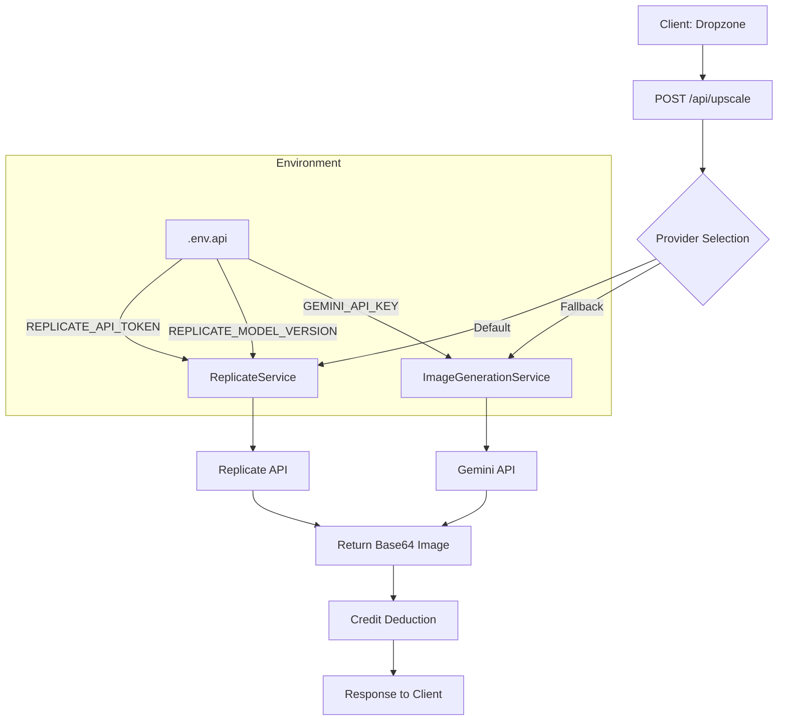
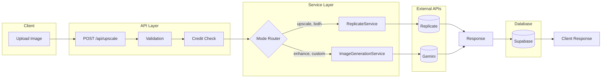
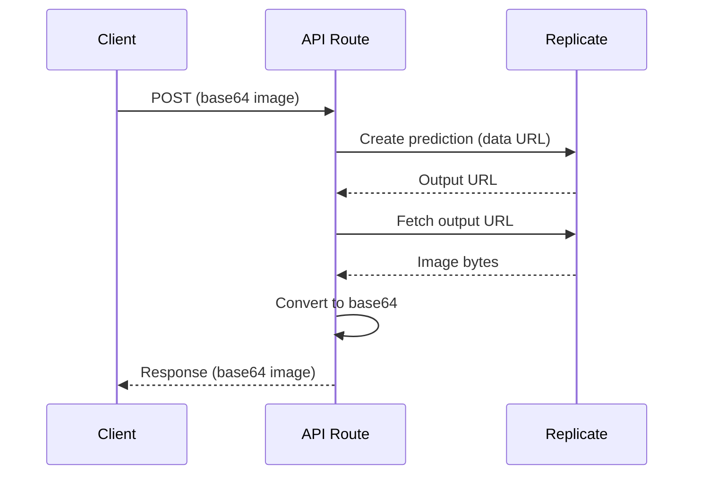
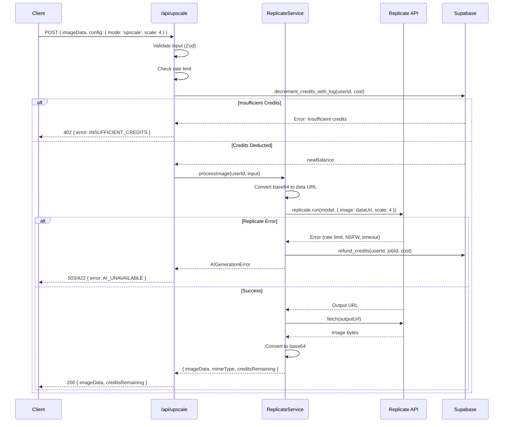
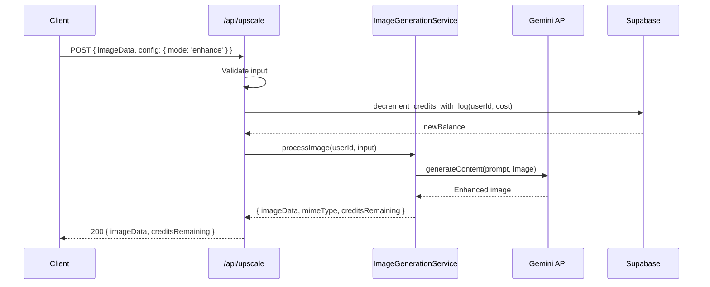

# PRD: Real-ESRGAN Integration via Replicate API

**Version:** 1.0
**Status:** Draft
**Date:** December 4, 2025
**Author:** Principal Architect

---

## Executive Summary

This PRD outlines the integration of Real-ESRGAN image upscaling via Replicate API as the primary processing backend for PixelPerfect. This addresses the critical unit economics issues identified in the pricing audit, reducing per-image cost from **$0.13 (Gemini)** to **$0.0017 (Real-ESRGAN)** - a **76x cost reduction** enabling 94-98% gross margins.

### Key Benefits

| Metric            | Current (Gemini) | Proposed (Real-ESRGAN) | Improvement       |
| ----------------- | ---------------- | ---------------------- | ----------------- |
| Cost per image    | $0.13            | $0.0017                | **76x cheaper**   |
| Hobby plan margin | -36.8% (loss)    | +98.2%                 | **Profitable**    |
| Pro plan margin   | -165.3% (loss)   | +96.5%                 | **Profitable**    |
| Processing time   | 5-10s            | 1-2s                   | **3-5x faster**   |
| Upscale factor    | Prompt-based     | Native 2x/4x           | **Deterministic** |

---

## 1. Context Analysis

### 1.1 Files Analyzed

```
/home/joao/projects/pixelperfect/server/services/image-generation.service.ts
/home/joao/projects/pixelperfect/app/api/upscale/route.ts
/home/joao/projects/pixelperfect/shared/config/env.ts
/home/joao/projects/pixelperfect/shared/config/subscription.config.ts
/home/joao/projects/pixelperfect/shared/config/subscription.utils.ts
/home/joao/projects/pixelperfect/shared/validation/upscale.schema.ts
/home/joao/projects/pixelperfect/shared/types/pixelperfect.ts
/home/joao/projects/pixelperfect/.env.api.example
/home/joao/projects/pixelperfect/docs/PRDs/pricing-strategy-economics-audit.md
```

### 1.2 Component & Dependency Overview



### 1.3 Current Behavior Summary

- **Image Processing Service:** `ImageGenerationService` uses Gemini 2.5 Flash for prompt-based upscaling
- **Cost:** $0.13 per image (loss-making at full utilization)
- **Processing:** Prompt-based generation; non-deterministic upscale factors
- **Credit System:** Atomic deduction via `decrement_credits_with_log` RPC with refund on failure
- **Error Handling:** Custom error classes (`InsufficientCreditsError`, `AIGenerationError`)

### 1.4 Problem Statement

The current Gemini-based implementation costs $0.13/image, creating negative margins (-36% to -336%) at full credit utilization. Real-ESRGAN via Replicate costs $0.0017/image, enabling 94-98% gross margins while providing faster, more deterministic upscaling.

---

## 2. Proposed Solution

### 2.1 Architecture Summary

- **Primary Provider:** Real-ESRGAN via Replicate API as the default upscaling backend
- **Model Configurability:** Model version stored in environment variable for easy switching
- **Provider Abstraction:** New `ReplicateService` following existing `ImageGenerationService` patterns
- **Fallback Strategy:** Optional fallback to Gemini for "enhance" mode (creative improvements)
- **Zero UI Changes:** Backend-only change; existing client code works unchanged

**Alternatives Considered:**

| Alternative                | Rejected Because                                      |
| -------------------------- | ----------------------------------------------------- |
| Self-hosted Real-ESRGAN    | Requires GPU infrastructure; higher ops complexity    |
| Banana.dev                 | Higher cost ($0.13); no significant advantage         |
| Keep Gemini only           | Unsustainable unit economics; -36% to -336% margins   |
| Switch all modes to ESRGAN | Loses creative enhancement capability Gemini provides |

### 2.2 Architecture Diagram



### 2.3 Key Technical Decisions

#### 2.3.1 Replicate SDK vs HTTP

**Decision:** Use official `replicate` npm package

```typescript
// Official SDK - cleaner API, better TypeScript support
import Replicate from 'replicate';
const replicate = new Replicate({ auth: serverEnv.REPLICATE_API_TOKEN });
```

**Rationale:**

- Official support and maintenance
- Built-in retry logic and error handling
- TypeScript types included
- Webhook support for async processing (future)

#### 2.3.2 Model Configuration Strategy

**Decision:** Store model version in environment variable with sensible default

```typescript
// .env.api
REPLICATE_API_TOKEN=r8_xxxxx
REPLICATE_MODEL_VERSION=nightmareai/real-esrgan:f121d640bd286e1fdc67f9799164c1d5be36ff74576ee11c803ae5b665dd46aa

// In code - with default fallback
const modelVersion = serverEnv.REPLICATE_MODEL_VERSION ||
  'nightmareai/real-esrgan:f121d640bd286e1fdc67f9799164c1d5be36ff74576ee11c803ae5b665dd46aa';
```

**Rationale:**

- Easy model switching without code changes
- Can A/B test different models
- Supports version pinning for stability
- Default ensures zero-config development

#### 2.3.3 Image Transfer Strategy

**Decision:** Base64 in, URL out, fetch to Base64



**Rationale:**

- Matches existing API contract (base64 in/out)
- No storage infrastructure needed
- Client code unchanged
- Replicate output URLs are temporary (expire)

#### 2.3.4 Mode Routing Strategy

**Decision:** Route by processing mode

| Mode      | Provider  | Rationale                                |
| --------- | --------- | ---------------------------------------- |
| `upscale` | Replicate | Pure upscaling; ESRGAN excels at this    |
| `both`    | Replicate | Upscale + denoise; ESRGAN handles well   |
| `enhance` | Gemini    | Creative enhancement; needs LLM          |
| `custom`  | Gemini    | Custom prompts require LLM understanding |

**Future Option:** Add `quality` parameter for explicit provider selection.

#### 2.3.5 Error Handling Strategy

**Decision:** Map Replicate errors to existing error types

```typescript
try {
  const output = await replicate.run(model, { input });
} catch (error) {
  if (error.message?.includes('rate limit')) {
    throw new AIGenerationError('Service temporarily unavailable', 'RATE_LIMITED');
  }
  if (error.message?.includes('NSFW')) {
    throw new AIGenerationError('Image flagged by safety filter', 'SAFETY');
  }
  throw new AIGenerationError(`Upscale failed: ${error.message}`, 'PROCESSING_FAILED');
}
```

### 2.4 Data Model Changes

**No database schema changes required.**

Environment variable additions only:

```env
# .env.api additions
REPLICATE_API_TOKEN=r8_xxxxx
REPLICATE_MODEL_VERSION=nightmareai/real-esrgan:f121d640bd286e1fdc67f9799164c1d5be36ff74576ee11c803ae5b665dd46aa
```

---

## 2.5 Runtime Execution Flow

### 2.5.1 Upscale Mode (Replicate Path)



### 2.5.2 Enhance Mode (Gemini Path - Unchanged)



---

## 3. Detailed Implementation Spec

### A. `shared/config/env.ts`

**Changes Needed:** Add Replicate environment variables to server schema

```typescript
// Add to serverEnvSchema (around line 84)
const serverEnvSchema = z.object({
  // ... existing fields ...

  // Replicate AI (Image Upscaling)
  REPLICATE_API_TOKEN: z.string().default(''),
  REPLICATE_MODEL_VERSION: z
    .string()
    .default(
      'nightmareai/real-esrgan:f121d640bd286e1fdc67f9799164c1d5be36ff74576ee11c803ae5b665dd46aa'
    ),
});

// Add to loadServerEnv function (around line 107)
function loadServerEnv(): IServerEnv {
  const env = {
    // ... existing fields ...

    // Replicate AI
    REPLICATE_API_TOKEN: process.env.REPLICATE_API_TOKEN || '',
    REPLICATE_MODEL_VERSION:
      process.env.REPLICATE_MODEL_VERSION ||
      'nightmareai/real-esrgan:f121d640bd286e1fdc67f9799164c1d5be36ff74576ee11c803ae5b665dd46aa',
  };

  return serverEnvSchema.parse(env);
}
```

**Justification:** Follows existing pattern of Zod-validated env vars with sensible defaults. Model version as env var enables hot-swapping without deploys.

---

### B. `server/services/replicate.service.ts` (New File)

**Purpose:** Encapsulate Replicate API integration for image upscaling

```typescript
import Replicate from 'replicate';
import { serverEnv } from '@shared/config/env';
import { supabaseAdmin } from '@server/supabase/supabaseAdmin';
import type { IUpscaleInput } from '@shared/validation/upscale.schema';
import { calculateCreditCost } from './image-generation.service';

/**
 * Custom error for Replicate-specific failures
 */
export class ReplicateError extends Error {
  public readonly code: string;

  constructor(message: string, code: string = 'REPLICATE_ERROR') {
    super(message);
    this.name = 'ReplicateError';
    this.code = code;
  }
}

/**
 * Result from a successful Replicate upscale
 */
export interface IReplicateResult {
  imageData: string; // base64 data URL
  mimeType: string; // image/png typically
  creditsRemaining: number;
}

/**
 * Replicate API input for Real-ESRGAN
 */
interface IRealEsrganInput {
  image: string; // URL or data URL
  scale?: number; // 2 or 4 (default 4)
  face_enhance?: boolean; // Use GFPGAN for faces
}

/**
 * Service for image upscaling via Replicate Real-ESRGAN
 *
 * Cost: ~$0.0017/image on T4 GPU
 * Speed: ~1-2 seconds per image
 */
export class ReplicateService {
  private replicate: Replicate;
  private modelVersion: string;

  constructor() {
    const apiToken = serverEnv.REPLICATE_API_TOKEN;
    if (!apiToken) {
      throw new Error('REPLICATE_API_TOKEN is not configured');
    }

    this.replicate = new Replicate({ auth: apiToken });
    this.modelVersion = serverEnv.REPLICATE_MODEL_VERSION;
  }

  /**
   * Process an image upscale request via Replicate
   *
   * @param userId - The authenticated user's ID
   * @param input - The validated upscale input
   * @returns The upscaled image data and remaining credits
   * @throws InsufficientCreditsError if user has no credits
   * @throws ReplicateError if API call fails
   */
  async processImage(userId: string, input: IUpscaleInput): Promise<IReplicateResult> {
    const jobId = `rep_${Date.now()}_${Math.random().toString(36).slice(2, 9)}`;
    const creditCost = calculateCreditCost(input.config);

    // Step 1: Deduct credits atomically
    const { data: newBalance, error: creditError } = await supabaseAdmin.rpc(
      'decrement_credits_with_log',
      {
        target_user_id: userId,
        amount: creditCost,
        transaction_type: 'usage',
        ref_id: jobId,
        description: `Image upscale via Replicate (${creditCost} credits)`,
      }
    );

    if (creditError) {
      if (creditError.message?.includes('Insufficient credits')) {
        const { InsufficientCreditsError } = await import('./image-generation.service');
        throw new InsufficientCreditsError(creditError.message);
      }
      throw new Error(`Failed to deduct credits: ${creditError.message}`);
    }

    try {
      // Step 2: Call Replicate API
      const result = await this.callReplicate(input);

      return {
        ...result,
        creditsRemaining: newBalance,
      };
    } catch (error) {
      // Step 3: Refund on failure
      await this.refundCredits(userId, jobId, creditCost);
      throw error;
    }
  }

  /**
   * Refund credits for a failed upscale
   */
  private async refundCredits(userId: string, jobId: string, amount: number): Promise<void> {
    const { error } = await supabaseAdmin.rpc('refund_credits', {
      target_user_id: userId,
      amount,
      job_id: jobId,
    });

    if (error) {
      console.error('Failed to refund credits:', error);
    }
  }

  /**
   * Call the Replicate Real-ESRGAN model
   */
  private async callReplicate(
    input: IUpscaleInput
  ): Promise<{ imageData: string; mimeType: string }> {
    // Prepare image data - ensure it's a data URL
    let imageDataUrl = input.imageData;
    if (!imageDataUrl.startsWith('data:')) {
      const mimeType = input.mimeType || 'image/jpeg';
      imageDataUrl = `data:${mimeType};base64,${imageDataUrl}`;
    }

    // Map scale factor (2 or 4)
    const scale = input.config.scale === 2 ? 2 : 4;

    // Prepare Replicate input
    const replicateInput: IRealEsrganInput = {
      image: imageDataUrl,
      scale,
      face_enhance: input.config.enhanceFace || false,
    };

    try {
      // Run the model - returns output URL(s)
      const output = await this.replicate.run(
        this.modelVersion as `${string}/${string}:${string}`,
        { input: replicateInput }
      );

      // Output is typically a string URL or array of URLs
      const outputUrl = Array.isArray(output) ? output[0] : output;

      if (!outputUrl || typeof outputUrl !== 'string') {
        throw new ReplicateError('No output URL returned from Replicate', 'NO_OUTPUT');
      }

      // Fetch the output image
      const imageResponse = await fetch(outputUrl);

      if (!imageResponse.ok) {
        throw new ReplicateError(
          `Failed to fetch output image: ${imageResponse.status}`,
          'FETCH_FAILED'
        );
      }

      // Convert to base64
      const imageBuffer = await imageResponse.arrayBuffer();
      const base64 = Buffer.from(imageBuffer).toString('base64');

      // Determine mime type from response or URL
      const contentType = imageResponse.headers.get('content-type') || 'image/png';

      return {
        imageData: `data:${contentType};base64,${base64}`,
        mimeType: contentType,
      };
    } catch (error) {
      // Map Replicate-specific errors
      const message = error instanceof Error ? error.message : String(error);

      if (message.includes('rate limit') || message.includes('429')) {
        throw new ReplicateError(
          'Replicate rate limit exceeded. Please try again.',
          'RATE_LIMITED'
        );
      }

      if (message.includes('NSFW') || message.includes('safety')) {
        throw new ReplicateError('Image flagged by safety filter.', 'SAFETY');
      }

      if (message.includes('timeout') || message.includes('timed out')) {
        throw new ReplicateError('Processing timed out. Please try a smaller image.', 'TIMEOUT');
      }

      if (error instanceof ReplicateError) {
        throw error;
      }

      throw new ReplicateError(`Upscale failed: ${message}`, 'PROCESSING_FAILED');
    }
  }
}

// Export singleton for convenience
let replicateServiceInstance: ReplicateService | null = null;

export function getReplicateService(): ReplicateService {
  if (!replicateServiceInstance) {
    replicateServiceInstance = new ReplicateService();
  }
  return replicateServiceInstance;
}
```

**Justification:**

- Follows existing `ImageGenerationService` patterns exactly
- Same credit management flow (deduct → process → refund on error)
- Singleton pattern matches existing service
- Comprehensive error mapping

---

### C. `app/api/upscale/route.ts`

**Changes Needed:** Add provider routing based on mode

```typescript
// Add import at top
import { getReplicateService, ReplicateError } from '@server/services/replicate.service';

// In the POST handler, after validation and rate limiting, replace the service call:

// Determine which service to use based on mode
const useReplicate = ['upscale', 'both'].includes(validatedInput.config.mode);

let result: IGenerationResult;

if (useReplicate && serverEnv.REPLICATE_API_TOKEN) {
  // Use Replicate for pure upscaling
  try {
    const replicateService = getReplicateService();
    result = await replicateService.processImage(userId, validatedInput);
  } catch (error) {
    // Fall back to Gemini if Replicate fails and we have Gemini configured
    if (serverEnv.GEMINI_API_KEY && !(error instanceof InsufficientCreditsError)) {
      logger.warn('Replicate failed, falling back to Gemini', {
        error: error instanceof Error ? error.message : String(error),
      });
      const service = new ImageGenerationService();
      result = await service.processImage(userId, validatedInput);
    } else {
      throw error;
    }
  }
} else {
  // Use Gemini for enhance/custom modes or if Replicate not configured
  const service = new ImageGenerationService();
  result = await service.processImage(userId, validatedInput);
}

// Update error handling to include ReplicateError
// In the catch block, add:
if (error instanceof ReplicateError) {
  await logger.flush();
  const statusCode = error.code === 'RATE_LIMITED' ? 429 : error.code === 'SAFETY' ? 422 : 503;
  return NextResponse.json(
    { success: false, error: { code: error.code, message: error.message } },
    { status: statusCode }
  );
}
```

**Justification:**

- Minimal changes to existing route
- Graceful fallback to Gemini
- Mode-based routing keeps creative enhancement on Gemini
- Error handling follows existing patterns

---

### D. `.env.api.example`

**Changes Needed:** Add Replicate configuration

```env
# Add after Gemini section (around line 22)

# Replicate AI (Image Upscaling)
# Get from: https://replicate.com/account/api-tokens
REPLICATE_API_TOKEN=r8_xxxxx
# Optional: Pin to specific model version
# Default: nightmareai/real-esrgan (latest stable)
# Other options:
#   - cjwbw/real-esrgan (alternative)
#   - sczhou/codeformer (face restoration focus)
REPLICATE_MODEL_VERSION=nightmareai/real-esrgan:f121d640bd286e1fdc67f9799164c1d5be36ff74576ee11c803ae5b665dd46aa
```

---

### E. `package.json`

**Changes Needed:** Add Replicate SDK dependency

```json
{
  "dependencies": {
    "replicate": "^1.0.1"
  }
}
```

**Install Command:**

```bash
yarn add replicate
```

---

## 4. Step-by-Step Execution Plan

### Phase 1: Infrastructure Setup

- [ ] Add `replicate` package to dependencies (`yarn add replicate`)
- [ ] Update `.env.api.example` with Replicate variables
- [ ] Update `shared/config/env.ts` with new server env vars
- [ ] Create local `.env.api` with Replicate API token for testing

### Phase 2: Service Implementation

- [ ] Create `server/services/replicate.service.ts`
- [ ] Add unit tests for `ReplicateService`
- [ ] Test locally with actual Replicate API

### Phase 3: API Integration

- [ ] Update `app/api/upscale/route.ts` with provider routing
- [ ] Add `ReplicateError` to error handling
- [ ] Test all four modes (`upscale`, `enhance`, `both`, `custom`)
- [ ] Verify credit deduction and refund flows

### Phase 4: Deployment & Monitoring

- [ ] Add `REPLICATE_API_TOKEN` to Cloudflare environment
- [ ] Add `REPLICATE_MODEL_VERSION` to Cloudflare environment
- [ ] Deploy to staging
- [ ] Run E2E tests against staging
- [ ] Monitor Replicate API usage and costs
- [ ] Deploy to production

### Phase 5: Documentation

- [ ] Update `docs/management/ROADMAP.md`
- [ ] Add Replicate setup guide to `docs/guides/`
- [ ] Document model version options

---

## 5. Testing Strategy

### 5.1 Unit Tests

**File:** `server/services/__tests__/replicate.service.test.ts`

```typescript
describe('ReplicateService', () => {
  describe('processImage', () => {
    it('should deduct credits before processing');
    it('should refund credits on API failure');
    it('should convert base64 input to data URL');
    it('should fetch and convert output URL to base64');
    it('should pass scale factor correctly (2x, 4x)');
    it('should enable face_enhance when configured');
  });

  describe('error handling', () => {
    it('should throw InsufficientCreditsError for no credits');
    it('should map rate limit errors correctly');
    it('should map NSFW/safety errors correctly');
    it('should map timeout errors correctly');
  });
});
```

### 5.2 Integration Tests

**File:** `app/api/upscale/__tests__/route.integration.test.ts`

```typescript
describe('POST /api/upscale', () => {
  describe('with Replicate', () => {
    it('should use Replicate for upscale mode');
    it('should use Replicate for both mode');
    it('should use Gemini for enhance mode');
    it('should use Gemini for custom mode');
    it('should fall back to Gemini if Replicate fails');
  });
});
```

### 5.3 E2E Tests

Use `e2e-test-writer` agent to create:

- Test upscaling a small image (2x, 4x)
- Test with face enhancement enabled
- Test error scenarios (invalid image, rate limit simulation)
- Test credit deduction appears in transaction history

### 5.4 Edge Cases

| Scenario                        | Expected Behavior                                    |
| ------------------------------- | ---------------------------------------------------- |
| No REPLICATE_API_TOKEN          | Falls back to Gemini silently                        |
| Replicate rate limited          | Returns 429 with retry info                          |
| Image flagged as NSFW           | Returns 422 with safety error                        |
| Replicate timeout               | Refunds credits, returns 503                         |
| Output URL expired before fetch | Refunds credits, returns 503                         |
| Very large image (>10MB)        | Handled by existing validation (25MB limit for paid) |
| Concurrent requests same user   | Each gets own credit transaction                     |

---

## 6. Acceptance Criteria

- [ ] Real-ESRGAN upscaling works for `upscale` and `both` modes
- [ ] Model version configurable via `REPLICATE_MODEL_VERSION` env var
- [ ] Credits deducted before processing, refunded on failure
- [ ] Fallback to Gemini when Replicate unavailable
- [ ] Processing time < 3 seconds for typical images
- [ ] All existing unit and E2E tests pass
- [ ] No client-side code changes required
- [ ] Error messages user-friendly and actionable
- [ ] Baselime logging captures provider used

---

## 7. Verification & Rollback

### 7.1 Success Criteria

| Metric            | Target               | Verification Method         |
| ----------------- | -------------------- | --------------------------- |
| API response time | < 3s (p95)           | Baselime dashboard          |
| Error rate        | < 1%                 | Baselime alerts             |
| Credit accuracy   | 100% (no leakage)    | Credit audit query          |
| Cost per image    | < $0.005             | Replicate billing dashboard |
| Image quality     | Comparable to Gemini | Manual QA review            |

### 7.2 Rollback Plan

**Immediate Rollback (< 5 minutes):**

1. Remove `REPLICATE_API_TOKEN` from Cloudflare env vars
2. All requests automatically fall back to Gemini

**Code Rollback:**

1. Revert API route changes (single file)
2. Service file can remain (unused without env var)

### 7.3 Monitoring Queries

```sql
-- Credit leakage check (should return 0)
SELECT COUNT(*)
FROM credit_transactions
WHERE ref_id LIKE 'rep_%'
  AND transaction_type = 'usage'
  AND NOT EXISTS (
    SELECT 1 FROM credit_transactions ct2
    WHERE ct2.ref_id = credit_transactions.ref_id
    AND ct2.transaction_type = 'refund'
  )
  AND created_at > NOW() - INTERVAL '1 hour';
```

---

## 8. Cost Analysis

### 8.1 Replicate Pricing (Real-ESRGAN)

| GPU Type | Cost/Second | Avg Time | Cost/Image |
| -------- | ----------- | -------- | ---------- |
| T4       | $0.00055    | 1.8s     | $0.00099   |
| A40      | $0.00081    | 1.2s     | $0.00097   |
| A100     | $0.00135    | 0.7s     | $0.00095   |

**Conservative estimate:** $0.0017/image (includes overhead)

### 8.2 Monthly Cost Projection

| Plan     | Credits | Max Usage Cost | Current Cost | Savings |
| -------- | ------- | -------------- | ------------ | ------- |
| Hobby    | 200     | $0.34          | $26.00       | 98.7%   |
| Pro      | 1,000   | $1.70          | $130.00      | 98.7%   |
| Business | 5,000   | $8.50          | $650.00      | 98.7%   |

### 8.3 Break-Even Analysis

With Replicate:

- **Hobby @ 100% utilization:** $19 revenue - $0.34 cost = **$18.66 profit (98.2% margin)**
- **Pro @ 100% utilization:** $49 revenue - $1.70 cost = **$47.30 profit (96.5% margin)**
- **Business @ 100% utilization:** $149 revenue - $8.50 cost = **$140.50 profit (94.3% margin)**

---

## 9. Future Enhancements

### 9.1 Quality Tier System (Post-MVP)

Add explicit quality selection:

```typescript
interface IUpscaleConfig {
  // ... existing
  quality?: 'standard' | 'premium'; // New field
}
```

- **Standard:** Real-ESRGAN (fast, cheap)
- **Premium:** Gemini (creative, expensive)

### 9.2 Async Processing (Post-MVP)

Use Replicate webhooks for large images:

```typescript
// Instead of waiting for result
const prediction = await replicate.predictions.create({
  model: this.modelVersion,
  input: replicateInput,
  webhook: `${clientEnv.BASE_URL}/api/webhooks/replicate`,
  webhook_events_filter: ['completed'],
});
```

### 9.3 Model A/B Testing

Route percentage of traffic to different models:

```typescript
const models = {
  'real-esrgan': { weight: 0.8, version: '...' },
  codeformer: { weight: 0.2, version: '...' },
};
```

---

## 10. Appendix: Replicate Model Options

### 10.1 Recommended Models

| Model                   | Strengths                    | Cost/Image | Speed |
| ----------------------- | ---------------------------- | ---------- | ----- |
| nightmareai/real-esrgan | General upscaling, anime     | ~$0.001    | 1-2s  |
| cjwbw/real-esrgan       | Alternative implementation   | ~$0.001    | 1-2s  |
| sczhou/codeformer       | Face restoration, blind face | ~$0.002    | 2-3s  |
| tencentarc/gfpgan       | Face enhancement only        | ~$0.001    | 1-2s  |

### 10.2 Model Version Format

```
owner/model-name:version-hash

Example:
nightmareai/real-esrgan:f121d640bd286e1fdc67f9799164c1d5be36ff74576ee11c803ae5b665dd46aa
```

### 10.3 API Response Example

```json
{
  "id": "abc123",
  "status": "succeeded",
  "output": "https://replicate.delivery/pbxt/xyz.png",
  "metrics": {
    "predict_time": 1.234
  }
}
```

---

**Document End**

_Generated: December 4, 2025_
_Review Required: Engineering Lead_
