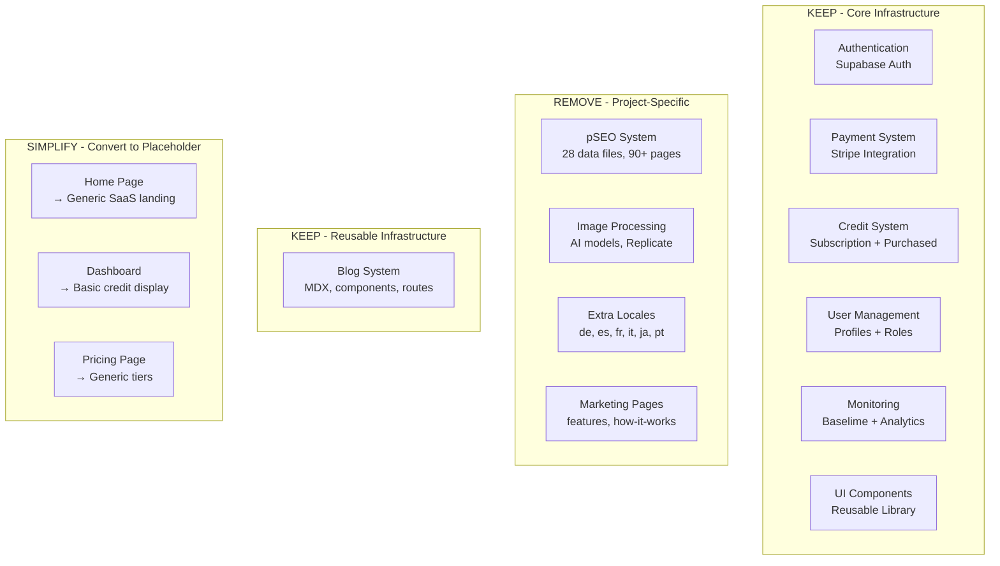

# PRD: SaaS Boilerplate Extraction

**Complexity: 9 → HIGH mode** (10+ directories touched, multi-package changes, major refactor)

---

## 1. Context

**Problem:** Transform the MyImageUpscaler codebase into a reusable SaaS boilerplate by removing all project-specific functionality while preserving core infrastructure.

**Files Analyzed:**

- `/app/` - 90+ page files, API routes
- `/client/components/` - 22 component directories
- `/server/services/` - 14 service files
- `/lib/seo/` - 18 SEO-related files
- `/app/seo/data/` - 28 pSEO data files
- `/locales/` - 7 language directories (de, en, es, fr, it, ja, pt)
- `/content/blog/` - 18 blog posts
- `/tests/` - 11 test directories

**Current State:**

- Full-featured image upscaling SaaS with pSEO pages
- 7 locales supported with extensive translations
- Complex image processing with multiple AI models
- Credit system with subscription tiers
- Comprehensive test suite including pSEO tests

---

## 2. Solution

**Approach:**

1. Remove all MyImageUpscaler-specific features (image processing, pSEO, blog)
2. Keep only English locale (en) as the base template
3. Preserve core SaaS infrastructure (auth, payments, credits, user management)
4. Simplify to a "credits-based API SaaS" template
5. Create placeholder pages for customization

**Architecture (After Extraction):**



**Key Decisions:**

- [x] Keep only English (en) locale - other locales can be added per-project
- [x] Remove all image processing - this is project-specific
- [x] Remove pSEO system entirely - each project has different SEO needs
- [x] Keep credit system - universal for API-based SaaS
- [x] Keep Stripe integration - standard payment processing
- [x] Keep admin panel structure - useful for any SaaS
- [x] Keep blog system - reusable MDX-based blog infrastructure

**Data Changes:**

- Remove 28 pSEO data files from `/app/seo/data/`
- Remove 6 locale directories (keep `/locales/en/`)
- Keep blog content and compiled data as template examples
- Keep database migrations (they're infrastructure)

---

## 3. Detailed Removal/Keep Analysis

### 3.1 Directories to REMOVE Completely

| Directory                  | Size      | Reason                         |
| -------------------------- | --------- | ------------------------------ |
| `/app/(pseo)/`             | ~50 pages | pSEO routes for image upscaler |
| `/app/[locale]/(pseo)/`    | ~40 pages | Localized pSEO routes          |
| `/app/seo/data/`           | 28 files  | pSEO content data              |
| `/locales/de/`             | ~25 files | German translations            |
| `/locales/es/`             | ~25 files | Spanish translations           |
| `/locales/fr/`             | ~25 files | French translations            |
| `/locales/it/`             | ~25 files | Italian translations           |
| `/locales/ja/`             | ~25 files | Japanese translations          |
| `/locales/pt/`             | ~25 files | Portuguese translations        |
| `/client/components/pseo/` | All       | pSEO UI components             |
| `/lib/seo/`                | 18 files  | pSEO infrastructure            |
| `/tests/pseo/`             | All       | pSEO tests                     |
| `/tests/seo/`              | All       | SEO-specific tests             |

### 3.2 Files/Directories to REMOVE

#### Server Services (Image Processing)

| File                                            | Reason                |
| ----------------------------------------------- | --------------------- |
| `/server/services/image-generation.service.ts`  | Image processing      |
| `/server/services/image-processor.factory.ts`   | Image processing      |
| `/server/services/image-processor.interface.ts` | Image processing      |
| `/server/services/llm-image-analyzer.ts`        | Image analysis        |
| `/server/services/llm-image-analyzer.types.ts`  | Image analysis        |
| `/server/services/model-registry.ts`            | AI model management   |
| `/server/services/model-registry.types.ts`      | AI model management   |
| `/server/services/replicate.service.ts`         | Replicate integration |

#### API Routes (Image-Specific)

| Directory                   | Reason                |
| --------------------------- | --------------------- |
| `/app/api/upscale/`         | Image upscale API     |
| `/app/api/credit-estimate/` | Image cost estimation |
| `/app/api/analyze-image/`   | Image analysis API    |
| `/app/api/models/`          | AI model listing API  |
| `/app/api/proxy-image/`     | Image proxy API       |
| `/app/api/pseo/`            | pSEO health API       |

#### App Pages (Product-Specific)

| Directory                     | Reason                |
| ----------------------------- | --------------------- |
| `/app/[locale]/how-it-works/` | Product-specific page |
| `/app/[locale]/features/`     | Product-specific page |

#### Client Components (Image/Product-Specific)

| Directory                                       | Reason                                 |
| ----------------------------------------------- | -------------------------------------- |
| `/client/components/pages/HomePageClient.tsx`   | Product-specific home                  |
| `/client/components/tools/`                     | Image tools UI                         |
| `/client/components/features/image-processing/` | Image dropzone, comparison             |
| `/client/components/features/workspace/`        | Batch processing workspace             |
| `/client/components/features/landing/`          | Product-specific landing sections      |
| `/client/components/seo/`                       | SEO meta components (product-specific) |

#### Client Utilities (Image-Specific)

| File                                   | Reason                               |
| -------------------------------------- | ------------------------------------ |
| `/client/utils/bulk-processing.ts`     | Batch image processing               |
| `/client/utils/image-compression.ts`   | Image compression                    |
| `/client/utils/image-preprocessing.ts` | Image preprocessing                  |
| `/client/utils/file-validation.ts`     | Image file validation                |
| `/client/utils/prompt-utils.ts`        | AI prompt utilities                  |
| `/client/utils/zip-download.ts`        | Batch download (may keep simplified) |

#### Client Hooks (Image-Specific)

| File                                   | Reason            |
| -------------------------------------- | ----------------- |
| `/client/hooks/useBatchQueue.ts`       | Batch image queue |
| `/client/hooks/useLowCreditWarning.ts` | Keep but simplify |

#### Shared Config (Image-Specific)

| File                                   | Reason                     |
| -------------------------------------- | -------------------------- |
| `/shared/validation/upscale.schema.ts` | Image validation schema    |
| `/shared/config/model-costs.config.ts` | AI model cost config       |
| `/shared/config/credits.config.ts`     | Needs heavy simplification |

#### Content

| Path                      | Reason                    |
| ------------------------- | ------------------------- |
| `/content/blog/`          | KEEP - Template examples  |
| `/content/blog-data.json` | KEEP - Template structure |

#### Sitemap Files (~47 files)

| Pattern                                        | Reason            |
| ---------------------------------------------- | ----------------- |
| `/app/sitemap-*.xml`                           | All pSEO sitemaps |
| Keep only: `sitemap.xml`, `sitemap-static.xml` | Core sitemaps     |

#### Scripts (pSEO/Blog-Specific)

| File                                     | Reason                        |
| ---------------------------------------- | ----------------------------- |
| `/scripts/build-blog.ts`                 | KEEP - Blog build system      |
| `/scripts/pseo-audit.ts`                 | pSEO audit                    |
| `/scripts/seo-crawl-site.ts`             | SEO crawl                     |
| `/scripts/seo-i18n-audit.ts`             | SEO i18n audit                |
| `/scripts/seo-pagespeed-check.ts`        | PageSpeed check               |
| `/scripts/seo-serp-analysis.ts`          | SERP analysis                 |
| `/scripts/seo-technical-audit.ts`        | Technical SEO audit           |
| `/scripts/validate-sitemap-urls.ts`      | Sitemap validation (simplify) |
| `/scripts/validate-sitemap-structure.ts` | Sitemap structure (simplify)  |

#### Test Files (Image/pSEO-Specific)

| File/Directory                                              | Reason               |
| ----------------------------------------------------------- | -------------------- |
| `/tests/pseo/`                                              | pSEO tests           |
| `/tests/seo/`                                               | SEO tests            |
| `/tests/e2e/upscaler.e2e.spec.ts`                           | Upscaler E2E         |
| `/tests/e2e/upscaler.e2e.clean.spec.ts`                     | Upscaler E2E         |
| `/tests/e2e/upscaler.e2e.refactored.spec.ts`                | Upscaler E2E         |
| `/tests/e2e/bulk-image-compressor.e2e.spec.ts`              | Bulk compressor      |
| `/tests/e2e/bulk-image-resizer.e2e.spec.ts`                 | Bulk resizer         |
| `/tests/e2e/model-selection.e2e.spec.ts`                    | Model selection      |
| `/tests/e2e/pseo-locale-rendering.e2e.spec.ts`              | pSEO rendering       |
| `/tests/e2e/pseo-new-categories.e2e.spec.ts`                | pSEO categories      |
| `/tests/e2e/landing-page-seo.e2e.spec.ts`                   | Landing SEO          |
| `/tests/e2e/seo-redirects.e2e.spec.ts`                      | SEO redirects        |
| `/tests/pages/UpscalerPage.ts`                              | Page object          |
| `/tests/pages/UpscalerPage.enhanced.ts`                     | Enhanced page object |
| `/tests/pages/BulkImageCompressorPage.ts`                   | Page object          |
| `/tests/pages/BulkImageResizerPage.ts`                      | Page object          |
| `/tests/helpers/upscaler-test-helper.ts`                    | Test helper          |
| `/tests/unit/multi-model-edge-cases.unit.spec.ts`           | Model tests          |
| `/tests/unit/tier-restriction.unit.spec.ts`                 | Tier tests           |
| `/tests/unit/getBatchLimit.unit.spec.ts`                    | Batch tests          |
| `/tests/unit/bugfixes/credit-cost-calculation.unit.spec.ts` | Credit calc          |

#### Claude Skills (Project-Specific)

| Skill                           | Reason                     |
| ------------------------------- | -------------------------- |
| `/.claude/skills/add-ai-model/` | AI model skill             |
| `/.claude/skills/blog-writing/` | KEEP - Reusable blog skill |
| `/.claude/skills/pseo-system/`  | pSEO skill                 |

#### Documentation (Project-Specific)

| Directory                      | Reason            |
| ------------------------------ | ----------------- |
| `/docs/SEO/`                   | SEO documentation |
| `/docs/business-model-canvas/` | Business docs     |
| `/docs/features/`              | Feature docs      |
| `/docs/hiring/`                | Hiring docs       |
| `/docs/marketing/`             | Marketing docs    |
| `/docs/plans/`                 | Project plans     |
| `/docs/research/`              | Research docs     |
| `/docs/seo/`                   | More SEO docs     |
| `/docs/audits/`                | Audit reports     |

### 3.3 Directories to KEEP (Core Infrastructure)

| Directory                                       | Purpose                 |
| ----------------------------------------------- | ----------------------- |
| `/server/stripe/`                               | Payment processing      |
| `/server/supabase/`                             | Database client         |
| `/server/middleware/`                           | Auth, rate limiting     |
| `/server/monitoring/`                           | Logging, analytics      |
| `/server/services/SubscriptionCredits.ts`       | Credit management       |
| `/server/services/batch-limit.service.ts`       | Rate limiting           |
| `/server/services/subscription-sync.service.ts` | Stripe sync             |
| `/shared/utils/`                                | Core utilities          |
| `/shared/config/`                               | Configuration (mostly)  |
| `/shared/repositories/`                         | Data access             |
| `/shared/types/`                                | Type definitions        |
| `/client/components/ui/`                        | UI library              |
| `/client/components/common/`                    | Common components       |
| `/client/components/auth/`                      | Auth components         |
| `/client/components/dashboard/`                 | Dashboard (simplify)    |
| `/client/components/admin/`                     | Admin panel             |
| `/client/components/stripe/`                    | Payment components      |
| `/client/components/modal/`                     | Modal system            |
| `/client/components/form/`                      | Form components         |
| `/client/components/layout/`                    | Layout components       |
| `/client/components/navigation/`                | Navigation              |
| `/client/components/errors/`                    | Error boundaries        |
| `/client/store/`                                | State management        |
| `/client/hooks/`                                | Custom hooks            |
| `/client/components/blog/`                      | Blog components         |
| `/i18n/`                                        | i18n infrastructure     |
| `/locales/en/`                                  | English translations    |
| `/content/blog/`                                | Blog content (template) |
| `/supabase/migrations/`                         | Database schema         |
| `/app/api/webhooks/stripe/`                     | Stripe webhooks         |
| `/app/api/checkout/`                            | Checkout API            |
| `/app/api/subscription/`                        | Subscription API        |
| `/app/api/portal/`                              | Billing portal API      |
| `/app/api/credits/`                             | Credit APIs             |
| `/app/api/admin/`                               | Admin APIs              |
| `/app/[locale]/dashboard/`                      | Dashboard pages         |
| `/app/[locale]/pricing/`                        | Pricing page            |
| `/app/[locale]/auth/`                           | Auth pages              |
| `/app/[locale]/success/`                        | Checkout success        |
| `/app/[locale]/canceled/`                       | Checkout canceled       |
| `/app/[locale]/privacy/`                        | Privacy policy          |
| `/app/[locale]/terms/`                          | Terms of service        |
| `/app/[locale]/help/`                           | Help page               |
| `/app/[locale]/blog/`                           | Blog pages              |
| `/tests/api/`                                   | API tests               |
| `/tests/e2e/`                                   | E2E tests (filter)      |
| `/tests/unit/`                                  | Unit tests (filter)     |
| `/tests/integration/`                           | Integration tests       |

### 3.4 Files to MODIFY (Simplify/Genericize)

| File                               | Changes Needed             |
| ---------------------------------- | -------------------------- |
| `/shared/config/credits.config.ts` | Generic credit tiers       |
| `/app/[locale]/page.tsx`           | Generic landing page       |
| `/client/components/landing/`      | Generic hero, features     |
| `/locales/en/*.json`               | Remove image-specific text |
| `/i18n/config.ts`                  | Only English locale        |
| `/next.config.js`                  | Remove pSEO rewrites       |
| `/package.json`                    | Remove unused deps         |
| `/CLAUDE.md`                       | Update for template        |

---

## 4. Execution Phases

### Phase 1: Remove pSEO System

**User-visible outcome:** pSEO pages no longer exist, sitemap simplified

**Files (5 directories):**

- `/app/(pseo)/` - DELETE entirely
- `/app/[locale]/(pseo)/` - DELETE entirely
- `/app/seo/data/` - DELETE entirely
- `/lib/seo/` - DELETE entirely
- `/client/components/pseo/` - DELETE entirely

**Implementation:**

- [ ] Remove `/app/(pseo)/` directory tree
- [ ] Remove `/app/[locale]/(pseo)/` directory tree
- [ ] Remove `/app/seo/data/` directory (28 JSON files)
- [ ] Remove `/lib/seo/` directory (18 files)
- [ ] Remove `/client/components/pseo/` directory

**Tests Required:**
| Test File | Test Name | Assertion |
|-----------|-----------|-----------|
| Manual | Build succeeds | `yarn build` completes |
| Manual | No pSEO routes | `/tools/*` returns 404 |

**User Verification:**

- Action: Run `yarn build`
- Expected: Build completes without pSEO-related errors

---

### Phase 2: Remove Extra Locales

**User-visible outcome:** Only English locale remains, i18n still works

**Files (6 directories):**

- `/locales/de/` - DELETE
- `/locales/es/` - DELETE
- `/locales/fr/` - DELETE
- `/locales/it/` - DELETE
- `/locales/ja/` - DELETE
- `/locales/pt/` - DELETE

**Implementation:**

- [ ] Remove all non-English locale directories
- [ ] Update `/i18n/config.ts` to only include English
- [ ] Update middleware locale detection
- [ ] Remove locale-specific rewrites from `next.config.js`

**Tests Required:**
| Test File | Test Name | Assertion |
|-----------|-----------|-----------|
| `tests/unit/i18n/` | `should default to English` | Default locale is 'en' |
| Manual | Pages load | English pages render correctly |

**User Verification:**

- Action: Visit `/dashboard`
- Expected: Page loads with English text, no locale errors

---

### Phase 3: Remove Image Processing Services

**User-visible outcome:** No image-related API endpoints or services

**Files (5):**

- `/server/services/image-generation.service.ts` - DELETE
- `/server/services/image-processor.factory.ts` - DELETE
- `/server/services/image-processor.interface.ts` - DELETE
- `/server/services/replicate.service.ts` - DELETE
- `/server/services/model-registry.ts` - DELETE

**Implementation:**

- [ ] Delete image processing service files
- [ ] Delete model registry files
- [ ] Remove Replicate-related imports
- [ ] Update service exports/index files

**Tests Required:**
| Test File | Test Name | Assertion |
|-----------|-----------|-----------|
| Manual | TypeScript compiles | `yarn tsc` passes |
| Manual | No import errors | No missing module errors |

**User Verification:**

- Action: Run `yarn tsc`
- Expected: No TypeScript errors related to removed services

---

### Phase 4: Remove Image APIs and LLM Services

**User-visible outcome:** Clean API routes without image-specific endpoints

**Files (5):**

- `/app/api/upscale/` - DELETE directory
- `/app/api/credit-estimate/` - DELETE directory
- `/server/services/llm-image-analyzer.ts` - DELETE
- `/server/services/llm-image-analyzer.types.ts` - DELETE
- `/server/services/model-registry.types.ts` - DELETE

**Implementation:**

- [ ] Delete upscale API route directory
- [ ] Delete credit-estimate API directory
- [ ] Delete LLM analyzer files
- [ ] Delete model registry types

**Tests Required:**
| Test File | Test Name | Assertion |
|-----------|-----------|-----------|
| Manual | Build passes | `yarn build` completes |
| API test | `/api/upscale` returns 404 | Route no longer exists |

**User Verification:**

- Action: Run `yarn build && curl localhost:3000/api/upscale`
- Expected: Build succeeds, API returns 404

---

### Phase 5: Preserve Blog System

**User-visible outcome:** Blog system remains as reusable template infrastructure

**Files (5):**

- `/content/blog/` - KEEP as template examples (18 MDX files)
- `/content/blog-data.json` - KEEP as template structure
- `/app/[locale]/blog/` - KEEP blog page routes
- `/client/components/blog/` - KEEP blog components
- `/scripts/build-blog.ts` - KEEP blog build system

**Implementation:**

- [x] Blog content directory preserved
- [x] Compiled blog data preserved
- [x] Blog page routes preserved
- [x] Blog components preserved
- [x] Blog build script preserved in package.json

**Tests Required:**
| Test File | Test Name | Assertion |
|-----------|-----------|-----------|
| Manual | Build passes | `yarn build` completes |
| Manual | `/blog` loads | Blog routes work correctly |

**User Verification:**

- Action: Visit `/blog`
- Expected: Blog listing page renders correctly

---

### Phase 6: Remove Product-Specific Pages

**User-visible outcome:** No features/how-it-works pages

**Files (4):**

- `/app/[locale]/features/` - DELETE
- `/app/[locale]/how-it-works/` - DELETE
- `/client/components/features/` - DELETE
- `/client/components/tools/` - DELETE

**Implementation:**

- [ ] Delete features page directory
- [ ] Delete how-it-works page directory
- [ ] Delete features components
- [ ] Delete tools components (image upload, processing UI)

**Tests Required:**
| Test File | Test Name | Assertion |
|-----------|-----------|-----------|
| Manual | Build passes | `yarn build` completes |
| Manual | `/features` returns 404 | Route removed |

**User Verification:**

- Action: Visit `/features` and `/how-it-works`
- Expected: Both return 404

---

### Phase 7: Remove pSEO Tests

**User-visible outcome:** Test suite runs without pSEO tests

**Files (3):**

- `/tests/pseo/` - DELETE directory
- `/tests/seo/` - DELETE directory
- pSEO-related test files in other directories - DELETE

**Implementation:**

- [ ] Delete `/tests/pseo/` directory
- [ ] Delete `/tests/seo/` directory
- [ ] Remove pSEO imports from test helpers
- [ ] Update test configuration if needed

**Tests Required:**
| Test File | Test Name | Assertion |
|-----------|-----------|-----------|
| Manual | Test suite runs | `yarn test` passes |

**User Verification:**

- Action: Run `yarn test`
- Expected: All remaining tests pass

---

### Phase 8: Simplify English Translations

**User-visible outcome:** Translation files contain only generic SaaS text

**Files (1 directory):**

- `/locales/en/` - MODIFY (remove image-specific keys)

**Implementation:**

- [ ] Remove image-specific translation keys from all en/\*.json
- [ ] Remove pSEO-related translation files (pseo.json, tools.json, formats.json, etc.)
- [ ] Keep generic: auth, dashboard, pricing, errors, modal, checkout, subscription
- [ ] Update remaining translations to be generic

**Files to DELETE in `/locales/en/` (~1.5MB of translations):**

- `alternatives.json` (91KB) - Alternatives page
- `bulk-tools.json` (14KB) - Bulk tools
- `camera-raw.json` - Camera RAW content
- `compare.json` (17KB) - Comparison page
- `comparison.json` (18KB) - Comparison content
- `comparisons-expanded.json` (80KB) - Expanded comparisons
- `competitor-comparisons.json` (119KB) - Competitor comparisons
- `device-optimization.json` (48KB) - Device optimization
- `device-specific.json` (14KB) - Device-specific content
- `device-use.json` (56KB) - Device use cases
- `features.json` - Features page
- `format-conversion.json` (33KB) - Format conversion
- `format-scale.json` (153KB) - Format scaling
- `formats.json` (50KB) - Image formats
- `free.json` (18KB) - Free tools
- `guides.json` (89KB) - Guide content
- `howItWorks.json` - How it works page
- `industry-insights.json` (83KB) - Industry insights
- `interactive-tools.json` (91KB) - Interactive tools
- `personas-expanded.json` (124KB) - Personas
- `photo-restoration.json` (50KB) - Photo restoration
- `platform-format.json` (204KB) - Platform formats
- `platforms.json` (28KB) - Platform-specific
- `pseo.json` - pSEO translations
- `scale.json` (58KB) - Scale options
- `social-media-resize.json` (135KB) - Social media resize
- `technical-guides.json` (82KB) - Technical guides
- `tools.json` (33KB) - Image tools
- `tools-ui.json` (10KB) - Tools UI
- `use-cases.json` (71KB) - Use cases
- `use-cases-expanded.json` (69KB) - Expanded use cases
- `workspace.json` - Workspace UI

**Files to KEEP in `/locales/en/` (~50KB):**

- `admin.json` (5KB) - Admin panel
- `auth.json` (5KB) - Authentication
- `blog.json` - Blog translations (KEEP - reusable)
- `checkout.json` (1KB) - Checkout
- `common.json` (6KB) - Common strings
- `dashboard.json` (6KB) - Dashboard (modify for generic)
- `errors.json` (<1KB) - Error messages
- `help.json` (7KB) - Help page (modify for generic)
- `i18n.json` (<1KB) - i18n config
- `modal.json` (<1KB) - Modal text
- `pricing.json` (3KB) - Pricing (modify for generic)
- `privacy.json` (7KB) - Privacy policy (modify for generic)
- `stripe.json` (3KB) - Stripe strings
- `subscription.json` (6KB) - Subscriptions
- `terms.json` (8KB) - Terms of service (modify for generic)

**Tests Required:**
| Test File | Test Name | Assertion |
|-----------|-----------|-----------|
| `tests/unit/i18n/` | `translations load` | No missing keys |
| Manual | Pages render | No translation errors in console |

**User Verification:**

- Action: Visit `/dashboard`, `/pricing`
- Expected: Pages render without missing translation warnings

---

### Phase 9: Simplify Credits Config

**User-visible outcome:** Generic credit configuration for any API service

**Files (2):**

- `/shared/config/credits.config.ts` - MODIFY
- `/shared/validation/upscale.schema.ts` - DELETE

**Implementation:**

- [ ] Delete upscale validation schema
- [ ] Simplify credits.config.ts:
  - Remove image-specific credit costs
  - Remove model multipliers
  - Keep subscription tiers
  - Keep credit pack pricing
  - Add generic "API_CALL" cost placeholder
- [ ] Update any imports of upscale schema

**New credits.config.ts structure:**

```typescript
export const CREDIT_COSTS = {
  API_CALL: 1, // Base cost per API call
} as const;

// Keep subscription tiers and packs unchanged
```

**Tests Required:**
| Test File | Test Name | Assertion |
|-----------|-----------|-----------|
| `tests/unit/credits/` | `credit costs defined` | CREDIT_COSTS.API_CALL === 1 |
| Manual | TypeScript compiles | No type errors |

**User Verification:**

- Action: Run `yarn tsc`
- Expected: No errors related to credit config

---

### Phase 10: Create Generic Landing Page

**User-visible outcome:** Template landing page for any SaaS

**Files (3):**

- `/app/[locale]/page.tsx` - MODIFY
- `/client/components/pages/HomePageClient.tsx` - REPLACE
- `/client/components/landing/` - MODIFY

**Implementation:**

- [ ] Replace HomePageClient with generic SaaS template
- [ ] Update landing components for generic use
- [ ] Remove image-specific hero sections
- [ ] Add placeholder sections:
  - Hero with app name/tagline (from env)
  - Feature highlights (configurable)
  - Pricing preview
  - CTA to sign up

**Tests Required:**
| Test File | Test Name | Assertion |
|-----------|-----------|-----------|
| `tests/e2e/landing.spec.ts` | `home page loads` | Page renders without errors |
| Manual | Visual check | Landing page looks professional |

**User Verification:**

- Action: Visit `/`
- Expected: Generic SaaS landing page renders

---

### Phase 11: Clean Up Unused Dependencies

**User-visible outcome:** Smaller package.json, faster installs

**Files (1):**

- `/package.json` - MODIFY

**Implementation:**
Remove these dependencies:

- [ ] `replicate` - Image processing API
- [ ] `@google/genai` - Gemini AI (image analysis)
- [ ] `@imgly/background-removal` - Background removal
- [ ] `onnxruntime-web` - ML runtime for background removal

**KEEP these dependencies (blog system):**

- [x] `next-mdx-remote` - Blog MDX rendering
- [x] `@mdx-js/react` - MDX React components
- [x] `gray-matter` - Blog frontmatter parsing
- [x] `reading-time` - Blog reading time

**MAY KEEP (evaluate usage):**

- [ ] `react-markdown` - Used for help pages
- [ ] `remark-gfm` - GitHub flavored markdown for help
- [ ] `jszip` - If zip download kept

**Tests Required:**
| Test File | Test Name | Assertion |
|-----------|-----------|-----------|
| Manual | Install succeeds | `yarn install` completes |
| Manual | Build succeeds | `yarn build` completes |

**User Verification:**

- Action: Run `rm -rf node_modules && yarn install && yarn build`
- Expected: Clean install and build

---

### Phase 12: Update Configuration Files

**User-visible outcome:** Clean configuration for template use

**Files (5):**

- `/next.config.js` - MODIFY (remove pSEO rewrites)
- `/shared/config/env.ts` - MODIFY (remove image-specific vars, genericize defaults)
- `/CLAUDE.md` - MODIFY (update for template)
- `/.env.client.example` - MODIFY (remove image-specific vars)
- `/.env.api.example` - MODIFY (remove image-specific vars)

**Implementation:**

- [ ] Remove pSEO-related rewrites from next.config.js
- [ ] Update `/shared/config/env.ts`:
  - Change default APP_NAME from 'MyImageUpscaler' to 'SaaS Boilerplate'
  - Change default domain from 'myimageupscaler.com' to 'example.com'
  - Remove REPLICATE_API_TOKEN, REPLICATE_MODEL_VERSION
  - Remove GEMINI_API_KEY
  - Remove QWEN_VL_MODEL_VERSION
  - Remove all MODEL*FOR*\* variables
  - Remove all MODEL*VERSION*\* variables
  - Remove ENABLE_AUTO_MODEL_SELECTION, ENABLE_PREMIUM_MODELS
  - Remove SERPER_DEV, PAGESPEED_API_KEY (SEO-specific)
  - Keep generic infrastructure vars
- [ ] Update CLAUDE.md for boilerplate usage
- [ ] Update env examples with placeholder variables

**Tests Required:**
| Test File | Test Name | Assertion |
|-----------|-----------|-----------|
| Manual | Build succeeds | `yarn build` completes |
| Manual | Env validation | No missing required vars |

**User Verification:**

- Action: Run `yarn build`
- Expected: Build completes with clean config

---

### Phase 13: Final Cleanup and Documentation

**User-visible outcome:** Ready-to-use SaaS boilerplate

**Files (5):**

- `/docs/PRDs/` - Move old PRDs to archive
- `/docs/` - Clean up project-specific docs
- `/README.md` - UPDATE for boilerplate
- `/.claude/skills/` - Remove image-specific skills
- Remove any remaining image references

**Implementation:**

- [ ] Archive old PRDs to `/docs/PRDs/archive/`
- [ ] Remove image-specific documentation
- [ ] Update README with boilerplate instructions
- [ ] Remove skills: pseo-system (or convert to generic)
- [ ] Final grep for "upscale", "image", "myimageupscaler" references
- [ ] Remove or update any remaining references

**Tests Required:**
| Test File | Test Name | Assertion |
|-----------|-----------|-----------|
| Manual | Full test suite | `yarn test` passes |
| Manual | Full verify | `yarn verify` passes |
| Manual | Grep check | No "myimageupscaler" references |

**User Verification:**

- Action: Run `yarn verify && grep -r "myimageupscaler" --include="*.ts" --include="*.tsx" --include="*.json"`
- Expected: Verify passes, grep returns empty

---

## 5. Acceptance Criteria

Binary done checks:

- [ ] All 13 phases complete
- [ ] `yarn verify` passes
- [ ] `yarn test` passes (remaining tests)
- [ ] No "myimageupscaler" references in code
- [ ] No "upscale" references in code (except generic)
- [ ] Only English locale remains
- [ ] No pSEO pages exist
- [x] Blog system preserved and functional
- [ ] No image processing services exist
- [ ] Landing page is generic
- [ ] Credits config is simplified
- [ ] Package.json has no unused deps
- [ ] README documents boilerplate usage

---

## 6. Post-Extraction Template Features

After extraction, the boilerplate will include:

### Authentication

- Supabase Auth (Google, Azure, Email/Password)
- Protected routes
- Auth state management (Zustand)

### Payments

- Stripe integration (subscriptions + one-time)
- Webhook handlers with idempotency
- Billing portal access

### Credit System

- Subscription credits with rollover
- Purchased credits (no expiry)
- Credit packs
- Transaction history

### User Management

- User profiles
- Admin roles
- User repository pattern

### Infrastructure

- Rate limiting
- Error handling
- Monitoring (Baselime)
- Analytics (Amplitude, GA4)

### UI

- Component library (ui/, common/)
- Modal system
- Toast notifications
- Form components
- Dashboard layout

### Database

- Supabase migrations
- RLS policies
- RPC functions

### Testing

- Unit tests (Vitest)
- E2E tests (Playwright)
- API tests

### i18n

- next-intl setup
- English translations
- Easy to add locales

### Blog System

- MDX-based blog with frontmatter
- Reading time calculation
- Blog listing and detail pages
- SEO-optimized blog routes
- Blog search functionality
- Reusable blog components

---

## 7. Files Summary

### Total Removals

- **Directories:** ~30+ (reduced - blog kept)
- **Files:** ~330+ (reduced - blog kept)
- **Translation files:** ~1.5MB of JSON (from 2MB to ~55KB - blog.json kept)
- **Sitemap files:** ~47 XML files
- **pSEO data files:** 28 JSON files
- **Blog content:** KEPT as template (18 MDX files + compiled JSON)

### Dependencies to Remove

- `replicate` - Image processing
- `@google/genai` - AI image analysis
- `@imgly/background-removal` - Background removal
- `onnxruntime-web` - ML runtime

### Dependencies to Keep (Blog System)

- `next-mdx-remote` - Blog MDX
- `@mdx-js/react` - MDX components
- `gray-matter` - Frontmatter parsing
- `reading-time` - Blog reading time

### Estimated Impact

- **Locales:** 7 → 1 (en only)
- **Pages:** 90+ → ~15
- **API Routes:** 19 → ~10
- **Services:** 14 → ~5
- **Translation size:** 2MB → ~50KB
- **Test files:** Reduced by ~40%
- **Skills:** 26 → ~23

### Key Metrics After Extraction

| Metric            | Before  | After    |
| ----------------- | ------- | -------- |
| Locales           | 7       | 1        |
| App Pages         | 90+     | ~20      |
| API Routes        | 19      | ~10      |
| Server Services   | 14      | ~5       |
| Client Components | 22 dirs | ~16 dirs |
| Translation Files | 48      | ~15      |
| Sitemap Files     | 47      | 2        |
| E2E Tests         | 15+     | ~8       |
| Dependencies      | ~45     | ~39      |

---

## 8. API Architecture Refactor

After the boilerplate extraction is complete, refactor the remaining API routes to use a clean, enterprise-grade architecture with decorators, dependency injection, DTOs, and custom error classes.

### 8.1 Current State Analysis

**Current patterns (inconsistent across routes):**

- Direct `GET`/`POST` handler functions in `route.ts` files
- Manual auth checking with varying patterns (`requireAdmin()`, direct token validation)
- Ad-hoc request validation (inline checks, no schema validation)
- Inconsistent error response formats
- Direct service/repository imports (tight coupling)
- No dependency injection
- Business logic mixed with HTTP handling

**Routes to refactor (~10 after extraction):**
| Route | Method(s) | Current LOC | Complexity |
|-------|-----------|-------------|------------|
| `/api/checkout` | POST | ~480 | High |
| `/api/portal` | POST | ~50 | Low |
| `/api/subscription/change` | POST | ~150 | Medium |
| `/api/subscription/preview-change` | POST | ~100 | Medium |
| `/api/subscription/cancel-scheduled` | DELETE | ~50 | Low |
| `/api/credits/history` | GET | ~80 | Low |
| `/api/admin/users` | GET | ~70 | Low |
| `/api/admin/users/[userId]` | GET, PATCH, DELETE | ~200 | Medium |
| `/api/admin/stats` | GET | ~100 | Low |
| `/api/admin/credits/adjust` | POST | ~80 | Low |
| `/api/webhooks/stripe` | POST | ~200 | High |
| `/api/cron/*` | GET | ~150 | Medium |

---

### 8.2 Preparation Phase (Clean Up)

**Goal:** Remove clutter, standardize patterns, and prepare for architectural refactor.

#### Phase P1: Standardize Error Responses

**Files to create:**

- `/server/errors/base.error.ts` - Base error class
- `/server/errors/http.errors.ts` - HTTP-specific errors
- `/server/errors/index.ts` - Error exports

**Implementation:**

```typescript
// /server/errors/base.error.ts
export abstract class AppError extends Error {
  abstract readonly statusCode: number;
  abstract readonly code: string;
  readonly isOperational: boolean = true;

  constructor(
    message: string,
    public readonly details?: Record<string, unknown>
  ) {
    super(message);
    this.name = this.constructor.name;
    Error.captureStackTrace(this, this.constructor);
  }

  toJSON() {
    return {
      success: false,
      error: {
        code: this.code,
        message: this.message,
        ...(this.details && { details: this.details }),
      },
    };
  }
}
```

```typescript
// /server/errors/http.errors.ts
export class BadRequestError extends AppError {
  readonly statusCode = 400;
  readonly code = 'BAD_REQUEST';
}

export class UnauthorizedError extends AppError {
  readonly statusCode = 401;
  readonly code = 'UNAUTHORIZED';
}

export class ForbiddenError extends AppError {
  readonly statusCode = 403;
  readonly code = 'FORBIDDEN';
}

export class NotFoundError extends AppError {
  readonly statusCode = 404;
  readonly code = 'NOT_FOUND';
}

export class ConflictError extends AppError {
  readonly statusCode = 409;
  readonly code = 'CONFLICT';
}

export class ValidationError extends AppError {
  readonly statusCode = 422;
  readonly code = 'VALIDATION_ERROR';
}

export class TooManyRequestsError extends AppError {
  readonly statusCode = 429;
  readonly code = 'TOO_MANY_REQUESTS';
}

export class InternalServerError extends AppError {
  readonly statusCode = 500;
  readonly code = 'INTERNAL_ERROR';
  readonly isOperational = false;
}
```

**Tasks:**

- [ ] Create `/server/errors/` directory structure
- [ ] Implement `AppError` base class with `toJSON()` method
- [ ] Implement HTTP error classes extending `AppError`
- [ ] Add error factory helpers: `createValidationError(zodError)`, etc.

**Tests Required:**
| Test File | Test Name | Assertion |
|-----------|-----------|-----------|
| `tests/unit/errors/` | `error classes serialize correctly` | `toJSON()` returns correct format |
| `tests/unit/errors/` | `error codes match status codes` | Status codes are correct |

---

#### Phase P2: Create Error Handler Utility

**Files to create:**

- `/server/utils/api-handler.ts` - Unified error handling wrapper

**Implementation:**

```typescript
// /server/utils/api-handler.ts
import { NextRequest, NextResponse } from 'next/server';
import { AppError, InternalServerError } from '@server/errors';
import { logger } from '@server/monitoring/logger';

type ApiHandler = (req: NextRequest, context?: unknown) => Promise<NextResponse>;

export function withErrorHandler(handler: ApiHandler): ApiHandler {
  return async (req: NextRequest, context?: unknown) => {
    try {
      return await handler(req, context);
    } catch (error) {
      if (error instanceof AppError) {
        if (!error.isOperational) {
          logger.error('Non-operational error', { error });
        }
        return NextResponse.json(error.toJSON(), { status: error.statusCode });
      }

      // Unexpected error
      logger.error('Unexpected error in API handler', { error, path: req.nextUrl.pathname });
      const internalError = new InternalServerError('An unexpected error occurred');
      return NextResponse.json(internalError.toJSON(), { status: 500 });
    }
  };
}
```

**Tasks:**

- [ ] Create `withErrorHandler` wrapper function
- [ ] Integrate with existing logger
- [ ] Add request context to error logs (path, method, user ID)

---

#### Phase P3: Standardize Auth Middleware

**Files to modify:**

- `/server/middleware/auth.middleware.ts` - Unified auth middleware

**Implementation:**

```typescript
// /server/middleware/auth.middleware.ts
import { NextRequest } from 'next/server';
import { supabaseAdmin } from '@server/supabase/supabaseAdmin';
import { UnauthorizedError, ForbiddenError } from '@server/errors';
import { User } from '@supabase/supabase-js';

export interface IAuthContext {
  user: User;
  token: string;
}

export async function requireAuth(req: NextRequest): Promise<IAuthContext> {
  const authHeader = req.headers.get('authorization');
  if (!authHeader?.startsWith('Bearer ')) {
    throw new UnauthorizedError('Missing or invalid authorization header');
  }

  const token = authHeader.slice(7);
  const {
    data: { user },
    error,
  } = await supabaseAdmin.auth.getUser(token);

  if (error || !user) {
    throw new UnauthorizedError('Invalid or expired token');
  }

  return { user, token };
}

export async function requireAdmin(req: NextRequest): Promise<IAuthContext> {
  const ctx = await requireAuth(req);

  const { data: profile } = await supabaseAdmin
    .from('profiles')
    .select('is_admin')
    .eq('id', ctx.user.id)
    .single();

  if (!profile?.is_admin) {
    throw new ForbiddenError('Admin access required');
  }

  return ctx;
}
```

**Tasks:**

- [ ] Refactor `requireAuth` to throw errors instead of returning response
- [ ] Refactor `requireAdmin` to throw errors instead of returning response
- [ ] Update signature to return `IAuthContext` with user and token
- [ ] Add unit tests for auth middleware

---

#### Phase P4: Migrate Routes to New Error Handling

**Implementation order (by complexity):**

1. **Low complexity first:**
   - `/api/portal` - Simple, single operation
   - `/api/credits/history` - Simple CRUD read
   - `/api/admin/stats` - Simple aggregation

2. **Medium complexity:**
   - `/api/subscription/cancel-scheduled` - Single operation with auth
   - `/api/subscription/preview-change` - Read-only preview
   - `/api/subscription/change` - State mutation

3. **High complexity:**
   - `/api/admin/users/[userId]` - Multiple methods
   - `/api/checkout` - Complex validation and Stripe integration
   - `/api/webhooks/stripe` - Event handling (special case)

**Tasks per route:**

- [ ] Wrap handler with `withErrorHandler`
- [ ] Replace manual error responses with error throws
- [ ] Replace auth checking with `requireAuth`/`requireAdmin`
- [ ] Ensure tests still pass

**Example migration:**

```typescript
// BEFORE (current pattern)
export async function GET(req: NextRequest) {
  const authHeader = req.headers.get('authorization');
  if (!authHeader) {
    return NextResponse.json({ error: 'Unauthorized' }, { status: 401 });
  }
  // ... more code
}

// AFTER (new pattern)
export const GET = withErrorHandler(async (req: NextRequest) => {
  const { user } = await requireAuth(req);
  // ... business logic (errors thrown, not returned)
  return NextResponse.json({ success: true, data: result });
});
```

---

### 8.3 Refactoring Phase (Architecture Improvement)

**Goal:** Introduce enterprise patterns - Controllers, DI, DTOs, and service layer separation.

#### Phase R1: Setup Dependency Injection

**Recommended:** `tsyringe` (lightweight, decorator-based, works well with Next.js)

**Files to create:**

- `/server/di/container.ts` - DI container setup
- `/server/di/tokens.ts` - Injection tokens

**Implementation:**

```typescript
// /server/di/container.ts
import 'reflect-metadata';
import { container } from 'tsyringe';

// Register services
import { StripeService } from '@server/services/stripe.service';
import { CreditService } from '@server/services/credit.service';
import { UserService } from '@server/services/user.service';
import { SubscriptionService } from '@server/services/subscription.service';

// Singleton services
container.registerSingleton('StripeService', StripeService);
container.registerSingleton('CreditService', CreditService);
container.registerSingleton('UserService', UserService);
container.registerSingleton('SubscriptionService', SubscriptionService);

export { container };
```

**Tasks:**

- [ ] Install `tsyringe` and `reflect-metadata`
- [ ] Add `"experimentalDecorators": true` and `"emitDecoratorMetadata": true` to tsconfig
- [ ] Create container setup file
- [ ] Define injection tokens for services

**Dependencies to add:**

```json
{
  "tsyringe": "^4.8.0",
  "reflect-metadata": "^0.2.1"
}
```

---

#### Phase R2: Create DTO Validation Layer

**Files to create:**

- `/shared/dto/base.dto.ts` - Base DTO class
- `/shared/dto/checkout.dto.ts` - Checkout DTOs
- `/shared/dto/subscription.dto.ts` - Subscription DTOs
- `/shared/dto/admin.dto.ts` - Admin DTOs

**Implementation approach:** Use Zod schemas with type inference

```typescript
// /shared/dto/checkout.dto.ts
import { z } from 'zod';

export const CreateCheckoutSessionSchema = z.object({
  priceId: z.string().startsWith('price_').min(10, 'Invalid price ID format'),
  successUrl: z.string().url().optional(),
  cancelUrl: z.string().url().optional(),
  uiMode: z.enum(['hosted', 'embedded']).default('hosted'),
  metadata: z.record(z.string()).optional(),
});

export type CreateCheckoutSessionDTO = z.infer<typeof CreateCheckoutSessionSchema>;

// Validation helper
export function validateDTO<T>(schema: z.ZodSchema<T>, data: unknown): T {
  const result = schema.safeParse(data);
  if (!result.success) {
    throw new ValidationError('Invalid request data', {
      errors: result.error.flatten().fieldErrors,
    });
  }
  return result.data;
}
```

**DTOs to create:**
| DTO | Schema | Used By |
|-----|--------|---------|
| `CreateCheckoutSessionDTO` | priceId, successUrl, cancelUrl, uiMode, metadata | `/api/checkout` |
| `ChangeSubscriptionDTO` | newPriceId, immediate | `/api/subscription/change` |
| `PreviewChangeDTO` | newPriceId | `/api/subscription/preview-change` |
| `AdjustCreditsDTO` | userId, amount, reason | `/api/admin/credits/adjust` |
| `UpdateUserDTO` | isAdmin, notes | `/api/admin/users/[userId]` |
| `PaginationDTO` | page, limit, search | Multiple routes |

**Tasks:**

- [ ] Create Zod schemas for all route inputs
- [ ] Create `validateDTO` helper with proper error transformation
- [ ] Add response DTOs for type-safe responses
- [ ] Add unit tests for DTO validation

---

#### Phase R3: Create Controller Base Class

**Files to create:**

- `/server/controllers/base.controller.ts` - Controller utilities
- `/server/controllers/decorators.ts` - Route decorators

**Implementation:**

```typescript
// /server/controllers/decorators.ts
import { NextRequest, NextResponse } from 'next/server';
import { container } from '@server/di/container';
import { withErrorHandler } from '@server/utils/api-handler';
import { requireAuth, requireAdmin, IAuthContext } from '@server/middleware/auth.middleware';

// Method decorators for route handlers
export function Auth() {
  return function (target: any, propertyKey: string, descriptor: PropertyDescriptor) {
    const originalMethod = descriptor.value;
    descriptor.value = async function (req: NextRequest, ...args: any[]) {
      const authContext = await requireAuth(req);
      return originalMethod.call(this, req, authContext, ...args);
    };
    return descriptor;
  };
}

export function Admin() {
  return function (target: any, propertyKey: string, descriptor: PropertyDescriptor) {
    const originalMethod = descriptor.value;
    descriptor.value = async function (req: NextRequest, ...args: any[]) {
      const authContext = await requireAdmin(req);
      return originalMethod.call(this, req, authContext, ...args);
    };
    return descriptor;
  };
}

export function ValidateBody<T>(schema: z.ZodSchema<T>) {
  return function (target: any, propertyKey: string, descriptor: PropertyDescriptor) {
    const originalMethod = descriptor.value;
    descriptor.value = async function (req: NextRequest, ...args: any[]) {
      const body = await req.json();
      const validated = validateDTO(schema, body);
      return originalMethod.call(this, req, validated, ...args);
    };
    return descriptor;
  };
}
```

```typescript
// /server/controllers/base.controller.ts
import { NextResponse } from 'next/server';

export abstract class BaseController {
  protected success<T>(data: T, status = 200): NextResponse {
    return NextResponse.json({ success: true, data }, { status });
  }

  protected created<T>(data: T): NextResponse {
    return this.success(data, 201);
  }

  protected noContent(): NextResponse {
    return new NextResponse(null, { status: 204 });
  }
}
```

**Tasks:**

- [ ] Implement `BaseController` with response helpers
- [ ] Implement `@Auth()` decorator
- [ ] Implement `@Admin()` decorator
- [ ] Implement `@ValidateBody()` decorator
- [ ] Implement `@ValidateQuery()` decorator

---

#### Phase R4: Refactor Services for DI

**Files to modify:**

- `/server/services/*.ts` - Add `@injectable()` decorators

**Example refactor:**

```typescript
// BEFORE
export class CreditService {
  constructor() {}
  // methods directly use supabaseAdmin
}

// AFTER
import { injectable, inject } from 'tsyringe';

@injectable()
export class CreditService {
  constructor(
    @inject('SupabaseClient') private supabase: SupabaseClient,
    @inject('Logger') private logger: ILogger
  ) {}

  async getHistory(userId: string, pagination: IPaginationDTO) {
    // implementation
  }
}
```

**Services to refactor:**
| Service | Dependencies | Priority |
|---------|--------------|----------|
| `CreditService` | Supabase | High |
| `SubscriptionService` | Supabase, Stripe | High |
| `UserService` | Supabase | Medium |
| `StripeService` | Stripe SDK | Medium |

**Tasks:**

- [ ] Add `@injectable()` to all service classes
- [ ] Define constructor dependencies explicitly
- [ ] Register services in DI container
- [ ] Update service imports to use container resolution

---

#### Phase R5: Create Controllers

**Files to create:**

- `/server/controllers/checkout.controller.ts`
- `/server/controllers/subscription.controller.ts`
- `/server/controllers/credits.controller.ts`
- `/server/controllers/admin/users.controller.ts`
- `/server/controllers/admin/stats.controller.ts`

**Example controller:**

```typescript
// /server/controllers/checkout.controller.ts
import { injectable, inject } from 'tsyringe';
import { NextRequest } from 'next/server';
import { BaseController } from './base.controller';
import { Auth, ValidateBody } from './decorators';
import { CreateCheckoutSessionSchema, CreateCheckoutSessionDTO } from '@shared/dto/checkout.dto';
import { StripeService } from '@server/services/stripe.service';
import { IAuthContext } from '@server/middleware/auth.middleware';

@injectable()
export class CheckoutController extends BaseController {
  constructor(@inject('StripeService') private stripeService: StripeService) {
    super();
  }

  @Auth()
  @ValidateBody(CreateCheckoutSessionSchema)
  async createSession(req: NextRequest, body: CreateCheckoutSessionDTO, auth: IAuthContext) {
    const session = await this.stripeService.createCheckoutSession({
      userId: auth.user.id,
      priceId: body.priceId,
      successUrl: body.successUrl,
      cancelUrl: body.cancelUrl,
      uiMode: body.uiMode,
      metadata: body.metadata,
    });

    return this.success({
      url: session.url,
      sessionId: session.id,
      clientSecret: session.client_secret,
    });
  }
}
```

**Tasks per controller:**

- [ ] Create controller class extending `BaseController`
- [ ] Inject required services via constructor
- [ ] Implement methods with appropriate decorators
- [ ] Wire controller methods to route handlers

---

#### Phase R6: Wire Controllers to Routes

**Route handler pattern:**

```typescript
// /app/api/checkout/route.ts
import { container } from '@server/di/container';
import { CheckoutController } from '@server/controllers/checkout.controller';
import { withErrorHandler } from '@server/utils/api-handler';

const controller = container.resolve(CheckoutController);

export const POST = withErrorHandler(req => controller.createSession(req));
```

**Tasks:**

- [ ] Update each route file to resolve controller from container
- [ ] Wire HTTP methods to controller methods
- [ ] Remove old inline handler code
- [ ] Verify all tests pass

---

### 8.4 API Refactor Summary

#### Files to Create (Preparation)

| File                            | Purpose                |
| ------------------------------- | ---------------------- |
| `/server/errors/base.error.ts`  | Base error class       |
| `/server/errors/http.errors.ts` | HTTP error classes     |
| `/server/errors/index.ts`       | Error exports          |
| `/server/utils/api-handler.ts`  | Error handling wrapper |

#### Files to Create (Refactoring)

| File                                     | Purpose               |
| ---------------------------------------- | --------------------- |
| `/server/di/container.ts`                | DI container setup    |
| `/server/di/tokens.ts`                   | Injection tokens      |
| `/shared/dto/*.dto.ts`                   | Request/response DTOs |
| `/server/controllers/base.controller.ts` | Controller base class |
| `/server/controllers/decorators.ts`      | Route decorators      |
| `/server/controllers/*.controller.ts`    | Route controllers     |

#### Files to Modify

| File                                    | Changes                        |
| --------------------------------------- | ------------------------------ |
| `/server/middleware/auth.middleware.ts` | Throw errors instead of return |
| `/server/services/*.ts`                 | Add DI decorators              |
| `/app/api/*/route.ts`                   | Wire to controllers            |
| `/tsconfig.json`                        | Enable decorators              |
| `/package.json`                         | Add tsyringe                   |

#### Dependencies to Add

```json
{
  "tsyringe": "^4.8.0",
  "reflect-metadata": "^0.2.1"
}
```

#### Estimated Route Changes After Refactor

| Metric           | Before | After |
| ---------------- | ------ | ----- |
| Avg route.ts LOC | ~150   | ~10   |
| Controller files | 0      | ~6    |
| DTO files        | 0      | ~5    |
| Error classes    | 0      | ~8    |
| Test coverage    | ~60%   | ~85%  |

---

### 8.5 Acceptance Criteria (API Refactor)

**Preparation Phase:**

- [ ] All custom error classes implemented
- [ ] `withErrorHandler` wrapper used in all routes
- [ ] Auth middleware throws instead of returns
- [ ] All routes return consistent error format
- [ ] All existing tests pass

**Refactoring Phase:**

- [ ] DI container configured with all services
- [ ] All DTOs defined with Zod schemas
- [ ] All controllers implemented
- [ ] All routes wired through controllers
- [ ] Route files are <20 lines each
- [ ] `yarn verify` passes
- [ ] Test coverage ≥80% on new code

---

## 9. Additional Improvements (Optional)

These are suggested improvements to further enhance the boilerplate quality. Implement based on priority and available time.

### 9.1 Request ID Tracking

**Purpose:** Enable request tracing across logs for debugging production issues.

**Implementation:**

```typescript
// /server/middleware/request-id.middleware.ts
import { NextRequest, NextResponse } from 'next/server';
import { randomUUID } from 'crypto';

export function withRequestId(handler: ApiHandler): ApiHandler {
  return async (req: NextRequest, context?: unknown) => {
    const requestId = req.headers.get('x-request-id') || randomUUID();

    // Add to async local storage for logging
    const response = await handler(req, context);

    // Add request ID to response headers
    response.headers.set('x-request-id', requestId);
    return response;
  };
}
```

**Benefits:**

- Correlate logs across services
- Debug user-reported issues with request ID
- Track request flow in distributed systems

---

### 9.2 Audit Logging for Admin Actions

**Purpose:** Track all admin actions for compliance and security.

**Files to create:**

- `/server/services/audit-log.service.ts`
- `/shared/types/audit.types.ts`

**Implementation:**

```typescript
// /shared/types/audit.types.ts
export interface IAuditLogEntry {
  id: string;
  action: AuditAction;
  actor_id: string;
  target_type: 'user' | 'subscription' | 'credits';
  target_id: string;
  details: Record<string, unknown>;
  ip_address?: string;
  user_agent?: string;
  created_at: string;
}

export type AuditAction =
  | 'USER_ROLE_CHANGED'
  | 'CREDITS_ADJUSTED'
  | 'SUBSCRIPTION_CANCELLED'
  | 'USER_DELETED';
```

```typescript
// Decorator for auto-audit logging
export function AuditLog(action: AuditAction) {
  return function (target: any, propertyKey: string, descriptor: PropertyDescriptor) {
    const originalMethod = descriptor.value;
    descriptor.value = async function (...args: any[]) {
      const result = await originalMethod.apply(this, args);
      await auditLogService.log({ action, ...extractContext(args) });
      return result;
    };
    return descriptor;
  };
}
```

**Migration required:**

```sql
CREATE TABLE audit_logs (
  id UUID PRIMARY KEY DEFAULT gen_random_uuid(),
  action TEXT NOT NULL,
  actor_id UUID REFERENCES auth.users(id),
  target_type TEXT NOT NULL,
  target_id TEXT NOT NULL,
  details JSONB DEFAULT '{}',
  ip_address TEXT,
  user_agent TEXT,
  created_at TIMESTAMPTZ DEFAULT NOW()
);

CREATE INDEX idx_audit_logs_actor ON audit_logs(actor_id);
CREATE INDEX idx_audit_logs_target ON audit_logs(target_type, target_id);
CREATE INDEX idx_audit_logs_action ON audit_logs(action);
```

---

### 9.3 OpenAPI Documentation Generation

**Purpose:** Auto-generate API documentation from DTOs and controllers.

**Recommended:** `zod-to-openapi` (works with existing Zod schemas)

**Implementation:**

```typescript
// /server/openapi/generator.ts
import { OpenAPIRegistry, OpenApiGeneratorV3 } from '@asteasolutions/zod-to-openapi';
import { CreateCheckoutSessionSchema } from '@shared/dto/checkout.dto';

const registry = new OpenAPIRegistry();

// Register schemas
registry.register('CreateCheckoutSession', CreateCheckoutSessionSchema);

// Register endpoints
registry.registerPath({
  method: 'post',
  path: '/api/checkout',
  description: 'Create a Stripe checkout session',
  request: { body: { content: { 'application/json': { schema: CreateCheckoutSessionSchema } } } },
  responses: { 200: { description: 'Checkout session created' } },
});

// Generate spec
export const openApiSpec = new OpenApiGeneratorV3(registry.definitions).generateDocument({
  openapi: '3.0.0',
  info: { title: 'SaaS Boilerplate API', version: '1.0.0' },
});
```

**Route for spec:**

```typescript
// /app/api/docs/openapi.json/route.ts
export async function GET() {
  return NextResponse.json(openApiSpec);
}
```

**Benefits:**

- Self-documenting API
- Enables Swagger UI integration
- Client SDK generation possible

---

### 9.4 Response Caching Strategy

**Purpose:** Improve performance for read-heavy endpoints.

**Implementation with Next.js caching:**

```typescript
// /server/utils/cache.ts
import { unstable_cache } from 'next/cache';

export function cachedQuery<T>(
  fn: () => Promise<T>,
  tags: string[],
  revalidate = 60
): Promise<T> {
  return unstable_cache(fn, tags, { revalidate, tags })();
}

// Usage in controller
async getStats() {
  return cachedQuery(
    () => this.statsService.aggregate(),
    ['admin-stats'],
    300 // 5 minutes
  );
}
```

**Cache invalidation:**

```typescript
// After mutations
import { revalidateTag } from 'next/cache';
revalidateTag('admin-stats');
```

---

### 9.5 API Versioning Strategy

**Purpose:** Support breaking changes without disrupting existing clients.

**Recommended approach:** URL-based versioning

```
/api/v1/checkout
/api/v2/checkout
```

**Implementation:**

```
app/
  api/
    v1/
      checkout/route.ts  → CheckoutControllerV1
    v2/
      checkout/route.ts  → CheckoutControllerV2
```

**Or header-based (less disruptive):**

```typescript
// Middleware to route by version header
export function withVersioning(handlers: Record<string, ApiHandler>): ApiHandler {
  return async req => {
    const version = req.headers.get('api-version') || 'v1';
    const handler = handlers[version];
    if (!handler) {
      throw new BadRequestError(`Unsupported API version: ${version}`);
    }
    return handler(req);
  };
}
```

---

### 9.6 Graceful Degradation & Circuit Breaker

**Purpose:** Handle third-party service failures (Stripe, Supabase) gracefully.

**Recommended:** `opossum` (circuit breaker library)

```typescript
// /server/utils/circuit-breaker.ts
import CircuitBreaker from 'opossum';

const stripeBreaker = new CircuitBreaker(stripeOperation, {
  timeout: 10000,
  errorThresholdPercentage: 50,
  resetTimeout: 30000,
});

stripeBreaker.fallback(() => {
  throw new ServiceUnavailableError('Payment service temporarily unavailable');
});

stripeBreaker.on('open', () => {
  logger.warn('Stripe circuit breaker opened');
  alertService.notify('Stripe service degraded');
});
```

---

### 9.7 Rate Limiting Per Route

**Purpose:** Fine-grained rate limiting based on route sensitivity.

**Implementation:**

```typescript
// /server/middleware/rate-limit.middleware.ts
interface RateLimitConfig {
  windowMs: number;
  max: number;
  keyGenerator?: (req: NextRequest) => string;
}

const RATE_LIMITS: Record<string, RateLimitConfig> = {
  '/api/checkout': { windowMs: 60000, max: 10 }, // 10/min
  '/api/credits/history': { windowMs: 60000, max: 60 }, // 60/min
  '/api/admin/*': { windowMs: 60000, max: 100 }, // 100/min for admins
};

export function RateLimit(config?: Partial<RateLimitConfig>) {
  return function (target: any, propertyKey: string, descriptor: PropertyDescriptor) {
    // Apply rate limiting decorator
  };
}
```

---

### 9.8 Structured Logging Enhancement

**Purpose:** Consistent, queryable logs for production debugging.

**Implementation:**

```typescript
// Enhanced logger context
export interface ILogContext {
  requestId?: string;
  userId?: string;
  path?: string;
  method?: string;
  duration?: number;
  statusCode?: number;
}

// Automatic request logging
export function withRequestLogging(handler: ApiHandler): ApiHandler {
  return async (req, context) => {
    const start = Date.now();
    const requestId = req.headers.get('x-request-id');

    try {
      const response = await handler(req, context);
      logger.info('Request completed', {
        requestId,
        path: req.nextUrl.pathname,
        method: req.method,
        statusCode: response.status,
        duration: Date.now() - start,
      });
      return response;
    } catch (error) {
      logger.error('Request failed', {
        requestId,
        path: req.nextUrl.pathname,
        error,
        duration: Date.now() - start,
      });
      throw error;
    }
  };
}
```

---

### 9.9 Summary: Additional Improvements Priority

| Improvement             | Effort | Impact | Priority                |
| ----------------------- | ------ | ------ | ----------------------- |
| Request ID Tracking     | Low    | High   | P1                      |
| Structured Logging      | Low    | High   | P1                      |
| Audit Logging           | Medium | High   | P1 (if admin features)  |
| Rate Limiting Per Route | Medium | Medium | P2                      |
| Response Caching        | Low    | Medium | P2                      |
| OpenAPI Documentation   | Medium | Medium | P2                      |
| Circuit Breaker         | Medium | Medium | P3                      |
| API Versioning          | High   | Low    | P3 (defer until needed) |

---

## 10. Implementation Order Summary

### Recommended execution sequence:

1. **Boilerplate Extraction** (Phases 1-13)
   - Remove product-specific code
   - Simplify to core SaaS features

2. **API Preparation** (Phases P1-P4)
   - Standardize errors
   - Unify auth middleware
   - Migrate routes incrementally

3. **API Refactoring** (Phases R1-R6)
   - Setup DI
   - Create DTOs
   - Build controllers
   - Wire routes

4. **Additional Improvements** (Section 9)
   - Request tracking (P1)
   - Audit logging (P1)
   - Caching & rate limiting (P2)
   - Documentation (P2)

### Total estimated scope:

- **Extraction:** ~350 files removed
- **API Refactor:** ~20 files created/modified
- **Additional:** ~10 optional enhancements
