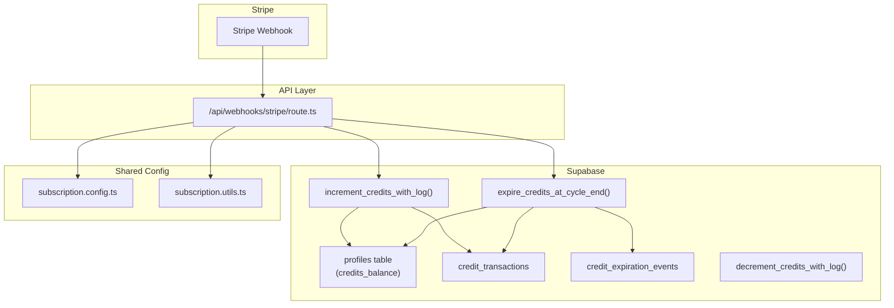
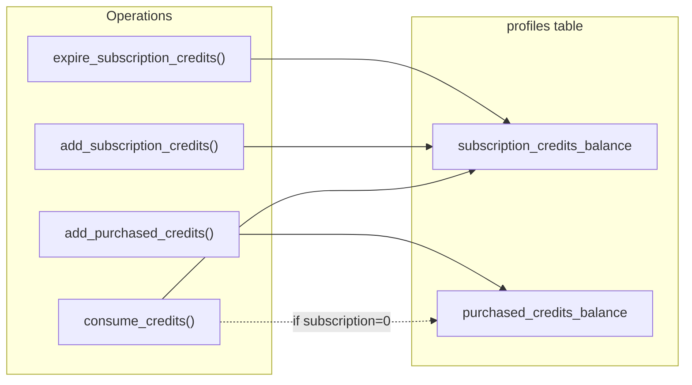
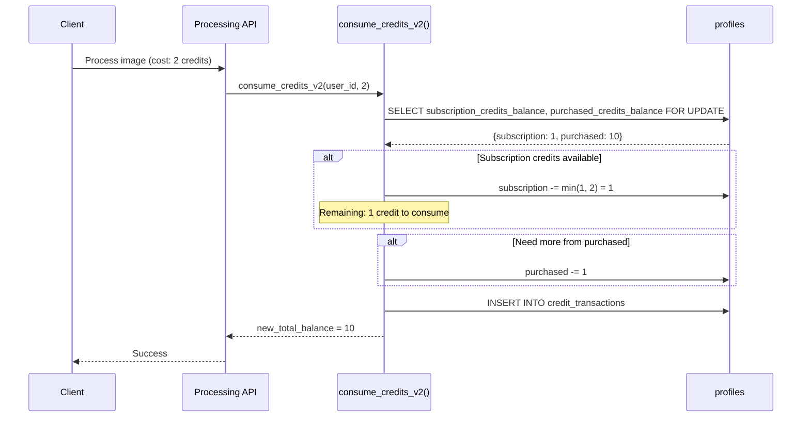
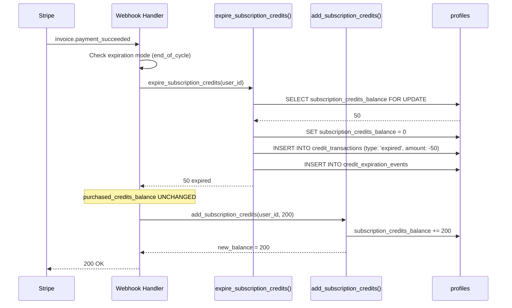
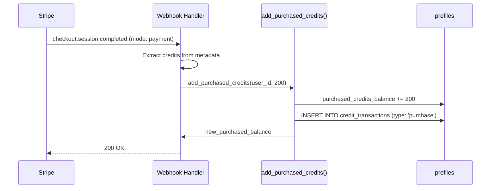

# Separate Credit Pools: Subscription vs Purchased Credits

**Status:** Draft
**Author:** Claude (Principal Architect)
**Created:** 2025-12-05
**Priority:** High (Bug Fix)

---

## 1. Context Analysis

### 1.1 Files Analyzed

| File Path | Purpose |
|-----------|---------|
| `supabase/migrations/20250120_create_profiles_table.sql` | Profiles schema with `credits_balance` |
| `supabase/migrations/20250121_enhanced_credit_functions.sql` | Credit increment/decrement RPCs |
| `supabase/migrations/20250303_add_credit_expiration_support.sql` | Expiration logic (bug source) |
| `shared/config/subscription.config.ts` | Plan & credit pack configuration |
| `shared/config/subscription.types.ts` | Type definitions |
| `shared/config/subscription.utils.ts` | Expiration calculation helpers |
| `app/api/webhooks/stripe/route.ts` | Webhook handlers for purchases & renewals |

### 1.2 Component & Dependency Overview



### 1.3 Current Behavior Summary

- **Single balance pool**: All credits stored in `profiles.credits_balance` (INTEGER)
- **Transaction logging**: `credit_transactions` tracks type (`subscription`, `purchase`, `usage`, etc.)
- **Expiration**: `expire_credits_at_cycle_end()` sets `credits_balance = 0` before renewal
- **Consumption**: `decrement_credits_with_log()` deducts from single balance without priority

### 1.4 Problem Statement

**When subscription credits expire at billing cycle end, ALL credits (including purchased credits that should never expire) are wiped because the system stores credits in a single undifferentiated balance field.**

---

## 2. Proposed Solution

### 2.1 Architecture Summary

- **Separate balance columns**: Add `purchased_credits_balance` to `profiles` table alongside existing `credits_balance` (rename to `subscription_credits_balance`)
- **FIFO consumption**: Consume subscription credits first, then purchased credits (subscription credits expire, so use them first)
- **Expiration scope**: Only expire `subscription_credits_balance`, leave `purchased_credits_balance` untouched
- **UI aggregation**: Display total balance to users (`subscription + purchased`)

**Alternatives Rejected:**

| Alternative | Reason Rejected |
|-------------|-----------------|
| Credit ledger table (per-allocation tracking) | Over-engineered for current needs; O(n) complexity for balance queries |
| Calculate from transaction log on expiration | Slow, fragile, depends on transaction log integrity |
| Soft-delete with expiration timestamps | Complex querying, doesn't solve consumption priority |

### 2.2 Architecture Diagram



### 2.3 Key Technical Decisions

| Decision | Rationale |
|----------|-----------|
| Two columns vs. ledger table | O(1) balance reads, simple schema, sufficient for current requirements |
| Subscription-first consumption | Subscription credits expire; using them first prevents waste |
| Rename existing column | Explicit naming (`subscription_credits_balance`) prevents confusion |
| Backward-compatible RPC signatures | Existing webhook code continues working with minimal changes |

### 2.4 Data Model Changes

**Migration: `20250305_separate_credit_pools.sql`**

```sql
-- Step 1: Add purchased_credits_balance column
ALTER TABLE profiles ADD COLUMN purchased_credits_balance INTEGER DEFAULT 0 NOT NULL;

-- Step 2: Rename existing column for clarity
ALTER TABLE profiles RENAME COLUMN credits_balance TO subscription_credits_balance;

-- Step 3: Add computed view for total balance (optional, for convenience)
CREATE OR REPLACE VIEW user_credits AS
SELECT
    id AS user_id,
    subscription_credits_balance,
    purchased_credits_balance,
    (subscription_credits_balance + purchased_credits_balance) AS total_credits_balance
FROM profiles;
```

**Index Consideration:** No new indexes needed; balance columns are accessed by primary key only.

---

## 2.5 Runtime Execution Flow

### Credit Consumption (Image Processing)



### Subscription Renewal (Credits Expiration)



### Credit Pack Purchase



---

## 3. Detailed Implementation Spec

### A. `supabase/migrations/20250305_separate_credit_pools.sql`

**Changes Needed:**
- Add `purchased_credits_balance` column
- Rename `credits_balance` to `subscription_credits_balance`
- Backfill: Calculate purchased credits from transaction history for existing users
- Update RPC functions

**Pseudo-code:**

```sql
-- Migration: Separate Credit Pools
-- 1. Add new column
ALTER TABLE profiles
ADD COLUMN purchased_credits_balance INTEGER DEFAULT 0 NOT NULL;

-- 2. Backfill purchased credits from transaction history
-- Sum all 'purchase' type transactions per user
UPDATE profiles p
SET purchased_credits_balance = COALESCE(
    (SELECT SUM(amount)
     FROM credit_transactions ct
     WHERE ct.user_id = p.id
       AND ct.type = 'purchase'
       AND ct.amount > 0),
    0
);

-- 3. Adjust subscription balance = current total - purchased
-- (existing credits_balance already includes both types)
UPDATE profiles
SET credits_balance = GREATEST(0, credits_balance - purchased_credits_balance);

-- 4. Rename for clarity
ALTER TABLE profiles
RENAME COLUMN credits_balance TO subscription_credits_balance;

-- 5. Add constraint
ALTER TABLE profiles
ADD CONSTRAINT chk_purchased_credits_non_negative
CHECK (purchased_credits_balance >= 0);
```

**Justification:** Backfill from transaction log ensures accurate split for existing users. `GREATEST(0, ...)` handles edge cases where log might be incomplete.

---

### B. `supabase/migrations/20250305_update_credit_rpcs.sql`

**New/Updated Functions:**

```sql
-- 1. Add subscription credits (for renewals)
CREATE OR REPLACE FUNCTION add_subscription_credits(
    target_user_id UUID,
    amount INTEGER,
    ref_id TEXT DEFAULT NULL,
    description TEXT DEFAULT NULL
)
RETURNS INTEGER -- returns new subscription balance
LANGUAGE plpgsql
SECURITY DEFINER
SET search_path = public
AS $$
DECLARE
    new_balance INTEGER;
BEGIN
    UPDATE profiles
    SET subscription_credits_balance = subscription_credits_balance + amount
    WHERE id = target_user_id
    RETURNING subscription_credits_balance INTO new_balance;

    IF new_balance IS NULL THEN
        RAISE EXCEPTION 'User not found: %', target_user_id;
    END IF;

    INSERT INTO credit_transactions (user_id, amount, type, reference_id, description)
    VALUES (target_user_id, amount, 'subscription', ref_id, description);

    RETURN new_balance;
END;
$$;

-- 2. Add purchased credits (for one-time purchases)
CREATE OR REPLACE FUNCTION add_purchased_credits(
    target_user_id UUID,
    amount INTEGER,
    ref_id TEXT DEFAULT NULL,
    description TEXT DEFAULT NULL
)
RETURNS INTEGER -- returns new purchased balance
LANGUAGE plpgsql
SECURITY DEFINER
SET search_path = public
AS $$
DECLARE
    new_balance INTEGER;
BEGIN
    UPDATE profiles
    SET purchased_credits_balance = purchased_credits_balance + amount
    WHERE id = target_user_id
    RETURNING purchased_credits_balance INTO new_balance;

    IF new_balance IS NULL THEN
        RAISE EXCEPTION 'User not found: %', target_user_id;
    END IF;

    INSERT INTO credit_transactions (user_id, amount, type, reference_id, description)
    VALUES (target_user_id, amount, 'purchase', ref_id, description);

    RETURN new_balance;
END;
$$;

-- 3. Consume credits (FIFO: subscription first, then purchased)
CREATE OR REPLACE FUNCTION consume_credits_v2(
    target_user_id UUID,
    amount INTEGER,
    ref_id TEXT DEFAULT NULL,
    description TEXT DEFAULT NULL
)
RETURNS TABLE(
    new_subscription_balance INTEGER,
    new_purchased_balance INTEGER,
    new_total_balance INTEGER
)
LANGUAGE plpgsql
SECURITY DEFINER
SET search_path = public
AS $$
DECLARE
    current_subscription INTEGER;
    current_purchased INTEGER;
    from_subscription INTEGER;
    from_purchased INTEGER;
BEGIN
    -- Lock row
    SELECT subscription_credits_balance, purchased_credits_balance
    INTO current_subscription, current_purchased
    FROM profiles
    WHERE id = target_user_id
    FOR UPDATE;

    IF current_subscription IS NULL THEN
        RAISE EXCEPTION 'User not found: %', target_user_id;
    END IF;

    -- Check total balance
    IF (current_subscription + current_purchased) < amount THEN
        RAISE EXCEPTION 'Insufficient credits. Required: %, Available: %',
            amount, (current_subscription + current_purchased);
    END IF;

    -- Calculate split (subscription first)
    from_subscription := LEAST(current_subscription, amount);
    from_purchased := amount - from_subscription;

    -- Update balances
    UPDATE profiles
    SET
        subscription_credits_balance = subscription_credits_balance - from_subscription,
        purchased_credits_balance = purchased_credits_balance - from_purchased
    WHERE id = target_user_id;

    -- Log transaction (negative amount)
    INSERT INTO credit_transactions (user_id, amount, type, reference_id, description)
    VALUES (target_user_id, -amount, 'usage', ref_id,
            COALESCE(description, '') ||
            CASE WHEN from_subscription > 0 AND from_purchased > 0
                 THEN format(' (sub: %s, purchased: %s)', from_subscription, from_purchased)
                 ELSE ''
            END);

    RETURN QUERY
    SELECT
        current_subscription - from_subscription,
        current_purchased - from_purchased,
        (current_subscription - from_subscription) + (current_purchased - from_purchased);
END;
$$;

-- 4. Update expire function to only touch subscription credits
CREATE OR REPLACE FUNCTION expire_subscription_credits(
    target_user_id UUID,
    expiration_reason TEXT DEFAULT 'cycle_end',
    subscription_stripe_id TEXT DEFAULT NULL,
    cycle_end_date TIMESTAMPTZ DEFAULT NULL
)
RETURNS INTEGER
LANGUAGE plpgsql
SECURITY DEFINER
SET search_path = public
AS $$
DECLARE
    expired_amount INTEGER;
BEGIN
    IF expiration_reason NOT IN ('cycle_end', 'rolling_window', 'subscription_canceled') THEN
        RAISE EXCEPTION 'Invalid expiration_reason: %', expiration_reason;
    END IF;

    -- Only get SUBSCRIPTION credits
    SELECT subscription_credits_balance INTO expired_amount
    FROM profiles
    WHERE id = target_user_id
    FOR UPDATE;

    IF expired_amount IS NULL OR expired_amount <= 0 THEN
        RETURN 0;
    END IF;

    -- Only reset SUBSCRIPTION balance (purchased untouched)
    UPDATE profiles
    SET subscription_credits_balance = 0,
        updated_at = NOW()
    WHERE id = target_user_id;

    -- Log expiration
    INSERT INTO credit_transactions (user_id, amount, type, description, ref_id)
    VALUES (target_user_id, -expired_amount, 'expired',
            'Subscription credits expired at billing cycle end', subscription_stripe_id);

    INSERT INTO credit_expiration_events (user_id, expired_amount, expiration_reason,
                                          billing_cycle_end, subscription_id)
    VALUES (target_user_id, expired_amount, expiration_reason, cycle_end_date, subscription_stripe_id);

    RETURN expired_amount;
END;
$$;
```

---

### C. `app/api/webhooks/stripe/route.ts`

**Changes Needed:**
- Update `handleCreditPackPurchase()` to use `add_purchased_credits`
- Update invoice handler to use `expire_subscription_credits` and `add_subscription_credits`

**Pseudo-code:**

```typescript
// handleCreditPackPurchase - line ~465
const { error } = await supabaseAdmin.rpc('add_purchased_credits', {
    target_user_id: userId,
    amount: credits,
    ref_id: paymentIntentId ? `pi_${paymentIntentId}` : `session_${session.id}`,
    description: `Credit pack purchase - ${packKey || 'unknown'} - ${credits} credits`,
});

// handleInvoicePaymentSucceeded - expiration section ~1007
const { data: expiredCount, error: expireError } = await supabaseAdmin.rpc(
    'expire_subscription_credits', // NEW NAME
    { /* same params */ }
);

// handleInvoicePaymentSucceeded - add credits ~1045
const { error } = await supabaseAdmin.rpc('add_subscription_credits', { // NEW NAME
    target_user_id: userId,
    amount: actualCreditsToAdd,
    ref_id: `invoice_${invoice.id}`,
    description,
});
```

---

### D. Credit consumption in processing

**File:** `server/services/image-generation.service.ts` (or similar)

**Changes Needed:** Update to use `consume_credits_v2`

```typescript
const { data, error } = await supabase.rpc('consume_credits_v2', {
    target_user_id: userId,
    amount: creditCost,
    ref_id: jobId,
    description: `Image processing - ${mode}`,
});

if (error) throw new InsufficientCreditsError(error.message);

// data.new_total_balance available for response
```

---

### E. UI Balance Display

**Files:** Dashboard components showing credit balance

**Changes Needed:** Query both columns, sum for display

```typescript
// Option 1: Use view
const { data } = await supabase
    .from('user_credits')
    .select('total_credits_balance')
    .eq('user_id', userId)
    .single();

// Option 2: Query profiles directly
const { data } = await supabase
    .from('profiles')
    .select('subscription_credits_balance, purchased_credits_balance')
    .eq('id', userId)
    .single();

const totalBalance = data.subscription_credits_balance + data.purchased_credits_balance;
```

**Optional Enhancement:** Show breakdown in UI ("50 subscription + 200 purchased = 250 total")

---

## 4. Step-by-Step Execution Plan

### Phase 1: Database Migration

- [ ] Create migration `20250305_separate_credit_pools.sql`
- [ ] Add `purchased_credits_balance` column
- [ ] Backfill purchased credits from `credit_transactions` history
- [ ] Adjust existing `credits_balance` to reflect only subscription credits
- [ ] Rename column to `subscription_credits_balance`
- [ ] Create new RPC functions (`add_subscription_credits`, `add_purchased_credits`, `consume_credits_v2`, `expire_subscription_credits`)
- [ ] Keep old RPCs as deprecated aliases for backward compatibility

### Phase 2: Backend Updates

- [ ] Update webhook handler `handleCreditPackPurchase()` to use `add_purchased_credits`
- [ ] Update webhook handler invoice success to use new expiration/add RPCs
- [ ] Update credit consumption in image processing to use `consume_credits_v2`
- [ ] Update any admin credit adjustment tools

### Phase 3: Client/UI Updates

- [ ] Update profile queries to fetch both balance columns
- [ ] Update dashboard credit display to show total
- [ ] (Optional) Add breakdown view: "X subscription + Y purchased = Z total"
- [ ] Update any client-side credit checks

### Phase 4: Cleanup

- [ ] Remove deprecated RPC functions after verification period
- [ ] Update TypeScript types in `shared/types/`
- [ ] Regenerate Supabase types

---

## 5. Testing Strategy

### Unit Tests

| Function | Test Cases |
|----------|------------|
| `add_subscription_credits` | Add positive amount, user not found error |
| `add_purchased_credits` | Add positive amount, user not found error |
| `consume_credits_v2` | Full from subscription, split between pools, full from purchased, insufficient total |
| `expire_subscription_credits` | Expire only subscription, leave purchased untouched, zero balance no-op |

### Integration Tests

- [ ] Full subscription renewal cycle: expire old + add new, verify purchased unchanged
- [ ] Credit pack purchase: verify adds to purchased only
- [ ] Image processing: verify FIFO consumption order
- [ ] Mixed balance consumption across multiple operations

### Edge Cases

| Scenario | Expected Behavior |
|----------|-------------------|
| User has 0 subscription, 10 purchased, consumes 5 | Deduct 5 from purchased |
| User has 3 subscription, 10 purchased, consumes 5 | Deduct 3 sub + 2 purchased |
| Subscription expires with 0 balance | No-op, return 0 |
| New user (no transaction history) | Both balances start at 0 |
| Backfill user with negative sum (refunds > purchases) | Set purchased to 0, not negative |

---

## 6. Acceptance Criteria

- [ ] Subscription renewal expires ONLY `subscription_credits_balance`
- [ ] Credit pack purchases add ONLY to `purchased_credits_balance`
- [ ] Credit consumption uses subscription credits first
- [ ] Total displayed balance = subscription + purchased
- [ ] Existing users backfilled correctly (verify with sample queries)
- [ ] All webhook handlers use new RPC functions
- [ ] Old `increment_credits_with_log` deprecated but functional
- [ ] Unit tests pass for all new RPCs
- [ ] Integration test: purchase credits, wait for renewal, verify purchased remain

---

## 7. Verification & Rollback

### Success Criteria

1. **Pre-deploy verification:**
   - Run backfill query in staging, verify sample users
   - `SELECT id, subscription_credits_balance, purchased_credits_balance FROM profiles LIMIT 100`

2. **Post-deploy monitoring:**
   - Check `credit_expiration_events` only shows subscription amounts
   - Verify `credit_transactions` correctly categorized

3. **User-facing verification:**
   - Dashboard shows correct total balance
   - No reports of "missing" purchased credits

### Rollback Plan

**If issues detected:**

1. **Immediate (< 1 hour):** Revert webhook handler code to use old RPCs (backward compatible aliases)
2. **Schema rollback (if needed):**
   ```sql
   -- Recombine balances
   UPDATE profiles
   SET subscription_credits_balance = subscription_credits_balance + purchased_credits_balance;

   -- Rename back
   ALTER TABLE profiles RENAME COLUMN subscription_credits_balance TO credits_balance;

   -- Drop new column
   ALTER TABLE profiles DROP COLUMN purchased_credits_balance;
   ```

**Note:** Rollback loses granular tracking. Better to fix forward if possible.

---

## 8. Open Questions

1. **Should we show the breakdown in UI?** ("50 subscription + 200 purchased")
   - Pro: Transparency for users
   - Con: Added complexity, potential confusion
   - **Recommendation:** Start with total only, add breakdown as future enhancement

2. **What about existing refund logic?**
   - Current `clawback_credits_from_transaction` may need update
   - Should refund go back to the pool it came from?
   - **Recommendation:** Refunds should go to purchased pool (safer, never expires)

3. **Admin credit adjustments?**
   - Need to specify which pool to adjust
   - **Recommendation:** Add dropdown in admin UI, default to purchased
