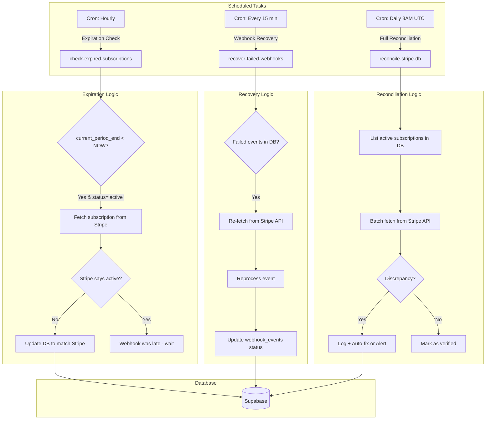
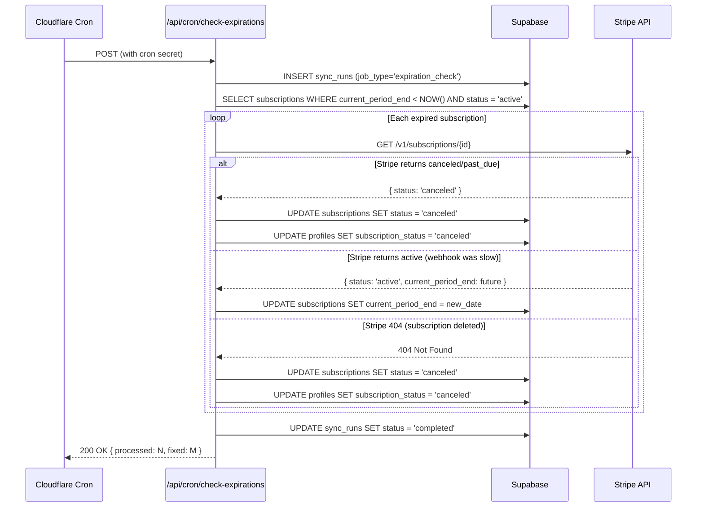
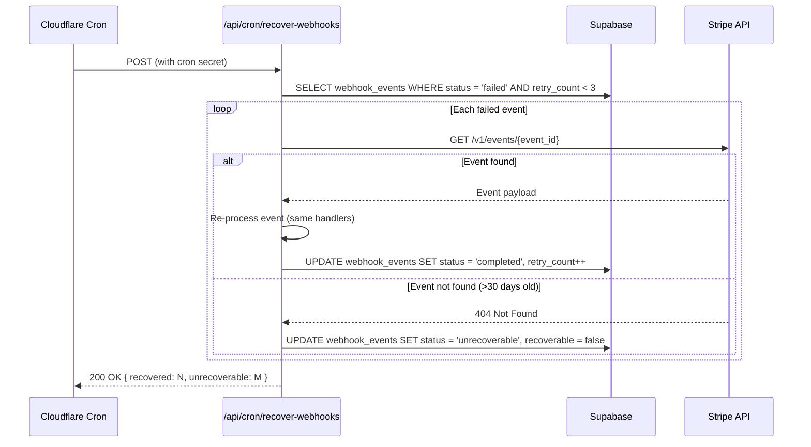

# PRD: Stripe x Database Subscription Sync System

**Version:** 1.0
**Author:** Principal Architect
**Created:** December 2, 2025
**Status:** Draft

---

## Table of Contents

1. [Context Analysis](#1-context-analysis)
2. [Proposed Solution](#2-proposed-solution)
3. [Detailed Implementation Spec](#3-detailed-implementation-spec)
4. [Step-by-Step Execution Plan](#4-step-by-step-execution-plan)
5. [Testing Strategy](#5-testing-strategy)
6. [Acceptance Criteria](#6-acceptance-criteria)
7. [Verification & Rollback](#7-verification--rollback)

---

## 1. Context Analysis

### 1.1 Files Analyzed

| File | Purpose |
|------|---------|
| `app/api/webhooks/stripe/route.ts` | Main Stripe webhook handler (612 lines) |
| `app/api/subscription/change/route.ts` | Subscription plan change endpoint |
| `shared/config/stripe.ts` | Plan configuration (SUBSCRIPTION_PRICE_MAP) |
| `supabase/migrations/20250120_create_subscriptions_table.sql` | Subscriptions schema |
| `supabase/migrations/20250202_create_webhook_events_table.sql` | Idempotency tracking |
| `docs/technical/systems/subscription-system.md` | Current system documentation |

### 1.2 Component & Dependency Overview

```mermaid
graph TD
    subgraph "CURRENT STATE"
        A[Stripe] -->|Webhooks| B[/api/webhooks/stripe]
        B --> C[Supabase DB]
        D[No scheduled sync] -.->|MISSING| C
    end

    subgraph "Database Tables"
        C --> E[(profiles)]
        C --> F[(subscriptions)]
        C --> G[(credit_transactions)]
        C --> H[(webhook_events)]
    end

    subgraph "PROBLEM"
        I[Webhook fails] -.->|No recovery| J[Data drift]
        K[Period ends] -.->|No check| L[Stale status]
    end
```

### 1.3 Current Behavior Summary

- **Event-driven only**: System relies 100% on Stripe webhooks for state synchronization
- **Webhook idempotency**: Events tracked in `webhook_events` table to prevent duplicates
- **Handled events**:
  - `checkout.session.completed` - Adds initial subscription credits
  - `customer.subscription.created/updated` - Upserts subscription record, updates profile
  - `customer.subscription.deleted` - Marks subscription as canceled
  - `invoice.payment_succeeded` - Adds monthly credits with rollover cap
  - `invoice.payment_failed` - Sets user to `past_due` status
- **NOT handled**:
  - `charge.refunded` - Logged but no credit clawback
  - `charge.dispute.created` - Logged but no action
  - Scheduled sync fallback when webhooks fail
  - Expiration checks when `current_period_end` passes

### 1.4 Problem Statement

**The system has no scheduled synchronization mechanism to:**
1. Recover from failed/missed Stripe webhooks
2. Detect and handle expired subscriptions whose `current_period_end` has passed
3. Verify database state matches Stripe source of truth
4. Clean up orphaned or stale subscription records

**Business Impact:**
- Users may retain active status after subscription truly expires
- Failed webhooks create permanent data drift with no automatic recovery
- No visibility into sync health or discrepancies

---

## 2. Proposed Solution

### 2.1 Architecture Summary

- **Cron-based sync**: Implement scheduled tasks using Cloudflare Pages Cron Triggers or Supabase pg_cron
- **Three sync functions**:
  1. **Expiration Checker** (hourly): Detect subscriptions past `current_period_end`
  2. **Webhook Recovery** (every 15 min): Retry failed webhook events
  3. **Full Reconciliation** (daily): Compare DB state against Stripe API
- **Non-destructive**: Log discrepancies, auto-fix safe cases, alert on others
- **Observable**: Structured logging for all sync operations

**Alternative Approaches Considered:**

| Approach | Rejected Because |
|----------|------------------|
| Real-time polling | Inefficient, rate-limited by Stripe API |
| Stripe Sigma (SQL) | Requires Enterprise plan, added cost |
| Manual admin sync | Not scalable, human error prone |
| Edge-function only | Cold starts unreliable for scheduled tasks |

### 2.2 Architecture Diagram



### 2.3 Key Technical Decisions

| Decision | Rationale |
|----------|-----------|
| **Cloudflare Cron Triggers** | Native to our hosting, no additional infrastructure |
| **Supabase pg_cron as backup** | Can run in-database if edge crons unreliable |
| **15-min webhook recovery interval** | Balances freshness vs. API rate limits |
| **Hourly expiration check** | Grace period for late webhooks (Stripe can delay) |
| **Daily full reconciliation** | Comprehensive but expensive - once per day is sufficient |
| **Service key for cron auth** | Crons need elevated access, use separate service role key |
| **Structured JSON logging** | Essential for debugging scheduled background tasks |

### 2.4 Data Model Changes

#### New Table: `sync_runs`

Tracks execution history of sync jobs for observability.

```sql
CREATE TABLE sync_runs (
  id UUID PRIMARY KEY DEFAULT gen_random_uuid(),
  job_type TEXT NOT NULL CHECK (job_type IN ('expiration_check', 'webhook_recovery', 'full_reconciliation')),
  started_at TIMESTAMPTZ NOT NULL DEFAULT NOW(),
  completed_at TIMESTAMPTZ,
  status TEXT NOT NULL DEFAULT 'running' CHECK (status IN ('running', 'completed', 'failed')),
  records_processed INTEGER DEFAULT 0,
  records_fixed INTEGER DEFAULT 0,
  discrepancies_found INTEGER DEFAULT 0,
  error_message TEXT,
  metadata JSONB
);

CREATE INDEX idx_sync_runs_job_type ON sync_runs(job_type);
CREATE INDEX idx_sync_runs_started_at ON sync_runs(started_at DESC);
```

#### Modify Table: `webhook_events`

Add retry tracking columns.

```sql
ALTER TABLE webhook_events
ADD COLUMN retry_count INTEGER DEFAULT 0,
ADD COLUMN last_retry_at TIMESTAMPTZ,
ADD COLUMN recoverable BOOLEAN DEFAULT TRUE;
```

---

## 2.5 Runtime Execution Flow

### Expiration Check Flow



### Webhook Recovery Flow



---

## 3. Detailed Implementation Spec

### A. `app/api/cron/check-expirations/route.ts`

**Purpose:** Detect subscriptions past their billing period and sync with Stripe.

**Authentication:** Requires `CRON_SECRET` header (set in Cloudflare environment).

**Changes Needed:**
- New file creation
- Add `CRON_SECRET` environment variable

**Pseudo-code:**

```typescript
export const runtime = 'edge';

export async function POST(request: NextRequest) {
  // 1. Verify cron secret
  const cronSecret = request.headers.get('x-cron-secret');
  if (cronSecret !== serverEnv.CRON_SECRET) {
    return NextResponse.json({ error: 'Unauthorized' }, { status: 401 });
  }

  // 2. Start sync run
  const { data: syncRun } = await supabaseAdmin
    .from('sync_runs')
    .insert({ job_type: 'expiration_check' })
    .select()
    .single();

  // 3. Find expired subscriptions (active but period ended)
  const { data: expiredSubs } = await supabaseAdmin
    .from('subscriptions')
    .select('id, user_id, status, current_period_end')
    .eq('status', 'active')
    .lt('current_period_end', new Date().toISOString());

  let processed = 0;
  let fixed = 0;

  // 4. For each, verify against Stripe
  for (const sub of expiredSubs ?? []) {
    processed++;
    try {
      const stripeSub = await stripe.subscriptions.retrieve(sub.id);

      if (stripeSub.status !== 'active') {
        // Stripe says not active - update our DB
        await updateSubscriptionStatus(sub.user_id, sub.id, stripeSub.status);
        fixed++;
      } else {
        // Stripe says active - update period end (webhook was slow)
        await updateSubscriptionPeriod(sub.id, stripeSub);
      }
    } catch (error) {
      if (isStripeNotFoundError(error)) {
        // Subscription deleted in Stripe
        await markSubscriptionCanceled(sub.user_id, sub.id);
        fixed++;
      } else {
        console.error(`Error checking subscription ${sub.id}:`, error);
      }
    }
  }

  // 5. Complete sync run
  await supabaseAdmin
    .from('sync_runs')
    .update({
      status: 'completed',
      completed_at: new Date().toISOString(),
      records_processed: processed,
      records_fixed: fixed,
    })
    .eq('id', syncRun.id);

  return NextResponse.json({ processed, fixed });
}
```

**Justification:** Hourly check ensures we catch expired subscriptions within 1 hour even if webhooks fail. Uses Stripe as source of truth.

---

### B. `app/api/cron/recover-webhooks/route.ts`

**Purpose:** Retry processing of failed webhook events.

**Changes Needed:**
- New file creation
- Modify `webhook_events` table (add retry columns)

**Pseudo-code:**

```typescript
export const runtime = 'edge';

const MAX_RETRIES = 3;

export async function POST(request: NextRequest) {
  // 1. Verify cron secret
  const cronSecret = request.headers.get('x-cron-secret');
  if (cronSecret !== serverEnv.CRON_SECRET) {
    return NextResponse.json({ error: 'Unauthorized' }, { status: 401 });
  }

  // 2. Find failed events that are retryable
  const { data: failedEvents } = await supabaseAdmin
    .from('webhook_events')
    .select('*')
    .eq('status', 'failed')
    .eq('recoverable', true)
    .lt('retry_count', MAX_RETRIES)
    .order('created_at', { ascending: true })
    .limit(50); // Batch size

  let recovered = 0;
  let unrecoverable = 0;

  for (const event of failedEvents ?? []) {
    try {
      // Fetch fresh event from Stripe
      const stripeEvent = await stripe.events.retrieve(event.event_id);

      // Re-process using existing handlers
      await processStripeEvent(stripeEvent);

      // Mark as completed
      await supabaseAdmin
        .from('webhook_events')
        .update({
          status: 'completed',
          retry_count: event.retry_count + 1,
          last_retry_at: new Date().toISOString(),
        })
        .eq('id', event.id);

      recovered++;
    } catch (error) {
      if (isStripeNotFoundError(error)) {
        // Event too old (>30 days) or doesn't exist
        await supabaseAdmin
          .from('webhook_events')
          .update({
            status: 'unrecoverable',
            recoverable: false,
            error_message: 'Event not found in Stripe (expired or invalid)',
          })
          .eq('id', event.id);
        unrecoverable++;
      } else {
        // Increment retry count
        await supabaseAdmin
          .from('webhook_events')
          .update({
            retry_count: event.retry_count + 1,
            last_retry_at: new Date().toISOString(),
            error_message: error.message,
          })
          .eq('id', event.id);
      }
    }
  }

  return NextResponse.json({ recovered, unrecoverable });
}
```

**Justification:** Failed webhooks need recovery mechanism. Stripe retains events for 30 days, giving us a recovery window.

---

### C. `app/api/cron/reconcile/route.ts`

**Purpose:** Full daily reconciliation between DB and Stripe.

**Changes Needed:**
- New file creation
- Consider rate limiting (Stripe API limits)

**Pseudo-code:**

```typescript
export const runtime = 'edge';

export async function POST(request: NextRequest) {
  // 1. Verify cron secret
  // 2. Start sync run (job_type: 'full_reconciliation')

  // 3. Get all active subscriptions from DB
  const { data: dbSubs } = await supabaseAdmin
    .from('subscriptions')
    .select('id, user_id, status, price_id, current_period_end')
    .in('status', ['active', 'trialing', 'past_due']);

  let processed = 0;
  let discrepancies = 0;
  let fixed = 0;
  const issues: Array<{ subId: string; issue: string; action: string }> = [];

  // 4. Batch process (respect Stripe rate limits)
  for (const dbSub of dbSubs ?? []) {
    processed++;

    try {
      const stripeSub = await stripe.subscriptions.retrieve(dbSub.id);

      // Check for discrepancies
      if (stripeSub.status !== dbSub.status) {
        discrepancies++;
        issues.push({
          subId: dbSub.id,
          issue: `Status mismatch: DB=${dbSub.status}, Stripe=${stripeSub.status}`,
          action: 'auto-fixed',
        });
        await syncSubscriptionFromStripe(dbSub.user_id, stripeSub);
        fixed++;
      }

      if (stripeSub.items.data[0]?.price.id !== dbSub.price_id) {
        discrepancies++;
        issues.push({
          subId: dbSub.id,
          issue: `Price mismatch: DB=${dbSub.price_id}, Stripe=${stripeSub.items.data[0]?.price.id}`,
          action: 'auto-fixed',
        });
        await syncSubscriptionFromStripe(dbSub.user_id, stripeSub);
        fixed++;
      }

      // Add small delay to respect rate limits
      await sleep(100);

    } catch (error) {
      if (isStripeNotFoundError(error)) {
        discrepancies++;
        issues.push({
          subId: dbSub.id,
          issue: 'Subscription exists in DB but not in Stripe',
          action: 'marked-canceled',
        });
        await markSubscriptionCanceled(dbSub.user_id, dbSub.id);
        fixed++;
      }
    }
  }

  // 5. Complete sync run with metadata
  await supabaseAdmin
    .from('sync_runs')
    .update({
      status: 'completed',
      completed_at: new Date().toISOString(),
      records_processed: processed,
      records_fixed: fixed,
      discrepancies_found: discrepancies,
      metadata: { issues },
    })
    .eq('id', syncRun.id);

  return NextResponse.json({ processed, discrepancies, fixed, issues });
}
```

**Justification:** Daily comprehensive check catches any edge cases missed by event-driven updates. Runs at 3 AM UTC to minimize impact.

---

### D. `supabase/migrations/YYYYMMDD_add_sync_tables.sql`

**Purpose:** Add sync tracking tables and modify webhook_events.

```sql
-- Create sync_runs table for observability
CREATE TABLE IF NOT EXISTS sync_runs (
  id UUID PRIMARY KEY DEFAULT gen_random_uuid(),
  job_type TEXT NOT NULL CHECK (job_type IN ('expiration_check', 'webhook_recovery', 'full_reconciliation')),
  started_at TIMESTAMPTZ NOT NULL DEFAULT NOW(),
  completed_at TIMESTAMPTZ,
  status TEXT NOT NULL DEFAULT 'running' CHECK (status IN ('running', 'completed', 'failed')),
  records_processed INTEGER DEFAULT 0,
  records_fixed INTEGER DEFAULT 0,
  discrepancies_found INTEGER DEFAULT 0,
  error_message TEXT,
  metadata JSONB,
  created_at TIMESTAMPTZ DEFAULT NOW()
);

-- Indexes for querying sync history
CREATE INDEX idx_sync_runs_job_type ON sync_runs(job_type);
CREATE INDEX idx_sync_runs_started_at ON sync_runs(started_at DESC);
CREATE INDEX idx_sync_runs_status ON sync_runs(status);

-- Add retry columns to webhook_events
ALTER TABLE webhook_events
ADD COLUMN IF NOT EXISTS retry_count INTEGER DEFAULT 0,
ADD COLUMN IF NOT EXISTS last_retry_at TIMESTAMPTZ,
ADD COLUMN IF NOT EXISTS recoverable BOOLEAN DEFAULT TRUE;

-- Index for finding retryable failed events
CREATE INDEX IF NOT EXISTS idx_webhook_events_retryable
ON webhook_events(status, recoverable, retry_count)
WHERE status = 'failed' AND recoverable = TRUE;

-- RLS for sync_runs (admin only)
ALTER TABLE sync_runs ENABLE ROW LEVEL SECURITY;

CREATE POLICY "Service role can manage sync_runs" ON sync_runs
  FOR ALL
  USING (auth.role() = 'service_role');

-- Grant necessary permissions
GRANT SELECT, INSERT, UPDATE ON sync_runs TO service_role;
```

---

### E. Cloudflare Cron Configuration

**File:** `wrangler.toml` (or Cloudflare dashboard)

```toml
[triggers]
crons = [
  # Webhook recovery - every 15 minutes
  "*/15 * * * *",
  # Expiration check - every hour at :05
  "5 * * * *",
  # Full reconciliation - daily at 3:05 AM UTC
  "5 3 * * *"
]
```

**Cron Handler in** `app/api/cron/route.ts`:

```typescript
export async function POST(request: NextRequest) {
  const url = new URL(request.url);

  // Cloudflare passes cron pattern in header
  const cronPattern = request.headers.get('cf-cron-pattern');

  // Route to appropriate handler
  if (cronPattern?.includes('*/15')) {
    return handleWebhookRecovery(request);
  } else if (cronPattern?.includes('5 * * * *')) {
    return handleExpirationCheck(request);
  } else if (cronPattern?.includes('5 3 * * *')) {
    return handleFullReconciliation(request);
  }

  return NextResponse.json({ error: 'Unknown cron pattern' }, { status: 400 });
}
```

---

### F. Environment Variables

Add to `.env.api`:

```bash
# Cron job authentication
CRON_SECRET=your-secure-random-string

# Optional: Separate Stripe key for cron jobs (rate limit isolation)
STRIPE_CRON_SECRET_KEY=${STRIPE_SECRET_KEY}
```

---

## 4. Step-by-Step Execution Plan

### Phase 1: Database Setup

- [ ] Create migration `20250302_add_sync_tables.sql`
- [ ] Add `retry_count`, `last_retry_at`, `recoverable` columns to `webhook_events`
- [ ] Create `sync_runs` table with proper indexes
- [ ] Apply migration to development branch
- [ ] Test RLS policies

### Phase 2: Core Sync Functions

- [ ] Create shared helper functions in `server/services/subscription-sync.service.ts`:
  - `syncSubscriptionFromStripe(userId, stripeSubscription)`
  - `markSubscriptionCanceled(userId, subscriptionId)`
  - `updateSubscriptionPeriod(subscriptionId, stripeSubscription)`
  - `processStripeEvent(event)` (refactored from webhook route)
- [ ] Add unit tests for sync helper functions

### Phase 3: Cron Endpoints

- [ ] Implement `app/api/cron/check-expirations/route.ts`
- [ ] Implement `app/api/cron/recover-webhooks/route.ts`
- [ ] Implement `app/api/cron/reconcile/route.ts`
- [ ] Add `CRON_SECRET` environment variable
- [ ] Add unit tests for each cron endpoint

### Phase 4: Cloudflare Cron Setup

- [ ] Configure cron triggers in Cloudflare dashboard or `wrangler.toml`
- [ ] Test cron execution in staging environment
- [ ] Verify logging and error handling

### Phase 5: Monitoring & Observability

- [ ] Add sync run dashboard query to admin panel
- [ ] Create alert for failed sync runs
- [ ] Add metrics endpoint for sync health

### Phase 6: Documentation & Deployment

- [ ] Update `docs/technical/systems/subscription-system.md`
- [ ] Add runbook for manual sync trigger
- [ ] Deploy to production
- [ ] Monitor first 48 hours of cron execution

---

## 5. Testing Strategy

### Unit Tests

**Files to test:**
- `subscription-sync.service.ts` - All helper functions
- Each cron route handler in isolation

**Error scenarios:**
- Stripe API timeout
- Invalid subscription ID
- Database connection failure
- Rate limit exceeded

### Integration Tests

**End-to-end flows:**
1. Create subscription via webhook
2. Simulate webhook failure (mark as failed in DB)
3. Run webhook recovery cron
4. Verify subscription is correctly synced

### Edge Cases

| Scenario | Expected Behavior |
|----------|-------------------|
| Subscription expired, webhook late | Wait for webhook (don't double-process) |
| Subscription canceled in Stripe portal | Detect in expiration check, update DB |
| Webhook event older than 30 days | Mark as unrecoverable, log warning |
| Stripe API rate limited | Back off, retry on next cron run |
| Multiple cron runs overlap | Use database locks or skip if already running |
| User deleted but subscription exists | Clean up orphaned subscription record |

---

## 6. Acceptance Criteria

- [ ] Expiration check runs hourly and detects expired subscriptions
- [ ] Webhook recovery retries failed events up to 3 times
- [ ] Full reconciliation runs daily and logs all discrepancies
- [ ] All sync runs logged to `sync_runs` table with metrics
- [ ] No duplicate processing (idempotency maintained)
- [ ] Cron endpoints protected by `CRON_SECRET`
- [ ] Unit tests pass with >80% coverage on new code
- [ ] Integration tests verify end-to-end sync scenarios
- [ ] Sync health visible in admin panel
- [ ] Response times < 30s for expiration check, < 60s for recovery
- [ ] Full reconciliation completes within 5 minutes for 1000 subscriptions

---

## 7. Verification & Rollback

### Success Criteria

| Metric | Target |
|--------|--------|
| Expiration detection latency | < 1 hour |
| Webhook recovery success rate | > 95% of retryable events |
| Reconciliation discrepancy rate | < 1% of active subscriptions |
| Cron job success rate | > 99% |
| No false cancellations | 0 |

### Monitoring

- **Cloudflare Cron Logs**: Check for execution failures
- **Supabase Logs**: Monitor sync_runs table
- **Baselime Alerts**: Set up for sync failures

### Rollback Plan

1. **Immediate**: Disable cron triggers in Cloudflare dashboard
2. **If data corrupted**:
   - Run reconciliation in "dry-run" mode (log only, no writes)
   - Manually verify flagged subscriptions
   - Use Stripe as source of truth to restore DB state
3. **Migration rollback**:
   ```sql
   -- Revert webhook_events changes
   ALTER TABLE webhook_events
   DROP COLUMN IF EXISTS retry_count,
   DROP COLUMN IF EXISTS last_retry_at,
   DROP COLUMN IF EXISTS recoverable;

   -- Drop sync_runs table
   DROP TABLE IF EXISTS sync_runs;
   ```

---

## Appendix: Related Documentation

- `docs/technical/systems/subscription-system.md` - Full subscription system docs
- `docs/PRDs/webhook-idempotency.md` - Webhook idempotency PRD
- Stripe Webhooks: https://stripe.com/docs/webhooks
- Cloudflare Cron Triggers: https://developers.cloudflare.com/workers/configuration/cron-triggers/
