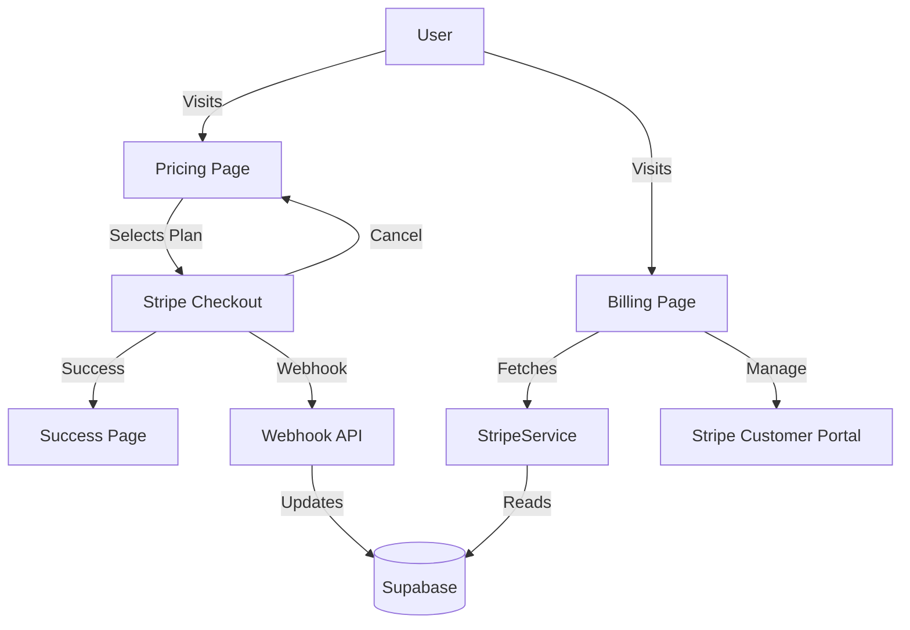

# Stripe Integration PRD

## 1. Context Analysis

### 1.1 Files Analyzed

- `src/lib/stripe/config.ts`: Stripe client configuration.
- `src/lib/stripe/types.ts`: TypeScript definitions.
- `src/lib/stripe/stripeService.ts`: Frontend service for Stripe operations.
- `app/api/checkout/route.ts`: Backend API for creating checkout sessions.
- `app/api/webhooks/stripe/route.ts`: Webhook handler for Stripe events.
- `app/pricing/page.tsx`: Pricing page UI (currently using placeholder IDs).
- `app/dashboard/billing/page.tsx`: Billing page UI (currently static/mocked).
- `src/components/stripe/*`: Reusable Stripe components.

### 1.2 Current Behavior Summary

- **Backend**: API routes for checkout and webhooks are implemented and seem functional. They handle customer creation, session creation, and webhook events (credits increment, subscription updates).
- **Frontend Service**: `StripeService` provides methods to interact with the backend and Supabase.
- **Pricing Page**: Exists but uses placeholder Price IDs (`price_starter_credits`, etc.).
- **Billing Page**: Exists but is static. It does not fetch or display real user data (credits, subscription status) and buttons are non-functional.
- **Success/Cancel Pages**: Do not exist (checked `app/success` and `app/canceled`).

### 1.3 Problem Statement

The Stripe integration is partially complete. The backend logic is in place, but the frontend is disconnected. The pricing page needs real configuration, the billing page is a mock, and essential flow pages (success/cancel) are missing. There is no documented manual testing process.

---

## 2. Proposed Solution

### 2.1 Architecture Summary

- **Pricing Page**: Connect `PricingCard` components to real Stripe Price IDs via environment variables or a configuration file.
- **Billing Page**: Refactor to use `StripeService` to fetch and display real user data (credits, subscription). Implement "Manage Subscription" using Stripe Customer Portal.
- **Flow Pages**: Create `app/success/page.tsx` and `app/canceled/page.tsx` to handle redirect states.
- **Manual Testing**: Document a step-by-step guide to test the flow using Stripe Test Mode.

### 2.2 Architecture Diagram



### 2.3 Key Technical Decisions

- **Environment Variables**: Store Price IDs in `NEXT_PUBLIC_` env vars to allow frontend access without hardcoding.
- **Client-Side Fetching**: Use `StripeService` (which calls Supabase) to fetch user profile data for the Billing page.
- **Stripe Customer Portal**: Use Stripe's hosted portal for subscription management instead of building a custom UI.

---

## 3. Detailed Implementation Spec

### A. `app/pricing/page.tsx`

- **Changes**: Replace hardcoded strings with constants/env vars.
- **Configuration**: Define a `STRIPE_PRICES` constant mapping internal names (starter, pro, etc.) to Stripe Price IDs.

### B. `app/dashboard/billing/page.tsx`

- **Changes**:
  - Convert to async component or use `useEffect` to fetch data.
  - Use `StripeService.getUserProfile()` and `StripeService.getActiveSubscription()`.
  - Display actual credits balance.
  - Display actual subscription status/plan.
  - "Upgrade Plan" button -> Redirect to `/pricing`.
  - "Manage Subscription" button -> Call API to create portal session (need to add this feature).

### C. `app/success/page.tsx` (NEW)

- **Purpose**: Landing page after successful payment.
- **Features**:
  - Display success message.
  - Show purchased items/credits.
  - Button to return to Dashboard.

### D. `app/canceled/page.tsx` (NEW)

- **Purpose**: Landing page after canceled payment.
- **Features**:
  - Display cancellation message.
  - Button to return to Pricing.

### E. `src/lib/stripe/stripeService.ts`

- **Add**: `createPortalSession()` method to generate a link to the Stripe Customer Portal.
- **Add**: Backend API route `app/api/portal/route.ts` to handle portal session creation (requires secret key).

### F. `app/api/portal/route.ts` (NEW)

- **Purpose**: Create Stripe Customer Portal session.
- **Logic**:
  - Auth check.
  - Get Stripe Customer ID from profile.
  - `stripe.billingPortal.sessions.create`.
  - Return URL.

---

## 4. Step-by-Step Execution Plan

### Phase 1: Configuration & Pages

- [ ] Create `app/success/page.tsx`
- [ ] Create `app/canceled/page.tsx`
- [ ] Define Price IDs in `.env.local` and `src/config/stripe.ts` (or similar).
- [ ] Update `app/pricing/page.tsx` to use configured Price IDs.

### Phase 2: Billing & Portal

- [ ] Create `app/api/portal/route.ts`.
- [ ] Update `src/lib/stripe/stripeService.ts` with `createPortalSession`.
- [ ] Refactor `app/dashboard/billing/page.tsx` to be dynamic.

### Phase 3: Verification

- [ ] Manual Test: Buy credits (Success flow).
- [ ] Manual Test: Subscribe (Success flow).
- [ ] Manual Test: Cancel checkout (Cancel flow).
- [ ] Manual Test: Manage subscription (Portal flow).
- [ ] Verify Webhook processing (local listener).

---

## 5. Manual Testing Guide

### Prerequisites

1.  **Stripe Account**: Access to Stripe Dashboard (Test Mode).
2.  **Stripe CLI**: Installed and logged in.
3.  **Env Vars**: `STRIPE_SECRET_KEY`, `STRIPE_WEBHOOK_SECRET`, `NEXT_PUBLIC_STRIPE_PUBLISHABLE_KEY` set in `.env.local`.

### Step 1: Webhook Forwarding

Run in terminal:

```bash
stripe listen --forward-to localhost:3000/api/webhooks/stripe
```

Copy the webhook signing secret (`whsec_...`) to `.env.local` as `STRIPE_WEBHOOK_SECRET`.

### Step 2: Product Setup

1.  Go to Stripe Dashboard > Products.
2.  Create products for "Starter Pack" (One-time), "Pro Plan" (Recurring), etc.
3.  Copy Price IDs to `.env.local`.

### Step 3: Test Flow

1.  **Login** to the app.
2.  Go to **/pricing**.
3.  Click **Buy** on a credit pack.
4.  **Checkout**: Use Stripe test card (`4242 4242...`).
5.  **Verify**:
    - Redirected to `/success`.
    - Dashboard shows updated credits.
    - Terminal shows `checkout.session.completed` event.
6.  Go to **/dashboard/billing**.
7.  Verify "Manage Subscription" opens Stripe Portal.

---

## 6. Acceptance Criteria

- [ ] Pricing page buttons initiate checkout with correct Price IDs.
- [ ] Checkout success redirects to `/success`.
- [ ] Checkout cancel redirects to `/canceled`.
- [ ] Webhooks correctly update Supabase (credits/subscription).
- [ ] Billing page shows real data.
- [ ] "Manage Subscription" opens Stripe Customer Portal.
