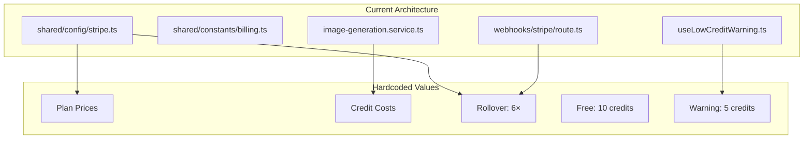
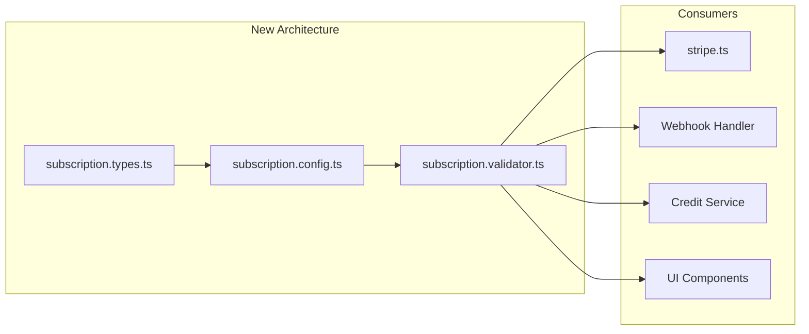
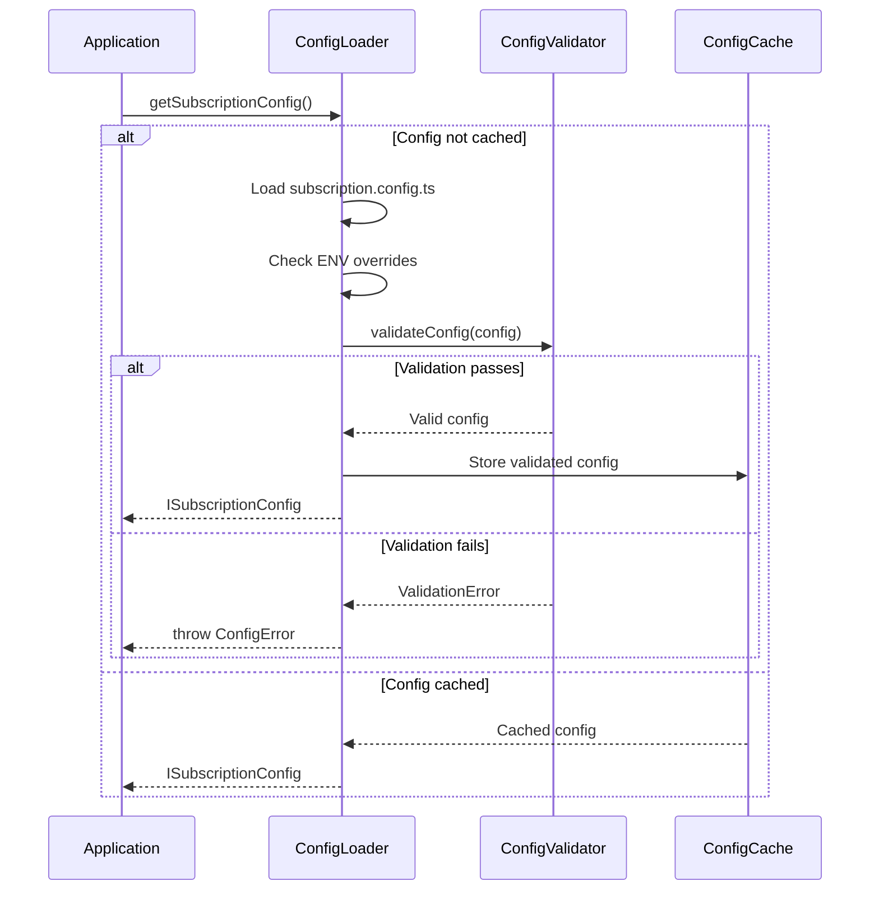
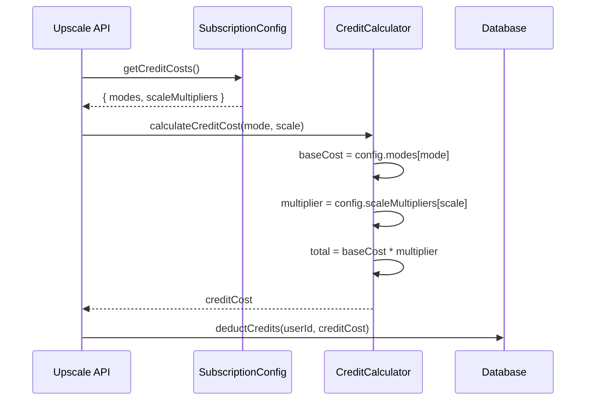
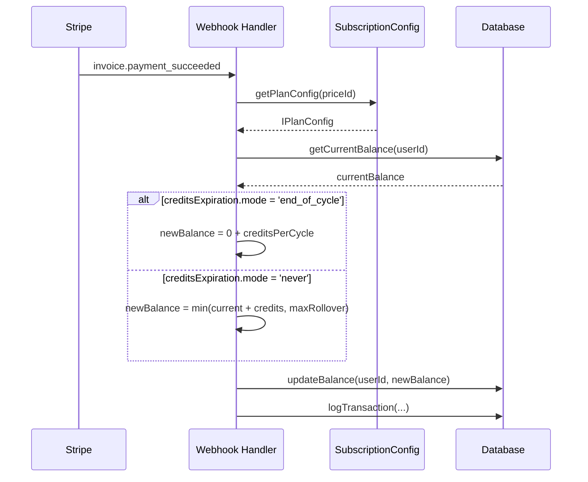

# PRD: Centralized Subscription Configuration System

**Version:** 1.0
**Status:** Draft
**Date:** December 3, 2025
**Author:** Principal Architect

---

## Executive Summary

This PRD defines a centralized configuration system for all subscription-related settings in PixelPerfect. The goal is to consolidate scattered configuration across multiple files into a single, type-safe configuration file that can be easily modified without code changes.

### Goals

1. **Single Source of Truth:** All subscription config in one file
2. **Runtime Configurability:** Change behavior without deploys
3. **Type Safety:** Full TypeScript validation
4. **Feature Flags:** Enable/disable features per-plan
5. **Business Agility:** Non-engineers can understand config structure

### Key Features to Configure

| Feature                   | Current State            | Target State                   |
| ------------------------- | ------------------------ | ------------------------------ |
| Plan prices               | Hardcoded in `stripe.ts` | Centralized config             |
| Credit costs per action   | Hardcoded in service     | Configurable per mode          |
| Trial periods             | Not implemented          | Configurable per plan          |
| Credits expiration        | Never expires            | Configurable (cycle-end/never) |
| Rollover multiplier       | Hardcoded 6×             | Configurable per plan          |
| Free tier credits         | Hardcoded 10             | Configurable                   |
| Low credit warning thresh | Hardcoded 5              | Configurable                   |

---

## Context Analysis

### 1.1 Files Analyzed

```
/home/joao/projects/pixelperfect/shared/config/stripe.ts
/home/joao/projects/pixelperfect/shared/constants/billing.ts
/home/joao/projects/pixelperfect/shared/types/stripe.ts
/home/joao/projects/pixelperfect/server/services/image-generation.service.ts
/home/joao/projects/pixelperfect/app/api/webhooks/stripe/route.ts
/home/joao/projects/pixelperfect/client/hooks/useLowCreditWarning.ts
/home/joao/projects/pixelperfect/docs/technical/systems/credits.md
/home/joao/projects/pixelperfect/docs/technical/systems/subscription-gaps.md
```

### 1.2 Component & Dependency Overview



### 1.3 Current Behavior Summary

- **Plan Configuration:** Defined in `SUBSCRIPTION_PRICE_MAP` and duplicated in `SUBSCRIPTION_PLANS`
- **Credit Costs:** Hardcoded in `calculateCreditCost()` function (1 for upscale, 2 for enhance/both/custom)
- **Rollover:** Hardcoded as 6× monthly credits in `ISubscriptionPlanMetadata`
- **Free Tier:** 10 credits on signup, hardcoded in database trigger
- **Trial Periods:** Schema supports `trialing` status but no configuration exists
- **Credits Expiration:** Never expires; rollover caps at 6× but no cycle-end expiration
- **Low Credit Warning:** Threshold hardcoded as 5 in `useLowCreditWarning.ts`

### 1.4 Problem Statement

Subscription settings are scattered across 5+ files with hardcoded values, making it difficult to:

- Adjust pricing without code changes
- A/B test different credit structures
- Enable trial periods for specific plans
- Implement credits expiration policies
- Quickly respond to business requirements

---

## Proposed Solution

### 2.1 Architecture Summary

- Create a new `shared/config/subscription.config.ts` as the single source of truth
- Define comprehensive interfaces for all subscription configuration
- Implement validation layer to catch config errors at startup
- Migrate existing hardcoded values from multiple files
- Support environment-based overrides for production flexibility

**Alternative Approaches Considered:**

1. **Database-driven config:** Rejected - adds complexity, requires admin UI, slower reads
2. **Environment variables:** Rejected - too many variables, hard to maintain structure
3. **External config service:** Rejected - over-engineering for current scale

### 2.2 Architecture Diagram



### 2.3 Key Technical Decisions

1. **TypeScript Config:** Runtime type validation with Zod schemas
2. **Readonly Objects:** Prevent accidental mutation with `as const`
3. **Getter Functions:** Access config through validated getters, not direct access
4. **Environment Overrides:** Support `SUBSCRIPTION_CONFIG_OVERRIDE` for production tweaks
5. **Backward Compatible:** Existing `STRIPE_PRICES` and `SUBSCRIPTION_PRICE_MAP` become derived values

### 2.4 Data Model Changes

**No database schema changes required** - configuration is code-level.

New types to create:

```typescript
interface ISubscriptionConfig {
  plans: IPlanConfig[];
  creditCosts: ICreditCostConfig;
  freeUser: IFreeUserConfig;
  warnings: IWarningConfig;
  defaults: IDefaultsConfig;
}
```

---

## Configuration Schema

### 3.1 Complete Configuration Interface

```typescript
// shared/config/subscription.types.ts

export interface ISubscriptionConfig {
  /** Version for config migrations */
  version: string;

  /** Subscription plans configuration */
  plans: IPlanConfig[];

  /** Credit cost per action */
  creditCosts: ICreditCostConfig;

  /** Free user configuration */
  freeUser: IFreeUserConfig;

  /** Warning thresholds */
  warnings: IWarningConfig;

  /** System defaults */
  defaults: IDefaultsConfig;
}

export interface IPlanConfig {
  /** Unique plan identifier (e.g., 'hobby', 'pro', 'business') */
  key: string;

  /** Display name for UI */
  name: string;

  /** Stripe Price ID */
  stripePriceId: string;

  /** Monthly price in cents (1900 = $19.00) */
  priceInCents: number;

  /** Currency code */
  currency: 'usd' | 'eur' | 'gbp';

  /** Billing interval */
  interval: 'month' | 'year';

  /** Credits allocated per billing cycle */
  creditsPerCycle: number;

  /** Maximum rollover balance (null = unlimited) */
  maxRollover: number | null;

  /** Rollover multiplier (e.g., 6 = 6× monthly credits) */
  rolloverMultiplier: number;

  /** Trial configuration (null = no trial) */
  trial: ITrialConfig | null;

  /** Credits behavior at cycle end */
  creditsExpiration: ICreditsExpirationConfig;

  /** Feature list for marketing */
  features: string[];

  /** Whether this plan is highlighted */
  recommended: boolean;

  /** Plan-specific description */
  description: string;

  /** Sort order for display */
  displayOrder: number;

  /** Whether plan is currently available */
  enabled: boolean;
}

export interface ITrialConfig {
  /** Trial enabled for this plan */
  enabled: boolean;

  /** Trial duration in days */
  durationDays: number;

  /** Credits during trial (null = same as paid) */
  trialCredits: number | null;

  /** Require payment method for trial */
  requirePaymentMethod: boolean;
}

export interface ICreditsExpirationConfig {
  /** Expiration behavior */
  mode: 'never' | 'end_of_cycle' | 'rolling_window';

  /** For rolling_window: days until expiration */
  windowDays?: number;

  /** Grace period after cycle ends (days) */
  gracePeriodDays: number;
}

export interface ICreditCostConfig {
  /** Base costs per processing mode */
  modes: Record<ProcessingMode, number>;

  /** Multipliers for scale factors */
  scaleMultipliers: Record<ScaleFactor, number>;

  /** Additional costs for options */
  options: {
    customPrompt: number;
    priorityProcessing: number;
  };
}

export type ProcessingMode = 'upscale' | 'enhance' | 'both' | 'custom';
export type ScaleFactor = '2x' | '4x';

export interface IFreeUserConfig {
  /** Initial credits on signup */
  initialCredits: number;

  /** Whether free users get monthly refresh */
  monthlyRefresh: boolean;

  /** Credits per month if monthlyRefresh is true */
  monthlyCredits: number;

  /** Maximum balance for free users */
  maxBalance: number;
}

export interface IWarningConfig {
  /** Credits threshold for low balance warning */
  lowCreditThreshold: number;

  /** Percentage of monthly credits for warning (e.g., 0.2 = 20%) */
  lowCreditPercentage: number;

  /** Whether to show warning toast on dashboard */
  showToastOnDashboard: boolean;

  /** Interval between warning checks (ms) */
  checkIntervalMs: number;
}

export interface IDefaultsConfig {
  /** Default currency for new subscriptions */
  defaultCurrency: 'usd' | 'eur' | 'gbp';

  /** Default billing interval */
  defaultInterval: 'month' | 'year';

  /** Whether credits roll over by default */
  creditsRolloverDefault: boolean;

  /** Default rollover multiplier */
  defaultRolloverMultiplier: number;
}
```

### 3.2 Default Configuration Values

```typescript
// shared/config/subscription.config.ts

export const SUBSCRIPTION_CONFIG: ISubscriptionConfig = {
  version: '1.0.0',

  plans: [
    {
      key: 'hobby',
      name: 'Hobby',
      stripePriceId: 'price_1SZmVyALMLhQocpf0H7n5ls8',
      priceInCents: 1900,
      currency: 'usd',
      interval: 'month',
      creditsPerCycle: 200,
      maxRollover: 1200,
      rolloverMultiplier: 6,
      trial: {
        enabled: false,
        durationDays: 0,
        trialCredits: null,
        requirePaymentMethod: true,
      },
      creditsExpiration: {
        mode: 'never',
        gracePeriodDays: 0,
      },
      features: [
        '200 credits per month',
        'Rollover unused credits',
        'Email support',
        'All features included',
      ],
      recommended: false,
      description: 'For personal projects',
      displayOrder: 1,
      enabled: true,
    },
    {
      key: 'pro',
      name: 'Professional',
      stripePriceId: 'price_1SZmVzALMLhQocpfPyRX2W8D',
      priceInCents: 4900,
      currency: 'usd',
      interval: 'month',
      creditsPerCycle: 1000,
      maxRollover: 6000,
      rolloverMultiplier: 6,
      trial: {
        enabled: false,
        durationDays: 0,
        trialCredits: null,
        requirePaymentMethod: true,
      },
      creditsExpiration: {
        mode: 'never',
        gracePeriodDays: 0,
      },
      features: [
        '1000 credits per month',
        'Rollover unused credits',
        'Priority support',
        'All features included',
        'Early access to new features',
      ],
      recommended: true,
      description: 'For professionals',
      displayOrder: 2,
      enabled: true,
    },
    {
      key: 'business',
      name: 'Business',
      stripePriceId: 'price_1SZmVzALMLhQocpfqPk9spg4',
      priceInCents: 14900,
      currency: 'usd',
      interval: 'month',
      creditsPerCycle: 5000,
      maxRollover: 30000,
      rolloverMultiplier: 6,
      trial: {
        enabled: false,
        durationDays: 0,
        trialCredits: null,
        requirePaymentMethod: true,
      },
      creditsExpiration: {
        mode: 'never',
        gracePeriodDays: 0,
      },
      features: [
        '5000 credits per month',
        'Rollover unused credits',
        '24/7 priority support',
        'All features included',
        'Dedicated account manager',
        'Custom integrations',
      ],
      recommended: false,
      description: 'For teams and agencies',
      displayOrder: 3,
      enabled: true,
    },
  ],

  creditCosts: {
    modes: {
      upscale: 1,
      enhance: 2,
      both: 2,
      custom: 2,
    },
    scaleMultipliers: {
      '2x': 1.0,
      '4x': 1.0, // Currently no difference, but configurable
    },
    options: {
      customPrompt: 0, // Included in custom mode cost
      priorityProcessing: 1, // Future feature
    },
  },

  freeUser: {
    initialCredits: 10,
    monthlyRefresh: false,
    monthlyCredits: 0,
    maxBalance: 10,
  },

  warnings: {
    lowCreditThreshold: 5,
    lowCreditPercentage: 0.2,
    showToastOnDashboard: true,
    checkIntervalMs: 300000, // 5 minutes
  },

  defaults: {
    defaultCurrency: 'usd',
    defaultInterval: 'month',
    creditsRolloverDefault: true,
    defaultRolloverMultiplier: 6,
  },
} as const;
```

---

## Runtime Execution Flow

### 4.1 Configuration Loading Sequence



### 4.2 Credit Calculation with Config



### 4.3 Subscription Renewal with Expiration



---

## Sub-PRDs

This PRD is broken into focused implementation documents:

| Sub-PRD                                                                                  | Description                     | Priority |
| ---------------------------------------------------------------------------------------- | ------------------------------- | -------- |
| [subscription-config-trial-periods.md](./subscription-config/trial-periods.md)           | Trial period implementation     | P1       |
| [subscription-config-credits-expiration.md](./subscription-config/credits-expiration.md) | Credits expiration at cycle end | P1       |
| [subscription-config-credit-costs.md](./subscription-config/credit-costs.md)             | Configurable credit costs       | P2       |
| [subscription-config-migration.md](./subscription-config/migration.md)                   | Migration from hardcoded values | P0       |

---

## Step-by-Step Execution Plan

### Phase 0: Foundation (P0 - Do First)

- [ ] Create `shared/config/subscription.types.ts` with all interfaces
- [ ] Create `shared/config/subscription.config.ts` with default values
- [ ] Create `shared/config/subscription.validator.ts` with Zod schemas
- [ ] Create `shared/config/subscription.utils.ts` with getter functions
- [ ] Add unit tests for config validation

### Phase 1: Migration (P0 - Immediate)

- [ ] Migrate `SUBSCRIPTION_PRICE_MAP` to use new config
- [ ] Migrate `SUBSCRIPTION_PLANS` to derive from new config
- [ ] Migrate `HOMEPAGE_TIERS` to derive from new config
- [ ] Update `calculateCreditCost()` to use config
- [ ] Update webhook handlers to use config
- [ ] Update `useLowCreditWarning.ts` to use config

### Phase 2: Trial Periods (P1)

- [ ] See [trial-periods.md](./subscription-config/trial-periods.md)

### Phase 3: Credits Expiration (P1)

- [ ] See [credits-expiration.md](./subscription-config/credits-expiration.md)

### Phase 4: Credit Costs Enhancement (P2)

- [ ] See [credit-costs.md](./subscription-config/credit-costs.md)

---

## Testing Strategy

### Unit Tests

- Config validation with valid/invalid inputs
- Getter functions return correct plan data
- Credit cost calculation with all modes
- Trial period date calculations
- Expiration logic edge cases

### Integration Tests

- Full subscription flow with trial
- Renewal with expiration enabled
- Upgrade/downgrade with different configs
- Webhook processing with config values

### Edge Cases

| Scenario                | Expected Behavior           |
| ----------------------- | --------------------------- |
| Invalid plan key        | Throw ConfigError           |
| Missing Stripe price ID | Validation error at startup |
| Negative credit cost    | Validation error            |
| Trial days > 365        | Warning log, allow          |
| Rollover > 100×         | Warning log, allow          |

---

## Acceptance Criteria

- [ ] All subscription settings in single config file
- [ ] Zero hardcoded values outside config file
- [ ] Config validation runs at application startup
- [ ] Existing tests pass without modification
- [ ] TypeScript strict mode compatible
- [ ] Config changes don't require code changes in consumers
- [ ] Documentation updated with config schema

---

## Verification & Rollback

### Success Criteria

- All existing functionality works identically
- Config validation catches invalid values
- No performance regression (< 1ms config lookup)
- Type safety maintained throughout

### Rollback Plan

1. Revert to previous `stripe.ts` hardcoded values
2. Remove config imports in affected files
3. Config file can remain (unused) for future

---

## Appendix: Files to Create/Modify

### New Files

```
shared/config/subscription.types.ts      # Type definitions
shared/config/subscription.config.ts     # Default configuration
shared/config/subscription.validator.ts  # Zod validation schemas
shared/config/subscription.utils.ts      # Getter functions
docs/PRDs/subscription-config/           # Sub-PRD directory
```

### Modified Files

```
shared/config/stripe.ts                  # Derive from new config
shared/constants/billing.ts              # Use config for copy
server/services/image-generation.service.ts  # Use config for costs
app/api/webhooks/stripe/route.ts         # Use config for credits
client/hooks/useLowCreditWarning.ts      # Use config threshold
supabase/migrations/xxx_free_credits.sql # Use config value (if needed)
```
