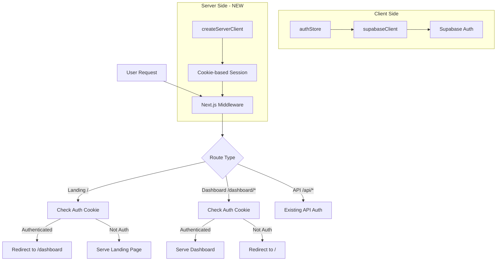
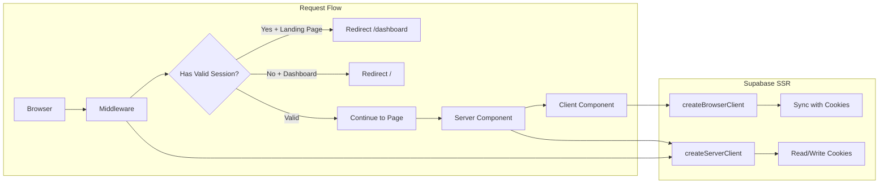
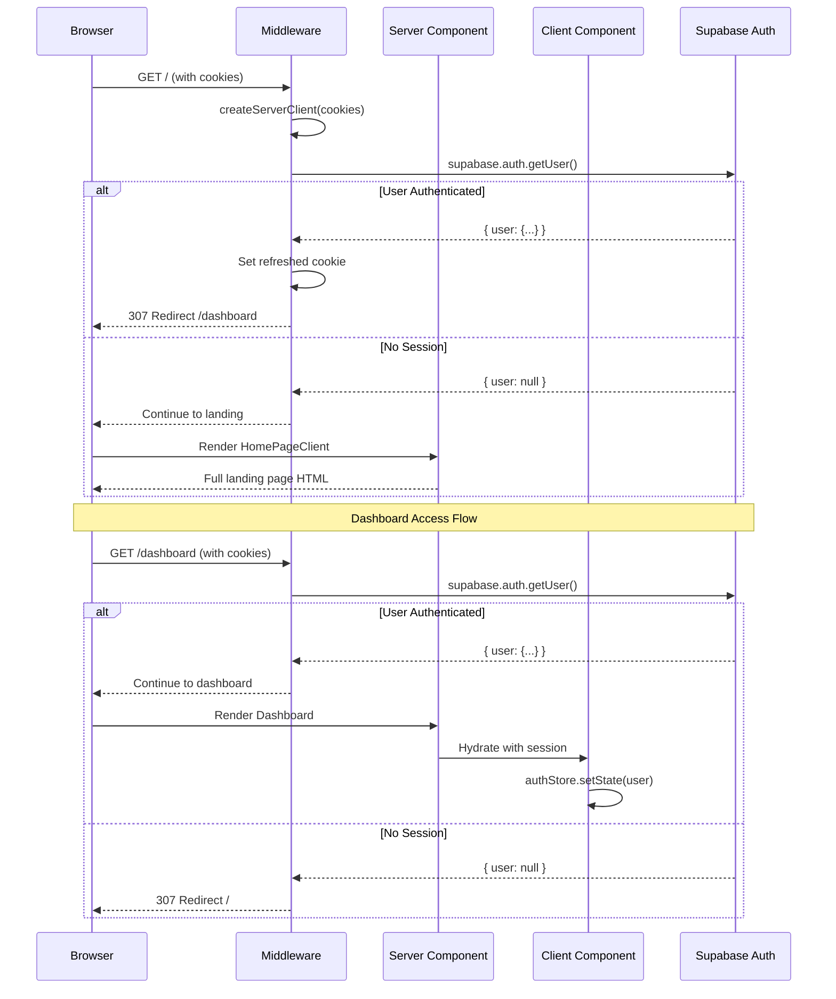

# Supabase SSR Authentication Implementation

## 1. Context Analysis

### 1.1 Files Analyzed

- `/home/joao/projects/pixelperfect/middleware.ts` - Current API-only middleware
- `/home/joao/projects/pixelperfect/src/store/authStore.ts` - Client-side Zustand auth store
- `/home/joao/projects/pixelperfect/src/lib/supabase/supabaseClient.ts` - Existing browser Supabase client
- `/home/joao/projects/pixelperfect/src/components/pages/HomePageClient.tsx` - Landing page with broken redirect
- `/home/joao/projects/pixelperfect/src/components/navigation/NavBar.tsx` - NavBar with loading state
- `/home/joao/projects/pixelperfect/app/page.tsx` - Next.js landing page entry
- `/home/joao/projects/pixelperfect/app/dashboard/page.tsx` - Dashboard page
- `/home/joao/projects/pixelperfect/package.json` - Dependencies

### 1.2 Component & Dependency Overview



### 1.3 Current Behavior Summary

- Auth state is managed entirely client-side via Zustand store (`authStore`)
- Supabase client stores tokens in localStorage (not cookies)
- Landing page shows blank screen + NavBar skeleton while checking auth client-side
- This causes visible flicker and poor UX for authenticated users
- Middleware only handles `/api/*` routes for rate limiting and JWT verification
- No server-side session management exists

### 1.4 Problem Statement

Authenticated users see a broken/blank landing page because auth state is checked client-side after the page renders, causing flicker and requiring a client-side redirect that's slow and janky.

---

## 2. Proposed Solution

### 2.1 Architecture Summary

1. **Install `@supabase/ssr`** - Official package for cookie-based Supabase auth in SSR environments
2. **Create server client utility** - For reading auth state in Server Components and middleware
3. **Create browser client utility** - Replace current client with SSR-compatible version that syncs cookies
4. **Extend middleware** - Add auth session refresh and page-level redirects before render
5. **Remove client-side redirect hacks** - Let middleware handle all redirects server-side

**Alternatives Considered:**

- Keep client-side approach with better loading states - Rejected: Still causes flicker, bad for UX/SEO
- Use Next.js `cookies()` directly - Rejected: Doesn't handle token refresh properly

### 2.2 Architecture Diagram (Mermaid)



### 2.3 Key Technical Decisions

| Decision           | Choice          | Justification                                   |
| ------------------ | --------------- | ----------------------------------------------- |
| Package            | `@supabase/ssr` | Official Supabase solution, handles cookie sync |
| Session Storage    | Cookies         | Required for SSR, middleware access             |
| Redirect Location  | Middleware      | Fastest - before any rendering                  |
| Existing authStore | Keep            | Still needed for client-side state/UI           |
| Token Refresh      | Middleware      | Refresh on every request via `getUser()`        |

### 2.4 Data Model Changes

**No Data Changes.** This is purely a client/middleware architecture change.

---

### 2.5 Runtime Execution Flow



---

## 3. Detailed Implementation Spec

### A. `utils/supabase/client.ts` (NEW)

**Purpose:** Browser-side Supabase client using SSR package

```typescript
import { createBrowserClient } from '@supabase/ssr';

export function createClient() {
  return createBrowserClient(
    process.env.NEXT_PUBLIC_SUPABASE_URL!,
    process.env.NEXT_PUBLIC_SUPABASE_ANON_KEY!
  );
}
```

**Justification:** Uses `createBrowserClient` which automatically syncs auth state with cookies.

---

### B. `utils/supabase/server.ts` (NEW)

**Purpose:** Server-side Supabase client for Server Components and Route Handlers

```typescript
import { createServerClient } from '@supabase/ssr';
import { cookies } from 'next/headers';

export async function createClient() {
  const cookieStore = await cookies();

  return createServerClient(
    process.env.NEXT_PUBLIC_SUPABASE_URL!,
    process.env.NEXT_PUBLIC_SUPABASE_ANON_KEY!,
    {
      cookies: {
        getAll() {
          return cookieStore.getAll();
        },
        setAll(cookiesToSet) {
          try {
            cookiesToSet.forEach(({ name, value, options }) =>
              cookieStore.set(name, value, options)
            );
          } catch {
            // Called from Server Component - middleware handles refresh
          }
        },
      },
    }
  );
}
```

---

### C. `utils/supabase/middleware.ts` (NEW)

**Purpose:** Middleware utility for session refresh and creating Supabase client

```typescript
import { createServerClient } from '@supabase/ssr';
import { NextResponse, type NextRequest } from 'next/server';

export async function updateSession(request: NextRequest) {
  let supabaseResponse = NextResponse.next({ request });

  const supabase = createServerClient(
    process.env.NEXT_PUBLIC_SUPABASE_URL!,
    process.env.NEXT_PUBLIC_SUPABASE_ANON_KEY!,
    {
      cookies: {
        getAll() {
          return request.cookies.getAll();
        },
        setAll(cookiesToSet) {
          cookiesToSet.forEach(({ name, value }) => request.cookies.set(name, value));
          supabaseResponse = NextResponse.next({ request });
          cookiesToSet.forEach(({ name, value, options }) =>
            supabaseResponse.cookies.set(name, value, options)
          );
        },
      },
    }
  );

  const {
    data: { user },
  } = await supabase.auth.getUser();

  return { user, supabaseResponse };
}
```

---

### D. `middleware.ts` (MODIFY)

**Changes Needed:**

1. Expand matcher to include page routes (not just `/api/*`)
2. Add auth redirects for landing page and dashboard
3. Keep existing API auth logic

```typescript
// Add to existing middleware:

// 1. Handle page-level auth redirects BEFORE API logic
const pathname = req.nextUrl.pathname;

// Skip API routes - handled separately below
if (!pathname.startsWith('/api')) {
  const { user, supabaseResponse } = await updateSession(req);

  // Authenticated user on landing page -> redirect to dashboard
  if (user && pathname === '/') {
    const url = req.nextUrl.clone();
    url.pathname = '/dashboard';
    return NextResponse.redirect(url);
  }

  // Unauthenticated user on dashboard -> redirect to landing
  if (!user && pathname.startsWith('/dashboard')) {
    const url = req.nextUrl.clone();
    url.pathname = '/';
    return NextResponse.redirect(url);
  }

  return supabaseResponse;
}

// 2. Existing API auth logic continues below...
```

**Matcher Update:**

```typescript
export const config = {
  matcher: ['/((?!_next/static|_next/image|favicon.ico|.*\\.(?:svg|png|jpg|jpeg|gif|webp)$).*)'],
};
```

---

### E. `src/components/pages/HomePageClient.tsx` (MODIFY)

**Changes Needed:** Remove client-side auth check and redirect logic

**Remove:**

```typescript
// DELETE these lines:
const { isAuthenticated, isLoading } = useAuthStore();

useEffect(() => {
  if (!isLoading && isAuthenticated) {
    window.location.href = '/dashboard';
  }
}, [isAuthenticated, isLoading]);

if (isLoading || isAuthenticated) {
  return <div className="min-h-screen bg-slate-50" />;
}
```

**Justification:** Middleware now handles redirects server-side before the page renders.

---

### F. `src/components/navigation/NavBar.tsx` (KEEP)

**No Changes Needed.** The loading skeleton for auth state is still useful for:

- Initial page load before hydration
- Client-side navigation scenarios
- Edge cases where cookies haven't synced yet

---

### G. `src/store/authStore.ts` (MINOR MODIFY)

**Changes Needed:** Ensure `initializeAuth` also reads from cookies if available

The existing client-side auth store should continue to work because:

1. `@supabase/ssr`'s browser client syncs localStorage with cookies
2. The `onAuthStateChange` listener will pick up the session

No immediate changes required - the existing code will work with the new setup.

---

## 4. Step-by-Step Execution Plan

### Phase 1: Install & Setup Utilities

- [x] Install `@supabase/ssr` package
- [ ] Create `utils/supabase/client.ts` (browser client)
- [ ] Create `utils/supabase/server.ts` (server client)
- [ ] Create `utils/supabase/middleware.ts` (middleware utility)

### Phase 2: Middleware Integration

- [ ] Update `middleware.ts` matcher to include all routes
- [ ] Add session refresh via `updateSession()`
- [ ] Add redirect logic for landing page (auth -> dashboard)
- [ ] Add redirect logic for dashboard (no auth -> landing)
- [ ] Preserve existing API auth logic

### Phase 3: Cleanup Client Components

- [ ] Remove redirect logic from `HomePageClient.tsx`
- [ ] Verify NavBar still works with loading states
- [ ] Test auth flow end-to-end

---

## 5. Testing Strategy

### Manual Testing

| Scenario                            | Expected Behavior                              |
| ----------------------------------- | ---------------------------------------------- |
| Logged out user visits `/`          | Sees landing page immediately, no flicker      |
| Logged in user visits `/`           | Redirected to `/dashboard` before page renders |
| Logged out user visits `/dashboard` | Redirected to `/` before page renders          |
| Logged in user visits `/dashboard`  | Sees dashboard immediately                     |
| User logs in from landing page      | Redirected to dashboard (existing behavior)    |
| User logs out from dashboard        | Redirected to landing (existing behavior)      |

### Edge Cases

| Scenario                 | Expected Behavior                          |
| ------------------------ | ------------------------------------------ |
| Expired session token    | Middleware refreshes token via `getUser()` |
| Invalid/corrupted cookie | Treated as unauthenticated                 |
| API routes               | Continue to use existing JWT auth          |

---

## 6. Acceptance Criteria

- [ ] No blank screen or flicker when authenticated user visits landing page
- [ ] Redirect happens before any page content renders (server-side)
- [ ] Dashboard is protected - unauthenticated users cannot access
- [ ] Existing auth flows (login, logout, signup) continue to work
- [ ] API routes maintain existing authentication behavior
- [ ] NavBar shows correct state without flicker

---

## 7. Verification & Rollback

### Success Criteria

- Network tab shows 307 redirect for authenticated users on `/`
- No client-side JavaScript redirect visible
- Time to dashboard < 200ms for authenticated users

### Rollback Plan

1. Revert middleware changes
2. Restore client-side redirect in `HomePageClient.tsx`
3. Remove `utils/supabase/` directory
4. Uninstall `@supabase/ssr` package
