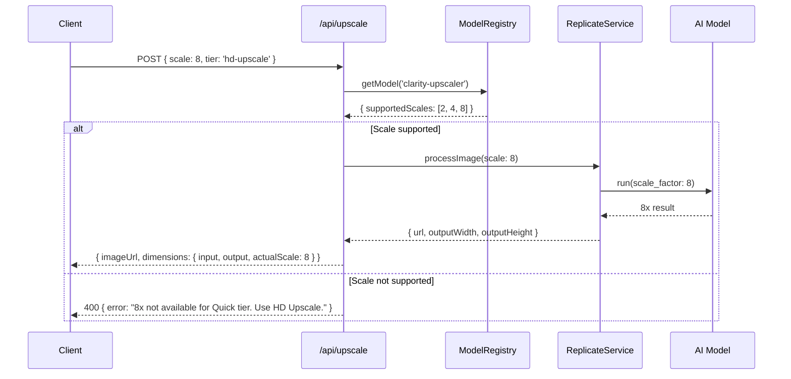

# PRD: True Image Upscaling with Accurate Scale Factors

**Version:** 1.0
**Status:** Draft
**Priority:** P1
**Complexity:** 4 → MEDIUM mode

---

## Context

### Problem

Users select upscale factors (2x, 4x, 8x) expecting their images to increase in dimensions accordingly, but the current implementation has several issues:

1. **Models misrepresent scale support** - Flux-2-Pro and Qwen-Image-Edit don't have scale parameters; they only enhance without dimension changes
2. **8x is mostly unavailable** - Real-ESRGAN caps at 4x, GFPGAN caps at 4x, Nano-Banana-Pro uses resolution presets (1K/2K/4K) not true pixel multiplication
3. **No dimension reporting** - Response doesn't include output dimensions, so users can't verify upscaling worked
4. **UI allows unsupported scales** - User can select 8x for models that only support 4x

### Files Analyzed

- `server/services/replicate.service.ts` (lines 285-469) - Model input building
- `server/services/model-registry.ts` (lines 117-261) - Model configs with `supportedScales`
- `shared/validation/upscale.schema.ts` - Request/response schemas
- `shared/types/coreflow.types.ts` - Type definitions
- `client/components/features/workspace/BatchSidebar/UpscaleFactorSelector.tsx` - UI component
- `shared/config/model-costs.config.ts` - Scale constants (2, 4, 8)

### Current Behavior

| Model            | Claims Scale | Actually Supports           | What Happens                          |
| ---------------- | ------------ | --------------------------- | ------------------------------------- |
| real-esrgan      | 2x, 4x, 8x   | 2x, 4x only                 | 8x → 4x silently                      |
| gfpgan           | 2x, 4x, 8x   | 2x, 4x only                 | 8x → 4x silently                      |
| clarity-upscaler | 2x, 4x, 8x   | 2-16x                       | True upscaling                        |
| flux-2-pro       | 2x, 4x, 8x   | None                        | Enhancement only, no dimension change |
| nano-banana-pro  | 2x, 4x, 8x   | Resolution-based (1K/2K/4K) | Maps scale to resolution preset       |
| qwen-image-edit  | 2x, 4x, 8x   | None                        | Prompt mentions scale, no param       |

---

## Solution

### Approach

1. **Enforce accurate scale metadata per model** - Update `supportedScales` to reflect reality
2. **Return output dimensions in response** - Let users verify upscaling worked
3. **Filter available scales in UI based on selected tier/model** - Only show scales the model actually supports
4. **Reclassify enhancement-only models** - Remove "upscale" capability from Flux-2-Pro and Qwen

### Architecture

```mermaid
flowchart LR
    subgraph Client
        UI[Scale Selector]
        Tier[Quality Tier] --> |determines| Scales[Available Scales]
        Scales --> UI
        UI --> |validated scale| API
    end

    subgraph Server
        API[/api/upscale] --> Validator{Scale Supported?}
        Validator --> |Yes| Model[AI Model]
        Validator --> |No| Error[400: Unsupported scale for this tier]
    end

    Model --> Response[Response + Dimensions]
```

### Key Decisions

- [x] **No two-pass hacks**: Only offer scales that models natively support
- [x] **Clarity Upscaler for 8x**: Only HD Upscale tier offers 8x (native support up to 16x)
- [x] **Remove "upscale" from enhancement models**: Flux-2-Pro and Qwen are enhancement-only
- [x] **Dimension reporting**: Add `outputDimensions: { width, height }` to response

### Data Changes

**IUpscaleResponse** - Add output dimensions:

```typescript
export interface IUpscaleResponse {
  // ... existing fields
  dimensions?: {
    input: { width: number; height: number };
    output: { width: number; height: number };
    actualScale: number; // Computed: output / input
  };
}
```

---

## Sequence Flow



---

## Execution Phases

### Phase 1: Fix Model Metadata & Capabilities

**User-visible outcome:** Models accurately report what scales they support; enhancement-only models lose "upscale" capability.

**Files (3):**

- `server/services/model-registry.ts` - Update `supportedScales` for each model
- `shared/config/model-costs.config.ts` - Update `supportedScales` in shared config
- `shared/types/coreflow.types.ts` - Add `ModelCapability` type 'enhance-only'

**Implementation:**

- [ ] Update real-esrgan: `supportedScales: [2, 4]` (remove 8)
- [ ] Update gfpgan: `supportedScales: [2, 4]` (remove 8)
- [ ] Update flux-2-pro: Remove 'upscale' capability, keep 'enhance', `supportedScales: []`
- [ ] Update qwen-image-edit: Remove 'upscale' capability, `supportedScales: []`
- [ ] Update clarity-upscaler: `supportedScales: [2, 4, 8]` (native 8x support confirmed)
- [ ] Update nano-banana-pro: `supportedScales: [2, 4]` (resolution-based, not true scale)

**Tests Required:**

| Test File                                          | Test Name                                                | Assertion                                             |
| -------------------------------------------------- | -------------------------------------------------------- | ----------------------------------------------------- |
| `server/services/__tests__/model-registry.test.ts` | `should return accurate supportedScales for real-esrgan` | `expect(model.supportedScales).toEqual([2, 4])`       |
| `server/services/__tests__/model-registry.test.ts` | `should not include upscale capability for flux-2-pro`   | `expect(model.capabilities).not.toContain('upscale')` |

**User Verification:**

- Action: Call `/api/models` endpoint
- Expected: Each model shows correct `supportedScales` array

---

### Phase 2: Add Dimension Reporting to Response

**User-visible outcome:** API response includes input/output dimensions and actual scale factor achieved.

**Files (4):**

- `shared/types/coreflow.types.ts` - Add `IDimensionsInfo` interface
- `shared/validation/upscale.schema.ts` - Add dimensions to response schema
- `server/services/replicate.service.ts` - Extract dimensions from result
- `app/api/upscale/route.ts` - Include dimensions in response

**Implementation:**

- [ ] Add `IDimensionsInfo` interface with `input`, `output`, `actualScale`
- [ ] Update response schema to include optional `dimensions` field
- [ ] After model processing, fetch result image and extract dimensions
- [ ] Calculate `actualScale = outputWidth / inputWidth`
- [ ] Return dimensions in API response

**Tests Required:**

| Test File                                 | Test Name                              | Assertion                                                                           |
| ----------------------------------------- | -------------------------------------- | ----------------------------------------------------------------------------------- |
| `app/api/upscale/__tests__/route.test.ts` | `should return dimensions in response` | `expect(response.dimensions.actualScale).toBe(4)`                                   |
| `app/api/upscale/__tests__/route.test.ts` | `should calculate correct actualScale` | `expect(dimensions.output.width / dimensions.input.width).toBeCloseTo(actualScale)` |

**User Verification:**

- Action: Upload 500x500 image, select 4x upscale
- Expected: Response includes `dimensions: { input: { width: 500, height: 500 }, output: { width: 2000, height: 2000 }, actualScale: 4 }`

---

### Phase 3: Dynamic Scale Options in UI

**User-visible outcome:** Scale selector only shows options supported by the selected quality tier.

**Files (4):**

- `client/components/features/workspace/BatchSidebar/UpscaleFactorSelector.tsx` - Accept `availableScales` prop
- `shared/types/coreflow.types.ts` - Add `IQualityTierScales` mapping
- `shared/config/model-costs.config.ts` - Export tier-to-scales mapping
- `client/components/features/workspace/BatchSidebar/BatchSidebar.tsx` - Pass available scales

**Implementation:**

- [ ] Create `QUALITY_TIER_SCALES` mapping: `{ quick: [2, 4, 8], 'face-restore': [2, 4], ... }`
- [ ] Update `UpscaleFactorSelector` to accept `availableScales?: (2 | 4 | 8)[]` prop
- [ ] Filter `SCALE_OPTIONS` by `availableScales`
- [ ] Auto-reset selected scale if current value becomes unavailable
- [ ] Show tooltip on disabled scale options explaining why unavailable

**Tests Required:**

| Test File                                                    | Test Name                              | Assertion                                                  |
| ------------------------------------------------------------ | -------------------------------------- | ---------------------------------------------------------- |
| `client/components/__tests__/UpscaleFactorSelector.test.tsx` | `should only show available scales`    | `expect(screen.queryByText('8x')).not.toBeInTheDocument()` |
| `client/components/__tests__/UpscaleFactorSelector.test.tsx` | `should reset scale when tier changes` | `expect(onChange).toHaveBeenCalledWith(4)`                 |

**User Verification:**

- Action: Select "Face Restore" tier (GFPGAN)
- Expected: Only 2x and 4x options shown; 8x is hidden or disabled with tooltip

---

### Phase 4: Quality Tier Scale Validation

**User-visible outcome:** API rejects requests for unsupported scales with clear error message.

**Files (2):**

- `app/api/upscale/route.ts` - Add scale validation against model capabilities
- `shared/validation/upscale.schema.ts` - Add cross-field validation

**Implementation:**

- [ ] After resolving quality tier to model, validate `scale in model.supportedScales`
- [ ] If invalid, return 400 with message: "8x upscaling not available for [tier]. Use HD Upscale tier for 8x."
- [ ] Add `availableScales` to tier info endpoint response

**Tests Required:**

| Test File                                 | Test Name                                            | Assertion                           |
| ----------------------------------------- | ---------------------------------------------------- | ----------------------------------- |
| `app/api/upscale/__tests__/route.test.ts` | `should reject unsupported scale with clear message` | `expect(response.status).toBe(400)` |
| `app/api/upscale/__tests__/route.test.ts` | `should accept supported scale`                      | `expect(response.status).toBe(200)` |

**User Verification:**

- Action: POST `/api/upscale` with `{ tier: 'quick', scale: 8 }`
- Expected: 400 error with message suggesting HD Upscale tier for 8x

---

## Acceptance Criteria

- [ ] All phases complete
- [ ] All specified tests pass
- [ ] `yarn verify` passes
- [ ] All checkpoint reviews passed
- [ ] Feature is reachable via existing upscale flow
- [ ] UI dynamically shows only supported scale options per tier
- [ ] Response includes accurate output dimensions
- [ ] 8x only available for HD Upscale tier (clarity-upscaler)
- [ ] Enhancement-only models don't claim upscale capability

---

## Scale Availability by Tier

| Quality Tier | Model            | Available Scales        |
| ------------ | ---------------- | ----------------------- |
| Quick        | real-esrgan      | 2x, 4x                  |
| Face Restore | gfpgan           | 2x, 4x                  |
| Budget Edit  | qwen-image-edit  | None (enhancement only) |
| HD Upscale   | clarity-upscaler | 2x, 4x, 8x              |
| Face Pro     | flux-2-pro       | None (enhancement only) |
| Ultra        | nano-banana-pro  | 2x, 4x                  |

---

## Risk Mitigation

1. **Users expecting 8x everywhere** - Clear messaging in UI that 8x requires HD Upscale tier
2. **Enhancement models confusion** - Rename or badge as "Enhance" not "Upscale" in UI
3. **Memory limits** - Large images at 8x may exceed Cloudflare's 10ms CPU limit; consider input size validation

---

## Future Considerations

- Add "Smart Scale" auto-detection based on input dimensions
- Allow users to download at multiple scales from single upload
- Consider adding more models with native 8x support
