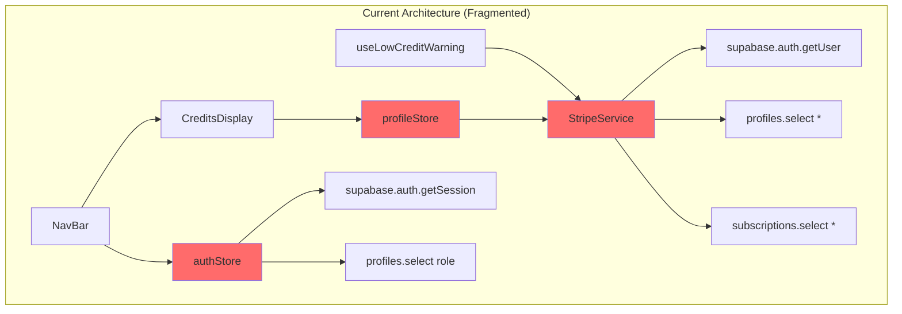
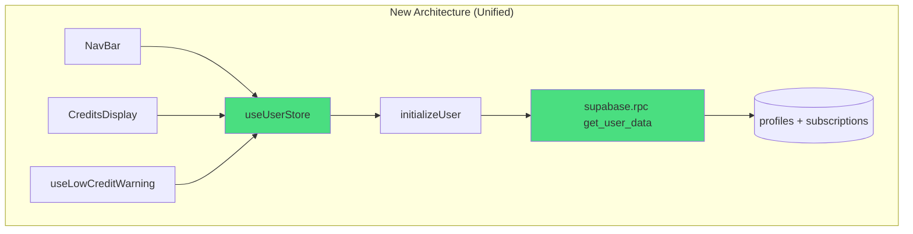
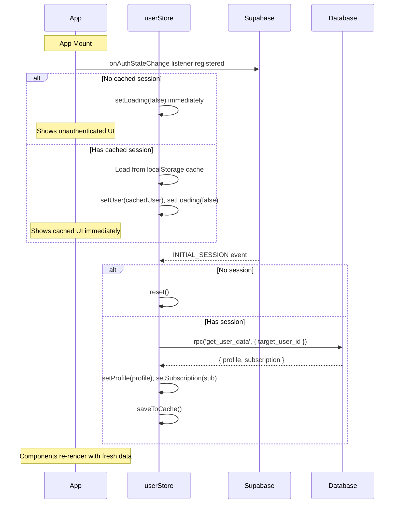

# Unified User Store Architecture

## 1. Context Analysis

### 1.1 Files Analyzed

```
client/store/auth/authStore.ts
client/store/auth/authOperations.ts
client/store/auth/authStateHandler.ts
client/store/auth/authCache.ts
client/store/auth/types.ts
client/store/profileStore.ts
client/services/stripeService.ts
client/components/stripe/CreditsDisplay.tsx
client/components/navigation/NavBar.tsx
client/hooks/useLowCreditWarning.ts
shared/types/stripe.ts
```

### 1.2 Component & Dependency Overview



### 1.3 Current Behavior Summary

**Requests made on authenticated landing page load:**

| Request                  | Source                              | Purpose             | Duplicated?      |
| ------------------------ | ----------------------------------- | ------------------- | ---------------- |
| `auth/v1/token`          | Supabase SDK                        | Session refresh     | No               |
| `profiles?select=role`   | authStateHandler                    | Get user role       | 2x (Strict Mode) |
| `auth/v1/user`           | StripeService.getUserProfile        | Get current user    | 2x               |
| `auth/v1/user`           | StripeService.getActiveSubscription | Get current user    | 2x (duplicate!)  |
| `profiles?select=*`      | StripeService.getUserProfile        | Full profile        | 1x               |
| `subscriptions?select=*` | StripeService.getActiveSubscription | Active subscription | 1x               |

**Total: 8-10 requests for data that could be fetched in 1-2 requests.**

Additional issues:

- `useLowCreditWarning` makes independent requests every 5 minutes
- Each `StripeService` method independently calls `supabase.auth.getUser()`
- Auth store and profile store fetch overlapping data (profile.role vs full profile)
- No request deduplication at the service layer

### 1.4 Problem Statement

The client makes 8-10 redundant Supabase requests on page load because user data is fragmented across multiple stores and services with no centralized fetching strategy.

---

## 2. Proposed Solution

### 2.1 Architecture Summary

- **Unified User Store**: Single Zustand store containing auth state, profile, and subscription
- **Single Fetch**: One initialization request fetches all user data in a single RPC call
- **Optimistic Defaults**: Show unauthenticated state immediately, update when data arrives
- **Selectors**: Components subscribe only to data they need (prevents unnecessary re-renders)
- **Invalidation API**: Clear way to refresh data after mutations (credit purchase, plan change)

**Alternatives Considered:**

| Approach                   | Pros                                     | Cons                                    | Decision                           |
| -------------------------- | ---------------------------------------- | --------------------------------------- | ---------------------------------- |
| React Query                | Built-in caching, stale-while-revalidate | Additional dependency, more boilerplate | Rejected: Zustand already in use   |
| Keep separate stores + SWR | Minimal changes                          | Still fragmented, complex cache sync    | Rejected: Doesn't solve core issue |
| Unified Zustand store      | Single source of truth, simple           | Migration effort                        | **Selected**                       |

### 2.2 Architecture Diagram



### 2.3 Key Technical Decisions

1. **Single RPC Function**: Create `get_user_data()` PostgreSQL function that returns profile + subscription in one query (with auth.uid() security check)
2. **Supabase Auth Listener**: Use `onAuthStateChange` as single source of truth for auth events
3. **No Redundant getUser Calls**: Auth state from listener provides user ID; no need to re-fetch
4. **5-Minute Cache**: Fresh data for most interactions; manual invalidation for mutations
5. **Optimistic Loading**: Default to `isLoading: false` for unauthenticated users (LCP fix)

### 2.4 Data Model Changes

**New PostgreSQL RPC Function:**

```sql
CREATE OR REPLACE FUNCTION get_user_data(target_user_id UUID)
RETURNS JSON AS $$
DECLARE
  result JSON;
BEGIN
  -- Security check: Only allow users to fetch their own data
  IF target_user_id != auth.uid() THEN
    RAISE EXCEPTION 'Access denied: You can only fetch your own user data';
  END IF;

  SELECT json_build_object(
    'profile', (
      SELECT row_to_json(p)
      FROM profiles p
      WHERE p.id = target_user_id
    ),
    'subscription', (
      SELECT row_to_json(s)
      FROM subscriptions s
      WHERE s.user_id = target_user_id
        AND s.status IN ('active', 'trialing')
      ORDER BY s.created_at DESC
      LIMIT 1
    )
  ) INTO result;

  RETURN result;
END;
$$ LANGUAGE plpgsql SECURITY DEFINER;
```

---

### 2.5 Runtime Execution Flow



---

## 3. Detailed Implementation Spec

### A. `supabase/migrations/XXXXXX_get_user_data_rpc.sql`

**Changes Needed:** New migration file

```sql
-- Create RPC function to fetch all user data in one call
-- SECURITY: Uses auth.uid() check to prevent cross-tenant data leakage
CREATE OR REPLACE FUNCTION get_user_data(target_user_id UUID)
RETURNS JSON AS $$
DECLARE
  result JSON;
BEGIN
  -- Security check: Only allow users to fetch their own data
  IF target_user_id != auth.uid() THEN
    RAISE EXCEPTION 'Access denied: You can only fetch your own user data';
  END IF;

  SELECT json_build_object(
    'profile', (
      SELECT row_to_json(p.*)
      FROM profiles p
      WHERE p.id = target_user_id
    ),
    'subscription', (
      SELECT row_to_json(s.*)
      FROM subscriptions s
      WHERE s.user_id = target_user_id
        AND s.status IN ('active', 'trialing')
      ORDER BY s.created_at DESC
      LIMIT 1
    )
  ) INTO result;

  RETURN result;
END;
$$ LANGUAGE plpgsql SECURITY DEFINER;

-- Grant execute permission
GRANT EXECUTE ON FUNCTION get_user_data(UUID) TO authenticated;
```

**Justification:** Single database round-trip instead of 3 separate queries. Security enforced via `auth.uid()` check.

---

### B. `client/store/userStore.ts` (NEW - replaces authStore + profileStore)

**Changes Needed:** New unified store

```typescript
import { create } from 'zustand';
import { createClient } from '@shared/utils/supabase/client';
import type { IUserProfile, ISubscription } from '@shared/types/stripe';
import type { AuthChangeEvent, Session } from '@supabase/supabase-js';

// Cache keys
const USER_CACHE_KEY = 'pixelperfect_user_cache';
const CACHE_VERSION = 1;
const CACHE_MAX_AGE = 5 * 60 * 1000; // 5 minutes

interface IUserCache {
  version: number;
  timestamp: number;
  user: IUserData | null;
}

interface IUserData {
  id: string;
  email: string;
  name?: string;
  provider: string;
  role: 'user' | 'admin';
  profile: IUserProfile | null;
  subscription: ISubscription | null;
}

interface IUserState {
  // State
  user: IUserData | null;
  isAuthenticated: boolean;
  isLoading: boolean;
  error: string | null;
  lastFetched: number | null;

  // Computed selectors (for convenience)
  credits: number;
  subscriptionCredits: number;
  purchasedCredits: number;
  isAdmin: boolean;

  // Actions
  initialize: () => Promise<void>;
  fetchUserData: (userId: string) => Promise<void>;
  invalidate: () => void;
  reset: () => void;

  // Auth operations (delegated to Supabase)
  signInWithEmail: (email: string, password: string) => Promise<void>;
  signUpWithEmail: (
    email: string,
    password: string
  ) => Promise<{ emailConfirmationRequired: boolean }>;
  signOut: () => Promise<void>;
}

const supabase = createClient();

// In-flight request deduplication
let fetchPromise: Promise<void> | null = null;

export const useUserStore = create<IUserState>((set, get) => ({
  // Initial state
  user: null,
  isAuthenticated: false,
  isLoading: true,
  error: null,
  lastFetched: null,

  // Computed (updated when user changes)
  get credits() {
    const user = get().user;
    return (
      (user?.profile?.subscription_credits_balance ?? 0) +
      (user?.profile?.purchased_credits_balance ?? 0)
    );
  },
  get subscriptionCredits() {
    return get().user?.profile?.subscription_credits_balance ?? 0;
  },
  get purchasedCredits() {
    return get().user?.profile?.purchased_credits_balance ?? 0;
  },
  get isAdmin() {
    return get().user?.role === 'admin';
  },

  initialize: async () => {
    // Load cache first for instant UI
    const cached = loadUserCache();
    if (cached) {
      set({
        user: cached,
        isAuthenticated: true,
        isLoading: false,
      });
    } else {
      // No cache = likely unauthenticated, show UI immediately
      set({ isLoading: false });
    }

    // Auth state change handler does the real work
    // (registered at module level below)
  },

  fetchUserData: async (userId: string) => {
    // Dedupe concurrent requests
    if (fetchPromise) {
      await fetchPromise;
      return;
    }

    fetchPromise = (async () => {
      try {
        const { data, error } = await supabase.rpc('get_user_data', {
          target_user_id: userId,
        });

        if (error) throw error;

        const currentUser = get().user;
        if (currentUser) {
          const updatedUser: IUserData = {
            ...currentUser,
            profile: data?.profile ?? null,
            subscription: data?.subscription ?? null,
            role: data?.profile?.role ?? 'user',
          };
          set({
            user: updatedUser,
            lastFetched: Date.now(),
            error: null,
          });
          saveUserCache(updatedUser);
        }
      } catch (err) {
        console.error('Failed to fetch user data:', err);
        set({ error: err instanceof Error ? err.message : 'Failed to load user data' });
      } finally {
        fetchPromise = null;
      }
    })();

    await fetchPromise;
  },

  invalidate: () => {
    set({ lastFetched: null });
    const userId = get().user?.id;
    if (userId) {
      get().fetchUserData(userId);
    }
  },

  reset: () => {
    set({
      user: null,
      isAuthenticated: false,
      isLoading: false,
      error: null,
      lastFetched: null,
    });
    clearUserCache();
  },

  signInWithEmail: async (email, password) => {
    const { error } = await supabase.auth.signInWithPassword({ email, password });
    if (error) throw error;
    // Auth state change listener will handle the rest
  },

  signUpWithEmail: async (email, password) => {
    const { data, error } = await supabase.auth.signUp({
      email,
      password,
      options: { emailRedirectTo: `${window.location.origin}/auth/confirm` },
    });
    if (error) throw error;
    return { emailConfirmationRequired: !!data.user && !data.session };
  },

  signOut: async () => {
    await supabase.auth.signOut();
    // Auth state change listener will call reset()
  },
}));

// Cache helpers
function loadUserCache(): IUserData | null {
  if (typeof window === 'undefined') return null;
  try {
    const raw = localStorage.getItem(USER_CACHE_KEY);
    if (!raw) return null;
    const cache: IUserCache = JSON.parse(raw);
    if (cache.version !== CACHE_VERSION) return null;
    if (Date.now() - cache.timestamp > CACHE_MAX_AGE) return null;
    return cache.user;
  } catch {
    return null;
  }
}

function saveUserCache(user: IUserData): void {
  if (typeof window === 'undefined') return;
  try {
    const cache: IUserCache = { version: CACHE_VERSION, timestamp: Date.now(), user };
    localStorage.setItem(USER_CACHE_KEY, JSON.stringify(cache));
  } catch {}
}

function clearUserCache(): void {
  if (typeof window === 'undefined') return;
  try {
    localStorage.removeItem(USER_CACHE_KEY);
  } catch {}
}

// Auth state listener (single source of truth)
supabase.auth.onAuthStateChange(async (event: AuthChangeEvent, session: Session | null) => {
  const store = useUserStore.getState();

  if (event === 'SIGNED_OUT' || !session) {
    store.reset();
    return;
  }

  if (session?.user) {
    // Set basic user info immediately
    const basicUser: IUserData = {
      id: session.user.id,
      email: session.user.email ?? '',
      name: session.user.user_metadata?.name,
      provider: session.user.app_metadata?.provider ?? 'email',
      role: 'user', // Default, will be updated
      profile: null,
      subscription: null,
    };

    useUserStore.setState({
      user: basicUser,
      isAuthenticated: true,
      isLoading: false,
    });

    // Fetch full data in background
    store.fetchUserData(session.user.id);
  }
});

// Initialize on module load
useUserStore.getState().initialize();

// Convenience hooks
export const useCredits = () =>
  useUserStore(state => ({
    total:
      (state.user?.profile?.subscription_credits_balance ?? 0) +
      (state.user?.profile?.purchased_credits_balance ?? 0),
    subscription: state.user?.profile?.subscription_credits_balance ?? 0,
    purchased: state.user?.profile?.purchased_credits_balance ?? 0,
  }));

export const useIsAdmin = () => useUserStore(state => state.user?.role === 'admin');

export const useSubscription = () => useUserStore(state => state.user?.subscription);

export const useProfile = () => useUserStore(state => state.user?.profile);
```

**Justification:** Single store eliminates redundant fetches and provides clear API for all user data needs.

---

### C. `client/components/stripe/CreditsDisplay.tsx`

**Changes Needed:** Use new store

```typescript
'use client';

import { useUserStore, useCredits } from '@client/store/userStore';
// ... rest of component uses useCredits() instead of local state
```

---

### D. `client/components/navigation/NavBar.tsx`

**Changes Needed:** Use new store

```typescript
import { useUserStore } from '@client/store/userStore';

export const NavBar = () => {
  const { isAuthenticated, isLoading, user, signOut } = useUserStore();
  // ... same logic, different import
};
```

---

### E. `client/hooks/useLowCreditWarning.ts`

**Changes Needed:** Subscribe to store instead of fetching

```typescript
import { useUserStore, useCredits } from '@client/store/userStore';

export const useLowCreditWarning = (): void => {
  const { total: creditBalance } = useCredits();
  const { showToast } = useToastStore();

  useEffect(() => {
    // No fetch needed - just react to store changes
    if (creditBalance > 0 && creditBalance <= LOW_CREDIT_THRESHOLD) {
      // Show warning logic...
    }
  }, [creditBalance, showToast]);
};
```

---

## 4. Step-by-Step Execution Plan

### Phase 1: Database (Backend)

- [ ] Create migration for `get_user_data` RPC function
- [ ] Apply migration to development branch
- [ ] Test RPC function returns correct data

### Phase 2: Unified Store (Core)

- [ ] Create `client/store/userStore.ts` with full implementation
- [ ] Add convenience hooks (`useCredits`, `useIsAdmin`, `useSubscription`)
- [ ] Add unit tests for store logic

### Phase 3: Component Migration

- [ ] Update `NavBar.tsx` to use `useUserStore`
- [ ] Update `CreditsDisplay.tsx` to use `useCredits`
- [ ] Update `useLowCreditWarning.ts` to subscribe to store
- [ ] Update any other components using `authStore` or `profileStore`

### Phase 4: Cleanup

- [ ] Remove `client/store/auth/` directory
- [ ] Remove `client/store/profileStore.ts`
- [ ] Remove `authStore.ts` re-export file
- [ ] Update all imports across codebase
- [ ] Remove unused `StripeService.getUserProfile` and `getActiveSubscription` methods

### Phase 5: Verification

- [ ] Run `yarn verify`
- [ ] Test authenticated landing page - should see only 1-2 Supabase requests
- [ ] Test sign in/out flow
- [ ] Test credit purchase invalidation
- [ ] Run E2E tests

---

## 5. Testing Strategy

### Unit Tests

| Function            | Test Cases                                            |
| ------------------- | ----------------------------------------------------- |
| `loadUserCache`     | Valid cache, expired cache, corrupted cache, no cache |
| `fetchUserData`     | Success, RPC error, concurrent calls dedupe           |
| `onAuthStateChange` | SIGNED_IN, SIGNED_OUT, TOKEN_REFRESHED                |

### Integration Tests

- Full auth flow: sign up → confirm → sign in → sign out
- Credit purchase: checkout → webhook → store invalidation → UI update
- Plan change: upgrade → webhook → store invalidation → UI update

### Edge Cases

| Scenario               | Expected Behavior                                                 |
| ---------------------- | ----------------------------------------------------------------- |
| Cache expired, offline | Show cached data, show error toast                                |
| RPC error/timeout      | Log error, set error state (no retry - user can manually refresh) |
| Concurrent tab auth    | Both tabs update via auth listener                                |
| Logout in one tab      | Other tabs detect via storage event                               |

---

## 6. Acceptance Criteria

- [ ] Landing page makes **maximum 2 Supabase requests** for authenticated users
- [ ] LCP unaffected - unauthenticated state renders immediately
- [ ] All existing auth flows work (sign in, sign up, sign out, OAuth)
- [ ] Credits update after purchase without page refresh
- [ ] Admin role correctly detected for admin features
- [ ] `yarn verify` passes
- [ ] All E2E tests pass

---

## 7. Verification & Rollback

### Success Criteria

- Network tab shows 2 requests instead of 8-10 on landing page
- Time to interactive improved (measure with Lighthouse)
- No regressions in auth or billing flows

### Rollback Plan

1. Revert PR
2. Migration is additive (RPC function) - no rollback needed
3. Old stores can be restored from git history

---

## 8. Request Comparison

### Before (Current)

```
1. GET auth/v1/token (session refresh)
2. GET profiles?select=role (auth store)
3. GET profiles?select=role (React Strict Mode duplicate)
4. GET auth/v1/user (StripeService.getUserProfile)
5. GET auth/v1/user (StripeService.getActiveSubscription - duplicate!)
6. GET profiles?select=* (full profile)
7. GET subscriptions?select=* (subscription)
```

**Total: 7 requests, 4 redundant**

### After (Unified Store)

```
1. GET auth/v1/token (session refresh - Supabase SDK)
2. POST rpc/get_user_data (profile + subscription in one)
```

**Total: 2 requests, 0 redundant**

**Reduction: 71% fewer requests**
