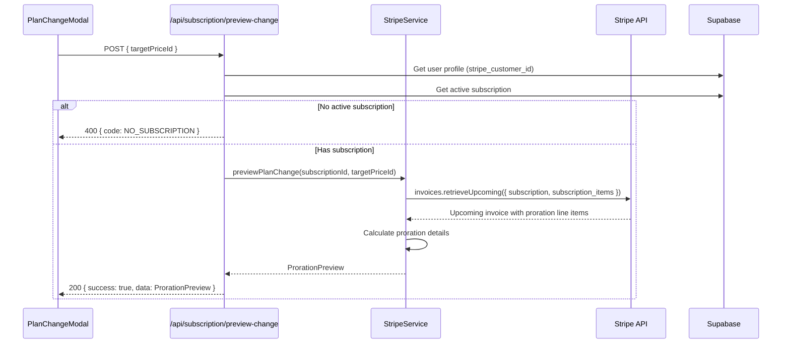
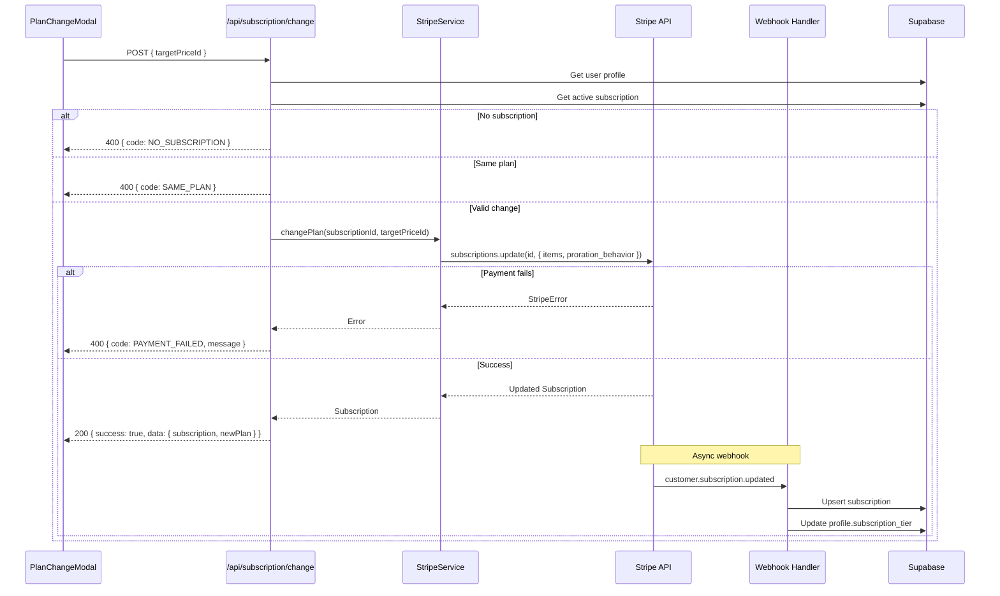

# PRD: Subscription Upgrade/Downgrade Flow

**Date:** December 2, 2025
**Status:** Draft
**Author:** Principal Architect
**Priority:** #5 (Major Project - High Impact)

---

## 1. Context Analysis

### 1.1 Files Analyzed

```
/home/joao/projects/pixelperfect/app/api/checkout/route.ts
/home/joao/projects/pixelperfect/app/api/portal/route.ts
/home/joao/projects/pixelperfect/app/api/webhooks/stripe/route.ts
/home/joao/projects/pixelperfect/app/pricing/page.tsx
/home/joao/projects/pixelperfect/app/dashboard/billing/page.tsx
/home/joao/projects/pixelperfect/client/components/stripe/PricingCard.tsx
/home/joao/projects/pixelperfect/client/components/stripe/SubscriptionStatus.tsx
/home/joao/projects/pixelperfect/client/services/stripeService.ts
/home/joao/projects/pixelperfect/server/stripe/stripeService.ts
/home/joao/projects/pixelperfect/shared/config/stripe.ts
/home/joao/projects/pixelperfect/supabase/migrations/20250120_create_subscriptions_table.sql
/home/joao/projects/pixelperfect/docs/technical/systems/subscription-gaps.md
```

### 1.2 Component & Dependency Overview

```mermaid
graph TD
    subgraph "Current Flow (New Subscriptions Only)"
        A[Pricing Page] -->|Click "Get Started"| B[Checkout Page]
        B -->|POST /api/checkout| C[Checkout API]
        C -->|Creates Session| D[Stripe Checkout]
        D -->|Webhooks| E[Webhook Handler]
        E -->|Upsert| F[(Supabase DB)]
    end

    subgraph "Plan Changes (Missing)"
        G[Billing Page] -->|"Manage"| H[Stripe Portal]
        H -.->|External UI| I[User Changes Plan]
        I -.->|Webhook| E
    end

    subgraph "Proposed Flow"
        J[Pricing Page] -->|Current Plan Badge| K[PricingCard]
        K -->|Click "Upgrade/Downgrade"| L[PlanChangeModal]
        L -->|Preview| M[POST /api/subscription/preview-change]
        M -->|Proration Details| L
        L -->|Confirm| N[POST /api/subscription/change]
        N -->|Update Sub| O[Stripe API]
        O -->|Webhook| E
    end

    style G stroke-dasharray: 5 5
    style H stroke-dasharray: 5 5
    style I stroke-dasharray: 5 5
```

### 1.3 Current Behavior Summary

- **New subscriptions work**: Users can subscribe via embedded Stripe Checkout
- **Plan changes blocked**: `checkout/route.ts:91-111` returns error for users with active subscriptions
- **External management only**: All plan changes require Stripe Customer Portal (external UI)
- **No proration preview**: Users cannot see cost implications before changing plans
- **No "Current Plan" indicator**: Pricing page shows same UI regardless of subscription status
- **Webhook infrastructure exists**: `customer.subscription.updated` handler already processes plan changes

### 1.4 Problem Statement

Subscribed users cannot upgrade or downgrade their plan within the application; they must use an external Stripe Portal with no proration preview, leading to poor user experience and potential conversion loss.

---

## 2. Proposed Solution

### 2.1 Architecture Summary

- **In-app plan change flow**: Users see "Upgrade" or "Downgrade" on pricing cards when subscribed
- **Proration preview**: Before confirming, users see exact cost difference and billing impact
- **Immediate execution**: Plan changes take effect immediately with prorated charges/credits
- **Existing webhook reuse**: Leverage existing `handleSubscriptionUpdate` for DB sync

**Alternative Approaches Considered:**

| Approach | Pros | Cons | Decision |
|----------|------|------|----------|
| Stripe Checkout for changes | Simpler implementation | No proration preview, external redirect | Rejected |
| Stripe Portal only | Zero code changes | Poor UX, no in-app experience | Current state (rejected) |
| Custom flow with proration | Full control, best UX | More implementation effort | **Selected** |

### 2.2 Architecture Diagram

```mermaid
flowchart LR
    subgraph Client
        PP[Pricing Page]
        PCM[PlanChangeModal]
        PC[PricingCard]
    end

    subgraph API["API Layer"]
        PV[/api/subscription/preview-change]
        CH[/api/subscription/change]
    end

    subgraph Services
        SS[StripeService]
    end

    subgraph External
        SA[Stripe API]
        WH[Webhooks]
    end

    subgraph Database
        DB[(Supabase)]
    end

    PP --> PC
    PC -->|"isCurrentPlan?"| PC
    PC -->|"Open Modal"| PCM
    PCM -->|"GET preview"| PV
    PV -->|"retrieveUpcoming"| SA
    SA -->|"Proration data"| PV
    PV -->|"Preview response"| PCM
    PCM -->|"POST change"| CH
    CH -->|"subscriptions.update"| SA
    SA -->|"subscription.updated"| WH
    WH -->|"Upsert"| DB
```

### 2.3 Key Technical Decisions

| Decision | Choice | Justification |
|----------|--------|---------------|
| **Proration behavior** | `create_prorations` | Standard Stripe behavior, immediate billing adjustment |
| **Credit adjustment on upgrade** | Add credit difference immediately | Users upgrading to higher tier receive additional credits right away for better UX |
| **Credit adjustment on downgrade** | Keep existing credits | Users retain credits on downgrade; next renewal provides new tier's allocation |
| **Billing anchor** | Keep existing | Preserve user's billing date, avoid confusion |
| **Payment collection** | `default_incomplete` | Allow payment failure handling |
| **Subscription item update** | Replace single item | System uses one price per subscription |

**Stripe API Methods Used:**

1. `stripe.invoices.retrieveUpcoming()` - Preview proration
2. `stripe.subscriptions.update()` - Execute plan change

### 2.4 Data Model Changes

**No schema changes required.**

Existing `subscriptions` table handles all plan change scenarios:
- `price_id` updates to new plan
- `status` remains `active`
- `current_period_start/end` may shift based on proration

Existing webhook handler `handleSubscriptionUpdate` already:
- Upserts subscription with new `price_id`
- Updates `profiles.subscription_tier` with new plan name

---

## 2.5 Runtime Execution Flow

### Preview Change Flow



### Execute Change Flow



---

## 3. Detailed Implementation Spec

### A. `shared/types/stripe.ts` - Type Definitions

**Changes Needed:** Add new interfaces for proration preview

**New Types:**

```typescript
export interface IProrationPreview {
  /** Current plan details */
  currentPlan: {
    name: string;
    priceId: string;
    monthlyPrice: number;
  };
  /** Target plan details */
  targetPlan: {
    name: string;
    priceId: string;
    monthlyPrice: number;
  };
  /** Proration calculation */
  proration: {
    /** Amount due immediately (positive = charge, negative = credit) */
    immediateAmount: number;
    /** Currency code */
    currency: string;
    /** Credit for unused time on current plan */
    creditAmount: number;
    /** Charge for remaining time on new plan */
    debitAmount: number;
    /** When this charge will be applied */
    billingDate: string;
  };
  /** Whether this is an upgrade or downgrade */
  changeType: 'upgrade' | 'downgrade';
  /** Next billing amount after change */
  nextBillingAmount: number;
  /** Current billing period end (unchanged) */
  currentPeriodEnd: string;
}

export interface IPlanChangeRequest {
  targetPriceId: string;
}

export interface IPlanChangeResponse {
  success: boolean;
  subscription: ISubscription;
  newPlan: {
    name: string;
    priceId: string;
    creditsPerMonth: number;
  };
}
```

**Justification:** Strongly typed interfaces ensure frontend/backend contract is clear and self-documenting.

---

### B. `server/stripe/stripeService.ts` - Backend Service

**Changes Needed:** Add two new methods

**New Methods:**

```typescript
/**
 * Preview the cost of changing subscription plans
 * @param subscriptionId - Current Stripe subscription ID
 * @param targetPriceId - Target plan's Stripe price ID
 * @returns Proration preview with amounts and plan details
 */
static async previewPlanChange(
  subscriptionId: string,
  targetPriceId: string
): Promise<IProrationPreview> {
  // 1. Retrieve current subscription
  const subscription = await stripe.subscriptions.retrieve(subscriptionId);
  const currentPriceId = subscription.items.data[0]?.price.id;

  if (!currentPriceId) {
    throw new Error('No price found on subscription');
  }

  // 2. Validate plans exist in config
  const currentPlan = getPlanForPriceId(currentPriceId);
  const targetPlan = getPlanForPriceId(targetPriceId);

  if (!currentPlan || !targetPlan) {
    throw new Error('Invalid plan configuration');
  }

  // 3. Get subscription item ID for update
  const subscriptionItemId = subscription.items.data[0].id;

  // 4. Preview upcoming invoice with plan change
  const upcomingInvoice = await stripe.invoices.retrieveUpcoming({
    subscription: subscriptionId,
    subscription_items: [
      {
        id: subscriptionItemId,
        price: targetPriceId,
      },
    ],
    subscription_proration_behavior: 'create_prorations',
  });

  // 5. Extract proration line items
  const prorationLines = upcomingInvoice.lines.data.filter(
    (line) => line.proration
  );

  // Calculate credit (negative) and debit (positive) amounts
  let creditAmount = 0;
  let debitAmount = 0;

  for (const line of prorationLines) {
    if (line.amount < 0) {
      creditAmount += Math.abs(line.amount);
    } else {
      debitAmount += line.amount;
    }
  }

  // Net immediate amount (what user pays/receives)
  const immediateAmount = debitAmount - creditAmount;

  // 6. Determine change type
  const currentMonthly = SUBSCRIPTION_PRICE_MAP[currentPriceId]?.price || 0;
  const targetMonthly = SUBSCRIPTION_PRICE_MAP[targetPriceId]?.price || 0;
  const changeType = targetMonthly > currentMonthly ? 'upgrade' : 'downgrade';

  return {
    currentPlan: {
      name: currentPlan.name,
      priceId: currentPriceId,
      monthlyPrice: currentMonthly,
    },
    targetPlan: {
      name: targetPlan.name,
      priceId: targetPriceId,
      monthlyPrice: targetMonthly,
    },
    proration: {
      immediateAmount: immediateAmount / 100, // Convert cents to dollars
      currency: upcomingInvoice.currency,
      creditAmount: creditAmount / 100,
      debitAmount: debitAmount / 100,
      billingDate: dayjs.unix(upcomingInvoice.period_end).toISOString(),
    },
    changeType,
    nextBillingAmount: targetMonthly,
    currentPeriodEnd: dayjs.unix(subscription.current_period_end).toISOString(),
  };
}

/**
 * Execute a subscription plan change
 * @param subscriptionId - Current Stripe subscription ID
 * @param targetPriceId - Target plan's Stripe price ID
 * @returns Updated subscription
 */
static async changePlan(
  subscriptionId: string,
  targetPriceId: string
): Promise<Stripe.Subscription> {
  // 1. Retrieve current subscription
  const subscription = await stripe.subscriptions.retrieve(subscriptionId);
  const subscriptionItemId = subscription.items.data[0]?.id;

  if (!subscriptionItemId) {
    throw new Error('No subscription item found');
  }

  // 2. Validate target plan exists
  const targetPlan = getPlanForPriceId(targetPriceId);
  if (!targetPlan) {
    throw new Error('Invalid target plan');
  }

  // 3. Update subscription with new price
  const updatedSubscription = await stripe.subscriptions.update(subscriptionId, {
    items: [
      {
        id: subscriptionItemId,
        price: targetPriceId,
      },
    ],
    proration_behavior: 'create_prorations',
    payment_behavior: 'error_if_incomplete',
  });

  return updatedSubscription;
}
```

**Justification:**
- `previewPlanChange`: Uses `invoices.retrieveUpcoming` to show exact proration without making changes
- `changePlan`: Uses `subscriptions.update` with `proration_behavior: 'create_prorations'` for standard Stripe billing behavior
- `payment_behavior: 'error_if_incomplete'`: Fails fast if payment method has issues

---

### C. `app/api/subscription/preview-change/route.ts` - Preview API

**New File:**

```typescript
import { NextRequest, NextResponse } from 'next/server';
import { createClient } from '@supabase/supabase-js';
import { stripe } from '@server/stripe';
import { getPlanForPriceId, SUBSCRIPTION_PRICE_MAP } from '@shared/config/stripe';
import dayjs from 'dayjs';

export const runtime = 'edge';

export async function POST(request: NextRequest): Promise<NextResponse> {
  try {
    // 1. Authenticate user
    const authHeader = request.headers.get('authorization');
    if (!authHeader?.startsWith('Bearer ')) {
      return NextResponse.json(
        { success: false, error: 'Unauthorized' },
        { status: 401 }
      );
    }

    const token = authHeader.substring(7);
    const supabase = createClient(
      process.env.NEXT_PUBLIC_SUPABASE_URL!,
      process.env.NEXT_PUBLIC_SUPABASE_ANON_KEY!,
      { global: { headers: { Authorization: `Bearer ${token}` } } }
    );

    const { data: { user }, error: authError } = await supabase.auth.getUser();
    if (authError || !user) {
      return NextResponse.json(
        { success: false, error: 'Unauthorized' },
        { status: 401 }
      );
    }

    // 2. Parse request body
    const body = await request.json();
    const { targetPriceId } = body;

    if (!targetPriceId) {
      return NextResponse.json(
        { success: false, error: 'targetPriceId is required', code: 'MISSING_PRICE_ID' },
        { status: 400 }
      );
    }

    // 3. Validate target price exists
    const targetPlan = getPlanForPriceId(targetPriceId);
    if (!targetPlan) {
      return NextResponse.json(
        { success: false, error: 'Invalid target plan', code: 'INVALID_PLAN' },
        { status: 400 }
      );
    }

    // 4. Get user's active subscription
    const { data: subscription, error: subError } = await supabase
      .from('subscriptions')
      .select('id, price_id, current_period_end')
      .eq('user_id', user.id)
      .in('status', ['active', 'trialing'])
      .order('created_at', { ascending: false })
      .limit(1)
      .single();

    if (subError || !subscription) {
      return NextResponse.json(
        { success: false, error: 'No active subscription found', code: 'NO_SUBSCRIPTION' },
        { status: 400 }
      );
    }

    // 5. Check if same plan
    if (subscription.price_id === targetPriceId) {
      return NextResponse.json(
        { success: false, error: 'Already on this plan', code: 'SAME_PLAN' },
        { status: 400 }
      );
    }

    // 6. Get Stripe subscription details
    const stripeSubscription = await stripe.subscriptions.retrieve(subscription.id);
    const subscriptionItemId = stripeSubscription.items.data[0]?.id;

    if (!subscriptionItemId) {
      return NextResponse.json(
        { success: false, error: 'Invalid subscription state', code: 'INVALID_STATE' },
        { status: 500 }
      );
    }

    // 7. Preview upcoming invoice with change
    const upcomingInvoice = await stripe.invoices.retrieveUpcoming({
      subscription: subscription.id,
      subscription_items: [
        {
          id: subscriptionItemId,
          price: targetPriceId,
        },
      ],
      subscription_proration_behavior: 'create_prorations',
    });

    // 8. Calculate proration amounts
    const prorationLines = upcomingInvoice.lines.data.filter(line => line.proration);

    let creditAmount = 0;
    let debitAmount = 0;

    for (const line of prorationLines) {
      if (line.amount < 0) {
        creditAmount += Math.abs(line.amount);
      } else {
        debitAmount += line.amount;
      }
    }

    const immediateAmount = debitAmount - creditAmount;

    // 9. Build response
    const currentPlan = getPlanForPriceId(subscription.price_id);
    const currentPrice = SUBSCRIPTION_PRICE_MAP[subscription.price_id]?.price || 0;
    const targetPrice = SUBSCRIPTION_PRICE_MAP[targetPriceId]?.price || 0;

    const preview = {
      currentPlan: {
        name: currentPlan?.name || 'Unknown',
        priceId: subscription.price_id,
        monthlyPrice: currentPrice,
      },
      targetPlan: {
        name: targetPlan.name,
        priceId: targetPriceId,
        monthlyPrice: targetPrice,
      },
      proration: {
        immediateAmount: immediateAmount / 100,
        currency: upcomingInvoice.currency,
        creditAmount: creditAmount / 100,
        debitAmount: debitAmount / 100,
        billingDate: dayjs.unix(upcomingInvoice.period_end).toISOString(),
      },
      changeType: targetPrice > currentPrice ? 'upgrade' : 'downgrade',
      nextBillingAmount: targetPrice,
      currentPeriodEnd: subscription.current_period_end,
    };

    return NextResponse.json({ success: true, data: preview });

  } catch (error: unknown) {
    console.error('Preview change error:', error);
    const message = error instanceof Error ? error.message : 'Failed to preview plan change';
    return NextResponse.json(
      { success: false, error: message, code: 'PREVIEW_FAILED' },
      { status: 500 }
    );
  }
}
```

**Justification:**
- Reuses existing authentication pattern from checkout API
- Returns structured proration data for UI display
- Validates same-plan and no-subscription edge cases upfront

---

### D. `app/api/subscription/change/route.ts` - Execute Change API

**New File:**

```typescript
import { NextRequest, NextResponse } from 'next/server';
import { createClient } from '@supabase/supabase-js';
import { stripe } from '@server/stripe';
import { getPlanForPriceId } from '@shared/config/stripe';

export const runtime = 'edge';

export async function POST(request: NextRequest): Promise<NextResponse> {
  try {
    // 1. Authenticate user
    const authHeader = request.headers.get('authorization');
    if (!authHeader?.startsWith('Bearer ')) {
      return NextResponse.json(
        { success: false, error: 'Unauthorized' },
        { status: 401 }
      );
    }

    const token = authHeader.substring(7);
    const supabase = createClient(
      process.env.NEXT_PUBLIC_SUPABASE_URL!,
      process.env.NEXT_PUBLIC_SUPABASE_ANON_KEY!,
      { global: { headers: { Authorization: `Bearer ${token}` } } }
    );

    const { data: { user }, error: authError } = await supabase.auth.getUser();
    if (authError || !user) {
      return NextResponse.json(
        { success: false, error: 'Unauthorized' },
        { status: 401 }
      );
    }

    // 2. Parse request body
    const body = await request.json();
    const { targetPriceId } = body;

    if (!targetPriceId) {
      return NextResponse.json(
        { success: false, error: 'targetPriceId is required', code: 'MISSING_PRICE_ID' },
        { status: 400 }
      );
    }

    // 3. Validate target plan exists
    const targetPlan = getPlanForPriceId(targetPriceId);
    if (!targetPlan) {
      return NextResponse.json(
        { success: false, error: 'Invalid target plan', code: 'INVALID_PLAN' },
        { status: 400 }
      );
    }

    // 4. Get user's active subscription
    const { data: subscription, error: subError } = await supabase
      .from('subscriptions')
      .select('id, price_id')
      .eq('user_id', user.id)
      .in('status', ['active', 'trialing'])
      .order('created_at', { ascending: false })
      .limit(1)
      .single();

    if (subError || !subscription) {
      return NextResponse.json(
        { success: false, error: 'No active subscription found', code: 'NO_SUBSCRIPTION' },
        { status: 400 }
      );
    }

    // 5. Check if same plan
    if (subscription.price_id === targetPriceId) {
      return NextResponse.json(
        { success: false, error: 'Already on this plan', code: 'SAME_PLAN' },
        { status: 400 }
      );
    }

    // 6. Get Stripe subscription and update
    const stripeSubscription = await stripe.subscriptions.retrieve(subscription.id);
    const subscriptionItemId = stripeSubscription.items.data[0]?.id;

    if (!subscriptionItemId) {
      return NextResponse.json(
        { success: false, error: 'Invalid subscription state', code: 'INVALID_STATE' },
        { status: 500 }
      );
    }

    // 7. Execute plan change
    const updatedSubscription = await stripe.subscriptions.update(subscription.id, {
      items: [
        {
          id: subscriptionItemId,
          price: targetPriceId,
        },
      ],
      proration_behavior: 'create_prorations',
      payment_behavior: 'error_if_incomplete',
    });

    // 8. Return success (webhook will update DB)
    return NextResponse.json({
      success: true,
      data: {
        subscriptionId: updatedSubscription.id,
        newPlan: {
          name: targetPlan.name,
          priceId: targetPriceId,
          creditsPerMonth: targetPlan.creditsPerMonth,
        },
        status: updatedSubscription.status,
      },
    });

  } catch (error: unknown) {
    console.error('Change plan error:', error);

    // Handle Stripe payment errors specifically
    if (error instanceof Error && 'type' in error) {
      const stripeError = error as { type: string; message: string; code?: string };
      if (stripeError.type === 'StripeCardError') {
        return NextResponse.json(
          {
            success: false,
            error: stripeError.message,
            code: 'PAYMENT_FAILED'
          },
          { status: 402 }
        );
      }
    }

    const message = error instanceof Error ? error.message : 'Failed to change plan';
    return NextResponse.json(
      { success: false, error: message, code: 'CHANGE_FAILED' },
      { status: 500 }
    );
  }
}
```

**Justification:**
- Uses `payment_behavior: 'error_if_incomplete'` to fail fast on payment issues
- Returns minimal response; webhook handles DB updates
- Specific handling for Stripe card errors (402 status)

---

### E. `client/services/stripeService.ts` - Frontend Service

**Changes Needed:** Add two new methods

**New Methods:**

```typescript
/**
 * Preview the cost of changing subscription plans
 */
static async previewPlanChange(targetPriceId: string): Promise<IProrationPreview> {
  const response = await this.authenticatedFetch('/api/subscription/preview-change', {
    method: 'POST',
    body: JSON.stringify({ targetPriceId }),
  });

  if (!response.success) {
    throw new Error(response.error || 'Failed to preview plan change');
  }

  return response.data;
}

/**
 * Execute a subscription plan change
 */
static async changePlan(targetPriceId: string): Promise<IPlanChangeResponse> {
  const response = await this.authenticatedFetch('/api/subscription/change', {
    method: 'POST',
    body: JSON.stringify({ targetPriceId }),
  });

  if (!response.success) {
    throw new Error(response.error || 'Failed to change plan');
  }

  return response.data;
}
```

**Justification:** Simple wrappers following existing service patterns.

---

### F. `client/components/stripe/PricingCard.tsx` - Updated Component

**Changes Needed:** Add current plan detection and change button logic

**Updated Props Interface:**

```typescript
interface IPricingCardProps {
  name: string;
  description?: string;
  price: number;
  currency?: string;
  interval?: 'month' | 'year';
  features: readonly string[];
  priceId: string;
  recommended?: boolean;
  /** Current user's price ID (if subscribed) */
  currentPriceId?: string | null;
  /** Callback when plan change is requested */
  onPlanChange?: (targetPriceId: string) => void;
}
```

**Updated Component Logic:**

```typescript
export function PricingCard({
  name,
  description,
  price,
  currency = 'USD',
  interval,
  features,
  priceId,
  recommended = false,
  currentPriceId,
  onPlanChange,
}: IPricingCardProps): JSX.Element {
  const router = useRouter();

  const isCurrentPlan = currentPriceId === priceId;
  const hasSubscription = !!currentPriceId;

  // Determine button text and action
  const getButtonConfig = () => {
    if (isCurrentPlan) {
      return { text: 'Current Plan', disabled: true, variant: 'secondary' };
    }
    if (hasSubscription) {
      // User has a different plan - show upgrade/downgrade
      const currentPrice = SUBSCRIPTION_PRICE_MAP[currentPriceId]?.price || 0;
      const isUpgrade = price > currentPrice;
      return {
        text: isUpgrade ? 'Upgrade' : 'Downgrade',
        disabled: false,
        variant: isUpgrade ? 'primary' : 'secondary'
      };
    }
    return { text: 'Get Started', disabled: false, variant: 'primary' };
  };

  const buttonConfig = getButtonConfig();

  const handleClick = () => {
    if (isCurrentPlan) return;

    if (hasSubscription && onPlanChange) {
      // Trigger plan change modal
      onPlanChange(priceId);
    } else {
      // New subscription - go to checkout
      router.push(`/checkout?priceId=${encodeURIComponent(priceId)}&plan=${encodeURIComponent(name)}`);
    }
  };

  return (
    <div
      className={`relative bg-white rounded-2xl shadow-lg border-2 ${
        isCurrentPlan
          ? 'border-green-500 ring-2 ring-green-500 ring-opacity-20'
          : recommended
            ? 'border-indigo-500 ring-2 ring-indigo-500 ring-opacity-20'
            : 'border-slate-200'
      }`}
    >
      {/* Current Plan Badge */}
      {isCurrentPlan && (
        <div className="absolute -top-3 left-1/2 -translate-x-1/2 bg-green-500 text-white px-4 py-1 rounded-full text-sm font-medium">
          Current Plan
        </div>
      )}

      {/* Recommended Badge (only if not current) */}
      {recommended && !isCurrentPlan && (
        <div className="absolute -top-3 left-1/2 -translate-x-1/2 bg-indigo-500 text-white px-4 py-1 rounded-full text-sm font-medium">
          Recommended
        </div>
      )}

      {/* ... rest of card content ... */}

      <div className="mt-auto">
        <button
          onClick={handleClick}
          disabled={buttonConfig.disabled}
          className={`w-full py-3 px-6 rounded-lg font-medium transition-all duration-200 ${
            buttonConfig.disabled
              ? 'bg-slate-100 text-slate-400 cursor-not-allowed'
              : buttonConfig.variant === 'primary'
                ? 'bg-indigo-600 hover:bg-indigo-700 text-white shadow-md hover:shadow-lg'
                : 'bg-slate-200 hover:bg-slate-300 text-slate-700'
          }`}
        >
          {buttonConfig.text}
        </button>
      </div>
    </div>
  );
}
```

**Justification:**
- "Current Plan" badge clearly indicates active subscription
- Upgrade/Downgrade text provides clear user intent
- Disabled state prevents accidental clicks on current plan

---

### G. `client/components/stripe/PlanChangeModal.tsx` - New Component

**New File:**

```typescript
'use client';

import { useState, useEffect } from 'react';
import { StripeService } from '@client/services/stripeService';
import type { IProrationPreview } from '@shared/types/stripe';
import dayjs from 'dayjs';

interface IPlanChangeModalProps {
  targetPriceId: string;
  onClose: () => void;
  onSuccess: () => void;
}

export function PlanChangeModal({
  targetPriceId,
  onClose,
  onSuccess,
}: IPlanChangeModalProps): JSX.Element {
  const [preview, setPreview] = useState<IProrationPreview | null>(null);
  const [loading, setLoading] = useState(true);
  const [executing, setExecuting] = useState(false);
  const [error, setError] = useState<string | null>(null);

  // Load proration preview on mount
  useEffect(() => {
    const loadPreview = async () => {
      try {
        setLoading(true);
        setError(null);
        const data = await StripeService.previewPlanChange(targetPriceId);
        setPreview(data);
      } catch (err) {
        setError(err instanceof Error ? err.message : 'Failed to load preview');
      } finally {
        setLoading(false);
      }
    };

    loadPreview();
  }, [targetPriceId]);

  const handleConfirm = async () => {
    try {
      setExecuting(true);
      setError(null);
      await StripeService.changePlan(targetPriceId);
      onSuccess();
    } catch (err) {
      setError(err instanceof Error ? err.message : 'Failed to change plan');
      setExecuting(false);
    }
  };

  const formatCurrency = (amount: number, currency: string) => {
    return new Intl.NumberFormat('en-US', {
      style: 'currency',
      currency: currency.toUpperCase(),
    }).format(amount);
  };

  return (
    <div className="fixed inset-0 bg-black/50 flex items-center justify-center z-50">
      <div className="bg-white rounded-2xl shadow-xl max-w-md w-full mx-4 overflow-hidden">
        {/* Header */}
        <div className="px-6 py-4 border-b border-slate-200">
          <h2 className="text-xl font-bold text-slate-900">
            {preview?.changeType === 'upgrade' ? 'Upgrade' : 'Downgrade'} Plan
          </h2>
        </div>

        {/* Content */}
        <div className="p-6">
          {loading ? (
            <div className="flex items-center justify-center py-8">
              <div className="animate-spin rounded-full h-8 w-8 border-b-2 border-indigo-600" />
              <span className="ml-3 text-slate-600">Calculating proration...</span>
            </div>
          ) : error ? (
            <div className="bg-red-50 border border-red-200 rounded-lg p-4">
              <p className="text-red-700">{error}</p>
            </div>
          ) : preview && (
            <>
              {/* Plan Change Summary */}
              <div className="flex items-center justify-between mb-6">
                <div className="text-center">
                  <p className="text-sm text-slate-500">Current</p>
                  <p className="font-semibold text-slate-900">{preview.currentPlan.name}</p>
                  <p className="text-slate-600">${preview.currentPlan.monthlyPrice}/mo</p>
                </div>
                <div className="text-2xl text-slate-400">→</div>
                <div className="text-center">
                  <p className="text-sm text-slate-500">New</p>
                  <p className="font-semibold text-indigo-600">{preview.targetPlan.name}</p>
                  <p className="text-indigo-600">${preview.targetPlan.monthlyPrice}/mo</p>
                </div>
              </div>

              {/* Proration Details */}
              <div className="bg-slate-50 rounded-lg p-4 mb-6 space-y-3">
                <div className="flex justify-between text-sm">
                  <span className="text-slate-600">Credit for unused time</span>
                  <span className="text-green-600">
                    -{formatCurrency(preview.proration.creditAmount, preview.proration.currency)}
                  </span>
                </div>
                <div className="flex justify-between text-sm">
                  <span className="text-slate-600">Charge for new plan</span>
                  <span className="text-slate-900">
                    +{formatCurrency(preview.proration.debitAmount, preview.proration.currency)}
                  </span>
                </div>
                <div className="border-t border-slate-200 pt-3 flex justify-between font-semibold">
                  <span className="text-slate-900">
                    {preview.proration.immediateAmount >= 0 ? 'Amount due now' : 'Credit applied'}
                  </span>
                  <span className={preview.proration.immediateAmount >= 0 ? 'text-slate-900' : 'text-green-600'}>
                    {formatCurrency(Math.abs(preview.proration.immediateAmount), preview.proration.currency)}
                  </span>
                </div>
              </div>

              {/* Billing Info */}
              <p className="text-sm text-slate-500 mb-6">
                Your next billing date remains {dayjs(preview.currentPeriodEnd).format('MMMM D, YYYY')}.
                You'll be charged {formatCurrency(preview.nextBillingAmount, 'USD')}/month going forward.
              </p>
            </>
          )}
        </div>

        {/* Footer */}
        <div className="px-6 py-4 bg-slate-50 border-t border-slate-200 flex gap-3">
          <button
            onClick={onClose}
            disabled={executing}
            className="flex-1 py-2 px-4 rounded-lg border border-slate-300 text-slate-700 font-medium hover:bg-slate-100 transition-colors disabled:opacity-50"
          >
            Cancel
          </button>
          <button
            onClick={handleConfirm}
            disabled={loading || executing || !!error}
            className="flex-1 py-2 px-4 rounded-lg bg-indigo-600 text-white font-medium hover:bg-indigo-700 transition-colors disabled:opacity-50 disabled:cursor-not-allowed"
          >
            {executing ? 'Processing...' : `Confirm ${preview?.changeType === 'upgrade' ? 'Upgrade' : 'Downgrade'}`}
          </button>
        </div>
      </div>
    </div>
  );
}
```

**Justification:**
- Shows clear proration breakdown (credit, debit, net)
- Maintains billing date context
- Loading and error states for robust UX
- Accessible modal with backdrop click handling

---

### H. `app/pricing/page.tsx` - Updated Page

**Changes Needed:** Pass current subscription to PricingCard, handle modal

**Key Changes:**

```typescript
// Add state for modal
const [changingToPriceId, setChangingToPriceId] = useState<string | null>(null);

// Get current price ID
const currentPriceId = subscription?.price_id || null;

// Handle plan change request
const handlePlanChange = (targetPriceId: string) => {
  setChangingToPriceId(targetPriceId);
};

// Handle success
const handleChangeSuccess = () => {
  setChangingToPriceId(null);
  // Refresh subscription data
  loadUserData();
};

// In render:
<PricingCard
  {...SUBSCRIPTION_PLANS.HOBBY_MONTHLY}
  priceId={STRIPE_PRICES.HOBBY_MONTHLY}
  currentPriceId={currentPriceId}
  onPlanChange={handlePlanChange}
/>

{/* Plan Change Modal */}
{changingToPriceId && (
  <PlanChangeModal
    targetPriceId={changingToPriceId}
    onClose={() => setChangingToPriceId(null)}
    onSuccess={handleChangeSuccess}
  />
)}
```

---

## 4. Step-by-Step Execution Plan

### Phase 1: Backend Core (API Layer)

- [ ] Add `IProrationPreview` and `IPlanChangeRequest` types to `shared/types/stripe.ts`
- [ ] Create `app/api/subscription/preview-change/route.ts`
- [ ] Create `app/api/subscription/change/route.ts`
- [ ] Add unit tests for preview-change endpoint
- [ ] Add unit tests for change endpoint

### Phase 2: Frontend Service Layer

- [ ] Add `previewPlanChange()` to `client/services/stripeService.ts`
- [ ] Add `changePlan()` to `client/services/stripeService.ts`
- [ ] Export new types from shared types barrel

### Phase 3: UI Components

- [ ] Update `PricingCard` props to include `currentPriceId` and `onPlanChange`
- [ ] Update `PricingCard` button logic for upgrade/downgrade/current states
- [ ] Add "Current Plan" badge to `PricingCard`
- [ ] Create `PlanChangeModal` component
- [ ] Add loading, error, and success states to modal

### Phase 4: Integration

- [ ] Update `app/pricing/page.tsx` to pass current subscription to cards
- [ ] Add modal state management to pricing page
- [ ] Handle success flow (close modal, refresh data)
- [ ] Test full upgrade flow (Hobby → Pro → Business)
- [ ] Test full downgrade flow (Business → Pro → Hobby)

### Phase 5: Polish & Edge Cases

- [ ] Handle payment failure gracefully in modal
- [ ] Add analytics events for plan changes
- [ ] Update billing page to show recent plan change
- [ ] Add success toast/notification after plan change

---

## 5. Testing Strategy

### Unit Tests

**Files to Test:**
- `app/api/subscription/preview-change/route.ts`
- `app/api/subscription/change/route.ts`

**Test Cases:**

```typescript
// preview-change.api.spec.ts
describe('POST /api/subscription/preview-change', () => {
  it('returns 401 for unauthenticated requests');
  it('returns 400 for missing targetPriceId');
  it('returns 400 for invalid targetPriceId');
  it('returns 400 for users without active subscription');
  it('returns 400 when targeting same plan');
  it('returns proration preview for valid upgrade');
  it('returns proration preview for valid downgrade');
  it('handles Stripe API errors gracefully');
});

// change.api.spec.ts
describe('POST /api/subscription/change', () => {
  it('returns 401 for unauthenticated requests');
  it('returns 400 for missing targetPriceId');
  it('returns 400 for users without active subscription');
  it('returns 400 when targeting same plan');
  it('returns 402 for payment failures');
  it('successfully updates subscription for upgrade');
  it('successfully updates subscription for downgrade');
});
```

### Integration Tests

**Flows to Test:**
1. Full upgrade journey (Hobby → Pro)
2. Full downgrade journey (Pro → Hobby)
3. Modal close/cancel flow
4. Payment failure recovery

### Edge Cases

| Scenario | Expected Behavior |
|----------|-------------------|
| User clicks upgrade during webhook delay | API validates against Stripe, not local DB |
| Payment method expired | 402 error with clear message, modal stays open |
| User on trial attempts upgrade | Works - trial continues on new plan |
| Rapid double-click on confirm | Button disabled after first click |
| Network failure during preview | Error state with retry option |
| Session expires mid-flow | Redirect to login, preserve intent |

---

## 6. Acceptance Criteria

- [ ] Subscribed users see "Current Plan" badge on their active plan
- [ ] Subscribed users see "Upgrade" or "Downgrade" on other plans
- [ ] Clicking Upgrade/Downgrade opens proration preview modal
- [ ] Modal shows correct credit, debit, and net amounts
- [ ] Confirming change updates subscription immediately
- [ ] Billing page reflects new plan within 5 seconds (webhook)
- [ ] Payment failures show clear error message
- [ ] All new endpoints return correct HTTP codes
- [ ] Response times < 500ms for preview, < 2000ms for change
- [ ] All unit + integration tests pass
- [ ] No console errors in production build

---

## 7. Verification & Rollback

### Success Criteria

**Metrics to Track:**
- Plan change success rate (target: >95%)
- Preview-to-confirm conversion rate
- Average time in modal
- Payment failure rate on changes

**Logging:**
- Log all plan change attempts with user ID, from/to plans
- Log proration amounts for audit trail
- Log any Stripe errors with full context

### Rollback Plan

**If issues arise:**
1. Disable `/api/subscription/change` endpoint (return 503)
2. Remove `onPlanChange` prop from `PricingCard` (hide modal trigger)
3. Users fall back to Stripe Portal for changes (existing behavior)

**Database Rollback:** Not required - no schema changes.

**Feature Flag Option:**
```typescript
// In shared/config/feature-flags.ts
export const FEATURE_FLAGS = {
  IN_APP_PLAN_CHANGE: process.env.ENABLE_PLAN_CHANGE === 'true',
};
```

---

## Appendix: API Response Examples

### Preview Change Success

```json
{
  "success": true,
  "data": {
    "currentPlan": {
      "name": "Hobby",
      "priceId": "price_1SZmVyALMLhQocpf0H7n5ls8",
      "monthlyPrice": 19
    },
    "targetPlan": {
      "name": "Professional",
      "priceId": "price_1SZmVzALMLhQocpfPyRX2W8D",
      "monthlyPrice": 49
    },
    "proration": {
      "immediateAmount": 15.00,
      "currency": "usd",
      "creditAmount": 9.50,
      "debitAmount": 24.50,
      "billingDate": "2025-01-02T00:00:00.000Z"
    },
    "changeType": "upgrade",
    "nextBillingAmount": 49,
    "currentPeriodEnd": "2025-01-02T00:00:00.000Z"
  }
}
```

### Change Plan Success

```json
{
  "success": true,
  "data": {
    "subscriptionId": "sub_1ABC123",
    "newPlan": {
      "name": "Professional",
      "priceId": "price_1SZmVzALMLhQocpfPyRX2W8D",
      "creditsPerMonth": 1000
    },
    "status": "active"
  }
}
```

### Payment Failure

```json
{
  "success": false,
  "error": "Your card was declined. Please update your payment method.",
  "code": "PAYMENT_FAILED"
}
```
