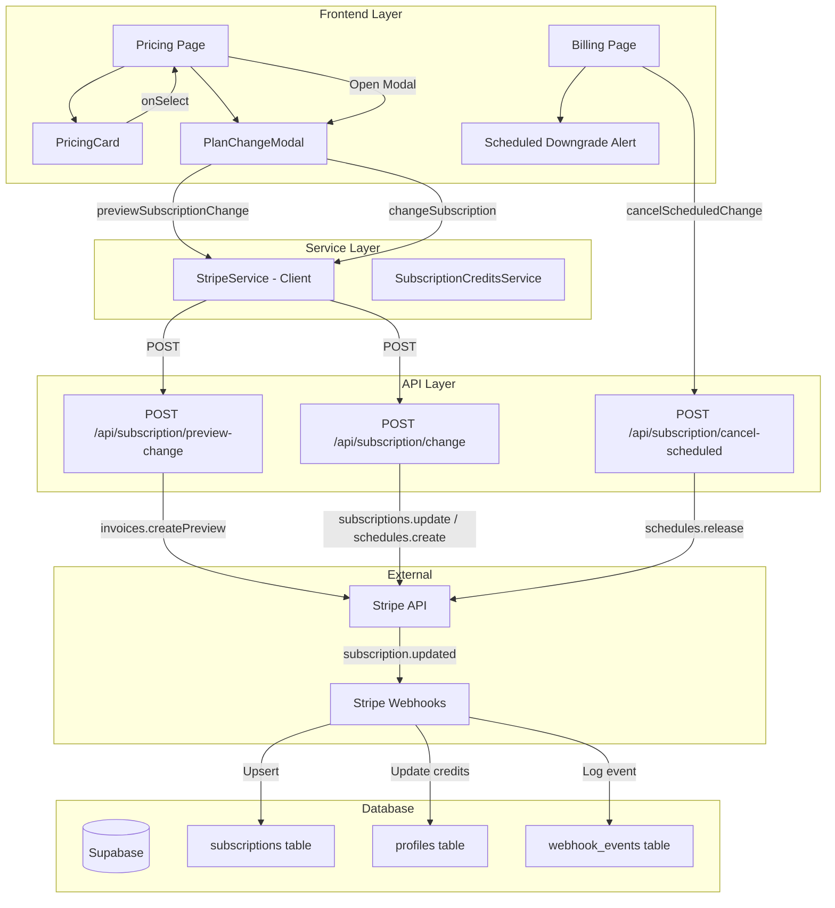
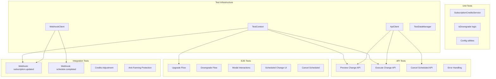

# PRD: Subscription Upgrade/Downgrade Flow - Testing Plan

**Date:** December 5, 2025
**Status:** Draft
**Author:** Principal Architect
**Priority:** High - Quality Assurance for Critical Revenue Feature

---

## 1. Context Analysis

### 1.1 Files Analyzed

```
/home/joao/projects/pixelperfect/app/api/subscription/change/route.ts
/home/joao/projects/pixelperfect/app/api/subscription/preview-change/route.ts
/home/joao/projects/pixelperfect/app/api/subscription/cancel-scheduled/route.ts
/home/joao/projects/pixelperfect/app/api/webhooks/stripe/route.ts
/home/joao/projects/pixelperfect/app/pricing/page.tsx
/home/joao/projects/pixelperfect/app/dashboard/billing/page.tsx
/home/joao/projects/pixelperfect/client/components/stripe/PricingCard.tsx
/home/joao/projects/pixelperfect/client/components/stripe/PlanChangeModal.tsx
/home/joao/projects/pixelperfect/client/services/stripeService.ts
/home/joao/projects/pixelperfect/shared/config/stripe.ts
/home/joao/projects/pixelperfect/shared/config/subscription.config.ts
/home/joao/projects/pixelperfect/server/services/SubscriptionCredits.ts
/home/joao/projects/pixelperfect/tests/api/subscription-change.test.ts
/home/joao/projects/pixelperfect/tests/e2e/billing.e2e.spec.ts
/home/joao/projects/pixelperfect/tests/helpers/test-context.ts
/home/joao/projects/pixelperfect/tests/helpers/api-client.ts
```

### 1.2 Component & Dependency Overview



### 1.3 Current Behavior Summary

**Upgrade Flow (Hobby → Pro → Business):**
- User clicks "Upgrade" on pricing card
- Modal opens with proration preview (immediate charge calculation)
- Upon confirmation, Stripe subscription updates immediately
- User is charged prorated amount
- Credits difference is added immediately (anti-farming protection in place)
- Database updates via webhook + direct API call

**Downgrade Flow (Business → Pro → Hobby):**
- User clicks "Downgrade" on pricing card
- Modal shows scheduled change (end of billing period)
- Stripe Subscription Schedule is created
- User keeps current plan benefits until period end
- No immediate refund or credit change
- Credits reset to new tier amount on schedule completion

**Cancellation of Scheduled Downgrade:**
- User can cancel a scheduled downgrade from pricing page
- Schedule is released via Stripe API
- Subscription continues at current tier

### 1.4 Problem Statement

The subscription upgrade/downgrade flow is a critical revenue feature with complex business logic involving proration, credits management, scheduled changes, and anti-farming protection. Comprehensive testing is required to ensure all paths work correctly and edge cases are handled gracefully.

---

## 2. Proposed Testing Solution

### 2.1 Testing Architecture Summary

- **Unit Tests**: Validate service-layer logic in isolation with mocked Stripe
- **API Tests**: Validate endpoint behavior, error handling, and response formats
- **E2E Tests**: Validate complete user journeys through the UI
- **Integration Tests**: Validate webhook processing and database state changes
- **Edge Case Coverage**: Explicit tests for anti-farming, concurrent modifications, and error recovery

**Testing Approach:**
| Layer | Tool | Focus |
|-------|------|-------|
| Unit | Vitest | SubscriptionCreditsService, config utilities |
| API | Playwright API | Endpoint validation, error codes, auth |
| E2E | Playwright | User flows, modal interactions, UI states |
| Integration | Playwright + TestContext | Webhook processing, DB state |

### 2.2 Test Architecture Diagram



### 2.3 Key Technical Decisions

| Decision | Choice | Justification |
|----------|--------|---------------|
| **Test Mode** | Use `ENV=test` with mock Stripe | Avoid real Stripe API calls in tests |
| **User Creation** | TestContext with subscription states | Consistent test user management |
| **API Testing** | ApiClient with fluent assertions | Clean, readable test assertions |
| **Webhook Testing** | WebhookClient with mock signatures | Test webhook handlers without real events |
| **Credits Validation** | Direct DB queries via TestDataManager | Verify actual database state changes |

---

## 3. Detailed Test Implementation Spec

### A. Unit Tests - `tests/unit/subscription-credits.unit.spec.ts`

**New File:**

```typescript
import { describe, it, expect } from 'vitest';
import { SubscriptionCreditsService } from '@server/services/SubscriptionCredits';

describe('SubscriptionCreditsService', () => {
  describe('calculateUpgradeCredits', () => {
    it('should add tier difference for legitimate upgrade', () => {
      const result = SubscriptionCreditsService.calculateUpgradeCredits({
        currentBalance: 100,
        previousTierCredits: 200,
        newTierCredits: 1000,
      });

      expect(result.creditsToAdd).toBe(800); // 1000 - 200
      expect(result.isLegitimate).toBe(true);
    });

    it('should block credits for suspected farming (excessive balance)', () => {
      const result = SubscriptionCreditsService.calculateUpgradeCredits({
        currentBalance: 500, // More than 1.5x previous tier
        previousTierCredits: 200,
        newTierCredits: 1000,
      });

      expect(result.creditsToAdd).toBe(0);
      expect(result.isLegitimate).toBe(false);
      expect(result.reason).toContain('farming');
    });

    it('should handle upgrade from no previous tier', () => {
      const result = SubscriptionCreditsService.calculateUpgradeCredits({
        currentBalance: 0,
        previousTierCredits: 0,
        newTierCredits: 200,
      });

      expect(result.creditsToAdd).toBe(200);
      expect(result.isLegitimate).toBe(true);
    });
  });
});
```

**Justification:** Unit tests for credit calculation ensure the anti-farming logic works correctly without requiring full integration.

---

### B. API Tests - `tests/api/subscription-change.api.spec.ts`

**Updated File:**

```typescript
import { test, expect } from '@playwright/test';
import { TestContext, ApiClient } from '../helpers';
import { STRIPE_PRICES } from '@shared/config/stripe';

test.describe('API: Subscription Change Flow', () => {
  let ctx: TestContext;

  test.beforeAll(async () => {
    ctx = new TestContext();
  });

  test.afterAll(async () => {
    await ctx.cleanup();
  });

  test.describe('POST /api/subscription/preview-change', () => {
    test('should return 401 for unauthenticated requests', async ({ request }) => {
      const api = new ApiClient(request);
      const response = await api.post('/api/subscription/preview-change', {
        targetPriceId: STRIPE_PRICES.PRO_MONTHLY,
      });

      response.expectStatus(401);
      await response.expectErrorCode('UNAUTHORIZED');
    });

    test('should return 400 for missing targetPriceId', async ({ request }) => {
      const user = await ctx.createUser({ subscription: 'active', tier: 'starter' });
      const api = new ApiClient(request).withAuth(user.token);

      const response = await api.post('/api/subscription/preview-change', {});

      response.expectStatus(400);
      await response.expectErrorCode('MISSING_PRICE_ID');
    });

    test('should return 400 for invalid targetPriceId', async ({ request }) => {
      const user = await ctx.createUser({ subscription: 'active', tier: 'starter' });
      const api = new ApiClient(request).withAuth(user.token);

      const response = await api.post('/api/subscription/preview-change', {
        targetPriceId: 'price_invalid_123',
      });

      response.expectStatus(400);
      await response.expectErrorCode('INVALID_PRICE_ID');
    });

    test('should return 400 for users without active subscription', async ({ request }) => {
      const user = await ctx.createUser({ subscription: 'free' });
      const api = new ApiClient(request).withAuth(user.token);

      const response = await api.post('/api/subscription/preview-change', {
        targetPriceId: STRIPE_PRICES.PRO_MONTHLY,
      });

      response.expectStatus(400);
      await response.expectErrorCode('NO_ACTIVE_SUBSCRIPTION');
    });

    test('should return 400 when targeting same plan', async ({ request }) => {
      const user = await ctx.createUser({ subscription: 'active', tier: 'pro' });
      const api = new ApiClient(request).withAuth(user.token);

      const response = await api.post('/api/subscription/preview-change', {
        targetPriceId: STRIPE_PRICES.PRO_MONTHLY,
      });

      response.expectStatus(400);
      await response.expectErrorCode('SAME_PLAN');
    });

    test('should return proration preview for valid upgrade (Hobby → Pro)', async ({ request }) => {
      const user = await ctx.createUser({ subscription: 'active', tier: 'starter' });
      const api = new ApiClient(request).withAuth(user.token);

      const response = await api.post('/api/subscription/preview-change', {
        targetPriceId: STRIPE_PRICES.PRO_MONTHLY,
      });

      response.expectStatus(200).expectSuccess();
      const data = await response.json();

      expect(data.data.is_downgrade).toBe(false);
      expect(data.data.effective_immediately).toBe(true);
      expect(data.data.current_plan).toBeDefined();
      expect(data.data.new_plan).toBeDefined();
      expect(data.data.new_plan.name).toBe('Professional');
    });

    test('should return scheduled change preview for downgrade (Pro → Hobby)', async ({ request }) => {
      const user = await ctx.createUser({ subscription: 'active', tier: 'pro' });
      const api = new ApiClient(request).withAuth(user.token);

      const response = await api.post('/api/subscription/preview-change', {
        targetPriceId: STRIPE_PRICES.HOBBY_MONTHLY,
      });

      response.expectStatus(200).expectSuccess();
      const data = await response.json();

      expect(data.data.is_downgrade).toBe(true);
      expect(data.data.effective_immediately).toBe(false);
      expect(data.data.effective_date).toBeDefined();
      expect(data.data.proration.amount_due).toBe(0); // No charge for downgrades
    });
  });

  test.describe('POST /api/subscription/change', () => {
    test('should return 401 for unauthenticated requests', async ({ request }) => {
      const api = new ApiClient(request);
      const response = await api.post('/api/subscription/change', {
        targetPriceId: STRIPE_PRICES.PRO_MONTHLY,
      });

      response.expectStatus(401);
      await response.expectErrorCode('UNAUTHORIZED');
    });

    test('should return 400 for missing targetPriceId', async ({ request }) => {
      const user = await ctx.createUser({ subscription: 'active', tier: 'starter' });
      const api = new ApiClient(request).withAuth(user.token);

      const response = await api.post('/api/subscription/change', {});

      response.expectStatus(400);
      await response.expectErrorCode('MISSING_PRICE_ID');
    });

    test('should return 400 for users without active subscription', async ({ request }) => {
      const user = await ctx.createUser({ subscription: 'free' });
      const api = new ApiClient(request).withAuth(user.token);

      const response = await api.post('/api/subscription/change', {
        targetPriceId: STRIPE_PRICES.PRO_MONTHLY,
      });

      response.expectStatus(400);
      await response.expectErrorCode('NO_ACTIVE_SUBSCRIPTION');
    });

    test('should return 400 when targeting same plan', async ({ request }) => {
      const user = await ctx.createUser({ subscription: 'active', tier: 'pro' });
      const api = new ApiClient(request).withAuth(user.token);

      const response = await api.post('/api/subscription/change', {
        targetPriceId: STRIPE_PRICES.PRO_MONTHLY,
      });

      response.expectStatus(400);
      await response.expectErrorCode('SAME_PLAN');
    });

    test('should execute immediate upgrade (Hobby → Pro)', async ({ request }) => {
      const user = await ctx.createUser({
        subscription: 'active',
        tier: 'starter',
        credits: 100,
      });
      const api = new ApiClient(request).withAuth(user.token);

      const response = await api.post('/api/subscription/change', {
        targetPriceId: STRIPE_PRICES.PRO_MONTHLY,
      });

      response.expectStatus(200).expectSuccess();
      const data = await response.json();

      expect(data.data.effective_immediately).toBe(true);
      expect(data.data.new_price_id).toBe(STRIPE_PRICES.PRO_MONTHLY);
    });

    test('should schedule downgrade (Pro → Hobby)', async ({ request }) => {
      const user = await ctx.createUser({
        subscription: 'active',
        tier: 'pro',
        credits: 500,
      });
      const api = new ApiClient(request).withAuth(user.token);

      const response = await api.post('/api/subscription/change', {
        targetPriceId: STRIPE_PRICES.HOBBY_MONTHLY,
      });

      response.expectStatus(200).expectSuccess();
      const data = await response.json();

      expect(data.data.effective_immediately).toBe(false);
      expect(data.data.status).toBe('scheduled');
      expect(data.data.schedule_id).toBeDefined();
      expect(data.data.scheduled_price_id).toBe(STRIPE_PRICES.HOBBY_MONTHLY);
      expect(data.data.effective_date).toBeDefined();
    });
  });

  test.describe('POST /api/subscription/cancel-scheduled', () => {
    test('should return 401 for unauthenticated requests', async ({ request }) => {
      const api = new ApiClient(request);
      const response = await api.post('/api/subscription/cancel-scheduled', {});

      response.expectStatus(401);
    });

    test('should return 400 if no scheduled change exists', async ({ request }) => {
      const user = await ctx.createUser({ subscription: 'active', tier: 'pro' });
      const api = new ApiClient(request).withAuth(user.token);

      const response = await api.post('/api/subscription/cancel-scheduled', {});

      response.expectStatus(400);
      await response.expectErrorCode('NO_SCHEDULED_CHANGE');
    });
  });
});
```

**Justification:** API tests validate all error codes, authentication, and business logic at the endpoint level without UI dependencies.

---

### C. E2E Tests - `tests/e2e/subscription-change.e2e.spec.ts`

**New File:**

```typescript
import { test, expect } from '@playwright/test';
import { PricingPage } from '../pages/PricingPage';
import { TestContext } from '../helpers';

test.describe('Subscription Change E2E Tests', () => {
  let ctx: TestContext;

  test.beforeAll(async () => {
    ctx = new TestContext();
  });

  test.afterAll(async () => {
    await ctx.cleanup();
  });

  test.describe('Plan Change Modal', () => {
    test('should show upgrade preview with proration details', async ({ page }) => {
      // Create user with Hobby subscription
      const user = await ctx.createUser({
        subscription: 'active',
        tier: 'starter',
        credits: 100,
      });

      // Login and navigate to pricing
      await loginAsUser(page, user);
      const pricingPage = new PricingPage(page);
      await pricingPage.goto();
      await pricingPage.waitForPageLoad();

      // Click Upgrade on Pro plan
      const proCard = page.locator('[data-testid="pricing-card-pro"]');
      await proCard.getByRole('button', { name: 'Upgrade' }).click();

      // Modal should open
      await expect(page.getByRole('dialog')).toBeVisible();
      await expect(page.getByText('Change Plan')).toBeVisible();

      // Should show current and new plan
      await expect(page.getByText('Hobby')).toBeVisible();
      await expect(page.getByText('Professional')).toBeVisible();

      // Should show "Immediately" for upgrade
      await expect(page.getByText('Immediately')).toBeVisible();

      // Should show confirm button
      await expect(page.getByRole('button', { name: 'Confirm Upgrade' })).toBeVisible();
    });

    test('should show downgrade preview with scheduled date', async ({ page }) => {
      // Create user with Pro subscription
      const user = await ctx.createUser({
        subscription: 'active',
        tier: 'pro',
        credits: 500,
      });

      await loginAsUser(page, user);
      const pricingPage = new PricingPage(page);
      await pricingPage.goto();
      await pricingPage.waitForPageLoad();

      // Click Downgrade on Hobby plan
      const hobbyCard = page.locator('[data-testid="pricing-card-hobby"]');
      await hobbyCard.getByRole('button', { name: 'Downgrade' }).click();

      // Modal should open
      await expect(page.getByRole('dialog')).toBeVisible();

      // Should show "Scheduled Downgrade" section
      await expect(page.getByText('Scheduled Downgrade')).toBeVisible();

      // Should show effective date
      await expect(page.getByText(/Your plan will change to/)).toBeVisible();

      // Should show schedule button
      await expect(page.getByRole('button', { name: 'Schedule Downgrade' })).toBeVisible();
    });

    test('should close modal on cancel', async ({ page }) => {
      const user = await ctx.createUser({
        subscription: 'active',
        tier: 'starter',
        credits: 100,
      });

      await loginAsUser(page, user);
      const pricingPage = new PricingPage(page);
      await pricingPage.goto();
      await pricingPage.waitForPageLoad();

      // Open modal
      const proCard = page.locator('[data-testid="pricing-card-pro"]');
      await proCard.getByRole('button', { name: 'Upgrade' }).click();
      await expect(page.getByRole('dialog')).toBeVisible();

      // Click cancel
      await page.getByRole('button', { name: 'Cancel' }).click();

      // Modal should close
      await expect(page.getByRole('dialog')).not.toBeVisible();
    });
  });

  test.describe('Current Plan Display', () => {
    test('should show Current Plan badge on active subscription', async ({ page }) => {
      const user = await ctx.createUser({
        subscription: 'active',
        tier: 'pro',
        credits: 500,
      });

      await loginAsUser(page, user);
      const pricingPage = new PricingPage(page);
      await pricingPage.goto();
      await pricingPage.waitForPageLoad();

      // Pro card should show "Current Plan" badge
      const proCard = page.locator('[data-testid="pricing-card-pro"]');
      await expect(proCard.getByText('Current Plan')).toBeVisible();

      // Button should be disabled
      const button = proCard.getByRole('button');
      await expect(button).toBeDisabled();
      await expect(button).toHaveText('Current Plan');
    });

    test('should show Upgrade/Downgrade text on other plans', async ({ page }) => {
      const user = await ctx.createUser({
        subscription: 'active',
        tier: 'pro',
        credits: 500,
      });

      await loginAsUser(page, user);
      const pricingPage = new PricingPage(page);
      await pricingPage.goto();
      await pricingPage.waitForPageLoad();

      // Hobby card should show "Downgrade"
      const hobbyCard = page.locator('[data-testid="pricing-card-hobby"]');
      await expect(hobbyCard.getByRole('button', { name: 'Downgrade' })).toBeVisible();

      // Business card should show "Upgrade"
      const businessCard = page.locator('[data-testid="pricing-card-business"]');
      await expect(businessCard.getByRole('button', { name: 'Upgrade' })).toBeVisible();
    });
  });

  test.describe('Scheduled Downgrade UI', () => {
    test('should show scheduled badge on pending downgrade', async ({ page }) => {
      // Create user with Pro subscription and scheduled downgrade to Hobby
      const user = await ctx.createUser({
        subscription: 'active',
        tier: 'pro',
        credits: 500,
      });

      // Schedule a downgrade via API
      await ctx.data.scheduleDowngrade(user.id, STRIPE_PRICES.HOBBY_MONTHLY);

      await loginAsUser(page, user);
      const pricingPage = new PricingPage(page);
      await pricingPage.goto();
      await pricingPage.waitForPageLoad();

      // Hobby card should show "Scheduled" badge
      const hobbyCard = page.locator('[data-testid="pricing-card-hobby"]');
      await expect(hobbyCard.getByText('Scheduled')).toBeVisible();

      // Should show "Cancel Scheduled Change" button
      await expect(hobbyCard.getByRole('button', { name: /Cancel Scheduled/i })).toBeVisible();
    });

    test('should show scheduled change banner', async ({ page }) => {
      const user = await ctx.createUser({
        subscription: 'active',
        tier: 'pro',
        credits: 500,
      });

      await ctx.data.scheduleDowngrade(user.id, STRIPE_PRICES.HOBBY_MONTHLY);

      await loginAsUser(page, user);
      const pricingPage = new PricingPage(page);
      await pricingPage.goto();
      await pricingPage.waitForPageLoad();

      // Should show scheduled change banner
      await expect(page.getByText('Scheduled Plan Change')).toBeVisible();
      await expect(page.getByText(/Professional → Hobby/)).toBeVisible();
    });
  });

  test.describe('Error Handling', () => {
    test('should handle network error gracefully', async ({ page }) => {
      const user = await ctx.createUser({
        subscription: 'active',
        tier: 'starter',
        credits: 100,
      });

      await loginAsUser(page, user);
      const pricingPage = new PricingPage(page);
      await pricingPage.goto();
      await pricingPage.waitForPageLoad();

      // Block API calls
      await page.route('/api/subscription/**', route => route.abort());

      // Try to open upgrade modal
      const proCard = page.locator('[data-testid="pricing-card-pro"]');
      await proCard.getByRole('button', { name: 'Upgrade' }).click();

      // Should show error in modal
      await expect(page.getByRole('dialog')).toBeVisible();
      await expect(page.getByText(/failed|error/i)).toBeVisible();
    });

    test('should handle loading states', async ({ page }) => {
      const user = await ctx.createUser({
        subscription: 'active',
        tier: 'starter',
        credits: 100,
      });

      await loginAsUser(page, user);
      const pricingPage = new PricingPage(page);
      await pricingPage.goto();
      await pricingPage.waitForPageLoad();

      // Slow down API response
      await page.route('/api/subscription/preview-change', async route => {
        await new Promise(resolve => setTimeout(resolve, 1000));
        await route.continue();
      });

      // Open modal
      const proCard = page.locator('[data-testid="pricing-card-pro"]');
      await proCard.getByRole('button', { name: 'Upgrade' }).click();

      // Should show loading state
      await expect(page.getByText(/Calculating/i)).toBeVisible();
    });
  });
});

// Helper function (would be in test helpers)
async function loginAsUser(page, user) {
  // Set auth token in storage/cookies for test user
  await page.goto('/');
  await page.evaluate((token) => {
    localStorage.setItem('supabase.auth.token', JSON.stringify({ access_token: token }));
  }, user.token);
}
```

**Justification:** E2E tests validate the complete user journey including modal interactions, UI state changes, and error handling.

---

### D. Integration Tests - `tests/integration/subscription-webhook.integration.spec.ts`

**New File:**

```typescript
import { test, expect } from '@playwright/test';
import { TestContext, ApiClient, WebhookClient } from '../helpers';
import { STRIPE_PRICES } from '@shared/config/stripe';

test.describe('Subscription Webhook Integration', () => {
  let ctx: TestContext;
  let webhookClient: WebhookClient;

  test.beforeAll(async () => {
    ctx = new TestContext();
    webhookClient = new WebhookClient();
  });

  test.afterAll(async () => {
    await ctx.cleanup();
  });

  test.describe('customer.subscription.updated webhook', () => {
    test('should add credits on upgrade (Hobby → Pro)', async ({ request }) => {
      const user = await ctx.createUser({
        subscription: 'active',
        tier: 'starter',
        credits: 100,
      });

      // Get initial credits
      const initialProfile = await ctx.data.getProfile(user.id);
      const initialCredits = initialProfile.credits_balance;

      // Send subscription.updated webhook simulating upgrade
      const webhookResponse = await webhookClient.sendSubscriptionUpdated(request, {
        subscriptionId: `sub_test_${user.id}`,
        customerId: initialProfile.stripe_customer_id,
        newPriceId: STRIPE_PRICES.PRO_MONTHLY,
        previousPriceId: STRIPE_PRICES.HOBBY_MONTHLY,
        status: 'active',
      });

      expect(webhookResponse.status).toBe(200);

      // Verify credits were added (Pro - Hobby = 800 credits)
      const updatedProfile = await ctx.data.getProfile(user.id);
      expect(updatedProfile.credits_balance).toBe(initialCredits + 800);
      expect(updatedProfile.subscription_tier).toBe('Professional');
    });

    test('should NOT add credits on downgrade (Pro → Hobby)', async ({ request }) => {
      const user = await ctx.createUser({
        subscription: 'active',
        tier: 'pro',
        credits: 500,
      });

      const initialProfile = await ctx.data.getProfile(user.id);
      const initialCredits = initialProfile.credits_balance;

      // Send subscription.updated webhook simulating downgrade
      const webhookResponse = await webhookClient.sendSubscriptionUpdated(request, {
        subscriptionId: `sub_test_${user.id}`,
        customerId: initialProfile.stripe_customer_id,
        newPriceId: STRIPE_PRICES.HOBBY_MONTHLY,
        previousPriceId: STRIPE_PRICES.PRO_MONTHLY,
        status: 'active',
      });

      expect(webhookResponse.status).toBe(200);

      // Verify credits were NOT changed
      const updatedProfile = await ctx.data.getProfile(user.id);
      expect(updatedProfile.credits_balance).toBe(initialCredits);
    });

    test('should block credits for suspected farming', async ({ request }) => {
      // User with excessive credits (farming attempt)
      const user = await ctx.createUser({
        subscription: 'active',
        tier: 'starter',
        credits: 500, // Way more than 1.5x Hobby tier (200 * 1.5 = 300)
      });

      const initialProfile = await ctx.data.getProfile(user.id);

      // Send upgrade webhook
      const webhookResponse = await webhookClient.sendSubscriptionUpdated(request, {
        subscriptionId: `sub_test_${user.id}`,
        customerId: initialProfile.stripe_customer_id,
        newPriceId: STRIPE_PRICES.PRO_MONTHLY,
        previousPriceId: STRIPE_PRICES.HOBBY_MONTHLY,
        status: 'active',
      });

      expect(webhookResponse.status).toBe(200);

      // Verify credits were NOT added due to anti-farming
      const updatedProfile = await ctx.data.getProfile(user.id);
      expect(updatedProfile.credits_balance).toBe(500); // Unchanged
    });
  });

  test.describe('subscription_schedule.completed webhook', () => {
    test('should reset credits to new tier on scheduled downgrade completion', async ({ request }) => {
      const user = await ctx.createUser({
        subscription: 'active',
        tier: 'pro',
        credits: 500,
      });

      // Schedule downgrade in DB
      await ctx.data.scheduleDowngrade(user.id, STRIPE_PRICES.HOBBY_MONTHLY);

      const initialProfile = await ctx.data.getProfile(user.id);

      // Send schedule.completed webhook
      const webhookResponse = await webhookClient.sendScheduleCompleted(request, {
        scheduleId: `sched_test_${user.id}`,
        subscriptionId: `sub_test_${user.id}`,
        customerId: initialProfile.stripe_customer_id,
      });

      expect(webhookResponse.status).toBe(200);

      // Verify credits were reset to Hobby tier (200)
      const updatedProfile = await ctx.data.getProfile(user.id);
      expect(updatedProfile.credits_balance).toBe(200); // Hobby tier credits
      expect(updatedProfile.subscription_tier).toBe('Hobby');
    });
  });

  test.describe('Idempotency', () => {
    test('should skip duplicate webhook events', async ({ request }) => {
      const user = await ctx.createUser({
        subscription: 'active',
        tier: 'starter',
        credits: 100,
      });

      const initialProfile = await ctx.data.getProfile(user.id);
      const eventId = `evt_test_duplicate_${Date.now()}`;

      // Send webhook first time
      const response1 = await webhookClient.sendSubscriptionUpdated(request, {
        eventId,
        subscriptionId: `sub_test_${user.id}`,
        customerId: initialProfile.stripe_customer_id,
        newPriceId: STRIPE_PRICES.PRO_MONTHLY,
        previousPriceId: STRIPE_PRICES.HOBBY_MONTHLY,
        status: 'active',
      });

      expect(response1.status).toBe(200);

      // Get credits after first webhook
      const profileAfterFirst = await ctx.data.getProfile(user.id);
      const creditsAfterFirst = profileAfterFirst.credits_balance;

      // Send same webhook again (duplicate)
      const response2 = await webhookClient.sendSubscriptionUpdated(request, {
        eventId, // Same event ID
        subscriptionId: `sub_test_${user.id}`,
        customerId: initialProfile.stripe_customer_id,
        newPriceId: STRIPE_PRICES.PRO_MONTHLY,
        previousPriceId: STRIPE_PRICES.HOBBY_MONTHLY,
        status: 'active',
      });

      expect(response2.status).toBe(200);
      const response2Data = await response2.json();
      expect(response2Data.skipped).toBe(true);

      // Verify credits were NOT doubled
      const profileAfterSecond = await ctx.data.getProfile(user.id);
      expect(profileAfterSecond.credits_balance).toBe(creditsAfterFirst);
    });
  });
});
```

**Justification:** Integration tests validate the webhook handlers process events correctly and update database state as expected.

---

## 4. Step-by-Step Execution Plan

### Phase 1: Unit Tests

- [ ] Create `tests/unit/subscription-credits.unit.spec.ts`
- [ ] Test `calculateUpgradeCredits` with various scenarios
- [ ] Test `isDowngrade` utility function
- [ ] Test `getExplanation` method
- [ ] Run: `yarn test:unit tests/unit/subscription-credits.unit.spec.ts`

### Phase 2: API Tests

- [ ] Update `tests/api/subscription-change.api.spec.ts` with new tests
- [ ] Add preview-change endpoint tests (all error codes)
- [ ] Add change endpoint tests (upgrade + downgrade)
- [ ] Add cancel-scheduled endpoint tests
- [ ] Run: `yarn test:api tests/api/subscription-change.api.spec.ts`

### Phase 3: E2E Tests

- [ ] Create `tests/e2e/subscription-change.e2e.spec.ts`
- [ ] Add data-testid attributes to PricingCard components
- [ ] Test modal open/close behavior
- [ ] Test upgrade preview display
- [ ] Test downgrade scheduled preview
- [ ] Test current plan badge display
- [ ] Test scheduled change UI
- [ ] Run: `yarn test:e2e tests/e2e/subscription-change.e2e.spec.ts`

### Phase 4: Integration Tests

- [ ] Create `tests/integration/subscription-webhook.integration.spec.ts`
- [ ] Create `WebhookClient` helper if not exists
- [ ] Test subscription.updated webhook for upgrades
- [ ] Test subscription.updated webhook for downgrades
- [ ] Test anti-farming protection
- [ ] Test schedule.completed webhook
- [ ] Test idempotency handling
- [ ] Run: `yarn test:integration tests/integration/subscription-webhook.integration.spec.ts`

### Phase 5: Test Infrastructure

- [ ] Add `scheduleDowngrade` method to TestDataManager
- [ ] Add WebhookClient helper for mock webhook sending
- [ ] Update PricingPage page object with modal helpers
- [ ] Ensure TestContext supports all subscription states

### Phase 6: CI Integration

- [ ] Add subscription tests to CI pipeline
- [ ] Configure test timeouts for webhook tests
- [ ] Add test coverage reporting for new files

---

## 5. Testing Strategy

### Unit Tests

**Functions to Cover:**
- `SubscriptionCreditsService.calculateUpgradeCredits()`
- `SubscriptionCreditsService.getExplanation()`
- `isDowngrade()` in both API routes
- `getPlanForPriceId()` edge cases

**Error Scenarios:**
- Invalid price IDs
- Missing plan configuration
- Edge cases in credit calculation

### API Tests

**Endpoints to Test:**
- `POST /api/subscription/preview-change`
- `POST /api/subscription/change`
- `POST /api/subscription/cancel-scheduled`

**Test Categories:**
- Authentication (401 responses)
- Validation (400 responses with error codes)
- Business logic (upgrade vs downgrade)
- Error handling (500 responses)

### E2E Tests

**User Flows:**
1. Subscribed user views pricing page → sees current plan badge
2. Subscribed user clicks upgrade → sees proration modal → confirms
3. Subscribed user clicks downgrade → sees scheduled modal → schedules
4. User with scheduled downgrade → cancels scheduled change
5. Error scenarios (network failure, timeout)

### Integration Tests

**Webhook Events:**
- `customer.subscription.updated` (upgrade)
- `customer.subscription.updated` (downgrade)
- `subscription_schedule.completed`

### Edge Cases

| Scenario | Expected Behavior |
|----------|-------------------|
| User clicks upgrade during webhook delay | API validates against Stripe, not local DB |
| User with excessive credits upgrades | Anti-farming blocks credit addition |
| User double-clicks confirm button | Button disabled after first click |
| Network failure during preview | Error shown in modal, retry available |
| Session expires mid-flow | Redirect to login, preserve intent |
| User with trialing subscription upgrades | Trial continues on new plan |
| Concurrent plan changes | 409 Conflict with clear message |
| Invalid price ID in request | 400 with INVALID_PRICE_ID code |
| Same plan selected | 400 with SAME_PLAN code |
| Duplicate webhook events | Skipped via idempotency check |

---

## 6. Acceptance Criteria

### API Tests
- [ ] All preview-change error codes return correct HTTP status
- [ ] All change error codes return correct HTTP status
- [ ] Upgrade returns `effective_immediately: true`
- [ ] Downgrade returns `effective_immediately: false` with `effective_date`
- [ ] Cancel-scheduled clears scheduled fields

### E2E Tests
- [ ] Modal opens with correct plan comparison
- [ ] Upgrade shows proration amount
- [ ] Downgrade shows scheduled date
- [ ] Current plan shows disabled badge
- [ ] Scheduled change shows banner
- [ ] Cancel scheduled change works
- [ ] Error states display correctly
- [ ] Loading states display correctly

### Integration Tests
- [ ] Upgrade webhook adds tier difference credits
- [ ] Downgrade webhook does NOT modify credits
- [ ] Anti-farming blocks excessive credit users
- [ ] Schedule completed resets credits to new tier
- [ ] Duplicate webhooks are skipped
- [ ] Idempotency table records events

### Coverage Targets
- [ ] Unit test coverage > 90% for SubscriptionCreditsService
- [ ] API tests cover all documented error codes
- [ ] E2E tests cover all user-visible states
- [ ] Integration tests cover all webhook event types

---

## 7. Verification & Rollback

### Success Criteria

**Test Metrics:**
- All tests pass in CI
- No flaky tests (< 1% failure rate)
- Test execution time < 5 minutes total
- Coverage thresholds met

**Manual Verification:**
- Run test suite locally: `yarn test`
- Run E2E suite: `yarn test:e2e`
- Verify no console errors in test output

### Rollback Plan

**If tests reveal bugs:**
1. Document bug in issue tracker with test failure details
2. Fix in isolation before merging
3. Re-run full test suite

**If tests are flaky:**
1. Add explicit waits where needed
2. Increase timeouts for network-dependent tests
3. Add retry logic for transient failures

### Maintenance

**Ongoing:**
- Update tests when API contracts change
- Add tests for new error codes
- Review and update edge case table quarterly
- Monitor test execution time trends

---

## Appendix: Test Data Requirements

### TestDataManager Extensions

```typescript
interface ITestDataManager {
  // Existing
  createTestUser(): Promise<ITestUser>;
  createTestUserWithSubscription(status, tier, credits): Promise<ITestUser>;

  // New methods needed
  scheduleDowngrade(userId: string, targetPriceId: string): Promise<void>;
  getSubscription(userId: string): Promise<ISubscription | null>;
  getProfile(userId: string): Promise<IUserProfile>;
  setCreditsBalance(userId: string, amount: number): Promise<void>;
}
```

### WebhookClient Helper

```typescript
class WebhookClient {
  sendSubscriptionUpdated(request, options: {
    eventId?: string;
    subscriptionId: string;
    customerId: string;
    newPriceId: string;
    previousPriceId: string;
    status: string;
  }): Promise<ApiResponse>;

  sendScheduleCompleted(request, options: {
    scheduleId: string;
    subscriptionId: string;
    customerId: string;
  }): Promise<ApiResponse>;
}
```

### PricingCard Test IDs

Add to `PricingCard.tsx`:
```tsx
<div data-testid={`pricing-card-${name.toLowerCase().replace(' ', '-')}`}>
```

Expected IDs:
- `pricing-card-hobby`
- `pricing-card-professional`
- `pricing-card-business`
