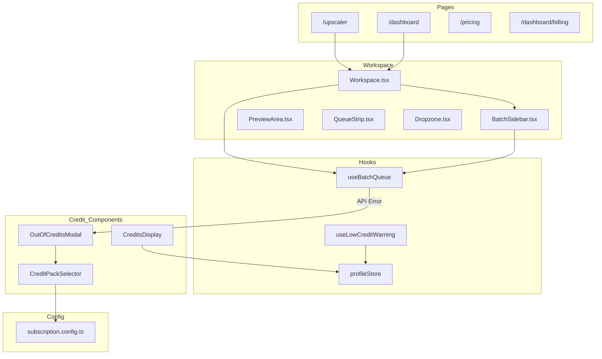
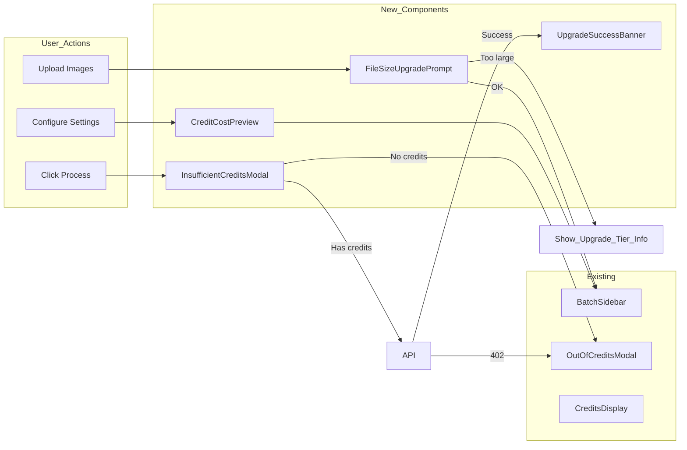
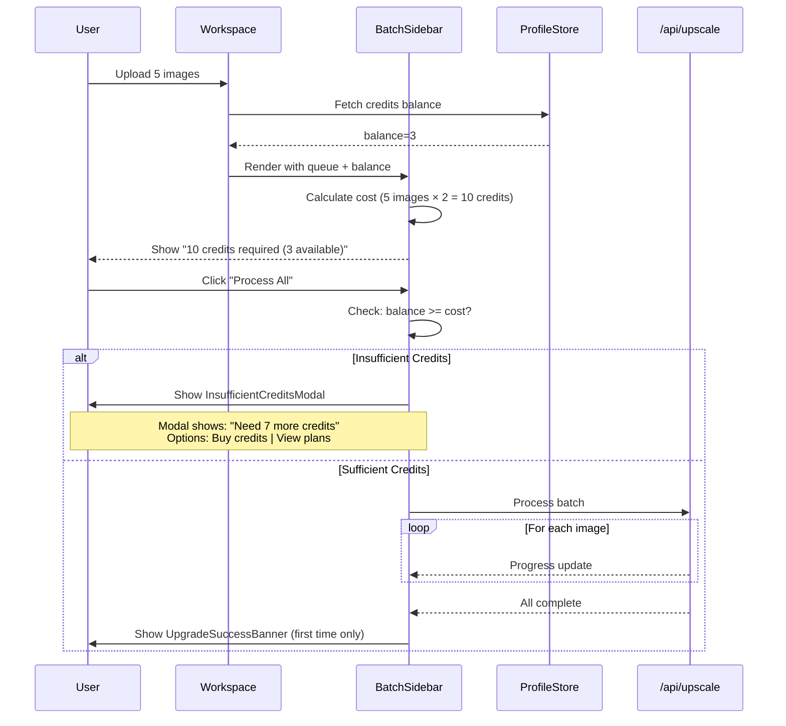

# Upgrade Prompts Strategy - Implementation Plan

## 1. Context Analysis

### 1.1 Files Analyzed

```
/home/joao/projects/pixelperfect/shared/config/subscription.config.ts
/home/joao/projects/pixelperfect/shared/config/subscription.types.ts
/home/joao/projects/pixelperfect/client/hooks/useLowCreditWarning.ts
/home/joao/projects/pixelperfect/client/components/stripe/OutOfCreditsModal.tsx
/home/joao/projects/pixelperfect/client/components/stripe/CreditsDisplay.tsx
/home/joao/projects/pixelperfect/client/components/stripe/CreditPackSelector.tsx
/home/joao/projects/pixelperfect/client/hooks/pixelperfect/useBatchQueue.ts
/home/joao/projects/pixelperfect/client/components/pixelperfect/Workspace/Workspace.tsx
/home/joao/projects/pixelperfect/client/components/pixelperfect/Workspace/BatchSidebar.tsx
/home/joao/projects/pixelperfect/app/upscaler/page.tsx
/home/joao/projects/pixelperfect/app/dashboard/page.tsx
/home/joao/projects/pixelperfect/app/pricing/page.tsx
/home/joao/projects/pixelperfect/app/dashboard/billing/page.tsx
```

### 1.2 Component & Dependency Overview



### 1.3 Current Behavior Summary

- **Low Credit Warning**: Toast notification when credits <= 5, checked every 5 minutes via `useLowCreditWarning`
- **Out of Credits Modal**: Shown reactively AFTER API returns 402 error, offers credit packs or subscription redirect
- **Credits Display**: Header component showing balance with tooltip for low/no credits linking to billing
- **No pre-processing validation**: User can queue 100 images, click "Process All", and get blocked mid-batch
- **File size gating**: 5MB free / 25MB paid limit enforced at API level, not proactively shown
- **No cost preview**: User has no idea how many credits batch will consume before clicking process
- **No post-success upsell**: After successful processing, no CTA to upgrade or continue

### 1.4 Problem Statement

Users hit upgrade friction points reactively (when operations fail) instead of proactively, leading to poor UX and missed conversion opportunities.

---

## 2. Proposed Solution

### 2.1 Architecture Summary

- **Proactive Credit Cost Preview**: Show estimated credits required in BatchSidebar before processing
- **Pre-Processing Credit Check**: Validate sufficient credits before starting batch, with clear upgrade CTA
- **Contextual Upgrade Banner**: Show tier benefits when relevant (e.g., file size limits)
- **Success Milestone Celebrations**: After first successful upscale, prompt upgrade with personalized messaging
- **Graceful Batch Interruption**: Stop batch cleanly when credits run out, offering to upgrade mid-process

**Alternatives Considered:**

- Full pricing modal in workspace: Rejected - too intrusive, breaks flow
- Auto-redirect to pricing: Rejected - disruptive UX
- Credit purchase inline: Rejected - complex Stripe integration in main workspace

### 2.2 Architecture Diagram (Mermaid)



### 2.3 Key Technical Decisions

| Decision              | Choice                           | Rationale                                 |
| --------------------- | -------------------------------- | ----------------------------------------- |
| Cost calculation      | Client-side from config          | Config is already shared, avoids API call |
| Credit check timing   | Before processing starts         | Prevents frustrating mid-batch failures   |
| Upgrade modal trigger | Threshold-based (credits < cost) | Clear, predictable behavior               |
| Success CTA           | Once per session                 | Not annoying, respects user               |
| File size check       | On drop, before queue            | Fast feedback, no wasted upload           |

### 2.4 Data Model Changes

**No Data Changes.** All functionality uses existing:

- `subscription_credits_balance` and `purchased_credits_balance` from profile
- `SUBSCRIPTION_CONFIG.creditCosts` for cost calculation
- `SUBSCRIPTION_CONFIG.freeUser` for file size limits

---

### 2.5 Runtime Execution Flow



---

## 3. Detailed Implementation Spec

### A. `client/components/pixelperfect/Workspace/CreditCostPreview.tsx` (NEW)

**Purpose:** Display estimated credit cost for current batch configuration.

**Props Interface:**

```typescript
interface ICreditCostPreviewProps {
  queueLength: number;
  mode: 'upscale' | 'enhance' | 'both' | 'custom';
  currentBalance: number;
}
```

**Pseudo-code:**

```typescript
export function CreditCostPreview({ queueLength, mode, currentBalance }: ICreditCostPreviewProps) {
  const costPerImage = getCreditCostForMode(mode); // From subscription.utils.ts
  const totalCost = queueLength * costPerImage;
  const hasEnough = currentBalance >= totalCost;
  const deficit = totalCost - currentBalance;

  return (
    <div className={hasEnough ? 'bg-green-50' : 'bg-amber-50'}>
      <div>Estimated cost: {totalCost} credits</div>
      <div>Your balance: {currentBalance} credits</div>
      {!hasEnough && (
        <div className="text-amber-600">
          Need {deficit} more credits
          <Link href="/pricing">Upgrade</Link>
        </div>
      )}
    </div>
  );
}
```

**Justification:** Users need cost transparency before committing to process. Reduces API errors and improves trust.

---

### B. `client/components/stripe/InsufficientCreditsModal.tsx` (NEW)

**Purpose:** Pre-processing modal when user clicks process but lacks credits.

**Props Interface:**

```typescript
interface IInsufficientCreditsModalProps {
  isOpen: boolean;
  onClose: () => void;
  requiredCredits: number;
  currentBalance: number;
  onBuyCredits: () => void;
  onViewPlans: () => void;
}
```

**Pseudo-code:**

```typescript
export function InsufficientCreditsModal({
  isOpen, onClose, requiredCredits, currentBalance, onBuyCredits, onViewPlans
}: IInsufficientCreditsModalProps) {
  const deficit = requiredCredits - currentBalance;

  return (
    <Modal isOpen={isOpen} onClose={onClose}>
      <AlertCircle className="text-amber-500" />
      <h2>Not Enough Credits</h2>
      <p>This batch requires {requiredCredits} credits. You have {currentBalance}.</p>

      <div className="grid grid-cols-2 gap-4">
        <Button onClick={onBuyCredits}>
          Buy {deficit}+ Credits
        </Button>
        <Button variant="secondary" onClick={onViewPlans}>
          View Plans (Save up to 58%)
        </Button>
      </div>

      <p className="text-sm">Or reduce batch size to {Math.floor(currentBalance / 2)} images</p>
    </Modal>
  );
}
```

**Justification:** Intercepts before API call, provides clear options, prevents frustrating 402 errors.

---

### C. `client/components/pixelperfect/Workspace/UpgradeSuccessBanner.tsx` (NEW)

**Purpose:** Post-success CTA shown once after first successful upscale.

**Props Interface:**

```typescript
interface IUpgradeSuccessBannerProps {
  processedCount: number;
  onDismiss: () => void;
  hasSubscription: boolean;
}
```

**Pseudo-code:**

```typescript
export function UpgradeSuccessBanner({ processedCount, onDismiss, hasSubscription }: IUpgradeSuccessBannerProps) {
  // Check if already shown this session
  const [dismissed, setDismissed] = useState(() =>
    sessionStorage.getItem('upgrade-banner-dismissed') === 'true'
  );

  if (dismissed || hasSubscription) return null;

  const handleDismiss = () => {
    sessionStorage.setItem('upgrade-banner-dismissed', 'true');
    setDismissed(true);
    onDismiss();
  };

  return (
    <div className="bg-gradient-to-r from-indigo-500 to-purple-600 text-white p-4 rounded-lg">
      <div className="flex justify-between">
        <div>
          <h3>Great work! {processedCount} images enhanced</h3>
          <p>Upgrade to Professional for 1000 credits/month</p>
        </div>
        <div className="flex gap-2">
          <Link href="/pricing" className="btn-white">See Plans</Link>
          <button onClick={handleDismiss}>Maybe later</button>
        </div>
      </div>
    </div>
  );
}
```

**Justification:** Capitalizes on positive moment (success) to suggest upgrade. Non-intrusive (dismissible, once per session).

---

### D. `client/components/pixelperfect/FileSizeUpgradePrompt.tsx` (NEW)

**Purpose:** Shown when free user drops file exceeding 5MB limit.

**Pseudo-code:**

```typescript
export function FileSizeUpgradePrompt({ fileSize, onDismiss }: IProps) {
  return (
    <div className="bg-amber-50 border border-amber-200 p-4 rounded-lg">
      <h3>File too large for free tier</h3>
      <p>Your file is {formatBytes(fileSize)}. Free tier supports up to 5MB.</p>
      <p className="font-semibold">Paid plans support files up to 25MB</p>
      <div className="flex gap-2 mt-4">
        <Link href="/pricing" className="btn-primary">Upgrade Now</Link>
        <button onClick={onDismiss} className="btn-outline">Use smaller file</button>
      </div>
    </div>
  );
}
```

**Justification:** Converts rejection moment into upgrade opportunity with clear value proposition.

---

### E. Modify `client/components/pixelperfect/Workspace/BatchSidebar.tsx`

**Changes Needed:**

1. Add `CreditCostPreview` component above process button
2. Add pre-processing credit check before calling `onProcess`
3. Show `InsufficientCreditsModal` when credits insufficient

**Modified Section (lines 220-236):**

```typescript
// Add imports
import { CreditCostPreview } from './CreditCostPreview';
import { InsufficientCreditsModal } from '@client/components/stripe/InsufficientCreditsModal';
import { useProfileStore } from '@client/store/profileStore';
import { getCreditCostForMode } from '@shared/config/subscription.utils';

// Inside component, add state and logic
const { profile } = useProfileStore();
const [showInsufficientModal, setShowInsufficientModal] = useState(false);

const creditBalance = (profile?.subscription_credits_balance ?? 0) +
                     (profile?.purchased_credits_balance ?? 0);
const costPerImage = getCreditCostForMode(config.mode);
const totalCost = queue.filter(i => i.status !== 'completed').length * costPerImage;
const hasEnoughCredits = creditBalance >= totalCost;

const handleProcessClick = () => {
  if (!hasEnoughCredits) {
    setShowInsufficientModal(true);
    return;
  }
  onProcess();
};

// In render, before Button:
<CreditCostPreview
  queueLength={queue.filter(i => i.status !== 'completed').length}
  mode={config.mode}
  currentBalance={creditBalance}
/>

// Modify Button onClick
<Button onClick={handleProcessClick} ...>

// Add modal at end
<InsufficientCreditsModal
  isOpen={showInsufficientModal}
  onClose={() => setShowInsufficientModal(false)}
  requiredCredits={totalCost}
  currentBalance={creditBalance}
  onBuyCredits={() => router.push('/dashboard/billing')}
  onViewPlans={() => router.push('/pricing')}
/>
```

**Justification:** Central location for batch processing, users see cost before committing.

---

### F. Modify `client/components/pixelperfect/Dropzone.tsx`

**Changes Needed:** Add file size validation with upgrade prompt for free users.

**Pseudo-code addition:**

```typescript
import { useProfileStore } from '@client/store/profileStore';
import { IMAGE_VALIDATION } from '@shared/validation/upscale.schema';

// In component
const { subscription } = useProfileStore();
const isPaidUser = !!subscription?.price_id;
const maxSize = isPaidUser ? IMAGE_VALIDATION.MAX_SIZE_PAID : IMAGE_VALIDATION.MAX_SIZE_FREE;

const handleDrop = (files: File[]) => {
  const oversizedFiles = files.filter(f => f.size > maxSize);
  if (oversizedFiles.length > 0 && !isPaidUser) {
    setShowSizeUpgradePrompt(true);
    setOversizedFile(oversizedFiles[0]);
    // Filter out oversized files
    const validFiles = files.filter(f => f.size <= maxSize);
    if (validFiles.length > 0) {
      onFilesSelected(validFiles);
    }
    return;
  }
  onFilesSelected(files);
};
```

**Justification:** Proactive feedback at point of friction, clear upgrade path.

---

### G. Add `shared/config/subscription.utils.ts` helper

**New Function:**

```typescript
/**
 * Get the credit cost for a processing mode
 */
export function getCreditCostForMode(mode: 'upscale' | 'enhance' | 'both' | 'custom'): number {
  const config = getSubscriptionConfig();
  return config.creditCosts.modes[mode] ?? config.creditCosts.minimumCost;
}

/**
 * Calculate total credits needed for a batch
 */
export function calculateBatchCost(
  imageCount: number,
  mode: 'upscale' | 'enhance' | 'both' | 'custom'
): number {
  return imageCount * getCreditCostForMode(mode);
}
```

**Justification:** Centralized cost calculation, reusable across components.

---

## 4. Step-by-Step Execution Plan

### Phase 1: Foundation (Utils & Config)

- [ ] Add `getCreditCostForMode()` and `calculateBatchCost()` to `subscription.utils.ts`
- [ ] Add `IMAGE_VALIDATION` export to shared validation if not already accessible
- [ ] Write unit tests for cost calculation functions

### Phase 2: Core Components

- [ ] Create `CreditCostPreview.tsx` component
- [ ] Create `InsufficientCreditsModal.tsx` component
- [ ] Create `FileSizeUpgradePrompt.tsx` component
- [ ] Create `UpgradeSuccessBanner.tsx` component

### Phase 3: Integration

- [ ] Modify `BatchSidebar.tsx` to include credit cost preview and pre-check
- [ ] Modify `Dropzone.tsx` to show file size upgrade prompt
- [ ] Modify `Workspace.tsx` to show success banner after first completion

### Phase 4: Polish & Testing

- [ ] Add E2E tests for upgrade prompt flows
- [ ] Verify mobile responsiveness of new modals/banners
- [ ] Run `yarn verify` to ensure no regressions

---

## 5. Testing Strategy

### Unit Tests

| Function                          | Test Cases |
| --------------------------------- | ---------- |
| `getCreditCostForMode('upscale')` | Returns 1  |
| `getCreditCostForMode('enhance')` | Returns 2  |
| `getCreditCostForMode('both')`    | Returns 2  |
| `calculateBatchCost(5, 'both')`   | Returns 10 |

### Integration Tests

- User with 5 credits tries to process 10 images (both mode) → InsufficientCreditsModal shown
- User with 20 credits processes 5 images → Success, UpgradeSuccessBanner shown
- Free user drops 6MB file → FileSizeUpgradePrompt shown
- Paid user drops 6MB file → File accepted normally

### Edge Cases

| Scenario                               | Expected Behavior        |
| -------------------------------------- | ------------------------ |
| Zero credits, zero queue               | No cost preview shown    |
| Mixed queue (some completed)           | Only count pending items |
| User dismisses banner, processes again | Banner stays dismissed   |
| User upgrades mid-session              | Banner no longer shows   |
| File exactly at limit (5MB)            | Accepted for free tier   |

---

## 6. Acceptance Criteria

- [ ] Credit cost preview shows accurate cost before processing
- [ ] InsufficientCreditsModal triggers when credits < required
- [ ] Modal offers both "Buy Credits" and "View Plans" options
- [ ] File size prompt shows for free users with files > 5MB
- [ ] Success banner appears once per session after first completion
- [ ] Success banner does not show for subscribed users
- [ ] All modals/banners are dismissible
- [ ] Mobile-responsive design maintained
- [ ] No regression in existing low credit warning toast
- [ ] `yarn verify` passes

---

## 7. Verification & Rollback

### Success Criteria

- **Conversion Impact**: Track clicks on upgrade CTAs (analytics event)
- **User Flow**: No increase in API 402 errors (proactive blocking works)
- **UX Quality**: No increase in rage clicks or rapid dismissals

### Rollback Plan

All new components are additive and isolated:

1. Remove imports from `BatchSidebar.tsx`, `Dropzone.tsx`, `Workspace.tsx`
2. Delete new component files
3. No database changes required

Feature flags can be added if gradual rollout desired:

```typescript
const SHOW_UPGRADE_PROMPTS = process.env.NEXT_PUBLIC_UPGRADE_PROMPTS_ENABLED === 'true';
```

---

## Summary: Key Upgrade Touchpoints

| Touchpoint               | Trigger                                 | Component                  | Priority |
| ------------------------ | --------------------------------------- | -------------------------- | -------- |
| **Pre-process check**    | Click process with insufficient credits | `InsufficientCreditsModal` | High     |
| **Cost preview**         | Batch queued                            | `CreditCostPreview`        | High     |
| **File size limit**      | Drop file > 5MB (free user)             | `FileSizeUpgradePrompt`    | Medium   |
| **Post-success upsell**  | First successful batch                  | `UpgradeSuccessBanner`     | Medium   |
| **Low credit toast**     | Credits <= 5 (existing)                 | `useLowCreditWarning`      | Existing |
| **Out of credits modal** | API 402 (existing)                      | `OutOfCreditsModal`        | Existing |
