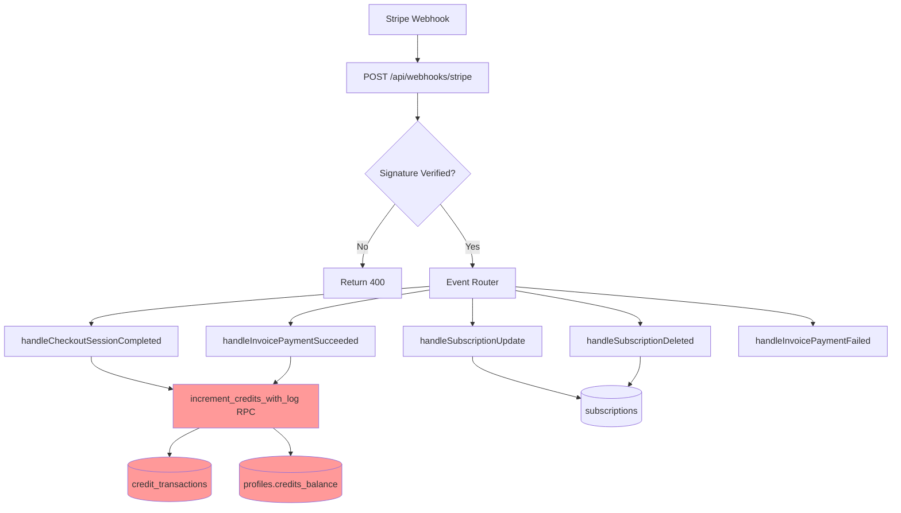
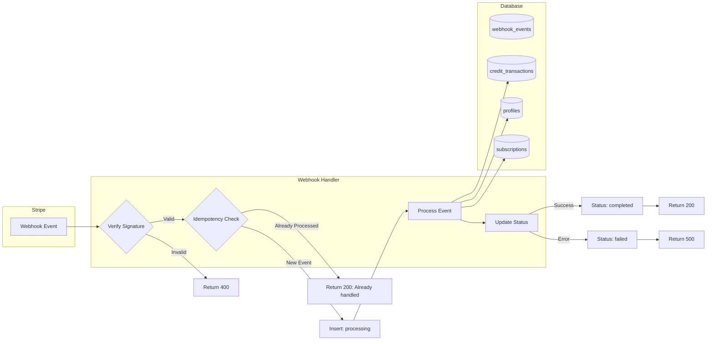
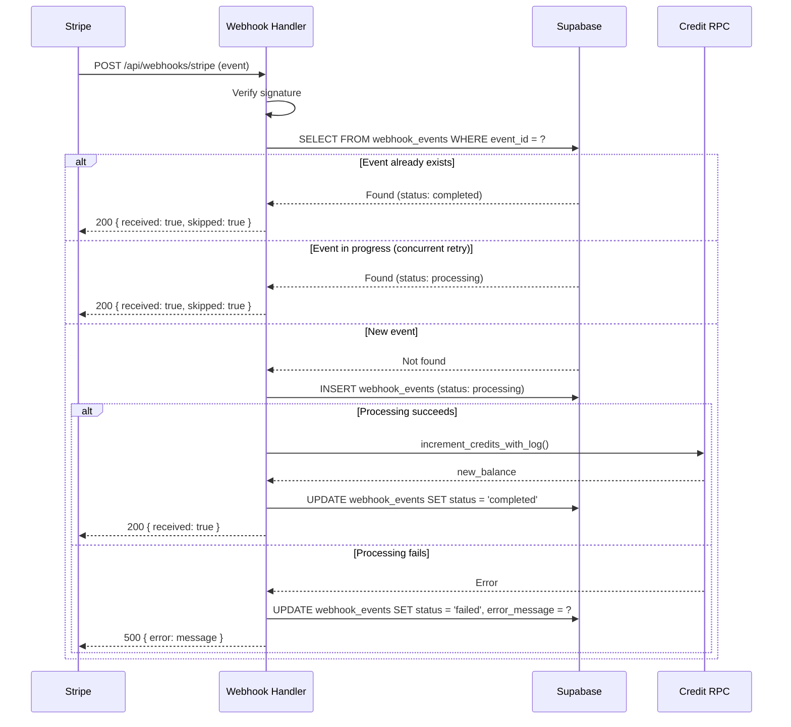

# Webhook Idempotency Implementation Plan

**Date:** December 2, 2025
**Priority:** MP-2 (High Effort, High Impact)
**Status:** Planning Complete
**Estimated Effort:** 1-2 days

---

## 1. Context Analysis

### 1.1 Files Analyzed

| Path | Purpose |
|------|---------|
| `/app/api/webhooks/stripe/route.ts` | Stripe webhook handler (main target) |
| `/supabase/migrations/20250121_create_credit_transactions_table.sql` | Credit transaction schema |
| `/supabase/migrations/20250121_enhanced_credit_functions.sql` | RPC functions for credit operations |
| `/supabase/migrations/20250221_secure_credits.sql` | Credit security hardening |
| `/shared/types/stripe.ts` | Type definitions |
| `/tests/helpers/stripe-webhook-mocks.ts` | Webhook test mocks |
| `/tests/api/webhooks.api.spec.ts` | Webhook integration tests |

### 1.2 Component & Dependency Overview



**Legend:** Red = Double-processing risk without idempotency

### 1.3 Current Behavior Summary

- Stripe sends webhooks with unique `event.id` (e.g., `evt_1abc...`)
- Webhook handler processes events in switch-case pattern
- Credit operations use `ref_id` field for logging but **do not check for duplicates**
- If Stripe retries a webhook (network timeout, 5xx response), credits are added again
- `credit_transactions.reference_id` has an index but **no unique constraint**
- Production risk: Double-crediting on Stripe retries (Stripe retries up to 8 times)

### 1.4 Problem Statement

The webhook system lacks idempotency protection, allowing duplicate event processing when Stripe retries webhooks, potentially causing double-crediting and data corruption.

---

## 2. Proposed Solution

### 2.1 Architecture Summary

- **Approach:** Pre-flight idempotency check using a dedicated `webhook_events` table
- **Pattern:** "Check-then-process" with atomic status transitions
- **Scope:** All webhook events that modify credits or subscriptions
- **Fallback:** Graceful skip for already-processed events (return 200 OK)

**Alternatives Considered:**

| Approach | Pros | Cons | Decision |
|----------|------|------|----------|
| **Dedicated table (chosen)** | Full audit trail, explicit status, queryable | Extra table, extra query | ✅ Chosen |
| Unique constraint on `credit_transactions.reference_id` | Simple, DB-enforced | Only protects credits, not subscription updates | ❌ Insufficient |
| Redis-based deduplication | Fast, no DB migration | Extra dependency, TTL complexity | ❌ Over-engineered |
| Stripe webhook idempotency key header | Zero code change | Not available for webhooks (only API calls) | ❌ Not applicable |

### 2.2 Architecture Diagram



### 2.3 Key Technical Decisions

| Decision | Rationale |
|----------|-----------|
| **Use `event.id` as primary key check** | Stripe guarantees uniqueness per event |
| **Insert before processing** | Prevents race conditions on concurrent retries |
| **Status enum: processing/completed/failed** | Enables retry differentiation and monitoring |
| **Store event metadata** | Enables debugging and audit |
| **Return 200 for duplicates** | Stripe interprets 200 as "handled" and stops retrying |
| **No TTL on events table** | Permanent audit trail for compliance |

### 2.4 Data Model Changes

**New Table: `webhook_events`**

```sql
CREATE TABLE public.webhook_events (
  id UUID PRIMARY KEY DEFAULT gen_random_uuid(),
  event_id TEXT UNIQUE NOT NULL,          -- Stripe event ID (evt_...)
  event_type TEXT NOT NULL,               -- e.g., 'invoice.payment_succeeded'
  status TEXT NOT NULL DEFAULT 'processing',  -- 'processing', 'completed', 'failed'
  payload JSONB,                          -- Full event payload for debugging
  error_message TEXT,                     -- Error details if failed
  processed_at TIMESTAMPTZ DEFAULT NOW(),
  completed_at TIMESTAMPTZ,               -- When processing finished
  created_at TIMESTAMPTZ DEFAULT NOW()
);

-- Constraint for valid status values
ALTER TABLE public.webhook_events
  ADD CONSTRAINT webhook_events_status_check
  CHECK (status IN ('processing', 'completed', 'failed'));

-- Index for quick lookups
CREATE INDEX idx_webhook_events_event_id ON public.webhook_events(event_id);
CREATE INDEX idx_webhook_events_status ON public.webhook_events(status);
CREATE INDEX idx_webhook_events_created_at ON public.webhook_events(created_at DESC);
```

**Type Definition:**

```typescript
interface IWebhookEvent {
  id: string;
  event_id: string;
  event_type: string;
  status: 'processing' | 'completed' | 'failed';
  payload: Record<string, unknown> | null;
  error_message: string | null;
  processed_at: string;
  completed_at: string | null;
  created_at: string;
}
```

---

## 2.5 Runtime Execution Flow



---

## 3. Detailed Implementation Spec

### A. `supabase/migrations/[timestamp]_create_webhook_events.sql`

**Purpose:** Create idempotency tracking table

```sql
-- Migration: Create webhook_events table for idempotency
-- Purpose: Track Stripe webhook events to prevent duplicate processing

-- Create the table
CREATE TABLE IF NOT EXISTS public.webhook_events (
  id UUID PRIMARY KEY DEFAULT gen_random_uuid(),
  event_id TEXT UNIQUE NOT NULL,
  event_type TEXT NOT NULL,
  status TEXT NOT NULL DEFAULT 'processing',
  payload JSONB,
  error_message TEXT,
  processed_at TIMESTAMPTZ DEFAULT NOW(),
  completed_at TIMESTAMPTZ,
  created_at TIMESTAMPTZ DEFAULT NOW(),

  CONSTRAINT webhook_events_status_check
    CHECK (status IN ('processing', 'completed', 'failed'))
);

-- Performance indexes
CREATE INDEX IF NOT EXISTS idx_webhook_events_event_id
  ON public.webhook_events(event_id);
CREATE INDEX IF NOT EXISTS idx_webhook_events_status
  ON public.webhook_events(status);
CREATE INDEX IF NOT EXISTS idx_webhook_events_created_at
  ON public.webhook_events(created_at DESC);
CREATE INDEX IF NOT EXISTS idx_webhook_events_event_type
  ON public.webhook_events(event_type);

-- RLS: Only service_role can access (webhooks run with service_role)
ALTER TABLE public.webhook_events ENABLE ROW LEVEL SECURITY;

-- No RLS policies = only service_role can access
-- This is intentional - webhooks use service_role key

-- Grant access to service_role only
GRANT SELECT, INSERT, UPDATE ON public.webhook_events TO service_role;

COMMENT ON TABLE public.webhook_events IS 'Tracks Stripe webhook events for idempotency';
COMMENT ON COLUMN public.webhook_events.event_id IS 'Stripe event ID (evt_...)';
COMMENT ON COLUMN public.webhook_events.status IS 'processing = in progress, completed = success, failed = error';
```

**Justification:**
- `UNIQUE` constraint on `event_id` enforces idempotency at DB level
- `JSONB` payload enables debugging without re-fetching from Stripe
- RLS with no policies = service_role only access (secure)
- Indexes optimize the pre-flight check query

---

### B. `shared/types/stripe.ts`

**Changes Needed:** Add webhook event type

```typescript
// Add to existing types
export interface IWebhookEvent {
  id: string;
  event_id: string;
  event_type: string;
  status: 'processing' | 'completed' | 'failed';
  payload: Record<string, unknown> | null;
  error_message: string | null;
  processed_at: string;
  completed_at: string | null;
  created_at: string;
}

export type WebhookEventStatus = 'processing' | 'completed' | 'failed';
```

**Justification:** Type safety for webhook event operations

---

### C. `app/api/webhooks/stripe/route.ts`

**Changes Needed:** Add idempotency check wrapper

**New Helper Functions:**

```typescript
// Add at top of file, after imports
import { createClient } from '@supabase/supabase-js';

// Idempotency check result
interface IdempotencyResult {
  isNew: boolean;
  existingStatus?: 'processing' | 'completed' | 'failed';
}

/**
 * Check if webhook event has already been processed
 * If new, atomically insert with 'processing' status
 */
async function checkAndClaimEvent(
  supabase: ReturnType<typeof createClient>,
  eventId: string,
  eventType: string,
  payload: unknown
): Promise<IdempotencyResult> {
  // First, check if event exists
  const { data: existing } = await supabase
    .from('webhook_events')
    .select('status')
    .eq('event_id', eventId)
    .single();

  if (existing) {
    console.log(`Webhook event ${eventId} already exists with status: ${existing.status}`);
    return { isNew: false, existingStatus: existing.status };
  }

  // Try to insert - may fail if concurrent request beat us
  const { error: insertError } = await supabase
    .from('webhook_events')
    .insert({
      event_id: eventId,
      event_type: eventType,
      status: 'processing',
      payload: payload as Record<string, unknown>,
    });

  if (insertError) {
    // Unique constraint violation = another request got there first
    if (insertError.code === '23505') {
      console.log(`Webhook event ${eventId} claimed by concurrent request`);
      return { isNew: false, existingStatus: 'processing' };
    }
    // Other error - let it bubble up
    throw insertError;
  }

  console.log(`Webhook event ${eventId} claimed for processing`);
  return { isNew: true };
}

/**
 * Mark webhook event as completed
 */
async function markEventCompleted(
  supabase: ReturnType<typeof createClient>,
  eventId: string
): Promise<void> {
  const { error } = await supabase
    .from('webhook_events')
    .update({
      status: 'completed',
      completed_at: new Date().toISOString(),
    })
    .eq('event_id', eventId);

  if (error) {
    console.error(`Failed to mark event ${eventId} as completed:`, error);
    // Don't throw - event was processed successfully
  }
}

/**
 * Mark webhook event as failed
 */
async function markEventFailed(
  supabase: ReturnType<typeof createClient>,
  eventId: string,
  errorMessage: string
): Promise<void> {
  const { error } = await supabase
    .from('webhook_events')
    .update({
      status: 'failed',
      error_message: errorMessage,
      completed_at: new Date().toISOString(),
    })
    .eq('event_id', eventId);

  if (error) {
    console.error(`Failed to mark event ${eventId} as failed:`, error);
  }
}
```

**Modified POST Handler:**

```typescript
export async function POST(request: NextRequest) {
  const body = await request.text();
  let event: Stripe.Event;

  // ... existing signature verification ...

  // NEW: Idempotency check
  const supabaseAdmin = createClient(
    serverEnv.NEXT_PUBLIC_SUPABASE_URL,
    serverEnv.SUPABASE_SERVICE_ROLE_KEY
  );

  const idempotencyResult = await checkAndClaimEvent(
    supabaseAdmin,
    event.id,
    event.type,
    event
  );

  if (!idempotencyResult.isNew) {
    console.log(`Skipping duplicate webhook: ${event.id} (${event.type})`);
    return NextResponse.json({
      received: true,
      skipped: true,
      reason: `Event already ${idempotencyResult.existingStatus}`,
    });
  }

  try {
    // ... existing event processing switch statement ...

    // After successful processing
    await markEventCompleted(supabaseAdmin, event.id);

    return NextResponse.json({ received: true });
  } catch (error) {
    const errorMessage = error instanceof Error ? error.message : 'Unknown error';
    await markEventFailed(supabaseAdmin, event.id, errorMessage);

    console.error('Webhook processing failed:', error);
    return NextResponse.json(
      { error: errorMessage },
      { status: 500 }
    );
  }
}
```

**Justification:**
- Pre-flight check prevents duplicate processing
- Atomic insert claims the event
- Unique constraint handles race conditions
- Status tracking enables monitoring and debugging
- Failed events can be retried by Stripe (return 500)

---

### D. `tests/api/webhooks-idempotency.api.spec.ts`

**New Test File:**

```typescript
import { describe, it, expect, beforeEach, afterEach } from 'vitest';
import { createTestClient } from '../helpers/supabase-test-client';
import { StripeWebhookMockFactory } from '../helpers/stripe-webhook-mocks';

describe('Webhook Idempotency', () => {
  const supabase = createTestClient();

  afterEach(async () => {
    // Clean up test events
    await supabase
      .from('webhook_events')
      .delete()
      .like('event_id', 'evt_test_%');
  });

  describe('duplicate event handling', () => {
    it('should process new event and return received: true', async () => {
      const event = StripeWebhookMockFactory.createInvoicePaymentSucceeded({
        userId: 'test-user-id',
      });

      const response = await callWebhook(event);

      expect(response.status).toBe(200);
      expect(response.body.received).toBe(true);
      expect(response.body.skipped).toBeUndefined();
    });

    it('should skip duplicate event and return skipped: true', async () => {
      const event = StripeWebhookMockFactory.createInvoicePaymentSucceeded({
        userId: 'test-user-id',
      });

      // First call
      await callWebhook(event);

      // Second call (duplicate)
      const response = await callWebhook(event);

      expect(response.status).toBe(200);
      expect(response.body.received).toBe(true);
      expect(response.body.skipped).toBe(true);
    });

    it('should track event status in webhook_events table', async () => {
      const event = StripeWebhookMockFactory.createCheckoutSessionCompleted({
        userId: 'test-user-id',
      });

      await callWebhook(event);

      const { data } = await supabase
        .from('webhook_events')
        .select('*')
        .eq('event_id', event.id)
        .single();

      expect(data).toBeDefined();
      expect(data.event_id).toBe(event.id);
      expect(data.event_type).toBe(event.type);
      expect(data.status).toBe('completed');
      expect(data.completed_at).not.toBeNull();
    });

    it('should not add credits twice for duplicate invoice events', async () => {
      const userId = 'test-user-id';

      // Get initial balance
      const { data: before } = await supabase
        .from('profiles')
        .select('credits_balance')
        .eq('id', userId)
        .single();

      const event = StripeWebhookMockFactory.createInvoicePaymentSucceeded({
        userId,
      });

      // Process twice
      await callWebhook(event);
      await callWebhook(event);

      // Check balance only increased once
      const { data: after } = await supabase
        .from('profiles')
        .select('credits_balance')
        .eq('id', userId)
        .single();

      const expectedIncrease = 1000; // PRO plan credits
      expect(after.credits_balance - before.credits_balance).toBe(expectedIncrease);
    });
  });

  describe('failed event handling', () => {
    it('should mark event as failed on processing error', async () => {
      const event = StripeWebhookMockFactory.createInvoicePaymentSucceeded({
        userId: 'non-existent-user-id',
      });

      const response = await callWebhook(event);

      expect(response.status).toBe(500);

      const { data } = await supabase
        .from('webhook_events')
        .select('*')
        .eq('event_id', event.id)
        .single();

      expect(data.status).toBe('failed');
      expect(data.error_message).toBeDefined();
    });
  });
});
```

**Justification:** Comprehensive test coverage for idempotency behavior

---

## 4. Step-by-Step Execution Plan

### Phase 1: Database Migration

- [ ] Create migration file `supabase/migrations/[timestamp]_create_webhook_events.sql`
- [ ] Add `IWebhookEvent` type to `shared/types/stripe.ts`
- [ ] Apply migration to development database
- [ ] Verify table created with correct schema

### Phase 2: Webhook Handler Updates

- [ ] Add idempotency helper functions to `app/api/webhooks/stripe/route.ts`
- [ ] Integrate `checkAndClaimEvent()` at start of POST handler
- [ ] Add `markEventCompleted()` call after successful processing
- [ ] Add `markEventFailed()` call in error handler
- [ ] Return `{ skipped: true }` for duplicate events

### Phase 3: Testing

- [ ] Create `tests/api/webhooks-idempotency.api.spec.ts`
- [ ] Test: New event processes successfully
- [ ] Test: Duplicate event is skipped
- [ ] Test: Event status tracked in database
- [ ] Test: Credits not doubled on duplicate
- [ ] Test: Failed events marked as failed
- [ ] Run full webhook test suite: `yarn test tests/api/webhooks`

### Phase 4: Verification

- [ ] Run `yarn verify` (build + lint + test)
- [ ] Manual test with Stripe CLI: `stripe trigger invoice.payment_succeeded`
- [ ] Verify event appears in `webhook_events` table
- [ ] Trigger same event again, verify skip behavior

---

## 5. Testing Strategy

### Unit Tests

| Function | Test Cases |
|----------|------------|
| `checkAndClaimEvent()` | New event returns `isNew: true` |
| `checkAndClaimEvent()` | Existing event returns `isNew: false` |
| `checkAndClaimEvent()` | Concurrent insert handles unique constraint |
| `markEventCompleted()` | Updates status to 'completed' |
| `markEventFailed()` | Updates status and error_message |

### Integration Tests

| Scenario | Expected Behavior |
|----------|-------------------|
| First webhook delivery | Process normally, return 200 |
| Stripe retry (duplicate) | Skip processing, return 200 |
| Concurrent retries | Only one processes, others skip |
| Processing error | Mark failed, return 500 |

### Edge Cases

| Scenario | Expected Behavior |
|----------|-------------------|
| Database unavailable during check | Return 500, Stripe will retry |
| Event claimed but status update fails | Event processed, status may lag |
| Very old event ID resubmitted | Still rejected (permanent storage) |
| Invalid event ID format | Normal processing (no special handling) |

---

## 6. Acceptance Criteria

- [ ] `webhook_events` table exists with correct schema
- [ ] All webhook events are logged to `webhook_events` table
- [ ] Duplicate events return 200 with `skipped: true`
- [ ] Credits are never added twice for the same event
- [ ] Failed events are marked with status and error message
- [ ] All existing webhook tests continue to pass
- [ ] New idempotency tests pass
- [ ] `yarn verify` passes

---

## 7. Verification & Rollback

### Success Criteria

| Metric | Target |
|--------|--------|
| Duplicate events processed | 0 (after deployment) |
| Webhook success rate | > 99.9% |
| Average latency increase | < 10ms (single DB query) |
| Events tracked in table | 100% of webhooks |

### Monitoring

```sql
-- Check for duplicate processing attempts
SELECT event_id, COUNT(*) as attempts
FROM webhook_events
GROUP BY event_id
HAVING COUNT(*) > 1;

-- Check failure rate
SELECT
  status,
  COUNT(*) as count,
  COUNT(*) * 100.0 / SUM(COUNT(*)) OVER () as percentage
FROM webhook_events
WHERE created_at > NOW() - INTERVAL '24 hours'
GROUP BY status;
```

### Rollback Plan

1. **Immediate:** Remove idempotency check from webhook handler (revert code changes)
2. **Database:** Keep `webhook_events` table (no harm, useful for audit)
3. **Verification:** Monitor credit transactions for duplicates
4. **Recovery:** If duplicates occurred, identify via `ref_id` matching and reverse

---

## Appendix: Stripe Retry Behavior

| Attempt | Delay |
|---------|-------|
| 1 | Immediate |
| 2 | 5 minutes |
| 3 | 30 minutes |
| 4 | 2 hours |
| 5 | 5 hours |
| 6 | 10 hours |
| 7 | 10 hours |
| 8 | 10 hours |

**Total window:** ~3 days

Without idempotency, a 5xx response on attempt 1 could result in 8 credit additions.
