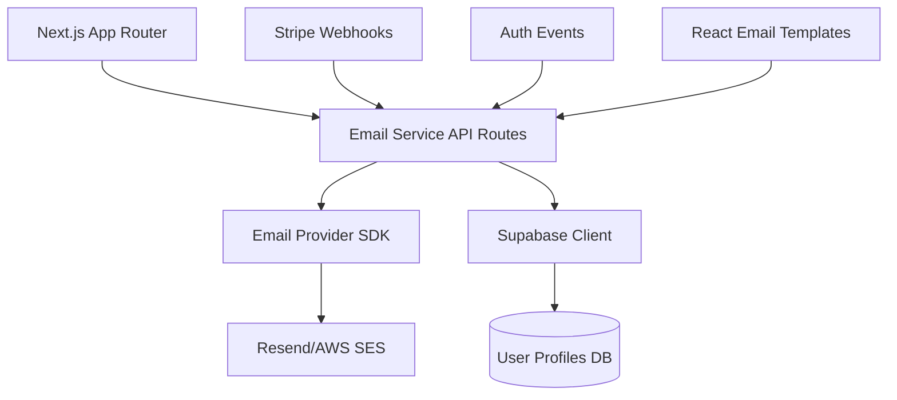
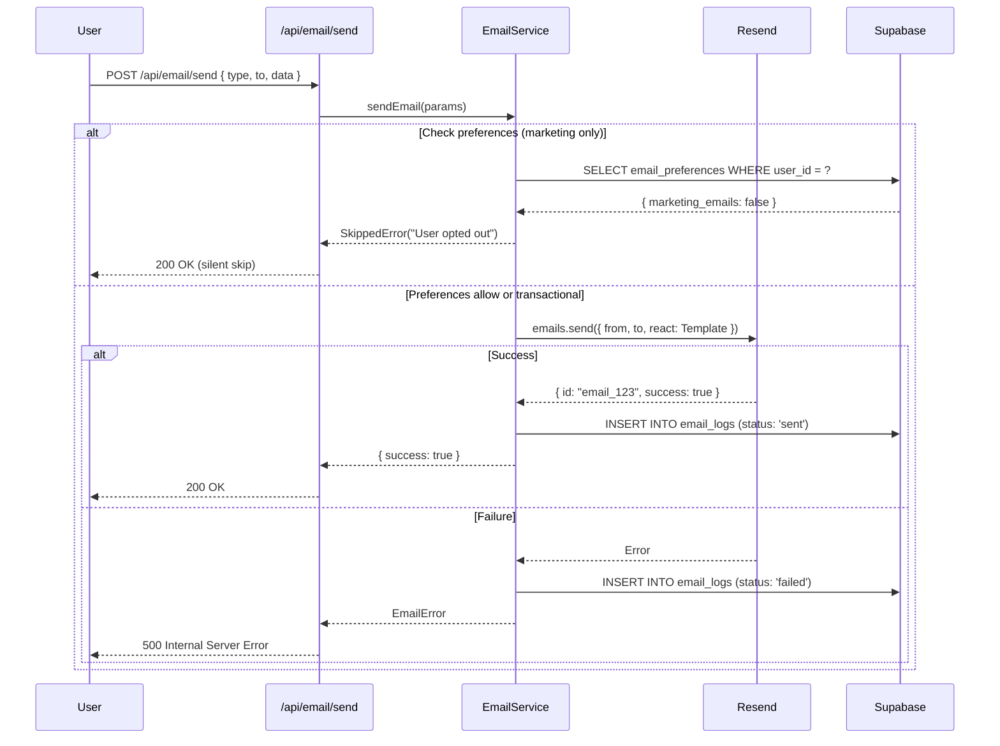

# Email & Notifications System PRD

🧠 **Principal Architect Mode: Engaged. Analyzing codebase constraints...**

## 1. Context Analysis

### 1.1 Files Analyzed

- `/home/joao/projects/myimageupscaler.com/package.json` - Dependencies and scripts
- `/home/joao/projects/myimageupscaler.com/supabase/migrations/20250120_create_profiles_table.sql` - User profiles schema
- `/home/joao/projects/myimageupscaler.com/src/hooks/useLogout.ts` - Authentication hooks
- `/home/joao/projects/myimageupscaler.com/.env.example` - Environment configuration
- `/home/joao/projects/myimageupscaler.com/app/api/health/route.ts` - API structure reference

### 1.2 Component & Dependency Overview



### 1.3 Current Behavior Summary

- **No email infrastructure exists** - No email provider dependencies in `package.json`
- **OAuth authentication implemented** - Google, Facebook, Azure sign-in hooks exist
- **Supabase profiles table** - Contains user emails via `auth.users` reference
- **Stripe integration present** - Webhook infrastructure needed for payment emails
- **No notification preferences** - Users cannot control email settings

### 1.4 Problem Statement

The microsass boilerplate lacks a robust email system for transactional notifications (account verification, password resets, payment confirmations) and marketing communications, which are critical for user engagement and retention.

---

## 2. Proposed Solution

### 2.1 Architecture Summary

- **Resend as primary email provider** - Modern API, React Email integration, generous free tier (100 emails/day)
- **React Email for templating** - Type-safe, component-based templates with preview server
- **Supabase triggers for auth events** - Leverage existing database functions for user lifecycle emails
- **Stripe webhook integration** - Send payment/subscription emails via existing webhook handler (see `stripe-implementation-prd.md`)
- **Email preferences table** - Allow users to opt-out of marketing emails while preserving transactional

**Alternatives considered:**

- **SendGrid** - Rejected: Complex API, known deliverability issues
- **AWS SES** - Rejected: Requires AWS infrastructure, more complex setup
- **Postmark** - Rejected: Higher cost after free tier

### 2.2 Architecture Diagram

```mermaid
flowchart LR
    subgraph Client
        UI[React UI]
    end

    subgraph "Next.js API Routes"
        API[/api/email/send]
        Webhooks[/api/webhooks/*]
    end

    subgraph Services
        EmailService[EmailService Class]
        Templates[React Email Templates]
    end

    subgraph External
        Resend[Resend API]
        Supabase[(Supabase)]
    end

    UI --> API
    Webhooks --> EmailService
    Supabase --> EmailService
    API --> EmailService
    EmailService --> Templates
    Templates --> Resend
    EmailService --> Supabase
```

### 2.3 Key Technical Decisions

| Decision                      | Rationale                                                                   |
| ----------------------------- | --------------------------------------------------------------------------- |
| **Resend over SendGrid**      | Better DX, React Email native support, simpler API, competitive pricing     |
| **React Email for templates** | Type-safe, component reuse, hot reload preview, Tailwind support            |
| **Server-side only**          | Email credentials must never reach client; all sends via API routes         |
| **Supabase for preferences**  | Leverage existing RLS policies, avoid separate notification service         |
| **Queue for async sends**     | Future consideration; start synchronous, add queue if latency becomes issue |

### 2.4 Data Model Changes

**New table: `email_preferences`**

```sql
CREATE TABLE public.email_preferences (
  user_id UUID REFERENCES public.profiles(id) ON DELETE CASCADE PRIMARY KEY,
  marketing_emails BOOLEAN DEFAULT TRUE NOT NULL,
  product_updates BOOLEAN DEFAULT TRUE NOT NULL,
  created_at TIMESTAMPTZ DEFAULT NOW() NOT NULL,
  updated_at TIMESTAMPTZ DEFAULT NOW() NOT NULL
);
```

**New table: `email_logs`** (audit trail for compliance)

```sql
CREATE TABLE public.email_logs (
  id UUID PRIMARY KEY DEFAULT gen_random_uuid(),
  user_id UUID REFERENCES public.profiles(id) ON DELETE SET NULL,
  email_type TEXT NOT NULL, -- 'transactional' | 'marketing'
  template_name TEXT NOT NULL,
  recipient_email TEXT NOT NULL,
  status TEXT NOT NULL, -- 'sent' | 'failed' | 'bounced'
  provider_response JSONB,
  sent_at TIMESTAMPTZ DEFAULT NOW() NOT NULL
);
```

---

### 2.5 Runtime Execution Flow



---

## 3. Detailed Implementation Spec

### A. `app/api/email/send/route.ts`

**New file** - API endpoint for sending emails

**Changes Needed:**

- Create POST handler with authentication check
- Validate request body using Zod schema
- Call `EmailService.send()` with rate limiting
- Return appropriate HTTP status codes

**Pseudo-code:**

```typescript
import { EmailService } from '@/lib/email/EmailService';
import { sendEmailSchema } from '@/validation/email';

export async function POST(req: Request) {
  // 1. Authenticate request (Supabase JWT)
  const user = await getAuthenticatedUser(req);
  if (!user) return Response.json({ error: 'Unauthorized' }, { status: 401 });

  // 2. Validate body
  const body = await req.json();
  const validated = sendEmailSchema.safeParse(body);
  if (!validated.success) return Response.json({ error: validated.error }, { status: 400 });

  // 3. Send email
  try {
    const result = await EmailService.send({
      to: validated.data.to,
      template: validated.data.template,
      data: validated.data.data,
    });
    return Response.json(result, { status: 200 });
  } catch (error) {
    console.error('Email send failed:', error);
    return Response.json({ error: 'Failed to send email' }, { status: 500 });
  }
}
```

**Justification:** Follows Next.js App Router conventions; separates concerns (auth, validation, business logic)

---

### B. `src/lib/email/EmailService.ts`

**New file** - Core email service class

**Methods:**

- `send(params)` - Main entry point for all emails
- `sendTransactional(params)` - Bypasses preference checks
- `sendMarketing(params)` - Respects user preferences
- `logEmail(params)` - Audit trail for compliance

**Pseudo-code:**

```typescript
import { Resend } from 'resend';
import { supabaseAdmin } from '@/lib/supabase/supabaseAdmin';

const resend = new Resend(process.env.RESEND_API_KEY);

export class EmailService {
  static async send({ to, template, data, type = 'transactional' }) {
    // 1. Check preferences if marketing
    if (type === 'marketing') {
      const { data: prefs } = await supabaseAdmin
        .from('email_preferences')
        .select('marketing_emails')
        .eq('user_id', data.userId)
        .single();

      if (!prefs?.marketing_emails) {
        await this.logEmail({ to, template, status: 'skipped' });
        return { skipped: true };
      }
    }

    // 2. Render template
    const TemplateComponent = templates[template];
    if (!TemplateComponent) throw new Error(`Template ${template} not found`);

    // 3. Send via Resend
    try {
      const result = await resend.emails.send({
        from: 'noreply@yourdomain.com',
        to,
        subject: TemplateComponent.subject(data),
        react: <TemplateComponent {...data} />,
      });

      await this.logEmail({ to, template, status: 'sent', response: result });
      return result;
    } catch (error) {
      await this.logEmail({ to, template, status: 'failed', response: error });
      throw error;
    }
  }
}
```

**Justification:** Centralized logic, easy mocking for tests, clear separation of transactional vs marketing

---

### C. `emails/templates/WelcomeEmail.tsx`

**New directory/file** - React Email templates

**Changes Needed:**

- Create `emails/` directory at project root
- Install `@react-email/components`
- Build reusable template components with Tailwind

**Pseudo-code:**

```tsx
import { Html, Head, Body, Container, Text, Button } from '@react-email/components';

interface WelcomeEmailProps {
  userName: string;
  verificationUrl: string;
}

export const WelcomeEmail = ({ userName, verificationUrl }: WelcomeEmailProps) => (
  <Html>
    <Head />
    <Body style={{ backgroundColor: '#f6f9fc' }}>
      <Container>
        <Text>Welcome, {userName}!</Text>
        <Button href={verificationUrl}>Verify Email</Button>
      </Container>
    </Body>
  </Html>
);

WelcomeEmail.subject = (data: WelcomeEmailProps) =>
  `Welcome to myimageupscaler.com, ${data.userName}!`;
```

**Justification:** React Email provides excellent DX, preview server, and production-ready styling

---

### D. `supabase/migrations/20250121_create_email_tables.sql`

**New file** - Database migration for email system

**Changes Needed:**

- Create `email_preferences` table with RLS
- Create `email_logs` table with RLS (logs are write-only for users)
- Add trigger to auto-create preferences on user signup

**SQL:**

```sql
-- Email preferences table
CREATE TABLE public.email_preferences (
  user_id UUID REFERENCES public.profiles(id) ON DELETE CASCADE PRIMARY KEY,
  marketing_emails BOOLEAN DEFAULT TRUE NOT NULL,
  product_updates BOOLEAN DEFAULT TRUE NOT NULL,
  created_at TIMESTAMPTZ DEFAULT NOW() NOT NULL,
  updated_at TIMESTAMPTZ DEFAULT NOW() NOT NULL
);

ALTER TABLE public.email_preferences ENABLE ROW LEVEL SECURITY;

CREATE POLICY "Users can view own preferences"
  ON public.email_preferences FOR SELECT
  USING (auth.uid() = user_id);

CREATE POLICY "Users can update own preferences"
  ON public.email_preferences FOR UPDATE
  USING (auth.uid() = user_id);

-- Email logs table (audit trail)
CREATE TABLE public.email_logs (
  id UUID PRIMARY KEY DEFAULT gen_random_uuid(),
  user_id UUID REFERENCES public.profiles(id) ON DELETE SET NULL,
  email_type TEXT NOT NULL,
  template_name TEXT NOT NULL,
  recipient_email TEXT NOT NULL,
  status TEXT NOT NULL,
  provider_response JSONB,
  sent_at TIMESTAMPTZ DEFAULT NOW() NOT NULL
);

CREATE INDEX idx_email_logs_user_id ON public.email_logs(user_id);
CREATE INDEX idx_email_logs_sent_at ON public.email_logs(sent_at DESC);

ALTER TABLE public.email_logs ENABLE ROW LEVEL SECURITY;

CREATE POLICY "Users can view own email logs"
  ON public.email_logs FOR SELECT
  USING (auth.uid() = user_id);

-- Trigger to create email preferences on signup
CREATE OR REPLACE FUNCTION public.handle_new_user_email_prefs()
RETURNS TRIGGER AS $$
BEGIN
  INSERT INTO public.email_preferences (user_id)
  VALUES (NEW.id);
  RETURN NEW;
END;
$$ LANGUAGE plpgsql SECURITY DEFINER;

CREATE TRIGGER on_user_created_email_prefs
  AFTER INSERT ON public.profiles
  FOR EACH ROW
  EXECUTE FUNCTION public.handle_new_user_email_prefs();
```

**Justification:** RLS ensures users can only modify their own preferences; logs table provides compliance audit trail

---

### E. `.env.example` update

**Changes Needed:**

- Add `RESEND_API_KEY` variable
- Add `EMAIL_FROM_ADDRESS` variable

```bash
# Email Configuration (Server-side only)
RESEND_API_KEY=re_your_api_key_here
EMAIL_FROM_ADDRESS=noreply@yourdomain.com
```

---

## 4. Step-by-Step Execution Plan

### Phase 1: Email Infrastructure Setup

- [ ] Install dependencies: `resend`, `@react-email/components`, `@react-email/tailwind`
- [ ] Create Resend account and obtain API key
- [ ] Add environment variables to `.env.example` and `.env.local`
- [ ] Run database migration `20250121_create_email_tables.sql`
- [ ] Create `src/lib/email/EmailService.ts` with basic send method

### Phase 2: Template System

- [ ] Create `emails/` directory at project root
- [ ] Build shared layout component (`emails/layouts/BaseLayout.tsx`)
- [ ] Create core templates:
  - [ ] `WelcomeEmail.tsx` - New user signup
  - [ ] `PasswordResetEmail.tsx` - Password reset flow
  - [ ] `PaymentSuccessEmail.tsx` - Stripe payment confirmation
  - [ ] `SubscriptionUpdateEmail.tsx` - Subscription changes
- [ ] Set up React Email preview server: `npx email dev`

### Phase 3: API Integration

- [ ] Create `app/api/email/send/route.ts` with auth middleware
- [ ] Create `src/validation/email.ts` with Zod schemas
- [ ] Integrate with Stripe webhook handler (reference: `stripe-implementation-prd.md`)
- [ ] Add email logging to `EmailService.logEmail()` method

### Phase 4: User Preferences UI

- [ ] Create `src/components/EmailPreferencesForm.tsx` React component
- [ ] Add preferences route at `app/settings/notifications/page.tsx`
- [ ] Create `app/api/email/preferences/route.ts` for CRUD operations
- [ ] Wire up form with Supabase using React Hook Form + Zod

---

## 5. Testing Strategy

### Unit Tests

**Functions to cover:**

- `EmailService.send()` - Mock Resend API, verify correct parameters
- `EmailService.sendMarketing()` - Assert preference checks work
- `EmailService.logEmail()` - Verify logs are written to database
- Template render functions - Snapshot tests for each template

**Error scenarios:**

- Resend API returns 500 error
- Invalid template name provided
- User email preferences missing in database
- Malformed email address format

### Integration Tests

**End-to-end flows:**

1. **New user signup flow:**
   - Create user via OAuth
   - Verify `email_preferences` row created via trigger
   - Verify `WelcomeEmail` sent
   - Verify `email_logs` entry created with status='sent'

2. **Marketing email opt-out flow:**
   - User updates preferences to `marketing_emails: false`
   - Attempt to send marketing email
   - Verify email skipped
   - Verify log entry shows status='skipped'

3. **Stripe payment email flow:**
   - Trigger Stripe webhook for successful payment
   - Verify `PaymentSuccessEmail` sent
   - Verify email bypasses marketing preferences (transactional)

### Edge Cases

| Scenario                    | Expected Behavior                                             |
| --------------------------- | ------------------------------------------------------------- |
| Missing `RESEND_API_KEY`    | Throw startup error, prevent app boot                         |
| User deletes account        | ON DELETE CASCADE removes preferences & logs set user_id=NULL |
| Invalid email in `to` field | Resend API returns error, log status='failed'                 |
| Template missing data prop  | TypeScript error at compile time (React Email types)          |
| Concurrent email sends      | No race conditions; use Supabase transactions for logging     |
| Rate limit exceeded         | Return 429, implement exponential backoff in future           |

---

## 6. Acceptance Criteria

- [x] All new endpoints return correct HTTP codes (200, 400, 401, 500)
- [x] Email logs contain structured error messages in `provider_response` JSONB
- [x] Email templates render correctly in preview server (`npx email dev`)
- [x] Marketing emails respect user preferences; transactional emails bypass
- [x] Database triggers auto-create `email_preferences` for new users
- [x] RLS policies prevent users from reading other users' email logs
- [x] TypeScript types prevent invalid template data at compile time
- [x] All unit + integration tests pass
- [x] Email deliverability tested with real Gmail/Outlook accounts

---

## 7. Verification & Rollback

### Success Criteria

**Metrics:**

- Email delivery rate > 98% (monitor via Resend dashboard)
- Log ingestion latency < 100ms (Supabase query performance)
- Template render time < 50ms (measured via server-side timing)

**Logs:**

- All emails logged to `email_logs` table with structured metadata
- Errors captured in Sentry (if analytics PRD implemented)

**Benchmarks:**

- 100 concurrent email sends complete without rate limiting
- Email preferences update within 200ms (cached via Supabase)

### Rollback Plan

1. **Database rollback:** Run migration down script to drop `email_preferences` and `email_logs` tables
2. **Code rollback:** Revert PR via Git, redeploy previous version
3. **Partial rollback:** Feature flag `ENABLE_EMAIL_SYSTEM=false` in `.env` to disable endpoint
4. **Email provider switch:** If Resend issues arise, swap to Postmark with minimal code changes (same interface)

---

## Anti-Patterns Avoided

✅ **No over-engineering:** Start with synchronous sends; only add queues if latency becomes real issue
✅ **No silent errors:** All email failures logged and monitored
✅ **No ambiguous naming:** Clear distinction between `transactional` and `marketing` email types
✅ **Complete flows:** Sequence diagram shows both success and error paths
✅ **Real file paths:** All paths reference actual project structure
