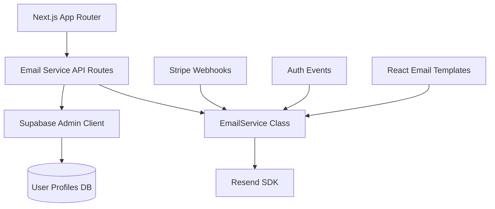
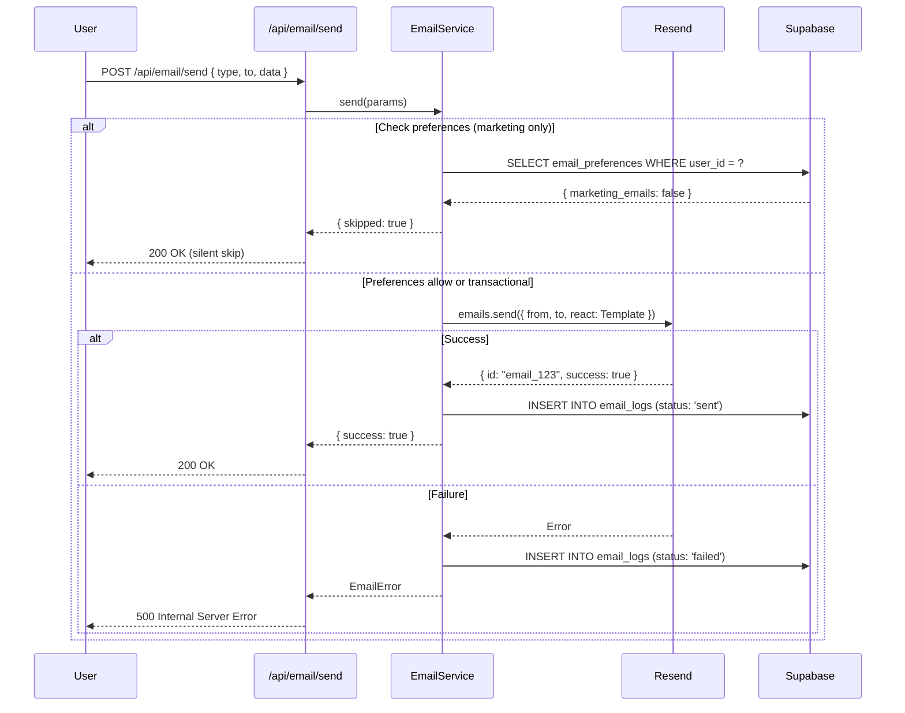

# Email & Notifications System PRD

**Planning Mode: Principal Architect**
**Complexity: 6 → MEDIUM mode**

## 1. Context Analysis

### 1.1 Files Analyzed

- `shared/config/env.ts` - Environment configuration patterns
- `server/services/replicate.service.ts` - Service class patterns
- `app/api/webhooks/stripe/route.ts` - Webhook handler patterns
- `shared/validation/upscale.schema.ts` - Zod validation patterns
- `supabase/migrations/*.sql` - Migration naming conventions

### 1.2 Component & Dependency Overview



### 1.3 Current Behavior Summary

- **No email infrastructure exists** - No email provider dependencies in `package.json`
- **OAuth authentication implemented** - Google, Azure sign-in hooks exist
- **Supabase profiles table** - Contains user emails via `auth.users` reference
- **Stripe webhook handlers exist** - `app/api/webhooks/stripe/handlers/` ready for email integration
- **No notification preferences** - Users cannot control email settings

### 1.4 Problem Statement

The application lacks a robust email system for transactional notifications (payment confirmations, subscription changes, low credit alerts) and user communications, which are critical for user engagement and retention.

---

## 2. Proposed Solution

### 2.1 Architecture Summary

- **Resend as primary email provider** - Modern API, React Email integration, generous free tier (100 emails/day)
- **React Email for templating** - Type-safe, component-based templates with preview server
- **Integration with existing Stripe webhooks** - Extend existing handlers to trigger emails
- **Email preferences table** - Allow users to opt-out of marketing emails while preserving transactional

**Alternatives considered:**

- **SendGrid** - Rejected: Complex API, known deliverability issues
- **AWS SES** - Rejected: Requires AWS infrastructure, more complex setup
- **Postmark** - Rejected: Higher cost after free tier

### 2.2 Architecture Diagram

```mermaid
flowchart LR
    subgraph Client
        UI[React UI]
    end

    subgraph "Next.js API Routes"
        API[/api/email/send]
        Webhooks[/api/webhooks/stripe]
    end

    subgraph Services
        EmailService[server/services/email.service.ts]
        Templates[emails/templates/*]
    end

    subgraph External
        Resend[Resend API]
        Supabase[(Supabase)]
    end

    UI --> API
    Webhooks --> EmailService
    Supabase --> EmailService
    API --> EmailService
    EmailService --> Templates
    Templates --> Resend
    EmailService --> Supabase
```

### 2.3 Key Technical Decisions

| Decision                      | Rationale                                                               |
| ----------------------------- | ----------------------------------------------------------------------- |
| **Resend over SendGrid**      | Better DX, React Email native support, simpler API                      |
| **React Email for templates** | Type-safe, component reuse, hot reload preview, Tailwind support        |
| **Server-side only**          | Email credentials must never reach client; all sends via API routes     |
| **Supabase for preferences**  | Leverage existing RLS policies, avoid separate notification service     |
| **Use serverEnv**             | Follow project pattern - never use `process.env` directly               |

### 2.4 Data Model Changes

**New table: `email_preferences`**

```sql
CREATE TABLE public.email_preferences (
  user_id UUID REFERENCES public.profiles(id) ON DELETE CASCADE PRIMARY KEY,
  marketing_emails BOOLEAN DEFAULT TRUE NOT NULL,
  product_updates BOOLEAN DEFAULT TRUE NOT NULL,
  low_credit_alerts BOOLEAN DEFAULT TRUE NOT NULL,
  created_at TIMESTAMPTZ DEFAULT NOW() NOT NULL,
  updated_at TIMESTAMPTZ DEFAULT NOW() NOT NULL
);
```

**New table: `email_logs`** (audit trail for compliance)

```sql
CREATE TABLE public.email_logs (
  id UUID PRIMARY KEY DEFAULT gen_random_uuid(),
  user_id UUID REFERENCES public.profiles(id) ON DELETE SET NULL,
  email_type TEXT NOT NULL, -- 'transactional' | 'marketing'
  template_name TEXT NOT NULL,
  recipient_email TEXT NOT NULL,
  status TEXT NOT NULL, -- 'sent' | 'failed' | 'skipped'
  provider_response JSONB,
  sent_at TIMESTAMPTZ DEFAULT NOW() NOT NULL
);
```

---

### 2.5 Runtime Execution Flow



---

## 3. Detailed Implementation Spec

### A. `shared/config/env.ts` (Update)

**Changes Needed:**

- Add `RESEND_API_KEY` to server env schema
- Add `EMAIL_FROM_ADDRESS` to server env schema

```typescript
// Add to serverEnvSchema
RESEND_API_KEY: z.string().default(''),
EMAIL_FROM_ADDRESS: z.string().email().default('noreply@myimageupscaler.com'),
```

**Justification:** Follows project pattern of centralized env config with Zod validation.

---

### B. `server/services/email.service.ts` (New File)

**Purpose:** Core email service class following project patterns

```typescript
import { Resend } from 'resend';
import { supabaseAdmin } from '@server/supabase/supabaseAdmin';
import { serverEnv } from '@shared/config/env';
import { logger } from '@server/monitoring/logger';

export type EmailType = 'transactional' | 'marketing';

export interface ISendEmailParams {
  to: string;
  template: string;
  data: Record<string, unknown>;
  type?: EmailType;
  userId?: string;
}

export interface ISendEmailResult {
  success: boolean;
  skipped?: boolean;
  messageId?: string;
  error?: string;
}

export class EmailError extends Error {
  public readonly code: string;

  constructor(message: string, code: string = 'EMAIL_ERROR') {
    super(message);
    this.name = 'EmailError';
    this.code = code;
  }
}

/**
 * Email service for sending transactional and marketing emails via Resend.
 * Follows project service patterns (see replicate.service.ts).
 */
export class EmailService {
  private resend: Resend;
  private fromAddress: string;

  constructor() {
    const apiKey = serverEnv.RESEND_API_KEY;
    if (!apiKey) {
      throw new Error('RESEND_API_KEY is not configured');
    }

    this.resend = new Resend(apiKey);
    this.fromAddress = serverEnv.EMAIL_FROM_ADDRESS;
  }

  /**
   * Send an email with optional preference checking for marketing emails.
   */
  async send(params: ISendEmailParams): Promise<ISendEmailResult> {
    const { to, template, data, type = 'transactional', userId } = params;

    // Check preferences for marketing emails
    if (type === 'marketing' && userId) {
      const shouldSkip = await this.checkShouldSkipMarketing(userId);
      if (shouldSkip) {
        await this.logEmail({ to, template, status: 'skipped', userId });
        return { success: true, skipped: true };
      }
    }

    try {
      const TemplateComponent = await this.getTemplate(template);
      const subject = this.getSubject(template, data);

      const result = await this.resend.emails.send({
        from: this.fromAddress,
        to,
        subject,
        react: TemplateComponent(data),
      });

      await this.logEmail({
        to,
        template,
        status: 'sent',
        userId,
        response: result,
      });

      return { success: true, messageId: result.data?.id };
    } catch (error) {
      const message = error instanceof Error ? error.message : 'Unknown error';

      await this.logEmail({
        to,
        template,
        status: 'failed',
        userId,
        response: { error: message },
      });

      logger.error('Email send failed', { template, error: message });
      throw new EmailError(`Failed to send email: ${message}`, 'SEND_FAILED');
    }
  }

  private async checkShouldSkipMarketing(userId: string): Promise<boolean> {
    const { data } = await supabaseAdmin
      .from('email_preferences')
      .select('marketing_emails')
      .eq('user_id', userId)
      .single();

    return data?.marketing_emails === false;
  }

  private async getTemplate(templateName: string) {
    // Dynamic import for templates
    const templates: Record<string, () => Promise<{ default: React.FC<any> }>> = {
      'welcome': () => import('@/emails/templates/WelcomeEmail'),
      'payment-success': () => import('@/emails/templates/PaymentSuccessEmail'),
      'subscription-update': () => import('@/emails/templates/SubscriptionUpdateEmail'),
      'low-credits': () => import('@/emails/templates/LowCreditsEmail'),
      'password-reset': () => import('@/emails/templates/PasswordResetEmail'),
    };

    const loader = templates[templateName];
    if (!loader) {
      throw new EmailError(`Template "${templateName}" not found`, 'TEMPLATE_NOT_FOUND');
    }

    const module = await loader();
    return module.default;
  }

  private getSubject(template: string, data: Record<string, unknown>): string {
    const subjects: Record<string, string | ((data: Record<string, unknown>) => string)> = {
      'welcome': 'Welcome to MyImageUpscaler!',
      'payment-success': (d) => `Payment confirmed - ${d.amount || 'Receipt'}`,
      'subscription-update': 'Your subscription has been updated',
      'low-credits': 'Running low on credits',
      'password-reset': 'Reset your password',
    };

    const subject = subjects[template];
    return typeof subject === 'function' ? subject(data) : subject || 'MyImageUpscaler Notification';
  }

  private async logEmail(params: {
    to: string;
    template: string;
    status: 'sent' | 'failed' | 'skipped';
    userId?: string;
    response?: unknown;
  }): Promise<void> {
    try {
      await supabaseAdmin.from('email_logs').insert({
        user_id: params.userId || null,
        email_type: 'transactional',
        template_name: params.template,
        recipient_email: params.to,
        status: params.status,
        provider_response: params.response ? JSON.stringify(params.response) : null,
      });
    } catch (error) {
      logger.error('Failed to log email', { error });
    }
  }
}

// Singleton instance
let emailServiceInstance: EmailService | null = null;

export function getEmailService(): EmailService {
  if (!emailServiceInstance) {
    emailServiceInstance = new EmailService();
  }
  return emailServiceInstance;
}
```

**Justification:** Follows project patterns (singleton factory, error classes, logger usage)

---

### C. `shared/validation/email.schema.ts` (New File)

**Purpose:** Zod validation schemas for email endpoints

```typescript
import { z } from 'zod';

export const sendEmailSchema = z.object({
  to: z.string().email('Invalid email address'),
  template: z.enum([
    'welcome',
    'payment-success',
    'subscription-update',
    'low-credits',
    'password-reset',
  ]),
  data: z.record(z.unknown()).default({}),
  type: z.enum(['transactional', 'marketing']).default('transactional'),
});

export type ISendEmailInput = z.infer<typeof sendEmailSchema>;

export const updatePreferencesSchema = z.object({
  marketing_emails: z.boolean().optional(),
  product_updates: z.boolean().optional(),
  low_credit_alerts: z.boolean().optional(),
});

export type IUpdatePreferencesInput = z.infer<typeof updatePreferencesSchema>;
```

**Justification:** Follows project validation patterns with Zod and `I` prefix for types

---

### D. `app/api/email/send/route.ts` (New File)

**Purpose:** API endpoint for sending emails (admin/internal use)

```typescript
import { NextRequest, NextResponse } from 'next/server';
import { getEmailService, EmailError } from '@server/services/email.service';
import { sendEmailSchema } from '@shared/validation/email.schema';
import { getAuthenticatedUser } from '@server/middleware/getAuthenticatedUser';
import { requireAdmin } from '@server/middleware/requireAdmin';

export async function POST(request: NextRequest): Promise<NextResponse> {
  try {
    // Only admins can send arbitrary emails
    const user = await getAuthenticatedUser(request);
    if (!user) {
      return NextResponse.json({ error: 'Unauthorized' }, { status: 401 });
    }

    const isAdmin = await requireAdmin(user.id);
    if (!isAdmin) {
      return NextResponse.json({ error: 'Forbidden' }, { status: 403 });
    }

    const body = await request.json();
    const validated = sendEmailSchema.safeParse(body);

    if (!validated.success) {
      return NextResponse.json(
        { error: 'Validation failed', details: validated.error.flatten() },
        { status: 400 }
      );
    }

    const emailService = getEmailService();
    const result = await emailService.send({
      to: validated.data.to,
      template: validated.data.template,
      data: validated.data.data,
      type: validated.data.type,
    });

    return NextResponse.json(result);
  } catch (error) {
    if (error instanceof EmailError) {
      return NextResponse.json(
        { error: error.message, code: error.code },
        { status: 500 }
      );
    }

    console.error('Email send error:', error);
    return NextResponse.json(
      { error: 'Failed to send email' },
      { status: 500 }
    );
  }
}
```

**Justification:** Follows project API route patterns with proper auth middleware

---

### E. `app/api/email/preferences/route.ts` (New File)

**Purpose:** CRUD for user email preferences

```typescript
import { NextRequest, NextResponse } from 'next/server';
import { supabaseAdmin } from '@server/supabase/supabaseAdmin';
import { getAuthenticatedUser } from '@server/middleware/getAuthenticatedUser';
import { updatePreferencesSchema } from '@shared/validation/email.schema';

export async function GET(request: NextRequest): Promise<NextResponse> {
  try {
    const user = await getAuthenticatedUser(request);
    if (!user) {
      return NextResponse.json({ error: 'Unauthorized' }, { status: 401 });
    }

    const { data, error } = await supabaseAdmin
      .from('email_preferences')
      .select('*')
      .eq('user_id', user.id)
      .single();

    if (error && error.code !== 'PGRST116') {
      throw error;
    }

    // Return defaults if no preferences exist
    return NextResponse.json(data || {
      marketing_emails: true,
      product_updates: true,
      low_credit_alerts: true,
    });
  } catch (error) {
    console.error('Get preferences error:', error);
    return NextResponse.json({ error: 'Failed to get preferences' }, { status: 500 });
  }
}

export async function PATCH(request: NextRequest): Promise<NextResponse> {
  try {
    const user = await getAuthenticatedUser(request);
    if (!user) {
      return NextResponse.json({ error: 'Unauthorized' }, { status: 401 });
    }

    const body = await request.json();
    const validated = updatePreferencesSchema.safeParse(body);

    if (!validated.success) {
      return NextResponse.json(
        { error: 'Validation failed', details: validated.error.flatten() },
        { status: 400 }
      );
    }

    const { data, error } = await supabaseAdmin
      .from('email_preferences')
      .upsert({
        user_id: user.id,
        ...validated.data,
        updated_at: new Date().toISOString(),
      })
      .select()
      .single();

    if (error) throw error;

    return NextResponse.json(data);
  } catch (error) {
    console.error('Update preferences error:', error);
    return NextResponse.json({ error: 'Failed to update preferences' }, { status: 500 });
  }
}
```

---

### F. `emails/templates/PaymentSuccessEmail.tsx` (New File)

**Purpose:** Payment confirmation email template

```tsx
import {
  Html,
  Head,
  Body,
  Container,
  Section,
  Text,
  Button,
  Hr,
  Img,
} from '@react-email/components';

interface IPaymentSuccessEmailProps {
  userName?: string;
  amount: string;
  planName?: string;
  credits?: number;
  receiptUrl?: string;
}

export default function PaymentSuccessEmail({
  userName = 'there',
  amount,
  planName,
  credits,
  receiptUrl,
}: IPaymentSuccessEmailProps) {
  return (
    <Html>
      <Head />
      <Body style={main}>
        <Container style={container}>
          <Section style={header}>
            <Text style={logo}>MyImageUpscaler</Text>
          </Section>

          <Section style={content}>
            <Text style={heading}>Payment Confirmed</Text>
            <Text style={paragraph}>Hi {userName},</Text>
            <Text style={paragraph}>
              Thank you for your payment of <strong>{amount}</strong>.
              {planName && ` Your ${planName} subscription is now active.`}
              {credits && ` ${credits} credits have been added to your account.`}
            </Text>

            {receiptUrl && (
              <Button href={receiptUrl} style={button}>
                View Receipt
              </Button>
            )}
          </Section>

          <Hr style={hr} />

          <Section style={footer}>
            <Text style={footerText}>
              Questions? Reply to this email or contact support@myimageupscaler.com
            </Text>
            <Text style={footerText}>
              &copy; {new Date().getFullYear()} MyImageUpscaler. All rights reserved.
            </Text>
          </Section>
        </Container>
      </Body>
    </Html>
  );
}

const main = {
  backgroundColor: '#f6f9fc',
  fontFamily: '-apple-system, BlinkMacSystemFont, "Segoe UI", Roboto, sans-serif',
};

const container = {
  maxWidth: '600px',
  margin: '0 auto',
  backgroundColor: '#ffffff',
};

const header = {
  backgroundColor: '#6366f1',
  padding: '24px',
  textAlign: 'center' as const,
};

const logo = {
  color: '#ffffff',
  fontSize: '24px',
  fontWeight: 'bold',
  margin: '0',
};

const content = {
  padding: '32px 24px',
};

const heading = {
  fontSize: '24px',
  fontWeight: 'bold',
  color: '#0f172a',
  marginBottom: '16px',
};

const paragraph = {
  fontSize: '16px',
  lineHeight: '24px',
  color: '#334155',
  marginBottom: '16px',
};

const button = {
  backgroundColor: '#6366f1',
  borderRadius: '8px',
  color: '#ffffff',
  fontSize: '16px',
  fontWeight: 'bold',
  textDecoration: 'none',
  padding: '12px 24px',
  display: 'inline-block',
};

const hr = {
  borderColor: '#e2e8f0',
  margin: '0',
};

const footer = {
  padding: '24px',
  textAlign: 'center' as const,
};

const footerText = {
  fontSize: '14px',
  color: '#64748b',
  margin: '4px 0',
};
```

---

### G. `supabase/migrations/20260115_create_email_tables.sql` (New File)

**Purpose:** Database migration for email system

```sql
-- Email preferences table
CREATE TABLE public.email_preferences (
  user_id UUID REFERENCES public.profiles(id) ON DELETE CASCADE PRIMARY KEY,
  marketing_emails BOOLEAN DEFAULT TRUE NOT NULL,
  product_updates BOOLEAN DEFAULT TRUE NOT NULL,
  low_credit_alerts BOOLEAN DEFAULT TRUE NOT NULL,
  created_at TIMESTAMPTZ DEFAULT NOW() NOT NULL,
  updated_at TIMESTAMPTZ DEFAULT NOW() NOT NULL
);

ALTER TABLE public.email_preferences ENABLE ROW LEVEL SECURITY;

CREATE POLICY "Users can view own preferences"
  ON public.email_preferences FOR SELECT
  USING (auth.uid() = user_id);

CREATE POLICY "Users can update own preferences"
  ON public.email_preferences FOR UPDATE
  USING (auth.uid() = user_id);

CREATE POLICY "Users can insert own preferences"
  ON public.email_preferences FOR INSERT
  WITH CHECK (auth.uid() = user_id);

-- Email logs table (audit trail)
CREATE TABLE public.email_logs (
  id UUID PRIMARY KEY DEFAULT gen_random_uuid(),
  user_id UUID REFERENCES public.profiles(id) ON DELETE SET NULL,
  email_type TEXT NOT NULL CHECK (email_type IN ('transactional', 'marketing')),
  template_name TEXT NOT NULL,
  recipient_email TEXT NOT NULL,
  status TEXT NOT NULL CHECK (status IN ('sent', 'failed', 'skipped')),
  provider_response JSONB,
  sent_at TIMESTAMPTZ DEFAULT NOW() NOT NULL
);

CREATE INDEX idx_email_logs_user_id ON public.email_logs(user_id);
CREATE INDEX idx_email_logs_sent_at ON public.email_logs(sent_at DESC);
CREATE INDEX idx_email_logs_template ON public.email_logs(template_name);

ALTER TABLE public.email_logs ENABLE ROW LEVEL SECURITY;

-- Users can only view their own email logs
CREATE POLICY "Users can view own email logs"
  ON public.email_logs FOR SELECT
  USING (auth.uid() = user_id);

-- Only service role can insert logs (via supabaseAdmin)
CREATE POLICY "Service role can insert logs"
  ON public.email_logs FOR INSERT
  WITH CHECK (true);

-- Trigger to auto-create email preferences on signup
CREATE OR REPLACE FUNCTION public.handle_new_user_email_prefs()
RETURNS TRIGGER AS $$
BEGIN
  INSERT INTO public.email_preferences (user_id)
  VALUES (NEW.id)
  ON CONFLICT (user_id) DO NOTHING;
  RETURN NEW;
END;
$$ LANGUAGE plpgsql SECURITY DEFINER;

CREATE TRIGGER on_user_created_email_prefs
  AFTER INSERT ON public.profiles
  FOR EACH ROW
  EXECUTE FUNCTION public.handle_new_user_email_prefs();
```

**Justification:** RLS ensures users can only modify their own preferences; follows project migration patterns

---

### H. Stripe Webhook Integration

**Update `app/api/webhooks/stripe/handlers/payment.handler.ts`:**

Add email sending after successful payments:

```typescript
// Add to handleCheckoutSessionCompleted method:
import { getEmailService } from '@server/services/email.service';

// After credit/subscription processing:
try {
  const emailService = getEmailService();
  await emailService.send({
    to: session.customer_email || '',
    template: 'payment-success',
    data: {
      userName: session.customer_details?.name || 'there',
      amount: `$${(session.amount_total || 0) / 100}`,
      planName: metadata.planName,
      credits: metadata.credits,
      receiptUrl: session.receipt_url,
    },
    userId: metadata.userId,
  });
} catch (emailError) {
  // Log but don't fail the webhook
  console.error('Failed to send payment email:', emailError);
}
```

---

## 4. Step-by-Step Execution Plan

### Phase 1: Infrastructure Setup

**Files (5):**
- `package.json` - Add dependencies
- `shared/config/env.ts` - Add env vars
- `server/services/email.service.ts` - Create service
- `shared/validation/email.schema.ts` - Create schemas
- `.env.api` - Add RESEND_API_KEY

**Implementation:**
- [ ] Install: `yarn add resend @react-email/components`
- [ ] Add `RESEND_API_KEY` and `EMAIL_FROM_ADDRESS` to serverEnv schema
- [ ] Create EmailService class following project patterns
- [ ] Create Zod validation schemas

**Tests Required:**
| Test File | Test Name | Assertion |
|-----------|-----------|-----------|
| `tests/unit/server/email.service.unit.spec.ts` | `should throw when RESEND_API_KEY missing` | `expect().toThrow('RESEND_API_KEY')` |
| `tests/unit/server/email.service.unit.spec.ts` | `should skip marketing when opted out` | `expect(result.skipped).toBe(true)` |

**User Verification:**
- Action: Run `yarn verify`
- Expected: Build succeeds, no TypeScript errors

---

### Phase 2: Database Schema

**Files (1):**
- `supabase/migrations/20260115_create_email_tables.sql`

**Implementation:**
- [ ] Create migration with email_preferences and email_logs tables
- [ ] Add RLS policies
- [ ] Add trigger for auto-creating preferences

**Tests Required:**
| Test File | Test Name | Assertion |
|-----------|-----------|-----------|
| `tests/api/email-preferences.api.spec.ts` | `should create preferences on profile insert` | `expect(prefs).toBeDefined()` |

**User Verification:**
- Action: Run `supabase db push` or apply migration
- Expected: Tables created with proper policies

---

### Phase 3: API Endpoints

**Files (2):**
- `app/api/email/send/route.ts`
- `app/api/email/preferences/route.ts`

**Implementation:**
- [ ] Create send endpoint (admin only)
- [ ] Create preferences CRUD endpoint

**Tests Required:**
| Test File | Test Name | Assertion |
|-----------|-----------|-----------|
| `tests/api/email-send.api.spec.ts` | `should reject non-admin users` | `expect(status).toBe(403)` |
| `tests/api/email-preferences.api.spec.ts` | `should update preferences` | `expect(data.marketing_emails).toBe(false)` |

**User Verification:**
- Action: Call `PATCH /api/email/preferences` with auth
- Expected: Returns updated preferences

---

### Phase 4: Email Templates

**Files (5):**
- `emails/templates/WelcomeEmail.tsx`
- `emails/templates/PaymentSuccessEmail.tsx`
- `emails/templates/SubscriptionUpdateEmail.tsx`
- `emails/templates/LowCreditsEmail.tsx`
- `emails/templates/PasswordResetEmail.tsx`

**Implementation:**
- [ ] Create emails directory at project root
- [ ] Build React Email templates with project branding
- [ ] Set up preview server: `npx email dev`

**Tests Required:**
| Test File | Test Name | Assertion |
|-----------|-----------|-----------|
| `tests/unit/emails/templates.unit.spec.ts` | `should render PaymentSuccessEmail` | Snapshot test |

**User Verification:**
- Action: Run `npx email dev`
- Expected: Preview server shows templates correctly

---

### Phase 5: Webhook Integration

**Files (2):**
- `app/api/webhooks/stripe/handlers/payment.handler.ts` (update)
- `app/api/webhooks/stripe/handlers/subscription.handler.ts` (update)

**Implementation:**
- [ ] Add email sending to payment success handler
- [ ] Add email sending to subscription update handler
- [ ] Handle email errors gracefully (log but don't fail webhook)

**Tests Required:**
| Test File | Test Name | Assertion |
|-----------|-----------|-----------|
| `tests/unit/api/stripe-webhooks.unit.spec.ts` | `should send email on successful payment` | `expect(emailService.send).toHaveBeenCalled()` |

**User Verification:**
- Action: Process test Stripe payment
- Expected: Payment email sent to customer

---

## 5. Testing Strategy

### Unit Tests

**Functions to cover:**
- `EmailService.send()` - Mock Resend API
- `EmailService.checkShouldSkipMarketing()` - Verify preference checks
- Template render functions - Snapshot tests

**Error scenarios:**
- Resend API returns 500 error
- Invalid template name provided
- User email preferences missing
- Malformed email address

### Integration Tests

**End-to-end flows:**
1. **New user signup** → email_preferences row created
2. **Successful payment** → PaymentSuccessEmail sent
3. **Opt-out flow** → Marketing emails skipped

### Edge Cases

| Scenario | Expected Behavior |
| -------- | ----------------- |
| Missing `RESEND_API_KEY` | Throw startup error |
| User deletes account | email_logs retain with user_id=NULL |
| Invalid email address | Resend returns error, logged as 'failed' |
| Rate limit exceeded | Return error, can retry |

---

## 6. Acceptance Criteria

- [ ] `yarn verify` passes
- [ ] All API endpoints return correct HTTP codes
- [ ] Email logs contain structured provider_response
- [ ] Marketing emails respect user preferences
- [ ] Transactional emails bypass preferences
- [ ] Database triggers auto-create email_preferences
- [ ] RLS policies prevent cross-user access
- [ ] TypeScript types use `I` prefix convention

---

## 7. Verification & Rollback

### Success Criteria

**Metrics:**
- Email delivery rate > 98% (monitor via Resend dashboard)
- Log ingestion latency < 100ms

### Rollback Plan

1. **Database rollback:** `DROP TABLE email_preferences, email_logs CASCADE`
2. **Code rollback:** Revert PR via Git
3. **Partial rollback:** Set `RESEND_API_KEY=''` to disable

---

## Anti-Patterns Avoided

- **No over-engineering:** Start synchronous, add queue if needed
- **No process.env:** Use `serverEnv` throughout
- **No silent errors:** All failures logged to email_logs
- **Clear naming:** `I` prefix for interfaces, descriptive error codes
- **Follows project patterns:** Service classes, singleton factories, Zod validation
