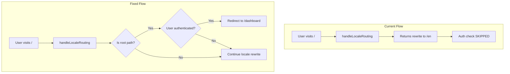
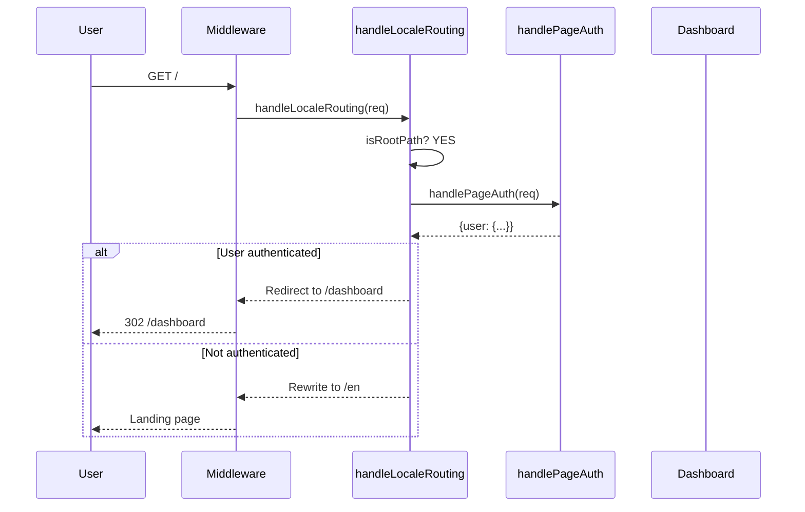

# PRD: Fix Landing Page Redirect & Default Quality Tier

**Complexity: 4 → MEDIUM mode**

---

## Pre-Planning Integration Points

**How will this feature be reached?**

- [x] Entry point identified: Middleware for landing redirect, Workspace component for quality tier
- [x] Caller file identified: `middleware.ts` → `handleLocaleRouting`, `Workspace.tsx` → `useState` for config
- [x] Registration/wiring needed: None - modifying existing code paths

**Is this user-facing?**

- [x] YES → No new UI components, but behavior changes are user-visible

**Full user flow:**

1. **Issue 1:** Logged-in user visits `/` → Should redirect to `/dashboard` (currently stays on landing)
2. **Issue 2:** Paid user opens Workspace → Quality tier should default to `budget-edit` (currently defaults to `auto`)

---

## 1. Context

**Problem:** Two UX bugs: (1) Logged-in users see landing page instead of dashboard, (2) Paid users default to expensive "auto" mode when they should default to "quick".

**Files Analyzed:**

- `/home/joao/projects/pixelperfect/middleware.ts` (lines 237-354, 490-536, 568-602)
- `/home/joao/projects/pixelperfect/lib/middleware/auth.ts` (lines 231-241)
- `/home/joao/projects/pixelperfect/shared/utils/supabase/middleware.ts`
- `/home/joao/projects/pixelperfect/client/components/features/workspace/Workspace.tsx` (lines 56-67)
- `/home/joao/projects/pixelperfect/client/components/features/workspace/BatchSidebar/QualityTierSelector.tsx` (lines 39-44)
- `/home/joao/projects/pixelperfect/shared/config/model-costs.config.ts` (lines 75-86)

**Current Behavior:**

1. **Landing Page Redirect (BUG):**
   - When logged-in user visits `/`, `handleLocaleRouting()` runs first
   - For English locale, it returns a rewrite to `/en` on line 305-307
   - This **early return bypasses** `handlePageRoute()` which contains the auth redirect logic (lines 519-536)
   - Result: Logged-in users see the landing page instead of being redirected to dashboard

2. **Auto Mode Default (BUG):**
   - `Workspace.tsx` hardcodes `qualityTier: 'auto'` as default (line 57)
   - `QualityTierSelector.tsx` only handles **free users** (redirects them to 'quick' on lines 40-44)
   - **Paid users** keep the 'auto' default, which costs 1-4 credits per image
   - User expects: Paid users should default to 'budget-edit' (1 credit) - explicit choice for premium features

---

## 2. Solution

**Approach:**

1. **Fix Landing Redirect:** Move auth check **before** locale routing in `handleLocaleRouting()`, or check auth state within the locale handler for root paths only
2. **Fix Default Quality Tier:** Change default from `'auto'` to `'budget-edit'` for paid users, `'quick'` for free users in Workspace.tsx

**Key Decisions:**

- [x] **Auth check placement:** Check auth inside `handleLocaleRouting` for root path only (less invasive than restructuring middleware flow)
- [x] **Default tier:** Use `'budget-edit'` for paid users, `'quick'` for free users - auto mode is opt-in for those who want AI selection
- [x] No database changes needed
- [x] No new dependencies

**Data Changes:** None

**Architecture Diagram:**

---

## 3. Sequence Flow

---

## 4. Execution Phases

### Phase 1: Fix Landing Page Redirect

**Files (2):**

- `middleware.ts` - Add auth check in `handleLocaleRouting` for root path

**Implementation:**

- [ ] Import `handlePageAuth` into the function scope or pass auth state
- [ ] Add auth check at the start of `handleLocaleRouting` specifically for root paths (`/` or `/{locale}`)
- [ ] If user is authenticated and visiting root, return redirect to `/dashboard` (preserving locale)
- [ ] Skip this check in test environment (consistent with existing pattern)

**Tests Required:**

| Test File                                       | Test Name                                                 | Assertion                                                                                                  |
| ----------------------------------------------- | --------------------------------------------------------- | ---------------------------------------------------------------------------------------------------------- |
| `__tests__/middleware/landing-redirect.test.ts` | `should redirect authenticated user from / to /dashboard` | `expect(response.status).toBe(307)` and `expect(response.headers.get('location')).toContain('/dashboard')` |
| `__tests__/middleware/landing-redirect.test.ts` | `should allow unauthenticated user to view landing page`  | `expect(response.status).toBe(200)`                                                                        |
| `__tests__/middleware/landing-redirect.test.ts` | `should preserve locale in dashboard redirect`            | `expect(location).toBe('/pt/dashboard')` for Portuguese user                                               |

**User Verification:**

- Action: Log in, then navigate to `https://myimageupscaler.com/`
- Expected: Automatically redirected to `/dashboard`

---

### Phase 2: Fix Default Quality Tier

**Files (2):**

- `client/components/features/workspace/Workspace.tsx` - Change default from `'auto'` to `'budget-edit'` for paid users
- `client/components/features/workspace/BatchSidebar/QualityTierSelector.tsx` - Update free tier redirect to use 'quick'

**Implementation:**

- [ ] Change line 57 from `qualityTier: 'auto'` to `qualityTier: 'budget-edit'`
- [ ] Update `QualityTierSelector.tsx` to redirect free users to 'quick' (lines 40-44) - keep existing behavior
- [ ] Ensure the component checks user subscription status before applying 'budget-edit' default

**Tests Required:**

| Test File                                 | Test Name                                                   | Assertion                                        |
| ----------------------------------------- | ----------------------------------------------------------- | ------------------------------------------------ |
| `__tests__/components/Workspace.test.tsx` | `should default to budget-edit quality tier for paid users` | `expect(config.qualityTier).toBe('budget-edit')` |
| `__tests__/components/Workspace.test.tsx` | `should default to quick quality tier for free users`       | `expect(config.qualityTier).toBe('quick')`       |
| `e2e/workspace.spec.ts`                   | `should show budget-edit tier as default for paid users`    | `expect(tierSelector).toHaveText('Budget Edit')` |

**User Verification:**

- Action: Log in as paid user, navigate to dashboard
- Expected: Quality tier selector shows "Budget Edit" as default, not "Auto-Optimize"

---

## 5. Acceptance Criteria

- [ ] Authenticated users visiting `/` are redirected to `/dashboard`
- [ ] Authenticated users visiting `/{locale}` are redirected to `/{locale}/dashboard`
- [ ] Unauthenticated users can still view the landing page
- [ ] New workspace sessions default to "Budget Edit" quality tier for paid users
- [ ] New workspace sessions default to "Quick" quality tier for free users
- [ ] Free users can still only access "Quick" and "Face Restore" tiers (existing behavior preserved)
- [ ] `yarn verify` passes
- [ ] All specified tests pass
- [ ] No breaking changes to existing auth flows

---

## 6. Out of Scope

- Persisting user's preferred quality tier (future enhancement)
- Changing the quality tier options themselves
- Modifying pricing or credit costs
- Any changes to the dashboard layout or content
