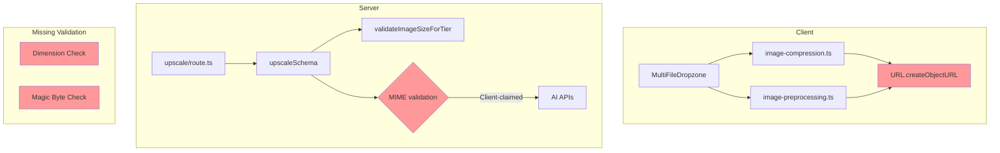
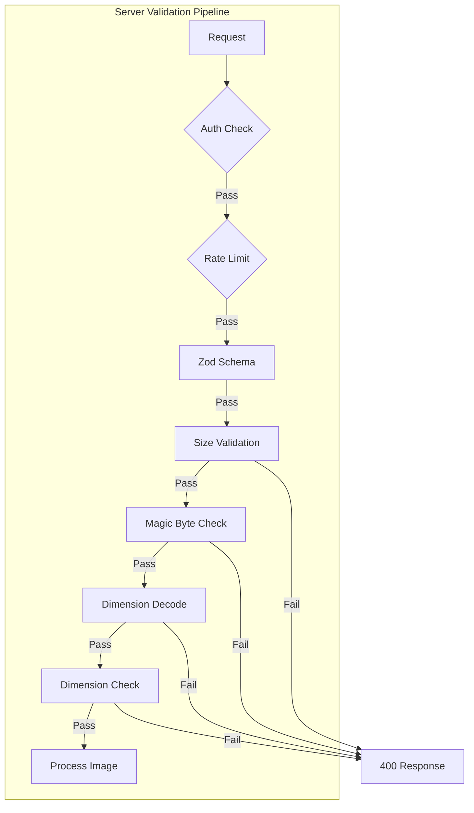
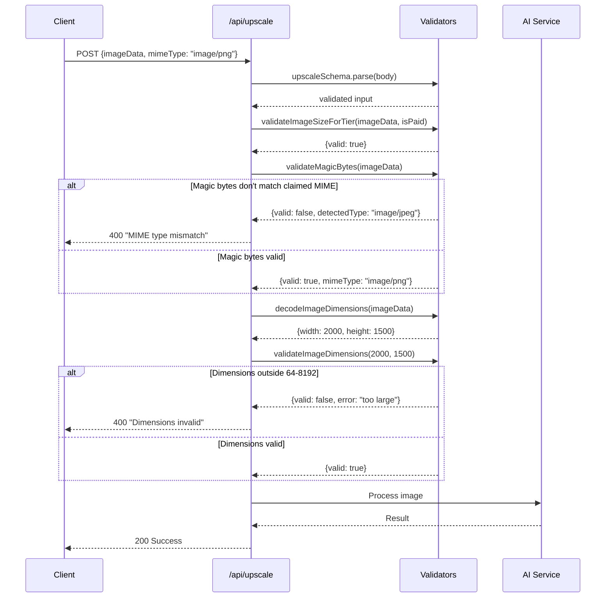

# PRD: Image Upload Validation

**Priority:** P1 - High
**Estimated Effort:** 1-2 days
**Author:** Engineering Team
**Date:** 2025-12-29

---

## 1. Context Analysis

### 1.1 Files Analyzed

- `shared/validation/upscale.schema.ts`
- `app/api/upscale/route.ts`
- `client/utils/image-preprocessing.ts`
- `client/utils/image-compression.ts`
- `client/hooks/useBatchQueue.ts`
- `client/components/tools/shared/MultiFileDropzone.tsx`

### 1.2 Component & Dependency Overview



### 1.3 Current Behavior Summary

- **MIME Validation:** Server trusts client-provided MIME type without verifying magic bytes
- **Dimension Validation:** `validateImageDimensions()` exists but is NOT called in `upscale/route.ts`
- **Memory Leaks:** `URL.createObjectURL()` in `image-preprocessing.ts:65` and `image-compression.ts:246,258` are never revoked
- **Size Validation:** `validateImageSizeForTier()` works correctly for file size limits

### 1.4 Problem Statement

Server accepts client-claimed MIME types without verification, allowing potential file type spoofing, and lacks dimension validation allowing images outside 64-8192px to reach AI APIs. Client-side code leaks memory by not revoking object URLs.

---

## 2. Proposed Solution

### 2.1 Architecture Summary

1. **Add magic byte validation** - Check first bytes of image to verify MIME type
2. **Call dimension validation** - Use existing `validateImageDimensions()` in upscale route
3. **Fix memory leaks** - Revoke object URLs after use in client utilities
4. **Add request timeout** - Prevent hung requests from consuming resources

**Alternatives Considered:**

- Full image parsing with sharp/jimp: Rejected - too heavy for Cloudflare Workers
- Client-only validation: Rejected - can be bypassed

### 2.2 Architecture Diagram



### 2.3 Key Technical Decisions

| Decision                      | Rationale                                       |
| ----------------------------- | ----------------------------------------------- |
| Magic byte check on server    | Client validation can be bypassed               |
| Decode dimensions from base64 | Avoids trusting client-provided dimensions      |
| Use native atob()             | CF Workers compatible, no external dependencies |
| Cleanup on reject/resolve     | Prevents leaks on both success and error paths  |

### 2.4 Data Model Changes

**No Data Changes.** This is purely application code.

---

### 2.5 Runtime Execution Flow



---

## 3. Detailed Implementation Spec

### A. `shared/validation/upscale.schema.ts`

**Changes Needed:**

- Add `validateMagicBytes()` function
- Add `decodeImageDimensions()` function for server-side dimension extraction

**Pseudo-code:**

```typescript
/**
 * Magic bytes for supported image formats
 */
const MAGIC_BYTES = {
  'image/jpeg': [0xff, 0xd8, 0xff],
  'image/png': [0x89, 0x50, 0x4e, 0x47],
  'image/webp': [0x52, 0x49, 0x46, 0x46], // RIFF header (WebP starts with RIFF)
  'image/gif': [0x47, 0x49, 0x46], // GIF87a or GIF89a
} as const;

/**
 * Validate image magic bytes against claimed MIME type
 * @param imageData - Base64 encoded image data
 * @param claimedMimeType - MIME type claimed by client
 */
export function validateMagicBytes(
  imageData: string,
  claimedMimeType: string
): IImageValidationResult & { detectedMimeType?: string } {
  // Extract base64 data
  const base64Data = imageData.includes(',') ? imageData.split(',')[1] : imageData;

  // Decode first 12 bytes (enough for all checks)
  const binaryString = atob(base64Data.slice(0, 16));
  const bytes = new Uint8Array(binaryString.length);
  for (let i = 0; i < binaryString.length; i++) {
    bytes[i] = binaryString.charCodeAt(i);
  }

  // Detect actual MIME type from magic bytes
  let detectedMimeType: string | null = null;

  for (const [mimeType, signature] of Object.entries(MAGIC_BYTES)) {
    if (signature.every((byte, index) => bytes[index] === byte)) {
      // Special check for WebP (RIFF header + WEBP at offset 8)
      if (mimeType === 'image/webp') {
        const webpSignature = [0x57, 0x45, 0x42, 0x50]; // "WEBP"
        if (!webpSignature.every((byte, i) => bytes[i + 8] === byte)) {
          continue; // Not actually WebP
        }
      }
      detectedMimeType = mimeType;
      break;
    }
  }

  // HEIC detection (more complex, check for ftyp box)
  if (
    !detectedMimeType &&
    bytes[4] === 0x66 &&
    bytes[5] === 0x74 &&
    bytes[6] === 0x79 &&
    bytes[7] === 0x70
  ) {
    detectedMimeType = 'image/heic';
  }

  if (!detectedMimeType) {
    return {
      valid: false,
      error: 'Unrecognized image format',
    };
  }

  // Normalize MIME types for comparison
  const normalizedClaimed = claimedMimeType.toLowerCase();
  const normalizedDetected = detectedMimeType.toLowerCase();

  if (normalizedClaimed !== normalizedDetected) {
    return {
      valid: false,
      error: `MIME type mismatch: claimed ${normalizedClaimed}, detected ${normalizedDetected}`,
      detectedMimeType,
    };
  }

  return { valid: true, detectedMimeType };
}

/**
 * Decode image dimensions from base64 data
 * Works for JPEG, PNG, and WebP
 */
export function decodeImageDimensions(imageData: string): { width: number; height: number } | null {
  const base64Data = imageData.includes(',') ? imageData.split(',')[1] : imageData;

  // Decode enough bytes for dimension extraction
  const binaryString = atob(base64Data.slice(0, 1000)); // First ~750 bytes
  const bytes = new Uint8Array(binaryString.length);
  for (let i = 0; i < binaryString.length; i++) {
    bytes[i] = binaryString.charCodeAt(i);
  }

  // PNG: dimensions at fixed offset (width at 16-19, height at 20-23)
  if (bytes[0] === 0x89 && bytes[1] === 0x50) {
    const width = (bytes[16] << 24) | (bytes[17] << 16) | (bytes[18] << 8) | bytes[19];
    const height = (bytes[20] << 24) | (bytes[21] << 16) | (bytes[22] << 8) | bytes[23];
    return { width, height };
  }

  // JPEG: scan for SOF0 or SOF2 marker
  if (bytes[0] === 0xff && bytes[1] === 0xd8) {
    let i = 2;
    while (i < bytes.length - 9) {
      if (bytes[i] === 0xff) {
        const marker = bytes[i + 1];
        // SOF0 (0xC0) or SOF2 (0xC2) contain dimensions
        if (marker === 0xc0 || marker === 0xc2) {
          const height = (bytes[i + 5] << 8) | bytes[i + 6];
          const width = (bytes[i + 7] << 8) | bytes[i + 8];
          return { width, height };
        }
        // Skip to next marker
        const length = (bytes[i + 2] << 8) | bytes[i + 3];
        i += 2 + length;
      } else {
        i++;
      }
    }
  }

  // WebP: check for VP8 or VP8L chunk
  if (bytes[0] === 0x52 && bytes[1] === 0x49) {
    // VP8 lossy: dimensions at offset 26-29
    if (bytes[12] === 0x56 && bytes[13] === 0x50 && bytes[14] === 0x38 && bytes[15] === 0x20) {
      const width = ((bytes[27] << 8) | bytes[26]) & 0x3fff;
      const height = ((bytes[29] << 8) | bytes[28]) & 0x3fff;
      return { width, height };
    }
    // VP8L lossless: dimensions at offset 21-24
    if (bytes[12] === 0x56 && bytes[13] === 0x50 && bytes[14] === 0x38 && bytes[15] === 0x4c) {
      const bits = bytes[21] | (bytes[22] << 8) | (bytes[23] << 16) | (bytes[24] << 24);
      const width = (bits & 0x3fff) + 1;
      const height = ((bits >> 14) & 0x3fff) + 1;
      return { width, height };
    }
  }

  return null; // Could not decode
}
```

**Justification:** Server-side validation prevents bypassing client checks.

---

### B. `app/api/upscale/route.ts`

**Changes Needed:**

- Add magic byte validation after size validation
- Add dimension validation using decoded dimensions
- Add AbortController timeout

**Pseudo-code:**

```typescript
// After validateImageSizeForTier (around line 266):

// 8a. Validate magic bytes match claimed MIME type
const magicValidation = validateMagicBytes(validatedInput.imageData, validatedInput.mimeType);
if (!magicValidation.valid) {
  logger.warn('Magic byte validation failed', {
    userId,
    claimedMime: validatedInput.mimeType,
    detectedMime: magicValidation.detectedMimeType,
  });
  const { body: errorBody, status } = createErrorResponse(
    ErrorCodes.VALIDATION_ERROR,
    magicValidation.error || 'Invalid image format',
    400
  );
  return NextResponse.json(errorBody, { status });
}

// 8b. Decode and validate dimensions
const dimensions = decodeImageDimensions(validatedInput.imageData);
if (dimensions) {
  const dimValidation = validateImageDimensions(dimensions.width, dimensions.height);
  if (!dimValidation.valid) {
    logger.warn('Dimension validation failed', {
      userId,
      width: dimensions.width,
      height: dimensions.height,
      error: dimValidation.error,
    });
    const { body: errorBody, status } = createErrorResponse(
      ErrorCodes.VALIDATION_ERROR,
      dimValidation.error || 'Image dimensions out of range',
      400
    );
    return NextResponse.json(errorBody, { status });
  }
} else {
  // Could not decode dimensions - proceed with caution
  logger.warn('Could not decode image dimensions', { userId });
}

// Add timeout to AI processing (around line 496):
const controller = new AbortController();
const timeout = setTimeout(() => controller.abort(), 120000); // 2 minute timeout

try {
  const result = await processor.processImage(userId, legacyInputForProcessor as never, {
    creditCost,
    signal: controller.signal,
  });
} finally {
  clearTimeout(timeout);
}
```

---

### C. `client/utils/image-preprocessing.ts`

**Changes Needed:**

- Revoke object URL after image loads

**Pseudo-code:**

```typescript
export async function preprocessForAnalysis(file: File): Promise<IPreprocessedImage> {
  return new Promise((resolve, reject) => {
    const img = new Image();
    const canvas = document.createElement('canvas');
    const ctx = canvas.getContext('2d');
    const objectUrl = URL.createObjectURL(file); // Store reference

    if (!ctx) {
      URL.revokeObjectURL(objectUrl); // Cleanup on error
      reject(new Error('Canvas not supported'));
      return;
    }

    img.onload = () => {
      // ... existing resize logic ...

      URL.revokeObjectURL(objectUrl); // MEMORY FIX: Cleanup after use

      resolve({
        imageData,
        mimeType: 'image/jpeg',
        original: { ... },
      });
    };

    img.onerror = () => {
      URL.revokeObjectURL(objectUrl); // MEMORY FIX: Cleanup on error
      reject(new Error('Failed to load image'));
    };

    img.src = objectUrl;
  });
}
```

---

### D. `client/utils/image-compression.ts`

**Changes Needed:**

- Revoke object URLs in `compressOnce()` and `loadImage()`

**Pseudo-code:**

```typescript
async function compressOnce(file: File, options: {...}): Promise<Blob> {
  return new Promise((resolve, reject) => {
    const img = document.createElement('img');
    const canvas = document.createElement('canvas');
    const ctx = canvas.getContext('2d');
    const objectUrl = URL.createObjectURL(file);

    // ... existing code ...

    img.onload = () => {
      // ... existing resize logic ...

      URL.revokeObjectURL(objectUrl); // MEMORY FIX

      canvas.toBlob(blob => { ... });
    };

    img.onerror = () => {
      URL.revokeObjectURL(objectUrl); // MEMORY FIX
      reject(new Error('Failed to load image'));
    };

    img.src = objectUrl;
  });
}

function loadImage(file: File): Promise<HTMLImageElement> {
  return new Promise((resolve, reject) => {
    const img = document.createElement('img');
    const objectUrl = URL.createObjectURL(file);

    img.onload = () => {
      URL.revokeObjectURL(objectUrl); // MEMORY FIX
      resolve(img);
    };

    img.onerror = () => {
      URL.revokeObjectURL(objectUrl); // MEMORY FIX
      reject(new Error('Failed to load image'));
    };

    img.src = objectUrl;
  });
}
```

---

## 4. Step-by-Step Execution Plan

### Phase 1: Server Validation (Independent)

- [ ] Add `validateMagicBytes()` to `upscale.schema.ts`
- [ ] Add `decodeImageDimensions()` to `upscale.schema.ts`
- [ ] Update `upscale/route.ts` with magic byte validation
- [ ] Update `upscale/route.ts` with dimension validation
- [ ] Add request timeout with AbortController

### Phase 2: Client Memory Fixes (Independent)

- [ ] Fix memory leak in `image-preprocessing.ts`
- [ ] Fix memory leaks in `image-compression.ts`
- [ ] Audit other files for similar leaks

### Phase 3: Testing

- [ ] Test magic byte validation with spoofed MIME types
- [ ] Test dimension validation with oversized images
- [ ] Test memory cleanup in client utilities
- [ ] Verify existing functionality not broken

---

## 5. Testing Strategy

### Unit Tests

| Function                    | Test Cases                                                   |
| --------------------------- | ------------------------------------------------------------ |
| `validateMagicBytes()`      | Valid JPEG, PNG, WebP, HEIC; mismatched MIME; corrupted data |
| `decodeImageDimensions()`   | JPEG, PNG, WebP dimension extraction; corrupted headers      |
| `validateImageDimensions()` | At boundaries (64px, 8192px), outside boundaries             |

### Integration Tests

- Upload image with wrong MIME type claim → 400 error
- Upload oversized image (>8192px) → 400 error
- Upload undersized image (<64px) → 400 error
- Valid upload → Success

### Edge Cases

| Scenario                   | Expected Behavior              |
| -------------------------- | ------------------------------ |
| JPEG saved as .png         | Rejected: MIME mismatch        |
| Valid but corrupt header   | Graceful fallback, log warning |
| Timeout during processing  | AbortError, credit not charged |
| Object URL already revoked | No crash (idempotent)          |

---

## 6. Acceptance Criteria

- [ ] `validateMagicBytes()` correctly identifies JPEG, PNG, WebP, HEIC
- [ ] `decodeImageDimensions()` extracts dimensions from at least JPEG and PNG
- [ ] Spoofed MIME types rejected with 400 error
- [ ] Images outside 64-8192px rejected with clear error message
- [ ] No memory leaks in client image processing
- [ ] Request timeout prevents hung connections
- [ ] All existing tests pass

---

## 7. Verification & Rollback

### Success Criteria

- No increase in 400 errors from legitimate uploads
- Memory usage stable in client application
- Processing times unchanged for valid images

### Rollback Plan

1. **Magic Byte Validation:** Can be wrapped in try-catch to log but not reject
2. **Dimension Validation:** Already optional (null check exists)
3. **Memory Fixes:** No rollback needed - strictly additive
4. **Timeout:** Can be increased or disabled via environment variable
