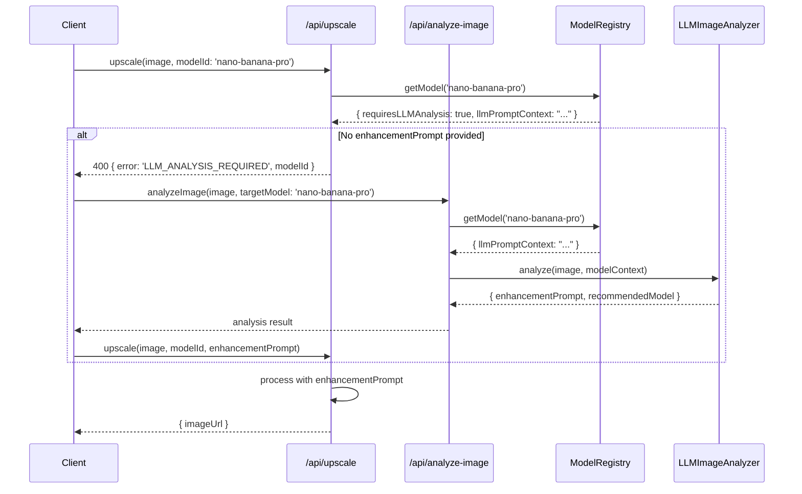

# PRD: Model-Specific Forced LLM Analysis

## 1. Context Analysis

### 1.1 Files Analyzed

- `/home/joao/projects/pixelperfect/server/services/llm-image-analyzer.ts`
- `/home/joao/projects/pixelperfect/server/services/llm-image-analyzer.types.ts`
- `/home/joao/projects/pixelperfect/server/services/model-registry.ts`
- `/home/joao/projects/pixelperfect/server/services/model-registry.types.ts`
- `/home/joao/projects/pixelperfect/app/api/analyze-image/route.ts`
- `/home/joao/projects/pixelperfect/app/api/upscale/route.ts`
- `/home/joao/projects/pixelperfect/shared/config/model-costs.config.ts`
- `/home/joao/projects/pixelperfect/client/utils/prompt-utils.ts`
- `/home/joao/projects/pixelperfect/shared/validation/upscale.schema.ts`

### 1.2 Component & Dependency Overview

```mermaid
graph TD
    A[Client: Image Upload] --> B[/api/analyze-image]
    A --> C[/api/upscale]
    B --> D[LLMImageAnalyzer]
    D --> E[Qwen3-VL / Gemini]
    E --> F[enhancementPrompt]
    F --> C
    C --> G[ModelRegistry]
    G --> H{Model Config}
    H --> I[ReplicateService]
    H --> J[ImageGenerationService]

    style H fill:#f96,stroke:#333
```

### 1.3 Current Behavior Summary

- LLM analysis is triggered via `/api/analyze-image` endpoint (auto mode)
- Analysis generates `enhancementPrompt` based on detected issues
- User can manually select any model and provide custom prompt
- Models have no per-model LLM configuration - analysis is image-based, not model-based
- `nano-banana-pro` processes without specialized LLM guidance when manually selected

### 1.4 Problem Statement

High-credit models like `nano-banana-pro` ($0.13/run, 8 credits) produce suboptimal results without model-specific enhancement prompts, wasting user credits and reducing output quality.

---

## 2. Proposed Solution

### 2.1 Architecture Summary

- Add `requiresLLMAnalysis` and `modelSpecificPrompt` fields to model configuration
- When a model with `requiresLLMAnalysis: true` is selected, automatically trigger LLM analysis
- Inject model-specific guidance into the LLM prompt for tailored enhancement instructions
- Bypass analysis for models without this requirement (maintain current behavior)

**Alternatives Considered:**

| Approach                      | Rejected Because                                      |
| ----------------------------- | ----------------------------------------------------- |
| Static per-model prompts      | Cannot adapt to image content; loses LLM intelligence |
| Always run LLM for all models | Unnecessary latency/cost for simple upscales          |
| Client-side prompt templates  | Duplicates logic, harder to maintain                  |

### 2.2 Architecture Diagram

```mermaid
flowchart LR
    subgraph Client
        A[Select Model]
    end

    subgraph API
        B{Model requires LLM?}
        C[/api/analyze-image]
        D[/api/upscale]
    end

    subgraph Services
        E[LLMImageAnalyzer]
        F[ModelRegistry]
    end

    A --> B
    B -->|Yes| C
    C --> E
    E -->|Enhanced Prompt| D
    B -->|No| D
    D --> F
```

### 2.3 Key Technical Decisions

| Decision                          | Rationale                                                       |
| --------------------------------- | --------------------------------------------------------------- |
| Server-side enforcement           | Cannot trust client; ensures consistent behavior                |
| Model config flag vs. list        | Flag is simpler, each model self-describes requirements         |
| Custom prompt template per model  | Different models have different strengths (faces, text, damage) |
| Reuse existing LLM infrastructure | No new providers; leverage Qwen3-VL → Gemini fallback           |

### 2.4 Data Model Changes

**Add to `IModelConfig` interface:**

```typescript
interface IModelConfig {
  // ... existing fields

  /**
   * If true, LLM analysis is required before processing with this model.
   * Client must call /api/analyze-image before /api/upscale.
   */
  requiresLLMAnalysis?: boolean;

  /**
   * Model-specific context injected into LLM analysis prompt.
   * Guides the LLM to generate prompts optimized for this model's capabilities.
   */
  llmPromptContext?: string;
}
```

---

### 2.5 Runtime Execution Flow



---

## 3. Detailed Implementation Spec

### A. `server/services/model-registry.types.ts`

**Changes Needed:** Add LLM analysis fields to `IModelConfig`

```typescript
export interface IModelConfig {
  // ... existing fields

  /** Require LLM analysis before processing. Default: false */
  requiresLLMAnalysis?: boolean;

  /** Context injected into LLM prompt for model-specific guidance */
  llmPromptContext?: string;
}
```

**Justification:** Self-describing model configuration keeps all model behavior in one place.

---

### B. `shared/config/model-costs.config.ts`

**Changes Needed:** Add configuration for `nano-banana-pro`

```typescript
'nano-banana-pro': {
  // ... existing config
  requiresLLMAnalysis: true,
  llmPromptContext: `
This image will be processed by nano-banana-pro, a premium model optimized for:
- Heavy damage restoration (scratches, tears, water damage)
- 4K/8K ultra-high resolution output
- Complex noise reduction while preserving fine details
- Professional-grade photo restoration

Generate a detailed enhancement prompt that:
1. Specifies exact damage types to repair
2. Identifies areas requiring detail preservation
3. Notes any faces, text, or fine patterns that need special attention
4. Suggests appropriate noise reduction level
  `.trim()
}
```

**Justification:** `nano-banana-pro` is a premium model where enhanced prompts significantly improve output quality.

---

### C. `server/services/llm-image-analyzer.ts`

**Changes Needed:** Accept optional `modelContext` parameter

**New Method Signature:**

```typescript
export async function analyzeImage(
  imageBase64: string,
  mimeType: string,
  eligibleModelIds: ModelId[],
  options?: {
    targetModelId?: ModelId;
    modelContext?: string;
  }
): Promise<ILLMAnalysisResult>;
```

**Modify `buildAnalysisPrompt`:**

```typescript
function buildAnalysisPrompt(eligibleModelIds: ModelId[], modelContext?: string): string {
  let prompt = `Analyze this image for enhancement...`;

  // Inject model-specific context if provided
  if (modelContext) {
    prompt += `\n\n## Target Model Context\n${modelContext}\n`;
  }

  prompt += `... existing prompt structure ...`;
  return prompt;
}
```

**Justification:** Minimal change to existing function; context is optional so default behavior unchanged.

---

### D. `app/api/analyze-image/route.ts`

**Changes Needed:** Accept `targetModelId` parameter, inject model context

```typescript
// Add to request body validation
const requestSchema = z.object({
  imageData: z.string(),
  mimeType: z.string(),
  allowExpensiveModels: z.boolean().optional(),
  targetModelId: z.string().optional(), // NEW
});

// In POST handler, after validation:
let modelContext: string | undefined;

if (validatedBody.targetModelId) {
  const targetModel = modelRegistry.getModel(validatedBody.targetModelId);
  if (targetModel?.llmPromptContext) {
    modelContext = targetModel.llmPromptContext;
  }
}

const analysis = await analyzeImage(imageBase64, mimeType, eligibleModelIds, {
  targetModelId: validatedBody.targetModelId,
  modelContext,
});
```

**Justification:** Endpoint already handles analysis; adding targetModel support is minimal change.

---

### E. `app/api/upscale/route.ts`

**Changes Needed:** Validate LLM analysis requirement, return helpful error

```typescript
// After model resolution, before processing:
const modelConfig = modelRegistry.getModel(resolvedModelId);

if (modelConfig?.requiresLLMAnalysis && !validatedInput.enhancementPrompt) {
  return NextResponse.json(
    {
      error: 'LLM_ANALYSIS_REQUIRED',
      message: `Model "${modelConfig.displayName}" requires LLM analysis for optimal results. Please analyze the image first.`,
      modelId: resolvedModelId,
      requiresAnalysis: true,
    },
    { status: 400 }
  );
}
```

**Justification:** Server-side enforcement prevents suboptimal processing; structured error enables client recovery.

---

### F. `client/hooks/useUpscale.ts` (or equivalent)

**Changes Needed:** Handle `LLM_ANALYSIS_REQUIRED` error, auto-trigger analysis

```typescript
// In upscale mutation error handler:
if (error.code === 'LLM_ANALYSIS_REQUIRED') {
  // Auto-trigger analysis with target model
  const analysis = await analyzeImage({
    imageData,
    mimeType,
    targetModelId: error.modelId,
  });

  // Retry upscale with enhancement prompt
  return upscale({
    ...originalParams,
    enhancementPrompt: analysis.enhancementPrompt,
  });
}
```

**Justification:** Seamless UX - user doesn't need to understand LLM requirement; it just works.

---

## 4. Step-by-Step Execution Plan

### Phase 1: Backend Core

- [ ] Add `requiresLLMAnalysis` and `llmPromptContext` to `IModelConfig` interface
- [ ] Add configuration for `nano-banana-pro` in model costs config
- [ ] Update `buildAnalysisPrompt` to accept optional model context
- [ ] Update `analyzeImage` function signature to accept options object

### Phase 2: API Layer

- [ ] Add `targetModelId` to analyze-image request schema
- [ ] Inject model context when target model specified
- [ ] Add LLM analysis validation to upscale route
- [ ] Return structured `LLM_ANALYSIS_REQUIRED` error

### Phase 3: Client Integration

- [ ] Handle `LLM_ANALYSIS_REQUIRED` error in upscale hook
- [ ] Auto-trigger analysis when required
- [ ] Retry upscale with enhancement prompt
- [ ] Add loading state for analysis step

### Phase 4: Testing & Validation

- [ ] Unit test: Model config with `requiresLLMAnalysis`
- [ ] Unit test: Prompt injection in LLM analyzer
- [ ] Integration test: End-to-end flow with nano-banana-pro
- [ ] Verify no regression for models without requirement

---

## 5. Testing Strategy

### Unit Tests

| Function              | Test Case                                  |
| --------------------- | ------------------------------------------ |
| `buildAnalysisPrompt` | With/without model context                 |
| `getModel`            | Returns LLM config fields                  |
| Upscale validation    | Rejects when analysis required but missing |

### Integration Tests

- Full flow: select nano-banana-pro → auto-analyze → upscale
- Flow without enhancement: select real-esrgan → upscale directly

### Edge Cases

| Scenario                                           | Expected Behavior                            |
| -------------------------------------------------- | -------------------------------------------- |
| Model requires LLM but analysis fails              | Return LLM fallback prompt, allow processing |
| User provides custom prompt for LLM-required model | Use provided prompt, skip analysis           |
| Unknown `targetModelId` in analyze                 | Ignore, use standard analysis                |

---

## 6. Acceptance Criteria

- [ ] `nano-banana-pro` cannot be processed without `enhancementPrompt`
- [ ] Analysis endpoint accepts `targetModelId` and injects model context
- [ ] Client auto-recovers from `LLM_ANALYSIS_REQUIRED` error
- [ ] Processing quality improves for nano-banana-pro (subjective, verify via samples)
- [ ] No behavior change for models without `requiresLLMAnalysis`
- [ ] `yarn verify` passes
- [ ] All new code has test coverage

---

## 7. Verification & Rollback

### Success Criteria

- LLM-analyzed nano-banana-pro outputs show improved detail restoration
- No increase in user-facing errors
- Processing latency increase < 3s (LLM analysis time)

### Rollback Plan

1. Set `requiresLLMAnalysis: false` in model config
2. Deploy - system reverts to current behavior
3. No migration needed; flag is additive

---

## 8. Future Considerations

Once validated with `nano-banana-pro`, consider adding to:

- `clarity-upscaler` - Premium model, could benefit from tailored prompts
- `gfpgan` - Face-specific context could improve restoration

**Not Recommended For:**

- `real-esrgan` - Simple upscaler, LLM adds latency without benefit
- `nano-banana` - Free tier model, don't add cost/latency
