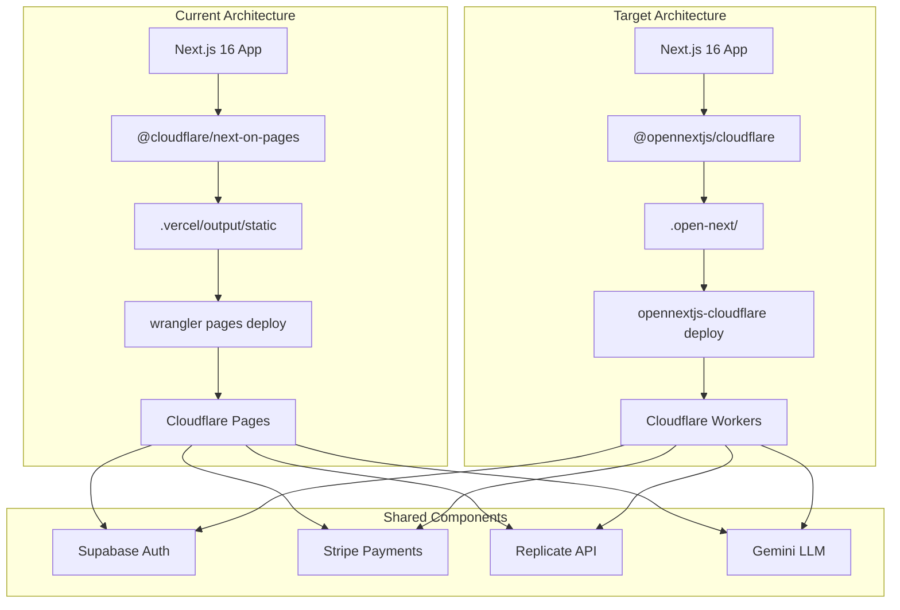

# OpenNext Migration PRD

## 1. Context Analysis

### 1.1 Files Analyzed

```
wrangler.toml
package.json
next.config.js
.gitignore
shared/config/env.ts
scripts/build-blog.ts
scripts/load-env.sh
middleware.ts
docs/PRDs/env-system-refactor.md
docs/guides/namecheap-to-cloudflare-deployment.md
workers/cron/wrangler.toml
.github/workflows/deploy.yml
app/api/*/route.ts (26 routes)
```

### 1.2 Component & Dependency Overview



### 1.3 Current Behavior Summary

- **Deployment Adapter:** `@cloudflare/next-on-pages@1.13.16` (deprecated)
- **Build Output:** `.vercel/output/static/` with `_worker.js` bundle
- **Runtime:** Edge runtime (all 26 API routes use `export const runtime = 'edge'`)
- **Cloudflare Bindings:** None (no KV, R2, D1, or Durable Objects)
- **Environment Variables:**
  - Local: `.env.client` + `.env.api` via bash script
  - Production: GitHub Actions vars + Cloudflare Dashboard
  - Centralized access via `shared/config/env.ts` with Zod validation
- **Cron Jobs:** Separate Worker at `workers/cron/` (unchanged by migration)
- **Blog System:** Pre-built to JSON at build time (edge-compatible)

### 1.4 Problem Statement

Cloudflare has deprecated `@cloudflare/next-on-pages` in favor of OpenNext, which provides better Next.js 15+ support, ISR, and full Node.js compatibility on Cloudflare Workers.

---

## 2. Proposed Solution

### 2.1 Architecture Summary

- **Replace** `@cloudflare/next-on-pages` with `@opennextjs/cloudflare`
- **Remove** `export const runtime = 'edge'` declarations (OpenNext uses Node.js runtime)
- **Create** `open-next.config.ts` and `wrangler.jsonc` configuration files
- **Update** build scripts to use OpenNext CLI commands
- **Keep** existing environment variable strategy (no changes needed)
- **Keep** cron worker as-is (separate deployment)

**Alternatives Considered:**

| Option                | Why Rejected                             |
| --------------------- | ---------------------------------------- |
| Stay on next-on-pages | Deprecated, limited Next.js 15+ support  |
| Vercel deployment     | Vendor lock-in, higher cost at scale     |
| Self-hosted Node.js   | Operational complexity, no edge presence |

### 2.2 Architecture Diagram (Target State)


### 2.3 Key Technical Decisions

| Decision                        | Rationale                                                                    |
| ------------------------------- | ---------------------------------------------------------------------------- |
| Use `wrangler.jsonc`            | JSON format with comments, schema validation, recommended by OpenNext        |
| Keep `wrangler.toml`            | For cron worker (separate deployment)                                        |
| No cache bindings initially     | Current app doesn't use ISR; can add KV/R2 later if needed                   |
| Remove all runtime declarations | OpenNext handles runtime automatically; `edge` declarations can cause issues |
| Dynamic import for dev init     | Prevents build-time errors from `initOpenNextCloudflareForDev`               |

### 2.4 Data Model Changes

**No Data Changes.** This is a deployment infrastructure migration only.

---

### 2.5 Runtime Execution Flow


---

## 3. Detailed Implementation Spec

### A. Package Changes

**File:** `package.json`

**Changes Needed:**

1. Remove `@cloudflare/next-on-pages` from devDependencies
2. Add `@opennextjs/cloudflare` to devDependencies
3. Update build/deploy scripts

**New devDependencies:**

```json
{
  "devDependencies": {
    "@opennextjs/cloudflare": "^1.0.0"
  }
}
```

**Remove:**

```json
{
  "devDependencies": {
    "@cloudflare/next-on-pages": "^1.13.16"
  }
}
```

**Updated Scripts:**

```json
{
  "scripts": {
    "preview": "opennextjs-cloudflare build && opennextjs-cloudflare preview",
    "deploy": "opennextjs-cloudflare build && opennextjs-cloudflare deploy",
    "cf-typegen": "wrangler types --env-interface CloudflareEnv cloudflare-env.d.ts"
  }
}
```

**Remove:**

```json
{
  "scripts": {
    "pages:build": "tsx scripts/build-blog.ts && npx @cloudflare/next-on-pages",
    "pages:preview": "npm run pages:build && wrangler pages dev .vercel/output/static"
  }
}
```

---

### B. Configuration Files

**New File:** `open-next.config.ts`

```typescript
import { defineCloudflareConfig } from '@opennextjs/cloudflare';

export default defineCloudflareConfig({
  // No cache overrides needed - using default memory cache
  // Add KV/R2 cache later if ISR is needed
});
```

**New File:** `wrangler.jsonc`

```jsonc
{
  "$schema": "node_modules/wrangler/config-schema.json",
  "name": "myimageupscaler.com",
  "main": ".open-next/worker.js",
  "compatibility_date": "2024-12-30",
  "compatibility_flags": ["nodejs_compat"],

  // Static assets binding (required)
  "assets": {
    "binding": "ASSETS",
    "directory": ".open-next/assets",
  },

  // Image optimization (uses Cloudflare Images)
  "images": {
    "binding": "IMAGES",
  },

  // Enable logging
  "observability": {
    "enabled": true,
  },

  // Worker self-reference for middleware
  "services": [
    {
      "binding": "WORKER_SELF_REFERENCE",
      "service": "myimageupscaler.com",
    },
  ],
}
```

**Justification:** JSONC format allows schema validation and comments. Service binding required for middleware routing.

---

### C. Next.js Configuration Update

**File:** `next.config.js`

**Changes Needed:** Add OpenNext dev initialization (dynamic import to avoid build errors)

```javascript
/** @type {import('next').NextConfig} */
const nextConfig = {
  // ... existing config unchanged ...
};

// Initialize OpenNext for local development with Cloudflare bindings
if (process.env.NODE_ENV === 'development') {
  import('@opennextjs/cloudflare')
    .then(({ initOpenNextCloudflareForDev }) => {
      initOpenNextCloudflareForDev();
    })
    .catch(() => {
      // Ignore if not installed yet
    });
}

export default nextConfig;
```

---

### D. Runtime Declaration Removal

**Files:** All 26 API routes in `app/api/`

**Change:** Remove `export const runtime = 'edge';` from each file.

**Affected Files:**

```
app/api/health/route.ts
app/api/health/stripe/route.ts
app/api/upscale/route.ts
app/api/analyze-image/route.ts
app/api/models/route.ts
app/api/credit-estimate/route.ts
app/api/webhooks/stripe/route.ts
app/api/checkout/route.ts
app/api/portal/route.ts
app/api/proxy-image/route.ts
app/api/credits/history/route.ts
app/api/analytics/event/route.ts
app/api/protected/example/route.ts
app/api/pseo/health/route.ts
app/api/subscriptions/cancel/route.ts
app/api/subscription/change/route.ts
app/api/subscription/preview-change/route.ts
app/api/subscription/cancel-scheduled/route.ts
app/api/admin/users/route.ts
app/api/admin/users/[userId]/route.ts
app/api/admin/stats/route.ts
app/api/admin/subscription/route.ts
app/api/admin/credits/adjust/route.ts
app/api/cron/reconcile/route.ts
app/api/cron/recover-webhooks/route.ts
app/api/cron/check-expirations/route.ts
```

**Justification:** OpenNext uses Node.js runtime by default. Edge runtime declarations can cause compatibility issues.

---

### E. .gitignore Update

**File:** `.gitignore`

**Add:**

```gitignore
# OpenNext
.open-next/
```

**Keep:**

```gitignore
# Wrangler/Cloudflare
.wrangler/
wrangler.toml.bak
.dev.vars
```

---

### F. Local Development File

**New File:** `.dev.vars` (already in .gitignore)

```
NEXTJS_ENV=development
```

**Note:** This file provides environment context during local preview. Other env vars come from `.env.client` and `.env.api`.

---

### G. CI/CD Updates

**File:** `.github/workflows/deploy.yml`

**Changes Needed:** Update build and deploy commands.

**Before:**

```yaml
- name: Build
  run: yarn pages:build

- name: Deploy
  run: npx wrangler pages deploy .vercel/output/static
```

**After:**

```yaml
- name: Build
  run: npx opennextjs-cloudflare build

- name: Deploy
  run: npx opennextjs-cloudflare deploy
```

---

### H. Documentation Updates

**File:** `docs/guides/namecheap-to-cloudflare-deployment.md`

Already updated with OpenNext instructions. Mark Part 4 as the primary deployment method.

**File:** `docs/guides/cloudflare-deployment.md`

Update to reference OpenNext instead of next-on-pages.

---

## 4. Step-by-Step Execution Plan

### Phase 1: Dependencies & Configuration

- [ ] Remove `@cloudflare/next-on-pages` from package.json
- [ ] Add `@opennextjs/cloudflare@latest` to package.json
- [ ] Run `yarn install`
- [ ] Create `open-next.config.ts`
- [ ] Create `wrangler.jsonc`
- [ ] Create `.dev.vars` with `NEXTJS_ENV=development`
- [ ] Update `.gitignore` with `.open-next/`

### Phase 2: Code Changes

- [ ] Remove `export const runtime = 'edge'` from all 26 API routes
- [ ] Update `next.config.js` with OpenNext dev initialization
- [ ] Update `package.json` scripts (preview, deploy)
- [ ] Remove old `pages:build`, `pages:preview` scripts

### Phase 3: Testing

- [ ] Run `yarn preview` - verify local preview works
- [ ] Test all API endpoints locally
- [ ] Test authentication flow
- [ ] Test Stripe checkout flow
- [ ] Test image upscale flow

### Phase 4: Deployment

- [ ] Update `.github/workflows/deploy.yml`
- [ ] Deploy to preview environment
- [ ] Verify all endpoints in preview
- [ ] Deploy to production
- [ ] Monitor logs for errors

### Phase 5: Cleanup

- [ ] Delete old `wrangler.toml` (keep for cron worker reference)
- [ ] Update documentation
- [ ] Remove any stale next-on-pages references

---

## 5. Testing Strategy

### Unit Tests

No changes required - existing unit tests remain valid.

### Integration Tests

- [ ] API health check (`/api/health`)
- [ ] Stripe webhook handling (`/api/webhooks/stripe`)
- [ ] Image processing flow (`/api/upscale`, `/api/analyze-image`)
- [ ] Authentication middleware

### E2E Tests

Existing Playwright tests should pass without modification. Run full suite:

```bash
yarn test:e2e:full
```

### Edge Cases

| Scenario            | Expected Behavior                 |
| ------------------- | --------------------------------- |
| Missing env vars    | Zod validation throws at startup  |
| Large image upload  | Returns result URL (no timeout)   |
| Concurrent requests | Handled by Workers (auto-scaling) |
| Cold start          | < 500ms (Workers optimize this)   |
| Invalid auth token  | 401 response, logged via Baselime |

---

## 6. Acceptance Criteria

- [ ] `yarn preview` runs successfully locally
- [ ] `yarn deploy` deploys without errors
- [ ] All API routes return correct responses
- [ ] Authentication flow works (login, logout, session refresh)
- [ ] Stripe checkout and webhooks function correctly
- [ ] Image upscale returns results within expected time
- [ ] No `@cloudflare/next-on-pages` references remain in codebase
- [ ] All existing E2E tests pass
- [ ] Cloudflare Dashboard shows healthy Worker

---

## 7. Verification & Rollback

### Success Criteria

- Response times comparable to previous deployment (p95 < 500ms for API routes)
- No increase in error rates (monitor Baselime)
- Cloudflare Workers dashboard shows healthy metrics
- All Stripe webhook events processed successfully

### Rollback Plan

1. **Immediate:** Revert to previous Cloudflare Pages deployment via dashboard
2. **Git Revert:** Create revert commit restoring next-on-pages configuration
3. **Redeploy:** Run old deployment pipeline

**Keep old config available:**

```bash
git stash  # Save OpenNext changes
git checkout HEAD~1 -- package.json wrangler.toml  # Restore old config
yarn install && yarn deploy  # Deploy old version
```

---

## 8. Migration Risks

| Risk                       | Likelihood | Impact | Mitigation                                  |
| -------------------------- | ---------- | ------ | ------------------------------------------- |
| Breaking API changes       | Low        | High   | Test all endpoints before production        |
| Environment var issues     | Medium     | Medium | Verify all vars set in Cloudflare Dashboard |
| Middleware incompatibility | Low        | High   | Test auth flow thoroughly                   |
| Performance regression     | Low        | Medium | Monitor metrics post-deploy                 |
| ISR not working            | N/A        | N/A    | Not using ISR currently                     |

---

## 9. Future Considerations

After successful migration, consider:

1. **Add KV Cache:** For ISR if static pages need revalidation
2. **Add R2 Storage:** For storing processed images (currently using Replicate URLs)
3. **Add D1 Database:** If local caching/state needed (currently all in Supabase)
4. **Enable Skew Protection:** For zero-downtime deployments

These can be added incrementally by updating `open-next.config.ts` and `wrangler.jsonc`.
