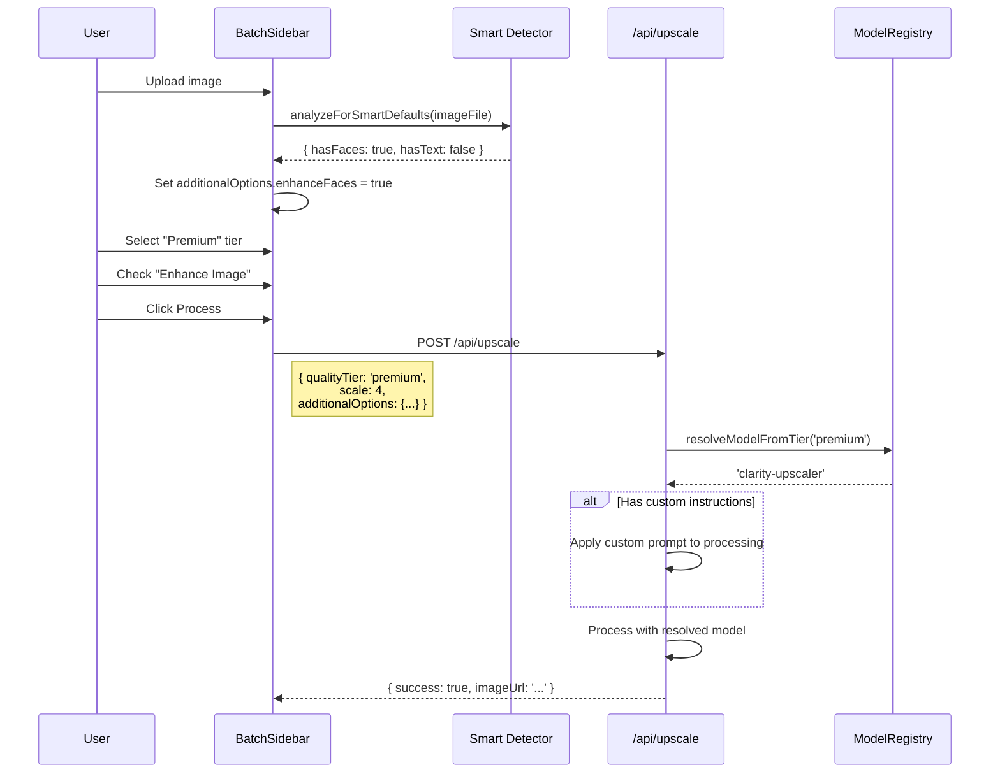

# PRD: Outcome-Based UI/API Flow Refactor

**Version:** 1.0
**Status:** Draft
**Date:** December 17, 2025
**Author:** Principal Architect

---

## Executive Summary

Refactor the core image processing flow from a technical, mode-based interface to an outcome-based UI centered on **Quality Tiers**. This simplifies the user experience by eliminating the redundant "Operation Mode" selector and reframing "AI Model" selection as intuitive quality levels.

### Key Changes

| Before | After |
|--------|-------|
| Operation Mode: Upscale / Enhance / Both / Custom | **Removed** - Always upscale + smart enhancements |
| AI Model: real-esrgan, gfpgan, etc. | Quality Tier: Fast / Standard / Premium / Ultra |
| Custom mode for custom instructions | Additional Option: Custom Instructions (modal) |
| Enhance mode for enhancements | Additional Option: Enhance Image (toggle) |
| enhanceFace / preserveText toggles | Smart auto-detection with user override |

---

## 1. Context Analysis

### 1.1 Files Analyzed

```
/home/joao/projects/pixelperfect/shared/types/pixelperfect.ts
/home/joao/projects/pixelperfect/client/components/features/workspace/BatchSidebar.tsx
/home/joao/projects/pixelperfect/client/components/features/workspace/BatchSidebar/ModeSelector.tsx
/home/joao/projects/pixelperfect/client/components/features/workspace/BatchSidebar/ModelSelector.tsx
/home/joao/projects/pixelperfect/client/components/features/workspace/BatchSidebar/EnhancementPanel.tsx
/home/joao/projects/pixelperfect/client/components/features/workspace/BatchSidebar/FeatureToggles.tsx
/home/joao/projects/pixelperfect/client/components/features/workspace/Workspace.tsx
/home/joao/projects/pixelperfect/client/hooks/pixelperfect/useBatchQueue.ts
/home/joao/projects/pixelperfect/app/api/upscale/route.ts
/home/joao/projects/pixelperfect/app/api/analyze-image/route.ts
/home/joao/projects/pixelperfect/server/services/model-registry.ts
/home/joao/projects/pixelperfect/shared/config/subscription.utils.ts
```

### 1.2 Component & Dependency Overview

```mermaid
graph TD
    subgraph UI["Current UI Components"]
        A[BatchSidebar] --> B[ModeSelector]
        A --> C[ModelSelector]
        A --> D[EnhancementPanel]
        A --> E[FeatureToggles]
        A --> F[UpscaleFactorSelector]
    end

    subgraph Types["Shared Types"]
        G[ProcessingMode] --> H["upscale|enhance|both|custom"]
        I[ModelId] --> J["real-esrgan|gfpgan|..."]
        K[IUpscaleConfig] --> G
        K --> I
    end

    subgraph API["API Layer"]
        L[/api/upscale] --> M[model-registry.ts]
        N[/api/analyze-image] --> M
        L --> O[Image Processors]
    end

    A --> K
    L --> K
```

### 1.3 Current Behavior Summary

- **Operation Mode** is a 4-option toggle: `upscale`, `enhance`, `both`, `custom`
- Default mode is `both`, making other modes rarely used
- `custom` mode enables a textarea for LLM prompt instructions
- **AI Model** selector shows technical model names with credit costs
- `enhanceFace` and `preserveText` are manual toggles (no auto-detection applied)
- API accepts `mode` and `selectedModel` as separate parameters
- Credit cost calculation depends on both mode and model

### 1.4 Problem Statement

The current UI presents technical implementation details (modes, model names) instead of user-desired outcomes, creating friction and confusion for non-technical users.

---

## 2. Proposed Solution

### 2.1 Architecture Summary

1. **Replace Operation Mode with implicit behavior**: Always perform upscaling; enhancements become opt-in via Additional Options
2. **Rename AI Model to Quality Tier**: Present outcome-focused labels (Fast, Standard, Premium, Ultra) instead of technical model names
3. **Consolidate enhancements**: Move enhancement toggles to an "Additional Options" expandable section
4. **Smart detection with override**: Auto-detect faces/text and apply processing by default; user can toggle off
5. **Custom Instructions as modal**: Checkbox in Additional Options opens a modal for custom LLM prompts

**Alternatives Considered:**

1. **Keep modes, just rename** - Rejected: Doesn't solve the fundamental UX issue
2. **Wizard-style flow** - Rejected: Over-engineering for simple use case
3. **Auto-only (no quality choice)** - Rejected: Power users want control over credit spend

### 2.2 Architecture Diagram

```mermaid
flowchart TB
    subgraph NewUI["New BatchSidebar Structure"]
        A[Quality Tier Selector] --> B["Fast (1 cr)"]
        A --> C["Standard (2 cr)"]
        A --> D["Premium (4 cr)"]
        A --> E["Ultra (8 cr)"]

        F[Upscale Factor] --> G[2x / 4x / 8x]

        H[Additional Options]
        H --> I["☑ Enhance Image"]
        H --> J["☑ Enhance Faces (auto)"]
        H --> K["☑ Preserve Text (auto)"]
        H --> L["☐ Custom Instructions"]

        I --> M[EnhancementPanel]
        L --> N[CustomInstructionsModal]
    end

    subgraph API["Updated API Contract"]
        O[IUpscaleConfig v2] --> P[qualityTier: QualityTier]
        O --> Q[scale: 2|4|8]
        O --> R[additionalOptions: IAdditionalOptions]
    end

    NewUI --> O
```

### 2.3 Key Technical Decisions

| Decision | Choice | Rationale |
|----------|--------|-----------|
| Quality tier naming | Fast / Standard / Premium / Ultra | User-focused, avoids technical jargon |
| Smart detection | Client-side heuristics + LLM fallback | No extra API call for simple cases |
| Custom instructions | Modal (not inline) | Reduces sidebar clutter, better UX for multi-line input |
| Backward compatibility | API accepts both old and new schema | Gradual migration, no breaking changes |
| Mode field | Deprecated but supported | Existing clients continue working |

### 2.4 Data Model Changes

**New Types (`shared/types/pixelperfect.ts`):**

```typescript
// NEW: Quality tier replaces model selection in UI
export type QualityTier = 'fast' | 'standard' | 'premium' | 'ultra';

// Quality tier to model mapping (internal)
export const QUALITY_TIER_MODEL_MAP: Record<QualityTier, ModelId> = {
  fast: 'real-esrgan',
  standard: 'gfpgan',
  premium: 'clarity-upscaler',
  ultra: 'nano-banana-pro',
};

export const QUALITY_TIER_CREDITS: Record<QualityTier, number> = {
  fast: 1,
  standard: 2,
  premium: 4,
  ultra: 8,
};

// NEW: Additional options (replaces mode + toggles)
export interface IAdditionalOptions {
  enhance: boolean;              // Enable enhancement processing
  enhanceFaces: boolean;         // Face restoration (auto-detected, can override)
  preserveText: boolean;         // Text preservation (auto-detected, can override)
  customInstructions?: string;   // Custom LLM prompt (if provided)
  enhancement?: IEnhancementSettings; // Detailed enhancement settings
}

// Updated config interface
export interface IUpscaleConfigV2 {
  qualityTier: QualityTier;
  scale: 2 | 4 | 8;
  additionalOptions: IAdditionalOptions;
  // Nano Banana Pro specific (only for 'ultra' tier)
  nanoBananaProConfig?: INanoBananaProConfig;
}

// DEPRECATED: Old config still accepted for backward compatibility
export interface IUpscaleConfig {
  mode: ProcessingMode;          // @deprecated - use additionalOptions
  selectedModel: 'auto' | ModelId; // @deprecated - use qualityTier
  // ... rest unchanged
}
```

---

## 2.5 Runtime Execution Flow



---

## 3. Detailed Implementation Spec

### A. `shared/types/pixelperfect.ts`

**Changes Needed:**
- Add `QualityTier` type
- Add `QUALITY_TIER_MODEL_MAP` constant
- Add `QUALITY_TIER_CREDITS` constant
- Add `IAdditionalOptions` interface
- Add `IUpscaleConfigV2` interface
- Mark old fields as `@deprecated`

**Justification:** Central type definitions enable type-safe refactoring across client and server.

---

### B. `client/components/features/workspace/BatchSidebar/QualityTierSelector.tsx` (NEW)

**Purpose:** Replace both ModeSelector and ModelSelector with outcome-focused UI

```typescript
export interface IQualityTierSelectorProps {
  tier: QualityTier;
  onChange: (tier: QualityTier) => void;
  disabled?: boolean;
  isFreeUser?: boolean;
}

// Visual design:
// - 4-button toggle group (like current ModeSelector layout)
// - Each button shows: Tier name + credit cost badge
// - Premium/Ultra show lock icon for free users with upgrade prompt
```

**Options:**

| Tier | Label | Credits | Description (tooltip) |
|------|-------|---------|----------------------|
| fast | Fast | 1 | Quick upscale for everyday images |
| standard | Standard | 2 | Balanced quality for most photos |
| premium | Premium | 4 | High quality for important images |
| ultra | Ultra | 8 | Maximum quality, 4K/8K output |

**Justification:** Single component replacing two, clearer mental model for users.

---

### C. `client/components/features/workspace/BatchSidebar/AdditionalOptions.tsx` (NEW)

**Purpose:** Collapsible section containing enhancement toggles and custom instructions

```typescript
export interface IAdditionalOptionsProps {
  options: IAdditionalOptions;
  onChange: (options: IAdditionalOptions) => void;
  onOpenCustomInstructions: () => void;
  disabled?: boolean;
  detectedFeatures?: { hasFaces: boolean; hasText: boolean };
}

// Structure:
// [Expand/Collapse Header: "Additional Options"]
//   ☑ Enhance Image → expands EnhancementPanel inline
//   ☑ Enhance Faces (auto-detected) → simple toggle
//   ☑ Preserve Text (auto-detected) → simple toggle
//   ☐ Custom Instructions → opens modal when checked
```

**Smart Detection Badges:**
- When faces/text detected, show "(detected)" badge next to toggle
- User can uncheck to disable auto-applied processing

**Justification:** Consolidates scattered toggles into logical group, reduces cognitive load.

---

### D. `client/components/features/workspace/BatchSidebar/CustomInstructionsModal.tsx` (NEW)

**Purpose:** Modal for entering custom LLM instructions

```typescript
export interface ICustomInstructionsModalProps {
  isOpen: boolean;
  onClose: () => void;
  instructions: string;
  onSave: (instructions: string) => void;
  placeholderPrompt: string;
}

// Features:
// - Large textarea for multi-line input
// - "Load Template" button (same as current)
// - Character count
// - Save / Cancel buttons
// - ESC to close
```

**Justification:** Better UX than inline textarea; modal focuses user attention.

---

### E. `client/components/features/workspace/BatchSidebar.tsx` (UPDATE)

**Changes Needed:**
- Remove `ModeSelector` import and usage
- Replace `ModelSelector` with `QualityTierSelector`
- Add `AdditionalOptions` component
- Add `CustomInstructionsModal` component
- Update config state to use `IUpscaleConfigV2`
- Add smart detection on image upload

**Updated Structure:**

```tsx
<div className="batch-sidebar">
  {/* Header - unchanged */}

  {/* Action Panel - unchanged */}

  {/* Processing Options */}
  <QualityTierSelector
    tier={config.qualityTier}
    onChange={handleTierChange}
    disabled={isProcessing}
    isFreeUser={isFreeUser}
  />

  <UpscaleFactorSelector ... /> {/* unchanged */}

  <AdditionalOptions
    options={config.additionalOptions}
    onChange={handleOptionsChange}
    onOpenCustomInstructions={() => setShowCustomModal(true)}
    disabled={isProcessing}
    detectedFeatures={detectedFeatures}
  />

  {/* Ultra tier specific config */}
  {config.qualityTier === 'ultra' && (
    <NanoBananaProSettings ... />
  )}

  <CustomInstructionsModal
    isOpen={showCustomModal}
    onClose={() => setShowCustomModal(false)}
    instructions={config.additionalOptions.customInstructions ?? ''}
    onSave={handleSaveCustomInstructions}
  />
</div>
```

---

### F. `client/hooks/pixelperfect/useSmartDetection.ts` (NEW)

**Purpose:** Client-side heuristics for face/text detection to set defaults

```typescript
export function useSmartDetection() {
  const detectFeatures = async (file: File): Promise<{
    hasFaces: boolean;
    hasText: boolean;
    confidence: number;
  }> => {
    // Simple client-side heuristics:
    // 1. Check filename for hints (portrait, document, receipt, etc.)
    // 2. Check image dimensions (portrait aspect ratio → likely face)
    // 3. Optional: Use browser ML API if available

    // Returns conservative defaults - server can refine with LLM
  };

  return { detectFeatures };
}
```

**Justification:** Avoid API call for obvious cases; improve perceived performance.

---

### G. `shared/config/subscription.utils.ts` (UPDATE)

**Add functions:**

```typescript
export function getCreditsForTier(tier: QualityTier): number {
  return QUALITY_TIER_CREDITS[tier];
}

export function getModelForTier(tier: QualityTier): ModelId {
  return QUALITY_TIER_MODEL_MAP[tier];
}

// Backward compatibility: Convert old config to new
export function migrateConfigToV2(oldConfig: IUpscaleConfig): IUpscaleConfigV2 {
  const tier = modelToTier(oldConfig.selectedModel);
  return {
    qualityTier: tier,
    scale: oldConfig.scale,
    additionalOptions: {
      enhance: oldConfig.mode === 'enhance' || oldConfig.mode === 'both',
      enhanceFaces: oldConfig.enhanceFace,
      preserveText: oldConfig.preserveText,
      customInstructions: oldConfig.customPrompt,
      enhancement: oldConfig.enhancement,
    },
    nanoBananaProConfig: oldConfig.nanoBananaProConfig,
  };
}

function modelToTier(model: 'auto' | ModelId): QualityTier {
  switch (model) {
    case 'real-esrgan': return 'fast';
    case 'gfpgan': return 'standard';
    case 'clarity-upscaler': return 'premium';
    case 'nano-banana-pro': return 'ultra';
    default: return 'fast'; // auto or unknown defaults to fast
  }
}
```

---

### H. `app/api/upscale/route.ts` (UPDATE)

**Changes Needed:**
- Accept both `IUpscaleConfig` (legacy) and `IUpscaleConfigV2` (new)
- Add migration layer for backward compatibility
- Resolve model from quality tier

```typescript
// Schema accepts both formats
const inputSchema = z.object({
  // New format
  qualityTier: z.enum(['fast', 'standard', 'premium', 'ultra']).optional(),
  additionalOptions: z.object({...}).optional(),

  // Legacy format (deprecated)
  config: upscaleConfigSchema.optional(),
});

// In handler:
let resolvedConfig: IUpscaleConfigV2;

if (input.qualityTier) {
  // New format - use directly
  resolvedConfig = input as IUpscaleConfigV2;
} else if (input.config) {
  // Legacy format - migrate
  resolvedConfig = migrateConfigToV2(input.config);
}

// Resolve model from tier
const modelId = getModelForTier(resolvedConfig.qualityTier);
```

**Justification:** Zero breaking changes for existing clients; gradual migration.

---

### I. Files to Delete

```
client/components/features/workspace/BatchSidebar/ModeSelector.tsx
```

**Justification:** Replaced by `QualityTierSelector` + `AdditionalOptions`.

---

## 4. Step-by-Step Execution Plan

### Phase 1: Types & Config (Shared Layer)

- [ ] Add `QualityTier` type to `pixelperfect.ts`
- [ ] Add `QUALITY_TIER_MODEL_MAP` constant
- [ ] Add `QUALITY_TIER_CREDITS` constant
- [ ] Add `IAdditionalOptions` interface
- [ ] Add `IUpscaleConfigV2` interface
- [ ] Add `@deprecated` annotations to old fields
- [ ] Add utility functions to `subscription.utils.ts`

### Phase 2: New UI Components

- [ ] Create `QualityTierSelector.tsx`
- [ ] Create `AdditionalOptions.tsx`
- [ ] Create `CustomInstructionsModal.tsx`
- [ ] Create `useSmartDetection.ts` hook
- [ ] Write unit tests for new components

### Phase 3: BatchSidebar Refactor

- [ ] Update `BatchSidebar.tsx` to use new components
- [ ] Update `Workspace.tsx` default config to V2 format
- [ ] Wire up smart detection on image add
- [ ] Remove `ModeSelector` usage
- [ ] Test full UI flow

### Phase 4: API Backward Compatibility

- [ ] Update `/api/upscale` schema to accept both formats
- [ ] Add config migration in route handler
- [ ] Add integration tests for both formats
- [ ] Verify existing tests still pass

### Phase 5: Cleanup

- [ ] Delete `ModeSelector.tsx`
- [ ] Update any remaining references to old types
- [ ] Run full test suite
- [ ] Update ROADMAP.md

---

## 5. Testing Strategy

### Unit Tests

**QualityTierSelector:**
- Renders all 4 tier options
- Shows correct credit costs
- Disables premium/ultra for free users with upgrade prompt
- Calls onChange with correct tier value

**AdditionalOptions:**
- Toggles control all options correctly
- Shows "(detected)" badge when features detected
- Custom instructions checkbox opens modal callback

**useSmartDetection:**
- Returns hasFaces for portrait-like images
- Returns hasText for document-like filenames
- Returns conservative defaults for unknown

**migrateConfigToV2:**
- Correctly maps all mode values
- Correctly maps all model values
- Preserves enhancement settings

### Integration Tests

- Full flow: Upload → Auto-detect → Select tier → Process
- Custom instructions modal opens/saves/cancels correctly
- API accepts both legacy and new config formats

### Edge Cases

| Scenario | Expected Behavior |
|----------|------------------|
| Free user selects Ultra | Upgrade prompt shown, selection blocked |
| Legacy client sends old config | API migrates and processes normally |
| No faces detected but user enables | Processing uses face restoration anyway |
| Custom instructions with special chars | Properly escaped and applied |

---

## 6. Acceptance Criteria

### UI

- [ ] BatchSidebar shows Quality Tier selector (not AI Model)
- [ ] No Operation Mode selector visible
- [ ] Additional Options section expandable with all toggles
- [ ] Custom Instructions opens modal (not inline)
- [ ] Smart detection badges show when applicable
- [ ] Free users see upgrade prompt for Premium/Ultra

### API

- [ ] `/api/upscale` accepts `qualityTier` + `additionalOptions` format
- [ ] `/api/upscale` still accepts legacy `config.mode` + `config.selectedModel`
- [ ] Credit calculation correct for all tiers
- [ ] Model resolved correctly from tier

### Testing

- [ ] All existing tests pass (no regressions)
- [ ] New component tests pass
- [ ] E2E test for full new flow passes

---

## 7. Verification & Rollback

### Success Criteria

- User confusion metrics decrease (support tickets about "which mode")
- Conversion funnel improves (fewer drop-offs at settings)
- No increase in processing errors

### Rollback Plan

**Immediate (config toggle):**
1. Add feature flag: `USE_OUTCOME_BASED_UI`
2. Toggle off to restore old UI
3. API continues supporting both formats regardless

**If API issues:**
1. Revert API changes only
2. UI falls back to using legacy format
3. No user-facing impact

---

## 8. UI/UX Design Specifications

### 8.1 Quality Tier Selector Design

**Desktop (md+):**
```
┌─────────────────────────────────────────────────────┐
│  Quality                                            │
│  ┌──────────┐ ┌──────────┐ ┌──────────┐ ┌─────────┐│
│  │   Fast   │ │ Standard │ │ Premium  │ │  Ultra  ││
│  │  1 cr    │ │  2 cr    │ │  4 cr    │ │  8 cr   ││
│  └──────────┘ └──────────┘ └──────────┘ └─────────┘│
│  Quick upscale for everyday images                  │
└─────────────────────────────────────────────────────┘
```

**Mobile (<md):**
```
┌─────────────────────────────┐
│  Quality                    │
│  ┌────────────┬────────────┐│
│  │    Fast    │  Standard  ││
│  │   1 cr     │   2 cr     ││
│  ├────────────┼────────────┤│
│  │  Premium   │   Ultra    ││
│  │   4 cr     │   8 cr     ││
│  └────────────┴────────────┘│
│  Quick upscale              │
└─────────────────────────────┘
```

**Visual States:**
- **Default**: `border-slate-200 bg-white text-slate-600`
- **Selected**: `border-indigo-600 bg-indigo-50 text-indigo-700 ring-2 ring-indigo-500`
- **Disabled**: `opacity-50 cursor-not-allowed`
- **Locked (free user)**: `border-amber-200 bg-amber-50` with lock icon overlay

**Responsive Breakpoints:**
- Mobile: 2x2 grid (`grid-cols-2`)
- Tablet+: 4-column row (`md:grid-cols-4`)

---

### 8.2 Additional Options Section Design

**Collapsed State:**
```
┌─────────────────────────────────────────────────────┐
│  ▶ Additional Options                          (3) │
└─────────────────────────────────────────────────────┘
```
- Shows count of enabled options in badge
- Click anywhere to expand

**Expanded State (Desktop):**
```
┌─────────────────────────────────────────────────────┐
│  ▼ Additional Options                               │
│  ┌─────────────────────────────────────────────────┐│
│  │ ☑ Enhance Image                                 ││
│  │   ┌─────────────────────────────────────────┐   ││
│  │   │ ☑ Clarity  ☑ Color  ☐ Lighting         │   ││
│  │   │ ☑ Denoise  ☑ Artifacts  ☐ Details      │   ││
│  │   └─────────────────────────────────────────┘   ││
│  ├─────────────────────────────────────────────────┤│
│  │ ☑ Enhance Faces                    (detected)  ││
│  ├─────────────────────────────────────────────────┤│
│  │ ☐ Preserve Text                                ││
│  ├─────────────────────────────────────────────────┤│
│  │ ☐ Custom Instructions                    ✏️     ││
│  └─────────────────────────────────────────────────┘│
└─────────────────────────────────────────────────────┘
```

**Expanded State (Mobile):**
```
┌─────────────────────────────┐
│  ▼ Additional Options       │
│  ┌─────────────────────────┐│
│  │ ☑ Enhance Image         ││
│  │  ☑ Clarity  ☑ Color    ││
│  │  ☐ Lighting            ││
│  │  ☑ Denoise  ☑ Artifacts││
│  │  ☐ Details             ││
│  ├─────────────────────────┤│
│  │ ☑ Enhance Faces  (auto)││
│  ├─────────────────────────┤│
│  │ ☐ Preserve Text        ││
│  ├─────────────────────────┤│
│  │ ☐ Custom Instructions ✏││
│  └─────────────────────────┘│
└─────────────────────────────┘
```

**Component Specifications:**

| Element | Desktop | Mobile |
|---------|---------|--------|
| Section padding | `p-4` | `p-3` |
| Toggle row height | `44px` | `48px` (touch target) |
| Enhancement grid | `grid-cols-3` | `grid-cols-2` |
| Checkboxes | `w-4 h-4` | `w-5 h-5` |
| Font size | `text-sm` | `text-sm` |

---

### 8.3 Custom Instructions Modal Design

**Desktop (centered modal):**
```
┌───────────────────────────────────────────────────────────┐
│                                                     ✕     │
│   Custom Instructions                                     │
│   ─────────────────────────────────────────────────────   │
│   Tell the AI exactly how to process your image          │
│                                                           │
│   ┌───────────────────────────────────────────────────┐   │
│   │                                                   │   │
│   │  Enhance this image while preserving the...      │   │
│   │                                                   │   │
│   │                                                   │   │
│   │                                                   │   │
│   └───────────────────────────────────────────────────┘   │
│   256 / 2000 characters                                   │
│                                                           │
│   ┌──────────────┐                                        │
│   │ Load Template│                                        │
│   └──────────────┘                                        │
│                                                           │
│                           ┌─────────┐  ┌─────────────┐    │
│                           │ Cancel  │  │    Save     │    │
│                           └─────────┘  └─────────────┘    │
└───────────────────────────────────────────────────────────┘
```

**Mobile (bottom sheet):**
```
┌─────────────────────────────┐
│   ━━━                       │  ← drag handle
│   Custom Instructions       │
│   ─────────────────────────│
│   ┌─────────────────────────┐
│   │                         │
│   │  Enter your custom...   │
│   │                         │
│   │                         │
│   └─────────────────────────┘
│   128 / 2000 chars          │
│                             │
│   [Load Template]           │
│                             │
│   ┌───────────┐┌───────────┐│
│   │  Cancel   ││   Save    ││
│   └───────────┘└───────────┘│
└─────────────────────────────┘
```

**Behavior:**
- Desktop: `max-w-lg` centered modal with backdrop blur
- Mobile: Bottom sheet that slides up, `max-h-[80vh]`
- Textarea: `min-h-[200px]` desktop, `min-h-[150px]` mobile
- Close on ESC (desktop) or swipe down (mobile)

---

### 8.4 BatchSidebar Responsive Layout

**Desktop (md+): Fixed width sidebar**
```
┌────────────────────────────────────────────────────────────────────────┐
│ ┌─────────────────────┐ ┌────────────────────────────────────────────┐ │
│ │   BATCH SIDEBAR     │ │                                            │ │
│ │   ───────────────   │ │                                            │ │
│ │   [Action Panel]    │ │              PREVIEW AREA                  │ │
│ │                     │ │                                            │ │
│ │   Quality           │ │                                            │ │
│ │   [Fast][Std][Pr][U]│ │                                            │ │
│ │                     │ │                                            │ │
│ │   Upscale Factor    │ │                                            │ │
│ │   [2x] [4x] [8x]    │ │                                            │ │
│ │                     │ │                                            │ │
│ │   ▶ Additional Opts │ │                                            │ │
│ │                     │ │                                            │ │
│ │   (scrollable)      │ │                                            │ │
│ └─────────────────────┘ └────────────────────────────────────────────┘ │
└────────────────────────────────────────────────────────────────────────┘
```

**Mobile: Collapsible bottom panel**
```
┌─────────────────────────────┐
│                             │
│       PREVIEW AREA          │
│       (full width)          │
│                             │
│                             │
├─────────────────────────────┤
│  ▼ Settings            ━━━  │  ← drag to expand
│  ┌─────────────────────────┐│
│  │  [Process] [Download]   ││
│  │  2 credits · 1 image    ││
│  ├─────────────────────────┤│
│  │  Quality                ││
│  │  ┌─────────┬───────────┐││
│  │  │  Fast   │ Standard  │││
│  │  ├─────────┼───────────┤││
│  │  │ Premium │   Ultra   │││
│  │  └─────────┴───────────┘││
│  │                         ││
│  │  ▶ Additional Options   ││
│  └─────────────────────────┘│
└─────────────────────────────┘
```

**Mobile Sidebar Behavior:**
- Default: Collapsed, shows only action buttons + summary
- Tap header or drag up: Expands to show all options
- Max height: `60vh` when expanded
- Smooth spring animation on expand/collapse
- Backdrop dims preview area when expanded

---

### 8.5 Touch Target & Accessibility

**Minimum Touch Targets (WCAG 2.2):**

| Element | Size | Notes |
|---------|------|-------|
| Tier buttons | `48px` height | Full width on mobile |
| Checkboxes | `48x48px` tap area | Visual checkbox can be smaller |
| Action buttons | `48px` height | Primary CTA is full width |
| Modal close | `44x44px` | Corner X button |

**Accessibility Requirements:**
- All interactive elements focusable with keyboard
- `aria-pressed` on toggle buttons
- `aria-expanded` on collapsible sections
- `aria-describedby` for tier descriptions
- `role="dialog"` + `aria-modal` for custom instructions modal
- Color contrast ratio ≥ 4.5:1 for all text

---

### 8.6 Animation & Micro-interactions

**Quality Tier Selection:**
```css
/* Transition on selection */
transition: all 150ms ease-out;

/* Selected state */
transform: scale(1.02);
box-shadow: 0 0 0 2px theme(colors.indigo.500);
```

**Additional Options Expand:**
```css
/* Smooth height transition */
transition: max-height 200ms ease-out;

/* Content fade in */
.content {
  animation: fadeIn 150ms ease-out 50ms both;
}
```

**Mobile Bottom Sheet:**
```css
/* Spring animation for natural feel */
transition: transform 300ms cubic-bezier(0.32, 0.72, 0, 1);
```

**Processing State:**
- Subtle pulse on action button during processing
- Progress bar with gradient animation
- Skeleton loading for tier buttons when loading user data

---

### 8.7 Responsive Component Summary

| Component | Desktop | Mobile |
|-----------|---------|--------|
| QualityTierSelector | 4-col grid | 2x2 grid |
| UpscaleFactorSelector | 3-col row | 3-col row (unchanged) |
| AdditionalOptions | Full width, inline expand | Full width, inline expand |
| CustomInstructionsModal | Centered modal | Bottom sheet |
| BatchSidebar | Fixed 320px left | Bottom collapsible panel |
| ActionPanel | Fixed in sidebar | Fixed at panel top |

---

### 8.8 Implementation: Responsive Components

**QualityTierSelector.tsx:**
```tsx
<div className="grid grid-cols-2 md:grid-cols-4 gap-2">
  {TIERS.map(tier => (
    <button
      key={tier.id}
      className={cn(
        "flex flex-col items-center justify-center",
        "py-3 px-2 rounded-lg border-2 transition-all",
        "min-h-[60px] md:min-h-[72px]", // Larger touch target mobile
        selected === tier.id
          ? "border-indigo-600 bg-indigo-50 text-indigo-700"
          : "border-slate-200 bg-white text-slate-600 hover:bg-slate-50"
      )}
    >
      <span className="font-semibold text-sm">{tier.label}</span>
      <span className="text-xs text-slate-500 mt-0.5">
        {tier.credits} {tier.credits === 1 ? 'credit' : 'credits'}
      </span>
    </button>
  ))}
</div>
```

**Mobile Bottom Sheet (BatchSidebar):**
```tsx
// Use @radix-ui/react-dialog or similar for sheet behavior
<Sheet>
  <SheetTrigger asChild>
    <div className="md:hidden fixed bottom-0 left-0 right-0 bg-white border-t">
      {/* Collapsed view */}
    </div>
  </SheetTrigger>
  <SheetContent side="bottom" className="max-h-[60vh]">
    {/* Full settings */}
  </SheetContent>
</Sheet>

// Desktop: regular sidebar
<aside className="hidden md:flex w-80 ...">
  {/* Full settings */}
</aside>
```

---

## 9. Migration Notes

### For Existing Users

- Stored preferences (if any) will need migration
- No action required from users - UI just looks simpler

### For API Consumers (if any external)

- Old format continues to work indefinitely
- Deprecation warnings in response headers
- Documentation updated with new format

---

**Document End**

_Generated: December 17, 2025_
_Review Required: Product & Engineering_
