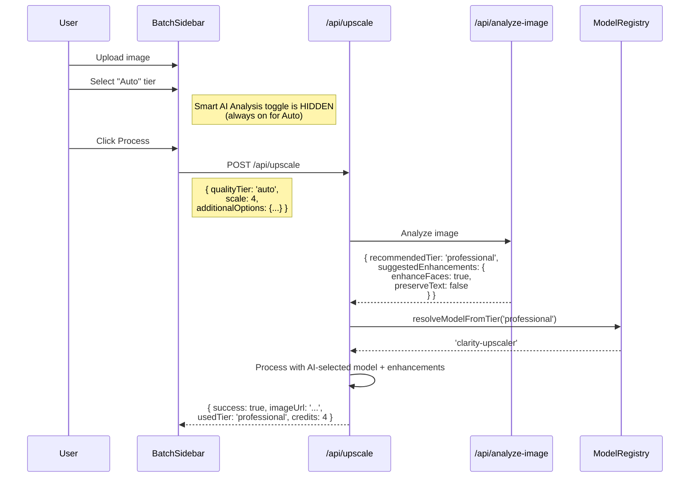
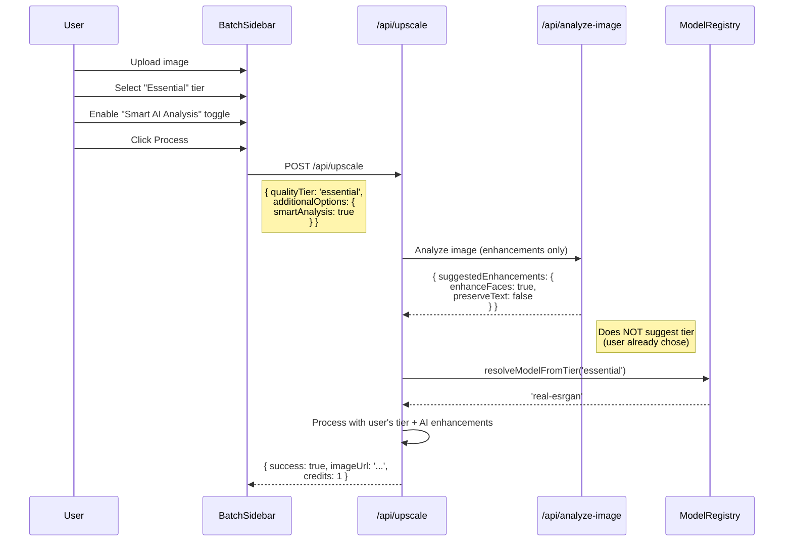
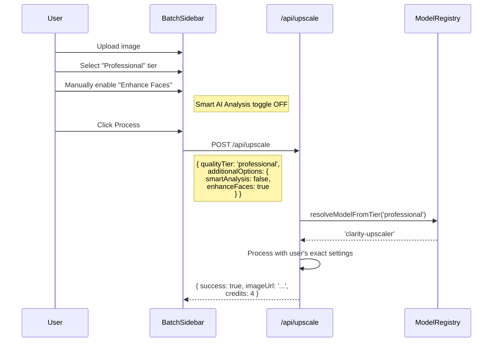
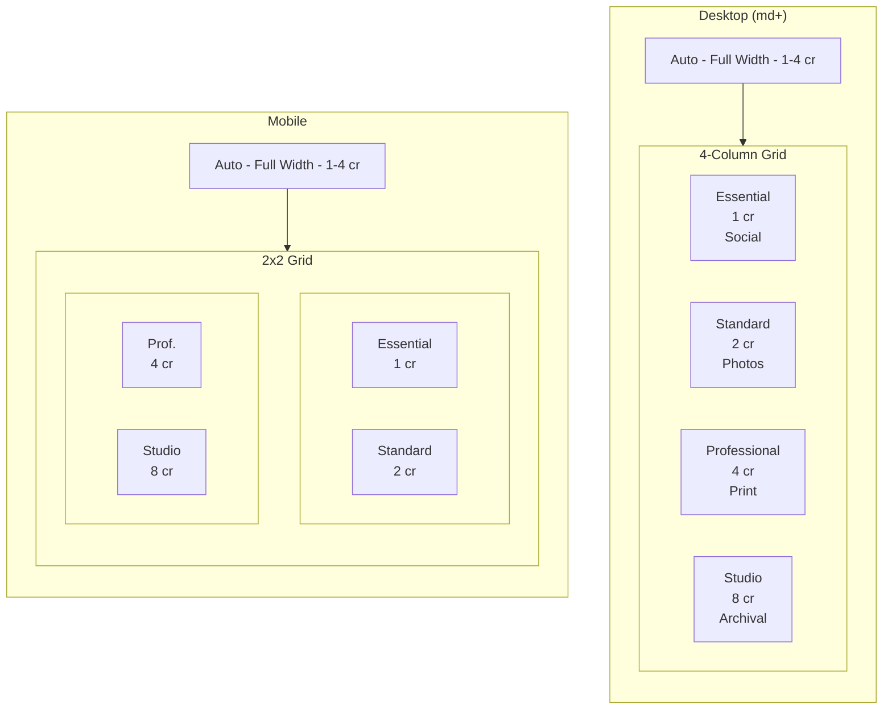
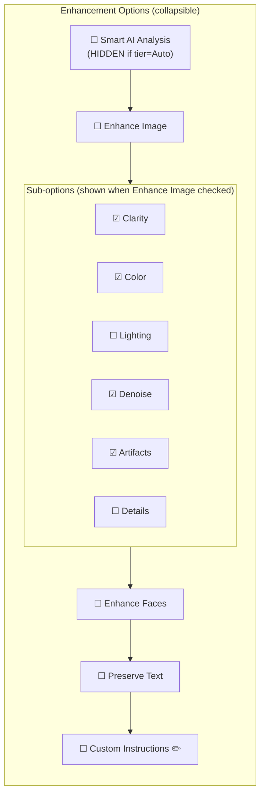
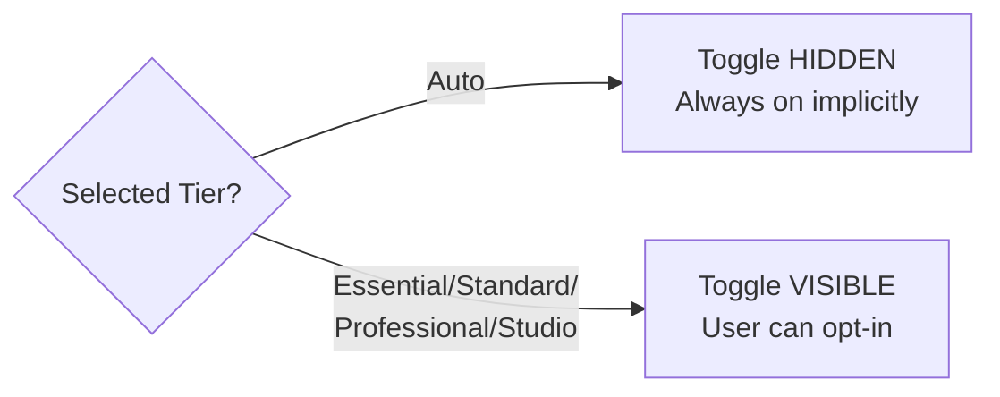
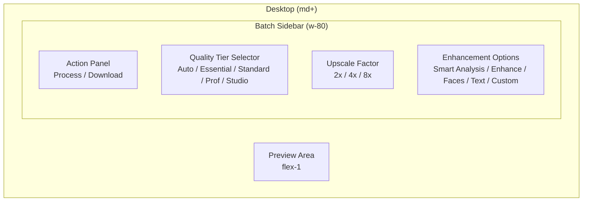
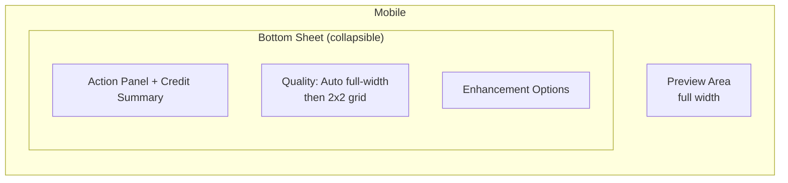

# PRD: Outcome-Based UI/API Flow Refactor

**Version:** 1.0
**Status:** Draft
**Date:** December 17, 2025
**Author:** Principal Architect

---

## Executive Summary

Refactor the core image processing flow from a technical, mode-based interface to an outcome-based UI centered on **Quality Tiers**. This simplifies the user experience by eliminating the redundant "Operation Mode" selector and reframing "AI Model" selection as intuitive quality levels.

### Key Changes

| Before                                            | After                                                                     |
| ------------------------------------------------- | ------------------------------------------------------------------------- |
| Operation Mode: Upscale / Enhance / Both / Custom | **Removed** - Always upscale + default enhancements (user can toggle off) |
| AI Model: real-esrgan, gfpgan, etc.               | Quality Tier: Essential / Standard / Professional / Studio                |
| Custom mode for custom instructions               | Additional Option: Custom Instructions (modal)                            |
| Enhance mode for enhancements                     | Additional Option: Enhance Image (toggle)                                 |
| enhanceFace / preserveText toggles                | User-controlled toggles (AI suggests when smartAnalysis enabled)          |

### Cleanup Summary

**DELETE (after migration complete):**

- `ModeSelector.tsx` component ✅ Deleted
- `ModelSelector.tsx` component ✅ Deleted

**DEPRECATED (kept for backward compatibility during migration):**

- `ProcessingMode` type - still used by legacy credit cost calculation
- `mode` field - still referenced by some processors
- Mode-based utility functions in `subscription.utils.ts` - kept for gradual migration

**ADD:**

- `QualityTier` type (`auto | essential | standard | professional | studio`)
- `QUALITY_TIER_CONFIG` with full metadata per tier (including `smartAnalysisAlwaysOn` flag)
- `IAdditionalOptions` interface with `smartAnalysis` toggle
- `QualityTierSelector.tsx` component (Auto + 4 explicit tiers)
- `EnhancementOptions.tsx` component (Smart AI Analysis toggle hidden for Auto tier)
- `CustomInstructionsModal.tsx` component

**KEEP (refactored):**

- AI analysis functionality via `LLMImageAnalyzer` (called directly in `/api/upscale` for performance, not via separate endpoint)

---

## 1. Context Analysis

### 1.1 Files Analyzed

```
/home/joao/projects/myimageupscaler.com/shared/types/myimageupscaler.com.ts
/home/joao/projects/myimageupscaler.com/client/components/features/workspace/BatchSidebar.tsx
/home/joao/projects/myimageupscaler.com/client/components/features/workspace/BatchSidebar/ModeSelector.tsx
/home/joao/projects/myimageupscaler.com/client/components/features/workspace/BatchSidebar/ModelSelector.tsx
/home/joao/projects/myimageupscaler.com/client/components/features/workspace/BatchSidebar/EnhancementPanel.tsx
/home/joao/projects/myimageupscaler.com/client/components/features/workspace/BatchSidebar/FeatureToggles.tsx
/home/joao/projects/myimageupscaler.com/client/components/features/workspace/Workspace.tsx
/home/joao/projects/myimageupscaler.com/client/hooks/myimageupscaler.com/useBatchQueue.ts
/home/joao/projects/myimageupscaler.com/app/api/upscale/route.ts
/home/joao/projects/myimageupscaler.com/app/api/analyze-image/route.ts
/home/joao/projects/myimageupscaler.com/server/services/model-registry.ts
/home/joao/projects/myimageupscaler.com/shared/config/subscription.utils.ts
```

### 1.2 Component & Dependency Overview

```mermaid
graph TD
    subgraph UI["Current UI Components"]
        A[BatchSidebar] --> B[ModeSelector]
        A --> C[ModelSelector]
        A --> D[EnhancementPanel]
        A --> E[FeatureToggles]
        A --> F[UpscaleFactorSelector]
    end

    subgraph Types["Shared Types"]
        G[ProcessingMode] --> H["upscale|enhance|both|custom"]
        I[ModelId] --> J["real-esrgan|gfpgan|..."]
        K[IUpscaleConfig] --> G
        K --> I
    end

    subgraph API["API Layer"]
        L[/api/upscale] --> M[model-registry.ts]
        N[/api/analyze-image] --> M
        L --> O[Image Processors]
    end

    A --> K
    L --> K
```

### 1.3 Current Behavior Summary

- **Operation Mode** is a 4-option toggle: `upscale`, `enhance`, `both`, `custom`
- Default mode is `both`, making other modes rarely used
- `custom` mode enables a textarea for LLM prompt instructions
- **AI Model** selector shows technical model names with credit costs
- `enhanceFace` and `preserveText` are manual toggles (no auto-detection applied)
- API accepts `mode` and `selectedModel` as separate parameters
- Credit cost calculation depends on both mode and model

### 1.4 Problem Statement

The current UI presents technical implementation details (modes, model names) instead of user-desired outcomes, creating friction and confusion for non-technical users.

---

## 2. Proposed Solution

### 2.1 Architecture Summary

1. **Replace Operation Mode with implicit behavior**: Always perform upscaling; enhancements become opt-in via Additional Options
2. **Rename AI Model to Quality Tier**: Present outcome-focused labels (Essential, Standard, Professional, Studio) instead of technical model names
3. **Consolidate enhancements**: Move enhancement toggles to an "Additional Options" expandable section
4. **Smart Analysis toggle**: When enabled (or Auto tier), AI suggests enhancements; suggestions merge with user selections via OR logic
5. **Custom Instructions as modal**: Checkbox in Additional Options opens a modal for custom LLM prompts

**Alternatives Considered:**

1. **Keep modes, just rename** - Rejected: Doesn't solve the fundamental UX issue
2. **Wizard-style flow** - Rejected: Over-engineering for simple use case
3. **Auto-only (no quality choice)** - Rejected: Power users want control over credit spend

### 2.2 Architecture Diagram

```mermaid
flowchart TB
    subgraph NewUI["New BatchSidebar Structure"]
        A[Quality Tier Selector] --> A1["Auto (1-4 cr)"]
        A --> B["Essential (1 cr)"]
        A --> C["Standard (2 cr)"]
        A --> D["Professional (4 cr)"]
        A --> E["Studio (8 cr)"]

        F[Upscale Factor] --> G[2x / 4x / 8x]

        H[Enhancement Options]
        H --> H1["☐ Smart AI Analysis (hidden if Auto)"]
        H --> I["☐ Enhance Image"]
        H --> J["☐ Enhance Faces"]
        H --> K["☐ Preserve Text"]
        H --> L["☐ Custom Instructions"]

        I --> M[EnhancementPanel]
        L --> N[CustomInstructionsModal]
    end

    subgraph API["Updated API Contract"]
        O[IUpscaleConfig] --> P[qualityTier: QualityTier]
        O --> Q[scale: 2|4|8]
        O --> R[additionalOptions: IAdditionalOptions]
    end

    NewUI --> O
```

### 2.3 Key Technical Decisions

| Decision            | Choice                                       | Rationale                                                                               |
| ------------------- | -------------------------------------------- | --------------------------------------------------------------------------------------- |
| Quality tier naming | Essential / Standard / Professional / Studio | Use-case focused names that hint at intended purpose without implying speed differences |
| Enhancement toggles | Always visible, user-controlled              | Avoids fragile client-side detection; users explicitly opt-in to features they want     |
| Custom instructions | Modal (not inline)                           | Reduces sidebar clutter, better UX for multi-line input                                 |
| Old config handling | **Delete entirely**                          | No deprecated fields; clean codebase over backward compat                               |
| Migration strategy  | One-time refactor                            | All usages updated in single PR; no gradual migration                                   |

### 2.4 Data Model Changes

**New Types (`shared/types/myimageupscaler.com.ts`):**

```typescript
// NEW: Quality tier replaces model selection in UI
export type QualityTier = 'auto' | 'essential' | 'standard' | 'professional' | 'studio';

// Quality tier metadata for UI display
export const QUALITY_TIER_CONFIG: Record<
  QualityTier,
  {
    label: string;
    credits: number | 'variable';
    modelId: ModelId | null; // null for 'auto' - determined by AI
    description: string;
    bestFor: string;
    smartAnalysisAlwaysOn: boolean; // True for 'auto' tier
  }
> = {
  auto: {
    label: 'Auto',
    credits: 'variable', // 1-4 depending on AI recommendation (Studio tier excluded)
    modelId: null,
    description: 'AI picks the best quality tier and enhancements',
    bestFor: 'When you want optimal results without choosing',
    smartAnalysisAlwaysOn: true, // Always analyzes, no toggle shown
  },
  essential: {
    label: 'Essential',
    credits: 1,
    modelId: 'real-esrgan',
    description: 'Fast upscaling with good quality',
    bestFor: 'Social media, quick shares, previews',
    smartAnalysisAlwaysOn: false,
  },
  standard: {
    label: 'Standard',
    credits: 2,
    modelId: 'gfpgan',
    description: 'Balanced quality with face enhancement',
    bestFor: 'Photos, portraits, everyday images',
    smartAnalysisAlwaysOn: false,
  },
  professional: {
    label: 'Professional',
    credits: 4,
    modelId: 'clarity-upscaler',
    description: 'High detail preservation, fine textures',
    bestFor: 'Print-ready images, client work, e-commerce',
    smartAnalysisAlwaysOn: false,
  },
  studio: {
    label: 'Studio',
    credits: 8,
    modelId: 'nano-banana-pro',
    description: 'Maximum quality, 4K/8K output, AI enhancement',
    bestFor: 'Large format prints, professional retouching, archival',
    smartAnalysisAlwaysOn: false,
  },
};

// Convenience accessors (backward compat)
export const QUALITY_TIER_MODEL_MAP: Record<QualityTier, ModelId> = Object.fromEntries(
  Object.entries(QUALITY_TIER_CONFIG).map(([k, v]) => [k, v.modelId])
) as Record<QualityTier, ModelId>;

export const QUALITY_TIER_CREDITS: Record<QualityTier, number> = Object.fromEntries(
  Object.entries(QUALITY_TIER_CONFIG).map(([k, v]) => [k, v.credits])
) as Record<QualityTier, number>;

// NEW: Additional options (replaces mode + toggles)
export interface IAdditionalOptions {
  smartAnalysis: boolean; // AI suggests enhancements (hidden when tier='auto')
  enhance: boolean; // Enable enhancement processing (expands sub-options)
  enhanceFaces: boolean; // Face restoration - user opt-in
  preserveText: boolean; // Text preservation - user opt-in
  customInstructions?: string; // Custom LLM prompt (opens modal when enabled)
  enhancement?: IEnhancementSettings; // Detailed enhancement settings
}

// Updated config interface (replaces IUpscaleConfig entirely)
export interface IUpscaleConfig {
  qualityTier: QualityTier;
  scale: 2 | 4 | 8;
  additionalOptions: IAdditionalOptions;
  // Studio tier specific (only for 'studio' tier)
  nanoBananaProConfig?: INanoBananaProConfig;
}
```

**Types to DELETE:**

```typescript
// DELETE: ProcessingMode type
export type ProcessingMode = 'upscale' | 'enhance' | 'both' | 'custom';

// DELETE: Old IUpscaleConfig fields
- mode: ProcessingMode
- selectedModel: 'auto' | ModelId
- enhanceFace: boolean      // → additionalOptions.enhanceFaces
- preserveText: boolean     // → additionalOptions.preserveText
- customPrompt?: string     // → additionalOptions.customInstructions
```

---

## 2.5 Runtime Execution Flow

### Flow A: Auto Tier (Smart AI Analysis always on)



### Flow B: Explicit Tier + Optional Smart Analysis



### Flow C: Explicit Tier, No Smart Analysis



---

## 3. Detailed Implementation Spec

### A. `shared/types/myimageupscaler.com.ts`

**Changes Needed:**

- Add `QualityTier` type
- Add `QUALITY_TIER_MODEL_MAP` constant
- Add `QUALITY_TIER_CREDITS` constant
- Add `IAdditionalOptions` interface
- Add `IUpscaleConfigV2` interface
- Mark old fields as `@deprecated`

**Justification:** Central type definitions enable type-safe refactoring across client and server.

---

### B. `client/components/features/workspace/BatchSidebar/QualityTierSelector.tsx` (NEW)

**Purpose:** Replace both ModeSelector and ModelSelector with outcome-focused UI

```typescript
export interface IQualityTierSelectorProps {
  tier: QualityTier;
  onChange: (tier: QualityTier) => void;
  disabled?: boolean;
  isFreeUser?: boolean;
}

// Visual design (IMPLEMENTED as dropdown for sidebar space efficiency):
// - Dropdown selector showing current tier with "Best for" hint
// - Opens to show all 5 tiers: Auto + 4 explicit tiers
// - Each option shows: Tier name + credit cost + description
// - Professional/Studio show lock icon for free users with upgrade prompt
// - Auto tier shows "Recommended" badge
```

**Options:**

| Tier         | Label        | Credits | Best For                         | Description (tooltip)                                                  |
| ------------ | ------------ | ------- | -------------------------------- | ---------------------------------------------------------------------- |
| auto         | Auto         | 1-4     | Optimal results without choosing | AI picks the best tier and enhancements (excludes Studio to cap costs) |
| essential    | Essential    | 1       | Social media, quick shares       | Fast upscaling with good quality                                       |
| standard     | Standard     | 2       | Photos, portraits                | Balanced quality with face enhancement                                 |
| professional | Professional | 4       | Print-ready, client work         | High detail preservation, fine textures                                |
| studio       | Studio       | 8       | Large prints, archival           | Maximum quality, 4K/8K output, AI enhancement                          |

**Auto Tier Special Behavior:**

- When selected, Smart AI Analysis toggle is **hidden** in Enhancement Options
- Credit cost shown as "1-4" (variable based on AI recommendation, Studio excluded)
- After processing, response includes `usedTier` to show what was actually used

**Justification:** Single component replacing two; Auto tier preserves "hands-off" experience for casual users.

---

### C. `client/components/features/workspace/BatchSidebar/EnhancementOptions.tsx` (NEW)

**Purpose:** Always-visible section containing enhancement toggles (replaces hidden "Additional Options")

```typescript
export interface IEnhancementOptionsProps {
  options: IAdditionalOptions;
  onChange: (options: IAdditionalOptions) => void;
  onOpenCustomInstructions: () => void;
  selectedTier: QualityTier; // Needed to conditionally hide Smart AI Analysis
  disabled?: boolean;
}

// Structure (IMPLEMENTED as collapsible to reduce sidebar clutter):
// Smart AI Analysis card (visible when tier !== 'auto')
// "Smart Analysis Active" indicator (visible when tier === 'auto')
// Collapsible "Additional Enhancements" section:
//   ☐ Enhance Image → expands sub-options when checked
//   ☐ Enhance Faces → simple toggle
//   ☐ Preserve Text → simple toggle
//   ☐ Custom Instructions → opens modal when checked
```

**Smart AI Analysis Toggle Behavior:**

| Selected Tier                          | Toggle Visibility | Behavior                                               |
| -------------------------------------- | ----------------- | ------------------------------------------------------ |
| Auto                                   | **Hidden**        | Always on - AI picks tier + enhancements               |
| Essential/Standard/Professional/Studio | **Visible**       | When enabled, AI suggests enhancements only (not tier) |

**Design Rationale:**

- Smart AI Analysis hidden for Auto because it's redundant (always on)
- For explicit tiers, users can opt-in to AI enhancement suggestions
- All other toggles in collapsible "Additional Enhancements" section for clean UI
- "Enhance Image" expands to show sub-options (Clarity, Color, etc.) when enabled

**Justification:** Consolidates scattered toggles into logical group; Smart AI Analysis toggle only shown when meaningful.

---

### D. `client/components/features/workspace/BatchSidebar/CustomInstructionsModal.tsx` (NEW)

**Purpose:** Modal for entering custom LLM instructions

```typescript
export interface ICustomInstructionsModalProps {
  isOpen: boolean;
  onClose: () => void;
  instructions: string;
  onSave: (instructions: string) => void;
  placeholderPrompt: string;
}

// Features:
// - Large textarea for multi-line input
// - "Load Template" button (same as current)
// - Character count
// - Save / Cancel buttons
// - ESC to close
```

**Justification:** Better UX than inline textarea; modal focuses user attention.

---

### E. `client/components/features/workspace/BatchSidebar.tsx` (UPDATE)

**Changes Needed:**

- Remove `ModeSelector` import and usage
- Replace `ModelSelector` with `QualityTierSelector`
- Add `EnhancementOptions` component (always visible)
- Add `CustomInstructionsModal` component
- Update config state to use new `IUpscaleConfig`

**Updated Structure:**

```tsx
<div className="batch-sidebar">
  {/* Header - unchanged */}

  {/* Action Panel - unchanged */}

  {/* Processing Options */}
  <QualityTierSelector
    tier={config.qualityTier}
    onChange={handleTierChange}
    disabled={isProcessing}
    isFreeUser={isFreeUser}
  />

  <UpscaleFactorSelector ... /> {/* unchanged */}

  <EnhancementOptions
    options={config.additionalOptions}
    onChange={handleOptionsChange}
    onOpenCustomInstructions={() => setShowCustomModal(true)}
    selectedTier={config.qualityTier}  // Pass tier to conditionally hide Smart AI Analysis
    disabled={isProcessing}
  />

  {/* Studio tier specific config */}
  {config.qualityTier === 'studio' && (
    <NanoBananaProSettings ... />
  )}

  <CustomInstructionsModal
    isOpen={showCustomModal}
    onClose={() => setShowCustomModal(false)}
    instructions={config.additionalOptions.customInstructions ?? ''}
    onSave={handleSaveCustomInstructions}
  />
</div>
```

---

### F. `shared/config/subscription.utils.ts` (UPDATE)

**Add functions:**

```typescript
export function getCreditsForTier(tier: QualityTier): number {
  return QUALITY_TIER_CONFIG[tier].credits;
}

export function getModelForTier(tier: QualityTier): ModelId {
  return QUALITY_TIER_CONFIG[tier].modelId;
}

export function getTierConfig(tier: QualityTier) {
  return QUALITY_TIER_CONFIG[tier];
}
```

**Functions to DELETE:**

```typescript
// DELETE: Any functions referencing ProcessingMode or old config shape
- getCreditsForMode()
- calculateCostByMode()
- any mode-based logic
```

---

### G. `app/api/upscale/route.ts` (UPDATE)

**Changes Needed:**

- Replace old schema with new `IUpscaleConfig` schema
- Remove all `mode` and `selectedModel` handling
- Handle Auto tier + Smart AI Analysis logic

```typescript
// New schema (replaces old entirely)
const upscaleConfigSchema = z.object({
  qualityTier: z.enum(['auto', 'essential', 'standard', 'professional', 'studio']),
  scale: z.union([z.literal(2), z.literal(4), z.literal(8)]),
  additionalOptions: z.object({
    smartAnalysis: z.boolean(),
    enhance: z.boolean(),
    enhanceFaces: z.boolean(),
    preserveText: z.boolean(),
    customInstructions: z.string().optional(),
    enhancement: enhancementSettingsSchema.optional(),
  }),
  nanoBananaProConfig: nanoBananaProConfigSchema.optional(),
});

// In handler:
let resolvedTier: QualityTier;
let resolvedEnhancements: Partial<IAdditionalOptions>;

if (config.qualityTier === 'auto') {
  // Auto tier: Always run AI analysis for tier + enhancements
  const analysis = await analyzeImage(imageFile);
  resolvedTier = analysis.recommendedTier;
  resolvedEnhancements = analysis.suggestedEnhancements;
} else if (config.additionalOptions.smartAnalysis) {
  // Explicit tier + Smart Analysis: AI suggests enhancements only
  const analysis = await analyzeImage(imageFile, { suggestTier: false });
  resolvedTier = config.qualityTier;
  resolvedEnhancements = analysis.suggestedEnhancements;
} else {
  // Explicit tier, no Smart Analysis: Use user's exact settings
  resolvedTier = config.qualityTier;
  resolvedEnhancements = config.additionalOptions;
}

const modelId = getModelForTier(resolvedTier);
const credits = getCreditsForTier(resolvedTier);

// Process with resolved settings
// Return usedTier in response so UI can show what was actually used (for Auto)
return { success: true, imageUrl, usedTier: resolvedTier, credits };
```

**Code to DELETE:**

- All `ProcessingMode` switch statements
- All `selectedModel === 'auto'` branches
- Legacy config migration code

---

### H. Files to DELETE

```
client/components/features/workspace/BatchSidebar/ModeSelector.tsx
client/components/features/workspace/BatchSidebar/ModelSelector.tsx  (if separate)
```

**Justification:** Replaced by `QualityTierSelector` + `EnhancementOptions`.

---

## 4. Step-by-Step Execution Plan

### Phase 1: Types & Config (Shared Layer)

- [ ] Add `QualityTier` type to `myimageupscaler.com.ts` (includes `'auto'`)
- [ ] Add `QUALITY_TIER_CONFIG` constant with `smartAnalysisAlwaysOn` flag
- [ ] Add `IAdditionalOptions` interface with `smartAnalysis` field
- [ ] **Replace** `IUpscaleConfig` interface (not add new one)
- [ ] **Delete** `ProcessingMode` type
- [ ] **Delete** old fields: `mode`, `selectedModel`, `enhanceFace`, `preserveText`, `customPrompt`
- [ ] Add utility functions to `subscription.utils.ts`
- [ ] **Delete** mode-based utility functions

### Phase 2: New UI Components

- [ ] Create `QualityTierSelector.tsx` (Auto + 4 explicit tiers)
- [ ] Create `EnhancementOptions.tsx` (Smart AI Analysis toggle, hidden for Auto)
- [ ] Create `CustomInstructionsModal.tsx`
- [ ] Write unit tests for new components

### Phase 3: BatchSidebar Refactor

- [ ] Update `BatchSidebar.tsx` to use new components
- [ ] Pass `selectedTier` to `EnhancementOptions` for conditional rendering
- [ ] Update `Workspace.tsx` default config to new format
- [ ] **Delete** `ModeSelector.tsx`
- [ ] **Delete** `ModelSelector.tsx` (if separate)
- [ ] Remove all `mode` references from UI
- [ ] Test full UI flow (all 3 flows: Auto, Explicit+SmartAnalysis, Explicit)

### Phase 4: API Refactor

- [ ] **Replace** `/api/upscale` schema entirely (no backward compat)
- [ ] Implement 3-branch logic: Auto / Explicit+SmartAnalysis / Explicit
- [ ] Update `/api/analyze-image` to accept `{ suggestTier: boolean }` option
- [ ] Return `usedTier` in response for Auto tier
- [ ] Update credit calculation to use tier-based
- [ ] Fix all TypeScript errors from removed types
- [ ] Update integration tests for all 3 flows

### Phase 5: Cleanup & Verify

- [ ] Search codebase for any remaining `ProcessingMode` references
- [ ] Search for any remaining `selectedModel` references
- [ ] Run full test suite
- [ ] Run `yarn verify`
- [ ] Update ROADMAP.md

---

## 5. Testing Strategy

### Unit Tests

**QualityTierSelector:**

- Renders Auto tier (full width) + 4 explicit tiers (grid)
- Shows "1-4 credits" for Auto tier (Studio tier excluded from auto-selection)
- Shows correct credit costs and "Best for" hints for explicit tiers
- Disables Professional/Studio for free users with upgrade prompt
- Calls onChange with correct tier value
- Tooltip shows full description on hover

**EnhancementOptions:**

- Smart AI Analysis toggle **hidden** when `selectedTier === 'auto'`
- Smart AI Analysis toggle **visible** for all other tiers
- All other toggles in collapsible section (expand to access)
- Toggles control all options correctly
- "Enhance Image" expands sub-options when enabled
- Custom instructions checkbox triggers modal callback

**getTierConfig / getCreditsForTier / getModelForTier:**

- Returns correct config for each tier
- Returns `null` modelId for Auto tier
- Returns `'variable'` credits for Auto tier
- Returns correct modelId for explicit tiers

### Integration Tests

**Flow A: Auto Tier**

- Upload → Select Auto → Process
- Verify AI analysis called with `suggestTier: true`
- Verify response includes `usedTier` showing what AI picked
- Verify credits match the resolved tier

**Flow B: Explicit Tier + Smart AI Analysis**

- Upload → Select Essential → Enable Smart AI Analysis → Process
- Verify AI analysis called with `suggestTier: false`
- Verify model is Essential's model (not AI-picked)
- Verify enhancements are AI-suggested

**Flow C: Explicit Tier, Manual Settings**

- Upload → Select Professional → Manually enable Enhance Faces → Process
- Verify NO AI analysis called
- Verify user's exact settings used

**General:**

- Custom instructions modal opens/saves/cancels correctly
- API rejects requests with old config format (clean break)
- Credit deduction matches selected tier

### Edge Cases

| Scenario                                      | Expected Behavior                                        |
| --------------------------------------------- | -------------------------------------------------------- |
| Free user selects Studio                      | Upgrade prompt shown, selection blocked                  |
| Request with old `mode` field                 | API returns 400 validation error                         |
| Auto tier selected                            | Smart AI Analysis toggle hidden in UI                    |
| Auto tier + response                          | Response includes `usedTier` field                       |
| User enables face enhancement on non-portrait | Processing applies face restoration anyway (user choice) |
| Custom instructions with special chars        | Properly escaped and applied                             |
| Studio tier without nanoBananaProConfig       | Uses default NanoBananaPro settings                      |

---

## 6. Acceptance Criteria

### UI

- [ ] BatchSidebar shows Quality Tier selector (Auto/Essential/Standard/Professional/Studio)
- [ ] Auto tier shows "1-4 credits" (variable, Studio excluded)
- [ ] No Operation Mode selector visible
- [ ] No AI Model selector visible
- [ ] Enhancement Options in collapsible section (implemented for sidebar space efficiency)
- [ ] Smart AI Analysis toggle **hidden** when Auto tier selected
- [ ] Smart AI Analysis toggle **visible** for all other tiers
- [ ] Each explicit tier shows credits + "Best for" hint
- [ ] Custom Instructions opens modal (not inline)
- [ ] Free users see upgrade prompt for Professional/Studio

### API

- [ ] `/api/upscale` accepts new `IUpscaleConfig` format only
- [ ] `/api/upscale` rejects old `mode` + `selectedModel` format with 400 error
- [ ] Auto tier triggers AI analysis with `suggestTier: true`
- [ ] Explicit tier + smartAnalysis triggers AI analysis with `suggestTier: false`
- [ ] Explicit tier without smartAnalysis skips AI analysis
- [ ] Response includes `usedTier` for Auto tier
- [ ] Credit calculation correct for all tiers

### Codebase Cleanup

- [ ] No `ProcessingMode` type exists
- [ ] No `selectedModel` field exists
- [ ] No `mode` field exists in config
- [ ] `ModeSelector.tsx` deleted
- [ ] All tests updated to new format

### Testing

- [ ] All tests pass (updated for new format)
- [ ] New component tests pass
- [ ] E2E tests for all 3 flows pass (Auto, Explicit+SmartAnalysis, Explicit)

---

## 7. Verification & Rollback

### Success Criteria

- User confusion metrics decrease (support tickets about "which mode")
- Conversion funnel improves (fewer drop-offs at settings)
- No increase in processing errors

### Rollback Plan

**This is a breaking change with no backward compatibility.**

**If issues found post-deploy:**

1. Git revert the entire PR
2. Redeploy previous version
3. All changes are atomic - no partial rollback needed

**Pre-deploy verification:**

1. Full test suite passes
2. Manual QA on staging
3. Verify no external API consumers (internal app only)

---

## 8. UI/UX Design Specifications

### 8.1 Quality Tier Selector Design

**Layout Structure:**



**Visual States:**

- **Default**: `border-slate-200 bg-white text-slate-600`
- **Selected**: `border-indigo-600 bg-indigo-50 text-indigo-700 ring-2 ring-indigo-500`
- **Disabled**: `opacity-50 cursor-not-allowed`
- **Locked (free user)**: `border-amber-200 bg-amber-50` with lock icon overlay (Professional/Studio)

**Responsive Breakpoints:**

- Mobile: Auto full-width, then 2x2 grid (`grid-cols-2`)
- Tablet+: Auto full-width, then 4-column row (`md:grid-cols-4`)

---

### 8.2 Enhancement Options Section Design

**IMPLEMENTED: Collapsible for sidebar space efficiency.**

**Component Structure:**



**Smart AI Analysis Visibility Logic:**



**Design Rationale:**

- Smart AI Analysis hidden for Auto (redundant - always on)
- All other options visible by default for feature discovery
- No auto-detection badges - user explicitly opts in
- "Enhance Image" sub-options only show when parent is checked

**Component Specifications:**

| Element           | Desktop       | Mobile                |
| ----------------- | ------------- | --------------------- |
| Section padding   | `p-4`         | `p-3`                 |
| Toggle row height | `44px`        | `48px` (touch target) |
| Enhancement grid  | `grid-cols-3` | `grid-cols-2`         |
| Checkboxes        | `w-4 h-4`     | `w-5 h-5`             |
| Font size         | `text-sm`     | `text-sm`             |

---

### 8.3 Custom Instructions Modal Design

**Desktop (centered modal):**

```
┌───────────────────────────────────────────────────────────┐
│                                                     ✕     │
│   Custom Instructions                                     │
│   ─────────────────────────────────────────────────────   │
│   Tell the AI exactly how to process your image          │
│                                                           │
│   ┌───────────────────────────────────────────────────┐   │
│   │                                                   │   │
│   │  Enhance this image while preserving the...      │   │
│   │                                                   │   │
│   │                                                   │   │
│   │                                                   │   │
│   └───────────────────────────────────────────────────┘   │
│   256 / 2000 characters                                   │
│                                                           │
│   ┌──────────────┐                                        │
│   │ Load Template│                                        │
│   └──────────────┘                                        │
│                                                           │
│                           ┌─────────┐  ┌─────────────┐    │
│                           │ Cancel  │  │    Save     │    │
│                           └─────────┘  └─────────────┘    │
└───────────────────────────────────────────────────────────┘
```

**Mobile (bottom sheet):**

```
┌─────────────────────────────┐
│   ━━━                       │  ← drag handle
│   Custom Instructions       │
│   ─────────────────────────│
│   ┌─────────────────────────┐
│   │                         │
│   │  Enter your custom...   │
│   │                         │
│   │                         │
│   └─────────────────────────┘
│   128 / 2000 chars          │
│                             │
│   [Load Template]           │
│                             │
│   ┌───────────┐┌───────────┐│
│   │  Cancel   ││   Save    ││
│   └───────────┘└───────────┘│
└─────────────────────────────┘
```

**Behavior:**

- Desktop: `max-w-lg` centered modal with backdrop blur
- Mobile: Bottom sheet that slides up, `max-h-[80vh]`
- Textarea: `min-h-[200px]` desktop, `min-h-[150px]` mobile
- Close on ESC (desktop) or swipe down (mobile)

---

### 8.4 BatchSidebar Responsive Layout

**Desktop Layout:**



**Mobile Layout:**



**Mobile Sidebar Behavior:**

- Default: Collapsed, shows only action buttons + summary
- Tap header or drag up: Expands to show all options
- Max height: `60vh` when expanded
- Smooth spring animation on expand/collapse
- Backdrop dims preview area when expanded

---

### 8.5 Touch Target & Accessibility

**Minimum Touch Targets (WCAG 2.2):**

| Element        | Size               | Notes                          |
| -------------- | ------------------ | ------------------------------ |
| Tier buttons   | `48px` height      | Full width on mobile           |
| Checkboxes     | `48x48px` tap area | Visual checkbox can be smaller |
| Action buttons | `48px` height      | Primary CTA is full width      |
| Modal close    | `44x44px`          | Corner X button                |

**Accessibility Requirements:**

- All interactive elements focusable with keyboard
- `aria-pressed` on toggle buttons
- `aria-expanded` on collapsible sections
- `aria-describedby` for tier descriptions
- `role="dialog"` + `aria-modal` for custom instructions modal
- Color contrast ratio ≥ 4.5:1 for all text

---

### 8.6 Animation & Micro-interactions

**Quality Tier Selection:**

```css
/* Transition on selection */
transition: all 150ms ease-out;

/* Selected state */
transform: scale(1.02);
box-shadow: 0 0 0 2px theme(colors.indigo.500);
```

**Additional Options Expand:**

```css
/* Smooth height transition */
transition: max-height 200ms ease-out;

/* Content fade in */
.content {
  animation: fadeIn 150ms ease-out 50ms both;
}
```

**Mobile Bottom Sheet:**

```css
/* Spring animation for natural feel */
transition: transform 300ms cubic-bezier(0.32, 0.72, 0, 1);
```

**Processing State:**

- Subtle pulse on action button during processing
- Progress bar with gradient animation
- Skeleton loading for tier buttons when loading user data

---

### 8.7 Responsive Component Summary

| Component               | Desktop                    | Mobile                     |
| ----------------------- | -------------------------- | -------------------------- |
| QualityTierSelector     | 4-col grid                 | 2x2 grid                   |
| UpscaleFactorSelector   | 3-col row                  | 3-col row (unchanged)      |
| EnhancementOptions      | Full width, always visible | Full width, always visible |
| CustomInstructionsModal | Centered modal             | Bottom sheet               |
| BatchSidebar            | Fixed 320px left           | Bottom collapsible panel   |
| ActionPanel             | Fixed in sidebar           | Fixed at panel top         |

---

### 8.8 Implementation: Responsive Components

**QualityTierSelector.tsx:**

```tsx
const { auto, ...explicitTiers } = QUALITY_TIER_CONFIG;

return (
  <div className="space-y-2">
    {/* Auto tier - full width */}
    <button
      className={cn(
        'w-full flex items-center justify-between',
        'py-3 px-4 rounded-lg border-2 transition-all',
        selected === 'auto'
          ? 'border-indigo-600 bg-indigo-50 text-indigo-700'
          : 'border-slate-200 bg-white text-slate-600 hover:bg-slate-50'
      )}
      title={auto.description}
    >
      <span className="font-semibold">{auto.label}</span>
      <span className="text-sm text-slate-500">1-4 credits</span>
    </button>

    {/* Explicit tiers - grid */}
    <div className="grid grid-cols-2 md:grid-cols-4 gap-2">
      {Object.entries(explicitTiers).map(([id, tier]) => (
        <button
          key={id}
          className={cn(
            'flex flex-col items-center justify-center',
            'py-3 px-2 rounded-lg border-2 transition-all',
            'min-h-[72px] md:min-h-[80px]',
            selected === id
              ? 'border-indigo-600 bg-indigo-50 text-indigo-700'
              : 'border-slate-200 bg-white text-slate-600 hover:bg-slate-50'
          )}
          title={tier.description}
        >
          <span className="font-semibold text-sm">{tier.label}</span>
          <span className="text-xs text-slate-500">
            {tier.credits} {tier.credits === 1 ? 'credit' : 'credits'}
          </span>
          <span className="text-[10px] text-slate-400 mt-0.5">{tier.bestFor.split(',')[0]}</span>
        </button>
      ))}
    </div>
  </div>
);
```

**EnhancementOptions.tsx (Smart AI Analysis visibility):**

```tsx
const showSmartAnalysis = selectedTier !== 'auto';

return (
  <div className="space-y-3">
    {showSmartAnalysis && (
      <Toggle
        label="Smart AI Analysis"
        description="AI suggests optimal enhancements"
        checked={options.smartAnalysis}
        onChange={checked => onChange({ ...options, smartAnalysis: checked })}
      />
    )}
    {/* Rest of toggles... */}
  </div>
);
```

**Mobile Bottom Sheet (BatchSidebar):**

```tsx
// Use @radix-ui/react-dialog or similar for sheet behavior
<Sheet>
  <SheetTrigger asChild>
    <div className="md:hidden fixed bottom-0 left-0 right-0 bg-white border-t">
      {/* Collapsed view */}
    </div>
  </SheetTrigger>
  <SheetContent side="bottom" className="max-h-[60vh]">
    {/* Full settings */}
  </SheetContent>
</Sheet>

// Desktop: regular sidebar
<aside className="hidden md:flex w-80 ...">
  {/* Full settings */}
</aside>
```

---

## 9. Migration Notes

### For Existing Users

- Stored preferences will be reset to defaults (new config shape)
- No action required from users - UI just looks simpler

### For API Consumers

- **Breaking change**: Old format no longer accepted
- This is an internal app - no external API consumers
- If local storage has old config, clear and use defaults

---

**Document End**

_Generated: December 17, 2025_
_Review Required: Product & Engineering_
