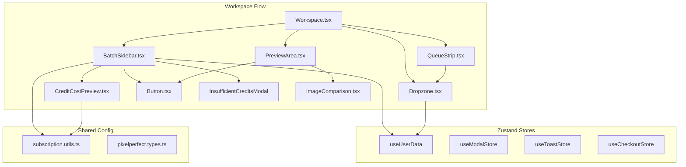
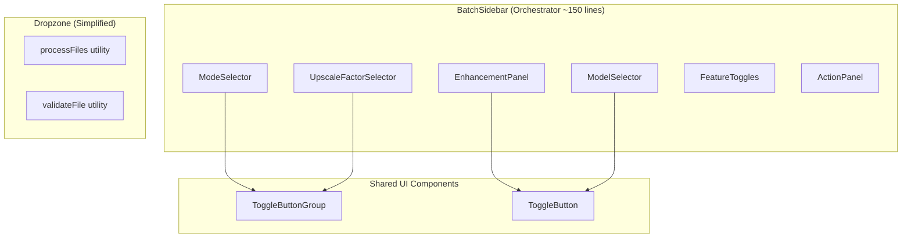
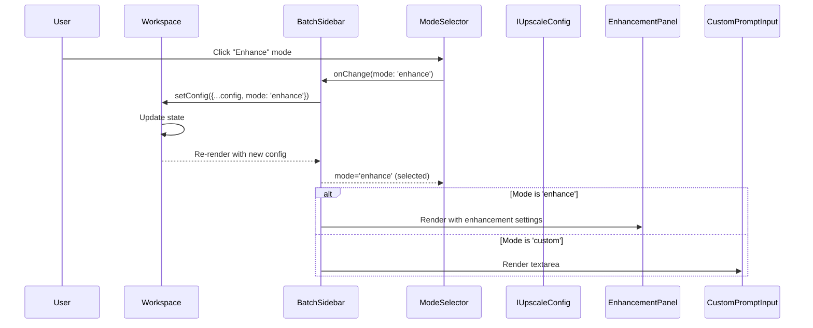

# PixelPerfect Components Refactoring Plan

## Context Analysis

### 1.1 Files Analyzed

```
/home/joao/projects/pixelperfect/client/components/pixelperfect/
  ├── Button.tsx (72 lines)
  ├── Dropzone.tsx (228 lines)
  ├── FileSizeUpgradePrompt.tsx (54 lines)
  ├── ImageComparison.tsx (146 lines)
  ├── Pricing.tsx (163 lines)
  ├── Landing/Features.tsx (123 lines)
  ├── Landing/CTASection.tsx (50 lines)
  ├── Landing/HowItWorks.tsx (82 lines)
  ├── Workspace/Workspace.tsx (139 lines)
  ├── Workspace/BatchSidebar.tsx (516 lines) ** CRITICAL **
  ├── Workspace/CreditCostPreview.tsx (85 lines)
  ├── Workspace/PreviewArea.tsx (93 lines)
  ├── Workspace/QueueStrip.tsx (109 lines)
  └── Workspace/UpgradeSuccessBanner.tsx (78 lines)

/home/joao/projects/pixelperfect/shared/config/
  └── subscription.utils.ts (698 lines)
```

**Total: 14 components, ~2,599 lines of code**

### 1.2 Component & Dependency Overview



### 1.3 Current Behavior Summary

- **BatchSidebar** (516 lines): Monolithic component handling mode selection, enhancement settings, model selection, nano-banana-pro config, upscale factors, toggles, credit preview, and action buttons
- **Dropzone** (228 lines): File upload with duplicate validation logic in `handleDrop` and `handleFileInput`
- **All components**: Use default exports despite project preference for named exports
- **Console.log statements**: Present in `BatchSidebar` (lines 113-125) and `CreditCostPreview` (lines 30-40)
- **Button patterns**: Repeated toggle/selection buttons with similar className patterns across BatchSidebar

### 1.4 Problem Statement

The `BatchSidebar` component violates SRP by handling 8+ distinct responsibilities in 516 lines, while `Dropzone` has ~60% code duplication in file handlers, making both components difficult to test, maintain, and extend.

---

## 2. Proposed Solution

### 2.1 Architecture Summary

1. **Decompose BatchSidebar** into focused sub-components: `ModeSelector`, `EnhancementPanel`, `ModelSelector`, `UpscaleFactorSelector`, `FeatureToggles`, `ActionPanel`
2. **Extract reusable ToggleButton/ButtonGroup** component to eliminate repeated button patterns
3. **Consolidate file validation** in Dropzone into a single `processFiles` handler
4. **Convert all components** to named exports per project standards
5. **Remove console.log** statements from production components

**Alternatives Considered:**

- **Full rewrite**: Rejected - too risky; incremental refactoring is safer
- **Keep as-is with comments**: Rejected - doesn't solve maintainability issues
- **Extract to custom hooks only**: Rejected - UI concerns need component extraction, not just logic

### 2.2 Architecture Diagram (After Refactoring)



### 2.3 Key Technical Decisions

| Decision                               | Rationale                                                      |
| -------------------------------------- | -------------------------------------------------------------- |
| Extract `ToggleButtonGroup` component  | Eliminates 5+ instances of repeated button grid patterns       |
| Keep config state in `Workspace`       | Maintains single source of truth; sub-components receive props |
| Create `processFiles` utility function | DRY - removes ~40 lines of duplicate validation code           |
| Named exports throughout               | Aligns with `CLAUDE.md` conventions for better tree-shaking    |
| No new dependencies                    | Reuse existing patterns (lucide-react icons, Tailwind classes) |

### 2.4 Data Model Changes

**No Data Changes.** This is purely a UI refactoring.

---

### 2.5 Runtime Execution Flow



---

## 3. Detailed Implementation Spec

### A. `client/components/pixelperfect/ui/ToggleButtonGroup.tsx` (NEW)

**Purpose:** Reusable toggle button group for mode selection, scale selection, format selection.

```typescript
export interface IToggleOption<T extends string> {
  value: T;
  label: string;
  icon?: React.ElementType;
  description?: string;
}

export interface IToggleButtonGroupProps<T extends string> {
  options: IToggleOption<T>[];
  value: T;
  onChange: (value: T) => void;
  disabled?: boolean;
  columns?: 2 | 3 | 4;
  size?: 'sm' | 'md';
}

export const ToggleButtonGroup = <T extends string>({
  options,
  value,
  onChange,
  disabled,
  columns = 2,
  size = 'md',
}: IToggleButtonGroupProps<T>): JSX.Element => {
  // Render grid of toggle buttons
  // Selected state: 'border-indigo-600 bg-indigo-50 text-indigo-700'
  // Unselected state: 'border-slate-200 text-slate-600 hover:bg-slate-50'
};
```

**Justification:** Eliminates ~100 lines of repeated button patterns across BatchSidebar (mode selection, resolution, format).

---

### B. `client/components/pixelperfect/Workspace/BatchSidebar/ModeSelector.tsx` (NEW)

**Purpose:** Handle operation mode selection (upscale, enhance, both, custom).

```typescript
export interface IModeSelectorProps {
  mode: ProcessingMode;
  onChange: (mode: ProcessingMode) => void;
  disabled?: boolean;
}

export const ModeSelector: React.FC<IModeSelectorProps> = ({
  mode,
  onChange,
  disabled,
}) => {
  const MODE_OPTIONS: IToggleOption<ProcessingMode>[] = [
    { value: 'upscale', label: 'Upscale', icon: ArrowUpCircle },
    { value: 'enhance', label: 'Enhance', icon: Sparkles },
    { value: 'both', label: 'Both', icon: Layers },
    { value: 'custom', label: 'Custom', icon: Edit },
  ];

  return (
    <div>
      <label className="text-sm font-medium text-slate-700 mb-3 block">
        Operation Mode
      </label>
      <ToggleButtonGroup
        options={MODE_OPTIONS}
        value={mode}
        onChange={onChange}
        disabled={disabled}
        columns={2}
      />
    </div>
  );
};
```

**Justification:** Isolates mode selection logic (~35 lines) into a testable, reusable component.

---

### C. `client/components/pixelperfect/Workspace/BatchSidebar/EnhancementPanel.tsx` (NEW)

**Purpose:** Enhancement aspect toggles when mode is 'enhance'.

```typescript
export interface IEnhancementPanelProps {
  settings: IEnhancementSettings;
  onChange: (settings: IEnhancementSettings) => void;
  disabled?: boolean;
}

export const EnhancementPanel: React.FC<IEnhancementPanelProps> = ({
  settings,
  onChange,
  disabled,
}) => {
  // Render ENHANCEMENT_ASPECTS grid
  // Toggle individual aspects on click
};
```

**Justification:** Encapsulates enhancement UI (~45 lines) with clear props interface.

---

### D. `client/components/pixelperfect/Workspace/BatchSidebar/ModelSelector.tsx` (NEW)

**Purpose:** AI model dropdown with nano-banana-pro configuration panel.

```typescript
export interface IModelSelectorProps {
  selectedModel: 'auto' | ModelId;
  nanoBananaProConfig: INanoBananaProConfig;
  onModelChange: (model: 'auto' | ModelId) => void;
  onNanoBananaProConfigChange: (config: INanoBananaProConfig) => void;
  disabled?: boolean;
}

export const ModelSelector: React.FC<IModelSelectorProps> = props => {
  // Render model dropdown
  // Conditionally render NanoBananaProConfig when model === 'nano-banana-pro'
};
```

**Justification:** Isolates model selection + ultra settings (~100 lines) into a focused component.

---

### E. `client/components/pixelperfect/Workspace/BatchSidebar/UpscaleFactorSelector.tsx` (NEW)

**Purpose:** Scale factor selection (2x, 4x, 8x).

```typescript
export interface IUpscaleFactorSelectorProps {
  scale: 2 | 4 | 8;
  onChange: (scale: 2 | 4 | 8) => void;
  disabled?: boolean;
}

export const UpscaleFactorSelector: React.FC<IUpscaleFactorSelectorProps> = ({
  scale,
  onChange,
  disabled,
}) => {
  const SCALE_OPTIONS = [
    { value: 2, label: '2x' },
    { value: 4, label: '4x' },
    { value: 8, label: '8x' },
  ];

  return (
    <div>
      <label className="text-sm font-medium text-slate-700 mb-3 block">
        Upscale Factor
      </label>
      <ToggleButtonGroup
        options={SCALE_OPTIONS}
        value={scale}
        onChange={onChange}
        disabled={disabled}
        columns={3}
      />
    </div>
  );
};
```

**Justification:** Simple, focused component (~25 lines).

---

### F. `client/components/pixelperfect/Workspace/BatchSidebar/FeatureToggles.tsx` (NEW)

**Purpose:** Text preservation and face enhancement toggles.

```typescript
export interface IFeatureTogglesProps {
  preserveText: boolean;
  enhanceFace: boolean;
  onPreserveTextChange: (value: boolean) => void;
  onEnhanceFaceChange: (value: boolean) => void;
  disabled?: boolean;
}

export const FeatureToggles: React.FC<IFeatureTogglesProps> = props => {
  // Render two checkbox labels with icons
};
```

**Justification:** Isolates toggle UI (~35 lines) with explicit props.

---

### G. `client/components/pixelperfect/Workspace/BatchSidebar/ActionPanel.tsx` (NEW)

**Purpose:** Process, download, and clear buttons.

```typescript
export interface IActionPanelProps {
  queue: IBatchItem[];
  isProcessing: boolean;
  completedCount: number;
  totalCost: number;
  currentBalance: number;
  onProcess: () => void;
  onDownloadAll: () => void;
  onClear: () => void;
}

export const ActionPanel: React.FC<IActionPanelProps> = props => {
  // Render CreditCostPreview
  // Render Process, Download, Clear buttons
};
```

**Justification:** Centralizes action button logic (~60 lines).

---

### H. `client/components/pixelperfect/Workspace/BatchSidebar.tsx` (REFACTOR)

**Changes Needed:**

- Import and compose new sub-components
- Remove inline UI code for mode selection, enhancement, model, scale, toggles, actions
- Keep orchestration logic (credit calculation, modal state, handlers)

**Target:** Reduce from 516 lines to ~150 lines.

```typescript
export const BatchSidebar: React.FC<IBatchSidebarProps> = (props) => {
  const router = useRouter();
  const { totalCredits } = useUserData();
  const [showInsufficientModal, setShowInsufficientModal] = useState(false);

  // Credit calculation logic (keep as-is)
  // Handler functions (keep as-is)

  return (
    <div className="...">
      <Header queueLength={queue.length} />

      <div className="space-y-6 flex-grow overflow-y-auto">
        <ModeSelector mode={config.mode} onChange={handleModeChange} disabled={isProcessing} />

        {config.mode === 'enhance' && (
          <EnhancementPanel settings={config.enhancement} onChange={handleEnhancementChange} />
        )}

        {config.mode === 'custom' && (
          <CustomPromptInput value={config.customPrompt} onChange={handlePromptChange} />
        )}

        <ModelSelector {...modelSelectorProps} />

        {(config.mode === 'upscale' || config.mode === 'both') && (
          <UpscaleFactorSelector scale={config.scale} onChange={handleScaleChange} />
        )}

        <FeatureToggles {...toggleProps} />
      </div>

      <ActionPanel {...actionProps} />

      <InsufficientCreditsModal {...modalProps} />
    </div>
  );
};
```

---

### I. `client/utils/file-validation.ts` (NEW)

**Purpose:** Extract file validation logic from Dropzone.

```typescript
export interface IFileValidationResult {
  valid: boolean;
  reason?: 'type' | 'size';
}

export interface IProcessFilesResult {
  validFiles: File[];
  oversizedFiles: File[];
  invalidTypeFiles: File[];
  errorMessage: string | null;
}

export function validateImageFile(file: File, isPaidUser: boolean): IFileValidationResult {
  const validTypes = ['image/jpeg', 'image/png', 'image/webp'];
  if (!validTypes.includes(file.type)) {
    return { valid: false, reason: 'type' };
  }
  const maxSize = isPaidUser ? IMAGE_VALIDATION.MAX_SIZE_PAID : IMAGE_VALIDATION.MAX_SIZE_FREE;
  if (file.size > maxSize) {
    return { valid: false, reason: 'size' };
  }
  return { valid: true };
}

export function processFiles(files: File[], isPaidUser: boolean): IProcessFilesResult {
  const results = files.map(f => ({ file: f, result: validateImageFile(f, isPaidUser) }));
  const validFiles = results.filter(r => r.result.valid).map(r => r.file);
  const oversizedFiles = results
    .filter(r => !r.result.valid && r.result.reason === 'size')
    .map(r => r.file);
  const invalidTypeFiles = results
    .filter(r => !r.result.valid && r.result.reason === 'type')
    .map(r => r.file);

  let errorMessage: string | null = null;
  if (validFiles.length !== files.length) {
    const maxMB = isPaidUser ? 25 : 5;
    errorMessage = `Some files were rejected. Only JPG, PNG, WEBP under ${maxMB}MB are allowed.`;
  }

  return { validFiles, oversizedFiles, invalidTypeFiles, errorMessage };
}
```

**Justification:** DRY - consolidates ~60 lines of duplicate code into ~35 lines of reusable utility.

---

### J. `client/components/pixelperfect/Dropzone.tsx` (REFACTOR)

**Changes Needed:**

- Import `processFiles` from `@client/utils/file-validation`
- Replace duplicate validation logic in `handleDrop` and `handleFileInput`
- Convert to named export

**Before (duplicate code in handleDrop and handleFileInput):**

```typescript
const validationResults = droppedFiles.map(f => ({ file: f, result: validateFile(f) }));
const validFiles = validationResults.filter(r => r.result.valid).map(r => r.file);
const oversizedFiles = validationResults.filter(r => !r.result.valid && r.result.reason === 'size');
// ... same logic repeated in handleFileInput
```

**After:**

```typescript
const handleFilesReceived = useCallback(
  (files: File[]) => {
    const { validFiles, oversizedFiles, errorMessage } = processFiles(files, isPaidUser);

    if (oversizedFiles.length > 0 && !isPaidUser) {
      setShowSizeUpgradePrompt(true);
      setOversizedFile(oversizedFiles[0]);
      setError(null);
    } else if (errorMessage) {
      setError(errorMessage);
    } else {
      setError(null);
    }

    if (validFiles.length > 0) {
      onFilesSelected(validFiles);
    }
  },
  [isPaidUser, onFilesSelected]
);

const handleDrop = useCallback(
  (e: React.DragEvent) => {
    e.preventDefault();
    setIsDragging(false);
    if (disabled) return;
    handleFilesReceived(Array.from(e.dataTransfer.files));
  },
  [disabled, handleFilesReceived]
);

const handleFileInput = useCallback(
  (e: React.ChangeEvent<HTMLInputElement>) => {
    handleFilesReceived(Array.from(e.target.files || []));
  },
  [handleFilesReceived]
);
```

---

### K. All Components - Named Exports

**Changes Needed:** Convert all components from default to named exports.

**Before:**

```typescript
const Button: React.FC<IButtonProps> = (props) => { ... };
// eslint-disable-next-line import/no-default-export
export default Button;
```

**After:**

```typescript
export const Button: React.FC<IButtonProps> = (props) => { ... };
```

**Files to update:**

- `Button.tsx`
- `Dropzone.tsx`
- `FileSizeUpgradePrompt.tsx`
- `ImageComparison.tsx`
- `Pricing.tsx`
- `Landing/Features.tsx`
- `Landing/CTASection.tsx`
- `Landing/HowItWorks.tsx`
- `Workspace/Workspace.tsx`
- `Workspace/BatchSidebar.tsx`
- `Workspace/PreviewArea.tsx`
- `Workspace/QueueStrip.tsx`
- `Workspace/UpgradeSuccessBanner.tsx`

---

### L. Remove Console.log Statements

**Files:**

- `BatchSidebar.tsx` (lines 113-125): Remove debug useEffect
- `CreditCostPreview.tsx` (lines 30-40): Remove console.log

---

## 4. Step-by-Step Execution Plan

### Phase 1: Foundation (Shared Components)

- [ ] Create `client/components/pixelperfect/ui/` directory
- [ ] Implement `ToggleButtonGroup.tsx` (~50 lines)
- [ ] Implement `ToggleButton.tsx` if needed (~30 lines)
- [ ] Create `client/utils/file-validation.ts` (~35 lines)
- [ ] Run `yarn verify`

### Phase 2: BatchSidebar Decomposition

- [ ] Create `Workspace/BatchSidebar/` subdirectory
- [ ] Implement `ModeSelector.tsx` (~40 lines)
- [ ] Implement `EnhancementPanel.tsx` (~50 lines)
- [ ] Implement `ModelSelector.tsx` (~80 lines)
- [ ] Implement `UpscaleFactorSelector.tsx` (~30 lines)
- [ ] Implement `FeatureToggles.tsx` (~40 lines)
- [ ] Implement `ActionPanel.tsx` (~60 lines)
- [ ] Create `index.ts` barrel export
- [ ] Refactor `BatchSidebar.tsx` to use new components
- [ ] Remove console.log from `BatchSidebar.tsx`
- [ ] Run `yarn verify`

### Phase 3: Dropzone Refactoring

- [ ] Refactor `Dropzone.tsx` to use `processFiles` utility
- [ ] Remove duplicate validation code
- [ ] Run `yarn verify`

### Phase 4: Export Cleanup

- [ ] Convert all 14 components to named exports
- [ ] Update all import statements across codebase
- [ ] Remove `CreditCostPreview.tsx` console.log
- [ ] Run `yarn verify`

### Phase 5: Final Verification

- [ ] Run full test suite
- [ ] Manual smoke test of workspace flow
- [ ] Verify no regressions in UI behavior

---

## 5. Testing Strategy

### Unit Tests

| Component           | Test Cases                                            |
| ------------------- | ----------------------------------------------------- |
| `ToggleButtonGroup` | Renders options, handles selection, disabled state    |
| `ModeSelector`      | Mode changes propagate to parent                      |
| `ModelSelector`     | Dropdown selection, nano-banana-pro config visibility |
| `processFiles`      | Valid files, oversized files, invalid type files      |

### Integration Tests

- Full workspace flow: upload -> configure -> process -> download
- Mode switching triggers correct UI panels
- Insufficient credits modal appears when needed

### Edge Cases

| Scenario                        | Expected Behavior                           |
| ------------------------------- | ------------------------------------------- |
| All files oversized (free user) | Show upgrade prompt, no valid files passed  |
| Mixed valid/invalid files       | Process valid files, show error for invalid |
| Rapid mode switching            | No race conditions, UI stays consistent     |
| Empty queue + process click     | Button disabled, no action                  |

---

## 6. Acceptance Criteria

- [ ] `BatchSidebar.tsx` reduced from 516 lines to < 200 lines
- [ ] Zero code duplication in `Dropzone.tsx` file handlers
- [ ] All 14 components use named exports
- [ ] No `console.log` statements in production components
- [ ] `yarn verify` passes (lint, types, tests, build)
- [ ] All existing E2E tests pass
- [ ] No visual regressions in workspace UI

---

## 7. Verification & Rollback

### Success Criteria

- `yarn verify` passes
- Bundle size delta < 5KB (should be similar or smaller)
- No new TypeScript errors
- E2E tests green

### Rollback Plan

1. Git revert to commit before refactoring
2. No database migrations involved
3. No feature flags needed - pure refactoring
